# PRD: Capture Mode

Author: Vinny Pasceri

Status: draft

Companion files: the journeys are in [prd-capture-mode-journeys.md](prd-capture-mode-journeys.md), the shipping copy in [prd-capture-mode-copy.md](prd-capture-mode-copy.md), the answers to closed open questions in [prd-capture-mode-oq-results.md](prd-capture-mode-oq-results.md), and the owner's decisions in [prd-capture-mode-fences.md](prd-capture-mode-fences.md).

# Background

SpectroCapture's value is quick bulk capture of colour with a spectrophotometer, and this document holds every requirement for that experience. The use cases it serves and the features that serve them are defined in the [vision doc](../vision.md#use-cases): U1, bulk-digitize a predefined inventory, and U2, capture a single new item ad hoc. The diagram below is the life of one queue row.

```mermaid
stateDiagram-v2
    state "Pending" as Pending
    state "Captured" as Captured
    state "Deferred (set aside for review)" as Deferred

    [*] --> Pending: imported, or added ad hoc
    Pending --> Pending: skip (navigation only, row not attempted, revisited when the queue wraps)
    Pending --> Captured: N samples agree or the operator accepts the average, every sample kept, row confirmed
    Pending --> Deferred: K_FAILED_ATTEMPTS failures, a disagreeing set skipped, Skip after a failed attempt or mid-set, or the operator flagged the row
    Captured --> Deferred: the operator flags the row just captured, its reading kept as history
    Deferred --> Captured: re-scan succeeds (end-of-session review or any later session)
    Deferred --> Deferred: settled (deliberately left; counts as adjudicated)
    Captured --> Captured: re-scan, new canonical value, prior reading kept as version history
```

## User Journeys

Every journey — UJ1–UJ5, their clusters, and the five flow diagrams — is in [prd-capture-mode-journeys.md](prd-capture-mode-journeys.md). UJ3, the bulk session this document exists for, is repeated here in short.

**UJ3. Run a bulk capture session.**

1. I start a capture session on my collection. It opens at the row I was last on.
2. The pre-flight gate runs — battery, calibration, authorization, storage, and the muted-audio advisory.
3. The session starts. I see the current row's code and name, where I am in the queue, the sample counter, my tallies, and the last few rows I captured.
4. I put the instrument on the swatch and trigger a scan.
5. The instrument measures.
6. I hear and feel "sample 1 of N" without looking up.
7. I lift, reposition slightly, and press again until the set is done. I touch nothing on the Mac in between.
8. The set is complete and the app checks that my samples agree.
9. Every reading is saved and the average worked out from them, and only then do I get the row-success confirmation. The queue advances on its own and the row joins my recents.
10. Steps 4–9 repeat, row after row. I never type, never confirm a dialog, and never look at the screen to know the last row landed.
11. The queue is exhausted, and any swatch still set aside and unsettled goes to the end-of-session review.
12. Session complete. The summary shows my counts, my elapsed time, and the way to the collection.

## Requirements

### Vocabulary

The terms the rows below use ([AGENTS.md §8](../../../AGENTS.md#8-vocabulary)).

- **Pending** — a queue row with no confirmed reading yet.
- **Captured** — a row with a canonical value.
- **Deferred** — a row set aside for review because a reading failed, the samples disagreed, or the operator flagged it; the dead-letter state ([§8](#8-deferred-row-review-and-corrections)).
- **Settled** — a set-aside row the operator deliberately left, one at a time or all at once, at the review. A settled row counts as dealt with: it does not open the review again and it does not stop a collection being finished, and it can still be scanned again by choice (fence F31 as clarified, [§8](#8-deferred-row-review-and-corrections)). A set-aside row that has not had that decision is **unsettled**.
- **Skip** — navigation past a pending row without attempting it. Not a state: the row stays pending ([§6](#6-queue-navigation-and-reordering)).
- **Session** — one collection's run of capture, with a status and an elapsed time; a **one-row session** is its single-item form ([§3](#3-the-capture-session)).
- **A live bulk session** — a bulk session on the collection that is under way and neither paused, held by the guard or by the instrument, nor interrupted; a one-row session is never one, and whether one is on the collection is what decides how the set-aside list opens, decided when that list opens and holding until it closes ([§8](#8-deferred-row-review-and-corrections)).
- **The remembered row** — the row the collection last had the operator on; every session opens there ([§3](#3-the-capture-session), fence F15).

### Legend

**Priority**

Priority is build order within v1, not a cut line — everything in this document ships in v1: P0 is the first build phase and P1 the second, and there is no third. Owner-confirmed split: fence F24. A P0 state that offers an action whose rows are P1 — "Re-scan", "Add a swatch", a mid-session reorder — is shown in the first build without that action, the offer arriving with those rows, so [R11.12](#11-demo-device-and-verifiability)'s states, [R11.15](#11-demo-device-and-verifiability)'s surface lists and [R7.19](#7-pause-end-interruption-and-resume)'s entry points are asserted per phase. P0 is the bulk critical path — collections, import, the session, the scan loop, per-scan failure and the guard, queue navigation by find and skip, pause, end, interruption and resume, the deferred-row review, the Demo Device rows, the seam rows ([§10](#10-the-seam-capture-to-collection), fence F25), and the version-history record shape ([R8.13](#8-deferred-row-review-and-corrections)). P1 is the correction path — the re-scan rows in [§8](#8-deferred-row-review-and-corrections) — ad-hoc capture and one-row sessions ([§9](#9-ad-hoc-capture-and-one-row-sessions)), and the reordering rows in [§6](#6-queue-navigation-and-reordering).

Provisional constants: every TBD-on-spike constant is a named provisional constant carrying its candidate value, here or in its [Open Questions](#open-questions) entry, and its Open Questions id; mechanisms build against these constants, and no provisional constant ships in a release without its OQ resolved. A dogfood build is not a release for that rule (fence F23) — that is what lets the first dogfood sessions run on candidate values and produce the data those questions need. DEMO_SCAN_CYCLE is the one constant whose candidate is a measurement rather than a number named here: the device PRD's OQ 10 supplies it. An "OQ n" written without a qualifier is this document's; the device PRD's are named as its own.

**For the engineering plan.** These are the plan's to answer, not this document's.

- Five constants sit at "candidate TBD": FIND_BUDGET and IMPORT_BUDGET (OQ 13), RESULT_CUE_LATENCY and ROW_CONFIRM_BUDGET (OQ 5), DEMO_SCAN_CYCLE (OQ 22).
- P0 rows that defer, in whole or in part, to an open question with no interim rule: [R1.3](#1-collections) (OQ 9), [R1.5](#1-collections) (OQ 21: only the selectable pair list has no interim rule), [R1.2](../import/prd-inventory-import.md#1-reading-the-file) (the import PRD's OQ 1), [R4.17](#4-the-scan-loop) (OQ 14); [R4.15](#4-the-scan-loop) and [R8.1](#8-deferred-row-review-and-corrections) likewise wait on OQ 8's placement half.
- Phase-0 predecessors: ADR-0003, the module-layout ADR, the device-PRD amendment carrying OQ 16's notes, and the stale seam gate in two places — the [decision queue](../../decisions/README.md#decision-queue)'s note and its second copy in the [product README](../README.md#authoring-order). The Data Foundation and Collection Mode PRDs this document hands obligations to are not yet written.
- The hardware spike's scope (OQ 1, 2, 4, 5, 21, 22 and the device PRD's OQ 10 and OQ 20) and the dogfood entry point (OQ 3, 6, 12, 23, 25) are work the plan defines.
- [§10](#10-the-seam-capture-to-collection)'s two-reading prototype needs a build order.

**Retired row IDs.** Retired under fence F46 and never reused: R4.25, R7.4, R7.6, R7.10, R8.11, R10.2, R11.1, R11.2, R11.4, R11.9. Retired under F49, never reused: R2.1–R2.14, R11.15h; E4–E14, E38, E40 (moved to the [inventory-import PRD](../import/prd-inventory-import.md)).

**Status**

A status cell in this document and in the [copy file](prd-capture-mode-copy.md#error--state-copy) holds one of the six values below and nothing else; which round a row was last edited in lives in the [review log](../../agent-reviews/2026-09-06-prd-capture-mode-peer-reviews.md). The [Open Questions](#open-questions) table has its own two values, open and answered.

- ⌛️ Ready for Alignment - Waiting for cross-functional team to align on requirements
- ✋ Needs Discussion - Cross-functional team needs to discuss with PM
- 🤝 Aligned - Cross-functional team aligned on the requirement
- 🦺 In Progress - Implementation in flight (Optional status)
- ✅ Completed - Implementation completed & merged. PR # & link added in the "Commit PR" column.
- ✂️ Deferred - Deferred from current release

### Traceability

Three row-ID families, one per dispositionable table, all under one rule: an ID is assigned once and never renumbered — a row that is cut or deferred keeps its ID rather than freeing it for reuse.

- Every requirement row in [§1](#1-collections) and [§3](#3-the-capture-session) through [§11](#11-demo-device-and-verifiability) carries an ID of the form `R<section>.<n>` — for example `R4.7`.
- Every state row in the [copy file](prd-capture-mode-copy.md#error--state-copy) carries an ID of the form `E<n>`.
- Every metric row in [Success Metrics](#success-metrics) carries an ID of the form `M<n>`.

Two rows carry a lettered sub-family — a lead row plus a table whose rows are lettered cells of that row: [R8.1](#8-deferred-row-review-and-corrections) with `R8.1a`–`R8.1k`, and [R11.15](#11-demo-device-and-verifiability) with `R11.15a`–`R11.15h`.

The Commit PR column is where a row maps onto the work that lands it. Owner decisions F1–F48 are recorded in the [fence file](prd-capture-mode-fences.md), with their amendments and clarifications; where a row names one it is for provenance only, and no row re-argues one. Which rows carry each fence is that file's "Fence → row map".

### Surfaces

Where the capture surface lives relative to the collection surface is the seam, and it is not decided here ([§10](#10-the-seam-capture-to-collection)). This table names every capture-owned surface, and [R11.15](#11-demo-device-and-verifiability)'s table uses these names.

| Surface | Shows | The [copy](prd-capture-mode-copy.md#error--state-copy) states in this surface's flow — its entry offer and its cancel notice included |
| :--- | :--- | :--- |
| Collection surface | The collection's rows and its counts — captured / deferred / pending — and the entry points to start a session, import ([inventory-import PRD](../import/prd-inventory-import.md)), add an item, review the set-aside swatches, and re-scan a row | Duplicate collection name; nothing to capture; instrument held by another collection; resume capture; collection unavailable; re-scan offered; QC or correction ‹QC & Comparison PRD› |
| Session-summary state | A completed session's counts, its elapsed capture time, its items-per-hour, and the rows deliberately left set aside where there are any, shown on the collection surface ([R7.15](#7-pause-end-interruption-and-resume)) | Session complete |
| Re-scan surface | The row being re-scanned, with the value it already has not among what it shows ([R8.7](#8-deferred-row-review-and-corrections)); reached from the collection surface, or from the capture surface mid-session | Re-scan offered; QC or correction ‹QC & Comparison PRD›; samples disagree; samples let go |
| Capture surface | The current row, the position in the queue, the sample counter, the session tallies, the recents strip, the always-visible simulated indicator, and the non-spectral indicator while a session runs without spectral data | Light leaked in; out of temperature range; moved on; samples disagree; guard paused; flag has nothing to demote; nothing to undo; re-take unavailable; samples let go; paused; wrap exhausted; end early; every halt state (device PRD §5); simulated readings; scanning without spectral data; re-scan offered; QC or correction ‹QC & Comparison PRD› |
| Queue list and find field | The queue in queue order, and the find field, both opened from the capture surface by a keyboard action | No matching row; matched on an alternate; reorder refused; sort over a manual order |
| Set-aside list | Every set-aside row with its cause, how many attempts were made, how many samples it kept, and — where the operator left it set aside for good — that decision and its note | Leave one swatch set aside; leave every remaining swatch set aside; samples disagree; guard paused; samples let go |
| Add-a-swatch form | The metadata fields for a new swatch, reached from the collection or from the capture surface mid-session | Duplicate code (adding an item); code required; add a swatch cancelled |

### 1. Collections

Traces [UJ1](prd-capture-mode-journeys.md#uj-1-create-a-collection), [UJ1.2](prd-capture-mode-journeys.md#uj-12-manage-collections--rename-delete); serves [U1](../vision.md#use-cases).

#### As a Cataloger, I can create a collection to capture into so that my swatch book has one place to land.

| ID | Release | Pri | Requirement | Status | Commit PR |
| :--- | :--- | :--- | :--- | :--- | :--- |
| R1.1 | v1 | P0 | Creating a collection is an explicit user action and ends with the collection ready and its queue empty; collections are flat, with no library above them. "Start capture session" is offered once the collection holds at least one pending or set-aside row. | 🤝 Aligned |  |
| R1.2 | v1 | P0 | A collection name is required and must be unique among the user's collections under the one matching rule ([R2.3](../import/prd-inventory-import.md#2-target-mapping-and-the-matching-rule)); a duplicate shows [E1](prd-capture-mode-copy.md#error--state-copy) and the collection is not created. A test can create two collections whose names differ only in letter case or in spacing, observe the second refused, and read back one collection ([R11.11](#11-demo-device-and-verifiability)). | 🤝 Aligned |  |
| R1.3 | v1 | P0 | Samples-per-row is required at creation, arrives pre-filled at 3, accepts 1 to 5, and is the collection's default for every session. It is changeable between sessions; whether it can change mid-session is OQ 9. | 🤝 Aligned |  |
| R1.4 | v1 | P0 | With samples-per-row set to 1 the agreement check ([R4.9](#4-the-scan-loop)) does not run. A test can set a collection to one sample per row and observe no agreement check and no disagreement state. | 🤝 Aligned |  |
| R1.5 | v1 | P0 | Illuminant and observer are optional collection-level display defaults, arrive pre-filled at D50/2°, are never required at creation, and are editable at any time. Changing them never requires a re-scan, never alters a stored reading, and never changes an agreement verdict ([R4.9](#4-the-scan-loop)); which pairs a collection may choose from is the instrument toolkit's reference set, and the exact list, with how a license without spectral data narrows it, is OQ 21. | 🤝 Aligned |  |
| R1.6 | v1 | P0 | The ISO 13655 measurement condition (M0/M1/M2) is a scan mode of the instrument, and which scan modes a capture records is OQ 1. Until OQ 1 closes the app keeps every mode a reading arrives with and uses the collection's chosen scan mode ([R1.10](#1-collections)). | 🤝 Aligned |  |
| R1.7 | v1 | P0 | A collection with nothing pending and no set-aside row still unsettled shows the nothing-to-capture state ([E2](prd-capture-mode-copy.md#error--state-copy)) in one of two variants: empty, or finished — every row captured or deliberately left set aside. A collection with nothing pending and an unsettled set-aside row is not this state: starting capture there opens the set-aside list ([R3.9](#3-the-capture-session)). | 🤝 Aligned |  |
| R1.8 | v1 | P0 | Renaming and deleting a collection belong to Collection Mode, carrying [R1.2](#1-collections)'s name-uniqueness rule, a delete guard that makes an active or interrupted session end first, and a delete warning that names the count of captured rows and their history and offers an export first. Deleting is never the default action. (Inherited obligation for the Collection Mode PRD.) | 🤝 Aligned |  |
| R1.9 | v1 | P0 | A collection's rows, their queue order, its remembered row, and its sessions all live with the collection and nowhere else. A test can start the app from a clean state with only the store file present and read back all four unchanged ([R11.11](#11-demo-device-and-verifiability)); how many store files a user's collections are spread across is OQ 19. (Inherited obligation for the Data Foundation PRD.) | 🤝 Aligned |  |
| R1.10 | v1 | P0 | A collection carries one chosen scan mode — M0, M1, or M2, whichever the instrument's firmware offers (OQ 1) — set at creation beside samples-per-row, arriving pre-filled at M1 on the Spectro 2, and changeable between sessions. It is the mode the agreement check compares ([R4.9](#4-the-scan-loop)) and the mode a colour value is worked out from unless the user asks for another; changing it never asks for a re-scan and never alters a reading already taken, because every mode a reading arrived with is kept ([R4.5](#4-the-scan-loop)). | 🤝 Aligned |  |

### 3. The capture session

Traces [UJ3](prd-capture-mode-journeys.md#uj-3-run-a-bulk-capture-session), [UJ3.5](prd-capture-mode-journeys.md#uj-35-resume-an-interrupted-session); inherits from the [device PRD §5](../device-management/prd-device-management.md#5-mid-session-device-failure) the obligation that a session and its queue survive an app relaunch.

#### As a Cataloger, I can pick a run up where I left it so that a swatch book is one job and not two.

| ID | Release | Pri | Requirement | Status | Commit PR |
| :--- | :--- | :--- | :--- | :--- | :--- |
| R3.1 | v1 | P0 | A capture session belongs to exactly one collection and records the instrument it is using, when it started and ended, its status, and how much capture time has elapsed. Elapsed capture time counts only the stretches in which the session was actually capturing — the operator's pause, the guard's pause, every device halt, time spent in the set-aside list, and the gap between an interruption and its resume are all outside it. (Inherited obligation for the Data Foundation PRD.) | 🤝 Aligned |  |
| R3.2 | v1 | P0 | A session's status is exactly one of active, interrupted, ended, or complete. At most one session is active in the app at a time and a collection holds at most one unresumed interrupted bulk session, though two collections may each hold one. | 🤝 Aligned |  |
| R3.3 | v1 | P0 | The instrument binding is released when the app quits or crashes, so no session outlives the app holding an instrument against another collection. | 🤝 Aligned |  |
| R3.4 | v1 | P0 | A session becomes interrupted only by a quit while capturing or while paused, a crash, a force-quit, or power loss. System sleep is a device halt and the session stays active through it; quitting from a device halt is the device PRD's End session and ends the session instead, while a crash, force-quit, or power loss during a halt does interrupt it. | 🤝 Aligned |  |
| R3.5 | v1 | P0 | Starting capture while another collection's session is active, paused, or halted is refused, naming the collection whose session holds the instrument ([E3](prd-capture-mode-copy.md#error--state-copy)); an interrupted session on another collection holds no instrument and never blocks. Starting capture on a collection whose session is already in flight returns to that session rather than starting a second. | 🤝 Aligned |  |
| R3.6 | v1 | P0 | The remembered row belongs to the collection rather than to a session, and updates every time the queue advances, the operator jumps, an item is inserted, or a row is selected in the end-of-run review ([the state-by-exit table, §8](#8-deferred-row-review-and-corrections)). Nothing else moves it: a detour review and a look through the set-aside list both leave it exactly where it was, as that table sets out. (Inherited obligation for the Data Foundation PRD.) | 🤝 Aligned |  |
| R3.7 | v1 | P0 | Every session on a collection opens at the remembered row, falling back to the next pending row in queue order if that row is no longer pending. Where there is no pending row at all the session opens into the set-aside list while any set-aside row is still unsettled ([R3.9](#3-the-capture-session)), or the nothing-to-capture state when every one of them is settled ([R1.7](#1-collections)); a collection that has never had a session opens at its first pending row. | 🤝 Aligned |  |
| R3.8 | v1 | P0 | A remembered row that was selected in the end-of-run review opens the review at that row rather than falling back, so the operator lands on the swatch they had in hand; which exit that review has is the state-by-exit table's ([§8](#8-deferred-row-review-and-corrections)). The mark holds only while that row is still set aside, and clears as soon as it is captured, deliberately left set aside, or the operator leaves the review. (Inherited obligation for the Data Foundation PRD.) | 🤝 Aligned |  |
| R3.9 | v1 | P0 | A session started on a collection with nothing pending and one or more unsettled set-aside rows runs the pre-flight gate and opens straight into the set-aside list ([§8](#8-deferred-row-review-and-corrections)), so a second day with only set-aside rows is never stranded. | 🤝 Aligned |  |
| R3.10 | v1 | P0 | The first capture action against the queue runs the device PRD's pre-flight gate — battery, calibration currency, authorization window, storage headroom, and the muted-audio advisory — and a blocking check leaves the session unstarted and the queue untouched. Every check runs again every time, and only the presentation of a gate whose checks all pass is suppressed, so a check that has begun to block or advise always surfaces and adding several ad-hoc items in a row does not re-show a passing gate. | 🤝 Aligned |  |
| R3.11 | v1 | P0 | A session binds whichever instrument is connected when it starts, and "one-row session" names exactly two cases: a single capture on a collection with no session open, and one beside an unresumed interrupted bulk session ([R9.7](#9-ad-hoc-capture-and-one-row-sessions)). A capture on a collection whose bulk session is paused is a row inside that session rather than a session of its own ([R9.6](#9-ad-hoc-capture-and-one-row-sessions)), and a one-row session never changes the collection's remembered row ([R3.6](#3-the-capture-session)). | 🤝 Aligned |  |
| R3.13 | v1 | P0 | A one-row session ends itself when its row is captured or set aside, when the attempt is abandoned, or when the operator ends it, and is never left open to block the next bulk session. One that is itself cut short is closed as ended on relaunch and never counts against the one-unresumed-bulk-session rule ([R3.2](#3-the-capture-session)). | 🤝 Aligned |  |
| R3.12 | v1 | P0 | Three named provisional constants set the design scale, all OQ 13: ROWS_TARGET, which applies per collection and per import; ROWS_CEILING; and SESSION_LENGTH, the longest session the design must hold up under. Each is checkable: find and the queue list answer within FIND_BUDGET at ROWS_CEILING; an import of ROWS_TARGET rows commits within IMPORT_BUDGET; and a session held open for SESSION_LENGTH over a queue that outlasts it keeps its tallies, elapsed time, and queue order, and still meets TRIGGER_ACK_WINDOW on its last row. | 🤝 Aligned |  |

### 4. The scan loop

Traces [UJ3](prd-capture-mode-journeys.md#uj-3-run-a-bulk-capture-session), [UJ3.2](prd-capture-mode-journeys.md#uj-32-undo-or-redo-the-current-item); serves [U1](../vision.md#use-cases), queued bulk scan with 1–5 samples averaged.

#### As a Cataloger, I can scan row after row without touching the Mac so that my pace is the instrument's and not the app's.

| ID | Release | Pri | Requirement | Status | Commit PR |
| :--- | :--- | :--- | :--- | :--- | :--- |
| R4.1 | v1 | P0 | The trigger is the instrument's own button where the app can receive it, and otherwise a one-hand keyboard or on-screen trigger. The keyboard and on-screen trigger are the primary path until OQ 2 says otherwise. | 🤝 Aligned |  |
| R4.2 | v1 | P0 | One accepted trigger means exactly one measurement, and a press during the lockout, the operator's pause, the guard's pause, or a device halt asks the instrument for nothing. A test can count the measurements the app asked the device for against the accepted triggers ([R11.5](#11-demo-device-and-verifiability)). | 🤝 Aligned |  |
| R4.3 | v1 | P0 | A trigger press while a scan is in flight is rejected — never queued, never silently dropped — with immediate non-visual feedback, a rejection tone or haptic distinct from success and from caution, and the lockout lasts until the reading in flight returns or fails, however long that is. LOCKOUT_WINDOW is a named provisional constant for any additional dead time that follows the reading (candidate 0.5 s — OQ 4), and a test can hold a reading open, press the trigger repeatedly, and observe every press rejected and no second measurement asked for ([R11.5](#11-demo-device-and-verifiability)). | 🤝 Aligned |  |
| R4.4 | v1 | P0 | No capture shortcut is a bare Space or a bare single letter, and capture shortcuts are live only while the capture surface has focus ([R11.13](#11-demo-device-and-verifiability)). The rest of the keyboard is queue management — "Skip", "Flag", find, "Add a swatch", "Re-take sample", "Restart item", "Pause", "End session" ([Labels, §12](#12-error--state-copy)) — each a dedicated action distinct from the trigger. | 🤝 Aligned |  |
| R4.5 | v1 | P0 | A reading arrives as one measurement per scan mode and every mode it arrives with is kept; which modes exist for a given instrument is OQ 1. Which of those modes the agreement check compares, and which one a colour value is worked out from unless the user asks for another, is the collection's chosen scan mode ([R1.10](#1-collections)). | 🤝 Aligned |  |
| R4.6 | v1 | P0 | The measurement condition or conditions a reading was taken under are recorded with the reading, and the illuminant and observer used to work out any colour value are recorded with that value rather than with the reading, so every colour value can be reproduced later. (Inherited obligation for the Data Foundation PRD.) | 🤝 Aligned |  |
| R4.7 | v1 | P0 | Each sample's confirmation reaches the operator through at least two senses — a success tone, a haptic where the hardware provides one, and the on-screen counter. Where the app cannot trigger the instrument's haptics (OQ 20), the second sense is a bounded visual cue the operator can catch without looking up and heads-down capture is documented as needing sound; the promise is never quietly reduced to one sense. | 🤝 Aligned |  |
| R4.8 | v1 | P0 | Two timing promises, both named provisional constants and both measurable against the Demo Device at real pacing ([R11.7](#11-demo-device-and-verifiability)): TRIGGER_ACK_WINDOW, within which any trigger press the app can see is acknowledged (candidate 100 ms — OQ 5), and RESULT_CUE_LATENCY, within which the result cue follows the reading's arrival (candidate TBD — OQ 5). | 🤝 Aligned |  |
| R4.9 | v1 | P0 | With two or more samples the app checks that they agree within SAMPLE_TOLERANCE — the largest ΔE2000 distance of any sample from the set's mean, always computed under a fixed D50/2° reference whatever the collection displays (candidate ΔE2000 2.0, a placeholder; the statistic is a candidate too — OQ 3). A distance equal to SAMPLE_TOLERANCE agrees and only a larger one disagrees; the reference, the statistic, and the spread are recorded with the reading, and with one sample the check is skipped ([R1.4](#1-collections)). | 🤝 Aligned |  |
| R4.10 | v1 | P0 | A disagreeing set is never silently averaged: a caution reaches the operator through two senses, the row holds, and three choices are offered, none of them silent ([E18](prd-capture-mode-copy.md#error--state-copy)) — "Take it again", "Accept the average", or "Set it aside", which sets the row aside with all its samples and advances exactly once. A re-taken set that disagrees again counts as a failed attempt, as the first one did, toward K_FAILED_ATTEMPTS ([R5.13](#5-per-scan-failure-and-the-consecutive-failure-guard)). | 🤝 Aligned |  |
| R4.23 | v1 | P0 | The agreement check has an explicit setting, like the guard's ([R5.12](#5-per-scan-failure-and-the-consecutive-failure-guard)): record-only through the dogfood phase, in which every set is accepted and its spread recorded with no prompt at all, and enabled at v1, offering [R4.10](#4-the-scan-loop)'s three choices, once OQ 3's data has tuned SAMPLE_TOLERANCE. Which setting a build starts in is an input a test can set, so both paths are walked without hardware, and OQ 6 covers this setting and the guard's together. | 🤝 Aligned |  |
| R4.11 | v1 | P0 | "Accept the average" keeps the set exactly as measured and records the spread between its samples on the reading. (Inherited obligation for the Data Foundation PRD; showing the spread is an inherited obligation for the Collection Mode PRD.) | 🤝 Aligned |  |
| R4.12 | v1 | P0 | A row's measurement is the full set of its N readings, each exactly as the instrument produced it, and that set is saved before anything else happens. The average is the mean of the samples' reflectance curves, every colour value the operator sees — including the ones the agreement check compares — is worked out from that mean under [R4.9](#4-the-scan-loop)'s fixed reference, and no individual reading is ever discarded in favour of the average. (Inherited obligation for the Data Foundation PRD.) | 🤝 Aligned |  |
| R4.24 | v1 | P0 | Where the license carries no spectral data there are no curves to average and capture still runs: the mean is taken across the colour values the instrument returns, under the same fixed reference, and the reading is marked non-spectral. The basis an average was taken on — curves or colour values — and the version of the working-out are recorded with the reading. (Inherited obligation for the Data Foundation PRD, including the non-spectral mark; OQ 16.) | 🤝 Aligned |  |
| R4.13 | v1 | P0 | The row-success confirmation, distinct from the per-sample confirm, reaches the operator through two senses only once the set is safely saved, within ROW_CONFIRM_BUDGET of the last sample's arrival (candidate TBD — OQ 5). ROW_CONFIRM_BUDGET can never be smaller than a safe save costs, so it is measured on each class of volume a cataloger uses — internal, USB external, and network — not on the Demo Device alone ([R11.10](#11-demo-device-and-verifiability)). (Inherited obligation for the Data Foundation PRD, ADR-0003.) | 🤝 Aligned |  |
| R4.14 | v1 | P0 | On that confirmation the queue advances on its own to the next pending row and the row appears on the recents strip. A caution tone always pre-empts a success tone in flight. | 🤝 Aligned |  |
| R4.15 | v1 | P0 | The capture surface shows the current row's Swatch Code and Swatch Name; the position "row r of R" — r the row's place in the full queue order, R the queue's length; the sample counter "sample n of N"; the tallies captured / deferred / pending, labelled as [E22](prd-capture-mode-copy.md#error--state-copy) labels them; and the recents strip of the last RECENTS_STRIP_LENGTH captured rows (candidate 5 — OQ 23). An insert grows R and moves r, a reorder moves both, and where the strip sits relative to the set-aside list is part of OQ 8. | 🤝 Aligned |  |
| R4.16 | v1 | P0 | The capture surface carries no cancel and no abandon control, and "End session" sits deliberately away from anything that advances the queue. A test can list what the capture surface offers and assert that no such control is among them ([R11.15](#11-demo-device-and-verifiability)). | 🤝 Aligned |  |
| R4.17 | v1 | P0 | Nothing on the host is touched between the samples of one set and the operator never types metadata between scans; the only typing in a bulk session that creates anything is the operator's own "Add a swatch" ([§9](#9-ad-hoc-capture-and-one-row-sessions)), and typing into the find field creates nothing and is queue navigation ([R6.1](#6-queue-navigation-and-reordering)). The capture state is announced to assistive technology without requiring focus, and the announcement policy for a roughly three-second loop is OQ 14, judged against the record of every announcement the app made ([R11.14](#11-demo-device-and-verifiability)). | 🤝 Aligned |  |
| R4.18 | v1 | P0 | A measurement already in flight when any queue action fires — "Flag", "Skip", "Pause", a jump, or "Add a swatch" — belongs to the row that was current at the accepted trigger press; if that row no longer takes samples when the reading arrives, the reading is discarded and recorded as an attempt in that row's history, never applied to another row. A test can hold a reading open, fire each of those actions in turn, and read back where the reading landed ([R11.5](#11-demo-device-and-verifiability)). | 🤝 Aligned |  |
| R4.19 | v1 | P0 | "Re-take sample" discards the last sample of the current set and nothing else: the counter goes back by one, every earlier sample is kept, the row stays current and stays pending, and the next accepted trigger takes that sample again. | 🤝 Aligned |  |
| R4.20 | v1 | P0 | "Restart item" discards every sample taken so far on the current item and returns it to sample 0. The row stays current and stays pending, the queue does not move, and no other row is touched. | 🤝 Aligned |  |
| R4.21 | v1 | P0 | "Re-take sample" and "Restart item" are rejected with [R4.3](#4-the-scan-loop)'s cue while a scan is in flight, discard nothing, and are never a failed attempt — neither counts toward K_FAILED_ATTEMPTS nor toward the guard's counter. On an already-captured row, the row just landed included ([R5.6](#5-per-scan-failure-and-the-consecutive-failure-guard)), both answer with [E36](prd-capture-mode-copy.md#error--state-copy) naming that row; in an F16 window opened by an advance that was not a landing ([R5.7](#5-per-scan-failure-and-the-consecutive-failure-guard)) both change nothing, record no attempt against any row, and answer with whichever variant of [E44](prd-capture-mode-copy.md#error--state-copy) fits the row just left, while [E20](prd-capture-mode-copy.md#error--state-copy) stays the answer to a "Flag" there. | 🤝 Aligned |  |
| R4.22 | v1 | P0 | While a session captures without spectral data the capture surface says so in one indicator that stays up for the whole session ([E43](prd-capture-mode-copy.md#error--state-copy)), on the same footing as the simulated indicator ([E35](prd-capture-mode-copy.md#error--state-copy)). It blocks nothing and is not a failure: a license valid in every other way passes the pre-flight gate with the shortfall shown as an indicator under the authorization check, and where the mark shows in a collection is Collection Mode's ([R8.14](#8-deferred-row-review-and-corrections)). (Inherited note for the device PRD §2, §4 and §7; OQ 16.) | 🤝 Aligned |  |
| R4.26 | v1 | P0 | The Demo Device's settable state surface gains a spectral-data-available-or-absent switch, on the same footing as the battery level and the calibration-due signal it already carries. A session started with it absent shows [E43](prd-capture-mode-copy.md#error--state-copy)'s Demo Device variant where a live one would show the license variant. (Inherited note for the device PRD §6; OQ 16.) | 🤝 Aligned |  |

### 5. Per-scan failure and the consecutive-failure guard

Traces [UJ3.1](prd-capture-mode-journeys.md#uj-31-a-scan-fails-mid-queue); serves [U1](../vision.md#use-cases), inline scan-failure handling. The per-scan error experience and the set-aside list (the dead-letter queue) are handed here by the [device PRD §5](../device-management/prd-device-management.md#5-mid-session-device-failure).

#### As a Cataloger, when a scan fails I can retry without looking up so that a reading never lands on the wrong swatch.

| ID | Release | Pri | Requirement | Status | Commit PR |
| :--- | :--- | :--- | :--- | :--- | :--- |
| R5.1 | v1 | P0 | The per-scan failure set this PRD owns is exactly ambient light leakage, out-of-range temperature, a set of samples that disagree, and the operator's own "Flag". There is no per-scan timer. | 🤝 Aligned |  |
| R5.2 | v1 | P0 | Calibration drift, a device that returns no reading at all, a battery below the operational threshold, a disconnect, and a failed save are device-level halts rather than per-scan failures; a completed set whose save fails is held through the halt for "Try saving again". | 🤝 Aligned |  |
| R5.3 | v1 | P0 | On a per-scan failure a caution reaches the operator through at least two senses — a warning tone that is never the success tone, a haptic where available, and the on-screen state naming the cause in plain language ([E15](prd-capture-mode-copy.md#error--state-copy), [E16](prd-capture-mode-copy.md#error--state-copy)) — and it pre-empts any success tone in flight. The row then holds: the failed sample is set aside, good samples already taken are kept, the counter stays where it was, and the next trigger press is the retry on the same row. | 🤝 Aligned |  |
| R5.4 | v1 | P0 | A failed attempt is one of exactly two things: one trigger press the instrument refused, or one completed set whose samples disagreed. A sample the instrument accepted is neither a failed attempt nor a reset of the row's count, "Re-take sample" and "Restart item" are not failed attempts ([R4.21](#4-the-scan-loop)), leaving the row and coming back does not clear the count toward K_FAILED_ATTEMPTS ([R5.13](#5-per-scan-failure-and-the-consecutive-failure-guard)), and a re-scan started from the collection or the set-aside list begins a fresh count while the row's record keeps every earlier attempt ([R8.13](#8-deferred-row-review-and-corrections)). | 🤝 Aligned |  |
| R5.13 | v1 | P0 | K_FAILED_ATTEMPTS is a named provisional constant (candidate 3 — OQ 3): after that many failed attempts on one row, counted across any accepted samples that fell in between, the row is set aside with its cause and its good samples kept, the deferred tally increments, and the queue advances exactly once. A distinct moved-on cue — neither the success tone nor the warning tone — reaches the operator through two senses ([E17](prd-capture-mode-copy.md#error--state-copy)). | 🤝 Aligned |  |
| R5.5 | v1 | P0 | "Skip" after a failure, and "Skip" mid-set with good samples and no failure, both set the row aside with its cause and its samples kept and advance exactly once. | 🤝 Aligned |  |
| R5.6 | v1 | P0 | Until the operator presses the trigger on the new current row — the stretch named here the F16 window — "Flag" targets the row that just landed, the most recent on the recents strip, and moves it from captured to set aside, its reading going to version history and the row having no value until re-scanned. Only the operator's "Flag" ever demotes a captured reading. | 🤝 Aligned |  |
| R5.7 | v1 | P0 | In an F16 window opened by a queue advance that was not a row-success confirmation — the moved-on cue ([R5.13](#5-per-scan-failure-and-the-consecutive-failure-guard)), a "Skip", or a "Flag" as missing — "Flag" changes nothing and says which of two things is true of the row just left ([E20](prd-capture-mode-copy.md#error--state-copy)'s two variants): it is already set aside and waiting, or, where the advance was a "Skip" before any attempt, it is still pending and the queue will come back to it. Either way a reflexive "that one was wrong" never marks the next row missing. | 🤝 Aligned |  |
| R5.8 | v1 | P0 | Otherwise "Flag" targets the current row: with no samples yet it is set aside with the cause "flagged: missing or damaged", and mid-set it is set aside with its good samples kept. Either way the queue advances and the next press scans the next pending row. | 🤝 Aligned |  |
| R5.9 | v1 | P0 | The guard has one counter, N_CONSEC_HARD, and it counts rows rather than trigger presses: consecutive rows set aside by any of these routes — auto-deferred after K_FAILED_ATTEMPTS, "Skip" after a failed attempt, or a disagreeing set the operator set aside — and nothing else, in the queue and in the review ([R8.4](#8-deferred-row-review-and-corrections)); candidate 2 — OQ 3. It is never below 2 whatever OQ 3 tunes. | 🤝 Aligned |  |
| R5.14 | v1 | P0 | The counter reaching its number pauses the session with a caution through two senses naming the likely cause — placement, light, temperature, or the material itself — and offering "Check placement and resume" or "Recalibrate" ([E19](prd-capture-mode-copy.md#error--state-copy)). A row reaching captured resets it, and repeated failures on one swatch never pause the session: that row auto-defers on its own count instead ([R5.13](#5-per-scan-failure-and-the-consecutive-failure-guard)). | 🤝 Aligned |  |
| R5.10 | v1 | P0 | Rows the operator set aside by choice — "Flag" as missing or damaged, "Skip" mid-set with no failure, "Flag" on a row that just landed — never count toward the counter and never break a run, and calibration drift is not counted here either, being a device halt ([R5.2](#5-per-scan-failure-and-the-consecutive-failure-guard)). A test can flag five rows as missing in a row with the guard enabled and see no pause, then see two instrument-caused deferrals pause the session exactly then; a disagreeing set the operator sets aside is not one of these and counts ([R5.9](#5-per-scan-failure-and-the-consecutive-failure-guard)). | 🤝 Aligned |  |
| R5.11 | v1 | P0 | The guard's pause keeps the held row under the instrument with its samples intact, and a trigger press during it is not accepted and asks the instrument for nothing. Force-resume is a deliberate action, never the trigger; it resets the guard's counter but not the held row's own count toward K_FAILED_ATTEMPTS, and the held row is still current afterwards with its samples. | 🤝 Aligned |  |
| R5.12 | v1 | P0 | The guard has an explicit setting — enabled, or record-only, in which it counts and records but never pauses the session — defaulting to record-only through the dogfood phase, and enabled at v1 once OQ 3's data exists (OQ 6). Which setting a build starts in is an input a test can set, and a dogfood build is not a release for the no-unresolved-constant rule ([Legend](#legend)). | 🤝 Aligned |  |

### 6. Queue navigation and reordering

Traces [UJ3.7](prd-capture-mode-journeys.md#uj-37-jump-to-a-different-row), [UJ3.10](prd-capture-mode-journeys.md#uj-310-reorder-the-queue); both are v1 by fence F5. Reordering is original design: the research supports the identifier as the entry point and gives no precedent for reordering ([acq v2 §11 Q11.4](../../briefs/acquisition-experience-research-results-v2.md#11-the-seam--capture-to-collection)).

#### As a Cataloger, I can reach the swatch in my hand and put the queue in the order my swatches are actually in so that I scan the book rather than the spreadsheet.

| ID | Release | Pri | Requirement | Status | Commit PR |
| :--- | :--- | :--- | :--- | :--- | :--- |
| R6.1 | v1 | P0 | A keyboard queue-management action opens a find field on the capture surface; typing narrows across all rows, pending first, then set aside, then captured, matching the start of a Swatch Code, any part of a Swatch Name, and the Swatch Alternate Code and Swatch Alternate Name the same two ways — the alternate code from the start, the alternate name in any part — all compared by the one matching rule ([R2.3](../import/prd-inventory-import.md#2-target-mapping-and-the-matching-rule)). A hit that matched only an alternate says which field matched ([E41](prd-capture-mode-copy.md#error--state-copy)). | 🤝 Aligned |  |
| R6.2 | v1 | P0 | Selecting a row makes it the current item at sample 0 and the collection's remembered row; the row the operator left stays pending and the queue order is unchanged. Where the jump dropped a partial set, the capture surface says how many samples were let go and off which swatch ([R7.17](#7-pause-end-interruption-and-resume), [E42](prd-capture-mode-copy.md#error--state-copy)). | 🤝 Aligned |  |
| R6.3 | v1 | P0 | A hit on a captured row offers a re-scan rather than silently making it current ([E28](prd-capture-mode-copy.md#error--state-copy)); a hit on a set-aside row becomes current and its re-scan resolves it; no match offers "Add a swatch" ([E37](prd-capture-mode-copy.md#error--state-copy)). The samples taken on the row they were on are still there while [E28](prd-capture-mode-copy.md#error--state-copy) is up, "Cancel" returns to that row with them, and only going ahead with the re-scan lets them go ([R7.1](#7-pause-end-interruption-and-resume)). | 🤝 Aligned |  |
| R6.4 | v1 | P0 | "Skip" is navigation, not a state: it advances exactly once to the next pending row and leaves this one pending. | 🤝 Aligned |  |
| R6.5 | v1 | P0 | The queue wraps to still-pending rows. A pass runs from a position in the queue order — where the current row sat when the last wrap-check ended, or at session start — back round to that position; the anchor is the position, not the row, so it moves to the next pending position when that row stops being pending or is moved, a jump starts no new pass, and a row jumped away from unattempted counts as skipped. | 🤝 Aligned |  |
| R6.6 | v1 | P0 | A wrap that finds only rows skipped without an attempt in this pass offers "Flag remaining as missing" — they become set aside with the cause "flagged: missing or damaged" and the review opens with them — or "End session", which leaves them pending for another day ([E21](prd-capture-mode-copy.md#error--state-copy)). | 🤝 Aligned |  |
| R6.7 | v1 | P0 | Queue order is something each row carries in the collection, separate from how any list happens to be sorted for viewing; only the reorder actions in this section change it, and browsing the collection under a different sort never does. (Inherited obligation for the Data Foundation PRD.) | 🤝 Aligned |  |
| R6.8 | v1 | P1 | The operator reorders before a session from the collection, or during a session from a queue list opened by a keyboard queue-management action, either by dragging a pending row to a new position or by sorting on any metadata column — Swatch Code, Swatch Name, the alternates, or any other imported column. (Inherited obligation for the Collection Mode PRD: the sort and drag controls on the collection view.) | 🤝 Aligned |  |
| R6.9 | v1 | P1 | Sorts respect the user's language and read the numbers inside a code as numbers, so "A" precedes "A2" and "A2" precedes "A10", and a code with no number sorts by its letters, and rows that tie keep the order they were already in. A second application of the same sort toggles its direction, and a sort applied while a manual order exists asks before replacing it ([E34](prd-capture-mode-copy.md#error--state-copy)). (Inherited obligation for the Data Foundation PRD: comparing codes this way wherever they are ordered.) | 🤝 Aligned |  |
| R6.10 | v1 | P1 | A reorder never changes any row's state: captured rows are never re-queued and set-aside rows stay set aside. Dragging a captured or set-aside row is refused and the app offers a re-scan or the review instead ([E33](prd-capture-mode-copy.md#error--state-copy)). | 🤝 Aligned |  |
| R6.11 | v1 | P1 | Opening the queue list holds the current item rather than advancing it and keeps its samples, and a reorder mid-session does not discard them ([R7.1](#7-pause-end-interruption-and-resume)). The new order is saved with the collection, so a resumed session keeps it and the queue wraps in it; a re-import appends new rows after a manual order. | 🤝 Aligned |  |
| R6.12 | v1 | P1 | Three reordering specifics are open (OQ 7): REORDER_SCOPE, a named provisional constant whose candidate is the interim rule below (OQ 7) — whether applying a sort repositions rows that are already captured, or orders only the pending ones — whether a sort is remembered as the collection's default order, and one-handed drag ergonomics with the instrument in the other hand. Until OQ 7 closes a reorder moves pending rows only and leaves captured and set-aside rows where they are ([R6.10](#6-queue-navigation-and-reordering)). | 🤝 Aligned |  |

### 7. Pause, end, interruption, and resume

Traces [UJ3.4](prd-capture-mode-journeys.md#uj-34-pause-and-end-a-session-early), [UJ3.5](prd-capture-mode-journeys.md#uj-35-resume-an-interrupted-session), [UJ3.6](prd-capture-mode-journeys.md#uj-36-device-fails-mid-session). Defines the un-scanned remainder the [device PRD §5](../device-management/prd-device-management.md#5-mid-session-device-failure) hands here.

#### As a Cataloger, I can stop for the day, or lose the app entirely, without losing anything so that a swatch book can take two sittings.

| ID | Release | Pri | Requirement | Status | Commit PR |
| :--- | :--- | :--- | :--- | :--- | :--- |
| R7.1 | v1 | P0 | One partial-set rule, everywhere: the samples taken so far on the current row survive a reorder, a look at the queue list, and any offer the operator cancels ([R6.3](#6-queue-navigation-and-reordering), [R9.10](#9-ad-hoc-capture-and-one-row-sessions)), because backing out of an offer never put a different item under the instrument. Anything that does put one there discards them — a jump, an "Add a swatch" the operator sees through, a mid-session re-scan the operator confirms, and entering the set-aside review as the state-by-exit table sets out ([§8](#8-deferred-row-review-and-corrections)) — as does any device halt, and the rule has no exception for looking. | 🤝 Aligned |  |
| R7.16 | v1 | P0 | Three of the operator's own actions discard the partial set as well: "Pause", ending the session early, and a decision that settles the very swatch under the instrument, one row at a time or all at once ([R8.5](#8-deferred-row-review-and-corrections), [R8.15](#8-deferred-row-review-and-corrections)). After any discard a pending row returns to sample 0 and stays pending, a settled swatch goes back among the set-aside rows with its decision, and a captured row being re-scanned keeps the reading it had, the cut-short attempt kept in its history ([R8.8](#8-deferred-row-review-and-corrections)). | 🤝 Aligned |  |
| R7.17 | v1 | P0 | At the moment samples are dropped a distinct two-sense discard cue fires — not the success, caution, rejection, or moved-on cue — and there is no confirmation to dismiss. The state the operator lands in says how many samples were dropped; where they land on a surface instead, the capture surface carries the "⟨dropped⟩ samples on ⟨code⟩ let go" line ([E42](prd-capture-mode-copy.md#error--state-copy)), including while a device halt is up, and the set-aside list says the same in its header on review entry ([R11.15](#11-demo-device-and-verifiability)). | 🤝 Aligned |  |
| R7.2 | v1 | P0 | Three things are not partial sets and are never discarded this way: a completed set waiting for its save, held through a save-failure halt for "Try saving again"; the samples on a row that becomes set aside by "Skip", "Flag", or K_FAILED_ATTEMPTS, kept as that row's record; and the samples on a row held under the guard's pause ([R5.11](#5-per-scan-failure-and-the-consecutive-failure-guard)). | 🤝 Aligned |  |
| R7.3 | v1 | P0 | "Pause" is an explicit keyboard queue-management action, never the trigger, and while paused the trigger is inert: a press surfaces the paused state ([E22](prd-capture-mode-copy.md#error--state-copy)) and is not accepted. The paused state shows the tallies and the current row, and "Resume" is a deliberate action that returns to that row at sample 0. | 🤝 Aligned |  |
| R7.5 | v1 | P0 | The end-early summary states that captured rows stay captured, set-aside rows stay set aside, pending rows stay pending, and that an incomplete set is discarded and its row stays pending — in the future while "Keep scanning" is still an answer, in the past once the session has ended — and the operator confirms ([E23](prd-capture-mode-copy.md#error--state-copy)). It says where the next session opens: at the remembered row, or into the set-aside list where nothing is pending and a row is unsettled ([R3.7](#3-the-capture-session)). | 🤝 Aligned |  |
| R7.7 | v1 | P0 | An interruption loses nothing the operator was told landed: every row the queue advanced past was saved before the advance. The in-flight item's partial samples are gone and it restarts from its first sample. | 🤝 Aligned |  |
| R7.8 | v1 | P0 | On relaunch the app reopens the collection that was open and shows the session state — captured / deferred / pending — and "Resume capture" at the collection's remembered row ([E25](prd-capture-mode-copy.md#error--state-copy)). Remembering which collection was open is a convenience: if the app cannot, the user opens it and it carries the same counts and the same offer, because the collection is the only record of the session. | 🤝 Aligned |  |
| R7.9 | v1 | P0 | If the store file holding the user's collections has moved or is unavailable, the collection-unavailable state names it and the user finds the file ([E26](prd-capture-mode-copy.md#error--state-copy)); nothing about the session is kept anywhere else. | 🤝 Aligned |  |
| R7.11 | v1 | P0 | An unresumed interrupted bulk session on a collection with nothing pending and no set-aside row still unsettled is closed as complete the moment that becomes true — on relaunch, or at the moment the last outstanding row clears in the set-aside list, however it clears there. It is closed from the collection with no pre-flight gate, "Resume capture" is withdrawn ([E25](prd-capture-mode-copy.md#error--state-copy)), and the session summary appears as a state on the collection surface ([R7.15](#7-pause-end-interruption-and-resume)). | 🤝 Aligned |  |
| R7.12 | v1 | P0 | "Resume capture" starts a new session on the collection at the remembered row: the full pre-flight gate runs, including authorization, and whichever instrument is connected is bound, with a change of instrument recorded in the session summary. Because the resume is a new session start, the device PRD's promises that a session runs to completion and is never interrupted for calibration apply to the new session only, so an authorization window or a calibration that fell due while the app was gone is met at the gate before capture resumes. (Inherited obligation for the Data Foundation PRD.) | 🤝 Aligned |  |
| R7.18 | v1 | P0 | The interrupted session is closed as "interrupted — resumed by the next session" and never becomes active again, and the new session inherits its tallies and its elapsed capture time so the summary reads as one run. A day with two crashes leaves three linked sessions. (Inherited obligation for the Data Foundation PRD.) | 🤝 Aligned |  |
| R7.13 | v1 | P0 | A resume with nothing pending and an unsettled set-aside row waiting opens straight into the review ([R3.9](#3-the-capture-session)), and the state offering that resume says so and names no row, because there is no row to name ([E25](prd-capture-mode-copy.md#error--state-copy)). An interrupted session can instead be ended from the collection without opening capture, its rows handled per [R7.5](#7-pause-end-interruption-and-resume), and a one-row re-scan or ad-hoc add runs beside it and never puts the operator back into the bulk queue ([R9.7](#9-ad-hoc-capture-and-one-row-sessions)). | 🤝 Aligned |  |
| R7.14 | v1 | P0 | Three notes the device PRD must adopt: its "current item" — the first row with no saved reading — is this PRD's remembered row whenever nothing was jumped or reordered; system sleep is a §5 halt for an active session rather than an interruption; and a resume after an interruption is a new session start, so the runs-to-completion and never-interrupted-for-calibration carve-outs are re-established rather than carried across it ([R7.12](#7-pause-end-interruption-and-resume)). (Inherited note for the device PRD; OQ 16.) | 🤝 Aligned |  |
| R7.15 | v1 | P0 | A session that completes ends in a summary that states the captured, deferred, and pending counts; the elapsed capture time ([R3.1](#3-the-capture-session)); the items-per-hour that follows from the two; the rows deliberately left set aside, named only when there are any; and "Done", which dismisses the summary and nothing else ([E24](prd-capture-mode-copy.md#error--state-copy)). This summary and the end-early one ([R7.5](#7-pause-end-interruption-and-resume)) are both states on the collection surface rather than dialogs to dismiss, so the counts and the items-per-hour stay readable without opening capture (placement follows OQ 8). | 🤝 Aligned |  |
| R7.19 | v1 | P0 | A state the app shows on the collection surface never hides that surface's own entry points, so the way into the set-aside swatches is there while a summary is up ([R8.16](#8-deferred-row-review-and-corrections), [E24](prd-capture-mode-copy.md#error--state-copy)). A test can complete a session with and without set-aside rows and observe the summary's set-aside line present in the first case and absent in the second ([R11.12](#11-demo-device-and-verifiability)), and, either way, the collection surface's entry points listed beside it ([R11.15](#11-demo-device-and-verifiability)). | 🤝 Aligned |  |

### 8. Deferred-row review and corrections

Traces [UJ3.3](prd-capture-mode-journeys.md#uj-33-resolve-the-deferred-error-queue-at-session-end), [UJ3.8](prd-capture-mode-journeys.md#uj-38-re-scan-an-already-captured-row); serves [U1](../vision.md#use-cases) and vision [U5](../vision.md#use-cases). The set-aside list — the dead-letter queue — is handed here by the [device PRD §5](../device-management/prd-device-management.md#5-mid-session-device-failure).

#### As a Cataloger, I can clear everything that went wrong in one pass at the end so that a bad reading never stops my run.

| ID | Release | Pri | Requirement | Status | Commit PR |
| :--- | :--- | :--- | :--- | :--- | :--- |
| R8.1 | v1 | P0 | Whether the set-aside list opens as a look through the set-aside swatches or as the review the operator works inside turns on one thing only — whether a live bulk session is on the collection — never on the surface the offer was taken from, and it is settled when the list opens and holds until it closes. The state-by-exit table below is the rule: for each way in it gives what the list opens as, what is discarded, what happens to the collection's remembered row, what leaving does, and what becomes of the session. | 🤝 Aligned |  |

**The set-aside list, state by exit.** One row per way in; every cell is a rule ([R8.1](#8-deferred-row-review-and-corrections)).

| ID | Entered with | Opens as | Discards | Remembered row | Leaving does | Session outcome |
| :--- | :--- | :--- | :--- | :--- | :--- | :--- |
| R8.1a No session open on the collection | A look through: no pre-flight gate runs and no session starts | Nothing — there is no part-finished set | Unchanged | Returns to the collection | A swatch scanned from the list is a one-row session, with the gate ([R3.10](#3-the-capture-session), [R3.11](#3-the-capture-session)) |
| R8.1b A bulk session interrupted and not yet resumed | A look through | Nothing | Unchanged | Returns to the collection; that session still waits for "Resume capture" | A scan is a one-row session beside it and never wakes it ([R9.7](#9-ad-hoc-capture-and-one-row-sessions)); the interrupted session is closed as complete the moment nothing is pending and no row is unsettled ([R7.11](#7-pause-end-interruption-and-resume)) |
| R8.1c A bulk session the operator paused | A look through | Nothing — "Pause" already let the part-finished set go ([R7.16](#7-pause-end-interruption-and-resume)) | Unchanged | Closes the list; the queue is back on the row it left, still paused | A scan is a row inside that paused session, the pause lifting for that one row and dropping again ([R9.6](#9-ad-hoc-capture-and-one-row-sessions)); lifting it never makes the session live |
| R8.1d A bulk session held by the guard's pause or by the instrument | A look through | Under the guard's pause, nothing — the held row keeps its samples ([R5.11](#5-per-scan-failure-and-the-consecutive-failure-guard), [R7.2](#7-pause-end-interruption-and-resume)). Under a device halt, nothing here either: the part-finished set went at the halt ([R7.1](#7-pause-end-interruption-and-resume)); a halt shelters only a completed set awaiting its save ([R7.2](#7-pause-end-interruption-and-resume)) | Unchanged | Closes the list and puts the operator back on the held row — with its samples under the guard's pause, at its first sample after a device halt | Nothing is scanned from the list: the hold lifts only on the capture surface, by force-resume or when the halt's cause clears |
| R8.1e A one-row session under way — an ad-hoc add, a re-scan, or a scan started from this list | A look through: a one-row session is never a live bulk session | That session's own part-finished set, when the operator selects another row or settles the swatch it is on ([R7.1](#7-pause-end-interruption-and-resume), [R7.16](#7-pause-end-interruption-and-resume)) | Unchanged | Returns where the operator came from | That one-row session ends or is abandoned ([R3.13](#3-the-capture-session)) |
| R8.1f A live bulk session, the queue exhausted with a set-aside row still unsettled | The end-of-run review | The part-finished set on the current row, with the cue and the header line ([R7.1](#7-pause-end-interruption-and-resume), [R7.17](#7-pause-end-interruption-and-resume)) | A row selected here becomes the current item and the remembered row, marked review-selected ([R3.6](#3-the-capture-session), [R8.3](#8-deferred-row-review-and-corrections)) | Completes the session, or ends it early where a row is still unsettled ([R8.6](#8-deferred-row-review-and-corrections), [R7.5](#7-pause-end-interruption-and-resume)) | Complete once every row is captured or settled |
| R8.1g A live bulk session, taken from the end-early summary's "now" ([E23](prd-capture-mode-copy.md#error--state-copy)) | The end-of-run review, however many rows are still pending, because the operator has already asked to stop | The part-finished set on the current row, with the cue and the header line | A row selected here becomes the current item and the remembered row, marked review-selected | Completes the session, or ends it early | Complete once every row is captured or settled |
| R8.1h A session started with nothing pending and an unsettled set-aside row ([R3.9](#3-the-capture-session)) | The end-of-run review; the gate ran on the way in | Nothing — no swatch was under the instrument | A row selected here becomes the current item and the remembered row, marked review-selected | Completes the session, or ends it early | Complete once every row is captured or settled |
| R8.1i "Resume capture" opening at a review-selected row with the queue exhausted ([R3.8](#3-the-capture-session)) | The end-of-run review | Nothing — no swatch was under the instrument | Already that row | Completes the session, or ends it early | Complete once every row is captured or settled |
| R8.1j A live bulk session, opened from the collection surface with rows still pending | The detour review | The part-finished set on the current row, with the cue and the header line | Unchanged, and no review-selected mark is set: a detour moves nothing | Returns the operator to the swatch they were on, at its first sample | The session carries on |
| R8.1k "Resume capture" opening at a review-selected row with rows still pending ([R3.8](#3-the-capture-session)) | The detour review: "Resume capture" asks to carry on rather than to stop | Nothing — no swatch was under the instrument | Unchanged | Puts the operator in the queue at the row the session would otherwise have opened at ([R3.7](#3-the-capture-session)) | The session carries on |

| ID | Release | Pri | Requirement | Status | Commit PR |
| :--- | :--- | :--- | :--- | :--- | :--- |
| R8.2 | v1 | P0 | The review lists every set-aside row, settled or not, with its Swatch Code, Swatch Name, cause — light leak, temperature, samples disagreed, skipped mid-set, flagged as missing or damaged, flagged after capture — how many attempts were made, and how many samples it kept. Where a row was deliberately left set aside it also says so and shows the note that went with the decision ([R8.5](#8-deferred-row-review-and-corrections), [R8.15](#8-deferred-row-review-and-corrections)), so a row already dealt with reads as dealt with ([R11.15](#11-demo-device-and-verifiability)). | 🤝 Aligned |  |
| R8.3 | v1 | P0 | Selecting a row in the list puts that swatch under the instrument, and a full set of N samples is then taken exactly as [§4](#4-the-scan-loop) describes; what the selection does to the collection's remembered row and to the review-selected mark is the state-by-exit table's. The prior failed samples are kept as history and are never shown as the expected answer — blind re-capture, so an earlier reading cannot bias the operator — and a test lists what the surface shows and asserts the earlier value is not among it ([R11.15](#11-demo-device-and-verifiability)). | 🤝 Aligned |  |
| R8.4 | v1 | P0 | A failed sample in the review holds the row and the next press retries; the review moves on after K_FAILED_ATTEMPTS, "Skip", "Leave it set aside" ([R8.5](#8-deferred-row-review-and-corrections)), "Accept the average", or the row reaching captured, and a row it moves on from unsettled stays set aside with the new cause added to its record and nothing deleted. A set that disagrees again shows [E18](prd-capture-mode-copy.md#error--state-copy)'s review variant, and a row it moves on from counts toward N_CONSEC_HARD on the same routes as a queue row ([R5.9](#5-per-scan-failure-and-the-consecutive-failure-guard), [R5.11](#5-per-scan-failure-and-the-consecutive-failure-guard)). | 🤝 Aligned |  |
| R8.5 | v1 | P0 | "Leave it set aside" takes an optional note and the row stays set aside with the decision and its note kept ([E27](prd-capture-mode-copy.md#error--state-copy)); it is offered only on a row not yet settled. A settled row is adjudicated: it counts toward completion ([R8.6](#8-deferred-row-review-and-corrections)), never routes a later session back into the review ([R3.9](#3-the-capture-session)), and can still be re-scanned by choice from the collection or the set-aside list. (Inherited obligation for the Data Foundation PRD.) | 🤝 Aligned |  |
| R8.6 | v1 | P0 | A session is complete only when every row is captured or has been deliberately left set aside after review, whether one row at a time ([R8.5](#8-deferred-row-review-and-corrections)) or all at once ([R8.15](#8-deferred-row-review-and-corrections)). Leaving a review that is the end of the run before that ends the session early ([R7.5](#7-pause-end-interruption-and-resume)) and the unresolved rows stay set aside, appear in the next session's list, and are marked in the collection; which ways in are the end of the run and which are a detour is the state-by-exit table's. | 🤝 Aligned |  |
| R8.15 | v1 | P0 | The review offers one list-level action: "Leave them all set aside" marks every outstanding row as deliberately left under [R8.5](#8-deferred-row-review-and-corrections)'s terms, taking one optional note for all of them; it is offered only while some row is unsettled and never touches one already settled. It settles the swatch under the instrument too where that swatch is one of the rows being settled, so a part-finished set on it is let go ([R7.16](#7-pause-end-interruption-and-resume), [E42](prd-capture-mode-copy.md#error--state-copy)) while a decision on any other row leaves that swatch untouched; what it does to the session is the state-by-exit table's. | 🤝 Aligned |  |
| R8.16 | v1 | P0 | "Review the set-aside swatches" is offered on the collection surface and in the end-early summary ([E23](prd-capture-mode-copy.md#error--state-copy)) whenever the collection holds any set-aside row at all, settled or not, and is not offered when it holds none. A test reads the offer's presence, and its absence, off the collection surface, on a finished collection as much as on any other ([R1.7](#1-collections), [E2](prd-capture-mode-copy.md#error--state-copy), [R11.15](#11-demo-device-and-verifiability)). | 🤝 Aligned |  |

#### As a Cataloger, I can re-scan a row I already captured so that a correction never costs me the reading I had.

| ID | Release | Pri | Requirement | Status | Commit PR |
| :--- | :--- | :--- | :--- | :--- | :--- |
| R8.7 | v1 | P1 | A re-scan is entered by identifier — from the capture surface mid-session, or from an item in the collection with no session open — and never by a separate "re-scan this row" navigation. The app says the row is captured and offers "Re-scan" ([E28](prd-capture-mode-copy.md#error--state-copy)) and does not show the row's current value while re-scanning; a test lists what the surface shows and asserts the value is not among it ([R11.15](#11-demo-device-and-verifiability)). | 🤝 Aligned |  |
| R8.8 | v1 | P1 | A re-scan takes a full set of N samples with the same confirmation and failure handling as [§4](#4-the-scan-loop) and [§5](#5-per-scan-failure-and-the-consecutive-failure-guard). After K_FAILED_ATTEMPTS, or if the operator skips, the re-scan is abandoned: the row stays captured with the value it had and the attempt is kept in its history rather than as a deferral, because only the operator's "Flag" demotes a good reading ([R5.6](#5-per-scan-failure-and-the-consecutive-failure-guard)). | 🤝 Aligned |  |
| R8.9 | v1 | P1 | Once the new set is safely saved it becomes the row's canonical value and the prior reading is kept as version history — never overwritten, never deleted — and the confirmation says that a prior reading was kept. A test can re-scan a row and read back the new canonical value with every earlier reading still there ([R11.11](#11-demo-device-and-verifiability)). (Inherited obligation for the Data Foundation PRD.) | 🤝 Aligned |  |
| R8.10 | v1 | P1 | A re-scan whose samples disagree shows [E18](prd-capture-mode-copy.md#error--state-copy)'s re-scan variant and offers "Take it again", "Accept the average" — the new set becomes canonical with its spread recorded and the prior reading kept as history — or "Abandon the re-scan", which leaves the existing canonical value untouched and keeps the attempt in the row's history. Setting the row aside is not offered here, because the row is captured and nothing about it is waiting. | 🤝 Aligned |  |
| R8.12 | v1 | P1 | A re-scan made mid-session returns the queue to the row it left, at sample 0 and still paused if the session was paused, and then continues in queue order; the re-scanned row's position in the queue is unchanged. | 🤝 Aligned |  |
| R8.13 | v1 | P0 | Version history keeps, for good, every reading the app kept — every sample of a saved set and of a row that became set aside — while samples dropped before a set was saved are not among them ([R7.1](#7-pause-end-interruption-and-resume)). It also keeps every attempt with its cause and outcome, failed re-scans included; every review decision with its note and whether it settled the row; an accepted average's spread; a flagged reading moved out of the canonical position; the session chain; each row's queue order; and the remembered row with its review-selected mark. (Inherited obligation for the Data Foundation PRD.) | 🤝 Aligned |  |
| R8.17 | v1 | P0 | Every sample, attempt, guard pause, discard, and review decision records the session it belongs to and when it happened, so a rate or a share can be worked out per session and per session chain long after the run rather than only while it is on screen ([M4](#success-metrics), [M5](#success-metrics), [M9](#success-metrics)). (Inherited obligation for the Data Foundation PRD.) | 🤝 Aligned |  |
| R8.14 | v1 | P1 | The simulated-readings banner, the recorded sample spread, and the non-spectral mark on a reading taken where the license carried no spectral data ([R4.24](#4-the-scan-loop)) are all surfaced where the collection is browsed, so a collection holding both kinds of reading says which is which outside capture too. (Inherited obligation for the Collection Mode PRD.) | 🤝 Aligned |  |

### 9. Ad-hoc capture and one-row sessions

Traces [UJ4](prd-capture-mode-journeys.md#uj-4-capture-a-single-new-item-into-a-collection), [UJ4.1](prd-capture-mode-journeys.md#uj-41-insert-an-unplanned-item-mid-session); serves [U2](../vision.md#use-cases). The thinnest-evidenced cluster: no research pass elaborates it, and the one adjacent precedent is a control for adding something physically present but missing from the worklist ([acq v2 §11 Q11.4](../../briefs/acquisition-experience-research-results-v2.md#11-the-seam--capture-to-collection)).

#### As a Cataloger, I can capture one new swatch into a collection so that a single find does not need a spreadsheet.

| ID | Release | Pri | Requirement | Status | Commit PR |
| :--- | :--- | :--- | :--- | :--- | :--- |
| R9.1 | v1 | P1 | Adding an item takes Swatch Code — required — Swatch Name, and optionally Swatch Alternate Code and Swatch Alternate Name. A blank code is refused with the code-required state ([E31](prd-capture-mode-copy.md#error--state-copy)) and the item cannot be saved. | 🤝 Aligned |  |
| R9.2 | v1 | P1 | A code already present in the collection, compared by the one matching rule ([R2.3](../import/prd-inventory-import.md#2-target-mapping-and-the-matching-rule)), shows the duplicate-code state ([E30](prd-capture-mode-copy.md#error--state-copy)) and offers a re-scan of the existing row or a different code. A second row with the same code is never created, whether the entry point is an ad-hoc add or a mid-session insert. | 🤝 Aligned |  |
| R9.3 | v1 | P1 | Saving creates a pending row like any other, and metadata saved without a scan leaves the row pending so it joins the next bulk session's queue. | 🤝 Aligned |  |
| R9.4 | v1 | P1 | With no session open on the collection the scan runs as a one-row session ([R3.11](#3-the-capture-session)): the pre-flight gate runs as it does for any capture, the connected instrument is bound, and the session ends itself ([R3.13](#3-the-capture-session)), so every device halt has a session to belong to. | 🤝 Aligned |  |
| R9.5 | v1 | P1 | A one-row session is not allowed while a session on a different collection is active or paused, and the app names the collection whose session holds the instrument ([E3](prd-capture-mode-copy.md#error--state-copy)). | 🤝 Aligned |  |
| R9.6 | v1 | P1 | A capture on a collection whose bulk session is paused is a row captured inside that session rather than a session of its own: no second session record comes into being, the session keeps the instrument it already had, the pause is lifted for that one row, and the pre-flight gate stays silent, its checks having already passed ([R3.10](#3-the-capture-session)). Afterwards the queue is back on the row it left, still paused until the operator resumes it ([R7.3](#7-pause-end-interruption-and-resume)), and the row counts in that session's tallies. | 🤝 Aligned |  |
| R9.7 | v1 | P1 | A one-row session runs on its own beside an unresumed interrupted bulk session and never wakes it ([R3.11](#3-the-capture-session)); that session still waits for a deliberate "Resume capture", so a quick correction never puts the operator back into the bulk queue. | 🤝 Aligned |  |
| R9.8 | v1 | P1 | An ad-hoc item whose samples exhaust K_FAILED_ATTEMPTS, or which the operator skips, is set aside exactly as a queue row would be, appears in the collection marked set aside, and is resolved by a re-scan later ([§8](#8-deferred-row-review-and-corrections)). | 🤝 Aligned |  |
| R9.9 | v1 | P1 | There is no flag-after-landing window on an item captured in a one-row session ([R3.13](#3-the-capture-session)): "that one was wrong" is a re-scan or a "Flag" from the collection, and either way the reading is kept as history. A capture made on a paused bulk session is a row inside that session ([R9.6](#9-ad-hoc-capture-and-one-row-sessions)), so it keeps [R5.6](#5-per-scan-failure-and-the-consecutive-failure-guard)'s window like any other row in it. | 🤝 Aligned |  |
| R9.10 | v1 | P1 | Mid-session "Add a swatch" is a keyboard queue-management action that holds the current row rather than advancing it, and discards any partial set on it only when the add goes through, saying on the capture surface how many samples were let go and off which swatch ([R7.17](#7-pause-end-interruption-and-resume), [E42](prd-capture-mode-copy.md#error--state-copy)). Cancelling the add creates nothing and lets nothing go: the operator is back on the held row with the samples they had taken on it, and the state says so rather than naming a loss that did not happen ([E32](prd-capture-mode-copy.md#error--state-copy)). | 🤝 Aligned |  |
| R9.11 | v1 | P1 | A row inserted mid-session goes into the queue at INSERT_POSITION — a named provisional constant, candidate: immediately after the current row so the item in hand is scanned next, the simpler alternative being to append it to the end and jump to it (OQ 11) — and becomes the current item at sample 0. Once it is captured the queue returns to the row that was held, at sample 0, and then continues in queue order; R has grown by one and the tallies reflect it. | 🤝 Aligned |  |

### 10. The seam (capture to collection)

Traces [UJ5](prd-capture-mode-journeys.md#uj-5-session-ends-and-the-collection-is-reviewed-the-seam). This section is the product-level input to ADR-0004 ([product README](../README.md#prd--adr-gates)). Every row here is gated on OQ 8 and none of them decides it. A Demo Device prototype of each reading — A, capture as a modal takeover; B, capture as a state of the live collection — is first-build work rather than a later exercise, and it is what closes OQ 8 and ADR-0004's gate; the research default, Reading B, is recorded for the owner to confirm or overrule, not adopted (fence F25). That is why these rows are P0 alongside the bulk critical path (fence F24).

[R10.1](#10-the-seam-capture-to-collection) and [R10.3](#10-the-seam-capture-to-collection) close the data half of the seam under either reading: every reading lands in the live collection as it is saved, and the row states, the identifier vocabulary, and the counts are the same on both surfaces. What the app keeps around a session — the sessions themselves, the queue order, the remembered row, and the records of rows set aside — therefore does not wait on the navigation call, and belongs with the rest of what the app keeps rather than behind ADR-0004's gate. The [decision queue](../../decisions/README.md#decision-queue)'s note that the session-adjacent tables wait for ADR-0004's seam re-open is the line that has to change; until it does, the P0 obligations this document hands the Data Foundation PRD for what the app keeps around a session — [R3.1](#3-the-capture-session), [R3.6](#3-the-capture-session), [R3.8](#3-the-capture-session), [R6.7](#6-queue-navigation-and-reordering), [R7.18](#7-pause-end-interruption-and-resume), [R8.5](#8-deferred-row-review-and-corrections), [R8.13](#8-deferred-row-review-and-corrections), [R8.17](#8-deferred-row-review-and-corrections) — sit behind a gate that no longer applies to them.

#### As a Cataloger, I can get from scanning to browsing without losing my place so that capture and the collection feel like one app.

| ID | Release | Pri | Requirement | Status | Commit PR |
| :--- | :--- | :--- | :--- | :--- | :--- |
| R10.1 | v1 | P0 | Every reading lands in the real collection the moment it is saved; only the adjudication of set-aside rows waits for session end, never the insertion of data. True under either reading. | 🤝 Aligned |  |
| R10.3 | v1 | P0 | The row states, the identifier vocabulary, and the counts are identical on the capture surface and on the collection surface, whichever navigation model the ADR picks. | 🤝 Aligned |  |
| R10.4 | v1 | P0 | Capture shortcuts are inert whenever the capture surface does not have focus ([R4.4](#4-the-scan-loop), [R11.13](#11-demo-device-and-verifiability)), and navigating within the app never ends a session. True under either reading. | 🤝 Aligned |  |
| R10.5 | v1 | P0 | Mode indication depends on the reading: under Reading A the takeover is itself the indicator, and under Reading B at least two redundant, unmistakable indicators say the app is in capture. A test can count the indicators the surface is showing rather than reading its wording ([R11.15](#11-demo-device-and-verifiability)). | 🤝 Aligned |  |
| R10.6 | v1 | P0 | The navigation fork — Reading A, capture as a modal takeover that hands off at session end, or Reading B, capture as a state of the live collection — is ADR-0004's, and is settled by the owner's product call from a Demo Device prototype of each reading. The research default is Reading B, recorded and not decided. | 🤝 Aligned |  |
| R10.7 | v1 | P0 | The prototype's discriminating observables, measurable on the Demo Device and recorded the same way under both readings: time and steps to reach the just-captured row, at a pause and at session end; time and steps to reorder mid-session and get back to the held row, recorded once reordering lands ([R6.8](#6-queue-navigation-and-reordering), [R6.11](#6-queue-navigation-and-reordering)); mode slips; and where the set-aside list and the recents strip live. A mode slip — a capture action intended that did not fire — is counted by an observer against a fixed script, cross-checked with the app's interaction record ([R11.16](#11-demo-device-and-verifiability)), which also supplies the time and steps. | 🤝 Aligned |  |
| R10.8 | v1 | P0 | PROTOTYPE_PARTICIPANTS = 1 and PROTOTYPE_RUNS = 3 are the owner's fixed numbers rather than provisional constants OQ 8 closes: the owner walks the same script on each reading three times, alternating which reading goes first, and both numbers are stated with the result. The tie-break is pre-committed: the reading with fewer mode slips totalled across all of its runs wins, and where those totals tie the reading with fewer steps to reach the just-captured row does. | 🤝 Aligned |  |

### 11. Demo Device and verifiability

Traces [UJ3.9](prd-capture-mode-journeys.md#uj-39-capture-with-the-demo-device-contributor); serves [U9](../vision.md#use-cases) and vision [J5](../vision.md#j5-first-contribution-contributor). Builds on the [device PRD §6](../device-management/prd-device-management.md#6-mock-device-layer) mock-device layer; the rows marked inherited are obligations this PRD adds to that layer.

The contributor walk runs in this fixed order, and after each step the counts are unchanged, the current row is the remembered row, and no row appears twice:

1. the K_FAILED_ATTEMPTS path with the guard record-only;
2. the guard's pause with the guard enabled;
3. still enabled, a row with failures interleaved with accepted samples — it must not pause the session, which rests on [R5.9](#5-per-scan-failure-and-the-consecutive-failure-guard)'s floor of 2, and must still auto-defer ([R5.13](#5-per-scan-failure-and-the-consecutive-failure-guard));
4. still enabled, with the agreement check enabled ([R4.23](#4-the-scan-loop)), in the review: N_CONSEC_HARD rows moved on from by each of [R5.9](#5-per-scan-failure-and-the-consecutive-failure-guard)'s three routes, each route on its own run, pause it, and rows it excludes — a "Skip" with no attempt, a row left set aside with no attempt — do not ([R8.4](#8-deferred-row-review-and-corrections));
5. a pass whose anchor row is set aside part-way — it must end rather than circle ([R6.5](#6-queue-navigation-and-reordering));
6. a failed save and a disconnect, then resume and one captured row;
7. a quit and a relaunch to "Resume capture";
8. a force-quit during a halt.

#### As a Contributor, I can walk every capture journey against the Demo Device so that I can contribute without an instrument or a license.

| ID | Release | Pri | Requirement | Status | Commit PR |
| :--- | :--- | :--- | :--- | :--- | :--- |
| R11.3 | v1 | P0 | The Demo Device's trigger is on-screen or keyboard, since there is no physical button, and that trigger source joins the device PRD's closed list of simulated-versus-live exceptions, falling away again if OQ 2 answers that the instrument's button never reaches the app. It paces at DEMO_SCAN_CYCLE — a named provisional constant standing for the real instrument's measured cycle (OQ 22) — and never instantly, and the configurable-latency row that provides that pacing moves from P1 into the first build phase. (Inherited note for the device PRD §6; OQ 16.) | 🤝 Aligned |  |
| R11.5 | v1 | P0 | A test can see every measurement the app asked the instrument for — when it started, how it ended, what asked for it, which row was current at the trigger press that was accepted, and which row the reading was finally saved to. A test can also hold any single measurement open — slow, or never answering at all — for as long as it needs. (Inherited obligation for the device PRD's simulated layer.) | 🤝 Aligned |  |
| R11.6 | v1 | P0 | A test can start from a declared device state, an open halt record included, rather than having to walk there. It can equally start from a declared collection-and-session state — rows in each state, an unresumed interrupted bulk session with the collection's remembered row, a review-selected mark, a commit that can be made to fail, and a collection that breaks one of this document's own rules so the guards against it can be exercised. (Inherited obligation for the device PRD's simulated layer and for the Data Foundation PRD.) | 🤝 Aligned |  |
| R11.7 | v1 | P0 | The Demo Device's pacing and the windows around it run on a clock a test can control, while TRIGGER_ACK_WINDOW, RESULT_CUE_LATENCY, and ROW_CONFIRM_BUDGET are asserted against a second clock the test cannot move. Every cue is observable with its kind, whether it pre-empted a cue in flight, and both times; the cue set is closed — per-sample success, row-success, caution, rejection, moved-on, discard — and a test asserts pairwise that no two sound or feel alike. (Inherited obligation for the device PRD's simulated layer.) | 🤝 Aligned |  |
| R11.8 | v1 | P0 | A simulated reading carries the same set of per-mode measurements as a live one, including the collection's chosen scan mode ([R1.10](#1-collections)), so the agreement check and every value worked out from a reading behave identically, and a test can set a generated set's spread against SAMPLE_TOLERANCE ([R4.9](#4-the-scan-loop)). (Inherited obligation for the device PRD's simulated layer.) | 🤝 Aligned |  |
| R11.10 | v1 | P0 | System sleep has no simulated equivalent; the stand-in for the sleep halt is a disconnect plus a change to one readiness input, then "Resume scanning". A test can also lose everything not yet safely written, at any moment it chooses, and take the drive away under the app, and then read back every row the operator was told landed ([R4.13](#4-the-scan-loop)); a PR that touches device-facing capture code carries the `needs-hardware-verify` label and states in its body what needs verifying on real hardware. (Inherited obligation for the Data Foundation PRD's store.) | 🤝 Aligned |  |
| R11.11 | v1 | P0 | After any run, a test can read back every row's state, its canonical value, the samples kept on it, every attempt with its cause and its outcome, its version-history entries, the review decisions and notes on it and whether each settled the row, the queue order, the remembered row with its review-selected mark, and the session chain with each session's status, tallies, instrument, and elapsed capture time. Each of those carries the session it belongs to and its time ([R8.17](#8-deferred-row-review-and-corrections)), so a per-session or per-chain rate is read back rather than reconstructed. (Inherited obligation for the Data Foundation PRD.) | 🤝 Aligned |  |
| R11.12 | v1 | P0 | A test observes, without matching wording, which named [copy](prd-capture-mode-copy.md#error--state-copy) state is up and which variant: [E2](prd-capture-mode-copy.md#error--state-copy) empty / finished, [E18](prd-capture-mode-copy.md#error--state-copy) in-the-queue / in-the-review / re-scan, [E20](prd-capture-mode-copy.md#error--state-copy) and [E44](prd-capture-mode-copy.md#error--state-copy) already-set-aside / still-pending, [E33](prd-capture-mode-copy.md#error--state-copy) scanned / set aside, [E23](prd-capture-mode-copy.md#error--state-copy) and [E25](prd-capture-mode-copy.md#error--state-copy) next-session-at-a-row / next-session-into-the-set-aside-list, [E42](prd-capture-mode-copy.md#error--state-copy) in-the-queue / set-aside / re-scan, [E43](prd-capture-mode-copy.md#error--state-copy) license / Demo Device, and [E41](prd-capture-mode-copy.md#error--state-copy) alternate-code / alternate-name — a variant is never a state of its own, and a variant or line whose rows are P1 ([E18](prd-capture-mode-copy.md#error--state-copy)'s and [E42](prd-capture-mode-copy.md#error--state-copy)'s re-scan, [E33](prd-capture-mode-copy.md#error--state-copy)) is asserted once they land ([Legend](#legend)). A test also lists which of that state's conditional lines and actions are present: [E2](prd-capture-mode-copy.md#error--state-copy)'s finished variant's set-aside line; [E24](prd-capture-mode-copy.md#error--state-copy)'s set-aside line; [E23](prd-capture-mode-copy.md#error--state-copy)'s set-aside line, its line about the samples let go, and its review offer; [E22](prd-capture-mode-copy.md#error--state-copy)'s sentence about the ⟨dropped⟩ samples; [E39](prd-capture-mode-copy.md#error--state-copy)'s line about the run it finished and its line about the samples let go; and [E18](prd-capture-mode-copy.md#error--state-copy)'s review variant's "Leave it set aside". | 🤝 Aligned |  |
| R11.13 | v1 | P0 | A test can put focus on any surface in the app, deliver any capture shortcut, and observe whether it was accepted, rejected, or ignored, which is what [R4.4](#4-the-scan-loop) and [R10.4](#10-the-seam-capture-to-collection) are asserted with. A test can also read the list of capture shortcuts with what each one is bound to, so [R4.4](#4-the-scan-loop)'s rule that none of them is a bare Space or a bare single letter is checked. | 🤝 Aligned |  |
| R11.16 | v1 | P0 | The app records every capture shortcut and control interaction, whoever delivered it, with the focused surface, the accepted / rejected / ignored outcome, the time, and the row current then, kept per session and read across a chain by following its links ([R7.18](#7-pause-end-interruption-and-resume)). Recording is never on a scan's critical path, and the record is kept only in builds made for measuring — the seam prototype and dogfood — unless [R10.7](#10-the-seam-capture-to-collection) or [M11](#success-metrics) needs it in a shipped v1, which is OQ 24. (Inherited obligation for the Data Foundation PRD.) | 🤝 Aligned |  |
| R11.14 | v1 | P0 | A test can see every announcement the app made for assistive technology — its text, when it was made, whether it needed focus to be heard, and whether it cut off one already being read — so the announcement policy of [R4.17](#4-the-scan-loop) can be judged against a real three-second loop. OQ 14 closes against this record. | 🤝 Aligned |  |

| ID | Release | Pri | Requirement | Status | Commit PR |
| :--- | :--- | :--- | :--- | :--- | :--- |
| R11.15 | v1 | P0 | A test lists what each capture-owned surface offers and shows, without matching wording; the table below is the rule, one lettered row per surface. An action marked ‹P1› in the [copy file](prd-capture-mode-copy.md#error--state-copy) is listed once its rows land ([Legend](#legend)), and a surface whose own rows are all P1 (d, e) is listed once they land, so the expected list is asserted per phase. | 🤝 Aligned |  |

**What each capture-owned surface offers, surface by surface.** One row per surface, named as the [Surfaces](#surfaces) table names it; every cell is a rule ([R11.15](#11-demo-device-and-verifiability)).

| ID | Surface | What a test can list |
| :--- | :--- | :--- |
| R11.15a | Capture surface | Its actions, the current row, the position and sample counters, the tallies with their labels ([E22](prd-capture-mode-copy.md#error--state-copy)), the recents strip, the mode indicators, the non-spectral indicator, and the "⟨dropped⟩ samples on ⟨code⟩ let go" line, listed the same way under a halt |
| R11.15b | Queue list and find field | What each offers |
| R11.15c | Set-aside list | Each row's cause, attempts, and samples kept; where a row is settled, its decision and note; which leave action is offered — the per-row one on a row, the all-at-once one on the list ([R8.5](#8-deferred-row-review-and-corrections), [R8.15](#8-deferred-row-review-and-corrections)); and the header's dropped-sample line on review entry |
| R11.15d | Re-scan surface | What it shows, with the row's existing value not among it |
| R11.15e | Add-a-swatch form | Its fields |
| R11.15f | Session-summary state | Its lines and actions |
| R11.15g | Collection surface | Its entry points — "Start capture session", "Add a swatch ‹P1›", "Re-scan a swatch ‹P1›", "Review the set-aside swatches", and import |

### Inherited obligations

Each line is a requirement on the document named, not a suggestion. A row cited here carries the rule; a line with no row is one this document hands over whole.

| Target PRD | Obligation | Rows |
| :--- | :--- | :--- |
| Data Foundation | What the app keeps, that nothing is ever destroyed, and that a test can read it all back | [R1.9](#1-collections), [R2.3](../import/prd-inventory-import.md#2-target-mapping-and-the-matching-rule), [R3.2](../import/prd-inventory-import.md#3-preview-and-commit), [R3.1](#3-the-capture-session), [R3.6](#3-the-capture-session), [R3.8](#3-the-capture-session), [R4.6](#4-the-scan-loop), [R4.11](#4-the-scan-loop), [R4.12](#4-the-scan-loop), [R4.13](#4-the-scan-loop), [R4.24](#4-the-scan-loop), [R6.7](#6-queue-navigation-and-reordering), [R6.9](#6-queue-navigation-and-reordering), [R7.12](#7-pause-end-interruption-and-resume), [R7.18](#7-pause-end-interruption-and-resume), [R8.5](#8-deferred-row-review-and-corrections), [R8.9](#8-deferred-row-review-and-corrections), [R8.13](#8-deferred-row-review-and-corrections), [R8.17](#8-deferred-row-review-and-corrections), [R11.6](#11-demo-device-and-verifiability), [R11.10](#11-demo-device-and-verifiability), [R11.11](#11-demo-device-and-verifiability), [R11.16](#11-demo-device-and-verifiability) |
| Collection Mode | Rename and delete a collection; renaming an imported column; the sort and drag controls the operator orders the queue with; showing the simulated-readings banner, a recorded spread, and the non-spectral mark | [R1.8](#1-collections), [R2.2](../import/prd-inventory-import.md#2-target-mapping-and-the-matching-rule), [R4.11](#4-the-scan-loop), [R6.8](#6-queue-navigation-and-reordering), [R8.14](#8-deferred-row-review-and-corrections) |
| Collection Mode, Data Foundation | Marking a colour that falls outside what a display can show — Collection Mode for the showing, Data Foundation for what is kept on the reading. Capture keeps every reading exactly as the instrument produced it ([AGENTS.md §4](../../../AGENTS.md#4-non-negotiables)) | — |
| Inventory import | The one matching rule for Swatch Codes and collection names ([R2.3](../import/prd-inventory-import.md#2-target-mapping-and-the-matching-rule)); import ends at ready-to-capture with every imported row pending, in file order ([R3.2](../import/prd-inventory-import.md#3-preview-and-commit)) | [R1.2](#1-collections), [R9.2](#9-ad-hoc-capture-and-one-row-sessions), [M8](#success-metrics) |
| QC & Comparison | The check-it path: checking a swatch against the reading it already has never touches the canonical value, and the choice between checking and correcting is offered rather than guessed ([E29](prd-capture-mode-copy.md#error--state-copy)) | — |
| Device PRD, simulated layer | The record of every measurement asked for and a measurement a test can hold open; a declared starting device state; a clock a test controls and an observable, closed cue set; per-mode measurements identical to a live reading | [R11.5](#11-demo-device-and-verifiability), [R11.6](#11-demo-device-and-verifiability), [R11.7](#11-demo-device-and-verifiability), [R11.8](#11-demo-device-and-verifiability) |
| Device PRD, parity gate | Capture flows, states, and error surfaces identical against the Demo Device and a live instrument, within that PRD's closed list of exceptions, as amended by [R11.3](#11-demo-device-and-verifiability) and [R4.26](#4-the-scan-loop); every failure this PRD relies on producing on demand has a simulated twin, and CI exercises that simulated twin on every PR, a live error without one failing the build. The live half is the human `needs-hardware-verify` gate ([AGENTS.md §5](../../../AGENTS.md#5-hardware--the-public-repo-boundary)), not CI. Also the always-visible simulated indicator and the permanent simulated mark on every Demo Device reading ([E35](prd-capture-mode-copy.md#error--state-copy)) | [R11.3](#11-demo-device-and-verifiability), [R4.26](#4-the-scan-loop), and this line, which carries the retired R11.1, R11.2, and R11.4 |
| Device PRD §5 | Ending a session from a halt routes through the End-session warning first, the held unsaved reading discarded and its row left pending (restates §5); a halt left open at termination is closed as "unresolved — app terminated" (restates §5); system sleep is a halt, not an interruption (restates §5); its "current item" is this document's remembered row (amends §2/§5); a resume is a new session start (amends §2/§5). The quit-from-halt row this document relies on is P1 in that PRD and must move with the OQ 16 amendment | [R3.4](#3-the-capture-session), [R7.5](#7-pause-end-interruption-and-resume), [R7.14](#7-pause-end-interruption-and-resume) |
| Device PRD §6 | The Demo Device's trigger source joins the closed exception list (OQ 2); the configurable-latency row moves from P1 into the first build phase; the settable state surface gains a spectral-data-available-or-absent switch | [R4.26](#4-the-scan-loop), [R11.3](#11-demo-device-and-verifiability) |
| Device PRD §2, §4, §7 | A license valid in every other way but carrying no spectral data is a capability the app tells the user about, not a dead end: the gate shows the shortfall as an indicator rather than blocking, §7's state gains a way forward, and §2's wording is softened (OQ 16) | [R4.22](#4-the-scan-loop), [R4.24](#4-the-scan-loop) |

One wording note for the device PRD, not a behaviour: this document says "the instrument" where that document's halt copy, which renders on the same capture surface, says "the device", and one noun should win when it is next amended.

### 12. Error & State Copy

The shipping copy for every error, waiting, choice, and confirmation state in this PRD is in [prd-capture-mode-copy.md](prd-capture-mode-copy.md). Every state there is a distinct named state whose identity is stable even when its wording changes, so behaviour can be asserted independently of copy ([R11.12](#11-demo-device-and-verifiability)). Halt copy is the [device PRD §7](../device-management/prd-device-management.md#7-error--state-copy)'s and is not restated.

**Labels.** This table is the one place a user-facing label is written. A requirement row that names an action quotes the wording used here, and every action a row names appears in that state's copy in the copy file; where the two ever differ, this table is right. A few labels are fixed here as well as, or instead of, in a state there — because the control belongs to no state of its own, or because it appears across several: "Start capture session", which begins a session on a collection; "Add a swatch", which adds one, from the collection or mid-session, and is the same wording the copy file's states use for it; "Re-take sample"; "Restart item"; "Skip"; "Flag"; "Pause"; "Resume"; "End session"; "Review the set-aside swatches"; and "Done", which dismisses a summary shown on the collection surface and nothing else ([R7.15](#7-pause-end-interruption-and-resume), [E24](prd-capture-mode-copy.md#error--state-copy)).

**Placeholders.** ⟨…⟩ stands for something filled in when the state is shown. The tokens in use: ⟨code⟩ a swatch's Swatch Code, ⟨name⟩ its Swatch Name, ⟨swatch⟩ a second swatch the same state names, ⟨collection⟩ a collection's name, ⟨n⟩ the count of rows, columns, samples, or attempts the sentence is about, ⟨dropped⟩ the samples let go, ⟨captured⟩ / ⟨deferred⟩ / ⟨pending⟩ the three tallies, ⟨elapsed⟩ the elapsed capture time, ⟨rate⟩ the items per hour, and ⟨text⟩ what the operator typed; ⟨a / b⟩ is one of two literal strings, chosen by the state. A sentence whose count would be zero is left out rather than shown as "0". Where one sentence carries several counts — [E22](prd-capture-mode-copy.md#error--state-copy)'s and [E25](prd-capture-mode-copy.md#error--state-copy)'s tallies of what is scanned, what is set aside, and what is still to go — it is the clause whose count is zero that is left out and the sentence itself stands, so the counts that are not zero are still there to read. A sentence carrying one count drops whole when that count is zero, which is why [E23](prd-capture-mode-copy.md#error--state-copy)'s set-aside sentence keeps the count and what to do about it together ([R11.12](#11-demo-device-and-verifiability)). A sentence carrying a count agrees with it — "1 swatch", "⟨n⟩ swatches". A named provisional constant renders as the number it currently holds, never as its name. ⟨code⟩ names the swatch the sentence is about. In a state that tells the operator where they will resume — [E22](prd-capture-mode-copy.md#error--state-copy), [E23](prd-capture-mode-copy.md#error--state-copy), [E25](prd-capture-mode-copy.md#error--state-copy) — that is the row they will land on, so where the remembered row is no longer pending it is the row the fallback rule picks ([R3.7](#3-the-capture-session)) — and where the fallback has no pending row to pick at all, so the next session will open into the set-aside list instead ([R3.7](#3-the-capture-session), [R3.9](#3-the-capture-session), [R7.13](#7-pause-end-interruption-and-resume)), [E23](prd-capture-mode-copy.md#error--state-copy) and [E25](prd-capture-mode-copy.md#error--state-copy) show that variant and carry no ⟨code⟩; everywhere else it is whichever swatch the sentence names, which in [E17](prd-capture-mode-copy.md#error--state-copy), [E20](prd-capture-mode-copy.md#error--state-copy), [E36](prd-capture-mode-copy.md#error--state-copy), [E42](prd-capture-mode-copy.md#error--state-copy), and [E44](prd-capture-mode-copy.md#error--state-copy) is the row just left rather than the new current one. ⟨dropped⟩ is the number of samples let go by the action that led here — or, where the state is the confirmation shown before that action rather than the word afterwards ([E23](prd-capture-mode-copy.md#error--state-copy), [E39](prd-capture-mode-copy.md#error--state-copy)), by the action it is asking about ([R7.17](#7-pause-end-interruption-and-resume), fence F26). ⟨swatch⟩ appears in [E23](prd-capture-mode-copy.md#error--state-copy) alone, where the sentence about resuming and the sentence about the samples that were let go are about two different rows: ⟨swatch⟩ names the swatch those samples came off, and ⟨code⟩ names the row the next session opens at.

## Success Metrics

Numeric targets below are proposals, not commitments. The instrument's own scan cycle is unknown until the hardware spike (device PRD OQ 10) and it sets the floor for everything time-based; until then the honest reading of every time metric is the app's overhead above that cycle, not the total.

| ID | Metric | Definition (start event, end event, statistic, population) | Candidate target | Method | Status |
| :--- | :--- | :--- | :--- | :--- | :--- |
| M1 | App overhead per row | Start: the last sample's arrival at the app. End: the row-success confirmation reaching the operator. Statistic: median and p95. Population: every captured row across dogfood sessions on the Demo Device at real pacing, and on hardware once available. | ≤ ROW_CONFIRM_BUDGET (OQ 5) | [R11.7](#11-demo-device-and-verifiability) | 🤝 Aligned |
| M2 | Items per hour | Start: the first accepted trigger of a session chain. End: the chain's last session ending. Statistic: captured rows divided by the chain's summed elapsed capture time ([R3.1](#3-the-capture-session)). Population: every bulk session chain; a resumed chain counts once (fence F30). | TBD until the scan cycle is measured (device PRD OQ 10) | [R7.15](#7-pause-end-interruption-and-resume) | 🤝 Aligned |
| M3 | Collections fully adjudicated | Start: a collection's first capture session. End: the moment every row in it is captured or deliberately left set aside ([R8.6](#8-deferred-row-review-and-corrections)). Statistic: the share of collections that reach that point, and the number of days from first session to it. Population: dogfood collections of ≥ 50 rows; a chain of resumed sessions counts once, so a two-sitting run and a crash chain both count as one journey rather than as failures (fence F30). | ≥ 80% of collections adjudicated, the median within one day (proposal) | [R3.1](#3-the-capture-session), [R11.11](#11-demo-device-and-verifiability) | 🤝 Aligned |
| M4 | Deferred rate | Start: a row's first attempt. End: the session ending. Statistic: deferred rows divided by rows attempted, per session. Population: dogfood bulk sessions; instrument-caused deferrals reported separately from operator-chosen ones ([R5.10](#5-per-scan-failure-and-the-consecutive-failure-guard)). | ≤ 5% instrument-caused (proposal); this is also the input that tunes OQ 3 and OQ 6 | [R8.17](#8-deferred-row-review-and-corrections), [R11.11](#11-demo-device-and-verifiability) | 🤝 Aligned |
| M5 | Rework rate | Start: a row reaching captured. End: any later re-scan of that row. Statistic: re-scans divided by captured rows, each re-scan counted in the session it happened in and measured against the collection's cumulative captured-row count at that moment, so a correction made on day two is not divided by day two's small numerator. Population: dogfood session chains (fence F30) from the P1 build onward, since re-scan is P1 (fence F47). | ≤ 3% (proposal) — a high rate means the app let a bad reading land, not that the operator is fussy | [R8.13](#8-deferred-row-review-and-corrections), [R8.17](#8-deferred-row-review-and-corrections), [R11.11](#11-demo-device-and-verifiability) | 🤝 Aligned |
| M6 | Mis-attributed readings | Start: an accepted trigger press. End: the reading being saved. Statistic: the count of measurement records whose saved row is not the row that was current at the accepted trigger — both are on the record ([R11.5](#11-demo-device-and-verifiability)), so the metric is a count of inequalities and not a judgement. Population: a Demo Device stress run at real pacing exercising hold-and-retry, moved-on, Flag, jump, insert, the guard, and a measurement held open across each of them ([R4.18](#4-the-scan-loop)). | 0 — this is the whole point of fences F6, F16, and F32 | [R11.5](#11-demo-device-and-verifiability), [R11.6](#11-demo-device-and-verifiability) | 🤝 Aligned |
| M8 | Import to first captured row | Start: the import commit ([R3.2](../import/prd-inventory-import.md#3-preview-and-commit)). End: the first row-success confirmation in that collection. Statistic: median. Population: dogfood collections, first session only, where the instrument was healthy at the start — paired, calibration not due, and charged enough to clear the pre-flight gate ([device PRD §4](../device-management/prd-device-management.md#4-pre-flight-device-health)); a run that began with a blocking check is excluded and counted separately. | ≤ 5 min with a healthy instrument to hand (proposal) | Timed dogfood sessions, measured locally | 🤝 Aligned |
| M9 | Sessions abandoned after a failure | Start: a session ending. End: — the ending is the event. Statistic: the share of session endings that came mid-queue within one row of a failed attempt or a guard pause, as against endings the operator chose with rows still waiting and endings at a completed queue. Population: dogfood bulk sessions across chains (fence F30). | ≤ 5% of endings (proposal) — this, not an incomplete queue, is the failure M3 used to conflate with stopping for the day | [R3.1](#3-the-capture-session), [R8.17](#8-deferred-row-review-and-corrections), [R11.11](#11-demo-device-and-verifiability) | 🤝 Aligned |
| M10 | Per-sample cue interval | Start: a sample's arrival at the app. End: that sample's confirmation cue reaching the operator. Statistic: median and p95. Population: the same runs as M1. | ≤ RESULT_CUE_LATENCY (OQ 5) | [R11.7](#11-demo-device-and-verifiability) | 🤝 Aligned |
| M11 | Interactions per captured row | Start: a row becoming current. End: that row reaching captured. Statistic: the median count of accepted interactions on that row that were not the trigger — every shortcut and control the operator used to get it captured. Population: every captured row on a dogfood run where that row itself had no failed attempt and was never set aside — cleanliness is judged per row, so one troublesome swatch does not take the whole run's rows out of the measurement. | ≤ INTERACTIONS_PER_ROW_TARGET, a number set before v1 rather than left as "near zero" — candidate 0, because the thesis is that a clean row costs N trigger presses and nothing else (OQ 25) | [R11.5](#11-demo-device-and-verifiability), [R11.16](#11-demo-device-and-verifiability) | 🤝 Aligned |

## Open Questions

Numbers 10, 15, 17, and 18 are not listed: 15 and 18 are answered by fences F21 and F19, and 10 and 17 are folded into OQ 8 by fence F20. Their numbers stay reserved and their answers live in the [fence file](prd-capture-mode-fences.md) and the results file. Number 12 is not listed either: it moved to the [inventory-import PRD](../import/prd-inventory-import.md#open-questions) as that document's OQ 1 under fence F49, and its number stays reserved here.

| # | Question | Decision so far | Interim rule | Closer | Feeds | Status |
| :--- | :--- | :--- | :--- | :--- | :--- | :--- |
| 1 | Which scan modes does a capture record? | None. The Spectro 2 supports M0 and M1, plus M2 on F2.x firmware, per SDK docs. | Keep every mode a reading arrives with and use the collection's chosen mode. | Take a measurement on hardware and inspect what comes back — hardware. | [R1.6](#1-collections), [R1.10](#1-collections), [R4.5](#4-the-scan-loop), [R4.6](#4-the-scan-loop), [R11.8](#11-demo-device-and-verifiability) | open |
| 2 | Is the instrument's button a usable trigger? | None. The SDK audit describes no button event. | The keyboard and on-screen trigger are the primary path. | Probe the SDK's event surface on hardware — hardware. | [R4.1](#4-the-scan-loop), [R11.3](#11-demo-device-and-verifiability) | open |
| 3 | The failure and tolerance constants | The basis is settled: the mean is taken across the curves at a fixed D50/2° (F28, F33), and the guard's one counter counts rows with a floor of 2 (F37, F40, F48). | Candidates K_FAILED_ATTEMPTS 3, N_CONSEC_HARD 2, SAMPLE_TOLERANCE ΔE2000 2.0, with the guard and the agreement check record-only through dogfood (F23, F27). | Roughly the first ten dogfood sessions recorded in record-only, then tune — dogfood. | [R4.9](#4-the-scan-loop), [R4.10](#4-the-scan-loop), [R4.23](#4-the-scan-loop), [R5.4](#5-per-scan-failure-and-the-consecutive-failure-guard), [R5.9](#5-per-scan-failure-and-the-consecutive-failure-guard), [R5.13](#5-per-scan-failure-and-the-consecutive-failure-guard), [R5.14](#5-per-scan-failure-and-the-consecutive-failure-guard), [R8.4](#8-deferred-row-review-and-corrections), [R8.8](#8-deferred-row-review-and-corrections), [M4](#success-metrics) | open |
| 4 | Whether any dead time follows a reading | The lockout itself lasts until the reading in flight returns or fails (F32). | LOCKOUT_WINDOW candidate 0.5 s, from the barcode-scanner precedent. | Measure real scan cycles on hardware and try both against a swatch book — hardware. | [R4.3](#4-the-scan-loop) | open |
| 5 | The timing constants | None. TRIGGER_ACK_WINDOW candidate 100 ms; RESULT_CUE_LATENCY and ROW_CONFIRM_BUDGET are at candidate TBD, and ROW_CONFIRM_BUDGET is measured on internal, USB external, and network volumes (F29). | None for the two TBDs — they are the engineering plan's ([Legend](#legend)). | Measure against the Demo Device's two clocks, then confirm on hardware and on each class of volume — hardware. | [R4.8](#4-the-scan-loop), [R4.13](#4-the-scan-loop), [R11.7](#11-demo-device-and-verifiability), [M1](#success-metrics), [M10](#success-metrics) | open |
| 6 | The record-only settings' numbers, and when each is switched on | Both the guard and the agreement check ship record-only through dogfood and enabled at v1 (F23, F27). | Record-only. | OQ 3's dogfood data, then the owner's call — owner, after OQ 3. | [R4.23](#4-the-scan-loop), [R5.12](#5-per-scan-failure-and-the-consecutive-failure-guard), [M4](#success-metrics) | open |
| 7 | Reordering: scope, memory, and ergonomics | None. REORDER_SCOPE, whether a sort is remembered as the collection's default order, and one-handed drag ergonomics. | A reorder moves pending rows only and leaves captured and set-aside rows where they are. | A usability pass with a physical swatch book and the Demo Device — owner. | [R6.12](#6-queue-navigation-and-reordering) | open |
| 8 | The seam | None. The research default is Reading B, recorded rather than adopted, and the data half is common to both readings. Two surface questions are folded in and settled with it — where the set-aside review lives relative to the recents strip (was OQ 10), and whether the session summary is a state or a dialog (was OQ 17) (F20). | The summary is a state on the collection surface, and the review's and the strip's placement follow the call. | The owner's product call on a Demo Device prototype of each reading, measured against R10.7 with R10.8's pre-committed tie-break — owner. | [R4.15](#4-the-scan-loop), [R6.12](#6-queue-navigation-and-reordering), [R7.5](#7-pause-end-interruption-and-resume), [R7.11](#7-pause-end-interruption-and-resume), [R7.15](#7-pause-end-interruption-and-resume), [R8.1](#8-deferred-row-review-and-corrections), [R10.1](#10-the-seam-capture-to-collection), [R10.3](#10-the-seam-capture-to-collection), [R10.4](#10-the-seam-capture-to-collection), [R10.5](#10-the-seam-capture-to-collection), [R10.6](#10-the-seam-capture-to-collection), [R10.7](#10-the-seam-capture-to-collection), [R10.8](#10-the-seam-capture-to-collection), [M2](#success-metrics) | open |
| 9 | Can samples-per-row change mid-session? | None. The collection default is changeable between sessions (F2); a mid-session change would mix set sizes within one session. | None. | Owner decision — owner. | [R1.3](#1-collections) | open |
| 11 | INSERT_POSITION | None. | Immediately after the current row, so the item in hand is scanned next; the simpler alternative is to append and jump to it. | A usability pass with a physical swatch book — owner. | [R9.11](#9-ad-hoc-capture-and-one-row-sessions) | open |
| 13 | The design scale and what it must hold up under | None. | ROWS_TARGET 200–1,200 rows, ROWS_CEILING 10,000, SESSION_LENGTH one working day; FIND_BUDGET and IMPORT_BUDGET at candidate TBD ([Legend](#legend)). | The ADR-0001 spike's measurements at each scale, plus the owner's confirmation of the target range — owner. | [R3.1](../import/prd-inventory-import.md#3-preview-and-commit), [R3.12](#3-the-capture-session) | open |
| 14 | Assistive-technology announcements in a roughly three-second loop | None. No shipped app documents a policy. | None. | Design, then VoiceOver against the Demo Device at real pacing, judged against R11.14's record — owner. | [R4.17](#4-the-scan-loop), [R11.14](#11-demo-device-and-verifiability) | open |
| 16 | Inherited notes for the device PRD (§2, §4, §5, §6, §7) | Every note is settled here; what is open is the amendment that carries them. | The notes stand as written in the [inherited-obligations table](#inherited-obligations). | An owner-approved amendment to the device PRD carrying every note — owner. | [R3.7](#3-the-capture-session), [R4.22](#4-the-scan-loop), [R4.24](#4-the-scan-loop), [R4.26](#4-the-scan-loop), [R7.12](#7-pause-end-interruption-and-resume), [R7.14](#7-pause-end-interruption-and-resume), [R11.3](#11-demo-device-and-verifiability) | open |
| 19 | How many store files does a user's work live across? | One file holds the user's collections (F1); the count is the Data Foundation PRD's, not a capture question. | A collection's rows, queue order, remembered row, and sessions travel together. | The Data Foundation PRD's call, gated on ADR-0003 — owner. | [R1.9](#1-collections) | open |
| 20 | The second sense if the app cannot trigger the instrument's haptics | None. The two-sense promise leans on device-side haptics that may not be reachable. | A bounded visual cue the operator can catch peripherally, with heads-down capture documented as needing sound. | The device PRD's OQ 20 answer on hardware, then a heads-down dogfood run with the fallback — hardware, after device PRD OQ 20. | [R4.7](#4-the-scan-loop) | open |
| 21 | Which illuminant and observer pairs may a collection choose? | The reference set is the instrument toolkit's — the full eighteen reference whites on Spectro-class hardware, per SDK docs. The agreement check is fixed at D50/2° either way (F28). | D50/2°. | Read the toolkit's reference set on hardware, with and without the spectral entitlement — hardware. | [R1.5](#1-collections), [R4.24](#4-the-scan-loop) | open |
| 22 | DEMO_SCAN_CYCLE | None, and no candidate yet. | None — the plan's to set ([Legend](#legend)). | The device PRD's OQ 10, the measured scan cycle on hardware — hardware. | [R11.3](#11-demo-device-and-verifiability) | open |
| 23 | RECENTS_STRIP_LENGTH | None. | Candidate 5. | A dogfood run: how far back a Cataloger reaches to flag or check a row — dogfood. | [R4.15](#4-the-scan-loop), [R5.6](#5-per-scan-failure-and-the-consecutive-failure-guard) | open |
| 24 | What is kept of the interaction record, and in which builds | The record is kept only in builds made for measuring — the seam prototype and dogfood — and is never on a scan's critical path. | Measuring builds only. | The seam prototype and the dogfood runs: whether the mode-slip and interactions-per-row numbers are still wanted once ADR-0004 is written — owner, after OQ 8. | [R10.7](#10-the-seam-capture-to-collection), [R11.16](#11-demo-device-and-verifiability), [M11](#success-metrics) | open |
| 25 | INTERACTIONS_PER_ROW_TARGET | A number is set before v1 rather than shipping a metric that reads "near zero". | Candidate 0 — the thesis is that a clean row is N trigger presses and nothing else. | The dogfood runs' interactions per row, read back from R11.16's record, then the owner's call — owner. | [M11](#success-metrics) | open |

Results file: [`prd-capture-mode-oq-results.md`](prd-capture-mode-oq-results.md), one `## OQ <id>` section per answer; an OQ's status may change only when its section exists there. A question number is never reused. Every provisional constant and every "per SDK docs; confirm on hardware" marker in this document carries its OQ id — a marker without a matching entry above is invalid.
