# PRD: Data Foundation

Status: draft

Companion files: the journeys are in [prd-data-foundation-journeys.md](prd-data-foundation-journeys.md), the shipping copy in [prd-data-foundation-copy.md](prd-data-foundation-copy.md), the answers to closed open questions in [prd-data-foundation-oq-results.md](prd-data-foundation-oq-results.md), and the owner's decisions in [prd-data-foundation-fences.md](prd-data-foundation-fences.md).

# Background

<!-- guidance: State the problem this PRD solves, who is affected, and why it matters now. Close with an explicit scope statement — a bulleted in-scope list and a bulleted out-of-scope (non-goals) list — so scope creep has a written line to point at. Not conditional: every PRD owes this section. -->

**Problem statement.** A spectrophotometer's readings live inside vendor apps with partial, lossy export, and the owner cannot get full-fidelity data into their own hands as a portable, queryable dataset ([vision](../vision.md#problems)). The answer is one file the user owns, and this document states what that file promises them: it serves the Data consumer and the Cataloger — [U5](../vision.md#use-cases), [U6](../vision.md#use-cases) — and carries [U7](../vision.md#use-cases)'s gamut honesty and [U4](../vision.md#use-cases)'s canonical-value comparison. Three locked PRDs hand obligations here, gathered by citation in [Inherited obligations](#inherited-obligations).

**Upstream:** the [product vision](../vision.md) and the [strategy](../../../STRATEGY.md). **Governance:** `~/.claude/plugins/cache/agentic-plugins/operator-agents/1.5.0/skills/writing-prds/references/process-rules.md`. **Home:** `docs/product/data-foundation`.

**In scope:** the file, where it lives, what it states about itself; canonical value, samples, version history; derived values and the gamut-clipped flag; CSV export; migration and compatibility; deletion and privacy; verifiability.

**Out of scope:** the storage schema, blob layout, SQLite library, and migration mechanism, ADR-0003's and the technical spec's (fence F1); browsing and editing, Collection Mode's; the ΔE comparison experience, QC & Comparison's; CxF and migration in from a vendor app, v2 ([OQ 11](#open-questions)); cloud sync in any form ([AGENTS.md §4](../../../AGENTS.md#4-non-negotiables)).

The diagram is the life of one measurement.

```mermaid
stateDiagram-v2
    state "Samples kept as produced" as Samples
    state "Reading saved (the set's mean)" as Reading
    state "Canonical (current)" as Canonical
    state "Superseded, correction unconfirmed" as Unconfirmed
    state "Superseded by a re-measurement" as Remeasured
    state "Superseded by a confirmed correction" as Corrected
    state "Quarantined (payload unreadable)" as Quarantined
    state "Gone (the user deleted its item)" as Gone

    [*] --> Samples: 1 to 5 samples land, every one kept as produced
    Samples --> Reading: their mean is saved as one reading
    Reading --> Canonical: it becomes the item's current value
    Canonical --> Unconfirmed: a re-scan during capture, the question not yet answered
    Canonical --> Remeasured: a later reading; the sample genuinely differs now
    Canonical --> Corrected: a later reading; the earlier one was never true
    Unconfirmed --> Remeasured: answered later, the sample had changed
    Unconfirmed --> Corrected: answered later, the old reading was wrong
    Remeasured --> Canonical: the newer reading is now current
    Corrected --> Canonical: the newer reading is now current
    Canonical --> Quarantined: its payload cannot be read back
    Quarantined --> Canonical: a re-scan, or a restore of an earlier reading
    Canonical --> Gone: the user deletes the item, told what goes with it
    Remeasured --> Gone: the same delete
    Corrected --> Gone: the same delete
```

## User Journeys

<!-- guidance: Index every user journey this feature supports — one row per journey. The full journeys never live inline here: the PRD body has a word budget and the companion does not. -->

Every journey is in the [journeys companion](prd-data-foundation-journeys.md); nothing there adds a rule.

| Journey | Name | Rows exercised | Entry |
| :--- | :--- | :--- | :--- |
| J1 | Export the collection | R3.4, R3.5, R4.1–R4.9 | [DJ1](prd-data-foundation-journeys.md#dj1-export-the-collection) |
| J2 | Fix a bad scan by measuring it again | R2.2–R2.5, R2.8 | [DJ2](prd-data-foundation-journeys.md#dj2-fix-a-bad-scan-by-measuring-it-again) |
| J3 | Open a file made by an older or a newer app | R5.1–R5.8 | [DJ3](prd-data-foundation-journeys.md#dj3-open-a-file-made-by-an-older-or-a-newer-app) |
| J4 | Delete a swatch | R6.1–R6.4 | [DJ4](prd-data-foundation-journeys.md#dj4-delete-a-swatch) |
| J5 | Query the file without the app | R1.1–R1.3, R1.6, R3.2, R5.6 | [DJ5](prd-data-foundation-journeys.md#dj5-query-the-file-without-the-app) |

## Requirements

### Vocabulary

Used unchanged from [AGENTS.md §8](../../../AGENTS.md#8-vocabulary): raw payload, version history, gamut-clipped. **Canonical value** is that section's, save on one point settled since: what it holds is the stored mean of a saved set, not a vendor raw payload (fence F10). Added here:

- **The file** — the one SQLite file holding the user's collections and all the app keeps about them.
- **Sample** — one reading the instrument produced, kept exactly as produced; a tier beneath a reading, never a version-history entry and never counted as an earlier reading.
- **Reading** — one saved set of 1–N samples; its stored mean is the value the app and the file work from ([the capture PRD's R4.12](../capture-mode/prd-capture-mode.md#4-the-scan-loop)).
- **Re-measurement** — a later reading because the sample differs now; both readings were true, at different times.
- **Correction** — a later reading because the earlier one was never true; the earlier value is superseded and left out of any over-time view.
- **Supersession reason** — why a reading superseded the one before it: initial, re-measurement, correction, correction-unconfirmed, or restore.
- **Derived value** — XYZ, Lab, LCh, Luv, sRGB, or HSL, computed from a canonical value under a stated illuminant, observer, and measurement condition, stamped with a **derivation version**.
- **Quarantined** — one reading whose payload cannot be read back, named in the app while the rest of the file stays usable.

### Legend

<!-- guidance: Declare the two vocabularies every later table depends on: the priority semantics and the row-status vocabulary. -->

**Priority.** Build order within v1, not a cut line, and a recommendation rather than a decision. P1 is the second phase, holding two rows — the history-export option and the delete undo (fences F5, F16); everything else is P0.

Provisional constants: each is named, carries its OQ id and a candidate until a fence fixes it, and none ships in a release with its OQ open — a dogfood build not being a release for that rule. An unqualified "OQ n" or row ID is this document's; DERIVATION_VERSION is a stamp, not a constant, and ROWS_CEILING is the capture PRD's, under its OQ 13.

**Status.** A status cell here and in the [copy file](prd-data-foundation-copy.md#error--state-copy) holds one of these six and nothing else; [Open Questions](#open-questions) has its own two, open and answered.

- ⌛️ Ready for Alignment - Waiting for cross-functional team to align on requirements
- ✋ Needs Discussion - Cross-functional team needs to discuss with PM
- 🤝 Aligned - Cross-functional team aligned on the requirement
- 🦺 In Progress - Implementation in flight (Optional status)
- ✅ Completed - Implementation completed & merged. PR # & link added in the "Commit PR" column.
- ✂️ Deferred - Deferred from current release

### Traceability

Three row-ID families, one per dispositionable table, under one rule: an ID is assigned once and never renumbered — a row cut or deferred keeps its ID. Requirement rows in [§1](#1-the-file-the-user-owns)–[§7](#7-verifiability) carry `R<section>.<n>`; state rows in the [copy file](prd-data-foundation-copy.md#error--state-copy) carry `E<n>`; metric rows carry `M<n>`. There is no external scheme beyond these; Commit PR maps a row onto the work that lands it, and owner decisions live in the [fence file](prd-data-foundation-fences.md), a row naming one for provenance only.

### Surfaces

Most of what this document governs has no pixels. [R7.6](#7-verifiability) uses these names, one lettered row per surface; the [copy IDs](prd-data-foundation-copy.md#error--state-copy) name states, never strings.

| Surface | What changes | Req-IDs | Copy IDs |
| :--- | :--- | :--- | :--- |
| Export surface | What will come out, where it goes, whether history is included | R4.1–R4.9 | E6, E7, E17, E18 |
| File-opening states | What the app found on opening, and the way forward | R1.5, R5.1–R5.8 | E1, E2, E3, E5, E9, E10, E16 |
| First-run file location | Where the file will live; the default offered | R1.8 | E13 |
| File location and switching | Where the file is; moving it; opening another | R1.3, R1.9 | E10 |
| Sync or network warning | The risk named; carry on or move | R1.7 | — |
| Store-volume-full state | That a write had no room; what was not written | R1.10 | E15 |
| Item detail, data lines | Conditions, derivation version, gamut, non-spectral and absent marks, reading count | R2.4, R3.2, R3.5, R5.5 | E4, E11 |
| Quarantined-reading state | Which reading; no current value; the ways back | R2.9, R5.5 | E4 |
| Unconfirmed-correction review | The readings still unanswered; answering them together | R2.8 | E11 |
| History cost display | What history holds; its cost on disk | R2.6 | — |
| Item delete confirmation | What a delete takes with it, counted | R6.2, R6.3 | E8 |
| Collection delete confirmation | The same at collection scale; the export-first offer | R6.2, R6.3 | E14 |
| Save-a-copy state | Where a safe copy goes; how long it is kept | R5.1, R5.8 | E12 |
| Vendor-analytics disclosure | The recipient, the events, that it cannot be switched off | R6.6 | — |

### Evidence base

Each section's rules rest on these and no row restates them. §1: [browsing v2 §1](../../briefs/browsing-a-collection-at-scale-research-results-v2.md#1-collection-model-and-information-architecture) (one store over several), [§9](../../briefs/browsing-a-collection-at-scale-research-results-v2.md#the-finding-that-should-shape-the-architecture) (no library sees another process's write). §2, §3: [acq v2 §6](../../briefs/acquisition-experience-research-results-v2.md#6-durability-crash-safety-and-resumability) (a payload without its conditions is unreproducible; a derivation change is a versioned bulk regeneration), [browsing v2 §7](../../briefs/browsing-a-collection-at-scale-research-results-v2.md#7-non-destructive-editing-and-version-history) (correction and re-measurement are the two standardised time axes, indistinguishable from the data; a restore writes rather than deletes; retention is painful to retrofit). §3, §4: [browsing v2 §8](../../briefs/browsing-a-collection-at-scale-research-results-v2.md#gamut-containment--the-honesty-badge) ("in gamut" is intent-relative; no interoperable clipping-flag name exists). §5: [browsing v2 §10](../../briefs/browsing-a-collection-at-scale-research-results-v2.md#10-empty-loading-and-error-states) (copying a live database is a named corruption path; three failure classes, three answers; never auto-repair). §6: [SDK audit §4](../../briefs/nix-universal-sdk-audit-findings.md) (the SDK's own analytics, per SDK docs), [browsing v2 §5](../../briefs/browsing-a-collection-at-scale-research-results-v2.md#5-selection-and-bulk-operations) (a reversible bulk delete is cheap).

### 1. The file the user owns

Serves [U6](../vision.md#use-cases); carries [AGENTS.md §3](../../../AGENTS.md#3-decided--recommended--open)'s decided line — a local SQLite file, portable and directly queryable.

#### As a Data consumer, I can open my collection in my own tools so that my colours are data and not a screenshot.

| ID | Release | Pri | Requirement | Status | Commit PR |
| :--- | :--- | :--- | :--- | :--- | :--- |
| R1.1 | v1 | P0 | One file holds the user's collections and everything the app keeps about them, at a place the user chooses and may move, rename, copy, and back up. Nothing about a collection or session is kept elsewhere ([the capture PRD's R1.9](../capture-mode/prd-capture-mode.md#1-collections)). | ⌛️ Ready for Alignment |  |
| R1.8 | v1 | P0 | The first launch asks where the file lives before anything else, offering a default the user accepts in one action ([E13](prd-data-foundation-copy.md#error--state-copy), fence F14). | ⌛️ Ready for Alignment |  |
| R1.9 | v1 | P0 | The app shows where the file is and lets the user move it or open a different one from inside the app, not only in Finder ([E10](prd-data-foundation-copy.md#error--state-copy), [R1.3](#1-the-file-the-user-owns)). | ⌛️ Ready for Alignment |  |
| R1.2 | v1 | P0 | Everything a reader needs — the decoded spectrum or colour values, the conditions, the derived values, which reading is current, why each was superseded — is stored in plain SQLite types, readable with the app closed and needing no extension, no app-defined function, no value only the app can compute (fence F11, [R7.1](#7-verifiability)). SQLITE_READER_FLOOR is the lowest version an outside reader needs, derived from the features actually kept (candidate 3.31.0 — OQ 2), stated in the help docs, and nothing stored pushes a reader above it. | ⌛️ Ready for Alignment |  |
| R1.6 | v1 | P0 | A vendor's raw payload is an archived artifact stored beside the canonical value rather than being it, and may be compressed ([R2.1](#2-canonical-value-and-version-history), fence F11); no guarantee in [R1.2](#1-the-file-the-user-owns) rests on it. | ⌛️ Ready for Alignment |  |
| R1.3 | v1 | P0 | One file is open at a time (fence F2), and one matching rule ([the import PRD's R2.3](../import/prd-inventory-import.md#2-target-mapping-and-the-matching-rule)) is applied the same way everywhere in it — Swatch Code uniqueness scoped to a collection ([the import PRD's R3.3](../import/prd-inventory-import.md#3-preview-and-commit)), collection-name uniqueness across the file ([the capture PRD's R1.2](../capture-mode/prd-capture-mode.md#1-collections)). Opening a second file while a capture session runs is refused and names that session; otherwise the file in hand closes first ([R7.3](#7-verifiability)). | ⌛️ Ready for Alignment |  |
| R1.4 | v1 | P0 | The app writes the file only where the user put it and sends nothing in it anywhere — no cloud, no server, no sync; what their chosen location does afterwards is [R1.7](#1-the-file-the-user-owns)'s, not this promise. A test runs online with reachability injected, enumerates every outbound attempt ([the device PRD's R6.17](../device-management/prd-device-management.md#6-mock-device-layer)), and finds the destination set exactly the vendor authorization service plus telemetry while telemetry is on, no request carrying an item, reading, or payload. | ⌛️ Ready for Alignment |  |
| R1.7 | v1 | P0 | Where the app can tell the file sits in a sync-managed folder or on a network volume, it names the risk plainly and lets the user carry on or move it (fence F13). The help docs carry the safe practice — quit before the folder syncs, never let two machines write one file — and [R7.4](#7-verifiability) says which volume classes durability is proved on. | ⌛️ Ready for Alignment |  |
| R1.5 | v1 | P0 | The app shows the file as of its last read and cannot see another program's write, so an explicit re-read is always available ([E9](prd-data-foundation-copy.md#error--state-copy)) and whether it can ever notice such a write is OQ 14; the help docs say reading the file elsewhere is safe and editing it while the app is open is not. A second running copy is refused by name rather than allowed to write over the first ([E10](prd-data-foundation-copy.md#error--state-copy), [R7.3](#7-verifiability)), and a hold left by a process that is gone never blocks the owner from opening their own file. | ⌛️ Ready for Alignment |  |
| R1.10 | v1 | P0 | Any write lands whole or not at all: a crash, a power loss, or a volume taken away mid-write leaves the file exactly as it was, with no half-written reading and no file that will not open ([the import PRD's R3.2](../import/prd-inventory-import.md#3-preview-and-commit), [R7.4](#7-verifiability)). A reading is durable before the operator is told it landed ([the capture PRD's R11.10](../capture-mode/prd-capture-mode.md#11-demo-device-and-verifiability), [M1](#success-metrics)), and no room left on the store's volume is named rather than silently dropping the write ([E15](prd-data-foundation-copy.md#error--state-copy)). | ⌛️ Ready for Alignment |  |

### 2. Canonical value and version history

Serves [U5](../vision.md#use-cases) and [U4](../vision.md#use-cases); carries [AGENTS.md §4](../../../AGENTS.md#4-non-negotiables)'s rule that corrections never destroy data.

#### As a Cataloger, I can correct a reading and still have the one I had so that fixing a mistake is never a loss.

| ID | Release | Pri | Requirement | Status | Commit PR |
| :--- | :--- | :--- | :--- | :--- | :--- |
| R2.1 | v1 | P0 | Every sample of a saved set is kept exactly as the instrument produced it, and the item's canonical value is that set's stored mean, carrying what it takes to work a colour value out again: the measurement conditions, the device snapshot, the basis the mean was taken on, the version of the working-out (fence F10; [the capture PRD's R4.12](../capture-mode/prd-capture-mode.md#4-the-scan-loop), [its R4.24](../capture-mode/prd-capture-mode.md#4-the-scan-loop), [the device PRD's R1.21](../device-management/prd-device-management.md#1-device-pairing)). Every reading records when it was measured and when it was recorded, an over-time view reading the measurement time; what a vendor payload round-trips is OQ 15 (per SDK docs; confirm on hardware). | ⌛️ Ready for Alignment |  |
| R2.2 | v1 | P0 | An item has at most one canonical value at a time, and which reading that is can be told from the file without running the app ([R1.2](#1-the-file-the-user-owns), [R7.2](#7-verifiability)); an imported row has none until scanned ([the import PRD's R3.3](../import/prd-inventory-import.md#3-preview-and-commit)). A file carrying two current readings on one item opens read-only, named as such ([E5](prd-data-foundation-copy.md#error--state-copy)), never repaired without being asked. | ⌛️ Ready for Alignment |  |
| R2.9 | v1 | P0 | A quarantined reading stays in the file as the record it is, marked unreadable, and nothing is promoted in its place: the item has no current value until it is scanned again or an earlier reading restored ([E4](prd-data-foundation-copy.md#error--state-copy), [R2.3](#2-canonical-value-and-version-history)). The mark persists in the file, and a re-scan afterwards records a supersession reason like any other ([R2.4](#2-canonical-value-and-version-history)). | ⌛️ Ready for Alignment |  |
| R2.3 | v1 | P0 | A later reading supersedes it and the prior reading is kept as version history — never overwritten, never deleted ([the capture PRD's R8.9](../capture-mode/prd-capture-mode.md#8-deferred-row-review-and-corrections), [its R8.13](../capture-mode/prd-capture-mode.md#8-deferred-row-review-and-corrections)); restoring an earlier reading writes a new canonical value equal to it, carrying that reading's measurement time, and deletes nothing. Version history covers measurements, and deleting the item is the only act that removes a reading ([§6](#6-deletion-and-privacy)); metadata and notes are instead editable and clearable, an edit superseding the old text without touching a reading (fence F17). | ⌛️ Ready for Alignment |  |
| R2.4 | v1 | P0 | Every reading records the supersession reason — initial, re-measurement, correction, correction-unconfirmed, or restore — and the app asks rather than guessing ([E11](prd-data-foundation-copy.md#error--state-copy)). The question is asked once outside the heads-down loop, a capture-time re-scan being correction-unconfirmed until answered (fences F3, F12). (Inherited obligation for the Capture Mode PRD.) | ⌛️ Ready for Alignment |  |
| R2.5 | v1 | P0 | A reading superseded by a confirmed correction is marked as never having been true and is excluded from every over-time view of that item; one superseded by a re-measurement stays as a legitimate earlier point, and one whose correction is still unconfirmed is shown and marked rather than dropped. (Inherited obligation for the Collection Mode and QC & Comparison PRDs.) | ⌛️ Ready for Alignment |  |
| R2.8 | v1 | P0 | Every reading whose correction is unconfirmed is enumerable, and the app offers the set together after a session so it can be answered in one pass ([E11](prd-data-foundation-copy.md#error--state-copy), [R7.1](#7-verifiability)). Nothing ever expires an unconfirmed reading into a confirmed correction. | ⌛️ Ready for Alignment |  |
| R2.6 | v1 | P0 | Version history is kept for HISTORY_RETENTION — for good, nothing aged out (fence F6) — and the file stays within STORE_SIZE_BUDGET (OQ 5). Whatever that becomes, the app can enumerate what history holds and show its cost in megabytes on disk. | ⌛️ Ready for Alignment |  |
| R2.7 | v1 | P0 | A QC comparison reads the canonical value and never becomes it, however far the verdict falls; its own reading is kept as a record of its own, not a supersession ([U4](../vision.md#use-cases), [R2.4](#2-canonical-value-and-version-history)). (Inherited obligation for the QC & Comparison PRD.) | ⌛️ Ready for Alignment |  |

### 3. Derived values and gamut honesty

Serves [U6](../vision.md#use-cases) and [U7](../vision.md#use-cases); carries [AGENTS.md §4](../../../AGENTS.md#4-non-negotiables)'s gamut-honesty rule.

#### As a Data consumer, I can tell what a colour number means and which ones my screen is lying about so that I inherit the honesty and not just the digits.

| ID | Release | Pri | Requirement | Status | Commit PR |
| :--- | :--- | :--- | :--- | :--- | :--- |
| R3.1 | v1 | P0 | Six derived spaces are present for every canonical value — CIE XYZ, CIE Lab, LCh, Luv, sRGB, HSL — each worked out from it and none canonical, except as [R3.5](#3-derived-values-and-gamut-honesty) provides ([U6](../vision.md#use-cases)). A derived value is keyed by measurement condition, illuminant and observer, and derivation version; exactly one set is current per reading, the rest retained and marked superseded and the export emitting the current one ([R4.1](#4-export)), and which spaces the toolkit supplies is OQ 15 (per SDK docs). | ⌛️ Ready for Alignment |  |
| R3.2 | v1 | P0 | A derived value never stands alone: it carries the illuminant and observer, the measurement condition, and the derivation version that produced it, so it can be reproduced or refuted. | ⌛️ Ready for Alignment |  |
| R3.3 | v1 | P0 | DERIVATION_VERSION is stamped on every derived value, and changing the working-out is a bulk regeneration that writes new values and bumps the stamp — never an in-place edit, never a touch on a raw payload, never something that asks the user to upgrade their file — one interrupted partway being resumable and every value still on an older stamp findable and named ([R7.3](#7-verifiability), [R7.5](#7-verifiability)). Changing a collection's illuminant and observer is that regeneration, altering no stored reading, asking for no re-scan, changing no agreement verdict ([the capture PRD's R1.5](../capture-mode/prd-capture-mode.md#1-collections)); a reading with no spectral curve is not regenerated, keeps the reference it was taken at, and is marked as not matching the collection's. | ⌛️ Ready for Alignment |  |
| R3.4 | v1 | P0 | The gamut-clipped flag asserts one thing and says which: this value's sRGB derivation fell outside GAMUT_REFERENCE_SPACE under GAMUT_RENDERING_INTENT (sRGB and relative colorimetric — fence F4), fixed on the reading rather than on whichever display is attached, and never a licence to substitute the nearest renderable colour. The mark travels into export ([R4.2](#4-export)) and every view; whether the attached display can render a value is a separate live question. (Inherited obligation for the Collection Mode PRD.) | ⌛️ Ready for Alignment |  |
| R3.5 | v1 | P0 | A reading with no spectral curve ([the capture PRD's R4.24](../capture-mode/prd-capture-mode.md#4-the-scan-loop)) still carries all six spaces, worked out under the fixed reference it was taken at and marked non-spectral and not re-derivable under another illuminant or observer. Only where a condition is missing is a derived value absent and marked absent rather than filled with a plausible number, an export writing the absent token — an empty field, never a zero ([R4.2](#4-export), [R7.2](#7-verifiability)). (Inherited obligation for the Collection Mode PRD.) | ⌛️ Ready for Alignment |  |

### 4. Export

Serves [U6](../vision.md#use-cases) and [vision J4](../vision.md#j4-data-out-data-consumer).

#### As a Data consumer, I can take the whole collection into my own tools so that nothing is stranded in the app.

| ID | Release | Pri | Requirement | Status | Commit PR |
| :--- | :--- | :--- | :--- | :--- | :--- |
| R4.1 | v1 | P0 | A whole collection or a single item exports to CSV, one row per item carrying its canonical value (fence F5): the item's identity, every column its import brought in, the wavelength and reflectance data, all six spaces ([R3.1](#3-derived-values-and-gamut-honesty)), and the vendor's raw payload where one exists, that column empty and marked where none does (fence F18). It reads and never writes, and every row carries the export format version and the app version that wrote it. | ⌛️ Ready for Alignment |  |
| R4.2 | v1 | P0 | The sRGB and HSL columns never appear without the columns qualifying them — source space, rendering intent, and `sRGB_gamut_clipped` (fence F20) — and every colour value carries its measurement condition, illuminant, observer, and derivation version beside it. An absent value ([R3.5](#3-derived-values-and-gamut-honesty)) is an empty field, never a zero or a plausible substitute. | ⌛️ Ready for Alignment |  |
| R4.3 | v1 | P0 | Export marks a non-spectral reading and carries the basis its average was taken on and the version of the working-out ([the capture PRD's R4.24](../capture-mode/prd-capture-mode.md#4-the-scan-loop)). It also emits a `simulated` column, true or false, from the acquiring device's snapshot ([the device PRD's R6.5](../device-management/prd-device-management.md#6-mock-device-layer), [R7.7](#7-verifiability)). | ⌛️ Ready for Alignment |  |
| R4.6 | v1 | P0 | One dialect, no preference: UTF-8 with no byte-order mark, comma-separated, quoted per RFC 4180, `.` as the decimal separator, LF line endings. | ⌛️ Ready for Alignment |  |
| R4.7 | v1 | P0 | Spectral data is one column per wavelength, each named by its wavelength; column order is fixed and stated, and rows come out in the collection's queue order ([the capture PRD's R1.9](../capture-mode/prd-capture-mode.md#1-collections)). Two exports of an unchanged collection are therefore identical, which [R7.7](#7-verifiability) asserts against a checked-in golden header. | ⌛️ Ready for Alignment |  |
| R4.8 | v1 | P0 | Every column the app emits carries the reserved prefix `sc_`, fixed for the life of a format version, stated in the help docs, and closed to any column an import brought in (fence F22). A colliding passthrough column is emitted as `import_<name>` rather than dropped or overwritten, the export surface naming the change ([E6](prd-data-foundation-copy.md#error--state-copy)). | ⌛️ Ready for Alignment |  |
| R4.9 | v1 | P0 | The export format version bumps when a column is removed, renamed, reordered, or changed in meaning, and not when one is strictly appended at the end — a rule the help docs state. The file's own format version ([R5.6](#5-migration-and-compatibility)) is a different number, never read as this one. | ⌛️ Ready for Alignment |  |
| R4.4 | v1 | P1 | An explicit option exports every version of every item rather than canonical values alone, and the export surface says which of the two it is doing before it runs ([E6](prd-data-foundation-copy.md#error--state-copy), fence F5). Its rows carry, beside every canonical-export column, the version ordinal, the measured-at time, the supersession reason, the current-reading flag, and the simulated flag ([R7.7](#7-verifiability)). | ⌛️ Ready for Alignment |  |
| R4.5 | v1 | P0 | An export that cannot finish leaves no partial file and says which of three it was — no room, no permission, or the destination gone ([E7](prd-data-foundation-copy.md#error--state-copy), [E17](prd-data-foundation-copy.md#error--state-copy), [E18](prd-data-foundation-copy.md#error--state-copy), [R7.8](#7-verifiability)). | ⌛️ Ready for Alignment |  |

### 5. Migration and compatibility

Serves [U5](../vision.md#use-cases) and [U6](../vision.md#use-cases): the file outlives the app version that made it.

#### As a Cataloger, I can update the app without fearing for the file so that a year of scanning is not hostage to a release.

| ID | Release | Pri | Requirement | Status | Commit PR |
| :--- | :--- | :--- | :--- | :--- | :--- |
| R5.6 | v1 | P0 | The file states its own format version in one place and one form that never changes from release to release, readable at SQLITE_READER_FLOOR before anything else in it is interpreted ([R1.2](#1-the-file-the-user-owns), [R7.1](#7-verifiability)). This is the file format version, a different number from the export format version ([R4.9](#4-export)). | ⌛️ Ready for Alignment |  |
| R5.7 | v1 | P0 | The app states the oldest file version it will upgrade; v1 writes the first version, so nothing is beneath the floor yet, and a later release that raises it opens a file beneath it read-only rather than upgrading it. That state names the file's version, the app's, and the last app version that reads it ([E16](prd-data-foundation-copy.md#error--state-copy), [R7.3](#7-verifiability)). | ⌛️ Ready for Alignment |  |
| R5.1 | v1 | P0 | A file made by an older app is upgraded only after a snapshot is safely written and the user told where ([E2](prd-data-foundation-copy.md#error--state-copy)); that snapshot and the copy the user asks for themselves ([E12](prd-data-foundation-copy.md#error--state-copy)) both use a method documented as safe on an open database rather than a plain file copy, which the help docs say plainly. A test takes both while the source is under an active write, opens each at SQLITE_READER_FLOOR with the app closed, and reads back every reading ([R7.1](#7-verifiability), [M5](#success-metrics)). | ⌛️ Ready for Alignment |  |
| R5.8 | v1 | P0 | A pre-upgrade snapshot is kept until the user removes it — never aged out, never cleaned up behind them — and stays discoverable in the app afterwards, named as the way back to the older app version ([E2](prd-data-foundation-copy.md#error--state-copy), [E12](prd-data-foundation-copy.md#error--state-copy)). Making one needs room, and a launch that has none says so and does not upgrade ([E3](prd-data-foundation-copy.md#error--state-copy)). | ⌛️ Ready for Alignment |  |
| R5.2 | v1 | P0 | An upgrade lands whole or not at all: one failing partway leaves the file exactly as it was, names the version found against the one expected, and points at the snapshot ([E3](prd-data-foundation-copy.md#error--state-copy)). An upgrade that would lose a reading is refused rather than performed, the file left byte-identical ([R7.3](#7-verifiability)). | ⌛️ Ready for Alignment |  |
| R5.3 | v1 | P0 | A file made by a newer app is opened read-only and named as such, never read partially as if understood ([E1](prd-data-foundation-copy.md#error--state-copy)); the way forward is to update the app, and the state says so. | ⌛️ Ready for Alignment |  |
| R5.4 | v1 | P0 | The app checks the file on open within INTEGRITY_CHECK_BUDGET (candidate ≤ 1 s at ROWS_CEILING, [the capture PRD's OQ 13](../capture-mode/prd-capture-mode.md#open-questions) — OQ 13, [M8](#success-metrics)), reserving the slower, fuller check for a user's request or a failed quick one, and never repairs the user's file unasked. | ⌛️ Ready for Alignment |  |
| R5.5 | v1 | P0 | Three kinds of trouble get three answers, never one generic failure: a file-level problem opens read-only and offers to salvage what is readable ([E5](prd-data-foundation-copy.md#error--state-copy)); one unreadable payload is quarantined and named while the rest of the collection stays usable ([E4](prd-data-foundation-copy.md#error--state-copy), [R2.9](#2-canonical-value-and-version-history)); a failed upgrade is [R5.2](#5-migration-and-compatibility)'s. | ⌛️ Ready for Alignment |  |

### 6. Deletion and privacy

Serves [U5](../vision.md#use-cases); the counterpart to [§2](#2-canonical-value-and-version-history) — the one place the app destroys, and the line around it.

#### As a Cataloger, I can throw away what I meant to throw away and nothing else so that "nothing is ever destroyed" is a promise I can read.

| ID | Release | Pri | Requirement | Status | Commit PR |
| :--- | :--- | :--- | :--- | :--- | :--- |
| R6.1 | v1 | P0 | The user may delete an item or a collection and nothing else: a single reading cannot be deleted out of an item's history. Throwing away the whole file is Finder's job, which the help docs say, and deleting is never the default action on any surface (fence F15). | ⌛️ Ready for Alignment |  |
| R6.2 | v1 | P0 | A delete states what goes with it before it happens, counted in readings and never in the samples beneath them — the canonical value, the readings history holds, the attempts and decisions on it ([E8](prd-data-foundation-copy.md#error--state-copy), [R7.2](#7-verifiability)). A collection's delete does the same at collection scale and offers an export first ([E14](prd-data-foundation-copy.md#error--state-copy), [the capture PRD's R1.8](../capture-mode/prd-capture-mode.md#1-collections)). | ⌛️ Ready for Alignment |  |
| R6.3 | v1 | P1 | A delete of an item or a collection is undoable for DELETE_UNDO_WINDOW — the running session, final once the app quits (fence F7) — the undo restoring what was deleted with its history intact rather than as fresh empty rows. A crash is not a quit: an undo pending when the app dies is lost and the delete stands, and once the window closes the deleted content is not recoverable from the file by an outside reader ([R7.6](#7-verifiability)). | ⌛️ Ready for Alignment |  |
| R6.4 | v1 | P0 | Removing a saved device never alters, orphans, or cascades into a measurement: the acquiring device's snapshot is part of the reading and outlives the device record ([the device PRD's R1.21](../device-management/prd-device-management.md#1-device-pairing)). A test removes a saved device and reads back every snapshot unchanged. | ⌛️ Ready for Alignment |  |
| R6.5 | v1 | P0 | About the user and their instrument the file holds exactly this and no more: the instrument's serial and firmware version on every reading ([the device PRD's R1.21](../device-management/prd-device-management.md#1-device-pairing)), the activity record [the capture PRD's R8.13](../capture-mode/prd-capture-mode.md#8-deferred-row-review-and-corrections) keeps, and what the user typed — nothing about their account, machine, or use of the app. The vendor license credential is in neither the file nor any export, which a test asserts against the store at SQLITE_READER_FLOOR and against every export ([AGENTS.md §5](../../../AGENTS.md#5-hardware--the-public-repo-boundary), [R7.1](#7-verifiability), [R7.7](#7-verifiability)). | ⌛️ Ready for Alignment |  |
| R6.6 | v1 | P0 | v1 does not ship without a disclosure of the vendor SDK's own analytics naming the recipient, the events (connect, scan, calibration), that they fire per event and cannot be switched off, and that they are separate from any telemetry the app sends (fence F19, OQ 12). (Inherited obligation for the Telemetry PRD and the help docs: the wording theirs, the gate and content floor here.) | ⌛️ Ready for Alignment |  |

### 7. Verifiability

Serves [U9](../vision.md#use-cases). What a test can read back, set, and induce; the capture PRD's read-back obligations are cited in [Inherited obligations](#inherited-obligations).

#### As a Contributor, I can prove what the file promises without an instrument so that the data contract is checked on every PR.

| ID | Release | Pri | Requirement | Status | Commit PR |
| :--- | :--- | :--- | :--- | :--- | :--- |
| R7.1 | v1 | P0 | A test reads the file with the app closed, at SQLITE_READER_FLOOR and nothing else, and gets the same answers the app shows for an item's identity, conditions, derived values, derivation version, which reading is current, each reading's supersession reason, and which are marked never true ([R1.2](#1-the-file-the-user-owns), [R1.3](#1-the-file-the-user-owns), [R2.4](#2-canonical-value-and-version-history), [R2.8](#2-canonical-value-and-version-history)). | ⌛️ Ready for Alignment |  |
| R7.2 | v1 | P0 | A test starts from a declared file state rather than walking to it, including states that break a rule here — two current readings on an item, a derived value with no conditions, an absent value, an unreadable payload, a delete with its undo still pending — and asserts the named state each produces ([the capture PRD's R11.6](../capture-mode/prd-capture-mode.md#11-demo-device-and-verifiability), [R2.2](#2-canonical-value-and-version-history)). A declared state also fixes whether a pending undo is visible to an outside reader, and a delete's counts are asserted against it ([R6.2](#6-deletion-and-privacy)). | ⌛️ Ready for Alignment |  |
| R7.3 | v1 | P0 | A test induces each file-opening condition on demand — a file from an older app, from a newer one, below the compatibility floor; a file-level problem; an unreadable payload; an upgrade failing partway; one that would lose a reading; a full store volume; a file taken away under the app ([the capture PRD's E26](../capture-mode/prd-capture-mode-copy.md#error--state-copy)); a second app holding it; a second file opened in and out of a session; a regeneration interrupted partway — and observes which named state came up, without matching wording ([§5](#5-migration-and-compatibility)). The same test asserts the file byte-identical between open and close on every refusal and every read-only path, and [E5](prd-data-foundation-copy.md#error--state-copy)'s salvage output complete against the declared state it came from. | ⌛️ Ready for Alignment |  |
| R7.4 | v1 | P0 | A test loses everything not yet safely written, at any moment it chooses, and reads back every reading the operator was told landed ([the capture PRD's R11.10](../capture-mode/prd-capture-mode.md#11-demo-device-and-verifiability), [R1.10](#1-the-file-the-user-owns)). The guarantee is proved on local volumes every PR; USB external and network volumes are `needs-hardware-verify`, each run recording which class it ran on ([M1](#success-metrics), [R1.7](#1-the-file-the-user-owns)). | ⌛️ Ready for Alignment |  |
| R7.5 | v1 | P0 | A test checks the app's derived values against DERIVATION_TOLERANCE over a fixed reference set — payloads with independently known values, taken from a published source and checked in, including known gamut verdicts and boundary values ([M2](#success-metrics), [M7](#success-metrics), OQ 6). It can also bump the derivation version, run the regeneration, and observe every value restamped, every superseded set retained and marked, and every raw payload untouched ([R3.1](#3-derived-values-and-gamut-honesty), [R3.3](#3-derived-values-and-gamut-honesty)). | ⌛️ Ready for Alignment |  |
| R7.6 | v1 | P0 | A test lists what each surface in [Surfaces](#surfaces) offers and shows, without matching wording; the table below is the rule, one lettered row per surface, a surface whose rows are all P1 listed once they land. It also reads the file at SQLITE_READER_FLOOR once a delete's undo window has closed and finds none of the deleted content recoverable ([R6.3](#6-deletion-and-privacy)). | ⌛️ Ready for Alignment |  |

| ID | Surface | What the test lists |
| :--- | :--- | :--- |
| R7.6a | Export surface | Its actions, what it says will come out, which export, any collision notice |
| R7.6b | File-opening states | Which state came up, and the way forward offered |
| R7.6c | First-run file location | The default offered, and the actions |
| R7.6d | File location and switching | The location shown and the actions |
| R7.6e | Sync or network warning | That it appeared, and both ways on |
| R7.6f | Store-volume-full state | What it names as unwritten, and the actions |
| R7.6g | Item detail, data lines | The conditions, derivation version, every mark, the reading count |
| R7.6h | Quarantined-reading state | The reading named, no current value, both ways back |
| R7.6i | Unconfirmed-correction review | The set listed, the bulk answer offered |
| R7.6j | History cost display | What history holds, and its size |
| R7.6k | Item delete confirmation | Each count and the actions, no default delete |
| R7.6l | Collection delete confirmation | The collection-scale counts, the export offer, no default delete |
| R7.6m | Save-a-copy state | What it offers, the size, where the copy stays |
| R7.6n | Vendor-analytics disclosure | That it is present, and what it names |

| ID | Release | Pri | Requirement | Status | Commit PR |
| :--- | :--- | :--- | :--- | :--- | :--- |
| R7.7 | v1 | P0 | A fixture file is checked in for every released file format version, and a golden header for every released export format version ([R5.6](#5-migration-and-compatibility), [R4.9](#4-export)). A test opens each fixture and asserts the full column set of both exports, in order, against its golden ([R4.1](#4-export)–[R4.4](#4-export), [M3](#success-metrics), [M5](#success-metrics)). | ⌛️ Ready for Alignment |  |
| R7.8 | v1 | P0 | A test induces each export-destination failure on demand — no room, no permission, the destination gone, a failure mid-write — and observes which named state came up and that nothing partial was left behind ([R4.5](#4-export)). | ⌛️ Ready for Alignment |  |

### Inherited obligations

Each line is a requirement, not a suggestion. A row cited here carries the rule, the naming PRD's own row being authoritative for its wording; a line with no row is handed over whole.

**What other PRDs impose on this one**

| Source PRD | Obligation | Rows here |
| :--- | :--- | :--- |
| Capture Mode | Both Data Foundation lines of [its obligations table](../capture-mode/prd-capture-mode.md#inherited-obligations), carried whole: what the app keeps around a collection and a session, that nothing is destroyed, that a test reads it all back, and what is kept on a reading whose colour a display cannot show | [R1.1](#1-the-file-the-user-owns), [R2.1](#2-canonical-value-and-version-history), [R2.3](#2-canonical-value-and-version-history), [R3.4](#3-derived-values-and-gamut-honesty), [R7.2](#7-verifiability), [R7.4](#7-verifiability) |
| Device Management | The acquiring device's identity permanently recorded on every measurement as an immutable snapshot independent of saved-device records; removing a saved device never cascades into measurements | [R2.1](#2-canonical-value-and-version-history), [R6.4](#6-deletion-and-privacy) |
| Device Management, export | CSV export emits a `simulated` column, true or false | [R4.3](#4-export) |
| Inventory Import | The one matching rule for Swatch Codes and collection names, and an import that lands whole or not at all ([its R2.3](../import/prd-inventory-import.md#2-target-mapping-and-the-matching-rule), [its R3.2](../import/prd-inventory-import.md#3-preview-and-commit)) | [R1.3](#1-the-file-the-user-owns), [R1.10](#1-the-file-the-user-owns), [R2.2](#2-canonical-value-and-version-history) |

**What this PRD imposes on others**

| Target PRD | Obligation | Rows |
| :--- | :--- | :--- |
| Collection Mode | A corrected reading is excluded from every over-time view, a re-measured one belongs in it, an unconfirmed one is shown and marked; the stored gamut flag and the absent-value mark are properties of the reading, any display-relative check being that document's own; a single reading is never deletable out of history and delete is never a default action; history is reachable from an item without costing the primary view | [R2.5](#2-canonical-value-and-version-history), [R3.4](#3-derived-values-and-gamut-honesty), [R3.5](#3-derived-values-and-gamut-honesty), [R6.1](#6-deletion-and-privacy) |
| QC & Comparison | A comparison reads the canonical value and never becomes it, its own reading kept as a record of its own rather than a supersession; a value superseded by a confirmed correction is never a comparison's reference | [R2.5](#2-canonical-value-and-version-history), [R2.7](#2-canonical-value-and-version-history) |
| Telemetry, help docs | The vendor SDK's own usage analytics disclosed in plain language, separately from any telemetry the app itself sends; the wording is theirs, this document carrying only the release gate and the content floor (fences F8, F19) | [R6.5](#6-deletion-and-privacy), [R6.6](#6-deletion-and-privacy) |
| Capture Mode | [Its E29](../capture-mode/prd-capture-mode-copy.md#error--state-copy) gains the correction default — a capture-time re-scan carries the supersession reason correction-unconfirmed, the question never asked mid-loop — as a post-lock amendment there (fences F3, F12) | [R2.4](#2-canonical-value-and-version-history) |
| Capture Mode | Its [OQ 19](../capture-mode/prd-capture-mode.md#open-questions) closes on fences F2 and F14 — one file, one open at a time, its location asked for on first launch — as a post-lock amendment there | [R1.1](#1-the-file-the-user-owns), [R1.3](#1-the-file-the-user-owns), [R1.8](#1-the-file-the-user-owns) |

### 8. Error & State Copy

The shipping copy for every state this PRD names is in [prd-data-foundation-copy.md](prd-data-foundation-copy.md), with the placeholder tokens and their rules. Each is a distinct named state whose identity is stable even when its wording changes, so behaviour is asserted independently of copy ([R7.3](#7-verifiability)). The collection-unavailable state is the [capture PRD's E26](../capture-mode/prd-capture-mode-copy.md#error--state-copy)'s and halt states the [device PRD's](../device-management/prd-device-management-copy.md#error--state-copy); neither is restated.

## Success Metrics

Numeric targets are proposals, not commitments.

| ID | Metric | Definition (start event, end event, statistic, population) | Candidate target | Method | Status |
| :--- | :--- | :--- | :--- | :--- | :--- |
| M1 | Confirmed readings lost | Start: a row-success confirmation. End: the file read back after an induced loss of everything not safely written. Statistic: the count not readable back. Population: every induced-loss run, each recording which class of volume it ran on. | 0 | [R7.4](#7-verifiability) | ⌛️ Ready for Alignment |
| M2 | Derived-value fidelity | Start: a reference payload with known values. End: the app's derived value. Statistic: the largest ΔE2000 across the set. Population: the fixed reference set, every PR. | ≤ DERIVATION_TOLERANCE, candidate ΔE2000 0.1 (OQ 6) | [R7.5](#7-verifiability) | ⌛️ Ready for Alignment |
| M3 | Export completeness | Start: an exported CSV. End: the canonical values reconstructed from it alone. Statistic: the share reconstructable to the fidelity its basis allows, and the share of sRGB and HSL columns carrying their qualifiers. Population: a dogfood collection holding clipped, non-spectral, and simulated readings. | 100% of both | [R7.7](#7-verifiability) | ⌛️ Ready for Alignment |
| M4 | Answers without the app | Start: the file, app closed. End: three questions answered at SQLITE_READER_FLOOR — an item's canonical Lab; which reading is current; which values are gamut-clipped, plus each superseded reading's reason and never-true mark. Statistic: how many are answered correctly against what the app shows. Population: each release. | 3 of 3 | [R7.1](#7-verifiability) | ⌛️ Ready for Alignment |
| M5 | Upgrades that neither lost nor half-finished | Start: an update opening an older file. End: the upgrade finishing or refusing. Statistic: the share that completed with every reading readable back, or left the file untouched. Population: every induced upgrade across the checked-in fixtures, which must be non-empty, one made to fail partway. | 100% | [R7.3](#7-verifiability), [R7.7](#7-verifiability) | ⌛️ Ready for Alignment |
| M6 | File size at scale | Start: a generated corpus of 1,000 items × 10 saved sets × N samples at the averaging default. End: the file on disk. Statistic: bytes. Population: that corpus, re-measured whenever what is stored changes. | ≤ STORE_SIZE_BUDGET (OQ 5) | [R7.2](#7-verifiability) | ⌛️ Ready for Alignment |
| M7 | Gamut-verdict accuracy | Start: a reference payload whose gamut verdict is independently known. End: the app's mark. Statistic: the share matching, boundary values counted separately. Population: the fixed reference set, every PR. | 100% | [R7.5](#7-verifiability) | ⌛️ Ready for Alignment |
| M8 | Open-file check time | Start: the app opening a file. End: the quick check finishing. Statistic: the slowest run. Population: a corpus at ROWS_CEILING, every release. | ≤ INTEGRITY_CHECK_BUDGET (OQ 13) | [R5.4](#5-migration-and-compatibility) | ⌛️ Ready for Alignment |

## Open Questions

| # | Question | Decision so far | Interim rule | Closer | Feeds | Status |
| :--- | :--- | :--- | :--- | :--- | :--- | :--- |
| 1 | How many files may a user's work live across, and may more than one be open? | One store, one open at a time; the matching rule and every cross-collection view span it (fence F2). | — | Closed — owner. | [R1.1](#1-the-file-the-user-owns), [R1.3](#1-the-file-the-user-owns) | answered |
| 2 | SQLITE_READER_FLOOR | None. Derived from the features actually kept — plain types, no generated columns, no app-private encodings — not from a rejected one. | Candidate 3.31.0. | ADR-0003, then the floor shipping with the app's minimum macOS version, itself undecided ([AGENTS.md §3](../../../AGENTS.md#3-decided--recommended--open)) — owner. | [R1.2](#1-the-file-the-user-owns), [R7.1](#7-verifiability), [M4](#success-metrics) | open |
| 3 | Is the correction-against-re-measurement question asked, and where? | Asked once, outside the loop; a capture-time re-scan is correction-unconfirmed until answered (fences F3, F12). | — | Closed — owner; amends [the capture PRD's E29](../capture-mode/prd-capture-mode-copy.md#error--state-copy). | [R2.4](#2-canonical-value-and-version-history), [R2.8](#2-canonical-value-and-version-history) | answered |
| 4 | HISTORY_RETENTION | Nothing is aged out; no retention window exists (fence F6). | — | Closed — owner. | [R2.6](#2-canonical-value-and-version-history) | answered |
| 5 | STORE_SIZE_BUDGET, and whether payloads are compressed | None. Readability is split from the archived payload, which may be compressed while nothing a reader needs is (fence F11), so the budget is re-derived on the real population — samples, not readings. | Candidate re-derived at 1,000 items × 10 saved sets × N samples at the averaging default; the earlier figures (41.06 MB raw, 20.53 MB compressed, dedup buying nothing) were taken at 1,000 × 10 readings and understate the sample tier. | A generated corpus at the ceiling, then owner — after ADR-0003. | [R1.6](#1-the-file-the-user-owns), [R2.6](#2-canonical-value-and-version-history), [M6](#success-metrics) | open |
| 6 | DERIVATION_TOLERANCE, and the reference the check runs against | None. | Candidate ΔE2000 0.1; the reference set is published values checked in, with known gamut verdicts and boundary values ([R7.5](#7-verifiability)). | Build the fixture set and run it — engineering, then owner. | [R7.5](#7-verifiability), [M2](#success-metrics), [M7](#success-metrics) | open |
| 7 | GAMUT_REFERENCE_SPACE and GAMUT_RENDERING_INTENT | sRGB and relative colorimetric, stored with the reading (fence F4). | — | Closed — owner. | [R3.4](#3-derived-values-and-gamut-honesty) | answered |
| 8 | What the gamut-clipped export column is called | `sRGB_gamut_clipped` (fence F20), beside `sRGB_source_space` and `sRGB_rendering_intent`; no standard defines a name, so the column is invented. | — | Closed — owner; revisited only if ISO 17972-4's schema becomes readable. | [R4.2](#4-export) | answered |
| 9 | Does an export carry version history, and in what shape? | Canonical values only by default, one row per item; an explicit v1 option exports every version (fence F5). | — | Closed — owner. | [R4.1](#4-export), [R4.4](#4-export) | answered |
| 10 | DELETE_UNDO_WINDOW | The running session: restorable until the app quits, final after (fence F7). | — | Closed — owner. | [R6.3](#6-deletion-and-privacy) | answered |
| 11 | CxF export and import | Out of scope for v1. The format is CxF/X-4 (ISO 17972-4); whether the vendor's mobile app exports at all is an unclosed gap ([vision J7](../vision.md#j7-migrating-in-from-the-vendor-apps-cataloger-v2-candidate)). | None — v1 exports CSV. | A v2 scoping pass once the schema is readable — owner. | [R4.1](#4-export) | open |
| 12 | The vendor SDK's analytics: can they be switched off? | The Telemetry PRD and the help docs own the wording (fence F8), [R6.6](#6-deletion-and-privacy) gates release on it (fence F19); whether they can be disabled is open. Events fire on connect, scan, and calibration, no colour data (per SDK docs). | The app discloses them and does not claim they can be turned off. | Observe the outbound traffic on hardware — hardware. | [R6.5](#6-deletion-and-privacy), [R6.6](#6-deletion-and-privacy) | open |
| 13 | INTEGRITY_CHECK_BUDGET | None. The fuller check is superlinear, so running it every launch at the ceiling is unaffordable. | Candidate ≤ 1 s at ROWS_CEILING ([the capture PRD's R3.12](../capture-mode/prd-capture-mode.md#3-the-capture-session)). | Measure both checks against a corpus at the ceiling — engineering. | [R5.4](#5-migration-and-compatibility), [M8](#success-metrics) | open |
| 14 | Whether the app can notice a write made outside it, and what it then offers | None. No SQLite library sees an out-of-process write, and the premise invites exactly that. | An always-available re-read claiming no detection ([E9](prd-data-foundation-copy.md#error--state-copy)); whether the app also watches the file is open. | Owner, gated on ADR-0003. | [R1.5](#1-the-file-the-user-owns) | open |
| 15 | What the raw payload round-trips, and which derived spaces the toolkit supplies | The vendor documents a raw string round-tripping a measurement and names storing it as the persistence strategy; the toolkit supplies XYZ, Lab, LCh, Luv ([SDK audit §2](../../briefs/nix-universal-sdk-audit-findings.md), per SDK docs). | Archive the payload beside the stored mean and derive all six spaces from that mean. | Measure on hardware, store the payload, reconstruct, compare — hardware. | [R1.6](#1-the-file-the-user-owns), [R2.1](#2-canonical-value-and-version-history), [R3.1](#3-derived-values-and-gamut-honesty) | open |

Results file: [`prd-data-foundation-oq-results.md`](prd-data-foundation-oq-results.md), one `## OQ <id>` section per answer; an OQ's status changes only when its section exists there, and a number is never reused. Every provisional constant and every "per SDK docs" marker carries its OQ id — a marker with no matching entry above is invalid.
