# PRD: Data Foundation

Status: draft

Companion files: the journeys are in [prd-data-foundation-journeys.md](prd-data-foundation-journeys.md), the shipping copy in [prd-data-foundation-copy.md](prd-data-foundation-copy.md), the answers to closed open questions in [prd-data-foundation-oq-results.md](prd-data-foundation-oq-results.md), and the owner's decisions in [prd-data-foundation-fences.md](prd-data-foundation-fences.md).

# Background

<!-- guidance: State the problem this PRD solves, who is affected, and why it matters now. Close with an explicit scope statement — a bulleted in-scope list and a bulleted out-of-scope (non-goals) list — so scope creep has a written line to point at. Not conditional: every PRD owes this section. -->

**Problem statement.** A spectrophotometer's readings live inside vendor apps with partial, lossy export, and the owner cannot get full-fidelity data into their own hands as a portable, queryable dataset ([vision](../vision.md#problems)). The answer is one file the user owns, and this document states what that file promises them: it serves the Data consumer and the Cataloger — [U5](../vision.md#use-cases) and [U6](../vision.md#use-cases) — and carries [U7](../vision.md#use-cases)'s gamut honesty and [U4](../vision.md#use-cases)'s canonical-value comparison on the data side. Three locked PRDs already hand obligations here, gathered by citation in [Inherited obligations](#inherited-obligations) rather than restated.

**Upstream:** the [product vision](../vision.md) and the [strategy](../../../STRATEGY.md). **Governance:** `~/.claude/plugins/cache/agentic-plugins/operator-agents/1.5.0/skills/writing-prds/references/process-rules.md`. **Home:** `docs/product/data-foundation`.

**In scope:** the file; canonical value and version history; derived values and the gamut-clipped flag; CSV export; migration and compatibility; deletion and privacy; verifiability.

**Out of scope:** the storage schema, blob layout, SQLite library, and migration mechanism, which are ADR-0003's and the technical spec's (fence F1); browsing and editing, Collection Mode's; the ΔE comparison experience, QC & Comparison's; CxF and migration in from a vendor app, v2 ([OQ 11](#open-questions)); cloud sync in any form ([AGENTS.md §4](../../../AGENTS.md#4-non-negotiables)).

The diagram is the life of one measurement.

```mermaid
stateDiagram-v2
    state "Raw payload saved" as Saved
    state "Canonical (current)" as Canonical
    state "Superseded by a re-measurement" as Remeasured
    state "Superseded by a correction" as Corrected
    state "Quarantined (payload unreadable)" as Quarantined
    state "Gone (the user deleted its item)" as Gone

    [*] --> Saved: a set of N samples lands, every sample kept
    Saved --> Canonical: it becomes the item's current value
    Canonical --> Remeasured: a later reading; the sample genuinely differs now
    Canonical --> Corrected: a later reading; the earlier one was never true
    Remeasured --> Canonical: the newer reading is now current
    Corrected --> Canonical: the newer reading is now current
    Canonical --> Quarantined: its payload cannot be read back
    Quarantined --> Quarantined: named in the app, the rest of the file usable
    Canonical --> Gone: the user deletes the item, told what goes with it
    Remeasured --> Gone: the same delete
    Corrected --> Gone: the same delete
```

## User Journeys

<!-- guidance: Index every user journey this feature supports — one row per journey. The full journeys never live inline here: the PRD body has a word budget and the companion does not. -->

Every journey is in [prd-data-foundation-journeys.md](prd-data-foundation-journeys.md); nothing there adds a rule.

| Journey | Name | Rows exercised | Entry |
| :--- | :--- | :--- | :--- |
| J1 | Export the collection | R3.4, R4.1–R4.5 | [DJ1](prd-data-foundation-journeys.md#dj1-export-the-collection) |
| J2 | Fix a bad scan by measuring it again | R2.2–R2.5 | [DJ2](prd-data-foundation-journeys.md#dj2-fix-a-bad-scan-by-measuring-it-again) |
| J3 | Open a file made by an older or a newer app | R5.1–R5.5 | [DJ3](prd-data-foundation-journeys.md#dj3-open-a-file-made-by-an-older-or-a-newer-app) |
| J4 | Delete a swatch | R6.1–R6.4 | [DJ4](prd-data-foundation-journeys.md#dj4-delete-a-swatch) |
| J5 | Query the file without the app | R1.1–R1.3, R3.2 | [DJ5](prd-data-foundation-journeys.md#dj5-query-the-file-without-the-app) |

## Requirements

### Vocabulary

Used unchanged from [AGENTS.md §8](../../../AGENTS.md#8-vocabulary): canonical value, raw payload, version history, gamut-clipped. Added here:

- **The file** — the one SQLite file holding the user's collections and all the app keeps about them.
- **Re-measurement** — a later reading because the sample differs now; both readings were true, at different times.
- **Correction** — a later reading because the earlier one was never true; the earlier value is superseded and excluded from any over-time view.
- **Derived value** — XYZ, Lab, LCh, Luv, sRGB, or HSL, computed from a raw payload under a stated illuminant, observer, and measurement condition, and stamped with a **derivation version**.
- **Quarantined** — one reading whose payload cannot be read back, named in the app while the rest of the file stays usable.

### Legend

<!-- guidance: Declare the two vocabularies every later table depends on: the priority semantics and the row-status vocabulary. -->

**Priority.** Build order within v1, not a cut line. P0 is the first phase — the file, canonical value and version history, derived values, the canonical CSV export, migration and compatibility, and the verifiability rows other PRDs lean on; P1 the second — the history-export option, deletion, privacy (fence F5). A recommendation, not a decision.

Provisional constants: each is named, carries its OQ id and a candidate until a fence fixes its value, and none ships in a release with its OQ open — a dogfood build not being a release for that rule. An unqualified "OQ n" or row ID is this document's. DERIVATION_VERSION is a stamp rather than a provisional constant and carries no OQ; ROWS_CEILING is the capture PRD's, under its OQ 13.

**Status.** A status cell here and in the [copy file](prd-data-foundation-copy.md#error--state-copy) holds one of these six and nothing else; [Open Questions](#open-questions) has its own two, open and answered.

- ⌛️ Ready for Alignment - Waiting for cross-functional team to align on requirements
- ✋ Needs Discussion - Cross-functional team needs to discuss with PM
- 🤝 Aligned - Cross-functional team aligned on the requirement
- 🦺 In Progress - Implementation in flight (Optional status)
- ✅ Completed - Implementation completed & merged. PR # & link added in the "Commit PR" column.
- ✂️ Deferred - Deferred from current release

### Traceability

Three row-ID families, one per dispositionable table, under one rule: an ID is assigned once and never renumbered — a row cut or deferred keeps its ID rather than freeing it. Requirement rows in [§1](#1-the-file-the-user-owns)–[§7](#7-verifiability) carry `R<section>.<n>`; state rows in the [copy file](prd-data-foundation-copy.md#error--state-copy) carry `E<n>`; metric rows carry `M<n>`.

There is no external tracking scheme beyond these; Commit PR is where a row maps onto the work that lands it. Owner decisions live in the [fence file](prd-data-foundation-fences.md), a row naming one for provenance only.

### Surfaces

Most of what this document governs has no pixels. [R7.6](#7-verifiability) uses these names; the [copy IDs](prd-data-foundation-copy.md#error--state-copy) name the states, never the strings.

| Surface | What changes | Req-IDs | Copy IDs |
| :--- | :--- | :--- | :--- |
| Export surface | What an export will contain, where it goes, whether history is included | R4.1–R4.5 | E6, E7 |
| File-opening states | What the app found on opening the file, and the way forward | R1.5, R5.1–R5.5 | E1, E2, E3, E5, E10 |
| Item detail, data lines | A reading's conditions, derivation version, gamut mark, and its reading count | R2.4, R3.2, R5.5 | E4, E11 |
| Delete confirmation | What a delete takes with it, counted | R6.2, R6.3 | E8 |
| Save-a-copy state | Where a safe copy goes, and when the file changed underneath | R1.5, R5.1 | E9, E12 |

### Evidence base

Each section's rules rest on these and no row restates them. §1: [browsing v2 §1](../../briefs/browsing-a-collection-at-scale-research-results-v2.md#1-collection-model-and-information-architecture) (one store over several files), [§9](../../briefs/browsing-a-collection-at-scale-research-results-v2.md#the-finding-that-should-shape-the-architecture) (no library sees another process's write). §2, §3: [acq v2 §6](../../briefs/acquisition-experience-research-results-v2.md#6-durability-crash-safety-and-resumability) (colorimetry is not derivable from a spectrum alone, so a payload without its conditions is unreproducible; a derivation change is a versioned bulk regeneration), [browsing v2 §7](../../briefs/browsing-a-collection-at-scale-research-results-v2.md#7-non-destructive-editing-and-version-history) (correction and re-measurement are the two standardised time axes, indistinguishable from the data; a restore writes rather than deletes; retention is painful to retrofit; history's measured cost). §3, §4: [browsing v2 §8](../../briefs/browsing-a-collection-at-scale-research-results-v2.md#gamut-containment--the-honesty-badge) (every value carries its conditions; "in gamut" is intent-relative; no interoperable clipping-flag name exists). §5: [browsing v2 §10](../../briefs/browsing-a-collection-at-scale-research-results-v2.md#10-empty-loading-and-error-states) (copying a live database is a named corruption path; three failure classes, three answers; never auto-repair). §6: [SDK audit §4](../../briefs/nix-universal-sdk-audit-findings.md) (the vendor SDK's own analytics, per SDK docs) and [browsing v2 §5](../../briefs/browsing-a-collection-at-scale-research-results-v2.md#5-selection-and-bulk-operations) (a reversible bulk delete is cheap).

### 1. The file the user owns

Serves [U6](../vision.md#use-cases); carries [AGENTS.md §3](../../../AGENTS.md#3-decided--recommended--open)'s decided line that the store is a local SQLite file, portable and directly queryable.

#### As a Data consumer, I can open my collection in my own tools so that my colours are data and not a screenshot.

| ID | Release | Pri | Requirement | Status | Commit PR |
| :--- | :--- | :--- | :--- | :--- | :--- |
| R1.1 | v1 | P0 | One file holds the user's collections and everything the app keeps about them, at a place the user chooses and may move, rename, copy, and back up. Nothing about a collection or a session is kept anywhere else ([the capture PRD's R1.9](../capture-mode/prd-capture-mode.md#1-collections)). | ⌛️ Ready for Alignment |  |
| R1.2 | v1 | P0 | Every stored value is readable by ordinary SQLite tooling with the app closed — no app-defined function, no app-private encoding, no value only the app can compute ([R7.1](#7-verifiability)). SQLITE_READER_FLOOR is the lowest version an outside reader needs (candidate 3.31.0 — OQ 2), stated in the help docs, and no storage feature pushes a reader above it. | ⌛️ Ready for Alignment |  |
| R1.3 | v1 | P0 | One file is open at a time, and the matching rule and every cross-collection view span that one file (fence F2). | ⌛️ Ready for Alignment |  |
| R1.4 | v1 | P0 | The app writes the file only where the user put it and sends nothing in it anywhere — no cloud, no server, no sync. A test runs a whole session offline and sees no outbound attempt carrying any of it. | ⌛️ Ready for Alignment |  |
| R1.5 | v1 | P0 | The app shows the file as of its last read and cannot see another program's write, so it offers an explicit re-read ([E9](prd-data-foundation-copy.md#error--state-copy)) whose shape is OQ 14, the help docs saying that reading the file outside the app is safe and editing it while the app is open is not. A second copy of the app opening a file the first holds is refused by name rather than allowed to write over it ([E10](prd-data-foundation-copy.md#error--state-copy), [R7.3](#7-verifiability)). | ⌛️ Ready for Alignment |  |

### 2. Canonical value and version history

Serves [U5](../vision.md#use-cases) and [U4](../vision.md#use-cases); carries [AGENTS.md §4](../../../AGENTS.md#4-non-negotiables)'s rule that corrections never destroy data.

#### As a Cataloger, I can correct a reading and still have the one I had so that fixing a mistake is never a loss.

| ID | Release | Pri | Requirement | Status | Commit PR |
| :--- | :--- | :--- | :--- | :--- | :--- |
| R2.1 | v1 | P0 | An item's canonical value is a raw payload, not a derived number, kept as the instrument produced it and with everything needed to work a colour value out again: the measurement conditions, the illuminant and observer any derived value used, and the acquiring device's snapshot ([the capture PRD's R4.6](../capture-mode/prd-capture-mode.md#4-the-scan-loop), [the device PRD's R1.21](../device-management/prd-device-management.md#1-device-pairing)). What the payload round-trips is OQ 15 (per SDK docs; confirm on hardware). | ⌛️ Ready for Alignment |  |
| R2.2 | v1 | P0 | An item has exactly one canonical value at a time, and which reading that is can be told from the file without running the app ([R1.2](#1-the-file-the-user-owns), [R7.2](#7-verifiability)). | ⌛️ Ready for Alignment |  |
| R2.3 | v1 | P0 | A later reading supersedes it and the prior reading is kept as version history — never overwritten, never deleted ([the capture PRD's R8.9](../capture-mode/prd-capture-mode.md#8-deferred-row-review-and-corrections), [R8.13](../capture-mode/prd-capture-mode.md#8-deferred-row-review-and-corrections)); restoring an earlier reading likewise writes a new canonical value equal to it and deletes nothing. Deleting the item is the only act that removes a reading ([§6](#6-deletion-and-privacy)). | ⌛️ Ready for Alignment |  |
| R2.4 | v1 | P0 | Every reading records why it superseded the one before — initial, re-measurement, or correction — and the app asks rather than guessing, two readings a week apart looking alike whether the sample faded or the first scan was botched ([E11](prd-data-foundation-copy.md#error--state-copy)). The question is asked once, outside the heads-down loop, and a re-scan taken during capture is recorded as a correction until it is answered (fence F3). (Inherited obligation for the Capture Mode PRD.) | ⌛️ Ready for Alignment |  |
| R2.5 | v1 | P0 | A reading superseded by a correction is marked as never having been true and is excluded from every over-time view of that item; one superseded by a re-measurement stays as a legitimate earlier point. Plotting a reading known to be wrong is the same dishonesty as substituting the closest colour. (Inherited obligation for the Collection Mode and QC & Comparison PRDs.) | ⌛️ Ready for Alignment |  |
| R2.6 | v1 | P0 | Version history is kept for HISTORY_RETENTION — for good, nothing aged out (fence F6) — and the file stays within STORE_SIZE_BUDGET (candidate ≤ 25 MB at 1,000 items × 10 readings, against a measured 20.53 MB compressed and 41.06 MB raw — OQ 5). Whatever that becomes, the app can enumerate what history holds and show what it costs. | ⌛️ Ready for Alignment |  |
| R2.7 | v1 | P0 | A QC comparison reads the canonical value and never becomes it, however far the verdict falls; its own reading is kept as a record of its own ([U4](../vision.md#use-cases)). (Inherited obligation for the QC & Comparison PRD.) | ⌛️ Ready for Alignment |  |

### 3. Derived values and gamut honesty

Serves [U6](../vision.md#use-cases) and [U7](../vision.md#use-cases); carries [AGENTS.md §4](../../../AGENTS.md#4-non-negotiables)'s gamut-honesty rule.

#### As a Data consumer, I can tell what a colour number means and which ones my screen is lying about so that I inherit the honesty and not just the digits.

| ID | Release | Pri | Requirement | Status | Commit PR |
| :--- | :--- | :--- | :--- | :--- | :--- |
| R3.1 | v1 | P0 | Six derived spaces are present for every canonical value — CIE XYZ, CIE Lab, LCh, Luv, sRGB, HSL — each worked out from the raw payload and none of them canonical ([U6](../vision.md#use-cases)). Which the instrument toolkit supplies and which the app computes is OQ 15 (per SDK docs; confirm on hardware). | ⌛️ Ready for Alignment |  |
| R3.2 | v1 | P0 | A derived value never stands alone: it carries the illuminant and observer, the measurement condition, and the derivation version that produced it, so it can be reproduced or refuted. A colour value with no statement of its conditions is malformed. | ⌛️ Ready for Alignment |  |
| R3.3 | v1 | P0 | DERIVATION_VERSION is stamped on every derived value, and changing the working-out is a bulk regeneration that writes new values and bumps the stamp — never an in-place edit, never a schema change, never a touch on a raw payload — with every value still on an older stamp findable. Changing a collection's illuminant and observer is that regeneration, and alters no stored reading, asks for no re-scan, and changes no agreement verdict ([the capture PRD's R1.5](../capture-mode/prd-capture-mode.md#1-collections)). | ⌛️ Ready for Alignment |  |
| R3.4 | v1 | P0 | The gamut-clipped flag asserts one thing and says which: this value's sRGB derivation fell outside GAMUT_REFERENCE_SPACE under GAMUT_RENDERING_INTENT (sRGB and relative colorimetric — fence F4), fixed on the reading rather than on whichever display is attached, and never a licence to substitute the nearest renderable colour. The mark travels into export ([R4.2](#4-export)) and every view, and whether the attached display can render a value is a separate live question. (Inherited obligation for the Collection Mode PRD.) | ⌛️ Ready for Alignment |  |
| R3.5 | v1 | P0 | Where a derived value cannot be worked out — a reading with no spectral data ([the capture PRD's R4.24](../capture-mode/prd-capture-mode.md#4-the-scan-loop)), or one whose conditions are missing — it is absent and marked absent rather than filled with a plausible number ([R7.2](#7-verifiability)). | ⌛️ Ready for Alignment |  |

### 4. Export

Serves [U6](../vision.md#use-cases) and [vision J4](../vision.md#j4-data-out-data-consumer).

#### As a Data consumer, I can take the whole collection into my own tools so that nothing is stranded in the app.

| ID | Release | Pri | Requirement | Status | Commit PR |
| :--- | :--- | :--- | :--- | :--- | :--- |
| R4.1 | v1 | P0 | A whole collection or a single item exports to CSV, one row per item carrying its canonical value (fence F5): the item's identity, every column its import brought in, the wavelength and reflectance data, and all six derived spaces ([R3.1](#3-derived-values-and-gamut-honesty), [U6](../vision.md#use-cases)); it reads and never writes. Every export names its own format version and the app version that wrote it, that version changing only when a column's meaning does. | ⌛️ Ready for Alignment |  |
| R4.2 | v1 | P0 | The sRGB and HSL columns never appear without the columns qualifying them — source space, rendering intent, gamut-clipped — beside the illuminant and observer, so a consumer taking the bare triple does so knowingly. What that clipping column is called is OQ 8. | ⌛️ Ready for Alignment |  |
| R4.3 | v1 | P0 | Export emits a `simulated` column, true or false, from the acquiring device's snapshot ([the device PRD's R6.5](../device-management/prd-device-management.md#6-mock-device-layer), [R7.6](#7-verifiability)). | ⌛️ Ready for Alignment |  |
| R4.4 | v1 | P1 | An explicit option exports every version of every item rather than canonical values alone, and the export surface says which of the two it is doing before it runs ([E6](prd-data-foundation-copy.md#error--state-copy), fence F5). | ⌛️ Ready for Alignment |  |
| R4.5 | v1 | P0 | An export that cannot finish — no room, no permission, the destination gone — leaves no partial file and says what happened ([E7](prd-data-foundation-copy.md#error--state-copy)). A test makes the destination fail mid-write and observes nothing left behind. | ⌛️ Ready for Alignment |  |

### 5. Migration and compatibility

Serves [U5](../vision.md#use-cases) and [U6](../vision.md#use-cases): a file the user owns outlives the app version that made it.

#### As a Cataloger, I can update the app without fearing for the file so that a year of scanning is not hostage to a release.

| ID | Release | Pri | Requirement | Status | Commit PR |
| :--- | :--- | :--- | :--- | :--- | :--- |
| R5.1 | v1 | P0 | A file made by an older app is upgraded only after a snapshot of it is safely written and the user told where ([E2](prd-data-foundation-copy.md#error--state-copy)); that snapshot, and the copy the user asks for themselves ([E12](prd-data-foundation-copy.md#error--state-copy)), both use a method documented as safe on an open database rather than a plain file copy, and the help docs say plainly that copying the file by hand while the app is open is not safe. | ⌛️ Ready for Alignment |  |
| R5.2 | v1 | P0 | An upgrade lands whole or not at all: one failing partway leaves the file exactly as it was, names the version found against the version expected, and points at the snapshot ([E3](prd-data-foundation-copy.md#error--state-copy)). An upgrade that would lose a reading is refused rather than performed. | ⌛️ Ready for Alignment |  |
| R5.3 | v1 | P0 | A file made by a newer app is opened read-only and named as such, never read partially as if understood ([E1](prd-data-foundation-copy.md#error--state-copy)); the way forward is to update the app, and the state says so. | ⌛️ Ready for Alignment |  |
| R5.4 | v1 | P0 | The app checks the file on open within INTEGRITY_CHECK_BUDGET (candidate ≤ 1 s at the design ceiling — OQ 13), reserving the slower, fuller check for a user's request or a failed quick one, and never repairs a file the user owns without being asked. | ⌛️ Ready for Alignment |  |
| R5.5 | v1 | P0 | Three kinds of trouble get three answers, never one generic failure: a file-level problem opens read-only and offers to salvage what is readable ([E5](prd-data-foundation-copy.md#error--state-copy)); one unreadable payload is quarantined and named while the rest of the collection stays usable ([E4](prd-data-foundation-copy.md#error--state-copy)); a failed upgrade is [R5.2](#5-migration-and-compatibility)'s. A quarantined reading is a data-loss event the user must see, not one to hide. | ⌛️ Ready for Alignment |  |

### 6. Deletion and privacy

Serves [U5](../vision.md#use-cases); the counterpart to [§2](#2-canonical-value-and-version-history) — the one place the app does destroy, and the line around it.

#### As a Cataloger, I can throw away what I meant to throw away and nothing else so that "nothing is ever destroyed" is a promise I can read.

| ID | Release | Pri | Requirement | Status | Commit PR |
| :--- | :--- | :--- | :--- | :--- | :--- |
| R6.1 | v1 | P1 | The user may delete an item, a collection, or the whole file, and nothing else; a single reading cannot be deleted out of an item's history, because that is what "corrections never destroy data" means. Deleting is never the default action on any surface. | ⌛️ Ready for Alignment |  |
| R6.2 | v1 | P1 | A delete states what goes with it, counted — the canonical value, how many readings the history holds, the attempts and decisions on it — before it happens ([E8](prd-data-foundation-copy.md#error--state-copy)); a collection's delete does the same at collection scale and offers an export first ([the capture PRD's R1.8](../capture-mode/prd-capture-mode.md#1-collections)). | ⌛️ Ready for Alignment |  |
| R6.3 | v1 | P1 | A delete is undoable for DELETE_UNDO_WINDOW — the running session, final once the app quits (fence F7) — the undo restoring the item with its history intact rather than as a fresh empty row. | ⌛️ Ready for Alignment |  |
| R6.4 | v1 | P0 | Removing a saved device never alters, orphans, or cascades into a measurement: the acquiring device's snapshot is part of the reading and outlives the device record ([the device PRD's R1.21](../device-management/prd-device-management.md#1-device-pairing), [R1.22](../device-management/prd-device-management.md#1-device-pairing)). A test removes a saved device and reads back every snapshot unchanged. | ⌛️ Ready for Alignment |  |
| R6.5 | v1 | P1 | The file holds nothing about the user beyond what they typed into it — no account, no machine identifier, no usage record — and the vendor license credential is never in it nor in any export, which a test asserts against an exported file ([AGENTS.md §5](../../../AGENTS.md#5-hardware--the-public-repo-boundary)). The vendor SDK's own analytics are not disclosed here: that obligation is handed over whole ([Inherited obligations](#inherited-obligations), fence F8), and whether they can be switched off is OQ 12. | ⌛️ Ready for Alignment |  |

### 7. Verifiability

Serves [U9](../vision.md#use-cases). What a test can read back, set, and induce; the capture PRD's read-back obligations are cited in [Inherited obligations](#inherited-obligations) and not restated.

#### As a Contributor, I can prove what the file promises without an instrument so that the data contract is checked on every PR.

| ID | Release | Pri | Requirement | Status | Commit PR |
| :--- | :--- | :--- | :--- | :--- | :--- |
| R7.1 | v1 | P0 | A test reads the file with the app closed, at SQLITE_READER_FLOOR and nothing else, and gets the same answers the app shows for an item's identity, conditions, derived values, and derivation version ([R1.2](#1-the-file-the-user-owns), [R1.3](#1-the-file-the-user-owns)). | ⌛️ Ready for Alignment |  |
| R7.2 | v1 | P0 | A test starts from a declared file state rather than walking to it, including one that breaks a rule here — two current readings on an item, a derived value with no conditions, an absent value, a payload that cannot be read — so the guard against each is exercised ([the capture PRD's R11.6](../capture-mode/prd-capture-mode.md#11-demo-device-and-verifiability)). | ⌛️ Ready for Alignment |  |
| R7.3 | v1 | P0 | A test induces each file-opening condition on demand — a file from an older app, one from a newer app, a file-level problem, one unreadable payload, an upgrade failing partway, a full disk, a file taken away under the app, a second app holding it — and observes which named state came up, without matching wording ([§5](#5-migration-and-compatibility)). | ⌛️ Ready for Alignment |  |
| R7.4 | v1 | P0 | A test loses everything not yet safely written, at any moment it chooses, and reads back every reading the operator was told landed ([the capture PRD's R11.10](../capture-mode/prd-capture-mode.md#11-demo-device-and-verifiability)); it runs on each class of volume a cataloger uses — internal, USB external, network — not one alone. | ⌛️ Ready for Alignment |  |
| R7.5 | v1 | P0 | A test checks the app's derived values against a fixed set of reference payloads with independently known values ([M2](#success-metrics)), and can bump the derivation version, run the regeneration, and observe every value restamped and every raw payload untouched ([R3.3](#3-derived-values-and-gamut-honesty)). | ⌛️ Ready for Alignment |  |
| R7.6 | v1 | P1 | A test lists what each surface in [Surfaces](#surfaces) offers and shows, and exports a collection and asserts its column set — the qualifying columns beside every sRGB and HSL column, the `simulated` column, and the format version ([R4.1](#4-export)–[R4.3](#4-export)). | ⌛️ Ready for Alignment |  |

### Inherited obligations

Each line is a requirement, not a suggestion. A row cited here carries the rule and the naming PRD's own row is authoritative for its wording; a line with no row is one handed over whole.

**What other PRDs impose on this one**

| Source PRD | Obligation | Rows here |
| :--- | :--- | :--- |
| Capture Mode | Every line of the Data Foundation row of [its obligations table](../capture-mode/prd-capture-mode.md#inherited-obligations), carried whole and not restated here: what the app keeps around a collection and a session, that nothing is destroyed, and that a test reads it all back | [R1.1](#1-the-file-the-user-owns), [R2.1](#2-canonical-value-and-version-history), [R2.3](#2-canonical-value-and-version-history), [R7.2](#7-verifiability), [R7.4](#7-verifiability) |
| Device Management | The acquiring device's identity permanently recorded on every measurement as an immutable snapshot independent of saved-device records; removing a saved device never cascades into measurements; a simulated device never collides with a live one, even on the same serial | [R2.1](#2-canonical-value-and-version-history), [R6.4](#6-deletion-and-privacy) |
| Device Management, export | CSV export emits a `simulated` column, true or false | [R4.3](#4-export) |
| Inventory Import | The one matching rule for Swatch Codes and collection names, and an import that lands whole or not at all ([its R2.3](../import/prd-inventory-import.md#2-target-mapping-and-the-matching-rule), [its R3.2](../import/prd-inventory-import.md#3-preview-and-commit)) | [R1.1](#1-the-file-the-user-owns), [R1.3](#1-the-file-the-user-owns), [R2.2](#2-canonical-value-and-version-history) |

**What this PRD imposes on others**

| Target PRD | Obligation | Rows |
| :--- | :--- | :--- |
| Collection Mode | A corrected reading is excluded from every over-time view while a re-measured one belongs in it; the stored gamut flag is shown as a property of the reading, any display-relative check being that document's own; history is reachable from an item without costing the primary view | [R2.5](#2-canonical-value-and-version-history), [R3.4](#3-derived-values-and-gamut-honesty) |
| QC & Comparison | A comparison reads the canonical value and never becomes it, its own reading kept as a record of its own; a value superseded by a correction is never a comparison's reference | [R2.5](#2-canonical-value-and-version-history), [R2.7](#2-canonical-value-and-version-history) |
| Telemetry, help docs | The vendor SDK's own usage analytics disclosed in plain language, separately from any telemetry the app itself sends; this document carries no disclosure of its own (fence F8) | [R6.5](#6-deletion-and-privacy) |
| Capture Mode | Its [E29](../capture-mode/prd-capture-mode-copy.md#error--state-copy) gains the correction default — a re-scan taken during capture is recorded as a correction and the question is never asked mid-loop — as a post-lock amendment to that document (fence F3) | [R2.4](#2-canonical-value-and-version-history) |

### 8. Error & State Copy

The shipping copy for every state this PRD names is in [prd-data-foundation-copy.md](prd-data-foundation-copy.md). Each is a distinct named state whose identity is stable even when its wording changes, so behaviour is asserted independently of copy ([R7.3](#7-verifiability)). The collection-unavailable state is the [capture PRD's E26](../capture-mode/prd-capture-mode-copy.md#error--state-copy)'s and halt states the [device PRD's](../device-management/prd-device-management-copy.md#error--state-copy); neither is restated.

The placeholder tokens and the rules governing them are in that file's own header.

## Success Metrics

Numeric targets are proposals, not commitments.

| ID | Metric | Definition (start event, end event, statistic, population) | Candidate target | Method | Status |
| :--- | :--- | :--- | :--- | :--- | :--- |
| M1 | Confirmed readings lost | Start: a row-success confirmation. End: reading the file back after an induced loss of everything not safely written. Statistic: the count not readable back. Population: every induced-loss run, each class of volume. | 0 | [R7.4](#7-verifiability) | ⌛️ Ready for Alignment |
| M2 | Derived-value fidelity | Start: a reference payload with known values. End: the app's derived value. Statistic: the largest ΔE2000 across the set. Population: the fixed reference set, every PR. | ≤ DERIVATION_TOLERANCE, candidate ΔE2000 0.1 (OQ 6) | [R7.5](#7-verifiability) | ⌛️ Ready for Alignment |
| M3 | Export completeness | Start: an exported CSV. End: the canonical values reconstructed from it alone. Statistic: the share reconstructable, and the share of sRGB and HSL columns carrying their qualifiers. Population: a dogfood collection holding clipped, non-spectral, and simulated readings. | 100% of both | [R7.6](#7-verifiability) | ⌛️ Ready for Alignment |
| M4 | Answers without the app | Start: the file, app closed. End: three questions answered at SQLITE_READER_FLOOR — an item's canonical Lab, which reading is current, which values are gamut-clipped. Statistic: how many are answerable. Population: each release. | 3 of 3 | [R7.1](#7-verifiability) | ⌛️ Ready for Alignment |
| M5 | Upgrades that neither lost nor half-finished | Start: an update opening an older file. End: the upgrade finishing or refusing. Statistic: the share that completed with every reading readable back, or left the file untouched. Population: every induced upgrade across the fixture files, one made to fail partway. | 100% | [R7.3](#7-verifiability) | ⌛️ Ready for Alignment |
| M6 | File size at scale | Start: a generated corpus of 1,000 items × 10 readings. End: the file on disk. Statistic: bytes. Population: that corpus, re-measured whenever what is stored changes. | ≤ STORE_SIZE_BUDGET (OQ 5) | [R7.2](#7-verifiability) | ⌛️ Ready for Alignment |

## Open Questions

| # | Question | Decision so far | Interim rule | Closer | Feeds | Status |
| :--- | :--- | :--- | :--- | :--- | :--- | :--- |
| 1 | How many files may a user's work live across, and may more than one be open? | One store the user owns, one open at a time; the matching rule and every cross-collection view span that one file (fence F2). | — | Closed — owner. | [R1.1](#1-the-file-the-user-owns), [R1.3](#1-the-file-the-user-owns) | answered |
| 2 | SQLITE_READER_FLOOR | None. Generated columns and internal encodings each impose a floor and are rejected on portability grounds. | Candidate 3.31.0. | ADR-0003, then what ships with supported macOS — owner. | [R1.2](#1-the-file-the-user-owns), [R7.1](#7-verifiability), [M4](#success-metrics) | open |
| 3 | Is the correction-against-re-measurement question asked, and where? | Asked once, outside the heads-down loop; a re-scan taken during capture defaults to correction (fence F3). | — | Closed — owner; amends [the capture PRD's E29](../capture-mode/prd-capture-mode-copy.md#error--state-copy). | [R2.4](#2-canonical-value-and-version-history) | answered |
| 4 | HISTORY_RETENTION | Nothing is aged out; no retention window exists (fence F6). | — | Closed — owner. | [R2.6](#2-canonical-value-and-version-history) | answered |
| 5 | STORE_SIZE_BUDGET, and whether payloads are compressed | None. Measured at 1,000 × 10: 41.06 MB raw, 20.53 MB compressed; deduplication bought nothing. | Candidate ≤ 25 MB at that corpus. | A generated corpus at the ceiling, then owner — after ADR-0003. | [R2.6](#2-canonical-value-and-version-history), [M6](#success-metrics) | open |
| 6 | DERIVATION_TOLERANCE, and the reference the check runs against | None. | Candidate ΔE2000 0.1; where the reference set comes from is part of it. | Build the fixture set and run it — engineering, then owner. | [R7.5](#7-verifiability), [M2](#success-metrics) | open |
| 7 | GAMUT_REFERENCE_SPACE and GAMUT_RENDERING_INTENT | sRGB and relative colorimetric, stored with the reading (fence F4). | — | Closed — owner. | [R3.4](#3-derived-values-and-gamut-honesty) | answered |
| 8 | What the gamut-clipped export column is called | Neither the interchange standards nor the platform defines a name, so this column is invented. | `sRGB_gamut_clipped`, beside `sRGB_source_space` and `sRGB_rendering_intent`. | Read ISO 17972-4:2018's specification schema first — research; named but unreachable. | [R4.2](#4-export) | open |
| 9 | Does an export carry version history, and in what shape? | Canonical values only by default, one row per item; an explicit v1 option exports every version (fence F5). | — | Closed — owner. | [R4.1](#4-export), [R4.4](#4-export) | answered |
| 10 | DELETE_UNDO_WINDOW | The running session: restorable until the app quits, final after (fence F7). | — | Closed — owner. | [R6.3](#6-deletion-and-privacy) | answered |
| 11 | CxF export and import | Out of scope for v1. The format is CxF/X-4 (ISO 17972-4); whether the vendor's mobile app can export at all is an unclosed gap ([vision J7](../vision.md#j7-migrating-in-from-the-vendor-apps-cataloger-v2-candidate)). | None — v1 exports CSV. | A v2 scoping pass once the schema is readable — owner, after OQ 8. | [R4.1](#4-export) | open |
| 12 | The vendor SDK's analytics: can they be switched off? | The Telemetry PRD and the help docs own the disclosure (fence F8); whether the analytics can be disabled is still open. The SDK sends events on connect, scan, and calibration, no colour data (per SDK docs). | The app discloses them and does not claim they can be turned off. | Observe the outbound traffic on hardware — hardware. | [R6.5](#6-deletion-and-privacy) | open |
| 13 | INTEGRITY_CHECK_BUDGET | None. The fuller check is superlinear; a full check every launch at the ceiling is unaffordable. | Candidate ≤ 1 s at ROWS_CEILING ([the capture PRD's R3.12](../capture-mode/prd-capture-mode.md#3-the-capture-session)). | Measure both checks against a corpus at the ceiling — engineering. | [R5.4](#5-migration-and-compatibility) | open |
| 14 | The shape of the re-read offer when the file changed outside the app | None. No SQLite library sees an out-of-process write, and the premise invites exactly that. | An explicit re-read; whether the app also watches the file is open. | Owner, gated on ADR-0003. | [R1.5](#1-the-file-the-user-owns) | open |
| 15 | What the raw payload round-trips, and which derived spaces the toolkit supplies | The vendor documents a raw string round-tripping a whole measurement and names storing it as the persistence strategy; the toolkit supplies XYZ, Lab, LCh, Luv ([SDK audit §2](../../briefs/nix-universal-sdk-audit-findings.md), per SDK docs). | Store the raw payload as canonical and derive all six spaces from it. | Measure on hardware, store the payload, reconstruct, compare — hardware. | [R2.1](#2-canonical-value-and-version-history), [R3.1](#3-derived-values-and-gamut-honesty) | open |

Results file: [`prd-data-foundation-oq-results.md`](prd-data-foundation-oq-results.md), one `## OQ <id>` section per answer; an OQ's status may change only when its section exists there. A question number is never reused. Every provisional constant and every "per SDK docs; confirm on hardware" marker in this document carries its OQ id — a marker without a matching entry above is invalid.
