# PRD: Data Foundation

Status: locked (2026-09-16)

Companion files: the journeys are in [prd-data-foundation-journeys.md](prd-data-foundation-journeys.md), the shipping copy in [prd-data-foundation-copy.md](prd-data-foundation-copy.md), the answers to closed open questions in [prd-data-foundation-oq-results.md](prd-data-foundation-oq-results.md), and the owner's decisions in [prd-data-foundation-fences.md](prd-data-foundation-fences.md).

# Background

**Problem statement.** A spectrophotometer's readings live inside vendor apps with partial, lossy export, and the owner cannot get their data out as a portable, queryable dataset ([vision](../vision.md#problems)). The answer is one file the user owns; this document states what it promises the Data consumer and the Cataloger ([U5](../vision.md#use-cases), [U6](../vision.md#use-cases)), carrying [U7](../vision.md#use-cases)'s gamut honesty and [U4](../vision.md#use-cases)'s canonical-value comparison. Three locked PRDs and [the export PRD](../export/prd-data-export.md) hand obligations here ([Inherited obligations](#inherited-obligations)).

**Upstream:** the [product vision](../vision.md), the [strategy](../../../STRATEGY.md). **Governance:** `~/.claude/plugins/cache/agentic-plugins/operator-agents/1.5.0/skills/writing-prds/references/process-rules.md`. **Home:** `docs/product/data-foundation`.

**In scope:** the file, where it lives, what it states about itself; canonical value, samples, version history; derived values and the gamut-clipped flag; migration; deletion and privacy; verifiability.

**Out of scope:** the storage schema, blob layout, SQLite library and migration mechanism, ADR-0003's and the technical spec's (fence F1); the export contract, [the export PRD](../export/prd-data-export.md)'s under fence F30; browsing and editing, Collection Mode's; the ΔE comparison, QC & Comparison's; CxF and migration in from a vendor app, v2 ([the export PRD's OQ 3](../export/prd-data-export.md#open-questions)); cloud sync ([AGENTS.md §4](../../../AGENTS.md#4-non-negotiables)).

One measurement's life:

```mermaid
stateDiagram-v2
    state "Samples kept as produced" as Samples
    state "Reading saved (the set's mean)" as Reading
    state "Canonical (current)" as Canonical
    state "Superseded, correction unconfirmed" as Unconfirmed
    state "Superseded by a re-measurement" as Remeasured
    state "Superseded by a confirmed correction" as Corrected
    state "Quarantined (payload unreadable)" as Quarantined
    state "Gone (the user deleted its item)" as Gone

    [*] --> Samples: 1 to 5 samples land, every one kept as produced
    Samples --> Reading: their mean is saved as one reading
    Reading --> Canonical: it becomes the item's current value
    Canonical --> Unconfirmed: a re-scan during capture, the question not yet answered
    Canonical --> Remeasured: a later reading; the sample genuinely differs now
    Canonical --> Corrected: a later reading; the earlier one was never true
    Unconfirmed --> Remeasured: answered later, the sample had changed
    Unconfirmed --> Corrected: answered later, the old reading was wrong
    Remeasured --> Canonical: the newer reading is now current
    Corrected --> Canonical: the newer reading is now current
    Canonical --> Quarantined: its payload cannot be read back
    Quarantined --> Canonical: a re-scan, or a restore of an earlier reading
    Canonical --> Gone: the user deletes the item, told what goes with it
    Remeasured --> Gone: the same delete
    Corrected --> Gone: the same delete
```

## User Journeys

Every journey is in the [journeys companion](prd-data-foundation-journeys.md); nothing there adds a rule. Journey IDs are this document's own, prefixed `DJ`; DJ1 is now [the export PRD's EJ1](../export/prd-data-export-journeys.md#ej1-export-the-collection) and DJ2–DJ5 keep their numbers.

| Journey | Name | Rows exercised | Entry |
| :--- | :--- | :--- | :--- |
| DJ2 | Fix a bad scan by measuring it again | R2.2–R2.5, R2.8 | [DJ2](prd-data-foundation-journeys.md#dj2-fix-a-bad-scan-by-measuring-it-again) |
| DJ3 | Open a file made by an older or a newer app | R2.9, R5.1–R5.8 | [DJ3](prd-data-foundation-journeys.md#dj3-open-a-file-made-by-an-older-or-a-newer-app) |
| DJ4 | Delete a swatch | R6.1–R6.4 | [DJ4](prd-data-foundation-journeys.md#dj4-delete-a-swatch) |
| DJ5 | Query the file without the app | R1.1–R1.3, R1.6, R3.2, R5.6 | [DJ5](prd-data-foundation-journeys.md#dj5-query-the-file-without-the-app) |

## Requirements

### Vocabulary

Used unchanged from [AGENTS.md §8](../../../AGENTS.md#8-vocabulary): raw payload, version history, gamut-clipped, canonical value — its raw-payload and canonical-value entries amended to fence F10. Added here:

- **The file** — the one SQLite file holding the user's collections and all the app keeps about them.
- **Sample** — one reading the instrument produced, kept as produced; a tier beneath a reading, never a version-history entry or an earlier reading.
- **Reading** — one saved set of 1–5 samples ([the capture PRD's R1.3](../capture-mode/prd-capture-mode.md#1-collections)), its stored mean the value the app works from; this document's usage is the axis, so [the capture PRD's R4.12](../capture-mode/prd-capture-mode.md#4-the-scan-loop) "readings" are samples here.
- **Re-measurement** — a later reading because the sample differs now; both were true, at different times.
- **Correction** — a later reading because the earlier was never true; that value is superseded and left out of over-time views.
- **Supersession reason** — why a reading superseded the one before: initial, re-measurement, correction, correction-unconfirmed, restore.
- **Derived value** — XYZ, Lab, LCh, Luv, sRGB or HSL, worked out from a reading under a stated illuminant, observer and condition, stamped with a **derivation version**.
- **Quarantined** — a reading whose payload cannot be read back, named in the app while the rest of the file stays usable.
- **Chosen condition** — the measurement condition of the collection's chosen scan mode ([the capture PRD's R1.10](../capture-mode/prd-capture-mode.md#1-collections)); a reading's working set is the set the app works it from ([R3.1](#3-derived-values-and-gamut-honesty)).
- **Fixture** — a checked-in file at a released file format version that tests run on ([R7.7](#7-verifiability)).
- **Salvage output** — the fresh file [R5.5](#5-migration-and-compatibility) writes what is still readable into.
- **Golden** — [the export PRD's Vocabulary](../export/prd-data-export.md#vocabulary)'s.

### Legend

**Priority.** Build order within v1, not a cut line, and a recommendation rather than a decision: P1 is the second phase, holding the delete undo (fence F16); everything else is P0.

Provisional constants: each is named, carries its OQ id and a candidate until a fence fixes it, and none ships in a release with its OQ open — a dogfood build not being a release. An unqualified "OQ n" or row ID is this document's; DERIVATION_VERSION is a stamp, not a constant, and ROWS_CEILING is the capture PRD's, under [its OQ 13](../capture-mode/prd-capture-mode.md#open-questions).

**Retired row IDs.** Retired under fence F30, never reused, each now [the export PRD](../export/prd-data-export.md)'s at the ID named: R4.1 → [its R1.1](../export/prd-data-export.md#1-what-the-export-contains); R4.3 → [its R1.2](../export/prd-data-export.md#1-what-the-export-contains); R4.4 → [its R1.3](../export/prd-data-export.md#1-what-the-export-contains); R4.2 → [its R2.1](../export/prd-data-export.md#2-columns-names-dialect-and-the-version); R4.6 → [its R2.2](../export/prd-data-export.md#2-columns-names-dialect-and-the-version); R4.7 → [its R2.3](../export/prd-data-export.md#2-columns-names-dialect-and-the-version); R4.8 → [its R2.4](../export/prd-data-export.md#2-columns-names-dialect-and-the-version); R4.9 → [its R2.5](../export/prd-data-export.md#2-columns-names-dialect-and-the-version); R4.5 → [its R3.1](../export/prd-data-export.md#3-when-an-export-cannot-finish); R7.9 → [its R4.1](../export/prd-data-export.md#4-verifiability); R7.6a → [its R4.4a](../export/prd-data-export.md#surfaces); M3 → [its M1](../export/prd-data-export.md#success-metrics); OQ 8, 9, 11, 16 → [its OQ 1–4](../export/prd-data-export.md#open-questions); E6, E7, E17, E18 → [its E1–E4](../export/prd-data-export-copy.md#error--state-copy); DJ1 → [its EJ1](../export/prd-data-export-journeys.md#ej1-export-the-collection). §4's number goes with them; [R7.6](#7-verifiability), [R7.7](#7-verifiability) and [R7.8](#7-verifiability) stay ([its Traceability](../export/prd-data-export.md#traceability)).

**Status.** A status cell here and in the [copy file](prd-data-foundation-copy.md#error--state-copy) holds one of these six and nothing else; [Open Questions](#open-questions) has its own two, open and answered.

- ⌛️ Ready for Alignment — awaiting cross-functional alignment · ✋ Needs Discussion — the team needs the PM · 🤝 Aligned — the team agrees
- 🦺 In Progress — implementation in flight (optional) · ✅ Completed — merged, its PR in Commit PR · ✂️ Deferred — out of this release

### Traceability

Three row-ID families, one per dispositionable table: an ID is assigned once and never renumbered, a row cut or deferred keeping it. Requirement rows in [§1](#1-the-file-the-user-owns)–[§7](#7-verifiability) carry `R<section>.<n>`, state rows in the [copy file](prd-data-foundation-copy.md#error--state-copy) `E<n>`, metric rows `M<n>`, and no scheme goes beyond these; Commit PR maps a row onto the work that lands it, and owner decisions live in the [fence file](prd-data-foundation-fences.md), cited for provenance only.

### Surfaces

The table is [R7.6](#7-verifiability)'s rule, one lettered row per surface — what a test lists is what that surface shows — its [copy IDs](prd-data-foundation-copy.md#error--state-copy) naming states, never strings.

| ID | Surface | What the test lists | Req-IDs | Copy IDs | Status |
| :--- | :--- | :--- | :--- | :--- | :--- |
| R7.6b | File-opening states | Which state came up, an upgrade's progress, the way forward offered, where the salvage output goes, and what the salvage had to settle | R1.5, R5.1–R5.8 | E1, E2, E3, E5, E9, E10, E16, E23, E24, E28–E30 | 🤝 Aligned |
| R7.6c | First-run file location | The default offered, both risks named, and the actions | R1.8 | E13 | 🤝 Aligned |
| R7.6d | File location and switching | The location shown, where the app believes the file sits — a local disk, a syncing folder or a network volume — the actions, each move failure named | R1.3, R1.5, R1.9 | E10, E19–E22 | 🤝 Aligned |
| R7.6e | Sync or network warning | That the right one appeared for the file's location — the network state where a path is in both — the damage risk and that location's second risk named, and both ways on | R1.7 | E25, E27 | 🤝 Aligned |
| R7.6f | Store-volume-full state | What it names as unwritten, and the actions | R1.10 | E15 | 🤝 Aligned |
| R7.6g | Item detail, data lines | The conditions, derivation version, every mark, the reading count | R2.4, R3.2, R3.5, R5.5 | E4, E11 | 🤝 Aligned |
| R7.6h | Quarantined-reading state | The reading named, no current value, each way back | R2.9, R5.5 | E4 | 🤝 Aligned |
| R7.6i | Unconfirmed-correction review | The set listed, the bulk answer offered, that it is always reachable | R2.8 | E11, E26 | 🤝 Aligned |
| R7.6j | History cost display | What history holds, and its size | R2.6 | — | 🤝 Aligned |
| R7.6k | Item delete confirmation | Each count and the actions, no default delete | R6.2, R6.3 | E8 | 🤝 Aligned |
| R7.6l | Collection delete confirmation | The collection-scale counts and the actions, no default delete | R6.2, R6.3 | E14 | 🤝 Aligned |
| R7.6m | Save-a-copy state | What it offers, the size, where copies stay, the snapshots that exist and the version each goes back to, each copy failure named | R5.1, R5.5, R5.8 | E12, E28–E30 | 🤝 Aligned |
| R7.6n | Vendor-analytics disclosure | That it is present, and what it names | R6.6 | — | 🤝 Aligned |

### Evidence base

What the rules rest on; no row restates them. §1: [browsing v2 §1](../../briefs/browsing-a-collection-at-scale-research-results-v2.md#1-collection-model-and-information-architecture) (one store over several), [§9](../../briefs/browsing-a-collection-at-scale-research-results-v2.md#the-finding-that-should-shape-the-architecture) (no library sees another process's write). §2, §3: [acq v2 §6](../../briefs/acquisition-experience-research-results-v2.md#6-durability-crash-safety-and-resumability) (conditions make a payload reproducible; a derivation change is a versioned bulk regeneration), [browsing v2 §7](../../briefs/browsing-a-collection-at-scale-research-results-v2.md#7-non-destructive-editing-and-version-history) (the two standardised time axes, indistinguishable from the data; a restore writes; retention resists retrofit). §3: [browsing v2 §8](../../briefs/browsing-a-collection-at-scale-research-results-v2.md#gamut-containment--the-honesty-badge) ("in gamut" is intent-relative; no interoperable flag name). §5: [browsing v2 §10](../../briefs/browsing-a-collection-at-scale-research-results-v2.md#10-empty-loading-and-error-states) (copying a live database corrupts; three failure classes, three answers; never auto-repair). §6: [SDK audit §4](../../briefs/nix-universal-sdk-audit-findings.md) (the SDK's own analytics, per SDK docs — OQ 12, OQ 15), [browsing v2 §5](../../briefs/browsing-a-collection-at-scale-research-results-v2.md#5-selection-and-bulk-operations) (a reversible bulk delete is cheap).

### 1. The file the user owns

Serves [U6](../vision.md#use-cases) and [AGENTS.md §3](../../../AGENTS.md#3-decided--recommended--open)'s decided line: a local SQLite file, portable and queryable.

#### As a Data consumer, I can open my collection in my own tools so that my colours are data and not a screenshot.

| ID | Release | Pri | Requirement | Status | Commit PR |
| :--- | :--- | :--- | :--- | :--- | :--- |
| R1.1 | v1 | P0 | One file holds the user's collections and all the app keeps about them, at a place the user chooses and may move, rename, copy and back up. Nothing about a collection or session is kept elsewhere ([the capture PRD's R1.9](../capture-mode/prd-capture-mode.md#1-collections)), save a copy the app makes at the user's instruction or names to them ([R5.1](#5-migration-and-compatibility), [R5.5](#5-migration-and-compatibility), [R5.8](#5-migration-and-compatibility)). | 🤝 Aligned |  |
| R1.8 | v1 | P0 | The first launch asks where the file lives before anything else, offering a default accepted in one action ([E13](prd-data-foundation-copy.md#error--state-copy), fence F14). | 🤝 Aligned |  |
| R1.9 | v1 | P0 | The app shows where the file is and lets the user move it or open another from inside the app, not only in Finder ([R1.3](#1-the-file-the-user-owns)). The file is at exactly one location at all times: a move that cannot finish — no room, no permission, the destination gone — leaves the original untouched and says which ([E19](prd-data-foundation-copy.md#error--state-copy)–[E21](prd-data-foundation-copy.md#error--state-copy), [R7.8](#7-verifiability)). | 🤝 Aligned |  |
| R1.2 | v1 | P0 | Everything a reader needs — every sample's and reading's decoded spectrum or colour values, the conditions, the derived values, which reading is current, why each was superseded, and every column an import brought in under the name, position and value its import file gave it, the value the user's to change ([R2.3](#2-canonical-value-and-version-history), [the import PRD's R3.5](../import/prd-inventory-import.md#3-preview-and-commit)) — is stored in plain SQLite types, readable with the app closed, needing no extension, no app-defined function, no value only the app can compute (fences F11, F25; [R7.1](#7-verifiability)); a later import into the collection keeps the existing columns' positions and appends its new ones after. SQLITE_READER_FLOOR is the lowest version an outside reader needs, derived from the features kept (OQ 2), stated in the help docs, and nothing stored pushes a reader above it. | 🤝 Aligned | edited FX9-1; edited FX10-4; aligned round 11 |
| R1.6 | v1 | P0 | A vendor's raw payload is an archived artifact beside the value it belongs to rather than being it, one per sample, and may be compressed ([R2.1](#2-canonical-value-and-version-history), fences F11, F25); no guarantee in [R1.2](#1-the-file-the-user-owns) rests on it. | 🤝 Aligned |  |
| R1.3 | v1 | P0 | One file is open at a time (fence F2), and one matching rule ([the import PRD's R2.3](../import/prd-inventory-import.md#2-target-mapping-and-the-matching-rule)) applies the same way everywhere in it — Swatch Code uniqueness scoped to a collection ([its R3.3](../import/prd-inventory-import.md#3-preview-and-commit)), collection-name uniqueness across the file ([the capture PRD's R1.2](../capture-mode/prd-capture-mode.md#1-collections)). Opening a second file while a capture session runs is refused and names that session ([E22](prd-data-foundation-copy.md#error--state-copy), fence F22); otherwise the file in hand closes first ([R7.3](#7-verifiability)). | 🤝 Aligned |  |
| R1.4 | v1 | P0 | The app writes the file only where the user put it and sends nothing in it anywhere — no cloud, no server, no sync; what their chosen location does afterwards is [R1.7](#1-the-file-the-user-owns)'s, not this promise. A test injects reachability ([the device PRD's R6.12](../device-management/prd-device-management.md#6-mock-device-layer)) and enumerates every outbound attempt ([its R6.17](../device-management/prd-device-management.md#6-mock-device-layer)): the observed set is a subset of the configuration's permitted set — Demo Device, telemetry alone while it is on; live device, that plus the vendor authorization service and the vendor SDK's analytics recipient ([R6.6](#6-deletion-and-privacy)) — and no request carries an item, reading, or payload. | 🤝 Aligned |  |
| R1.7 | v1 | P0 | Where the app can tell the file sits in a sync-managed folder or on a network volume it names that location's two risks — an open file can be damaged, and, for a sync-managed folder, that it carries a complete copy of the data to its provider — and lets the user carry on or move it, a path in both classes shown the network state ([E25](prd-data-foundation-copy.md#error--state-copy), [E27](prd-data-foundation-copy.md#error--state-copy), fence F13). [R1.10](#1-the-file-the-user-owns)'s whole-or-nothing guarantee is not promised there; the help docs carry the safe practice — quit before the folder syncs, never let two machines write one file — and [R7.4](#7-verifiability) says which classes it is proved on. | 🤝 Aligned | edited FX6-9, alignment kept; edited FX7-3, alignment kept; aligned round 9 |
| R1.5 | v1 | P0 | The app shows the file as of its last read and cannot see another program's write, so an explicit re-read is always available ([E9](prd-data-foundation-copy.md#error--state-copy)) and whether it can ever notice one is OQ 14; the help docs say reading it elsewhere is safe and editing it while the app is open is not. A second running copy is refused by name rather than allowed to write over the first ([E10](prd-data-foundation-copy.md#error--state-copy), [R7.3](#7-verifiability)), and a hold left by a dead process never blocks the owner from opening their file. | 🤝 Aligned |  |
| R1.10 | v1 | P0 | On a local volume any write lands whole or not at all: a crash, a power loss or a volume taken away mid-write leaves the file as it was, no half-written reading and no file that will not open ([the import PRD's R3.2](../import/prd-inventory-import.md#3-preview-and-commit), [R1.7](#1-the-file-the-user-owns), [R7.4](#7-verifiability)). A reading is durable before the operator is told it landed ([the capture PRD's R11.10](../capture-mode/prd-capture-mode.md#11-demo-device-and-verifiability), [M1](#success-metrics)), and no room on the store's volume is named rather than silently dropping the write ([E15](prd-data-foundation-copy.md#error--state-copy)). | 🤝 Aligned |  |

### 2. Canonical value and version history

Serves [U5](../vision.md#use-cases) and [U4](../vision.md#use-cases); carries [AGENTS.md §4](../../../AGENTS.md#4-non-negotiables)'s rule that corrections never destroy data.

#### As a Cataloger, I can correct a reading and still have the one I had so that fixing a mistake is never a loss.

| ID | Release | Pri | Requirement | Status | Commit PR |
| :--- | :--- | :--- | :--- | :--- | :--- |
| R2.1 | v1 | P0 | Every sample of a saved set is kept as the instrument produced it, its decoded spectrum or colour values stored beside its reading inside [R1.2](#1-the-file-the-user-owns)'s floor and its payload archived ([R1.6](#1-the-file-the-user-owns), fences F10, F25); the item's canonical value is that set's stored mean, carrying the conditions, the device snapshot, the basis the mean was taken on and the version of the working-out ([the capture PRD's R4.12](../capture-mode/prd-capture-mode.md#4-the-scan-loop), [its R4.24](../capture-mode/prd-capture-mode.md#4-the-scan-loop), [the device PRD's R1.21](../device-management/prd-device-management.md#1-device-pairing)). Every reading carries a sequence within its item and records when it was measured and when it was recorded, history ordering by record time and an over-time view by measurement time; what a payload round-trips is OQ 15 (per SDK docs; confirm on hardware). | 🤝 Aligned |  |
| R2.2 | v1 | P0 | An item has at most one canonical value at a time, and which reading that is can be told from the file without the app ([R1.2](#1-the-file-the-user-owns), [R7.2](#7-verifiability)); an imported row has none until scanned ([the import PRD's R3.3](../import/prd-inventory-import.md#3-preview-and-commit)). A file carrying two current readings on one item opens read-only, named as such ([E5](prd-data-foundation-copy.md#error--state-copy)), never repaired unasked. | 🤝 Aligned |  |
| R2.9 | v1 | P0 | A quarantined reading stays in the file as the record it is, marked unreadable, and nothing is promoted in its place: the item has no current value until it is scanned again or an earlier reading restored ([E4](prd-data-foundation-copy.md#error--state-copy), [R2.3](#2-canonical-value-and-version-history)). The mark persists, and a re-scan over it records the reason initial rather than asking the correction question ([R2.4](#2-canonical-value-and-version-history), [E11](prd-data-foundation-copy.md#error--state-copy)). | 🤝 Aligned |  |
| R2.3 | v1 | P0 | A later reading supersedes it and the prior is kept as version history, never overwritten, never deleted ([the capture PRD's R8.9](../capture-mode/prd-capture-mode.md#8-deferred-row-review-and-corrections), [its R8.13](../capture-mode/prd-capture-mode.md#8-deferred-row-review-and-corrections)); a restore writes a new canonical value equal to an earlier reading, carrying its measurement time, and deletes nothing. The immutability rule covers measurements — the activity record is [R6.5](#6-deletion-and-privacy)'s — and deleting the item is the only act that removes a reading ([§6](#6-deletion-and-privacy)); metadata and notes are editable and clearable instead, an edit leaving no prior text and a clear putting it beyond an outside reader's recovery (fence F17, [R7.2](#7-verifiability)). | 🤝 Aligned |  |
| R2.4 | v1 | P0 | Every reading records the supersession reason — initial, re-measurement, correction, correction-unconfirmed, restore — and the app asks rather than guessing ([E11](prd-data-foundation-copy.md#error--state-copy)). It asks once, outside the heads-down loop, a capture-time re-scan being correction-unconfirmed until answered (fences F3, F12). (Inherited obligation for the Capture Mode PRD.) | 🤝 Aligned |  |
| R2.5 | v1 | P0 | A reading superseded by a confirmed correction is marked never true and excluded from every over-time view of that item; one superseded by a re-measurement stays a legitimate earlier point, and one still unconfirmed is shown and marked rather than dropped. (Inherited obligation for the Collection Mode and QC & Comparison PRDs.) | 🤝 Aligned |  |
| R2.8 | v1 | P0 | Every reading whose correction is unconfirmed is enumerable, the set reachable from the app at any time and from each item and offered whole after a session so it can be answered in one pass ([E11](prd-data-foundation-copy.md#error--state-copy), [E26](prd-data-foundation-copy.md#error--state-copy), [R7.1](#7-verifiability)). Nothing ever expires an unconfirmed reading into a confirmed correction. | 🤝 Aligned |  |
| R2.6 | v1 | P0 | Version history is kept for HISTORY_RETENTION — for good, nothing aged out (fence F6) — and [M6](#success-metrics)'s corpus stays within STORE_SIZE_BUDGET (OQ 5), a design target, never a runtime cap on the user's file. The app can enumerate what history holds and show its cost in megabytes on disk. | 🤝 Aligned |  |
| R2.7 | v1 | P0 | A QC comparison reads the canonical value and never becomes it, however far the verdict falls; its reading is kept as a record of its own, not a supersession, and records no supersession reason ([U4](../vision.md#use-cases), [R2.4](#2-canonical-value-and-version-history)). It is not counted among an item's readings ([R6.2](#6-deletion-and-privacy)). (Inherited obligation for the QC & Comparison PRD.) | 🤝 Aligned |  |

### 3. Derived values and gamut honesty

Serves [U6](../vision.md#use-cases) and [U7](../vision.md#use-cases); carries [AGENTS.md §4](../../../AGENTS.md#4-non-negotiables)'s gamut-honesty rule.

#### As a Data consumer, I can tell what a colour number means and which ones my screen is lying about so that I inherit the honesty and not just the digits.

| ID | Release | Pri | Requirement | Status | Commit PR |
| :--- | :--- | :--- | :--- | :--- | :--- |
| R3.1 | v1 | P0 | Six derived spaces — CIE XYZ, CIE Lab, LCh, Luv, sRGB, HSL — are present for every reading, superseded ones included, each worked out from that reading and none canonical, except as [R3.5](#3-derived-values-and-gamut-honesty) provides ([U6](../vision.md#use-cases), fence F27). A set is keyed per reading and condition ([R3.2](#3-derived-values-and-gamut-honesty)), one live derivation per pair and the rest retained and marked superseded; the set for the collection's chosen scan mode ([the capture PRD's R1.10](../capture-mode/prd-capture-mode.md#1-collections)) is the one the app works from and is present unless the reading carries no measurement in that condition, which [R3.5](#3-derived-values-and-gamut-honesty) marks absent, and a non-chosen condition's set is worked out when the user asks and then kept like any other, regenerated with the rest (fences F28, F31; OQ 15 per SDK docs for which spaces the toolkit supplies). | 🤝 Aligned |  |
| R3.2 | v1 | P0 | A derived value never stands alone: it carries its illuminant, observer, measurement condition, and derivation version, so it can be reproduced or refuted. | 🤝 Aligned |  |
| R3.3 | v1 | P0 | DERIVATION_VERSION is stamped on every derived value, and changing the working-out is a bulk regeneration that restamps every reading's sets, superseded readings included, and bumps the stamp — never an in-place edit, never a touch on a payload, never an upgrade the user must accept — one interrupted partway being resumable and every value still on an older stamp findable and named ([R7.1](#7-verifiability), [R7.5](#7-verifiability)). Changing a collection's illuminant, observer, or chosen scan mode ([the capture PRD's R1.5](../capture-mode/prd-capture-mode.md#1-collections), [its R1.10](../capture-mode/prd-capture-mode.md#1-collections)) is that regeneration under the same DERIVATION_VERSION, the working-out being unchanged and the run resumable the same way, altering no reading, asking for no re-scan, changing no agreement verdict; a reading with no spectral curve is not regenerated, keeps its own reference, and is marked as not matching the collection's. | 🤝 Aligned | edited FX5-7, FX6-8, alignment kept |
| R3.4 | v1 | P0 | The gamut-clipped flag asserts one thing and says which: this value's sRGB derivation fell outside GAMUT_REFERENCE_SPACE under GAMUT_RENDERING_INTENT (sRGB and relative colorimetric — fence F4), fixed on the reading rather than on whichever display is attached, and never a licence to substitute the nearest renderable colour. The mark travels into export ([the export PRD's R2.1](../export/prd-data-export.md#2-columns-names-dialect-and-the-version)) and every view; what a given display can render is a separate live question. (Inherited obligation for the Collection Mode PRD.) | 🤝 Aligned |  |
| R3.5 | v1 | P0 | A reading with no spectral curve ([the capture PRD's R4.24](../capture-mode/prd-capture-mode.md#4-the-scan-loop)) still carries all six spaces, worked out under the fixed reference it was taken at, marked non-spectral and not re-derivable under another illuminant or observer. Only where a condition is missing is a derived value absent and marked so rather than filled with a plausible number, what the export writes being [the export PRD's R2.1](../export/prd-data-export.md#2-columns-names-dialect-and-the-version)'s ([R7.2](#7-verifiability)). (Inherited obligation for the Collection Mode PRD.) | 🤝 Aligned | edited FX3-26, alignment kept |

### 5. Migration and compatibility

Serves [U5](../vision.md#use-cases) and [U6](../vision.md#use-cases): the file outlives the app version that made it.

#### As a Cataloger, I can update the app without fearing for the file so that a year of scanning is not hostage to a release.

| ID | Release | Pri | Requirement | Status | Commit PR |
| :--- | :--- | :--- | :--- | :--- | :--- |
| R5.6 | v1 | P0 | The file states its own format version in one place and form that never changes from release to release, readable at SQLITE_READER_FLOOR before anything else in it is interpreted ([R1.2](#1-the-file-the-user-owns), [R7.1](#7-verifiability)). This is the file format version, a different number from the export format version ([the export PRD's R2.5](../export/prd-data-export.md#2-columns-names-dialect-and-the-version)). | 🤝 Aligned |  |
| R5.7 | v1 | P0 | The app states the oldest file version it will upgrade; v1 writes the first, so nothing is beneath the floor yet, and a later release that raises it opens a file beneath it read-only rather than upgrading. That state and [R5.2](#5-migration-and-compatibility)'s refusal name the file's version, the app's, and the last app version that can still change it ([E16](prd-data-foundation-copy.md#error--state-copy), [E23](prd-data-foundation-copy.md#error--state-copy), [R7.3](#7-verifiability)). | 🤝 Aligned | edited FX8-7, alignment kept; owner overrule |
| R5.1 | v1 | P0 | A file made by an older app is upgraded only after a snapshot is safely written and the user told where, the upgrade showing how far along it is ([E2](prd-data-foundation-copy.md#error--state-copy), [R7.6b](#7-verifiability)); that snapshot and the copy the user asks for ([E12](prd-data-foundation-copy.md#error--state-copy)) both use a method documented as safe on an open database rather than a plain file copy, each confirmed openable before the user is told it exists, which the help docs say. A test takes both with a write in flight declared ([R7.2](#7-verifiability)), opens each at SQLITE_READER_FLOOR with the app closed, and reads back every reading ([R7.1](#7-verifiability), [M5](#success-metrics)). | 🤝 Aligned | edited FX6-23, alignment kept; edited FX7-10, alignment kept |
| R5.8 | v1 | P0 | A pre-upgrade snapshot is kept until the user removes it, and the save-a-copy surface lists those that exist, each named as the way back to an older app version ([E12](prd-data-foundation-copy.md#error--state-copy), [R7.6m](#7-verifiability)); a copy holds the file as it was when it was taken, including anything deleted or cleared since, and a test declares one present and asserts it survives an app run and a second upgrade ([R7.2](#7-verifiability)). Making one needs room, and a launch that has none says so, names what is needed, and does not upgrade ([E24](prd-data-foundation-copy.md#error--state-copy)); a copy, snapshot or salvage that cannot finish leaves nothing partial, says which of three it was — no room, no permission, the destination gone — and is never listed as a way back ([E28](prd-data-foundation-copy.md#error--state-copy)–[E30](prd-data-foundation-copy.md#error--state-copy), [R7.3](#7-verifiability)). | 🤝 Aligned | edited FX6-2, alignment kept |
| R5.2 | v1 | P0 | An upgrade lands whole or not at all: one failing partway leaves the file as it was, names the version found against the one expected, and points at the snapshot ([E3](prd-data-foundation-copy.md#error--state-copy)). An upgrade that would lose a reading is refused rather than performed, the reading named and every reading, mark and note in the file reading back identical at SQLITE_READER_FLOOR ([E23](prd-data-foundation-copy.md#error--state-copy), [R7.3](#7-verifiability)). | 🤝 Aligned | edited FX6-23, alignment kept |
| R5.3 | v1 | P0 | A file made by a newer app opens read-only and named as such, never read partially as if understood ([E1](prd-data-foundation-copy.md#error--state-copy)); the way forward is to update the app, and the state says so. | 🤝 Aligned |  |
| R5.4 | v1 | P0 | The app checks the file on open within INTEGRITY_CHECK_BUDGET (candidate ≤ 1 s at ROWS_CEILING ([the capture PRD's OQ 13](../capture-mode/prd-capture-mode.md#open-questions)) — this document's OQ 13, [M8](#success-metrics)), reserving the slower, fuller check for a user's request or a failed quick one, and never repairs the user's file unasked. | 🤝 Aligned |  |
| R5.5 | v1 | P0 | Three kinds of trouble get three answers, never one generic failure: a file-level problem opens read-only, offering to salvage what is readable ([E5](prd-data-foundation-copy.md#error--state-copy)); one unreadable payload is quarantined and named while the rest of the collection stays usable ([E4](prd-data-foundation-copy.md#error--state-copy), [R2.9](#2-canonical-value-and-version-history)); a failed upgrade is [R5.2](#5-migration-and-compatibility)'s. The salvage output is written where the user chooses and kept until they remove it, opens read-write with any invariant its source broke resolved and the choice named — of two current readings on an item the later-recorded one stays current, the other kept as correction-unconfirmed ([R2.2](#2-canonical-value-and-version-history), [R2.4](#2-canonical-value-and-version-history)) — and, where it cannot finish, leaves nothing partial and says which of three it was ([E28](prd-data-foundation-copy.md#error--state-copy)–[E30](prd-data-foundation-copy.md#error--state-copy), [R5.8](#5-migration-and-compatibility)). | 🤝 Aligned | edited FX4-9, FX6-1, FX6-2, alignment kept |

### 6. Deletion and privacy

Serves [U5](../vision.md#use-cases); [§2](#2-canonical-value-and-version-history)'s counterpart — the one place the app destroys.

#### As a Cataloger, I can throw away what I meant to throw away and nothing else so that "nothing is ever destroyed" is a promise I can read.

| ID | Release | Pri | Requirement | Status | Commit PR |
| :--- | :--- | :--- | :--- | :--- | :--- |
| R6.1 | v1 | P0 | The user may delete an item or a collection and nothing else: a single reading cannot be deleted out of an item's history. Throwing away the whole file is Finder's job, which the help docs say, and delete is never the default action on any surface (fence F15). | 🤝 Aligned |  |
| R6.2 | v1 | P0 | A delete states what goes with it and whether it can be undone before it happens, counted in readings and never in the samples beneath them — the canonical value, the readings history holds, the attempts and decisions on it ([E8](prd-data-foundation-copy.md#error--state-copy), [R7.2](#7-verifiability)). A collection's delete does the same at collection scale, both scales offering an export first, which leaves the delete unperformed and returns to the confirmation — the canonical export ([the export PRD's E1](../export/prd-data-export-copy.md#error--state-copy)), the state also pointing at the complete copy ([R5.8](#5-migration-and-compatibility)) until its history option lands ([that PRD's R1.3](../export/prd-data-export.md#1-what-the-export-contains)) — and once a delete is final its content is not recoverable from the file by an outside reader ([E14](prd-data-foundation-copy.md#error--state-copy), [the capture PRD's R1.8](../capture-mode/prd-capture-mode.md#1-collections)). | 🤝 Aligned | edited FX6-20, alignment kept; edited FX7-1; edited FX8-11; aligned round 9 |
| R6.3 | v1 | P1 | A delete of an item or a collection is undoable for DELETE_UNDO_WINDOW — the running session, final once the app quits (fence F7) — the undo restoring what was deleted with its history intact, not as fresh empty rows. A crash is not a quit and neither is closing the file: an undo pending when the app dies or the file closes is lost and the delete stands ([R1.3](#1-the-file-the-user-owns)). | 🤝 Aligned |  |
| R6.4 | v1 | P0 | Removing a saved device never alters, orphans or cascades into a measurement: the acquiring device's snapshot is part of the reading and outlives the device record ([the device PRD's R1.21](../device-management/prd-device-management.md#1-device-pairing)). A test removes a saved device and reads back every snapshot unchanged. | 🤝 Aligned |  |
| R6.5 | v1 | P0 | About the user and their instrument the file holds exactly this and no more: [the device PRD's R1.21](../device-management/prd-device-management.md#1-device-pairing) snapshot on every reading, the activity record [the capture PRD's R8.13](../capture-mode/prd-capture-mode.md#8-deferred-row-review-and-corrections) keeps, what the user typed, and — in a measuring build only, never a release build — the interaction record [the capture PRD's R11.16](../capture-mode/prd-capture-mode.md#11-demo-device-and-verifiability) keeps (fence F32, [its OQ 24](../capture-mode/prd-capture-mode.md#open-questions)), which is session-scoped, outside a delete's reach, and left untouched where a release build opens a measuring build's file; nothing about their account or machine. The vendor license credential is in neither the file nor any export, which a test asserts against the store at SQLITE_READER_FLOOR and against every export, and it asserts the interaction record's absence from a file a release build wrote, the run recording its build configuration ([AGENTS.md §5](../../../AGENTS.md#5-hardware--the-public-repo-boundary), [R7.1](#7-verifiability), [the export PRD's R4.2](../export/prd-data-export.md#4-verifiability)). | 🤝 Aligned | edited F32, FX6-7, FX6-16, alignment kept; edited FX7-6, alignment kept |
| R6.6 | v1 | P0 | v1 does not ship without a disclosure of the vendor SDK's own analytics naming the recipient, the events (connect, scan, calibration), that they fire per event and cannot be switched off, and that they are separate from the app's own telemetry (fence F19, OQ 12). (Inherited obligation for the Telemetry PRD and the help docs: the wording theirs, the gate and content floor here.) | 🤝 Aligned |  |

### 7. Verifiability

Serves [U9](../vision.md#use-cases). What a test can read back, set and induce; the capture PRD's read-back obligations are in [Inherited obligations](#inherited-obligations). A full disk has four owners — [R7.3](#7-verifiability), [R7.8](#7-verifiability), [the export PRD's R4.3](../export/prd-data-export.md#4-verifiability), [the device PRD's R6.13](../device-management/prd-device-management.md#6-mock-device-layer).

#### As a Contributor, I can prove what the file promises without an instrument so that the data contract is checked on every PR.

| ID | Release | Pri | Requirement | Status | Commit PR |
| :--- | :--- | :--- | :--- | :--- | :--- |
| R7.1 | v1 | P0 | A test reads the file with the app closed, at SQLITE_READER_FLOOR and nothing else, and gets the app's own answers for the file format version ([R5.6](#5-migration-and-compatibility)), an item's identity and conditions, each reading's derived values and derivation version — superseded readings included — each sample's decoded values beside its reading, which reading is current, each supersession reason, which are marked never true, which values are gamut-clipped ([R3.4](#3-derived-values-and-gamut-honesty)), and every imported column under the name, position and value [R1.2](#1-the-file-the-user-owns) keeps ([R2.4](#2-canonical-value-and-version-history), [R2.8](#2-canonical-value-and-version-history), fences F25, F27). It also enumerates across the collection every live value still on an older derivation stamp, and every spectral reading carrying a working set stamped with an illuminant, observer or condition other than its collection's, or none and no absent mark ([R3.3](#3-derived-values-and-gamut-honesty), [R3.5](#3-derived-values-and-gamut-honesty)). | 🤝 Aligned | edited FX4-4, FX5-1, FX6-6, FX6-21, alignment kept; edited FX7-4, alignment kept; edited FX8-1; edited FX9-1, FX9-3; edited FX10-1; aligned round 11 |
| R7.2 | v1 | P0 | A test starts from a declared file state rather than walking to it — two current readings on an item, a derived value with no conditions, an absent value, an unreadable payload, a delete with its undo still pending once [R6.3](#6-deletion-and-privacy) lands, a pre-upgrade snapshot already present, a file the app holds open read-only, and the launch context (no file yet; a file at a path that is local, sync-managed, or a network volume; a file moved; a write in flight) — and asserts the named state each produces ([the capture PRD's R11.6](../capture-mode/prd-capture-mode.md#11-demo-device-and-verifiability), [R2.2](#2-canonical-value-and-version-history), [R7.6c](#7-verifiability)–[R7.6e](#7-verifiability)). A delete's counts are asserted too, the file read at SQLITE_READER_FLOOR once a delete is final and once a note is cleared, finding neither recoverable, and taking a confirmation's export-first action runs the export and leaves what the confirmation names present, the confirmation still open ([R6.2](#6-deletion-and-privacy)), and — once [R6.3](#6-deletion-and-privacy) lands — a pending undo's visibility to an outside reader and every reading of a restored item reading back with its history ([R6.2](#6-deletion-and-privacy), [R2.3](#2-canonical-value-and-version-history)). | 🤝 Aligned | edited FX6-11, alignment kept; edited FX7-1, alignment kept; edited FX8-8, alignment kept |
| R7.3 | v1 | P0 | A test induces each file-opening condition on demand — a file from an older app, from a newer one, below the compatibility floor; a file-level problem; an unreadable payload; an upgrade failing partway; one that would lose a reading; no room for the pre-upgrade copy; a full store volume; a file taken away under the app ([the capture PRD's E26](../capture-mode/prd-capture-mode-copy.md#error--state-copy)); a second app holding it; a hold left by a process that is gone, which opens the file rather than a state ([R1.5](#1-the-file-the-user-owns)); each failure of a copy, a snapshot and a salvage ([E28](prd-data-foundation-copy.md#error--state-copy)–[E30](prd-data-foundation-copy.md#error--state-copy)); a second file opened in and out of a session — and observes which named state came up for each, without matching wording, and for the copy, snapshot and salvage failures and a crash during any of the three that nothing partial was left behind and no file went missing ([§5](#5-migration-and-compatibility)). The same test asserts every reading, mark and note reads back identical at SQLITE_READER_FLOOR between open and close on every refusal and every read-only path, and [E5](prd-data-foundation-copy.md#error--state-copy)'s salvage output complete against the state it came from and opening read-write with the conflict resolved as [R5.5](#5-migration-and-compatibility) says. | 🤝 Aligned | edited FX6-1, FX6-2, FX6-3, FX6-23, alignment kept; edited FX7-5, alignment kept; edited FX8-9, alignment kept; edited FX9-6, alignment kept |
| R7.4 | v1 | P0 | A test loses everything not yet safely written, at any moment it chooses, and reads back every reading the operator was told landed ([the capture PRD's R11.10](../capture-mode/prd-capture-mode.md#11-demo-device-and-verifiability), [R1.10](#1-the-file-the-user-owns)). The guarantee is proved on local volumes every PR, the same harness timing the file-opening quick check on [R7.7](#7-verifiability)'s corpus at ROWS_CEILING every release ([R5.4](#5-migration-and-compatibility), [M8](#success-metrics)); USB external and network volumes are `needs-hardware-verify`, each run recording its class ([M1](#success-metrics), [R1.7](#1-the-file-the-user-owns)). | 🤝 Aligned |  |
| R7.5 | v1 | P0 | A test checks the app's derived values against DERIVATION_TOLERANCE over a fixed reference set — payloads with independently known values from a published source the hardware spike names, checked in — this row's other assertions running until it lands — with known gamut verdicts and boundary values ([M2](#success-metrics), [M7](#success-metrics), OQ 6). It can also bump the derivation version, run the regeneration, and observe every value restamped, every superseded set retained and marked, every payload untouched, and it interrupts a regeneration, restarts, and asserts it resumes to completion with [R7.1](#7-verifiability)'s older-stamp enumeration empty, and changes a collection's illuminant and its chosen scan mode on [R7.7](#7-verifiability)'s second-condition fixture, interrupting and resuming that run and asserting it completes with [R7.1](#7-verifiability)'s mismatch enumeration empty, observing every set regenerated, the superseded sets retained, the stamp unchanged, and a reading with no measurement in the new condition marked absent ([R3.1](#3-derived-values-and-gamut-honesty), [R3.3](#3-derived-values-and-gamut-honesty), [R3.5](#3-derived-values-and-gamut-honesty)). | 🤝 Aligned | edited FX3-5, FX6-8, alignment kept; edited FX7-4, FX7-11, alignment kept; edited FX8-2; owner overrule |
| R7.6 | v1 | P0 | A test lists what each surface offers and shows, without matching wording; the [Surfaces](#surfaces) table is the rule, and a surface whose rows are all P1 is listed once they land. Rows R7.6c–R7.6e assert against [R7.2](#7-verifiability)'s declared launch context. | 🤝 Aligned |  |
| R7.7 | v1 | P0 | A fixture file is checked in for every released file format version ([R5.6](#5-migration-and-compatibility)), the set together holding a colliding imported column and one whose rename collides again ([the export PRD's R2.4](../export/prd-data-export.md#2-columns-names-dialect-and-the-version) says what collides), an imported value the dialect would reshape, a column mapped to identity, an absent derived value, a non-spectral reading, a simulated one, a clipped one, a confirmed correction in history, a never-scanned item, a quarantined reading, a reading carrying a second condition's derived set, a collection imported into twice, a collection whose queue order differs from its items' insertion order; a generated corpus at ROWS_CEILING carries a second condition's set on every reading ([M6](#success-metrics), [M8](#success-metrics)). What is asserted on them about an export is [the export PRD's R4.2](../export/prd-data-export.md#4-verifiability)'s, and their device snapshots are the simulated device's settable ones ([the device PRD's R6.9](../device-management/prd-device-management.md#6-mock-device-layer)). | 🤝 Aligned | edited FX6-22, alignment kept; edited FX7-9, alignment kept; edited FX8-4; edited FX9-4, FX9-9; edited FX10-3; aligned round 11 |
| R7.8 | v1 | P0 | A test induces each of the move's failures on demand — no room, no permission, the destination gone, a failure mid-write, which resolves to one of the three by cause ([R1.9](#1-the-file-the-user-owns), [E19](prd-data-foundation-copy.md#error--state-copy)–[E21](prd-data-foundation-copy.md#error--state-copy)) — observing which named state came up, that nothing partial was left behind, and that no file went missing. The export destination's failures are [the export PRD's R4.3](../export/prd-data-export.md#4-verifiability)'s. | 🤝 Aligned |  |

### Inherited obligations

Each line is a requirement. A row cited here carries the rule, the naming PRD's own row authoritative for its wording; a line with no row is handed over whole.

**What other PRDs impose on this one**

| Source PRD | Obligation | Rows here |
| :--- | :--- | :--- |
| Capture Mode | Both Data Foundation lines of [its obligations table](../capture-mode/prd-capture-mode.md#inherited-obligations), carried whole; every mode a reading arrives with is kept ([its R4.5](../capture-mode/prd-capture-mode.md#4-the-scan-loop)) and the collection's chosen scan mode is the one a colour value is worked out from ([its R1.10](../capture-mode/prd-capture-mode.md#1-collections)) | [R1.1](#1-the-file-the-user-owns), [R2.1](#2-canonical-value-and-version-history), [R2.3](#2-canonical-value-and-version-history), [R3.1](#3-derived-values-and-gamut-honesty), [R3.2](#3-derived-values-and-gamut-honesty), [R3.4](#3-derived-values-and-gamut-honesty), [R6.5](#6-deletion-and-privacy), [R7.1](#7-verifiability), [R7.2](#7-verifiability), [R7.4](#7-verifiability) |
| Device Management | [Its R1.21](../device-management/prd-device-management.md#1-device-pairing)'s snapshot on every measurement, independent of the saved-device records whose removal never cascades into it; a simulated device never occupies a live device's record, even on the same serial ([its R1.22](../device-management/prd-device-management.md#1-device-pairing)) | [R1.1](#1-the-file-the-user-owns), [R2.1](#2-canonical-value-and-version-history), [R6.4](#6-deletion-and-privacy) |
| Data Export | [Its R4.1](../export/prd-data-export.md#4-verifiability) and [its R4.2](../export/prd-data-export.md#4-verifiability) assert their goldens on [R7.7](#7-verifiability)'s fixtures, whose content that row lists; no export it defines carries the vendor license credential [R6.5](#6-deletion-and-privacy) asserts against; [its R4.3](../export/prd-data-export.md#4-verifiability) exports against [its R1.1](../export/prd-data-export.md#1-what-the-export-contains)'s not-exportable states, which [R7.2](#7-verifiability) declares and [R7.3](#7-verifiability) induces | [R6.5](#6-deletion-and-privacy), [R7.2](#7-verifiability), [R7.3](#7-verifiability), [R7.7](#7-verifiability) |
| Inventory Import | The one matching rule for Swatch Codes and collection names, and an import that lands whole or not at all ([its R2.3](../import/prd-inventory-import.md#2-target-mapping-and-the-matching-rule), [its R3.2](../import/prd-inventory-import.md#3-preview-and-commit)) | [R1.3](#1-the-file-the-user-owns), [R1.10](#1-the-file-the-user-owns), [R2.2](#2-canonical-value-and-version-history) |

Which row here carries each row of the Capture Mode PRD's Data Foundation line, its second line being carried whole ([R3.4](#3-derived-values-and-gamut-honesty)): its R1.9, R3.1, R3.6, R3.8, R7.12, R7.18 (what is kept around a collection and a session, queue order, the remembered row) → [R1.1](#1-the-file-the-user-owns); its R4.6 → [R3.2](#3-derived-values-and-gamut-honesty); its R4.11, R4.13, R4.12, R4.24 (spread, accepted average, the sample set, the basis) → [R2.1](#2-canonical-value-and-version-history); its R6.7 (queue order lives with the collection) → [R1.1](#1-the-file-the-user-owns); its R6.9 (comparing codes wherever they are ordered) is carried by no row here and is handed to Collection Mode; its R8.5, R8.9, R8.13, R8.17 (review decisions, the activity record, version history) → [R2.3](#2-canonical-value-and-version-history), [R6.5](#6-deletion-and-privacy); its R11.6, R11.10, R11.11 (read-back, durability) → [R7.1](#7-verifiability), [R7.2](#7-verifiability), [R7.4](#7-verifiability); its R11.16 (the interaction record, measuring builds only) → [R6.5](#6-deletion-and-privacy) (fence F32). Its R8.9 is P1 where [R2.3](#2-canonical-value-and-version-history) is P0 because that PRD's fence F24 puts the record shape at P0 and the correction path at P1.

**What this PRD imposes on others**

| Target PRD | Obligation | Rows |
| :--- | :--- | :--- |
| Data Export | What the file holds that an export reads, each cited row authoritative for its wording: [R1.2](#1-the-file-the-user-owns)'s floor and imported-column positions (F25); [R2.1](#2-canonical-value-and-version-history)'s device snapshot, basis, per-reading sequence and both time axes; [R2.4](#2-canonical-value-and-version-history)'s supersession reason; [R2.2](#2-canonical-value-and-version-history) and [R2.9](#2-canonical-value-and-version-history) on which reading is current and an item with no canonical value; [R6.5](#6-deletion-and-privacy)'s credential in neither file nor export; and [R3.1](#3-derived-values-and-gamut-honesty)'s set per reading, history included, the chosen condition's current and absent only where the reading carries no measurement in it, a non-chosen condition's set kept in the file and not exported (F27, F28, F31). An export reads the file and never writes it (F30) | [R1.2](#1-the-file-the-user-owns), [R2.1](#2-canonical-value-and-version-history), [R2.2](#2-canonical-value-and-version-history), [R2.4](#2-canonical-value-and-version-history), [R2.9](#2-canonical-value-and-version-history), [R3.1](#3-derived-values-and-gamut-honesty), [R6.5](#6-deletion-and-privacy) |
| Collection Mode | [R2.5](#2-canonical-value-and-version-history)'s three over-time rules; the gamut flag and the absent-value mark are properties of the reading, any display-relative check that document's own; a single reading is never deletable out of history, delete is never a default action, and history is reachable from an item without costing the primary view; [the capture PRD's R6.9](../capture-mode/prd-capture-mode.md#6-queue-navigation-and-reordering)'s rule that codes compare the same way wherever they are ordered, carried by no row here | [R2.5](#2-canonical-value-and-version-history), [R3.4](#3-derived-values-and-gamut-honesty), [R3.5](#3-derived-values-and-gamut-honesty), [R6.1](#6-deletion-and-privacy) |
| QC & Comparison | A comparison reads the canonical value and never becomes it, its own reading kept as a record of its own rather than a supersession; a value superseded by a confirmed correction is never a comparison's reference | [R2.5](#2-canonical-value-and-version-history), [R2.7](#2-canonical-value-and-version-history) |
| Telemetry, help docs | The vendor SDK's own usage analytics disclosed in plain language, separately from any telemetry the app sends; the wording is theirs, this document carrying the release gate and the content floor (fences F8, F19) | [R6.5](#6-deletion-and-privacy), [R6.6](#6-deletion-and-privacy) |
| Capture Mode | [Its E29](../capture-mode/prd-capture-mode-copy.md#error--state-copy) gains the correction default — a capture-time re-scan carries the supersession reason correction-unconfirmed, the question never asked mid-loop — post-lock there (fences F3, F12) | [R2.4](#2-canonical-value-and-version-history) |
| Capture Mode | [Its OQ 19](../capture-mode/prd-capture-mode.md#open-questions) closes on fences F2 and F14 — one file, one open at a time, its location asked for on first launch — post-lock there | [R1.1](#1-the-file-the-user-owns), [R1.3](#1-the-file-the-user-owns), [R1.8](#1-the-file-the-user-owns) |
| Capture Mode | Post-lock amendments there: [its Data Foundation obligation row](../capture-mode/prd-capture-mode.md#inherited-obligations) gains its R4.5 and its R1.10, and its R1.9 queue-order obligation names Data Export beside Data Foundation ([the export PRD's R2.3](../export/prd-data-export.md#2-columns-names-dialect-and-the-version)) | [R2.1](#2-canonical-value-and-version-history), [R3.1](#3-derived-values-and-gamut-honesty) |
| Capture Mode | Post-lock amendment there: [its OQ 24](../capture-mode/prd-capture-mode.md#open-questions) closing toward a shipped build re-opens [R6.5](#6-deletion-and-privacy)'s inventory (fence F32) | [R6.5](#6-deletion-and-privacy) |
| Device Management | Post-lock amendments there: [its UJ1](../device-management/prd-device-management-journeys.md#uj-1-first-run) and [its UJ1.2](../device-management/prd-device-management-journeys.md#uj-12-first-run-with-no-hardware-contributor) gain a first step — choosing where the file lives before license activation (fence F14) — which [its M2](../device-management/prd-device-management.md#success-metrics)'s start event spans, and [its R6.20](../device-management/prd-device-management.md#6-mock-device-layer)'s declared-state harness gains the file-location axis; the `simulated` column amendment is [the export PRD's](../export/prd-data-export.md#inherited-obligations) | [R1.8](#1-the-file-the-user-owns) |
| Device Management | Post-lock amendment there: [its hardware spike's scope](../device-management/prd-device-management.md#legend) gains reading the instrument's reported wavelength grid ([the export PRD's OQ 4](../export/prd-data-export.md#open-questions)), measuring, storing, reconstructing and comparing a raw payload and recording which spaces the toolkit supplies (OQ 15), the vendor analytics recipient and whether they can be switched off (OQ 12), and sourcing the published reference set (OQ 6) | [R1.6](#1-the-file-the-user-owns), [R3.1](#3-derived-values-and-gamut-honesty), [R6.6](#6-deletion-and-privacy), [R7.5](#7-verifiability) |
| Inventory Import | Post-lock amendment there: [its R2.2](../import/prd-inventory-import.md#2-target-mapping-and-the-matching-rule) gains that a later import into a collection keeps the existing columns' positions and appends its new ones after them | [R1.2](#1-the-file-the-user-owns) |
| Vision | Post-lock amendment there: [the v1 feature list](../vision.md#v1)'s "raw payload canonical" phrasing is the stored mean, the payload archived beside it (fence F10) | [R2.1](#2-canonical-value-and-version-history) |

### 8. Error & State Copy

The shipping copy for every state this PRD names is in [prd-data-foundation-copy.md](prd-data-foundation-copy.md), with its placeholder rules; each state's identity is stable even when its wording changes, so behaviour is asserted independently of copy ([R7.3](#7-verifiability)); that file's header says which states are a sibling PRD's and not restated. Two [Surfaces](#surfaces) cells stay "—": a number ([R2.6](#2-canonical-value-and-version-history)), and wording the Telemetry PRD and the help docs own (fence F8, [R6.6](#6-deletion-and-privacy)). E4, E10, E11 and E28–E30 are listed on two surfaces because each opens from both.

## Success Metrics

Numeric targets are proposals, not commitments.

| ID | Metric | Definition (start event, end event, statistic, population) | Candidate target | Method | Status |
| :--- | :--- | :--- | :--- | :--- | :--- |
| M1 | Confirmed readings lost | Start: a row-success confirmation. End: the file read back after an induced loss of everything not safely written. Statistic: the count not readable back. Population: every induced-loss run, each recording its volume class. | 0, read per volume class | [R7.4](#7-verifiability) | 🤝 Aligned |
| M2 | Derived-value fidelity | Start: a reference payload with known values. End: the app's derived value. Statistic: the largest ΔE2000 across the set. Population: the fixed reference set, every PR. | ≤ DERIVATION_TOLERANCE, candidate ΔE2000 0.1 (OQ 6) | [R7.5](#7-verifiability) | 🤝 Aligned |
| M4 | Answers without the app | Start: the file, app closed. End: four questions answered at SQLITE_READER_FLOOR — the file format version; an item's canonical Lab; which reading is current, with each superseded reading's reason and never-true mark; which values are gamut-clipped. Statistic: how many are correct against what the app shows. Population: each release. | 4 of 4 | [R7.1](#7-verifiability) | 🤝 Aligned |
| M5 | Upgrades that neither lost nor half-finished | Start: an update opening an older file. End: the upgrade finishing or refusing. Statistic: the share that completed with every reading readable back, or left the file untouched. Population: every induced upgrade across [R7.7](#7-verifiability)'s fixtures, one made to fail partway. | 100% | [R7.3](#7-verifiability), [R7.7](#7-verifiability) | 🤝 Aligned |
| M6 | File size at scale | Start: a corpus at two population points — a typical collection of 1,000 items, and one at ROWS_CEILING — each × 10 saved sets × N samples at the averaging default (N = 3, [the capture PRD's R1.3](../capture-mode/prd-capture-mode.md#1-collections)) × six derived spaces per reading × the conditions kept per reading (the chosen condition plus one, as [R7.7](#7-verifiability)'s second-condition fixture holds). End: the file on disk. Statistic: bytes at each point. Population: that corpus after one derivation regeneration, re-measured whenever what is stored changes. | ≤ STORE_SIZE_BUDGET, read at ROWS_CEILING (OQ 5) | [R7.7](#7-verifiability) | 🤝 Aligned |
| M7 | Gamut-verdict accuracy | Start: a reference payload whose gamut verdict is independently known. End: the app's mark. Statistic: the share matching, boundary values counted apart. Population: the fixed reference set, every PR. | 100% | [R7.5](#7-verifiability) | 🤝 Aligned |
| M8 | Open-file check time | Start: the app opening a file. End: the quick check finishing. Statistic: the slowest run. Population: [R7.7](#7-verifiability)'s corpus at ROWS_CEILING, every release. | ≤ INTEGRITY_CHECK_BUDGET (OQ 13) | [R7.4](#7-verifiability), [R7.7](#7-verifiability) | 🤝 Aligned |
| M9 | Readings lost to a correction, a restore, or a re-measurement | Start: the act. End: every reading the item held before it, read back at SQLITE_READER_FLOOR. Statistic: the count not readable. Population: every such act across [R7.7](#7-verifiability)'s fixtures, and, once [R6.3](#6-deletion-and-privacy) lands, a delete undone inside its window. | 0 | [R7.1](#7-verifiability), [R7.2](#7-verifiability) | 🤝 Aligned |

## Open Questions

| # | Question | Decision so far | Interim rule | Closer | Feeds | Status |
| :--- | :--- | :--- | :--- | :--- | :--- | :--- |
| 1 | How many files may a user's work live across, and may more than one be open? | One store, one open at a time, the matching rule and every cross-collection view spanning it (fence F2). | — | Closed — owner. | [R1.1](#1-the-file-the-user-owns), [R1.3](#1-the-file-the-user-owns) | answered |
| 2 | SQLITE_READER_FLOOR | None. Derived from the features kept — plain types, no generated columns, no app-private encodings — not from a rejected one. | Candidate: the `sqlite3` shipping with the app's minimum macOS version, once that floor lands. | ADR-0003, then ADR-0006 — owner. | [R1.2](#1-the-file-the-user-owns), [R5.1](#5-migration-and-compatibility), [R5.2](#5-migration-and-compatibility), [R5.6](#5-migration-and-compatibility), [R6.5](#6-deletion-and-privacy), [R7.1](#7-verifiability), [R7.2](#7-verifiability), [R7.3](#7-verifiability), [M4](#success-metrics), [M9](#success-metrics) | open |
| 3 | Is the correction-against-re-measurement question asked, and where? | Once, outside the loop; a capture-time re-scan is correction-unconfirmed until answered (fences F3, F12). | — | Closed — owner; amends [the capture PRD's E29](../capture-mode/prd-capture-mode-copy.md#error--state-copy). | [R2.4](#2-canonical-value-and-version-history), [R2.8](#2-canonical-value-and-version-history) | answered |
| 4 | HISTORY_RETENTION | Nothing is aged out; no retention window (fence F6). | — | Closed — owner. | [R2.6](#2-canonical-value-and-version-history) | answered |
| 5 | STORE_SIZE_BUDGET, and whether payloads are compressed | None. The payload may be compressed while nothing a reader needs is (fence F11); [M6](#success-metrics)'s population carries the further multipliers (fences F25, F27, F31). | Candidate: about 1.2 GB raw, 620 MB compressed — the round-1 figures (41.06 MB raw, 20.53 MB compressed at 1,000 items × 10 readings) × 10 at ROWS_CEILING × N = 3 samples per set — before F27's and F31's factors, which the corpus measures. | A corpus at the ceiling ([R7.7](#7-verifiability), [M6](#success-metrics)), then owner — after ADR-0003. | [R1.6](#1-the-file-the-user-owns), [R2.6](#2-canonical-value-and-version-history), [M6](#success-metrics) | open |
| 6 | DERIVATION_TOLERANCE, and the reference the check runs against | None. | Candidate ΔE2000 0.1; no reference source named yet ([R7.5](#7-verifiability)). | Build the fixture set and run it, its published source sought on [the device PRD's hardware spike](../device-management/prd-device-management.md#legend) — engineering, then owner. | [R7.5](#7-verifiability), [M2](#success-metrics), [M7](#success-metrics) | open |
| 7 | GAMUT_REFERENCE_SPACE and GAMUT_RENDERING_INTENT | sRGB and relative colorimetric, stored with the reading (fence F4). | — | Closed — owner. | [R3.4](#3-derived-values-and-gamut-honesty) | answered |
| 10 | DELETE_UNDO_WINDOW | The running session: restorable until the app quits, final after (fence F7). | — | Closed — owner. | [R6.3](#6-deletion-and-privacy) | answered |
| 12 | The vendor SDK's analytics: can they be switched off? | Fence F8 hands the wording over and fence F19 gates release on it ([R6.6](#6-deletion-and-privacy)); whether they can be disabled is open. Events fire on connect, scan and calibration, no colour data (per SDK docs). | The app discloses them and does not claim they can be turned off. | Observe the traffic on [the device PRD's hardware spike](../device-management/prd-device-management.md#legend) — hardware; [R6.6](#6-deletion-and-privacy)'s content floor is re-derived when it closes. | [R6.5](#6-deletion-and-privacy), [R6.6](#6-deletion-and-privacy) | open |
| 13 | INTEGRITY_CHECK_BUDGET | None. The fuller check is superlinear, so running it every launch at the ceiling is unaffordable. | Candidate ≤ 1 s at ROWS_CEILING ([the capture PRD's R3.12](../capture-mode/prd-capture-mode.md#3-the-capture-session)). | Measure both checks at the ceiling — engineering. | [R5.4](#5-migration-and-compatibility), [M8](#success-metrics) | open |
| 14 | Whether the app can notice a write made outside it, and what it then offers | None. No SQLite library sees an out-of-process write, and the premise invites one. | An always-available re-read claiming no detection ([E9](prd-data-foundation-copy.md#error--state-copy)); whether the app also watches the file is open. | Owner, gated on ADR-0003. | [R1.5](#1-the-file-the-user-owns) | open |
| 15 | What the raw payload round-trips, and which derived spaces the toolkit supplies | The vendor documents a raw string round-tripping a measurement; the toolkit supplies XYZ, Lab, LCh, Luv ([SDK audit §2](../../briefs/nix-universal-sdk-audit-findings.md), per SDK docs). | Archive the payload beside the stored mean, derive all six spaces from that mean. | Measure, store, reconstruct and compare on [the device PRD's hardware spike](../device-management/prd-device-management.md#legend) — hardware. | [R1.6](#1-the-file-the-user-owns), [R2.1](#2-canonical-value-and-version-history), [R3.1](#3-derived-values-and-gamut-honesty) | open |

Numbers 8, 9, 11 and 16 are retired under fence F30, never reused: they are now [the export PRD's OQ 1–4](../export/prd-data-export.md#open-questions), answers and evidence unchanged.

Results file: [`prd-data-foundation-oq-results.md`](prd-data-foundation-oq-results.md), one `## OQ <id>` section per answer; a status changes only when that section exists, and a number is never reused. Every provisional constant and every "per SDK docs" marker carries its OQ id — a marker with no entry above is invalid.
