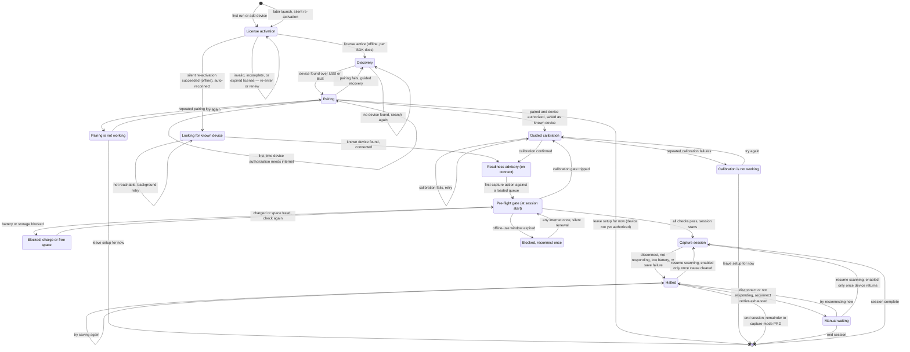
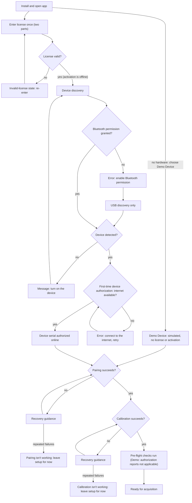
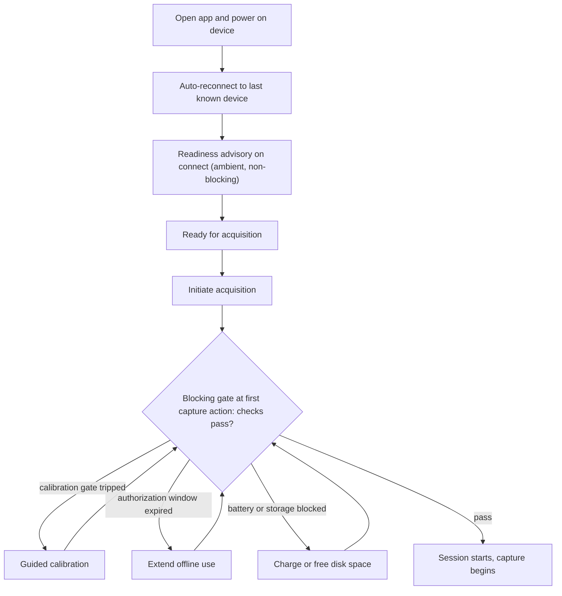
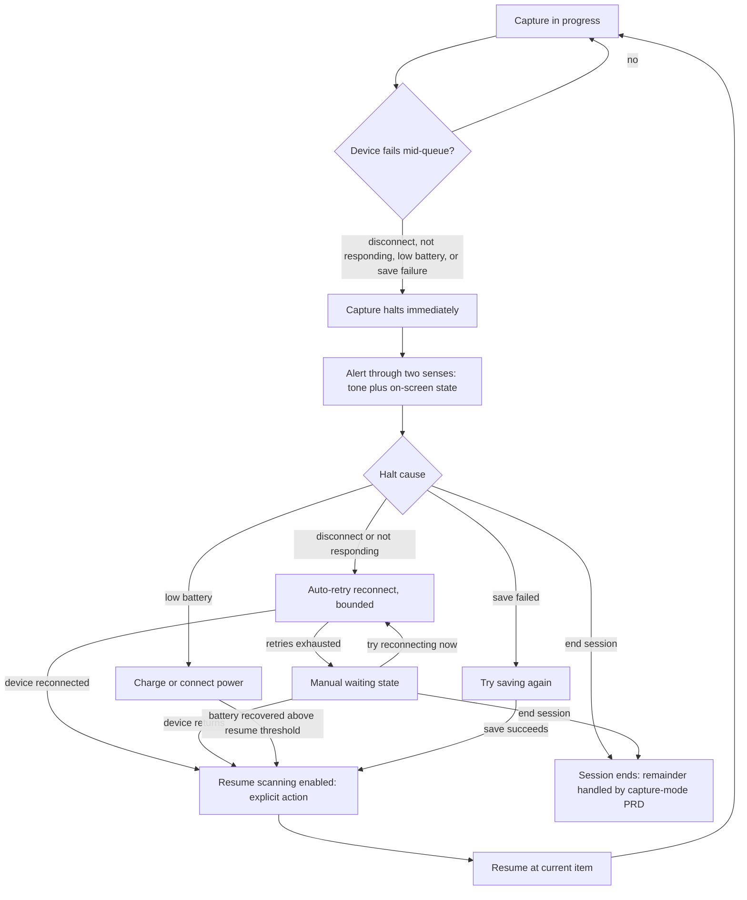
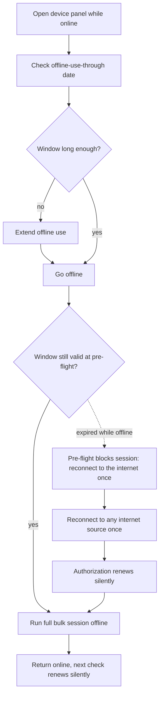

# Device Management PRD — user journeys

Companion to [prd-device-management.md](prd-device-management.md): what the Cataloger does and sees, journey by journey.
The requirement rows in that file are the rules; nothing here adds one, and the shipping copy is in [prd-device-management-copy.md](prd-device-management-copy.md).

States are named here in plain language and each links to its copy state. Persona is the Cataloger unless the title says otherwise. Citation shorthand: [SDK audit](../../briefs/nix-universal-sdk-audit-findings.md) is the vendor SDK audit.

## Device workflow

The device lifecycle end-to-end, as the Cataloger experiences it: license activation, discovery, and pairing ([§1](prd-device-management.md#1-device-pairing), [§2](prd-device-management.md#2-licensing--pre-authorization)), calibration ([§3](prd-device-management.md#3-calibration)), the pre-flight gate ([§4](prd-device-management.md#4-pre-flight-device-health)), and in-session failure and recovery ([§5](prd-device-management.md#5-mid-session-device-failure)). App-level license activation precedes every device operation, including discovery; device-level serial authorization happens at connect ([SDK audit](../../briefs/nix-universal-sdk-audit-findings.md), per SDK docs; confirm on hardware — [OQ 1](prd-device-management.md#open-questions)).

## User Journeys

### UJ 1. First run

1. Install & Open app
2. Activate the Nix SDK license (first run: enter the two-part license credential once; it is stored locally and re-activated silently, offline, on every later launch — activation precedes every device operation, [SDK audit](../../briefs/nix-universal-sdk-audit-findings.md), per SDK docs; confirm on hardware — [OQ 1](prd-device-management.md#open-questions))
  - If the license is invalid or incomplete → show the invalid-license state ([copy, §7](prd-device-management-copy.md#error--state-copy))
3. Initiate device discovery
4. Grant App bluetooth permissions
5. App detects a device is available to connect via USB or BLE
  - If no device detected → show the no-device-found state ([copy, §7](prd-device-management-copy.md#error--state-copy))
6. Initiate device pairing — a device's first-ever connect authorizes its serial online
  - If there's no internet connection → show the no-internet-to-authorize-device state ([copy, §7](prd-device-management-copy.md#error--state-copy))
  - If pairing fails → show the pairing-failed state ([copy, §7](prd-device-management-copy.md#error--state-copy))
7. Initiate calibration
  - If calibration fails → show the calibration-failed state ([copy, §7](prd-device-management-copy.md#error--state-copy))
8. App ready for acquisition

### UJ 1.1 Cannot complete a first run

1. Install & Open app with no internet connection
2. Activate the license — succeeds offline (activation needs no internet, [SDK audit](../../briefs/nix-universal-sdk-audit-findings.md), per SDK docs)
3. Initiate device discovery
4. User denies App bluetooth permissions
  - Failure point: Permission is now denied, App can't detect the device via bluetooth
  - Show the Bluetooth-denied state ([copy, §7](prd-device-management-copy.md#error--state-copy))
5. App can only detect device via USB
6. If a Nix device is discovered, attempt to pair
  - Failure point: No internet connection prevents the device's first-time authorization
  - Show the no-internet-to-authorize-device state ([copy, §7](prd-device-management-copy.md#error--state-copy)); the user can retry, or leave setup for now

### UJ 1.2 First run with no hardware (Contributor)

1. Install & open app with no instrument and no license credential
2. In the device picker, choose "Demo Device (simulated — no instrument)"
3. No license activation runs and no key prompt ever appears
4. A working capture session runs against generated readings ([§6](prd-device-management.md#6-mock-device-layer))

The chart below covers [UJ1](#uj-1-first-run), [UJ1.1](#uj-11-cannot-complete-a-first-run), and [UJ1.2](#uj-12-first-run-with-no-hardware-contributor) together — the denied-Bluetooth and no-internet branches are UJ1.1's failure points; the Demo Device branch is UJ1.2.

### UJ 2. Start acquisition

1. Open app & turn on device
2. Auto-reconnect to the last known connected device
3. Pre-flight health check evaluates on connect, advisory (battery, calibration currency, authorization window, storage headroom)
  - Guided calibration if the gate tripped
  - Extend offline use if the window has lapsed
4. App ready for acquisition
5. Initiate acquisition — the first capture action against the loaded queue re-runs the checks as the blocking gate

### UJ 3. Remove a saved device

1. Open "Saved devices"
2. Select device → Remove

### UJ 4. Calibrate a connected device

1. Turn on device
2. App establishes connection to device
  - If connection isn't established → show the device-not-reachable state ([copy, §7](prd-device-management-copy.md#error--state-copy))
3. Initiate calibration
  - If calibration fails → show the calibration-failed state ([copy, §7](prd-device-management-copy.md#error--state-copy))
4. App ready for acquisition

### UJ 5. Device failure during a session

> Scope boundary: this PRD owns device-level failure — detect → alert → reconnect → resume. Per-scan errors (retry / skip / flag-row) and the dead-letter queue belong to the capture-mode PRD.

1. Mid-queue, the device fails: BLE/USB disconnect, the device stops responding, battery below the operational threshold, or a disk-write failure
2. Capture halts immediately on disconnect (never continues silently); the alert reaches the user through at least two senses (tone + on-screen state; haptic where available) — the user's eyes are on the physical samples, not the screen
3. App presents the matching recovery path: reconnect (auto-retried to the same device, bounded, then manual waiting), charge, or retry the failed save; ending the session is always available
4. When the halt cause clears, a single "Resume scanning" action is enabled — the deliberate acknowledgment and the only way back to capture. Resume returns to the current item; every scan the queue advanced past was durably written, so nothing is lost, re-inserted, or duplicated
5. Capture continues

### UJ 6. Pre-authorize before going offline

1. Before leaving connectivity, open the device panel
2. Check "Offline use through ⟨date⟩" and extend offline use if the window is short
3. Go offline; run a full bulk session with no internet at all — activation and scanning are both local within the window
4. Return online later; the next authorization check happens silently

### UJ 6.1 Authorization window expired while offline

1. Open app offline with an expired pre-authorization window
2. Pre-flight health check blocks the session before it starts with a clear "reconnect to the internet once" state
  - Never surfaces as a mystery disconnect mid-queue
3. User reconnects to any internet source once; authorization renews silently
4. App ready for acquisition

The chart below covers [UJ6](#uj-6-pre-authorize-before-going-offline) and [UJ6.1](#uj-61-authorization-window-expired-while-offline) together — the dashed edge is UJ6.1's expired-window branch.

