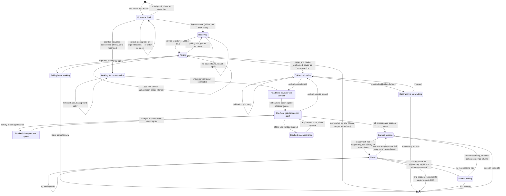
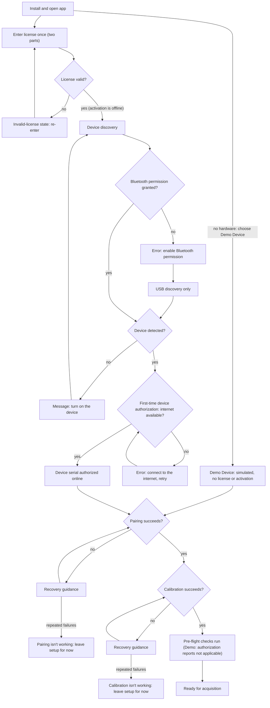
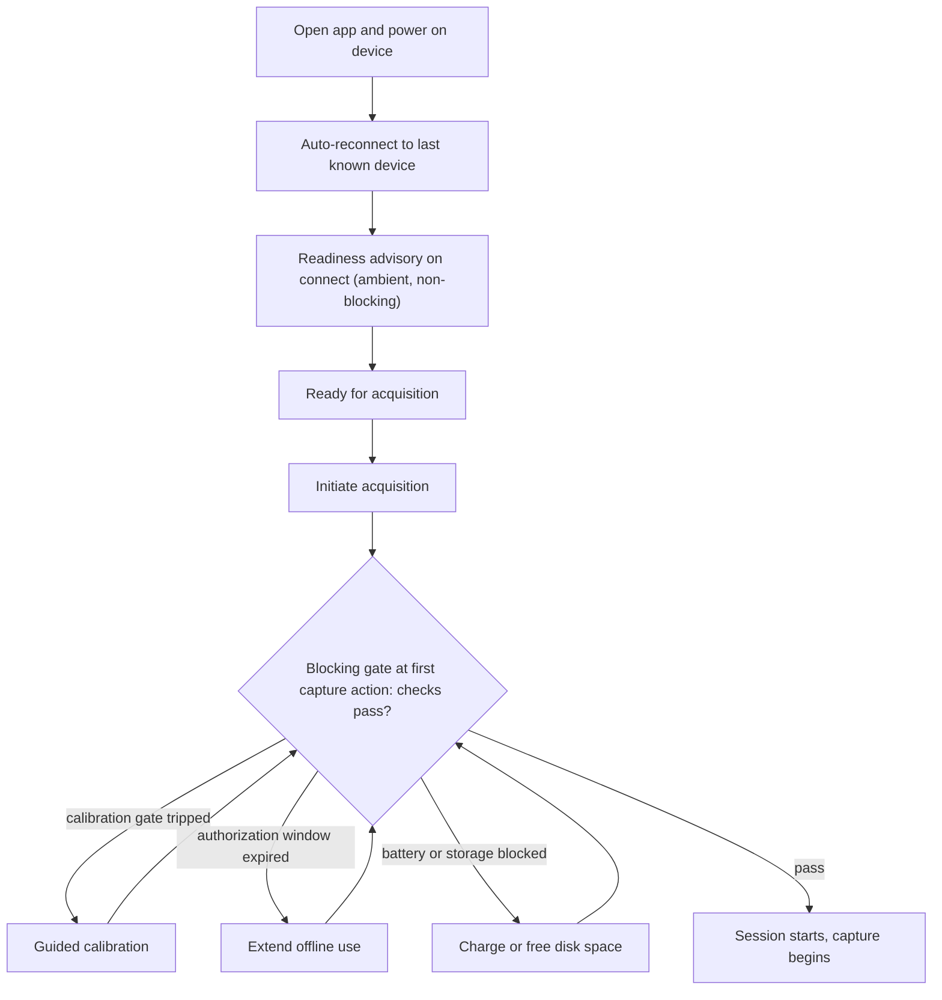
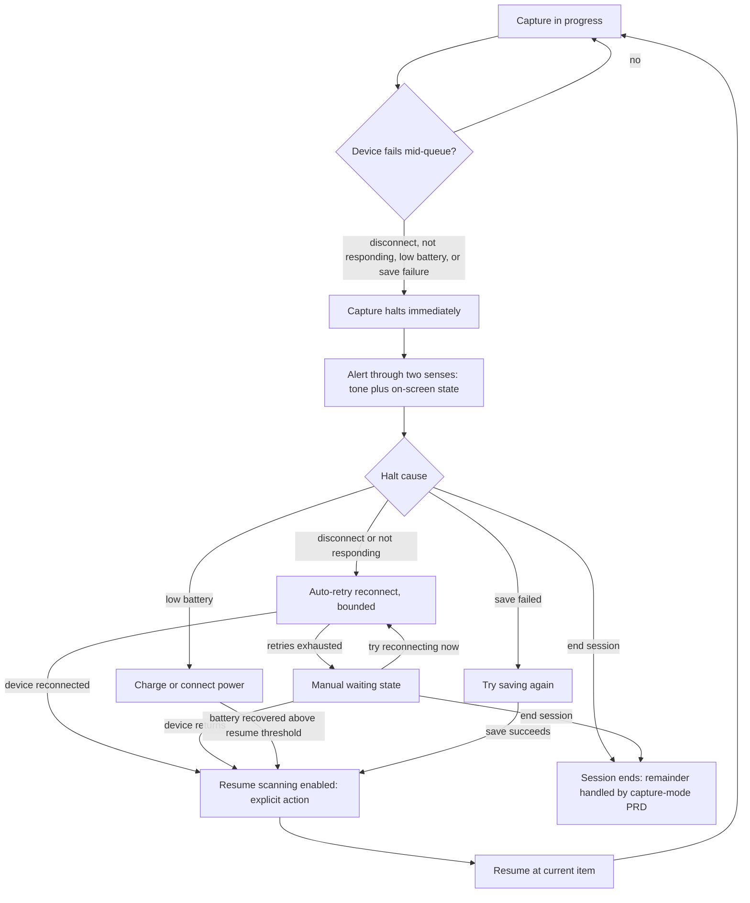
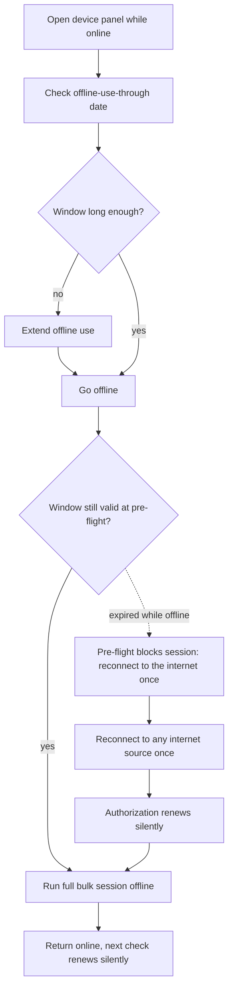

# PRD: Device Management

Author: Vinny Pasceri

# Background

SpectroCapture requires a connection to a spectrophotometer to acquire color information. The scope of this PRD covers all the requirements for the use cases, features, and user journeys related to managing that connection.

### Use cases

Defined in the [Vision doc](../vision.md#use-cases):

| #   | Use case                                  | Persona     | What serves it                                                                     |
| --- | ----------------------------------------- | ----------- | ---------------------------------------------------------------------------------- |
| U3  | **Start a session with a healthy device** | Cataloger   | known-device management (BLE + USB), calibration-due prompt, QR-tile calibration   |
| U8  | **Scan where there is no internet**       | Cataloger   | offline-first design + per-device pre-authorization ("Offline use through ⟨date⟩") |
| U9  | **Contribute code without hardware**      | Contributor | mock-device layer behind the device-service interface; what CI exercises           |

### Feature list

Defined in the [Vision doc](../vision.md#feature-list):

| Release | Feature                                          | Serves | Notes                                                                               |
| ------- | ------------------------------------------------ | ------ | ----------------------------------------------------------------------------------- |
| v1      | Spectro 2/L connect (BLE + USB)                  | U3     |                                                                                     |
| v1      | Known-device management                          | U3     |                                                                                     |
| v1      | Tile calibration with due-prompts                | U3     |                                                                                     |
| v1      | Offline operation + per-device pre-authorization | U8     | "Offline use through 〈date〉" surfaced in the device panel                           |
| v1      | Mock-device layer                                | U9     | App runs, tests, and takes contributions with no hardware or key; what CI exercises |

### Device workflow

The device lifecycle end-to-end, as the Cataloger experiences it: license activation, discovery, and pairing ([§1](#1-device-pairing), [§2](#2-licensing--pre-authorization)), calibration ([§3](#3-calibration)), the pre-flight gate ([§4](#4-pre-flight-device-health)), and in-session failure and recovery ([§5](#5-mid-session-device-failure)). App-level license activation precedes every device operation, including discovery; device-level serial authorization happens at connect ([SDK audit](../../briefs/nix-universal-sdk-audit-findings.md), per SDK docs; confirm on hardware — OQ 1).

## User Journeys

### UJ 1. First run

1. Install &amp; Open app
2. Activate the Nix SDK license (first run: enter the two-part license credential once; it is stored locally and re-activated silently, offline, on every later launch — activation precedes every device operation, [SDK audit](../../briefs/nix-universal-sdk-audit-findings.md), per SDK docs; confirm on hardware — OQ 1)
  - If the license is invalid or incomplete → show the invalid-license state ([copy, §7](#7-error--state-copy))
3. Initiate device discovery
4. Grant App bluetooth permissions
5. App detects a device is available to connect via USB or BLE
  - If no device detected → show the no-device-found state ([copy, §7](#7-error--state-copy))
6. Initiate device pairing — a device's first-ever connect authorizes its serial online
  - If there's no internet connection → show the no-internet-to-authorize-device state ([copy, §7](#7-error--state-copy))
  - If pairing fails → show the pairing-failed state ([copy, §7](#7-error--state-copy))
7. Initiate calibration
  - If calibration fails → show the calibration-failed state ([copy, §7](#7-error--state-copy))
8. App ready for acquisition

### UJ 1.1 Cannot complete a first run

1. Install &amp; Open app with no internet connection
2. Activate the license — succeeds offline (activation needs no internet, [SDK audit](../../briefs/nix-universal-sdk-audit-findings.md), per SDK docs)
3. Initiate device discovery
4. User denies App bluetooth permissions
  - Failure point: Permission is now denied, App can't detect the device via bluetooth
  - Show the Bluetooth-denied state ([copy, §7](#7-error--state-copy))
5. App can only detect device via USB
6. If a Nix device is discovered, attempt to pair
  - Failure point: No internet connection prevents the device's first-time authorization
  - Show the no-internet-to-authorize-device state ([copy, §7](#7-error--state-copy)); the user can retry, or leave setup for now

### UJ 1.2 First run with no hardware (Contributor)

1. Install &amp; open app with no instrument and no license credential
2. In the device picker, choose "Demo Device (simulated — no instrument)"
3. No license activation runs and no key prompt ever appears
4. A working capture session runs against generated readings ([§6](#6-mock-device-layer))

The chart below covers [UJ1](#uj-1-first-run), [UJ1.1](#uj-11-cannot-complete-a-first-run), and [UJ1.2](#uj-12-first-run-with-no-hardware-contributor) together — the denied-Bluetooth and no-internet branches are UJ1.1's failure points; the Demo Device branch is UJ1.2.

### UJ 2. Start acquisition

1. Open app &amp; turn on device
2. Auto-reconnect to the last known connected device
3. Pre-flight health check evaluates on connect, advisory (battery, calibration currency, authorization window, storage headroom)
  - Guided calibration if the gate tripped
  - Extend offline use if the window has lapsed
4. App ready for acquisition
5. Initiate acquisition — the first capture action against the loaded queue re-runs the checks as the blocking gate

### UJ 3. Remove a saved device

1. Open "Saved devices"
2. Select device → Remove

### UJ 4. Calibrate a connected device

1. Turn on device
2. App establishes connection to device
  - If connection isn't established → show the device-not-reachable state ([copy, §7](#7-error--state-copy))
3. Initiate calibration
  - If calibration fails → show the calibration-failed state ([copy, §7](#7-error--state-copy))
4. App ready for acquisition

### UJ 5. Device failure during a session

> Scope boundary: this PRD owns device-level failure — detect → alert → reconnect → resume. Per-scan errors (retry / skip / flag-row) and the dead-letter queue belong to the capture-mode PRD.

1. Mid-queue, the device fails: BLE/USB disconnect, the device stops responding, battery below the operational threshold, or a disk-write failure
2. Capture halts immediately on disconnect (never continues silently); the alert reaches the user through at least two senses (tone + on-screen state; haptic where available) — the user's eyes are on the physical samples, not the screen
3. App presents the matching recovery path: reconnect (auto-retried to the same device, bounded, then manual waiting), charge, or retry the failed save; ending the session is always available
4. When the halt cause clears, a single "Resume scanning" action is enabled — the deliberate acknowledgment and the only way back to capture. Resume returns to the current item; every scan the queue advanced past was durably written, so nothing is lost, re-inserted, or duplicated
5. Capture continues

### UJ 6. Pre-authorize before going offline

1. Before leaving connectivity, open the device panel
2. Check "Offline use through ⟨date⟩" and extend offline use if the window is short
3. Go offline; run a full bulk session with no internet at all — activation and scanning are both local within the window
4. Return online later; the next authorization check happens silently

### UJ 6.1 Authorization window expired while offline

1. Open app offline with an expired pre-authorization window
2. Pre-flight health check blocks the session before it starts with a clear "reconnect to the internet once" state
  - Never surfaces as a mystery disconnect mid-queue
3. User reconnects to any internet source once; authorization renews silently
4. App ready for acquisition

The chart below covers [UJ6](#uj-6-pre-authorize-before-going-offline) and [UJ6.1](#uj-61-authorization-window-expired-while-offline) together — the dashed edge is UJ6.1's expired-window branch.

## Requirements

### Legend

**Priority**

Priority is build order within v1, not a cut line — everything in this document ships in v1: P0 is the first build phase, P1 the second, P2 last.

Provisional constants: every TBD-on-spike constant is a named provisional constant carrying its candidate value and its [Open Questions](#open-questions) id; mechanisms build against these constants, and no provisional constant ships in a release without its OQ resolved.

**Status**

- ⌛️ Ready for Alignment - Waiting for cross-functional team to align on requirements
- ✋ Needs Discussion - Cross-functional team needs to discuss with PM
- 🤝 Aligned - Cross-functional team aligned on the requirement
- 🦺 In Progress - Implementation in flight (Optional status)
- ✅ Completed - Implementation completed &amp; merged. PR # &amp; link added in the "Commit PR" column.
- ✂️ Deferred - Deferred from current release

### Surfaces

The device experience lives on four surfaces. The device panel and the pre-flight readiness panel are one surface — the device panel, with a readiness zone; wording elsewhere in this PRD refers to that zone, never to a separate panel.

| Surface         | Shows                                                                                                                        | [§7](#7-error--state-copy) states that render here                                                                                                                                                                                                                     |
| :--------------- | :---------------------------------------------------------------------------------------------------------------------------- | :---------------------------------------------------------------------------------------------------------------------------------------------------------------------------------------------------------------------------------------------------------------------- |
| Device picker   | Discoverable devices (including the Demo Device — always listed, license or not; live discovery requires an active license), display names, add/switch entry points | No device found; Bluetooth permission denied; license needed before searching; switch-device confirmation                                                                                                                                                              |
| Saved devices   | The known-device list and removal                                                                                            | Remove-device confirmation                                                                                                                                                                                                                                             |
| Device panel    | Device identity, "Offline use through ⟨date⟩", the four readiness checks (readiness zone), ambient indicators and advisories | Device not reachable at launch; no internet to authorize device; invalid license; license expired; vendor service unreachable; extend-offline-use no internet; offline-use expired (online and offline); license missing spectral data; device not covered by your license; device held by another app; pre-flight blocked states; calibration due; pairing/calibration failed and isn't-working |
| Capture surface | The live capture loop, the persistent simulated indicator, halt and paused states                                            | All "Halt:" states; the simulated-readings indicator                                                                                                                                                                                                                   |

The simulated-readings collection banner renders in collection mode — a surface owned by the collection-mode PRD (inherited obligation). Bluetooth permission denied also renders on the device panel at launch (per the [§1](#1-device-pairing) launch clause). First-run setup states — the activation states, pairing, and calibration — render in the device panel; no-device-found renders in the device picker.

### 1. Device Pairing

#### As a Cataloger, I can connect a new spectrophotometer so that I can acquire color information into my collection.

| Release | Pri | Requirements                                                                                                                                                                                                                                                                                                                                                                                                                                                                                                                                                                                                                                                            | Status     | Commit PR |
| :------- | :--- | :----------------------------------------------------------------------------------------------------------------------------------------------------------------------------------------------------------------------------------------------------------------------------------------------------------------------------------------------------------------------------------------------------------------------------------------------------------------------------------------------------------------------------------------------------------------------------------------------------------------------------------------------------------------------- | :---------- | :--------- |
| v1      | P0  | User must explicitly invoke an action to add a new device                                                                                                                                                                                                                                                                                                                                                                                                                                                                                                                                                                                                               | 🤝 Aligned |           |
| v1      | P0  | User can connect to a Nix Spectro 2 or Spectro L                                                                                                                                                                                                                                                                                                                                                                                                                                                                                                                                                                                                                        | 🤝 Aligned |           |
| v1      | P0  | App must be able to discover a device over both USB and BLE (either transport alone is sufficient to connect; both must be supported). Discovered devices list strongest signal first (vision [J1](../vision.md#j1-first-run-cataloger); vendor-confirmed UX guidance — [SDK audit](../../briefs/nix-universal-sdk-audit-findings.md))                                                                                                                                                                                                                                                                                                                                                                                                                                   | 🤝 Aligned |           |
| v1      | P0  | For Nix devices, the user activates the SDK by entering their vendor-issued license credential — two strings, options and signature ([SDK audit](../../briefs/nix-universal-sdk-audit-findings.md), per SDK docs). The shipped app never embeds a credential — every user supplies their own, because a shared one would breach the vendor license and the public-repo boundary ([§2](#2-licensing--pre-authorization), [AGENTS.md §5](../../../AGENTS.md#5-hardware--the-public-repo-boundary)). The offline-use window is shown as "Offline use through ⟨date⟩" ([§2](#2-licensing--pre-authorization)). Activation precedes every device operation, including discovery ([SDK audit](../../briefs/nix-universal-sdk-audit-findings.md), per SDK docs; confirm on hardware — OQ 1).                                                             | 🤝 Aligned |           |
| v1      | P0  | If the app doesn't automatically discover the device, show the no-device-found state ([copy, §7](#7-error--state-copy)) with the option to retry. The discovery search runs the vendor-default 20 s as the provisional constant, with a documented floor of 10 s — devices advertise once per second ([SDK audit](../../briefs/nix-universal-sdk-audit-findings.md), per SDK docs; confirm on hardware — OQ 6).                                                                                                                                                                                                                                                                                                                                                                                                                                                                                                                       | 🤝 Aligned |           |
| v1      | P0  | The list of discovered devices must be de-duped by device identity — (kind, model, serial) — so a device that has been detected via USB and also BLE resolves to one record. The serial is not present in discovery results (discovery entries carry id, type, name, signal strength, and transport — [SDK audit](../../briefs/nix-universal-sdk-audit-findings.md), per SDK docs; confirm on hardware — OQ 15), so post-connect dedup is the primary path, matching the vendor's own serial-as-durable-identity guidance; the provisional display form is shown until the serial is read.                                                                                                                                                                                                                                                              | 🤝 Aligned |           |
| v1      | P0  | App must show a display name of the form "⟨model⟩ (⟨serial⟩)", e.g. "Spectro 2 (19H1)", on every surface where the device appears: the device picker, Saved devices, switch and remove confirmations, and the [§7](#7-error--state-copy) states. This rule applies to live devices; simulated devices display as "Demo Device (⟨serial⟩)". The serial is the identity key within (kind, model); full device identity is (kind, model, serial). While the serial is not yet readable, the provisional display form uses the discovery entry's device name and transport (e.g. "⟨name⟩ — Bluetooth"), which discovery provides ([SDK audit](../../briefs/nix-universal-sdk-audit-findings.md), per SDK docs); [§7](#7-error--state-copy) states render it whenever the serial is unknown. | 🤝 Aligned |           |
| v1      | P1  | After repeated consecutive pairing failures (retry count is a TBD-on-spike constant), the app shows a distinct pairing-isn't-working state with cause guidance and an explicit "Leave setup for now" exit to the collection ([copy, §7](#7-error--state-copy)). Pairing is never an inescapable loop. The consecutive-failure counter resets on a successful attempt and on leaving setup; on first run, "Leave setup for now" lands on the device panel (no collection exists yet).                                                                                                                                                                                    | 🤝 Aligned |           |

#### As a Cataloger, I can connect to a spectrophotometer I've used before so that I can quickly resume acquiring colors to my collection

| Release | Pri | Requirements                                                                                                                                                                                                                                                                                                                                                                                                                                                                                                                                                                                                                                                   | Status     | Commit PR |
| :------- | :--- | :-------------------------------------------------------------------------------------------------------------------------------------------------------------------------------------------------------------------------------------------------------------------------------------------------------------------------------------------------------------------------------------------------------------------------------------------------------------------------------------------------------------------------------------------------------------------------------------------------------------------------------------------------------------- | :---------- | :--------- |
| v1      | P0  | A device becomes a known device after its first successful pairing. The known-device record is keyed by the serial (within (kind, model) — the durable device identity) and persists across app launches. Pairing always happens under an already-active license — activation precedes every device operation ([SDK audit](../../briefs/nix-universal-sdk-audit-findings.md), per SDK docs; confirm on hardware — OQ 1).                                                                                                                                                                                                                                                                                                                                  | 🤝 Aligned |           |
| v1      | P0  | On launch, the app auto-reconnects to the last-used known device with zero user action. When the device is powered on and in range, no connection step stands between opening the app and scanning — open app → scanning in seconds. Simulated devices are excluded from launch auto-reconnect; a simulated device connects only by explicit selection. Unverified dependency: whether the SDK's Bluetooth-ID-based reconnect offers auto-reconnect any handle over USB (see [Open Questions](#open-questions)).                                                                                                                                                                                                                                                                                                        | 🤝 Aligned |           |
| v1      | P1  | When the last-used known device is reachable over both USB and BLE, the app connects over USB (proposed preference: wired link, immune to radio interference). The transport is chosen once, at connect time; the app never migrates a live session between transports. A mid-session transport change (e.g. cable unplugged) is treated as a disconnect under the mid-session failure policy ([§5](#5-mid-session-device-failure)). On reconnect after a transport-loss halt, any transport that reaches the bound serial is acceptable — instrument identity, not link identity, determines measurement validity — and the in-use transport remains visible. | 🤝 Aligned |           |
| v1      | P0  | The app connects to exactly one device at a time. The vendor SDK is single-device, single-session, and a device serves one app at a time ([SDK audit](../../briefs/nix-universal-sdk-audit-findings.md), per SDK docs) — a connect that fails because another app holds the device shows the device-held state ([copy, §7](#7-error--state-copy)). Connecting a different device requires an explicit switch action with a confirmation naming both devices; auto-reconnect never switches devices on its own.                                                                                                                                                                                                                                                                                                                                                                                                 | 🤝 Aligned |           |
| v1      | P0  | A capture session binds to the device (by device identity) it started with; a different device cannot take over an in-progress session. This keeps reference whites consistent within a session.                                                                                                                                                                                                                                                                                                                                                                                                                                                                 | 🤝 Aligned |           |
| v1      | P0  | If the last-used known device is unreachable at launch, the app shows a non-modal device-not-reachable state naming the device ("⟨model⟩ (⟨serial⟩)") with guidance to power it on ([copy, §7](#7-error--state-copy)), and keeps retrying discovery in the background. When the device appears, connection completes automatically with nothing for the user to dismiss. At any launch, if Bluetooth authorization is denied or undetermined and the known device is not reachable over USB, the app shows the Bluetooth-permission-denied state ([copy, §7](#7-error--state-copy)) instead of device-not-reachable.                                           | 🤝 Aligned |           |
| v1      | P0  | Single connection authority: at most one connect, disconnect, or retry attempt is in flight at any time — across background reconnect, launch auto-reconnect, and user-initiated connect/switch actions. A user-initiated action supersedes and cancels any in-flight background attempt. Ending a session releases the session's device binding. Whether the vendor SDK performs its own automatic reconnection, and whether it can be disabled or subordinated, is a spike question (see [Open Questions](#open-questions)).                                                                                                                                 | 🤝 Aligned |           |
| v1      | P0  | Auto-reconnect may open a probe connection to a candidate solely to read its serial; a device whose serial does not match is released immediately — never presented as connected, never bound. The known-device record persists the per-transport reconnect handle alongside the serial — confirmed for BLE: the SDK recalls a known device by its Bluetooth ID ([SDK audit](../../briefs/nix-universal-sdk-audit-findings.md), per SDK docs). The USB handle is unverified (OQ 23, whose deliverable includes the persisted handle's schema shape — nullable per-transport vs BLE-only).                                                                                                                                                                                                                                                                                                                                           | 🤝 Aligned |           |
| v1      | P0  | When a post-connect serial read matches an existing known device, the connection is recognized as that device: the known-device record updates (e.g. the per-transport reconnect handle) and the flow proceeds as a normal reconnect — no duplicate record, no error, no interruption.                                                                                                                                                                                                                                                                                                                                                                         | 🤝 Aligned |           |

#### As a Cataloger, I can manage my saved devices so that my device list only contains the instruments I actually use

Traces [UJ3](#uj-3-remove-a-saved-device). Vocabulary: "known device" is the internal/data-model term; the UI always says "Saved devices".

| Release | Pri | Requirements                                                                                                                                                                                                                                                                                                                                                                                                        | Status     | Commit PR |
| :------- | :--- | :------------------------------------------------------------------------------------------------------------------------------------------------------------------------------------------------------------------------------------------------------------------------------------------------------------------------------------------------------------------------------------------------------------------- | :---------- | :--------- |
| v1      | P1  | User can remove a known device via an explicit action, with a confirmation step that names the device ("⟨model⟩ (⟨serial⟩)").                                                                                                                                                                                                                                                                                       | 🤝 Aligned |           |
| v1      | P1  | Removing a known device never deletes or alters measurements acquired with it — canonical values and version history are untouched (corrections never destroy data). Removal deletes only the saved connection record.                                                                                                                                                                                              | 🤝 Aligned |           |
| v1      | P1  | Re-adding a removed device follows the normal new-device pairing flow (first story in [§1](#1-device-pairing)); there is no special re-add path.                                                                                                                                                                                                                                                                    | 🤝 Aligned |           |
| v1      | P0  | Every measurement permanently records the acquiring device's identity — kind (live or simulated), model, serial, and firmware version (measurement modes are firmware-dependent — [SDK audit](../../briefs/nix-universal-sdk-audit-findings.md), per SDK docs) — as an immutable snapshot independent of saved-device records; removing a saved device can never alter, orphan, or cascade into measurements. Device identity for dedup and display remains (kind, model, serial); the firmware version belongs to the measurement snapshot only. A simulated device can never collide with or occupy a live device's record, even with the same serial. (Inherited obligation for the data-foundation PRD.) | 🤝 Aligned |           |

### 2. Licensing &amp; Pre-Authorization

Traces [UJ1](#uj-1-first-run), [UJ6](#uj-6-pre-authorize-before-going-offline), [UJ6.1](#uj-61-authorization-window-expired-while-offline); serves [U8](../vision.md#use-cases).

Vocabulary: "pre-authorization" is internal vocabulary and never appears in the UI — the button is "Extend offline use" and the panel string is "Offline use through ⟨date⟩".

Two authorization layers, named ([SDK audit](../../briefs/nix-universal-sdk-audit-findings.md), per SDK docs; confirm on hardware — OQ 1, OQ 8): app-level license activation is offline, client-side signed, and happens on every launch — it needs no internet; device-level serial authorization is online for an unknown device, then cached ~30 days. "No internet" failures belong to the device layer, never to activation. The SDK's private-label exemption from online device checks exists ([SDK audit](../../briefs/nix-universal-sdk-audit-findings.md), per SDK docs) and is out of scope for v1 — recorded here so it isn't rediscovered.

#### As a Cataloger, I can enter my Nix license once so that the app doesn't ask me for it again

| Release | Pri | Requirements                                                                                                                                                                                                                                                                          | Status     | Commit PR |
| :------- | :--- | :------------------------------------------------------------------------------------------------------------------------------------------------------------------------------------------------------------------------------------------------------------------------------------- | :---------- | :--------- |
| v1      | P0  | User enters the license credential once — two vendor-issued strings, options and signature; the entry accepts both ([SDK audit](../../briefs/nix-universal-sdk-audit-findings.md), per SDK docs). It is stored locally on the user's machine and silently re-activated, offline, on every later launch — activation is session-only per SDK docs, so launch-time silent re-activation is load-bearing for P0 auto-reconnect. Silent re-activation failure at launch routes to the invalid-license or license-expired state ([copy, §7](#7-error--state-copy)); the user is never re-prompted otherwise.                                                          | 🤝 Aligned |           |
| v1      | P0  | The license credential (both parts) never appears in the repository, in CI configuration, or in any commit ([AGENTS.md §5](../../../AGENTS.md#5-hardware--the-public-repo-boundary)). The shipped app embeds no credential; every user supplies their own.                                                          | 🤝 Aligned |           |
| v1      | P1  | A device's first-ever connect requires an internet connection (device-level serial authorization — license activation itself is offline, [SDK audit](../../briefs/nix-universal-sdk-audit-findings.md), per SDK docs; confirm on hardware — OQ 1). The app surfaces this requirement clearly before a session starts at pairing or pre-flight, never as a mid-queue failure.                                                                       | 🤝 Aligned |           |
| v1      | P0  | License and authorization failures are distinct states, each naming its recovery: invalid or incomplete license → re-enter both parts; no internet at first device authorization → connect to the internet and retry; vendor auth service unreachable (internet up, service down) → try again later ([SDK audit](../../briefs/nix-universal-sdk-audit-findings.md), per SDK docs). They are never collapsed into one generic error. | 🤝 Aligned |           |
| v1      | P0  | A valid license, an authorized serial, and Spectro-class hardware can still lack the spectral-data feature entitlement, returning no spectral data — the product's core payload ([SDK audit](../../briefs/nix-universal-sdk-audit-findings.md), per SDK docs; confirm on hardware — OQ 27). The shortfall is detected and surfaced at pairing time and in the readiness zone — where its indicator surfaces under the authorization check, not as a new check ([§4](#4-pre-flight-device-health)) — never discovered mid-session, as a distinct state ([copy, §7](#7-error--state-copy)). Detection mechanism: the SDK's post-connect capability queries (providesSpectral / providesDensity — [SDK audit](../../briefs/nix-universal-sdk-audit-findings.md), per SDK docs; whether they answer without taking a measurement is OQ 27). This is distinct from per-serial refusal. | 🤝 Aligned |           |
| v1      | P0  | The vendor SDK carries its own mandatory analytics telemetry — events on connect, scan, and calibration carrying device type, batch ID, and SDK version, never color data ([SDK audit](../../briefs/nix-universal-sdk-audit-findings.md), per SDK docs) — an accepted, disclosed network path outside the app's own three. The app's user-facing privacy story must disclose it. Whether it can affect offline capture is an open question (see [Open Questions](#open-questions)). | 🤝 Aligned |           |

#### As a Cataloger, I can pre-authorize my device before going offline so that a full bulk session runs with no internet at all

| Release | Pri | Requirements                                                                                                                                                                                                                                                                                                                                                                                                                                                                                                                                                                                                                                                                                                      | Status     | Commit PR |
| :------- | :--- | :----------------------------------------------------------------------------------------------------------------------------------------------------------------------------------------------------------------------------------------------------------------------------------------------------------------------------------------------------------------------------------------------------------------------------------------------------------------------------------------------------------------------------------------------------------------------------------------------------------------------------------------------------------------------------------------------------------------- | :---------- | :--------- |
| v1      | P0  | The device panel shows "Offline use through ⟨date⟩" for the connected device. The date is the earlier of two expiries: the ~30-day device-authorization cache from the last online check, and the license's own expiry date ([SDK audit](../../briefs/nix-universal-sdk-audit-findings.md), per SDK docs; confirm on hardware — OQ 8). If no API exposes the cache expiry, the app derives the date from the last successful check and labels it approximate — never presenting a derived date as exact (OQ 8).                                                                                                                                                                                                                                                                                                                                                                                                                                                                                                                                                                                                                                     | 🤝 Aligned |           |
| v1      | P1  | While online, the user can invoke an explicit "Extend offline use" action that renews the pre-authorization window immediately and updates the displayed date. Assumes the device-authorization cache can be proactively renewed — unverified against SDK docs (see [Open Questions](#open-questions)).                                                                                                                                                                                                                                                                                                                                                                                                                                                                                                                                                    | 🤝 Aligned |           |
| v1      | P1  | When online, the app renews the pre-authorization window silently in the background, attempting renewal before the window runs low — the trigger point is a TBD-on-spike constant (candidate: one-third of the window remaining, per [v2 research §5.1](../../briefs/acquisition-experience-research-results-v2.md#5-pre-flight-and-session-readiness)). On renewal failure it retries with exponential backoff (1 min → 10 min → 100 min → daily, per the same source) and never interrupts the user while the current window is still valid. Assumes proactive renewal of the device-authorization cache is possible — unverified against SDK docs (see [Open Questions](#open-questions)).                                                                                                                                                                       | 🤝 Aligned |           |
| v1      | P0  | If the pre-authorization window has expired while offline, the pre-flight check blocks an acquisition session start with a clear "reconnect to the internet once" state; while the blocking state is shown, the app listens for connectivity and renews silently the moment any returns. Expiry never surfaces as a mystery mid-queue failure. P1-seam convention ([§4](#4-pre-flight-device-health)): in the P0 phase the blocking state renders with guidance; renewal-on-reconnect arrives with the renewal row.                                                                                                                                                                                                                                                                                                                                                                    | 🤝 Aligned |           |
| v1      | P1  | Device-authorization renewal, opt-in telemetry (off by default), and the software-update check are the only network calls the app itself initiates in v1 (license activation is offline and is not a network call) — update checking is user-controllable, sends no system profile, and can never block, delay, or halt launch or capture; no other outbound calls of any kind (the vendor SDK additionally carries its own mandatory analytics telemetry — see the dedicated row above; its offline behavior remains an open question, see [Open Questions](#open-questions)). Telemetry is specified in a dedicated future PRD, gated on a provider spike (see [Open Questions](#open-questions)); this supersedes the no-telemetry posture in [v2 research §10.5](../../briefs/acquisition-experience-research-results-v2.md#10-measuring-acquisition-throughput). | 🤝 Aligned |           |
| v1      | P0  | The app persists the offline-use end date per device — the earlier of the device-authorization cache expiry and the license's own expiry ([SDK audit](../../briefs/nix-universal-sdk-audit-findings.md), per SDK docs; confirm on hardware — OQ 8) — and treats it as the source of truth for the displayed date and the pre-flight gate; the vendor SDK's own refusal is a defensive backstop, never the primary check. If no API exposes the cache expiry, the date is derived from the last successful check and labeled approximate (OQ 8). If the SDK refuses while the persisted date is still valid, the app surfaces the offline-use-expired state ([copy, §7](#7-error--state-copy)), never a generic error, and re-syncs the date on the next connection. Until the spike answers the per-serial-refusal question (see [Open Questions](#open-questions)), a permanent per-device refusal may be indistinguishable from a lapsed window — the offline-use-expired copy must not promise that reconnecting will fix it.                                                                                                                                                                                                                                                       | 🤝 Aligned |           |
| v1      | P0  | A session started inside the offline-use window runs to completion even if the window expires mid-session; the expiry block applies only at the next session start. Whether the vendor SDK itself enforces mid-session expiry is a spike question (see [Open Questions](#open-questions)).                                                                                                                                                                                                                                                                                                                                                                                                                        | 🤝 Aligned |           |
| v1      | P1  | Invoking "Extend offline use" while offline resolves to the extend-offline-use-no-internet state ([copy, §7](#7-error--state-copy)) — never a spinner and never a silent failure.                                                                                                                                                                                                                                                                                                                                                                                                                                                                                                                                 | 🤝 Aligned |           |
| v1      | P0  | The license credential at rest — both strings — is stored as a protected credential in the system credential store, never in plaintext files, the collection database, logs, or any export. Re-entry uses empty masked fields; the stored credential is never redisplayed.                                                                                                                                                                                                                                                                                                                                                                                                                                                                    | 🤝 Aligned |           |

### 3. Calibration

Traces [UJ4](#uj-4-calibrate-a-connected-device); serves [U3](../vision.md#use-cases).

#### As a Cataloger, I can calibrate my device with a guided flow so that every session starts measurement-accurate

| Release | Pri | Requirements                                                                                                                                                                                                                                                                                                                                                                                                                                                                                                                | Status     | Commit PR |
| :------- | :--- | :--------------------------------------------------------------------------------------------------------------------------------------------------------------------------------------------------------------------------------------------------------------------------------------------------------------------------------------------------------------------------------------------------------------------------------------------------------------------------------------------------------------------------- | :---------- | :--------- |
| v1      | P0  | A guided QR-tile calibration flow runs (a) on first run, (b) on demand from the device panel, and (c) when the session-boundary gate trips. The flow walks tile placement, runs the calibration, and ends in either a confirmed success or a named failure state with a retry action ([copy, §7](#7-error--state-copy)). Calibration takes 5–10 s on a Spectro 2 ([SDK audit](../../briefs/nix-universal-sdk-audit-findings.md), per SDK docs; informative, not gating). The gate rule itself is TBD pending the hardware spike (see [Open Questions](#open-questions)).                                                                                                    | 🤝 Aligned |           |
| v1      | P0  | The SDK's calibration-due signal is authoritative: due-ness derives from elapsed time plus ambient temperature drift — inputs only the SDK has — so the app cannot compute it from a stored constant ([SDK audit](../../briefs/nix-universal-sdk-audit-findings.md), per SDK docs; confirm on hardware — OQ 2). The app persists calibration-event timestamps — the pre-emptive check's input, and what the storage ADR will freeze; the due signal itself is the SDK's — and surfaces the SDK's due state in the readiness zone. The session-boundary gate fires on the SDK's due signal, with an elapsed-time pre-emptive check (constant TBD-on-spike; candidate: one-third of the typical interval, [v2 research §5.1](../../briefs/acquisition-experience-research-results-v2.md#5-pre-flight-and-session-readiness)) so the gate trips before a session rather than mid-run. Deliberate asymmetry vs [§2](#2-licensing--pre-authorization): there the app is authoritative and the SDK is a backstop; here the SDK is authoritative because only it has the inputs. | 🤝 Aligned |           |
| v1      | P0  | Capture mode is never interrupted for calibration, and no calibration countdown appears in the capture loop. Calibration currency is shown only as an ambient indicator in the device panel's readiness zone. Drift can also surface at measurement time as a scan-delta error ([SDK audit](../../briefs/nix-universal-sdk-audit-findings.md), per SDK docs); that arrives under [§5](#5-mid-session-device-failure)'s halt taxonomy, not as a calibration interrupt.                                                                                                                                                                                                                                                                                                               | 🤝 Aligned |           |
| v1      | P1  | After repeated consecutive calibration failures (retry count is a TBD-on-spike constant), the app shows a distinct calibration-isn't-working state with cause guidance (tile condition, lighting) and an explicit "Leave setup for now" exit to the collection ([copy, §7](#7-error--state-copy)). Calibration is never an inescapable loop. The consecutive-failure counter resets on a successful attempt and on leaving setup; on first run, "Leave setup for now" lands on the device panel (no collection exists yet). | 🤝 Aligned |           |

### 4. Pre-Flight Device Health

Traces [UJ2](#uj-2-start-acquisition).

#### As a Cataloger, I can see that my device is session-ready before I start so that a bulk run never dies mid-queue for a preventable reason

| Release | Pri | Requirements                                                                                                                                                                                                                                                                                                                                                                                                                                                                                                                                                                                                                                                                                                                                                                                                                                                                 | Status     | Commit PR |
| :------- | :--- | :---------------------------------------------------------------------------------------------------------------------------------------------------------------------------------------------------------------------------------------------------------------------------------------------------------------------------------------------------------------------------------------------------------------------------------------------------------------------------------------------------------------------------------------------------------------------------------------------------------------------------------------------------------------------------------------------------------------------------------------------------------------------------------------------------------------------------------------------------------------------------- | :---------- | :--------- |
| v1      | P0  | The device panel's readiness zone covers four device-readiness checks — power/battery state, calibration currency, authorization window, and storage headroom — plus an alert-channel advisory (the muted-audio warning, [§5](#5-mid-session-device-failure)); the advisory is not a fifth readiness check, appears only when output is verified muted, and has no pass/warn/block value. Pre-flight evaluates in three contexts: at connect (advisory, ambient); at session start (the blocking gate — a session starts at the user's first capture action against a loaded queue, the session-start event this PRD gates); and mid-session on wake (a re-evaluation that may raise a halt cause under [§5](#5-mid-session-device-failure), but never blocks a start). When all four checks pass, the readiness zone requires no interaction and does not block session start. The pass/warn/block boundaries for every check are TBD pending the hardware spike (see [Open Questions](#open-questions)).                                                                     | 🤝 Aligned |           |
| v1      | P0  | Each check reports pass / warn / block / not applicable — "not applicable" is for a check that cannot apply to the connected device kind; it neither blocks nor needs remediation. Every warn or block state carries a one-tap remediation: charge or connect power, recalibrate (guided flow, [§3](#3-calibration)), extend offline use or reconnect to the internet ([§2](#2-licensing--pre-authorization)), free disk space. No check ends in a dead end. A warn state reuses the corresponding blocked state's copy ([§7](#7-error--state-copy)) in a non-blocking presentation. The spectral-entitlement indicator ([§2](#2-licensing--pre-authorization)) surfaces under the authorization check, not as a new check. If the battery level is not pollable outside a measurement (OQ 4), the battery check reports the last-known level with its age. The storage check measures free space on the volume containing the active collection file; when none is open, the volume where a new collection would default. Remediation actions owned by P1 rows (e.g. "Extend offline use") arrive with those rows; in the P0 phase the corresponding states render with guidance but no action, and the no-dead-end rule is satisfied from P1. The boundaries between pass, warn, and block are TBD pending the hardware spike (see [Open Questions](#open-questions)). | 🤝 Aligned |           |

### 5. Mid-Session Device Failure

Traces [UJ5](#uj-5-device-failure-during-a-session).

> Scope boundary (restated from [UJ5](#uj-5-device-failure-during-a-session)): this PRD owns device-level failure — detect → alert → reconnect → resume. Per-scan retry/skip/flag and the dead-letter queue belong to the future capture-mode PRD.

Definition: the "current item" is the first queue row with no durably written reading, evaluated when capture resumes — so a successful save retry can never produce a duplicate. "Halt" is the internal term; the UI shows the session as paused.

#### As a Cataloger, when my device fails mid-queue, the app stops me immediately and gets me back to the current item so that I never lose a scan or scan into a dead connection

| Release | Pri | Requirements                                                                                                                                                                                                                                                                                                                                                                                                                                                                                                                                                                                                                                                                                                                                                                                                                                                    | Status     | Commit PR |
| :------- | :--- | :--------------------------------------------------------------------------------------------------------------------------------------------------------------------------------------------------------------------------------------------------------------------------------------------------------------------------------------------------------------------------------------------------------------------------------------------------------------------------------------------------------------------------------------------------------------------------------------------------------------------------------------------------------------------------------------------------------------------------------------------------------------------------------------------------------------------------------------------------------------- | :---------- | :--------- |
| v1      | P0  | On the first BLE/USB disconnect, a device that stops responding, a store-write failure, or battery falling below the operational threshold (threshold TBD pending the hardware spike, see [Open Questions](#open-questions)), capture halts immediately (accelerated breaking, [v2 research §4.2](../../briefs/acquisition-experience-research-results-v2.md#4-mid-run-error-handling)). Disconnect detection carries a stated tolerance (TBD-on-spike — BLE supervision timeouts bound it). The app never continues silently, and it never holds an unwritten scan across a halt except the single failed-save reading (hold-and-retry row below); the durable write completes before the queue advances — a constraint ADR-0004 inherits.                                                                                                                        | 🤝 Aligned |           |
| v1      | P0  | The error alert cannot be dismissed by the same action that advances the queue. Acknowledging a failure requires a distinct, deliberate action ([v2 research §4.1](../../briefs/acquisition-experience-research-results-v2.md#4-mid-run-error-handling)).                                                                                                                                                                                                                                                                                                                                                                                                                                                                                                                                                                                                          | 🤝 Aligned |           |
| v1      | P0  | A halt alerts through at least two senses simultaneously: an interrupting tone plus a blocking on-screen state, with haptics where the hardware provides them. Spectro 2/L carry device-side haptics ([SDK audit](../../briefs/nix-universal-sdk-audit-findings.md), per SDK docs), which may reach the heads-down user's hand directly; whether the SDK exposes triggering them is a spike item (see [Open Questions](#open-questions)). An error tone pre-empts any in-flight success tone. The blocking on-screen state is peripherally perceivable — a full-capture-surface state change, not a dialog. Pre-flight warns when system audio output is muted, so the alert channel is verified before the session.                                                                                                                                                                                                                                                                                                                                                                                                                       | 🤝 Aligned |           |
| v1      | P0  | Recovery: the app auto-retries reconnection to the same device (by device identity), bounded — after n attempts / t minutes (constants TBD pending the hardware spike, see [Open Questions](#open-questions)) it falls back to a manual waiting state that keeps listening for the device without active retries, offering "Try reconnecting now" and "End session" ([copy, §7](#7-error--state-copy)).                                                                                                                                                                                                                                                                                                                                                                                                                                                           | 🤝 Aligned |           |
| v1      | P0  | Recovery never auto-resumes capture. When the halt cause clears (the device reconnects or responds again, the battery level recovers, the save succeeds, or — after an unrecognized device error — the next command to the device succeeds), the app enables a single "Resume scanning" action — the deliberate acknowledgment, the only path from a halt back to capture, and never bound to the queue-advance action. Resume is not available while the cause holds; resuming resets the failure counters (manual override, [v2 research §4.2](../../briefs/acquisition-experience-research-results-v2.md#4-mid-run-error-handling)). Resume returns to the current item; every scan the queue advanced past was durably written, so recovery re-inserts nothing and creates no duplicates. When multiple halt causes hold at once, the displayed state is the first-raised unresolved cause, and Resume enables only when all causes have cleared. | 🤝 Aligned |           |
| v1      | P0  | A completed scan whose save fails is retained across the halt; "Try saving again" re-attempts the same reading, and on success "Resume scanning" is enabled. The three save-failure halts — disk full, collection file unreachable, and unexpected error — are distinct states ([copy, §7](#7-error--state-copy)); the unexpected-error fallback never shows a raw error code.                                                                                                                                                                                                                                                                                                                                                                                                                                                                                  | 🤝 Aligned |           |
| v1      | P0  | Every halt offers an explicit "End session" action that closes the capture session from the halted state. Ending the session from a save-failure halt explicitly warns that the one unsaved reading will be discarded and that its item remains unscanned in the queue. What happens to the un-scanned remainder of the queue is the capture-mode PRD's to define, not this one's.                                                                                                                                                                                                                                                                                                                                                                                                                                                                              | 🤝 Aligned |           |
| v1      | P0  | Every halt writes a local record when the halt occurs — cause, timestamp, battery level, item index — and amends it on resolution with the recovery action taken and time-to-recovery; a halt that never resolves remains an open record. Writing the record is best-effort and never itself halts, blocks, or cascades; a save-failure halt's record is persisted once the store is writable again. The record stays in the user's local store, never transmitted. This log is the data source for the device-caused-stalls metric ([Success Metrics](#success-metrics)) and the input for the spike's threshold tuning.                                                                                                                                                                                                                                       | 🤝 Aligned |           |
| v1      | P0  | A device that accepts no command and returns no reading within a liveness timeout (TBD-on-spike, see [Open Questions](#open-questions)) halts as "device not responding" ([copy, §7](#7-error--state-copy)), with the same alert and recovery contract as a disconnect.                                                                                                                                                                                                                                                                                                                                                                                                                                                                                                                                                                                         | 🤝 Aligned |           |
| v1      | P0  | The battery-low halt clears when the reported battery level rises above a distinct resume threshold (TBD-on-spike, strictly above the halt threshold, see [Open Questions](#open-questions)); connecting power alone never clears it. Assumes a pollable battery level — unverified (OQ 4); if the level is not pollable outside a measurement, a battery halt clears via an explicit user-initiated level check, so the halt is never unreachable.                                                                                                                                                                                                                                                                                                                                                                                                                                                                                                                                                                                                                           | 🤝 Aligned |           |
| v1      | P0  | A halt that occurs after one or more readings of an incomplete multi-sample set discards the partial set; the item re-scans from the first sample on resume.                                                                                                                                                                                                                                                                                                                                                                                                                                                                                                                                                                                                                                                                                                    | 🤝 Aligned |           |
| v1      | P0  | While capture is halted, the scan-accept path is suppressed: a scan attempt during a halt surfaces the halt state itself rather than being accepted — the user can never scan into a dead connection, even having missed the alert.                                                                                                                                                                                                                                                                                                                                                                                                                                                                                                                                                                                                                             | 🤝 Aligned |           |
| v1      | P0  | A halt record left open by process termination is closed as "unresolved — app terminated" on next launch, keeping the stalls metric honest.                                                                                                                                                                                                                                                                                                                                                                                                                                                                                                                                                                                                                                                                                                                     | 🤝 Aligned |           |
| v1      | P1  | Quitting the app from a halted state routes through the same End-session warning — a held unsaved reading is never silently discarded. System sleep mid-session: the resulting disconnect halts under this section; on wake, the device-health checks re-evaluate as advisories that may raise a new halt cause — the authorization check is excluded for the in-flight session (the runs-to-completion guarantee, [§2](#2-licensing--pre-authorization)) — and Resume scanning remains the only path back to capture. Session/queue persistence across launches is an inherited obligation of the capture-mode PRD, not defined here.                                                                                                                                                                                                                             | 🤝 Aligned |           |
| v1      | P1  | Every halt state posts an accessibility announcement; the capture surface is navigable by assistive technology, and the halt state is announced without requiring focus.                                                                                                                                                                                                                                                                                                                                                                                                                                                                                                                                                                                                                                                                                        | 🤝 Aligned |           |

Halt thresholds are provisional: per the v2 research ([§4.2](../../briefs/acquisition-experience-research-results-v2.md#4-mid-run-error-handling)), halt records are logged across the first ~10 real sessions with halting tuned offline against that data before any threshold ships as final.

### 6. Mock Device Layer

Traces [U9](../vision.md#use-cases); serves vision journey [J5](../vision.md#j5-first-contribution-contributor) (first contribution).

#### As a Contributor, I can run and test the whole app against a simulated spectrophotometer so that I can contribute without hardware or a license key

| Release | Pri | Requirements                                                                                                                                                                                                                                                                                                                                                                                                                                                                                                                                                                                                                                                                                                   | Status     | Commit PR |
| :------- | :--- | :-------------------------------------------------------------------------------------------------------------------------------------------------------------------------------------------------------------------------------------------------------------------------------------------------------------------------------------------------------------------------------------------------------------------------------------------------------------------------------------------------------------------------------------------------------------------------------------------------------------------------------------------------------------------------------------------------------------- | :---------- | :--------- |
| v1      | P0  | The app ships a "Demo Device (simulated — no instrument)" entry selectable in the same device picker as real hardware, with helper text "For trying the app and for contributors. Readings are generated, not measured." A first-class device, not a debug flag or a hidden build configuration. The device picker opens without an active license and always lists the Demo Device; live discovery within it requires an active license ([license-needed state, §7](#7-error--state-copy)).                                                                                                                                                                                                                                                                                                                                                                                                               | 🤝 Aligned |           |
| v1      | P0  | The simulated device requires no hardware and no vendor license credential. A contributor can run the full app: pairing, calibration, capture, collection, all from a plain clone against it.                                                                                                                                                                                                                                                                                                                                                                                                                                                                                                                         | 🤝 Aligned |           |
| v1      | P0  | Selecting the Demo Device never invokes license activation and never shows the credential prompt; a plain clone with no hardware and no credential reaches a working capture session (traces [UJ1.2](#uj-12-first-run-with-no-hardware-contributor)).                                                                                                                                                                                                                                                                                                                                                                                                                                                                        | 🤝 Aligned |           |
| v1      | P0  | Every measurement from the simulated device permanently records simulated provenance (per the device-identity rule in [§1](#1-device-pairing)). CSV export emits a `simulated` column (true/false). In collection mode, the item badge reflects the canonical value's provenance, and the collection banner ([copy, §7](#7-error--state-copy)) shows while any item's canonical value is simulated; version history keeps the flag regardless. The capture surface carries a persistent simulated indicator while a simulated device is connected. The collection-view and CSV-export behaviors are inherited obligations for the collection-mode and data/export PRDs.                                        | 🤝 Aligned |           |
| v1      | P0  | The app behaves identically against the simulated and the live device, with a closed list of exceptions: data provenance (simulated readings are always marked, never presented as measured), licensing/activation (never invoked for the Demo Device), the physical transport mechanism (the simulated device does not use real USB/BLE — transport-selection behavior itself is simulated and asserted), OS-permission surfaces, timing, and launch auto-reconnect (never attempted for simulated devices). Everything else — flows, states, error surfaces — is identical.                                                                                                                                  | 🤝 Aligned |           |
| v1      | P0  | Against the Demo Device, all four pre-flight checks ([§4](#4-pre-flight-device-health)) run and report; the authorization check reports a distinct "not applicable — simulated" result that a test can assert.                                                                                                                                                                                                                                                                                                                                                                                                                                                                                                 | 🤝 Aligned |           |
| v1      | P0  | CI exercises the simulated-device path on every PR.                                                                                                                                                                                                                                                                                                                                                                                                                                                                                                                                                                                                                                                            | 🤝 Aligned |           |
| v1      | P0  | The simulated device exposes an explicit configurable state surface: settable serial and model, presence on either or both transports, battery level, a settable calibration-due signal (due / not due / unknown) plus the elapsed-time and — if the SDK exposes it — temperature inputs the pre-emptive check consumes ([§3](#3-calibration)), injectable disconnects, injectable silence (the device stops responding without disconnecting), injectable unrecognized device errors (an error outside the known set), injectable "device held by another app" connect failures, injectable malformed frames, and settable measurement results (deterministic and seedable). Device-side haptic triggering is spike-gated (OQ 20) — no injection until the SDK's exposure is known.                                                                                                                                                                                                                                                                                                                                | 🤝 Aligned |           |
| v1      | P0  | One simulated licensing layer with two distinct outcome sets, mirroring [§2](#2-licensing--pre-authorization)'s two layers: local license validation (valid / invalid-or-incomplete / expired) and the simulated device-authorization service (no internet, vendor service unreachable, expired window, window granted until ⟨date⟩, refuses despite a valid persisted window, license valid but this serial refused, spectral entitlement absent) — so every [§2](#2-licensing--pre-authorization) state is reproducible without the vendor service. The two expiries — device-authorization cache expiry and license expiry — are independently settable, so the earlier-of rule is assertable in both orders and at equality.                                                                                                                                                                                                                                                                                                                                                         | 🤝 Aligned |           |
| v1      | P0  | An injectable clock, so offline-use window expiry and the renewal backoff ladder ([§2](#2-licensing--pre-authorization)) are testable in virtual time rather than wall-clock time.                                                                                                                                                                                                                                                                                                                                                                                                                                                                                                                             | 🤝 Aligned |           |
| v1      | P0  | An injectable network-reachability state, so online/offline transitions and every offline journey ([UJ6](#uj-6-pre-authorize-before-going-offline), [UJ6.1](#uj-61-authorization-window-expired-while-offline)) are testable without changing the machine's network.                                                                                                                                                                                                                                                                                                                                                                                                                                           | 🤝 Aligned |           |
| v1      | P0  | Store fault injection — fail the Nth write, disk-full, fail on commit, store unreachable (volume detached / file moved), unclassified store error — so the halt-on-write-failure and hold-and-retry behaviors in [§5](#5-mid-session-device-failure) are testable.                                                                                                                                                                                                                                                                                                                                                                                                                                             | 🤝 Aligned |           |
| v1      | P0  | Simulated discovery entries carry exactly id, type, name, settable signal strength, and transport — the serial is readable only after connect — so post-connect dedup, provisional display names, probe-and-release, and strongest-signal ordering ([§1](#1-device-pairing)) are tested against reality. | 🤝 Aligned |           |
| v1      | P0  | A test can set the outcome of the Bluetooth-authorization prompt (authorized / denied / undetermined), of any pairing attempt (success / failure), and of any calibration run (success / failure).                                                                                                                                                                                                                                                                                                                                                                                                                                                                                                             | 🤝 Aligned |           |
| v1      | P0  | The simulated layer can present multiple simulated devices at once, each with independent identity and state — so the one-device-at-a-time rule, the switch confirmation, and session binding ([§1](#1-device-pairing)) are testable.                                                                                                                                                                                                                                                                                                                                                                                                                                                                          | 🤝 Aligned |           |
| v1      | P0  | Every outbound network attempt the app makes is observable in tests (destination and time), including activation/renewal attempts against the simulated authorization service on the injectable clock. This makes the only-network-paths claim and the backoff ladder ([§2](#2-licensing--pre-authorization)) assertable — including the negative cases: with the Demo Device selected, or with telemetry off, a test can assert zero corresponding attempts. Audio and haptic cue events are likewise observable (kind, time, and whether a cue pre-empted one in flight), as are connection attempts (start, outcome, cancellation, initiator) and the request payload shape of each permitted network path. | 🤝 Aligned |           |
| v1      | P0  | A test can set the reported free disk space, so the pre-flight storage check ([§4](#4-pre-flight-device-health)) can be induced into warn and block.                                                                                                                                                                                                                                                                                                                                                                                                                                                                                                                                                           | 🤝 Aligned |           |
| v1      | P0  | A test can set device presence per transport (e.g. remove USB while BLE remains) and observe which transport a connection is using — so the transport preference and the mid-session transport-change rule ([§1](#1-device-pairing)) are assertable.                                                                                                                                                                                                                                                                                                                                                                                                                                                           | 🤝 Aligned |           |
| v1      | P0  | A test can start the app from a declared persisted state — known devices, last-used device, stored credential present or absent, calibration timestamps — so first-run and later-launch scenarios are constructible without manual setup.                                                                                                                                                                                                                                                                                                                                                                                                                                                                             | 🤝 Aligned |           |
| v1      | P0  | A SpectroDevice conformance suite runs the same behavioral checks against three subjects: the simulated device, in CI on every PR; the live device, run by a hardware owner for `needs-hardware-verify` PRs, who attaches a named results artifact (suite identity plus per-check pass/fail) to the PR; and a hardware-free subject exercising the real cross-language boundary — the contract-test obligation [ADR-0001](../../decisions/0001-rust-core-swiftui-shell.md#enforcement-gates-part-of-this-decision) already mandates.                                                                                                                                                                              | 🤝 Aligned |           |
| v1      | P0  | Error-case parity, assertable: for every error the live device can produce, the simulated layer provides an injection that yields it, verified by a test that enumerates the full error set — a new live error case without a matching injection fails the build or the test suite, not review vigilance. The injectable set includes ambient light leakage and out-of-range temperature ([SDK audit](../../briefs/nix-universal-sdk-audit-findings.md), per SDK docs); their per-scan UX is the capture-mode PRD's. The app's device-error set is closed and exhaustively matched at the app's boundary; any SDK error the mapping does not recognize resolves to a named "unrecognized device error" — itself a halt cause with its own [§7](#7-error--state-copy) state and its own injection (whether the vendor SDK's error surface is closed is a spike question, see [Open Questions](#open-questions)).           | 🤝 Aligned |           |
| v1      | P0  | Telemetry is fire-and-forget — it can never block, delay, or halt capture (inherited obligation for the telemetry PRD). With telemetry off, the app makes zero telemetry network attempts — assertable via the outbound-attempt observability above.                                                                                                                                                                                                                                                                                                                                                                                                                                                           | 🤝 Aligned |           |
| v1      | P0  | Any simulated device or service seam a test did not explicitly configure fails the test when exercised, rather than answering with a plausible default.                                                                                                                                                                                                                                                                                                                                                                                                                                                                                                                                                        | 🤝 Aligned |           |
| v1      | P0  | The app always declares the Bluetooth usage description macOS requires — its absence breaks Bluetooth access and may crash the app (vision [J1](../vision.md#j1-first-run-cataloger) risk point) — verified automatically in CI on every PR.                                                                                                                                                                                                                                                                                                                                                                                                                                                                      | 🤝 Aligned |           |
| v1      | P1  | The simulated device has a configurable latency defaulting to the real device's measured timing. It is never instant by default. An instant mock hides every race in the capture surface.                                                                                                                                                                                                                                                                                                                                                                                                                                                                                                                      | 🤝 Aligned |           |
| v1      | P2  | The simulated device can replay fixtures recorded from real hardware, including calibration sequences and malformed frames.                                                                                                                                                                                                                                                                                                                                                                                                                                                                                                                                                                                    | 🤝 Aligned |           |

Device-path PRs still need a human with real hardware to verify before merge and carry the `needs-hardware-verify` label ([AGENTS.md §5](../../../AGENTS.md#5-hardware--the-public-repo-boundary)). These requirements describe product behavior only; module layout is an open ADR ([AGENTS.md §3](../../../AGENTS.md#3-decided--recommended--open)) and is not decided here. The seams for OS surfaces — Bluetooth authorization, free disk space, the credential store, the device picker — are shell-side test doubles, distinct from the pure-Rust SpectroDevice mock [ADR-0001](../../decisions/0001-rust-core-swiftui-shell.md) defines; the obligation is that a test can control them, wherever they live (which ADR owns the shell-side seam family, and the macOS CI lane these every-PR obligations require, is an open question — see [Open Questions](#open-questions)).

### 7. Error &amp; State Copy

The shipping copy for every error, waiting, and blocked state in this PRD; confirmation dialogs and warn-level presentations reuse the copy of the rows that require them. Written in the Cataloger's vocabulary: plain language, names the recovery, never SDK-speak. Every state below is a distinct, named state whose identity is stable even when its copy changes, so behavior can be asserted independently of wording. This table is a P0 requirement (status: 🤝 Aligned); the journeys and requirement rows above link here instead of restating copy.

| State                                      | Headline                                        | Body                                                                                                                                                                                                                                             | Primary action                                                                       |
| :------------------------------------------ | :----------------------------------------------- | :------------------------------------------------------------------------------------------------------------------------------------------------------------------------------------------------------------------------------------------------ | :------------------------------------------------------------------------------------ |
| No device found                            | No device found                                 | The search finished without finding a device. Turn on your spectrophotometer, keep it close, and search again.                                                                                                                                   | Search again                                                                         |
| Bluetooth permission denied                | SpectroCapture isn't allowed to use Bluetooth   | Allow Bluetooth for SpectroCapture in System Settings › Privacy &amp; Security to find your device wirelessly — or plug in the USB cable instead, which works without Bluetooth.                                                                 | Open System Settings                                                                 |
| No internet to authorize device            | Internet needed to authorize this device        | Your license is active — but a device's first connection needs the internet to authorize it. After that you can scan offline until the date shown in the device panel.                                                                            | Try again; Leave setup for now                                                       |
| Invalid license                            | That license didn't work                        | Check both parts of your license against what you were issued and paste them again.                                                                                                                                                              | Re-enter license                                                                     |
| License expired                            | Your license has expired                        | This license has passed its expiry date, so it can't activate — re-entering the same license won't help. Renew it with your license issuer.                                                                                                       | None (requires a renewed license)                                                    |
| License needed before searching            | Enter your license to search for devices        | The Demo Device is available right away. To find your own spectrophotometer, enter your Nix license first.                                                                                                                                       | Enter license                                                                        |
| License missing spectral data              | Your license doesn't include spectral data      | The device connects, but this license doesn't unlock spectral measurements — the data SpectroCapture captures. Contact whoever issued your license to add spectral data.                                                                          | None (requires a license change)                                                     |
| Device not covered by your license         | This device isn't covered by your license       | The license is valid, but it doesn't cover this particular device. Contact your license issuer — reconnecting won't change this.                                                                                                                 | None (requires a license change)                                                     |
| Device held by another app                 | ⟨model⟩ is in use by another app                | A spectrophotometer connects to one app at a time. Close the other app using it, then try again.                                                                                                                                                 | Try again                                                                            |
| Vendor service unreachable                 | Nix's license service isn't responding          | The license service didn't answer just now. Nothing to fix on your end — try again in a little while.                                                                                                                                            | Try again later                                                                      |
| Extend offline use, no internet            | Can't extend offline use right now              | Extending needs an internet connection — any connection works, even a phone hotspot. Closing line, conditional: while the window is valid, "Your current window still runs through ⟨date⟩."; once lapsed, "Your offline use ended ⟨date⟩."       | Try again                                                                            |
| Pairing failed                             | Couldn't pair with ⟨model⟩ (⟨serial⟩)           | Turn the device off and on, keep it close, and try again. (The provisional display form renders when the serial isn't yet known.)                                                                                                                | Try again                                                                            |
| Pairing isn't working                      | Pairing still isn't working                     | Several attempts haven't succeeded. Check the device's battery, move it closer, or try the USB cable. You can come back to this any time from the device panel.                                                                                  | Try again; Leave setup for now                                                       |
| Calibration failed                         | Calibration didn't finish                       | Seat the device flat on its calibration tile and run it again.                                                                                                                                                                                   | Recalibrate                                                                          |
| Calibration isn't working                  | Calibration still isn't working                 | Several attempts haven't succeeded. Check the tile for dirt or damage, and move away from bright direct light. You can come back to this any time from the device panel.                                                                         | Try again; Leave setup for now                                                       |
| Device not reachable at launch             | Looking for ⟨model⟩ (⟨serial⟩)                  | Turn it on and it will connect by itself — nothing to click.                                                                                                                                                                                     | None (connects automatically)                                                        |
| Offline use expired (offline)              | Offline use has ended — new sessions are paused | Starting a new session needs one internet connection: any connection works, even a phone hotspot. Browsing and exporting your collection still work. If this doesn't clear after you're online, the device may not be covered by your license — see the device panel. If your network blocks the vendor's authorization service — some managed networks do — a different network or IT help may be needed. | Check again                                                                          |
| Offline use expired (online)               | Offline use has ended                           | Extend offline use to keep scanning — you're online, so you can do it right now.                                                                                                                                                                 | Extend offline use                                                                   |
| Pre-flight: battery blocked                | Battery too low to start                        | Charge the device or connect power, then check again.                                                                                                                                                                                            | Check again                                                                          |
| Pre-flight: storage blocked                | Not enough disk space to record scans           | There isn't enough free space to save scans safely. Free some space on the drive holding your collection, then check again.                                                                                                                      | Check again                                                                          |
| Pre-flight: calibration due                | Calibration needed before you start             | Your device is due for calibration to keep measurements accurate. Run the guided calibration with the tile, then start your session.                                                                                                             | Calibrate now                                                                        |
| Simulated-readings collection banner       | This collection contains simulated readings     | Readings from the Demo Device are generated, not measured by an instrument.                                                                                                                                                                      | Show simulated readings                                                              |
| Halt: device disconnected (retrying)       | ⟨model⟩ disconnected — capture paused           | Everything you've scanned so far is saved. The app is trying to reconnect; Resume scanning turns on when the device is back. If a multi-reading scan was in progress, that item starts over.                                                     | Resume scanning (enabled once reconnected); End session                              |
| Halt: device disconnected (manual waiting) | Still can't reach ⟨model⟩ (⟨serial⟩)            | Automatic retries have stopped, but the app is still listening for the device. Everything you've scanned so far is saved. If a multi-reading scan was in progress, that item starts over. If it comes back on its own, Resume scanning turns on. | Try reconnecting now; Resume scanning (enabled once the device returns); End session |
| Halt: device not responding                | ⟨model⟩ isn't responding — capture paused       | The device is on but not answering. Turn it off and on, or unplug and reconnect the cable. Everything you've scanned so far is saved. If a multi-reading scan was in progress, that item starts over.                                            | Try reconnecting now; Resume scanning (enabled once it responds); End session        |
| Halt: battery too low                      | Battery too low to keep scanning                | Charge the device or connect power. Everything you've scanned so far is saved; Resume scanning turns on once the battery has recovered. If a multi-reading scan was in progress, that item starts over.                                          | Resume scanning (enabled once the battery recovers); End session                     |
| Halt: disk full                            | Couldn't save the last scan — disk is full      | The reading is kept safe. Free some disk space, then try saving again; every scan the queue advanced past is already saved. Ending the session instead discards this one unsaved reading and leaves its item unscanned.                          | Try saving again (then Resume scanning); End session                                 |
| Halt: collection file unreachable          | Can't reach your collection                     | The reading is kept safe. If your collection lives on an external drive, reconnect it (or restore the moved file), then try saving again. Ending the session instead discards this one unsaved reading and leaves its item unscanned.            | Try saving again (then Resume scanning); End session                                 |
| Halt: couldn't save (unexpected)           | Couldn't save — unexpected error                | The reading is kept safe, but the save failed for a reason the app doesn't recognize. Every scan the queue advanced past is already saved. Try saving again. Ending the session instead discards this one unsaved reading and leaves its item unscanned. | Try saving again (then Resume scanning); End session                                 |
| Halt: unrecognized device error            | Something went wrong with the device            | The device reported a problem the app doesn't recognize. Turn it off and on. Everything you've scanned so far is saved. If a multi-reading scan was in progress, that item starts over.                                                          | Resume scanning (enabled once the device responds); End session                      |
| Switch-device confirmation                 | Switch to ⟨model⟩ (⟨serial⟩)?                   | You're currently connected to ⟨model⟩ (⟨serial⟩). A session never changes devices mid-run — if one is running, the switch takes effect for your next session.                                                                                     | Switch device; Cancel                                                                |
| Remove-device confirmation                 | Remove ⟨model⟩ (⟨serial⟩)?                      | Your measurements keep their record of this device; this removes only the saved connection.                                                                                                                                                      | Remove device; Cancel                                                                |

## Success Metrics

Numeric targets below are proposals, not commitments — the device's scan cycle time is unknown until the hardware spike, and it sets the floor for anything time-based.

| Metric                                                           | Definition                                                                                                                                                                                                                                                            | Candidate target                                                                     | Method                                                                                                                                     | Status     |
| :---------------------------------------------------------------- | :--------------------------------------------------------------------------------------------------------------------------------------------------------------------------------------------------------------------------------------------------------------------- | :------------------------------------------------------------------------------------ | :------------------------------------------------------------------------------------------------------------------------------------------ | :---------- |
| Launch-to-first-scan (known device)                              | Start event: process launch. End event: first measurement durably written. Statistic: median, on a known device with calibration gates intact ([STRATEGY.md key metric](../../../STRATEGY.md#key-metrics)). Population: ≥ 20 dogfooded launches with pre-flight passing. | ≤ 30 s when the device is on and pre-flight passes                                   | Dogfooding: timed real sessions, measured locally                                                                                          | 🤝 Aligned |
| Install-to-first-scan (first run)                                | Start event: install/first launch on a clean state. End event: first measurement durably written — enter credential → pair → calibrate → scan ([UJ1](#uj-1-first-run) end-to-end).                                                                                           | ≤ 15 min with device and key in hand                                                 | Timed walkthroughs on a clean state (n stated with the result)                                                                             | 🤝 Aligned |
| Device-caused session stalls                                     | The count of open halt records in the [§5](#5-mid-session-device-failure) halt log — halts that never resolved to a guided recovery (directly assertable)                                                                                                             | 0 — every halt resolves to reconnect, charge, retry the save, resume, or end session | The [§5](#5-mid-session-device-failure) halt log: local records of cause, recovery action, and time-to-recovery                            | 🤝 Aligned |
| Add Device Task Completion % (v1.x — requires the telemetry PRD) | % of device add attempts that were successfully completed (attempt = user invokes Add Device; completion = a known-device record is written)                                                                                                                          | ≥ 95% task completion                                                                | Telemetry events (opt-in) — pending the telemetry spike; opt-in sample only — directional signal, never quotable as a population statistic | 🤝 Aligned |
| Add Device Task Duration (v1.x — requires the telemetry PRD)     | Median time from invoking Add Device to a known-device record being written                                                                                                                                                                                           | ≤ 2 mins                                                                             | Telemetry events (opt-in) — pending the telemetry spike; opt-in sample only — directional signal, never quotable as a population statistic | 🤝 Aligned |

## Open Questions

| #   | Question | Details | Evidence that closes it | Feeds | Evidence source | Status | Gated on | Depends on |
| :--- | :-------- | :------- | :----------------------- | :----- | :--------------- | :------ | :-------- | :---------- |
| 1   | Activation-before-discovery sequencing | ANSWERED per the [SDK audit](../../briefs/nix-universal-sdk-audit-findings.md): app-level license activation precedes every device operation including discovery; device-level serial authorization happens at connect. | Observe on hardware: discovery/connect attempted before and after activation | [Device workflow](#device-workflow); [UJ1](#uj-1-first-run); [§1](#1-device-pairing) activation and known-device rows | SDK docs | residual | hardware | — |
| 2   | Calibration state exposure | Due-ness is SDK-signaled from elapsed time plus ambient temperature drift, so a stored per-instrument constant is the wrong shape ([SDK audit](../../briefs/nix-universal-sdk-audit-findings.md)). What does the SDK expose — a due flag, a timestamp, the temperature input? | Probe the SDK's calibration state surface on hardware | [§3](#3-calibration) authoritative row; [§6](#6-mock-device-layer) due-signal seam | SDK docs | residual | hardware | — |
| 3   | Calibration gate design | Given SDK-signaled due-ness: the elapsed-time pre-emptive check constant ([§3](#3-calibration), candidate one-third of the typical interval), and whether the gate should also weigh expected session length. | Owner decision once OQ 2 is answered | [§3](#3-calibration) gate clause; [§4](#4-pre-flight-device-health) calibration check | owner | open | owner | OQ 2 |
| 4   | Battery level capability | Is a battery level pollable outside a measurement at all? The docs show low-battery arriving in the measurement status ([SDK audit](../../briefs/nix-universal-sdk-audit-findings.md), per SDK docs). The fallback if not: last-known level with age at pre-flight; explicit user-initiated level check to clear a halt. | Probe the battery surface on hardware | [§4](#4-pre-flight-device-health) battery check; [§5](#5-mid-session-device-failure) battery halt and hysteresis rows | SDK docs | open | hardware | — |
| 4b  | Battery constants | The mid-session halt threshold, the distinct resume threshold (strictly above it), and the pre-flight pass/warn/block boundaries. No numbers until the spike. | Halt-log data from the first ~10 real sessions | [§4](#4-pre-flight-device-health), [§5](#5-mid-session-device-failure) provisional constants | hardware | open | hardware | OQ 4 |
| 5   | Storage headroom thresholds | Pre-flight warn/block boundaries for disk space ([§4](#4-pre-flight-device-health)). | Owner decision with dogfood data | [§4](#4-pre-flight-device-health) storage check | owner | open | none | — |
| 6   | Discovery timeout | ANSWERED per the [SDK audit](../../briefs/nix-universal-sdk-audit-findings.md): 20 s vendor default, documented ≥ 10 s floor — devices advertise once per second. | Confirm timing behavior on hardware | [§1](#1-device-pairing) no-device-found row (provisional constant) | SDK docs | residual | hardware | — |
| 7   | Reconnect retry bounds | The n attempts / t minutes bound on auto-retry before falling back to manual waiting ([§5](#5-mid-session-device-failure)). | Tune against real-session halt logs | [§5](#5-mid-session-device-failure) recovery row | hardware | open | hardware | — |
| 8   | Offline-use window | ANSWERED per the [SDK audit](../../briefs/nix-universal-sdk-audit-findings.md): ~30-day device-authorization cache; two expiries, gate on the earlier. Primary residual: is the cache expiry (or last-successful-check timestamp) readable from the SDK, and with what precision? Also open: can the app proactively renew/extend the cache (the "Extend offline use" and silent-renewal rows assume yes — unverified)? | Probe the authorization surface on hardware | [§2](#2-licensing--pre-authorization) display/persisted rows (approximate-date fallback), Extend and renewal rows | SDK docs | residual | hardware | — |
| 9   | USB-vs-BLE transport preference | The [§1](#1-device-pairing) row prefers USB as "proposed" — needs confirmation against real transport behavior. | Side-by-side transport behavior on hardware | [§1](#1-device-pairing) transport row | owner | open | hardware | OQ 23 |
| 10  | Scan cycle time | Unknown until the hardware spike; sets the floor for every time-based target. | Measure scan cycles on hardware | [Success Metrics](#success-metrics) time targets; [§6](#6-mock-device-layer) mock latency default | hardware | open | hardware | — |
| 11  | Mid-session expiry: SDK enforcement | [§2](#2-licensing--pre-authorization) guarantees a session started inside the window runs to completion. Does the SDK itself hard-stop mid-session? If so, it becomes a [§5](#5-mid-session-device-failure) halt. | Let the window lapse mid-session on hardware | [§2](#2-licensing--pre-authorization) runs-to-completion row; [§5](#5-mid-session-device-failure) taxonomy | hardware | open | hardware | — |
| 12  | Telemetry provider | TelemetryDeck-like provider; requires a spike before the dedicated telemetry PRD. | Provider spike | Telemetry PRD; [§2](#2-licensing--pre-authorization) network-path row | owner | open | none | — |
| 13  | Per-fork telemetry provider ID | Forks supply their own provider ID so no fork data reaches the project and vice versa. | Owner design | Telemetry PRD | owner | open | none | — |
| 14  | Telemetry opt-in UX | How and when users are offered opt-in (off by default). | Owner design | Telemetry PRD | owner | open | none | — |
| 15  | Serial at discovery | ANSWERED per the [SDK audit](../../briefs/nix-universal-sdk-audit-findings.md): discovery carries id, type, name, signal strength, transport — no serial; post-connect dedup is the primary path, per the vendor's serial-as-identity guidance. | Confirm the discovery payload on hardware | [§1](#1-device-pairing) dedup/display/probe rows; [§6](#6-mock-device-layer) discovery-entry seam | SDK docs | residual | hardware | — |
| 16  | SDK network behavior | Half-answered per the [SDK audit](../../briefs/nix-universal-sdk-audit-findings.md): mandatory Google Analytics events on connect/scan/calibration (no color data). Open: does SDK telemetry block, delay, or retry during offline operation, and is there a suppression hook? General residual: what network activity the SDK performs at all — including the connect-time authorization phone-home and the documented firewall-whitelisting requirement — beyond telemetry. | Network observation on hardware: offline and firewalled runs | [§2](#2-licensing--pre-authorization) SDK-telemetry and network-path rows; privacy story | SDK docs | residual | hardware | — |
| 17  | Vendor SDK auto-reconnect | Does the SDK perform its own automatic reconnection, and can it be disabled or subordinated to the app's single connection authority ([§1](#1-device-pairing))? | Observe reconnect behavior on hardware | [§1](#1-device-pairing) single-connection-authority row | SDK docs | open | hardware | — |
| 18  | Per-serial refusal | Confirmed possible per the [SDK audit](../../briefs/nix-universal-sdk-audit-findings.md). Residual: what the SDK reports, and whether a permanent per-device refusal is distinguishable from an auth-server-unreachable failure. | Induce a refusal on hardware, or vendor confirmation | [§2](#2-licensing--pre-authorization) source-of-truth row; [§7](#7-error--state-copy) not-covered state; [§6](#6-mock-device-layer) outcome | SDK docs | residual | hardware | — |
| 19  | Sandbox entitlement conflict | The vendor documents four required macOS sandbox entitlements — Bluetooth, serial, USB, network client ([SDK audit](../../briefs/nix-universal-sdk-audit-findings.md), per SDK docs) — while Apple's current reference lacks the serial entitlement; the conflict itself is the question for the sandboxing decision ([UJ1.1](#uj-11-cannot-complete-a-first-run)). | Owner decision plus a sandboxed build experiment | Sandboxing ADR; [UJ1.1](#uj-11-cannot-complete-a-first-run) USB fallback | owner | open | owner | — |
| 20  | Liveness &amp; haptic capability | Does the SDK surface liveness (a device that stops responding) distinctly from disconnects, and does it expose triggering the device-side haptics ([§5](#5-mid-session-device-failure))? | Probe the SDK's event and haptics surface on hardware | [§5](#5-mid-session-device-failure) not-responding halt and alert rows; [§6](#6-mock-device-layer) haptic-injection gate | SDK docs | open | hardware | — |
| 20b | Liveness &amp; disconnect constants | The liveness timeout and the disconnect-detection tolerance — BLE supervision timeouts bound it ([§5](#5-mid-session-device-failure)). | Tune against real-session halt logs | [§5](#5-mid-session-device-failure) provisional constants | hardware | open | hardware | OQ 20 |
| 21  | Shell-side seams &amp; macOS CI lane | Which ADR owns the shell-side test-double family ([§6](#6-mock-device-layer)), and the macOS CI lane §6's every-PR obligations require: current CI has no macOS job (candidate home ADR-0005). | Owner decision | [§6](#6-mock-device-layer) seams note; CI config | owner | open | none | — |
| 22  | SDK error-set enumeration | Enumerate the SDK's documented error set as of 4.2.3 and pin it as the app's mapped set — a checked-in enumeration, regenerated on SDK upgrade. That pinned list is the error-parity gate's source of truth ([§6](#6-mock-device-layer)); the unrecognized-error fallback ([§5](#5-mid-session-device-failure)) is permanent regardless. | The checked-in enumeration itself | [§6](#6-mock-device-layer) error-parity gate; [§5](#5-mid-session-device-failure) unrecognized halt | SDK docs | open | none | — |
| 23  | macOS SDK USB: remaining half | USB IS supported on macOS and each discovery entry reports its transport ([SDK audit](../../briefs/nix-universal-sdk-audit-findings.md), per SDK docs). Unverified: whether connecting a specific entry selects the transport, and whether the Bluetooth-ID reconnect gives auto-reconnect any handle over USB. Deliverable includes the persisted handle's schema shape (nullable per-transport vs BLE-only). | Connect via a USB discovery entry on hardware | [§1](#1-device-pairing) transport and probe rows; [§6](#6-mock-device-layer) transport assertions | SDK docs | residual | hardware | — |
| 24  | Bluetooth grant: recover in place? | After the user grants Bluetooth permission in System Settings, must the app recover in place, or is a relaunch acceptable? | A macOS build experiment (no instrument needed) | [§7](#7-error--state-copy) Bluetooth-denied flow | hardware | open | none | — |
| 25  | Entitlement change mid-session | Entitlement changes invalidate open connections ([SDK audit](../../briefs/nix-universal-sdk-audit-findings.md), per SDK docs) — how does that surface mid-session, and can the disconnect copy distinguish a license event from a link loss? | Change entitlements against a live session on hardware | [§5](#5-mid-session-device-failure) disconnect copy | SDK docs | open | hardware | — |
| 26  | Held-by-another-app distinguishability | Does the SDK distinguish a held-by-another-app connect failure from a generic one, and with what error value? | Two-app connect experiment on hardware | [§7](#7-error--state-copy) device-held state; [§6](#6-mock-device-layer) injection; [§1](#1-device-pairing) one-device row | SDK docs | open | hardware | — |
| 27  | Spectral entitlement queryable | Is providesSpectral queryable post-connect without taking a measurement? | Probe the capability query on hardware | [§2](#2-licensing--pre-authorization) entitlement-shortfall row (detection at pairing) | SDK docs | open | hardware | — |

Closing rule: the hardware spike's deliverable is one results file with a section per OQ id; an OQ is marked answered only when that section exists. Every inline "per SDK docs; confirm on hardware" marker in this document carries its OQ id — a marker without a matching OQ entry is invalid. The 5–10 s calibration-duration figure ([§3](#3-calibration)) is informative, not gating. Entries gated on "none" or "owner" form a parallel track that can run now, without hardware.

