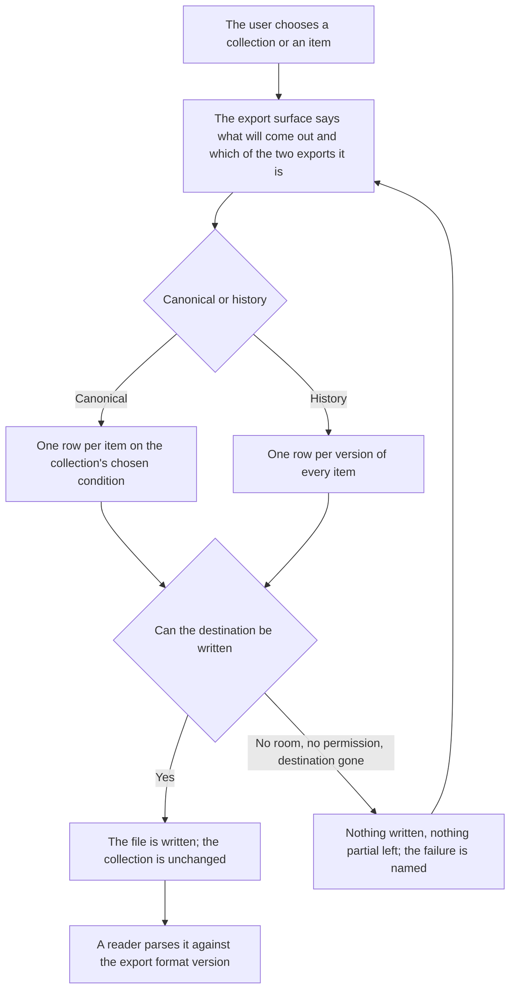

# PRD: Data Export

Status: draft

Companion files: the journeys are in [prd-data-export-journeys.md](prd-data-export-journeys.md), the shipping copy in [prd-data-export-copy.md](prd-data-export-copy.md), the answers to closed open questions in [prd-data-export-oq-results.md](prd-data-export-oq-results.md), and the owner's decisions in [prd-data-export-fences.md](prd-data-export-fences.md).

# Background

<!-- guidance: State the problem this PRD solves, who is affected, and why it matters now. Close with an explicit scope statement — a bulleted in-scope list and a bulleted out-of-scope (non-goals) list — so scope creep has a written line to point at. Not conditional: every PRD owes this section. -->

**Problem statement.** A spectrophotometer's readings live inside vendor apps with partial, lossy export, so the numbers a person measured never reach the tools they actually work in ([vision](../vision.md#problems)). This document states the contract the app's CSV keeps with whoever reads it next: what comes out, under what column names, in what dialect, what a version bump means, and what happens when the file cannot be written. It serves the Data consumer ([U6](../vision.md#use-cases), [vision J4](../vision.md#j4-data-out-data-consumer)); the file those exports are read out of is the [Data Foundation PRD](../data-foundation/prd-data-foundation.md)'s, and two locked PRDs hand obligations here, gathered in [Inherited obligations](#inherited-obligations).

**Upstream:** the [product vision](../vision.md), the [strategy](../../../STRATEGY.md). **Governance:** `~/.claude/plugins/cache/agentic-plugins/operator-agents/1.5.0/skills/writing-prds/references/process-rules.md`. **Home:** `docs/product/export`.

**In scope:** what a canonical and a history export contain, and which items get a row; column names, the reserved prefix, collisions, the dialect, the wavelength column set and the export format version; the failures an export can end in; what a test asserts against a checked-in golden.

**Out of scope:** the file the export reads and everything it guarantees, the [Data Foundation PRD](../data-foundation/prd-data-foundation.md)'s — including a derived set for a condition other than the collection's chosen one, which stays in the file and is exported by neither export kind ([its F31](../data-foundation/prd-data-foundation-fences.md), fence F9); the storage schema, ADR-0003's; browsing and editing, Collection Mode's; CxF and migration in from a vendor app, v2 ([OQ 3](#open-questions)); cloud sync ([AGENTS.md §4](../../../AGENTS.md#4-non-negotiables)).

The diagram is the life of one export.

## User Journeys

<!-- guidance: Index every user journey this feature supports — one row per journey. The full journeys never live inline here: the PRD body has a word budget and the companion does not. -->

Every journey is in the [journeys companion](prd-data-export-journeys.md); nothing there adds a rule.

| Journey | Name | Rows exercised | Entry |
| :--- | :--- | :--- | :--- |
| J1 | Export the collection | R1.1–R1.3, R2.1–R2.5, R3.1 | [J1](prd-data-export-journeys.md#j1-export-the-collection) |

## Requirements

### Vocabulary

The terms these rows use are [AGENTS.md §8](../../../AGENTS.md#8-vocabulary)'s and the [Data Foundation PRD's Vocabulary](../data-foundation/prd-data-foundation.md#vocabulary)'s — canonical value, raw payload, sample, reading, derived value, supersession reason, quarantined, gamut-clipped — and are not restated here. Added here:

- **Canonical export** — the default: one row per item carrying its canonical value on the collection's chosen condition.
- **History export** — the explicit option: one row per version of every item, canonical and superseded alike.
- **Golden** — a checked-in header-and-rows file an export is asserted against, one per fixture, per export kind, for every released export format version.

### Legend

<!-- guidance: Declare the two vocabularies every later table depends on: the priority semantics and the row-status vocabulary. -->

**Priority.** Build order within v1, not a cut line, and a recommendation rather than a decision: P1 is the second phase, holding the history export ([R1.3](#1-what-the-export-contains), fence F2); everything else is P0.

Provisional constants: each is named, carries its OQ id and a candidate until a fence fixes it, and none ships in a release with its OQ open — a dogfood build not being a release. An unqualified "OQ n" or row ID is this document's; a row or question cited from another PRD names that PRD in the link. WAVELENGTH_GRID is this document's, under [OQ 4](#open-questions); DERIVATION_VERSION and SQLITE_READER_FLOOR are the [Data Foundation PRD](../data-foundation/prd-data-foundation.md#legend)'s, and ROWS_CEILING the capture PRD's, under [its OQ 13](../capture-mode/prd-capture-mode.md#open-questions).

**Status.** A status cell here and in the [copy file](prd-data-export-copy.md#error--state-copy) holds one of these six and nothing else; [Open Questions](#open-questions) has its own two, open and answered.

- ⌛️ Ready for Alignment — awaiting cross-functional alignment · ✋ Needs Discussion — the team needs the PM · 🤝 Aligned — the team agrees
- 🦺 In Progress — implementation in flight (optional) · ✅ Completed — merged, its PR in Commit PR · ✂️ Deferred — out of this release

### Traceability

Three row-ID families, one per dispositionable table, under one rule: an ID is assigned once and never renumbered, a row cut or deferred keeping its ID. Requirement rows in [§1](#1-what-the-export-contains)–[§4](#4-verifiability) carry `R<section>.<n>`, state rows in the [copy file](prd-data-export-copy.md#error--state-copy) `E<n>`, metric rows `M<n>`; there is no scheme beyond these. Commit PR maps a row onto the work that lands it; owner decisions live in the [fence file](prd-data-export-fences.md), a row naming one for provenance only.

**Where these rows came from.** Every row, state, metric, question and journey below moved out of the [Data Foundation PRD](../data-foundation/prd-data-foundation.md) on 2026-09-09 under that document's fence F30, transcribed here as [F1](prd-data-export-fences.md#f1--data-export-is-the-csv-contract-split-out-of-data-foundation-2026-09-09). No rule changed in the move: only the IDs, the citations, and which section a row sits in. The left-hand IDs are retired there and never reused ([its Legend](../data-foundation/prd-data-foundation.md#legend)).

| In the Data Foundation PRD | Here |
| :--- | :--- |
| R4.1 | [R1.1](#1-what-the-export-contains) |
| R4.3 | [R1.2](#1-what-the-export-contains) |
| R4.4 | [R1.3](#1-what-the-export-contains) |
| R4.2 | [R2.1](#2-columns-names-dialect-and-the-version) |
| R4.6 | [R2.2](#2-columns-names-dialect-and-the-version) |
| R4.7 | [R2.3](#2-columns-names-dialect-and-the-version) |
| R4.8 | [R2.4](#2-columns-names-dialect-and-the-version) |
| R4.9 | [R2.5](#2-columns-names-dialect-and-the-version) |
| R4.5 | [R3.1](#3-when-an-export-cannot-finish) |
| R7.9 | [R4.1](#4-verifiability) |
| R7.7, the assertion half | [R4.2](#4-verifiability) |
| R7.8, the export-destination half | [R4.3](#4-verifiability) |
| R7.6, for this document's one surface | [R4.4](#4-verifiability) |
| R7.6a | [R4.4a](#surfaces) |
| M3 | [M1](#success-metrics) |
| OQ 8 | [OQ 1](#open-questions) |
| OQ 9 | [OQ 2](#open-questions) |
| OQ 11 | [OQ 3](#open-questions) |
| OQ 16 | [OQ 4](#open-questions) |
| E6 | [E1](prd-data-export-copy.md#error--state-copy) |
| E7 | [E2](prd-data-export-copy.md#error--state-copy) |
| E17 | [E3](prd-data-export-copy.md#error--state-copy) |
| E18 | [E4](prd-data-export-copy.md#error--state-copy) |
| DJ1 (its journeys index's J1) | [J1](prd-data-export-journeys.md#j1-export-the-collection) |

Three rows are split rather than moved whole. [The Data Foundation PRD's R7.7](../data-foundation/prd-data-foundation.md#7-verifiability) keeps the fixtures and their content and hands the assertion here; [its R7.8](../data-foundation/prd-data-foundation.md#7-verifiability) keeps the move's failures and hands the export destination's here; [its R7.6](../data-foundation/prd-data-foundation.md#7-verifiability) stays live there for its own surfaces and this document states the same rule for its one.

### Surfaces

This document governs one surface. The table is [R4.4](#4-verifiability)'s rule — what a test lists is what that surface shows — and its [copy IDs](prd-data-export-copy.md#error--state-copy) name states, never strings.

| ID | Surface | What the test lists | Req-IDs | Copy IDs | Status |
| :--- | :--- | :--- | :--- | :--- | :--- |
| R4.4a | Export surface | Its actions, what it says will come out, which export, any collision notice | R1.1–R1.3, R2.1–R2.5, R3.1 | E1, E2, E3, E4 | 🤝 Aligned |

### Evidence base

These rules rest on the research inventoried in the [fence file](prd-data-export-fences.md#phase-0--research-inventory-2026-09-09) and no row restates it. §1, §2: [browsing v2 §8](../../briefs/browsing-a-collection-at-scale-research-results-v2.md#gamut-containment--the-honesty-badge) (no interoperable name exists for the gamut flag), [SDK audit §2](../../briefs/nix-universal-sdk-audit-findings.md) (the raw string round-trips a measurement; the toolkit supplies XYZ, Lab, LCh, Luv — per SDK docs). §3: [browsing v2 §10](../../briefs/browsing-a-collection-at-scale-research-results-v2.md#10-empty-loading-and-error-states) (three failure classes, three answers).

### 1. What the export contains

Serves [U6](../vision.md#use-cases) and [vision J4](../vision.md#j4-data-out-data-consumer).

#### As a Data consumer, I can take the whole collection into my own tools so that nothing is stranded in the app.

| ID | Release | Pri | Requirement | Status | Commit PR |
| :--- | :--- | :--- | :--- | :--- | :--- |
| R1.1 | v1 | P0 | A whole collection or a single item exports to CSV, a row for every item carrying its canonical value on the collection's chosen condition (fences F2, F9, F10): the item's identity, every column its import brought in, the wavelength and reflectance data, all six spaces ([the Data Foundation PRD's R3.1](../data-foundation/prd-data-foundation.md#3-derived-values-and-gamut-honesty)), the acquiring device's snapshot ([the device PRD's R1.21](../device-management/prd-device-management.md#1-device-pairing)), and `sc_sample_1_payload` … `sc_sample_5_payload`, empty where a slot is unused or its sample has no payload (fence F8) — an item with no canonical value carrying identity and import columns with its colour, spectral, and payload columns empty, and a single item using the same surface with its counts scoped to that item. It reads and never writes — every value, mark and note reading back identical at SQLITE_READER_FLOOR before and after it, an export succeeding while the app holds the file open read-only, and a file the app cannot interpret ([the Data Foundation PRD's R5.3](../data-foundation/prd-data-foundation.md#5-migration-and-compatibility), [its R5.7](../data-foundation/prd-data-foundation.md#5-migration-and-compatibility)) not being exportable ([R4.3](#4-verifiability)) — and every row carries the export format version, the app version that wrote it, an export-kind column reading canonical or history, the condition it was emitted on, and a state column reading never-scanned, quarantined or current, and superseded as well in the history export ([R1.3](#1-what-the-export-contains)). | ⌛️ Ready for Alignment |  |
| R1.2 | v1 | P0 | Export marks a non-spectral reading, whose wavelength columns are empty, and carries the basis its average was taken on and the version of the working-out ([the capture PRD's R4.24](../capture-mode/prd-capture-mode.md#4-the-scan-loop)). It emits an `sc_simulated` column, true or false, from the acquiring device's snapshot ([the device PRD's R6.5](../device-management/prd-device-management.md#6-mock-device-layer), fence F6, [R4.2](#4-verifiability)). | 🤝 Aligned |  |
| R1.3 | v1 | P1 | An explicit option exports every version of every item rather than canonical values alone, the export surface saying which of the two it is doing before it runs ([E1](prd-data-export-copy.md#error--state-copy), fence F2). Its rows carry, beside every canonical-export column, the version ordinal — [the Data Foundation PRD's R2.1](../data-foundation/prd-data-foundation.md#2-canonical-value-and-version-history)'s sequence — the measured-at time, the supersession reason and the current-reading flag — the state column being the row's rather than the item's, so a superseded reading's row reads superseded and the flag says which of an item's rows is canonical — its rows ordered within an item by [R2.3](#2-columns-names-dialect-and-the-version) and each version travelling with its own derived set on the collection's chosen condition, a non-chosen condition's set staying in the file ([its fence F27](../data-foundation/prd-data-foundation-fences.md), fence F9, [R4.1](#4-verifiability)). | ⌛️ Ready for Alignment |  |

### 2. Columns, names, dialect, and the version

Serves [U6](../vision.md#use-cases); what a parser written against one export still works on next release.

#### As a Data consumer, I can write a parser once so that an app column never moves under me without the version saying so.

| ID | Release | Pri | Requirement | Status | Commit PR |
| :--- | :--- | :--- | :--- | :--- | :--- |
| R2.1 | v1 | P0 | The sRGB and HSL columns never appear without the columns qualifying them — `sc_sRGB_source_space`, `sc_sRGB_rendering_intent`, `sc_sRGB_gamut_clipped` (fences F4, F6) — and every colour value carries its illuminant, observer and derivation version beside it, the condition being the row's ([R1.1](#1-what-the-export-contains)). An absent value ([the Data Foundation PRD's R3.5](../data-foundation/prd-data-foundation.md#3-derived-values-and-gamut-honesty)) is an empty field, never a zero or a plausible substitute, and empty colour columns on a row whose state column reads current mean the reading carries no measurement in that row's condition ([its R3.1](../data-foundation/prd-data-foundation.md#3-derived-values-and-gamut-honesty)). | 🤝 Aligned |  |
| R2.2 | v1 | P0 | One dialect, no preference: a header row first, then one row per record — UTF-8 with no byte-order mark, comma-separated, quoted per RFC 4180, `.` as the decimal separator, LF line endings. | 🤝 Aligned |  |
| R2.3 | v1 | P0 | Spectral data is one column per wavelength named `sc_nm_<wavelength>`, the set — WAVELENGTH_GRID: start, end, interval — fixed by the export format version ([OQ 4](#open-questions); fences F6, F7), a reading whose wavelengths fall outside it exporting those columns empty; v1 cannot reach that branch, WAVELENGTH_GRID being the v1 instrument family's own grid, the way [the Data Foundation PRD's R5.7](../data-foundation/prd-data-foundation.md#5-migration-and-compatibility) states its floor. App columns come first in the stated order and imported passthrough columns after them in the order [that PRD's R1.2](../data-foundation/prd-data-foundation.md#1-the-file-the-user-owns) keeps, an item with no import contributing empty passthrough cells and a column mapped to identity ([the import PRD's R2.2](../import/prd-inventory-import.md#2-target-mapping-and-the-matching-rule)) emitted once under its `sc_` name rather than passed through again; rows follow the collection's queue order ([the capture PRD's R1.9](../capture-mode/prd-capture-mode.md#1-collections)) and, within an item, the reading's sequence ascending ([the Data Foundation PRD's R2.1](../data-foundation/prd-data-foundation.md#2-canonical-value-and-version-history)), so a second export of an unchanged collection is byte-identical ([R4.1](#4-verifiability)). | 🤝 Aligned |  |
| R2.4 | v1 | P0 | Every column the app emits carries the reserved prefix `sc_` with no exemption, fixed for the life of a format version, stated in the help docs, and closed to any column an import brought in (fences F5, F6); a column this document does not name literally is fixed by [R4.1](#4-verifiability)'s golden and follows `sc_` plus lower snake_case, `sc_sRGB_*` being the deliberate exception fences F4 and F6 name. A passthrough column collides when it shares an app column's name or carries the `sc_` prefix, and is emitted as `import_<name>` rather than dropped or overwritten — the rename repeating until the header is unique — the export surface naming the change ([E1](prd-data-export-copy.md#error--state-copy)). | 🤝 Aligned |  |
| R2.5 | v1 | P0 | The export format version bumps when a column is removed, renamed, reordered or changed in meaning, or when WAVELENGTH_GRID changes, and not when an app column is strictly appended — that column landing at the end of the app block, the passthrough columns keeping their relative order after it — which the help docs state along with the rule that column position is no part of the contract, a consumer parsing by name. The file's own format version ([the Data Foundation PRD's R5.6](../data-foundation/prd-data-foundation.md#5-migration-and-compatibility)) is a different number, never read as this one. | 🤝 Aligned |  |

### 3. When an export cannot finish

Serves [U6](../vision.md#use-cases); a truncated CSV a reader mistakes for a complete one is the failure this section exists to prevent.

#### As a Data consumer, I can trust that a file that exists is a file that finished so that I never parse half a collection.

| ID | Release | Pri | Requirement | Status | Commit PR |
| :--- | :--- | :--- | :--- | :--- | :--- |
| R3.1 | v1 | P0 | An export that cannot finish leaves no partial file and says which of three it was — no room, no permission, or the destination gone — offering a retry and somewhere else ([E2](prd-data-export-copy.md#error--state-copy), [E3](prd-data-export-copy.md#error--state-copy), [E4](prd-data-export-copy.md#error--state-copy), [R4.3](#4-verifiability)). | 🤝 Aligned |  |

### 4. Verifiability

Serves [U9](../vision.md#use-cases). What a test can read back, set and induce; the fixtures these rows run on are [the Data Foundation PRD's R7.7](../data-foundation/prd-data-foundation.md#7-verifiability)'s.

#### As a Contributor, I can prove what the export promises without an instrument so that the contract is checked on every PR.

| ID | Release | Pri | Requirement | Status | Commit PR |
| :--- | :--- | :--- | :--- | :--- | :--- |
| R4.1 | v1 | P0 | A golden file — header and rows — is checked in per fixture, per export kind, for every released export format version, the assertion being its app columns in order at the head, an appended app column after them and before the passthrough block, and an append updating the golden in place with the diff as the review artifact ([R2.5](#2-columns-names-dialect-and-the-version)). A fixture's export is compared byte-for-byte against the current golden — the app-version column asserted present and well-formed and set aside before that comparison, and the corpus at ROWS_CEILING asserted on header and dialect alone — a second export of an unchanged fixture being byte-identical ([R2.3](#2-columns-names-dialect-and-the-version), [R4.2](#4-verifiability)); a retired version's golden documents what that release emitted and feeds a future parse-an-old-export test, and the history golden is asserted once [R1.3](#1-what-the-export-contains) lands. | ⌛️ Ready for Alignment |  |
| R4.2 | v1 | P0 | A test opens each of [the Data Foundation PRD's R7.7](../data-foundation/prd-data-foundation.md#7-verifiability) fixtures and asserts the canonical export's full column set, in order and in [R2.2](#2-columns-names-dialect-and-the-version)'s dialect, against its golden, and asserts no export carries the vendor license credential ([that PRD's R6.5](../data-foundation/prd-data-foundation.md#6-deletion-and-privacy), [R4.1](#4-verifiability), [R1.1](#1-what-the-export-contains), [R1.2](#1-what-the-export-contains), [R2.1](#2-columns-names-dialect-and-the-version), [M1](#success-metrics), [that PRD's M6](../data-foundation/prd-data-foundation.md#success-metrics)). The history export is asserted the same way once [R1.3](#1-what-the-export-contains) lands. | 🤝 Aligned |  |
| R4.3 | v1 | P0 | A test induces each export-destination failure on demand — no room, no permission, the destination gone, a failure mid-write, which resolves to one of the three by cause — observing which named state came up, that nothing partial was left behind, and that no file went missing ([R3.1](#3-when-an-export-cannot-finish)). Across a successful export and each induced failure it reads every value, mark and note back identical at SQLITE_READER_FLOOR ([R1.1](#1-what-the-export-contains)), and runs one export against a file declared open read-only ([the Data Foundation PRD's R7.2](../data-foundation/prd-data-foundation.md#7-verifiability)); the move's failures are [that PRD's R7.8](../data-foundation/prd-data-foundation.md#7-verifiability)'s. | ⌛️ Ready for Alignment |  |
| R4.4 | v1 | P0 | A test lists what each surface offers and shows, without matching wording; the [Surfaces](#surfaces) table is the rule, and a surface whose rows are all P1 is listed once they land. | 🤝 Aligned |  |

### Inherited obligations

Each line is a requirement. A row cited here carries the rule, the naming PRD's own row authoritative for its wording; a line with no row is handed over whole.

**What other PRDs impose on this one**

| Source PRD | Obligation | Rows here |
| :--- | :--- | :--- |
| Data Foundation | What the file holds that an export reads: every sample readable at the floor and every imported column under the name and position its import file gave it ([its R1.2](../data-foundation/prd-data-foundation.md#1-the-file-the-user-owns)), a derived set per reading with history included and the chosen condition's set current, absent only where the reading carries no measurement in it ([its R3.1](../data-foundation/prd-data-foundation.md#3-derived-values-and-gamut-honesty), [its F31](../data-foundation/prd-data-foundation-fences.md)), a non-chosen condition's set kept in the file and not exported, the acquiring device's snapshot, the basis, the per-reading sequence and both time axes on every reading ([its R2.1](../data-foundation/prd-data-foundation.md#2-canonical-value-and-version-history)), each reading's supersession reason ([its R2.4](../data-foundation/prd-data-foundation.md#2-canonical-value-and-version-history)), which reading is current and an item with no canonical value ([its R2.2](../data-foundation/prd-data-foundation.md#2-canonical-value-and-version-history), [its R2.9](../data-foundation/prd-data-foundation.md#2-canonical-value-and-version-history)); the vendor license credential is in neither the file nor any export ([its R6.5](../data-foundation/prd-data-foundation.md#6-deletion-and-privacy)). An export reads the file and never writes it | [R1.1](#1-what-the-export-contains), [R1.2](#1-what-the-export-contains), [R1.3](#1-what-the-export-contains), [R2.1](#2-columns-names-dialect-and-the-version), [R2.3](#2-columns-names-dialect-and-the-version), [R4.2](#4-verifiability), [R4.3](#4-verifiability) |
| Capture Mode | A collection's queue order lives with the collection ([its R1.9](../capture-mode/prd-capture-mode.md#1-collections)), and an export's rows follow it | [R2.3](#2-columns-names-dialect-and-the-version) |
| Device Management, export | CSV export emits an `sc_simulated` column, true or false ([its R6.5](../device-management/prd-device-management.md#6-mock-device-layer)) | [R1.2](#1-what-the-export-contains) |
| Inventory Import | Every column an import brought in is carried through, and a column mapped to identity is emitted once rather than twice ([its R2.2](../import/prd-inventory-import.md#2-target-mapping-and-the-matching-rule)) | [R1.1](#1-what-the-export-contains), [R2.3](#2-columns-names-dialect-and-the-version), [R2.4](#2-columns-names-dialect-and-the-version) |

**What this PRD imposes on others**

| Target PRD | Obligation | Rows |
| :--- | :--- | :--- |
| Data Foundation | [Its R7.7](../data-foundation/prd-data-foundation.md#7-verifiability)'s fixtures hold what these goldens are asserted on — a colliding imported column, a column mapped to identity, an absent derived value, a non-spectral reading, a simulated one, a clipped one, a never-scanned item, a quarantined reading, a reading carrying a second condition's derived set, a collection imported into twice, and a collection whose queue order differs from its items' insertion order — and no export this document defines carries the vendor license credential its R6.5 asserts against every export | [R4.1](#4-verifiability), [R4.2](#4-verifiability) |
| Device Management | Post-lock amendment there: [its R6.5](../device-management/prd-device-management.md#6-mock-device-layer)'s `simulated` column is read as `sc_simulated` and [its "Data Foundation, export" obligation line](../device-management/prd-device-management.md#inherited-obligations) names this PRD as its target (fence F6) | [R1.2](#1-what-the-export-contains) |
| Inventory Import | Post-lock amendment there: [its R2.2](../import/prd-inventory-import.md#2-target-mapping-and-the-matching-rule)'s passthrough and identity mapping gains an obligation line naming this PRD, which carries those columns into the export and renames a collision rather than dropping it | [R2.3](#2-columns-names-dialect-and-the-version), [R2.4](#2-columns-names-dialect-and-the-version) |

### 5. Error & State Copy

The shipping copy for every state this PRD names is in [prd-data-export-copy.md](prd-data-export-copy.md), with the placeholder tokens and their rules; each state's identity is stable even when its wording changes, so behaviour is asserted independently of copy ([R4.3](#4-verifiability)). The delete confirmations that offer an export first are the [Data Foundation PRD's E8 and E14](../data-foundation/prd-data-foundation-copy.md#error--state-copy)'s and are not restated.

## Success Metrics

Numeric targets are proposals, not commitments.

| ID | Metric | Definition (start event, end event, statistic, population) | Candidate target | Method | Status |
| :--- | :--- | :--- | :--- | :--- | :--- |
| M1 | Export completeness | Start: an exported CSV. End: the canonical values reconstructed from it alone. Statistic: the share reconstructable to the fidelity its basis allows — an item with no canonical value counting as reconstructable when its identity and import columns round-trip and its state column reads so — and the share of sRGB and HSL columns carrying their qualifiers. Population: [the Data Foundation PRD's R7.7](../data-foundation/prd-data-foundation.md#7-verifiability) fixture set. | 100% of both | [R4.1](#4-verifiability), [R4.2](#4-verifiability) | ⌛️ Ready for Alignment |

## Open Questions

| # | Question | Decision so far | Interim rule | Closer | Feeds | Status |
| :--- | :--- | :--- | :--- | :--- | :--- | :--- |
| 1 | What the gamut-clipped export column is called (the Data Foundation PRD's OQ 8) | `sc_sRGB_gamut_clipped`, beside `sc_sRGB_source_space` and `sc_sRGB_rendering_intent`; no standard names this flag, so it is invented, and F6 exempts nothing (fences F4, F6). | — | Closed — owner; revisited only if ISO 17972-4's schema becomes readable. | [R2.1](#2-columns-names-dialect-and-the-version), [R2.4](#2-columns-names-dialect-and-the-version) | answered |
| 2 | Does an export carry version history, and in what shape? (the Data Foundation PRD's OQ 9) | Canonical values by default, one row per item; an explicit v1 option exports every version (fence F2). | — | Closed — owner. | [R1.1](#1-what-the-export-contains), [R1.3](#1-what-the-export-contains) | answered |
| 3 | CxF export and import (the Data Foundation PRD's OQ 11) | Out of scope for v1. The format is CxF/X-4 (ISO 17972-4); whether the vendor's mobile app exports at all is an open gap ([vision J7](../vision.md#j7-migrating-in-from-the-vendor-apps-cataloger-v2-candidate)). | None — v1 exports CSV. | A v2 scoping pass once the schema is readable — owner. | [R1.1](#1-what-the-export-contains) | open |
| 4 | WAVELENGTH_GRID — the wavelength column set the export format version fixes (the Data Foundation PRD's OQ 16) | None. The set belongs to the export format version, v1's being the v1 instrument family's reported grid (fence F7). | Candidate: the Spectro 2's grid — start, end, interval — per SDK docs. | Read the grid off the instrument — hardware. | [R2.3](#2-columns-names-dialect-and-the-version), [R4.2](#4-verifiability) | open |

Results file: [`prd-data-export-oq-results.md`](prd-data-export-oq-results.md), one `## OQ <id>` section per answer; a status changes only when that section exists, and a number is never reused. Every provisional constant and every "per SDK docs" marker carries its OQ id — a marker with no entry above is invalid.
