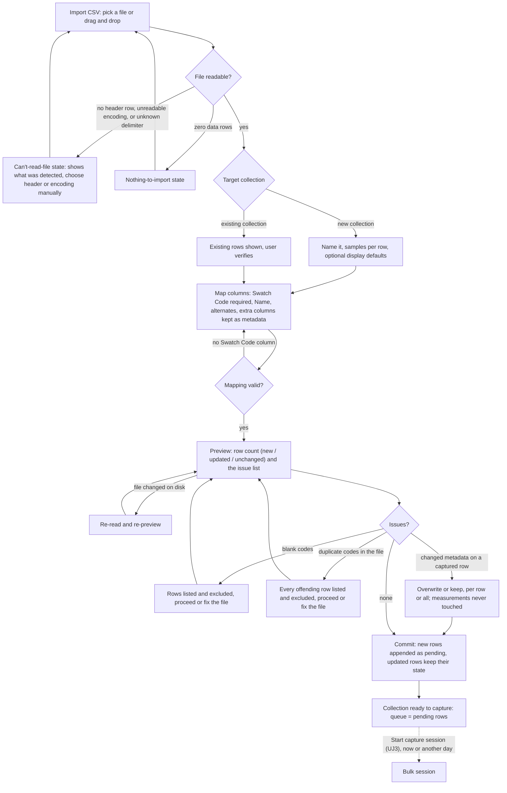

# Inventory Import PRD — user journeys

Companion to [prd-inventory-import.md](prd-inventory-import.md): what the Cataloger does and sees, journey by journey.
The requirement rows in that file are the rules; nothing here adds one, and the shipping copy is in [prd-inventory-import-copy.md](prd-inventory-import-copy.md).

## User Journeys

States are named here in plain language; the shipping copy for each is in [prd-inventory-import-copy.md](prd-inventory-import-copy.md), and the vocabulary these journeys use is defined in the [PRD](prd-inventory-import.md#vocabulary) and, for the terms it shares with capture, in the [capture PRD](../capture-mode/prd-capture-mode.md#vocabulary). Persona is the Cataloger unless the title says otherwise.

### Cluster 2 — Import an inventory

These three journeys moved here from the [capture journeys](../capture-mode/prd-capture-mode-journeys.md) under fence F49 and kept their numbers, so every citation of them stays true; clusters 1, 3, 4, and 5 are still there.

### UJ 2. Full collection bootstrap via CSV import

1. I choose to import a collection from a CSV.
2. I pick the file, or drag it in.
3. The app shows me what it found: the header row and the row count.
  - If there is no header row → the no-header-row state ([copy, §5](prd-inventory-import-copy.md#error--state-copy)); I name the columns or pick the header row myself
  - If the file cannot be read → the unreadable-file state ([copy, §5](prd-inventory-import-copy.md#error--state-copy)); nothing is imported
  - If the file has no data rows → the nothing-to-import state ([copy, §5](prd-inventory-import-copy.md#error--state-copy))
  - If some rows have the wrong number of columns → the excluded-rows notice ([copy, §5](prd-inventory-import-copy.md#error--state-copy))
4. I choose the target: a new collection, or an existing one (→ [UJ2.1](#uj-21-import-additional-rows-into-an-existing-collection)).
5. I name the new collection and set samples-per-row and, optionally, the display defaults, as in [UJ 1](../capture-mode/prd-capture-mode-journeys.md#uj-1-create-a-collection).
6. I map the columns ([UJ2.2](#uj-22-mapping-metadata-fields)) and save the mapping.
  - If nothing is mapped to Swatch Code → the mapping-incomplete state ([copy, §5](prd-inventory-import-copy.md#error--state-copy))
7. I review the preview: how many rows will land, and every issue found.
  - If some rows have a blank Swatch Code → the blank-codes-excluded state ([copy, §5](prd-inventory-import-copy.md#error--state-copy))
  - If a Swatch Code repeats inside the file → the duplicate-codes-in-file state ([copy, §5](prd-inventory-import-copy.md#error--state-copy))
  - If the file changed on disk before I commit → the file-changed state ([copy, §5](prd-inventory-import-copy.md#error--state-copy))
  - If the file is gone when I commit → the unreadable-file state ([copy, §5](prd-inventory-import-copy.md#error--state-copy))
8. I commit. Every row lands pending, in file order.
9. The collection is ready to capture. I start now ([UJ 3](../capture-mode/prd-capture-mode-journeys.md#uj-3-run-a-bulk-capture-session)), or I close the app and start tomorrow.

### UJ 2.1 Import additional rows into an existing collection

1. I choose to import, pick the file, and choose an existing collection as the target.
2. The app tells me the collection already has rows and asks me to confirm.
3. I map the columns; a mapping remembered from a file with the same headers arrives pre-filled ([UJ2.2](#uj-22-mapping-metadata-fields)).
4. I review the preview: how many rows are new, how many change, how many are unchanged, and how many rows in the collection this file does not mention.
  - If a row that already has a reading has different metadata in the file → the changed-metadata-on-captured-row choice ([copy, §5](prd-inventory-import-copy.md#error--state-copy)); my measurements are never touched either way
  - If a code in the file matches more than one row → the ambiguous-code state ([copy, §5](prd-inventory-import-copy.md#error--state-copy)); that row is neither created nor updated
  - Blank codes, duplicate codes inside the file, no data rows, an unreadable file: as in [UJ2](#uj-2-full-collection-bootstrap-via-csv-import)
5. I commit. New rows are appended as pending; rows already in the collection keep their state and their measurements; rows the file does not mention are left alone.
6. The collection is ready to capture, and my next session opens where I left off (fence F15).

### UJ 2.2 Mapping metadata fields

1. I map Swatch Code — required. It is the match key for a re-import and the way I find a row later ([§2](prd-inventory-import.md#2-target-mapping-and-the-matching-rule), fence F11).
  - If that column is not unique within the file → the duplicate-codes-in-file state ([copy, §5](prd-inventory-import-copy.md#error--state-copy))
2. I optionally map Swatch Name, Swatch Alternate Code, and Swatch Alternate Name.
3. Any column I do not map comes in as extra metadata I can see in the collection.
  - If a column has no header → the unnamed-column notice ([copy, §5](prd-inventory-import-copy.md#error--state-copy)); it arrives under a generated name I can change later
4. I save the mapping, and the app offers it again for the next file with the same headers.

The chart below covers [UJ2](#uj-2-full-collection-bootstrap-via-csv-import), [UJ2.1](#uj-21-import-additional-rows-into-an-existing-collection), and [UJ2.2](#uj-22-mapping-metadata-fields) together — the three-way count and the changed-metadata choice are UJ2.1's branches; the mapping box is UJ2.2.

