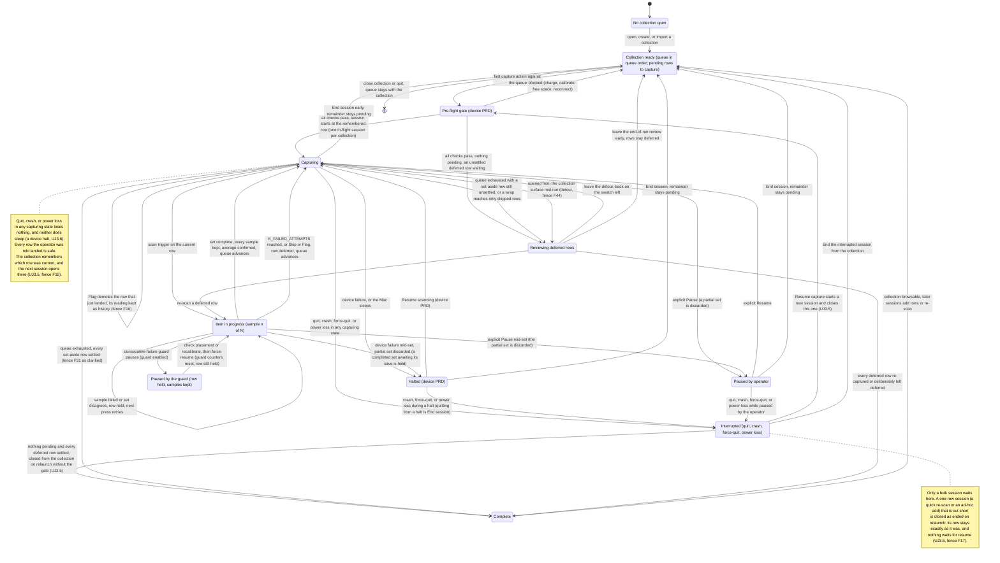
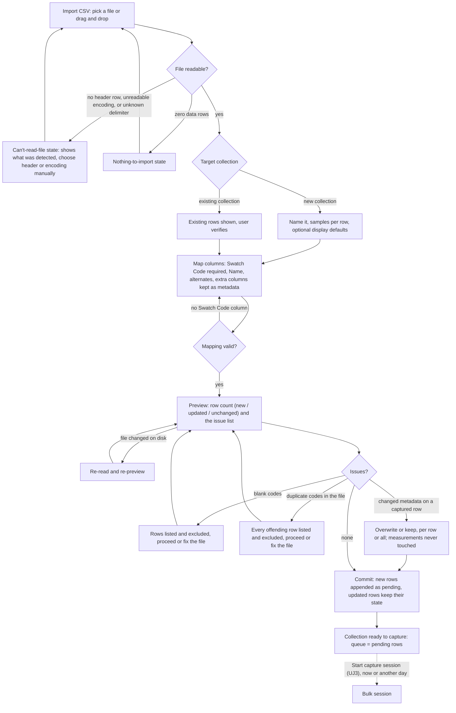
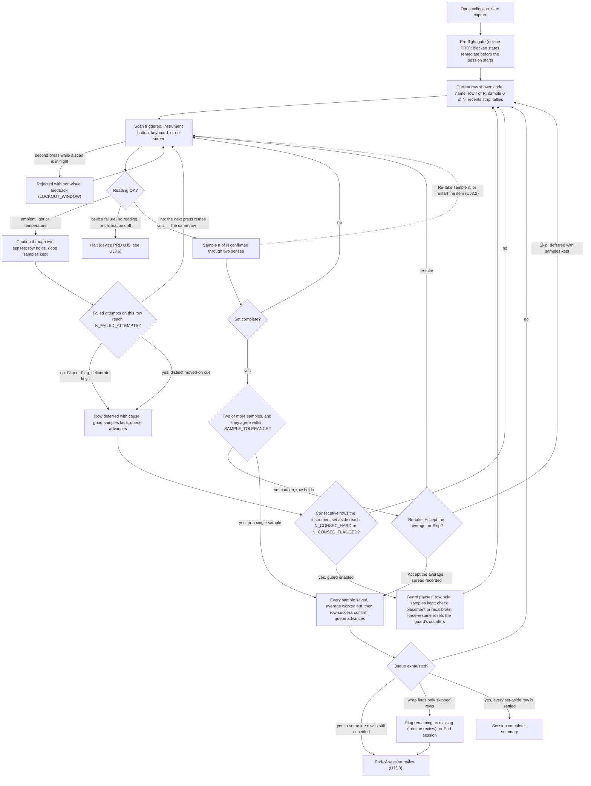
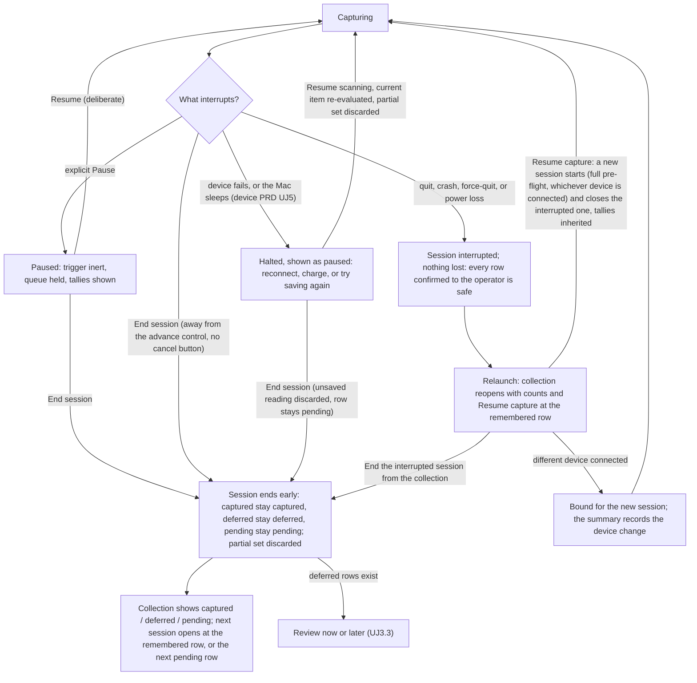
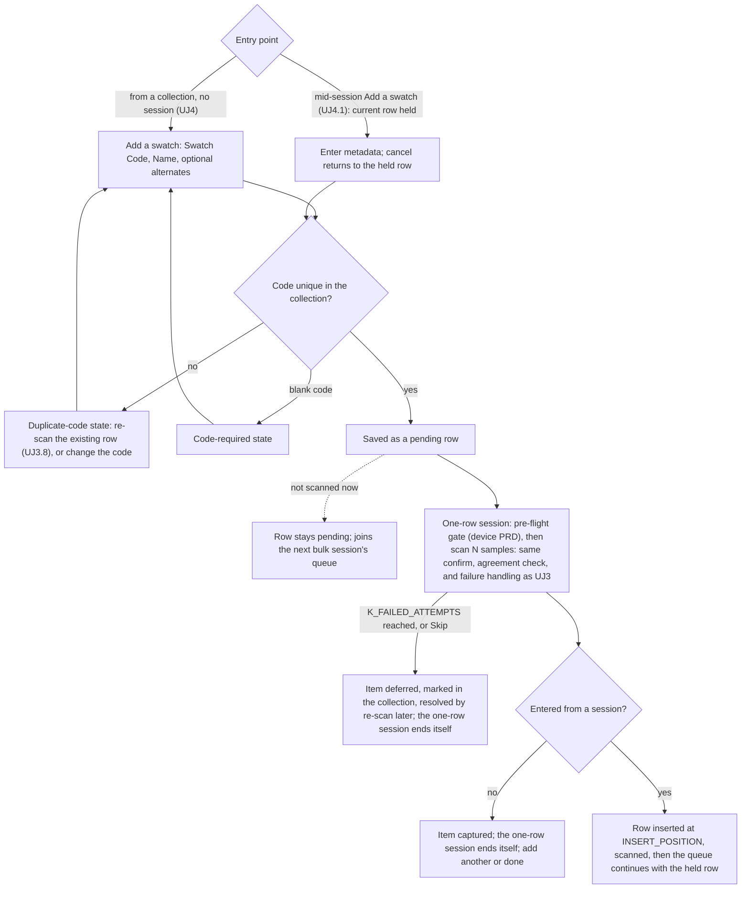

# Capture Mode PRD — user journeys

Companion to [prd-capture-mode.md](prd-capture-mode.md): what the Cataloger does and sees, journey by journey.
The requirement rows in that file are the rules; nothing here adds one, and the shipping copy is in [prd-capture-mode-copy.md](prd-capture-mode-copy.md).

## User Journeys

States are named here in plain language; the shipping copy for each is in [prd-capture-mode-copy.md](prd-capture-mode-copy.md), and the vocabulary these journeys use is defined once in the [PRD](prd-capture-mode.md#vocabulary). Persona is the Cataloger unless the title says otherwise. Citation shorthand: [acq v1](../briefs/acquisition-experience-research-results.md) and [acq v2](../briefs/acquisition-experience-research-results-v2.md) are the two acquisition-experience research passes (v2 supersedes v1 where they conflict); [browsing](../briefs/browsing-a-collection-at-scale-research-results.md) is the collection-browsing research; [SDK audit](../briefs/nix-universal-sdk-audit-findings.md) is the vendor SDK audit; [device PRD](prd-device-management.md) is the locked device-management PRD.

### The session, end to end

### Cluster 1 — Set up a place to capture into

### UJ 1. Create a collection

1. I choose to create a collection.
2. I name it.
  - If that name is already in use → the duplicate-collection-name state ([copy, §12](prd-capture-mode-copy.md#error--state-copy))
3. I accept or change the samples-per-row setting, which arrives pre-filled at 3, and the scan mode, which arrives pre-filled at M1.
4. I optionally set the collection's display defaults — illuminant and observer.
5. I save. The collection is ready, with an empty queue.
6. From here I import an inventory ([UJ2](#uj-2-full-collection-bootstrap-via-csv-import)) or add items one at a time ([UJ4](#uj-4-capture-a-single-new-item-into-a-collection)).
  - If I start a capture session with nothing pending and nothing deferred → the nothing-to-capture state ([copy, §12](prd-capture-mode-copy.md#error--state-copy))

UJ1.1 was folded into UJ1 when Library was dropped (fence F1).

### UJ 1.2 Manage collections — rename, delete

> Scope boundary — handed to Collection Mode. Per the [product README](README.md#4-collection-mode), Collection Mode owns editing surfaces, selection, and bulk operations; rename and delete are collection management, not capture. The steps below are kept verbatim so nothing the owner wrote is lost, and so the Collection Mode PRD inherits them with the two failure branches this pass adds. Ownership is decided by fence F3 ([fences](prd-capture-mode-fences.md)); they generate no requirement rows here beyond the inherited-obligation row [R1.8](prd-capture-mode.md#1-collections).

**Rename a collection**

1. I select a collection and choose to rename it.
2. I give it a new name and save.
  - If another collection already uses that name → the duplicate-collection-name state ([copy, §12](prd-capture-mode-copy.md#error--state-copy)); the rename does not apply

**Delete a collection**

1. I select a collection and choose to delete it.
2. I am warned that the collection and everything in it will be deleted.
  - If the collection has captured readings → the delete-with-captured-readings warning, which names the count and offers an export first (inherited obligation for the Collection Mode PRD)
  - If the collection has an active or interrupted session → the session-in-flight state; the session must end first (inherited obligation for the Collection Mode PRD)
3. I confirm, and the collection and its data are deleted.

### Cluster 2 — Import an inventory

### UJ 2. Full collection bootstrap via CSV import

1. I choose to import a collection from a CSV.
2. I pick the file, or drag it in.
3. The app shows me what it found: the header row and the row count.
  - If there is no header row → the no-header-row state ([copy, §12](prd-capture-mode-copy.md#error--state-copy)); I name the columns or pick the header row myself
  - If the file cannot be read → the unreadable-file state ([copy, §12](prd-capture-mode-copy.md#error--state-copy)); nothing is imported
  - If the file has no data rows → the nothing-to-import state ([copy, §12](prd-capture-mode-copy.md#error--state-copy))
  - If some rows have the wrong number of columns → the excluded-rows notice ([copy, §12](prd-capture-mode-copy.md#error--state-copy))
4. I choose the target: a new collection, or an existing one (→ [UJ2.1](#uj-21-import-additional-rows-into-an-existing-collection)).
5. I name the new collection and set samples-per-row and, optionally, the display defaults, as in [UJ1](#uj-1-create-a-collection).
6. I map the columns ([UJ2.2](#uj-22-mapping-metadata-fields)) and save the mapping.
  - If nothing is mapped to Swatch Code → the mapping-incomplete state ([copy, §12](prd-capture-mode-copy.md#error--state-copy))
7. I review the preview: how many rows will land, and every issue found.
  - If some rows have a blank Swatch Code → the blank-codes-excluded state ([copy, §12](prd-capture-mode-copy.md#error--state-copy))
  - If a Swatch Code repeats inside the file → the duplicate-codes-in-file state ([copy, §12](prd-capture-mode-copy.md#error--state-copy))
  - If the file changed on disk before I commit → the file-changed state ([copy, §12](prd-capture-mode-copy.md#error--state-copy))
  - If the file is gone when I commit → the unreadable-file state ([copy, §12](prd-capture-mode-copy.md#error--state-copy))
8. I commit. Every row lands pending, in file order.
9. The collection is ready to capture. I start now ([UJ3](#uj-3-run-a-bulk-capture-session)), or I close the app and start tomorrow.

### UJ 2.1 Import additional rows into an existing collection

1. I choose to import, pick the file, and choose an existing collection as the target.
2. The app tells me the collection already has rows and asks me to confirm.
3. I map the columns; a mapping remembered from a file with the same headers arrives pre-filled ([UJ2.2](#uj-22-mapping-metadata-fields)).
4. I review the preview: how many rows are new, how many change, how many are unchanged, and how many rows in the collection this file does not mention.
  - If a row that already has a reading has different metadata in the file → the changed-metadata-on-captured-row choice ([copy, §12](prd-capture-mode-copy.md#error--state-copy)); my measurements are never touched either way
  - If a code in the file matches more than one row → the ambiguous-code state ([copy, §12](prd-capture-mode-copy.md#error--state-copy)); that row is neither created nor updated
  - Blank codes, duplicate codes inside the file, no data rows, an unreadable file: as in [UJ2](#uj-2-full-collection-bootstrap-via-csv-import)
5. I commit. New rows are appended as pending; rows already in the collection keep their state and their measurements; rows the file does not mention are left alone.
6. The collection is ready to capture, and my next session opens where I left off (fence F15).

### UJ 2.2 Mapping metadata fields

1. I map Swatch Code — required. It is the match key for a re-import and the way I find a row later ([§2](prd-capture-mode.md#2-inventory-import), fence F11).
  - If that column is not unique within the file → the duplicate-codes-in-file state ([copy, §12](prd-capture-mode-copy.md#error--state-copy))
2. I optionally map Swatch Name, Swatch Alternate Code, and Swatch Alternate Name.
3. Any column I do not map comes in as extra metadata I can see in the collection.
  - If a column has no header → the unnamed-column notice ([copy, §12](prd-capture-mode-copy.md#error--state-copy)); it arrives under a generated name I can change later
4. I save the mapping, and the app offers it again for the next file with the same headers.

The chart below covers [UJ2](#uj-2-full-collection-bootstrap-via-csv-import), [UJ2.1](#uj-21-import-additional-rows-into-an-existing-collection), and [UJ2.2](#uj-22-mapping-metadata-fields) together — the three-way count and the changed-metadata choice are UJ2.1's branches; the mapping box is UJ2.2.

### Cluster 3 — The bulk session (the thesis)

### UJ 3. Run a bulk capture session

The product thesis: import first, then scan heads-down with no per-item metadata entry between scans ([AGENTS.md §4](../../AGENTS.md#4-non-negotiables); vision [J2](vision.md#j2-the-bulk-session-cataloger)). The target pace is the instrument's scan cycle, not the app.

1. I start a capture session on my collection. It opens at the row I was last on ([§3](prd-capture-mode.md#3-the-capture-session), fence F15).
  - If nothing is pending, and every swatch I set aside I already left set aside for good → the nothing-to-capture state ([copy, §12](prd-capture-mode-copy.md#error--state-copy)); the review does not open again (fence F31 as clarified)
  - If only set-aside swatches are left and any of them is still unsettled → the session opens straight into the review ([UJ3.3](#uj-33-resolve-the-deferred-error-queue-at-session-end))
  - If a session for this collection is already running → the app takes me back to it
  - If another collection's session is active or paused → the instrument-held state ([copy, §12](prd-capture-mode-copy.md#error--state-copy))
2. The pre-flight gate runs — battery, calibration, authorization, storage, and the muted-audio advisory ([device PRD UJ2](prd-device-management.md#uj-2-start-acquisition)).
  - If a check blocks → the device PRD's blocked state; my session has not started and my queue is untouched
  - If the Demo Device is connected → the simulated indicator is on the capture surface for the whole session ([UJ3.9](#uj-39-capture-with-the-demo-device-contributor))
3. The session starts. I see the current row's code and name, where I am in the queue, the sample counter, my tallies, and the last few rows I captured.
4. I put the instrument on the swatch and trigger a scan.
  - If I press again while a scan is running → the press is rejected with a distinct non-visual cue and nothing is lost ([§4](prd-capture-mode.md#4-the-scan-loop))
5. The instrument measures.
  - If it refuses the reading — light leaked in, or it is out of temperature range → [UJ3.1](#uj-31-a-scan-fails-mid-queue)
  - If the device disconnects, goes quiet, reports drift, runs low on battery, or the save fails → the device PRD's halt ([UJ3.6](#uj-36-device-fails-mid-session))
6. I hear and feel "sample 1 of N" without looking up.
7. I lift, reposition slightly, and press again until the set is done. I touch nothing on the Mac in between.
  - If a sample looked wrong to me → [UJ3.2](#uj-32-undo-or-redo-the-current-item)
8. The set is complete and the app checks that my samples agree.
  - If they disagree → the set-disagreement choice ([copy, §12](prd-capture-mode-copy.md#error--state-copy)): re-take, accept the average, or set the row aside
9. Every reading is saved and the average worked out from them, and only then do I get the row-success confirmation. The queue advances on its own and the row joins my recents.
  - If the save fails → the device PRD's halt; my completed set is held for "Try saving again" ([UJ3.6](#uj-36-device-fails-mid-session))
10. Steps 4–9 repeat, row after row. I never type, never confirm a dialog, and never look at the screen to know the last row landed.
  - If the swatch in my hand is not the current row → [UJ3.7](#uj-37-jump-to-a-different-row) or [UJ3.10](#uj-310-reorder-the-queue)
  - If the book has an item the file missed → [UJ4.1](#uj-41-insert-an-unplanned-item-mid-session)
  - If I need to stop → [UJ3.4](#uj-34-pause-and-end-a-session-early)
  - If the app quits, crashes, is force-quit, or the Mac loses power → [UJ3.5](#uj-35-resume-an-interrupted-session)
  - If the Mac sleeps → the device PRD's halt, not an interruption ([UJ3.6](#uj-36-device-fails-mid-session), fence F14)
11. The queue is exhausted.
  - If any swatch I set aside is still unsettled → the end-of-session review ([UJ3.3](#uj-33-resolve-the-deferred-error-queue-at-session-end)); the session is not complete yet
  - If every swatch I set aside I already left set aside for good → there is nothing left to settle and the session is complete (fence F31 as clarified)
  - If the queue wrapped onto rows I only skipped → the wrap-exhausted choice ([copy, §12](prd-capture-mode-copy.md#error--state-copy))
12. Session complete. The summary shows my counts, my elapsed time, and the way to the collection ([UJ5](#uj-5-session-ends-and-the-collection-is-reviewed-the-seam)).

### UJ 3.1 A scan fails mid-queue

1. Mid-set, a sample fails — light leaked under the aperture, or the instrument is out of temperature range.
2. A caution reaches me through two senses and names the cause ([copy, §12](prd-capture-mode-copy.md#error--state-copy)).
3. The row holds. My good samples are kept and my next trigger press retries the same row, so a reflexive re-press can never land a reading on the next swatch (fence F6).
  - If the retries keep failing → the row is set aside for me after K_FAILED_ATTEMPTS, I get a distinct moved-on cue ([copy, §12](prd-capture-mode-copy.md#error--state-copy)), and the queue advances once
  - If I would rather move on now → Skip sets the row aside with the samples I did take and advances once
  - If the row that just landed was wrong — wrong swatch, a smudge → Flag demotes it and keeps its reading as history (fences F9, F16)
  - If I press Flag right after a moved-on cue → the flag-has-nothing-to-demote notice ([copy, §12](prd-capture-mode-copy.md#error--state-copy)); that row is already waiting in the review
  - If the swatch is missing or damaged → Flag sets the current row aside with that cause and the queue advances
4. If the instrument keeps failing, the guard pauses the session and offers me a placement check or a recalibration ([copy, §12](prd-capture-mode-copy.md#error--state-copy)); my row stays under the instrument with its samples ([§5](prd-capture-mode.md#5-per-scan-failure-and-the-consecutive-failure-guard), fence F18).
5. Capture continues. Everything set aside is waiting in the end-of-session review ([UJ3.3](#uj-33-resolve-the-deferred-error-queue-at-session-end)); nothing is deleted and nothing needs a decision now.

### UJ 3.2 Undo or redo the current item

1. Mid-set, I realise the instrument slipped or the wrong swatch was under it.
2. "Re-take sample" throws away the last sample only; my next press replaces it.
3. "Restart item" throws away all of this item's samples; the row stays current.
4. I carry on from [UJ3](#uj-3-run-a-bulk-capture-session).
  - If I press either while a scan is running → the press is rejected and nothing is discarded ([§4](prd-capture-mode.md#4-the-scan-loop))
  - If the row is already captured and confirmed → the re-take-unavailable notice ([copy, §12](prd-capture-mode-copy.md#error--state-copy)); the correction is a re-scan ([UJ3.8](#uj-38-re-scan-an-already-captured-row))
  - If the queue has just moved on from a swatch that never landed — it was set aside for me, or I passed over it — and I have not scanned the new one yet → the nothing-to-undo notice ([copy, §12](prd-capture-mode-copy.md#error--state-copy)); neither swatch changes, and the one I left is either waiting for me at the end or still waiting in the queue
  - If a device halt cuts my set short → the item restarts from its first sample when I resume; there is nothing to undo
The chart below covers [UJ3](#uj-3-run-a-bulk-capture-session), [UJ3.1](#uj-31-a-scan-fails-mid-queue), and [UJ3.2](#uj-32-undo-or-redo-the-current-item) together — the caution branches are UJ3.1; the dashed edge is UJ3.2.

### UJ 3.3 Resolve the deferred-error queue at session end

1. The queue is exhausted with a swatch I set aside still unsettled, or I choose "Review the set-aside swatches", or I started a session with only unsettled set-aside swatches waiting. I see every one with its code, name, why it was set aside, how many attempts were made, and how many samples it kept.
2. I select a row, put the instrument on it, and take a full set exactly as in [UJ3](#uj-3-run-a-bulk-capture-session). I am never shown the earlier reading first.
  - If a sample fails → the row holds and my next press retries, as in [UJ3.1](#uj-31-a-scan-fails-mid-queue)
  - If the samples disagree again → the set-disagreement choice ([copy, §12](prd-capture-mode-copy.md#error--state-copy))
  - If the same cause repeats across rows → the guard pauses here too ([copy, §12](prd-capture-mode-copy.md#error--state-copy))
3. Or I choose "Leave it set aside" with a note — it is missing, damaged, or not worth the time today ([copy, §12](prd-capture-mode-copy.md#error--state-copy)) — or "Leave them all set aside" with one note for everything that is left (fence F31). A swatch I leave set aside is settled: it counts as dealt with, so it does not open the review again, and I can still scan it later if I change my mind (fence F31 as clarified).
4. When every row is captured or deliberately left, the session is complete.
  - If I came here with nothing left waiting in the queue, or from the stop-for-now summary after I'd already chosen to stop, and I leave before finishing → the session ends early ([UJ3.4](#uj-34-pause-and-end-a-session-early)); the rest stay deferred and are marked in my collection
  - If I came here as a detour, with swatches still waiting and no stop asked for → leaving puts me back on the swatch I was on, at its first sample, and my session carries on (fence F44 as clarified)
  - If I opened the list from my collection with nothing running → what I decide here just settles those swatches; a run I'd paused stays paused, one I'd already ended stays ended, and one that was cut short is closed as complete once nothing is left waiting and nothing is set aside undecided

### UJ 3.4 Pause and end a session early

1. Mid-queue I pause. The trigger goes inert; a press only shows me the paused state ([copy, §12](prd-capture-mode-copy.md#error--state-copy)).
2. Resume is a deliberate action and puts me back on my row at its first sample.
  - If the app quits, crashes, is force-quit, or loses power while paused → the session is interrupted exactly as it would be while capturing ([UJ3.5](#uj-35-resume-an-interrupted-session))
3. To stop for the day I choose "End session" — deliberately away from anything that advances the queue, and there is no cancel or abandon button.
4. The end-early summary tells me plainly what happens to everything ([copy, §12](prd-capture-mode-copy.md#error--state-copy)) and I confirm.
  - If rows are deferred → the summary offers the review now or later ([UJ3.3](#uj-33-resolve-the-deferred-error-queue-at-session-end))
  - If I end from a device halt → the device PRD's End-session warning applies first ([UJ3.6](#uj-36-device-fails-mid-session))
5. The session ends and my collection shows the counts, so I can see the state of the work without opening capture. What I see next is the seam ([UJ5](#uj-5-session-ends-and-the-collection-is-reviewed-the-seam)).

### UJ 3.5 Resume an interrupted session

1. Mid-queue the app quits, crashes, is force-quit, or the Mac loses power.
2. Nothing I was told landed is lost. The item I was in the middle of restarts from its first sample.
3. On relaunch my collection reopens with its counts and "Resume capture" at the row I was on ([copy, §12](prd-capture-mode-copy.md#error--state-copy)).
  - If the app cannot remember which collection I had open → I open it; it carries its own counts and the same offer
  - If the file holding the collection has moved → the collection-unavailable state ([copy, §12](prd-capture-mode-copy.md#error--state-copy))
  - If a device halt was open when the app died → it is closed as unresolved, so I see the interrupted session and not a stale halt ([device PRD §5](prd-device-management.md#5-mid-session-device-failure))
  - If nothing is pending and every set-aside swatch is settled → there is nothing to resume; the session is closed as complete and I see its summary
  - If what was cut short was a one-row re-scan or ad-hoc add → it is simply closed; its row is exactly as it was and nothing waits for me (fence F17)
4. "Resume capture" starts a fresh session at that row: the full pre-flight gate runs and whichever instrument is connected is used. My tallies and elapsed time carry over, so the summary reads as one run (fence F14).
  - If a different instrument is connected → it is used, and the summary records the change
  - If nothing is pending but a set-aside swatch is still unsettled → the new session opens straight into the review ([UJ3.3](#uj-33-resolve-the-deferred-error-queue-at-session-end))
  - If I do not want to continue → I can end the interrupted session from my collection without opening capture
  - If I only want one re-scan or one added item → that runs on its own and leaves the interrupted session waiting (fence F17)
5. Everything I set aside before the interruption is still in the review; nothing was re-inserted or duplicated.

### UJ 3.6 Device fails mid-session

> Scope boundary: device-level failure — disconnect, not responding, low battery, save failure — is detect → alert → reconnect → resume in the [device PRD UJ5](prd-device-management.md#uj-5-device-failure-during-a-session) and [§5](prd-device-management.md#5-mid-session-device-failure). This journey states only what capture does around that halt.

1. Mid-queue the device fails, or the Mac sleeps. Capture halts immediately and the alert reaches me through two senses ([device PRD UJ5](prd-device-management.md#uj-5-device-failure-during-a-session)).
  - If I press the trigger during the halt → nothing is asked of the instrument; the halt state surfaces instead
2. The capture surface shows the halt as paused, with the device PRD's recovery path. My current row, tallies, and recents stay visible.
3. When the cause clears, "Resume scanning" puts me back on my row. A part-finished set restarts from its first sample.
4. Capture continues.
  - If I end the session from the halt, or quit from it → the device PRD's End-session warning, then the remainder is handled as in [UJ3.4](#uj-34-pause-and-end-a-session-early)
  - If the halt was a failed save and "Try saving again" works → my held set is saved and the row is captured, with no duplicate
The chart below covers [UJ3.4](#uj-34-pause-and-end-a-session-early), [UJ3.5](#uj-35-resume-an-interrupted-session), and [UJ3.6](#uj-36-device-fails-mid-session) together — the halt branch is the device PRD's and is drawn only to its edges; the interruption branch is UJ3.5.

### UJ 3.7 Jump to a different row

1. Mid-queue, the swatch in my hand is not the current row.
2. I open the find field from the keyboard and type the start of the code, or part of the name — either of the swatch's own, or either of its alternates (fence F21).
3. I select a row; it becomes my current row at its first sample, and the row I left stays pending. Queue order is unchanged.
4. Capture continues. When the queue reaches the end it wraps to rows still pending, so anything I passed comes back to me.
  - If the code matches a row I already captured → the re-scan-offered state ([copy, §12](prd-capture-mode-copy.md#error--state-copy))
  - If it matches a row I set aside → that row becomes current and re-scanning it resolves it
  - If nothing matches → the no-matching-row state ([copy, §12](prd-capture-mode-copy.md#error--state-copy)), offering "Add a swatch"
  - If a wrap finds only rows I skipped without trying → the wrap-exhausted choice ([copy, §12](prd-capture-mode-copy.md#error--state-copy))
  - If I just want to pass over this row for now → Skip advances once and leaves it pending for the wrap

### UJ 3.8 Re-scan an already-captured row

1. From the capture surface mid-session, or from an item in my collection with no session open, I find the row by its code.
  - If another collection's session is active or paused → the instrument-held state ([copy, §12](prd-capture-mode-copy.md#error--state-copy))
  - If this collection's bulk session is paused → the re-scan borrows it for this one row and hands the queue back, still paused
  - If this collection's bulk session is interrupted → the re-scan runs on its own and leaves that session waiting (fence F17)
2. The app tells me the row is captured and offers "Re-scan". I am not shown its current value ([copy, §12](prd-capture-mode-copy.md#error--state-copy)).
3. I take a full set exactly as in [UJ3](#uj-3-run-a-bulk-capture-session), with the same failure handling ([UJ3.1](#uj-31-a-scan-fails-mid-queue)).
4. The new set becomes the row's value and the reading I had is kept as history — never overwritten, never deleted ([AGENTS.md §4](../../AGENTS.md#4-non-negotiables)). The confirmation says so.
  - If samples keep failing, or I skip → the re-scan is abandoned; the row keeps the value it had and the attempt is kept in its history
  - If the new samples disagree → the set-disagreement choice ([copy, §12](prd-capture-mode-copy.md#error--state-copy)); abandoning never changes the value I already had
  - If I meant "does this still match?" rather than "this one is wrong" → the QC-or-correction choice ([copy, §12](prd-capture-mode-copy.md#error--state-copy)); QC is the QC & Comparison PRD's journey (vision [J3](vision.md#j3-the-qc-pass-re-checker))
5. If I did this mid-session, the queue puts me back on the row I left, at its first sample, and carries on from there.

### UJ 3.9 Capture with the Demo Device (Contributor)

1. With no instrument and no license, I choose "Demo Device (simulated — no instrument)" ([device PRD UJ1.2](prd-device-management.md#uj-12-first-run-with-no-hardware-contributor)).
2. I import a sample inventory and start a session. Everything looks and behaves as it does with a real instrument, apart from a short list of hardware-only differences, with a simulated indicator always on screen and every reading permanently marked simulated ([device PRD §6](prd-device-management.md#6-mock-device-layer)).
3. I trigger scans on screen or from the keyboard, at the real instrument's pace.
4. I make it fail — light leakage, then out-of-range temperature — and walk [UJ3.1](#uj-31-a-scan-fails-mid-queue) end to end: the caution, hold and retry, Skip and Flag, the automatic set-aside with its moved-on cue, the guard's pause, and the review ([§11](prd-capture-mode.md#11-demo-device-and-verifiability) sequences the guard's two modes).
  - If a live per-scan error has no simulated twin → that is a build failure under the device PRD's parity gate, not a gap this journey can reach
5. I walk the halt and the interruption: fail a save, drop the connection, resume, and take a row; quit mid-queue and relaunch to "Resume capture"; then force-quit during a halt and relaunch to find the session waiting. Each time my counts are exactly what they were, I land on my row, and no row appears twice.
6. I open the collection: the simulated-readings banner is showing (inherited obligation for the Collection Mode PRD).

### UJ 3.10 Reorder the queue

1. Before a session, from my collection, I sort the pending rows by any column or drag them into the order I want. That is the queue order, and browsing under a different sort never changes it.
2. During a session, a keyboard action opens the queue list. My current item is held, not advanced, and keeps its samples.
3. I drag a pending row somewhere else, or apply a sort.
4. The new order is saved with the collection, and a resumed session keeps it.
5. Capture continues on the held row, and the queue wraps in the new order.
  - If I drag a row I already captured or set aside → the reorder-refused state ([copy, §12](prd-capture-mode-copy.md#error--state-copy)), offering re-scan or the review
  - If a re-import brings new rows → they are appended after my manual order
  - If I apply a sort over a manual order → the sort-over-manual-order confirm ([copy, §12](prd-capture-mode-copy.md#error--state-copy))

### Cluster 4 — Ad-hoc capture

### UJ 4. Capture a single new item into a collection

1. I choose a collection and choose to add a new swatch.
2. I enter Swatch Code and Swatch Name, and optionally the alternates.
  - If that code is already in the collection → the duplicate-code state ([copy, §12](prd-capture-mode-copy.md#error--state-copy)), offering a re-scan of the existing row or a different code
  - If the code is blank → the code-required state ([copy, §12](prd-capture-mode-copy.md#error--state-copy))
3. I save. The item is a pending row in my collection.
4. I choose to acquire from the device, which runs the pre-flight gate as any capture does ([device PRD UJ2](prd-device-management.md#uj-2-start-acquisition)).
  - If another collection's session is active or paused → the instrument-held state ([copy, §12](prd-capture-mode-copy.md#error--state-copy))
5. I take the collection's number of samples, with the same confirmation, agreement check, and failure handling as [UJ3](#uj-3-run-a-bulk-capture-session).
  - If samples keep failing, or I skip → the item is set aside, marked in my collection, and resolved by a re-scan later
  - If the device halts and I end from the halt → the device PRD's End-session warning; the item stays pending
6. Everything is saved and confirmed, the item is captured, and the one-row session closes itself.
7. I add another, or I am done — there is no queue to continue.
  - If I saved the metadata but never scanned → the row stays pending and joins my next bulk session
  - If the item looked wrong right after it landed → there is no flag-after-landing window here; the correction is a re-scan or a Flag from my collection ([UJ3.8](#uj-38-re-scan-an-already-captured-row), fence F9)

### UJ 4.1 Insert an unplanned item mid-session

1. Mid-queue I choose "Add a swatch". My current row is held.
2. I enter the code and name, and optionally the alternates — the one moment in a bulk session where I type.
  - If the code already exists → the duplicate-code state ([copy, §12](prd-capture-mode-copy.md#error--state-copy))
  - If I cancel → the add-item-cancelled state ([copy, §12](prd-capture-mode-copy.md#error--state-copy)); the queue puts me back on the held row and nothing was created
3. I save. The new row goes into the queue at INSERT_POSITION ([§9](prd-capture-mode.md#9-ad-hoc-capture-and-one-row-sessions), OQ 11) and becomes my current item.
4. I scan it exactly as I would any other row.
5. When it is captured the queue puts me back on the row I held, and then carries on in queue order, so nothing ahead or behind is skipped.
The chart below covers [UJ4](#uj-4-capture-a-single-new-item-into-a-collection) and [UJ4.1](#uj-41-insert-an-unplanned-item-mid-session) together — the two entry points converge on the same metadata form and scan; the dashed edge is the metadata-saved-but-not-scanned branch.

### Cluster 5 — The seam (made visible, not decided)

### UJ 5. Session ends and the collection is reviewed (the seam)

> This is the open question this PRD must settle for ADR-0004 ([product README](README.md#prd--adr-gates); [AGENTS.md §3](../../AGENTS.md#3-decided--recommended--open)). The two research passes disagree on the navigation model and the v2 pass says explicitly to re-open it before the ADR is written. The journey is written twice so the fork is visible; it does not pick, and [§10](prd-capture-mode.md#10-the-seam-capture-to-collection) holds the rows that must be true under either reading.

Common to both readings: each reading lands in the real collection the moment it is saved, an always-visible recents strip makes the just-captured item findable, and only the adjudication of deferred rows waits for session end ([§10](prd-capture-mode.md#10-the-seam-capture-to-collection)). The fork is about navigation and what I see, not about when my data lands.

**Reading A — capture is a modal takeover; hand-off at session end** ([acq v1 §11](../briefs/acquisition-experience-research-results.md); cited no shipped product)

1. "Start capture session" replaces my collection with a full-window capture surface; I cannot see the collection during the session.
2. The session runs ([UJ3](#uj-3-run-a-bulk-capture-session)); the recents strip is my only view of what has landed.
3. On complete or "End session" the capture surface is dismissed and my collection comes back, refreshed, with everything in place.
4. I browse, sort, open the rows that were set aside, and export.
  - If the app crashes mid-session → I land in my collection on relaunch, see the counts, and choose "Resume capture" to re-enter the takeover ([UJ3.5](#uj-35-resume-an-interrupted-session))

**Reading B — capture is a state of the live collection** ([acq v2 §11 Q11.6](../briefs/acquisition-experience-research-results-v2.md#11-the-seam--capture-to-collection); Lightroom Classic, Capture One, Dynamics 365)

1. "Start capture session" puts my collection into capture: the same window, the same rows, with the capture surface attached and at least two unmistakable mode indicators showing.
2. The session runs ([UJ3](#uj-3-run-a-bulk-capture-session)); each row appears in the collection as it lands, and the view follows the newest until I pin it.
3. On complete or "End session" the capture surface detaches; I am already looking at my collection, which has not changed shape.
4. I browse, sort, open the rows that were set aside, and export — on the same surface I was already on.
  - If the app crashes mid-session → my collection opens with the counts and "Resume capture"; re-entering capture re-attaches the surface ([UJ3.5](#uj-35-resume-an-interrupted-session))
  - If I click into the collection mid-session → capture shortcuts are inert off the capture surface, the mode indicators stay visible, and my session is not ended by navigation
**User-visible differences**

| Question | Reading A — modal takeover | Reading B — state of the collection |
| :--- | :--- | :--- |
| Where does the just-captured item appear during the session? | In the recents strip only; the collection is hidden | In the collection itself, live, plus the recents strip; auto-follow newest with a pin |
| How do you get back to browsing? | End the session (or complete it); the takeover is dismissed | You never left; the capture surface detaches |
| What does "End session" mean? | Leave the capture surface and return to the collection | Detach capture from the collection you are looking at |
| Mode indicators | The takeover itself is the indicator | At least two redundant indicators, required because the same view serves both modes |
| What does a crash mid-session look like? | Relaunch lands in the collection with counts and "Resume capture" | Same — the data behaviour is identical; only the surface differs |
| Mode-slip risk | Low — the whole keyboard belongs to capture | Higher — mitigated by focus-scoped shortcuts and no cancel button |
| "Two apps bolted together" risk | Higher — two places, one data model | Lower — one place, one vocabulary, one set of row states |
| Mid-session reorder and the queue list ([UJ3.10](#uj-310-reorder-the-queue)) | A second list inside the takeover | The collection's own list |

Under either reading the row states, the identifier vocabulary, and the counts are the same on both surfaces — the data-model finding ([acq v2 §11 Q11.6](../briefs/acquisition-experience-research-results-v2.md#11-the-seam--capture-to-collection)) — and it holds whichever navigation model the ADR picks. What decides it is a Demo Device prototype of each reading measured against the observables in [R10.7](prd-capture-mode.md#10-the-seam-capture-to-collection), then the owner's product call, written as ADR-0004 (OQ 8). The research default, for the owner to confirm or overrule, is Reading B — the only reading with shipped precedent. Recorded as input: the cross-model product lens preferred Reading A; mid-session reordering is cheap under Reading B and costs a second list inside the takeover under Reading A; and [UJ4.1](#uj-41-insert-an-unplanned-item-mid-session)'s typed metadata sits on the capture surface (fence F13).
