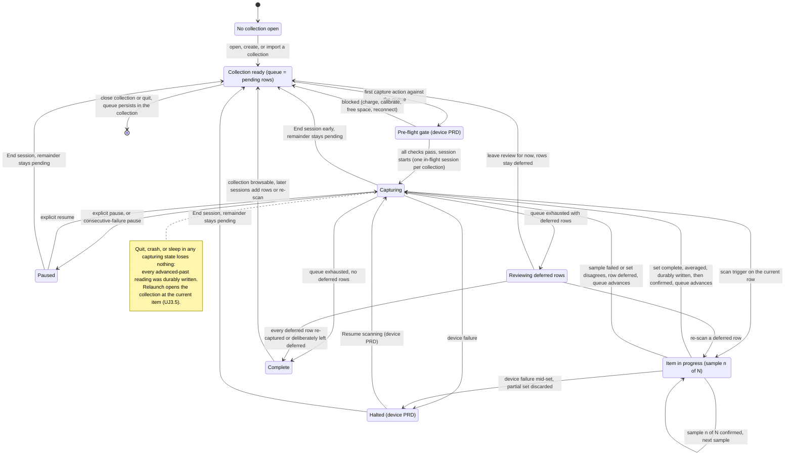
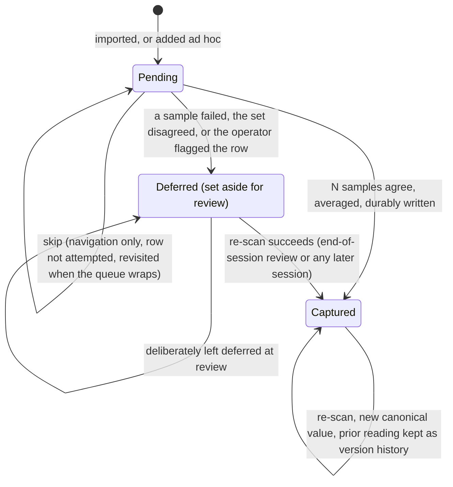
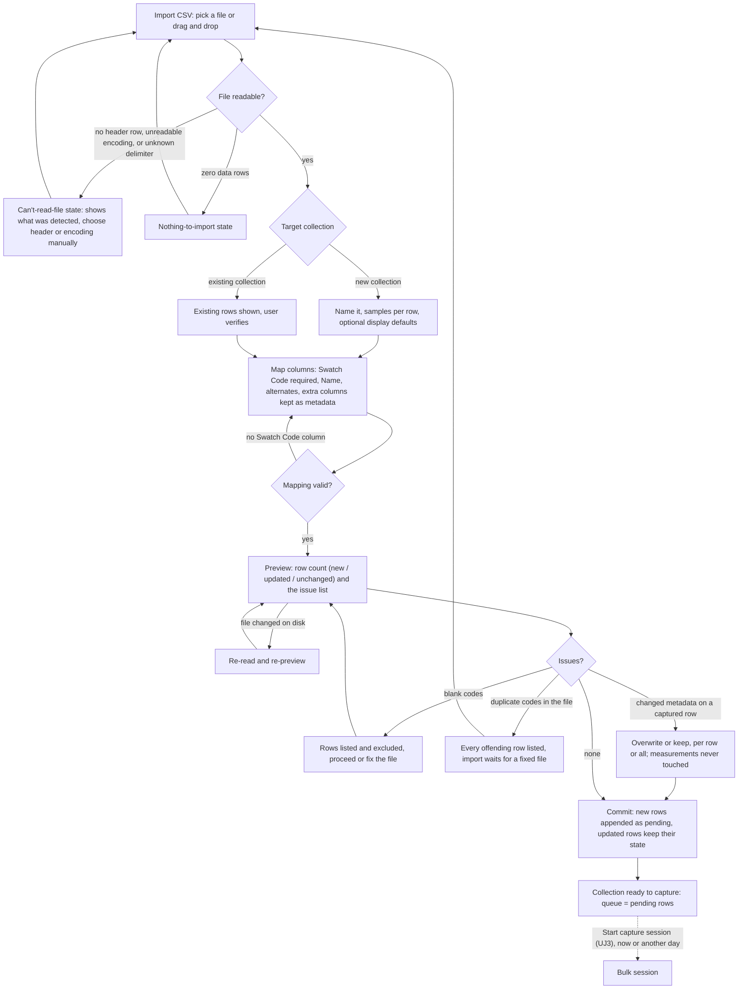
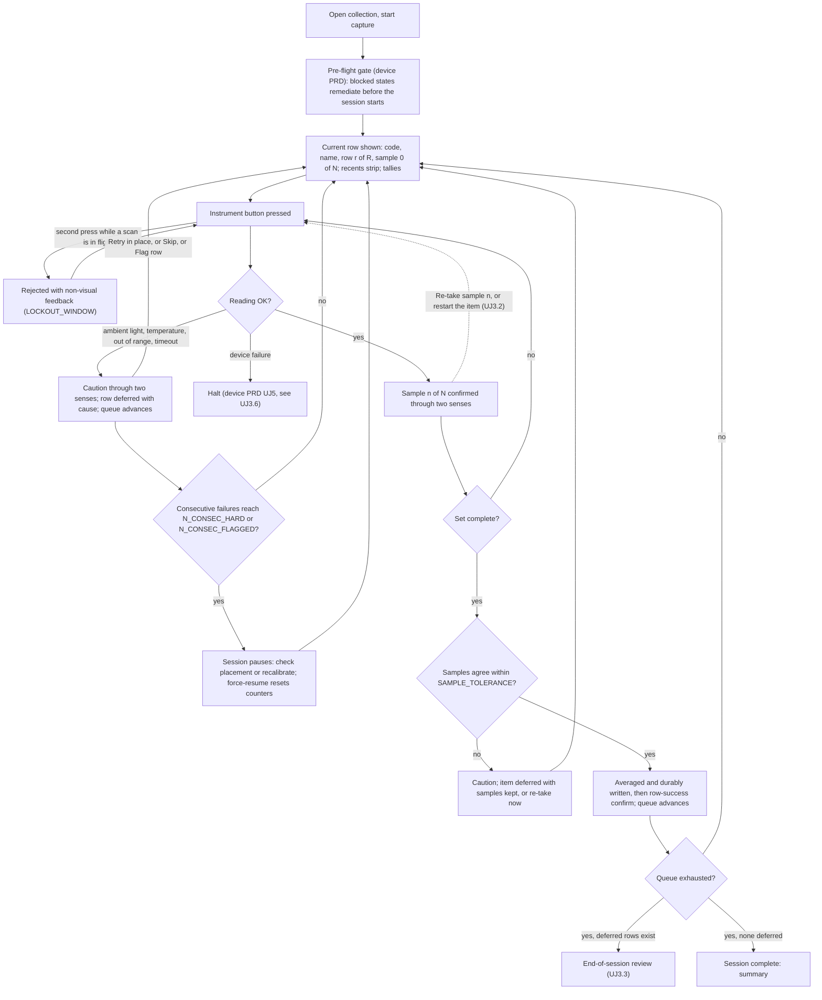
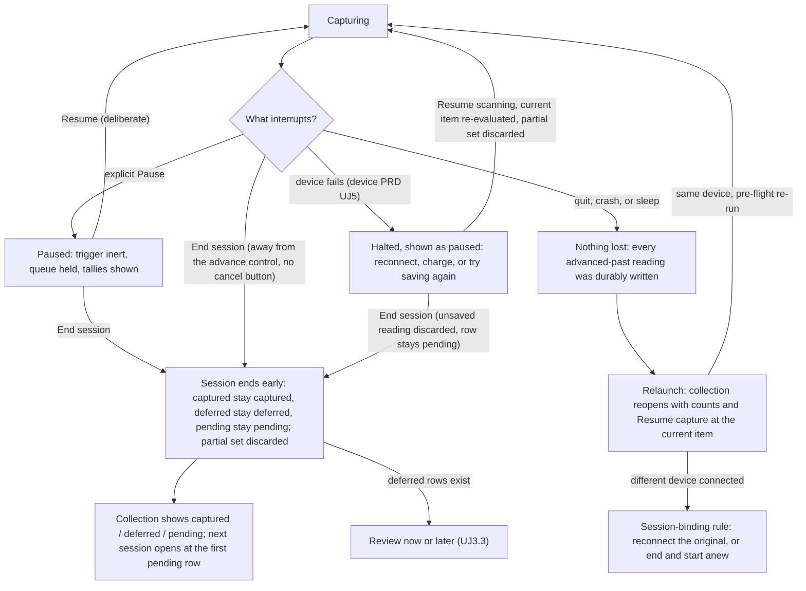
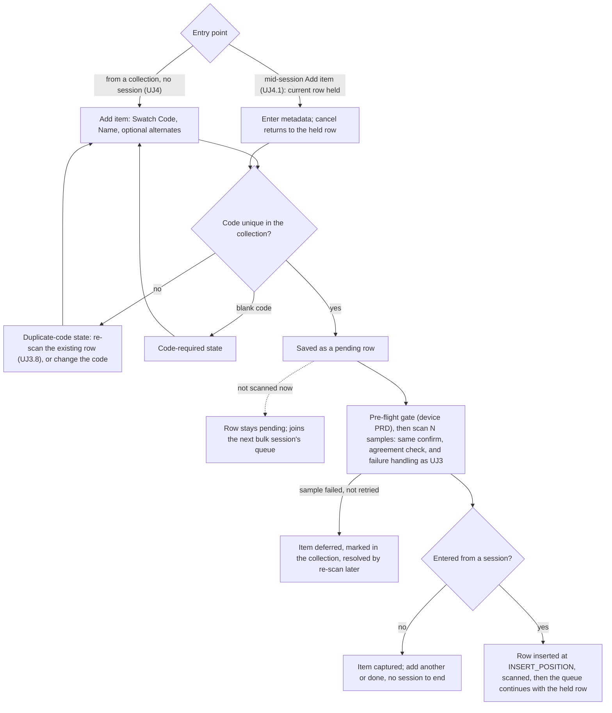

# PRD: Capture Mode

Author: Vinny Pasceri

# Background

SpectroCapture's primary value proposition is quick bulk capture of information using your spectrophotometer. The scope of this PRD covers all the requirements for the use cases, features, and user journeys related to the capture experience.

### Use cases

Defined in the [Vision doc](vision.md#use-cases):

|     | Use case                                 | Persona   | What serves it                                                         |
| --- | ---------------------------------------- | --------- | ---------------------------------------------------------------------- |
| U1  | **Bulk-digitize a predefined inventory** | Cataloger | CSV import with column mapping → queued scan, 1–5 samples/row averaged |
| U2  | **Capture a single new item ad hoc**     | Cataloger | metadata-first single capture into a chosen collection                 |

### Feature list

Defined in the [Vision doc](vision.md#feature-list):

| Pri | Feature                                  | Serves | Notes                                                          |
| --- | ---------------------------------------- | ------ | -------------------------------------------------------------- |
| P0  | CSV inventory import with column mapping | U1     | The inventory-first wedge                                      |
| P0  | Queued bulk scan, 1–5 samples averaged   | U1     | Heads-down; haptic confirm where available; row auto-advance   |
| P0  | Inline scan-failure handling             | U1     | Retry / skip / flag-row for light, battery, temperature errors |
| P1  | Ad-hoc single capture                    | U2     | Metadata-first, into a chosen collection                       |

### Capture workflow

The capture lifecycle end-to-end, as the Cataloger experiences it: a collection becomes a queue of pending rows (by import, [UJ2](#uj-2-full-collection-bootstrap-via-csv-import), or by adding items, [UJ4](#uj-4-capture-a-single-new-item-into-a-collection)); the first capture action runs the device PRD's pre-flight gate ([device PRD UJ2](prd-device-management.md#uj-2-start-acquisition)); the session then runs heads-down, one row at a time, each row a set of 1–5 samples ([UJ3](#uj-3-run-a-bulk-capture-session)); interruptions are either a device-level halt, owned by the device PRD ([device PRD UJ5](prd-device-management.md#uj-5-device-failure-during-a-session)), or a pause or early end owned here ([UJ3.4](#uj-34-pause-and-end-a-session-early)); and a session is complete only when every row is captured or has been deliberately left deferred after the end-of-session review ([UJ3.3](#uj-33-resolve-the-deferred-error-queue-at-session-end)). Two diagrams: the first is the session, the second is a single queue row. The seam between capture and the collection — what the user sees at session end — is deliberately not drawn here; it is the open question [UJ5](#uj-5-session-ends-and-the-collection-is-reviewed-the-seam) exposes for ADR-0004.

## User Journeys

States are named here in plain language; the copy for each state comes in the requirements pass. Persona is the Cataloger unless the title says otherwise. Citation shorthand: [acq v1](../briefs/acquisition-experience-research-results.md) and [acq v2](../briefs/acquisition-experience-research-results-v2.md) are the two acquisition-experience research passes (v2 supersedes v1 where they conflict); [browsing](../briefs/browsing-a-collection-at-scale-research-results.md) is the collection-browsing research; [SDK audit](../briefs/nix-universal-sdk-audit-findings.md) is the vendor SDK audit; [device PRD](prd-device-management.md) is the locked device-management PRD. Every number below is a named provisional constant with a candidate value and an open question (OQ); none is decided.

Vocabulary used throughout ([AGENTS.md §8](../../AGENTS.md#8-vocabulary), [acq v2 §1](../briefs/acquisition-experience-research-results-v2.md#1-queue-model-and-task-framing)): a queue row is **pending** (no durably written reading), **captured** (a canonical value exists), or **deferred** (a reading was attempted and failed, the samples disagreed, or the operator flagged it — the dead-letter state, set aside for end-of-session review). **Skip** is not a state: it is navigation past a pending row without attempting it; the row stays pending. No shipped system models "skipped" as a state — they record a decision or leave the row pending [acq v2 §1 Q1.1].

### Cluster 1 — Set up a place to capture into

### UJ 1. Create a collection

1. Initiate an action to create a collection
2. Name the collection
  - If a collection with that name already exists → the duplicate-collection-name state; the name must be unique among the user's collections
3. Select the number of samples to acquire per row (e.g. 3; range 1–5 — vision [U1](vision.md#use-cases)). This is the acquisition setting: it is the collection default for every session and can be changed between sessions ([acq v2 §6 Q6.4](../briefs/acquisition-experience-research-results-v2.md#6-durability-crash-safety-and-resumability)); whether it can change mid-session is an OQ
4. Optionally set the collection's display defaults: illuminant (e.g. D50) and observer (e.g. 2°). These are derivation-time settings, not acquisition settings — the raw payload is canonical and colour values are derived from it ([AGENTS.md §8](../../AGENTS.md#8-vocabulary); [SDK audit](../briefs/nix-universal-sdk-audit-findings.md): colour data is XYZ-backed and freely convertible, per SDK docs; confirm on hardware) — so they are never required at creation and can be changed at any time without re-scanning. The ISO 13655 measurement condition (M0/M1/M2) is a scan mode of the instrument, not an observer; which scan modes a capture records is an OQ against the SDK ([SDK audit](../briefs/nix-universal-sdk-audit-findings.md): Spectro 2 supports M0/M1, plus M2 on F2.x firmware, per SDK docs; confirm on hardware)
5. Save the collection
6. The collection is ready with an empty queue. From here the user imports an inventory ([UJ2](#uj-2-full-collection-bootstrap-via-csv-import)) or adds items one at a time ([UJ4](#uj-4-capture-a-single-new-item-into-a-collection)); "Start capture session" is available once the queue has at least one pending row
  - If the user starts a capture session on an empty queue → the empty-queue state, offering import or add item; nothing else happens

UJ1.1 was folded into UJ1 when Library was dropped (fence F1).

### UJ 1.2 Manage collections — rename, delete

> Scope boundary — handed to Collection Mode. Per the [product README](README.md#4-collection-mode), Collection Mode owns editing surfaces, selection, and bulk operations; rename and delete are collection management, not capture. The steps below are kept here verbatim so nothing the owner wrote is lost, and so the Collection Mode PRD inherits them with the two failure branches this pass adds (duplicate name; delete when captured readings exist). Ownership is decided by fence F3 (see [surfaced questions](#open-questions-surfaced-by-the-journeys)).

**Rename a collection**

1. Select a collection; initiate an action to rename the collection
2. Rename the collection to a new unique name
  - If the new name is already used by another collection → the duplicate-collection-name state; the rename does not apply; the name must be unique among the user's collections
3. Save the new collection name

**Delete a collection**

1. Select a collection; initiate an action to delete the collection
2. Display a warning that the collection and all information contained within it will be deleted
  - If the collection has captured readings → the delete-with-captured-readings warning names the count of captured rows and their version history, and offers export first; deletion is permitted (the "corrections never destroy data" rule, [AGENTS.md §4](../../AGENTS.md#4-non-negotiables), is about measurements, not containers) but is never the default action
  - If the collection has a capture session in flight → the session-in-flight state; the session must end ([UJ3.4](#uj-34-pause-and-end-a-session-early)) before the collection can be deleted
3. If the user confirms, delete the collection and the collection data.

### Cluster 2 — Import an inventory

Assumed for this pass (owner to confirm): the target collection is chosen or created in the app before columns are mapped; the collection name is not a CSV column in v1 (a CSV is normally one swatch book — one collection). Import ends with the collection ready to capture; starting the session is its own step, because import-today-scan-tomorrow is the normal case and the queue must survive between them ([UJ3.5](#uj-35-resume-an-interrupted-session)).

### UJ 2. Full collection bootstrap via CSV import

1. Initiate an action to import a collection via CSV
2. Select the CSV to import (or drag & drop the CSV)
3. The app reads the file and shows what it detected: header row, encoding, delimiter, and row count. Detection behaviour is an OQ — the research documents only that the parsing layer *can* be configured for encoding, delimiter, and malformed rows ([acq v1 §7](../briefs/acquisition-experience-research-results.md)), not what a good user-facing flow is
  - If no header row is detected → the no-header-row state; the user names the columns or picks the header row manually
  - If the encoding cannot be read → the unreadable-file state; the user chooses an encoding or re-saves the file; nothing is imported
  - If the file has zero data rows → the nothing-to-import state; the import ends
4. Choose the target: a new collection, or an existing collection (→ [UJ2.1](#uj-21-import-additional-rows-into-an-existing-collection)) — the app indicates which will be created and asks the user to validate
  - If the user chooses an existing collection → this becomes [UJ2.1](#uj-21-import-additional-rows-into-an-existing-collection)
5. Name the collection; select the number of samples to acquire per row (e.g. 3); optionally set illuminant and observer display defaults (as in [UJ1](#uj-1-create-a-collection) steps 3–4)
6. Map the columns ([UJ2.2](#uj-22-mapping-metadata-fields)): Swatch Code is required; Swatch Name, alternates, and any other columns follow
7. App validates the column mapping and allows the user to save the mapping
  - If no column is mapped to Swatch Code → the mapping-incomplete state; the mapping cannot be saved
8. Preview before commit: the row count, and the issue list. For a new collection every row is new, so the count is one number; for an existing collection it is the three-way count new / updated / unchanged — the count is the reconciliation interface ([acq v2 §7 Q7.5](../briefs/acquisition-experience-research-results-v2.md#7-inventory-import-and-column-mapping))
  - If some rows have a blank Swatch Code → those rows are listed by row number and excluded from the import, never silently imported ([acq v2 §7 Q7.3](../briefs/acquisition-experience-research-results-v2.md#7-inventory-import-and-column-mapping)); the user can proceed without them or fix the file and re-pick it
  - If the same Swatch Code appears more than once in the file → the duplicate-codes-in-file state lists every offending row number; the import does not proceed until the file is fixed — fail loudly, never first-row-wins ([acq v2 §7 Q7.3](../briefs/acquisition-experience-research-results-v2.md#7-inventory-import-and-column-mapping))
  - If the file changed on disk after it was read → the file-changed state; the app re-reads it and re-shows the preview
9. Save the mapping; the app remembers it for files with the same header signature ([UJ2.2](#uj-22-mapping-metadata-fields) step 7)
10. Create the new collection (or use the existing collection)
11. Import the data into the new collection; every imported row is pending
12. The collection is ready to capture: the queue is every pending row, in file order. "Start capture session" leads to [UJ3](#uj-3-run-a-bulk-capture-session); the user can equally close the app and start tomorrow

### UJ 2.1 Import additional rows into an existing collection

The idempotent re-import: a corrected or extended CSV for a collection that already has rows, some of them captured. Swatch Code is the match key — required and unique within a collection — not the row's identity ([acq v2 §7 Q7.3](../briefs/acquisition-experience-research-results-v2.md#7-inventory-import-and-column-mapping)).

1. Initiate an action to import a collection via CSV
2. Select the CSV to import (or drag & drop the CSV)
3. Choose the target: an existing collection — the app indicates there are existing rows in the collection and asks the user to verify that new rows will be imported into it
4. Map the columns ([UJ2.2](#uj-22-mapping-metadata-fields)); if the header signature matches a remembered mapping, it is pre-filled
5. App validates the column mapping and allows the user to save the mapping
6. Preview before commit: the three-way count — new rows (code not in the collection) / updated rows (code present, mapped metadata differs) / unchanged rows (code present, metadata identical) — plus the issue list, exactly as in [UJ2](#uj-2-full-collection-bootstrap-via-csv-import) step 8. Rows that are already found in the collection are not re-imported (i.e. idempotent)
  - If a code in the file matches more than one row in the collection → that row is a hard failure listed in the preview, neither created nor updated — an ambiguous key is never a guess ([acq v2 §7 Q7.3](../briefs/acquisition-experience-research-results-v2.md#7-inventory-import-and-column-mapping), the Salesforce "300" outcome). This cannot arise if codes are unique within a collection; the branch exists so the guarantee is stated
  - If an updated row is already captured → the changed-metadata-on-captured-row choice: overwrite the metadata or keep the existing values, per row or for all; the app states that measurements are never touched by a metadata change — the canonical value and its version history are unaffected either way ([acq v2 §7 Q7.5](../briefs/acquisition-experience-research-results-v2.md#7-inventory-import-and-column-mapping), the "Cool Grey 3 → Cool Grey III" hazard)
  - If a mapped column is present in the file but blank for a row → the blank value is treated as a change (it would clear the field) and appears under "updated" so the user sees it; a column omitted from the file entirely leaves existing values untouched ([acq v2 §7 Q7.5](../briefs/acquisition-experience-research-results-v2.md#7-inventory-import-and-column-mapping))
  - Blank codes, duplicate codes within the file, zero rows, unreadable file: as in [UJ2](#uj-2-full-collection-bootstrap-via-csv-import)
7. Save the mapping and commit
8. Import the data into the collection: new rows are appended to the queue as pending, in file order, after the existing rows; updated rows keep their state (a captured row stays captured, a pending row stays pending); unchanged rows are untouched
9. The collection is ready to capture; the queue is every pending row. If a session for this collection was interrupted earlier, the next session opens at the first pending row ([UJ3.5](#uj-35-resume-an-interrupted-session))

### UJ 2.2 Mapping metadata fields

1. Assume the user is at the point they need to map metadata fields
2. Map the Swatch Code field — required. It is the match key for re-import ([UJ2.1](#uj-21-import-additional-rows-into-an-existing-collection)) and the entry point for re-scan ([UJ3.8](#uj-38-re-scan-an-already-captured-row)), so it must be present and unique within the collection
  - If the chosen column is not unique within the file → the duplicate-codes-in-file state ([UJ2](#uj-2-full-collection-bootstrap-via-csv-import) step 8)
3. Map the Swatch Name field
4. Optional: Map the Swatch Alternate Code
5. Optional: Map the Swatch Alternate Name
6. Optional: For any additional columns that aren't mapped, they will be imported "as is" into the collection as additional metadata fields the collection experience can surface
  - If an unmapped column's header is blank → it is imported under a generated name ("Column 7") and listed in the preview so the user can rename it later in Collection Mode
7. The app remembers the mapping keyed by the file's header signature (the set of column names); the next import of a file with the same headers is pre-filled and the user confirms rather than re-maps. Whether a remembered mapping is a named, reusable template the user manages is an OQ

The chart below covers [UJ2](#uj-2-full-collection-bootstrap-via-csv-import), [UJ2.1](#uj-21-import-additional-rows-into-an-existing-collection), and [UJ2.2](#uj-22-mapping-metadata-fields) together — the three-way count and the changed-metadata choice are UJ2.1's branches; the mapping box is UJ2.2.

### Cluster 3 — The bulk session (the thesis)

Decided (fence F5): jump by code ([UJ3.7](#uj-37-jump-to-a-different-row)) and manual reordering ([UJ3.10](#uj-310-reorder-the-queue)) are both v1 journeys.

### UJ 3. Run a bulk capture session

The product thesis: import first, then scan heads-down with no per-item metadata entry between scans ([AGENTS.md §4](../../AGENTS.md#4-non-negotiables); vision [J2](vision.md#j2-the-bulk-session-cataloger)). The target pace is the instrument's scan cycle, not the UI.

1. Initiate a capture
2. If no collection is selected, select a collection. The queue is the collection's pending rows, in import order; the session opens at the first pending row
  - If the collection has no pending rows → the nothing-to-capture state, offering import ([UJ2.1](#uj-21-import-additional-rows-into-an-existing-collection)), add item ([UJ4](#uj-4-capture-a-single-new-item-into-a-collection)), or re-scan ([UJ3.8](#uj-38-re-scan-an-already-captured-row))
  - If a session for this collection is already in flight in this app → the app returns to it rather than starting a second; there is at most one in-flight session per collection, enforced structurally ([acq v2 §8 Q8.4](../briefs/acquisition-experience-research-results-v2.md#8-progress-orientation-and-session-completion))
3. The first capture action runs the pre-flight gate — battery, calibration currency, authorization window, storage headroom, and the muted-audio advisory ([device PRD UJ2](prd-device-management.md#uj-2-start-acquisition), [device PRD §4](prd-device-management.md#4-pre-flight-device-health))
  - If a check blocks → the device PRD's blocked state and its remediation; the session has not started and the queue is untouched
  - If system audio is muted → the device PRD's muted-audio advisory, so the operator knows the tone channel is off before going heads-down
  - If the connected device is the Demo Device → the persistent simulated indicator is on the capture surface for the whole session ([UJ3.9](#uj-39-capture-with-the-demo-device-contributor))
4. The session starts. The capture surface shows the current row — Swatch Code, Swatch Name, position "row r of R" — the sample counter "sample 0 of N", the session tallies (captured / deferred / pending), and the recents strip of the last few captured rows ([acq v2 §11 Q11.2](../briefs/acquisition-experience-research-results-v2.md#11-the-seam--capture-to-collection)). At least two redundant indicators say the app is in capture ([acq v2 §11 Q11.6](../briefs/acquisition-experience-research-results-v2.md#11-the-seam--capture-to-collection)); the surface has no cancel or abandon control, and "End session" sits deliberately away from anything that advances the queue ([acq v2 §8 Q8.4](../briefs/acquisition-experience-research-results-v2.md#8-progress-orientation-and-session-completion))
5. The operator places the instrument on the physical item and presses the instrument's own button; the host keyboard is reserved for queue management ([acq v1 §2](../briefs/acquisition-experience-research-results.md)). Whether the Spectro 2 button reaches the app as a trigger is unverified — the [SDK audit](../briefs/nix-universal-sdk-audit-findings.md) does not describe one and the research calls the instrument-button arm empirically untested ([acq v2 §2 Q2.1](../briefs/acquisition-experience-research-results-v2.md#2-heads-down-input-and-interaction-modality)) — so an on-screen or keyboard trigger must exist as the fallback (OQ)
  - If the button is pressed again while a scan is in flight → the second press is rejected, not queued and not silently dropped, with immediate non-visual feedback (a distinct rejection tone or haptic); the lockout lasts LOCKOUT_WINDOW (candidate 0.5 s from the barcode-scanner precedent — OQ) ([acq v2 §3 Q3.1](../briefs/acquisition-experience-research-results-v2.md#3-pacing-latency-and-feedback))
  - If the keyboard advance is bound to a bare Space or single letter → not allowed: capture shortcuts are active only while the capture surface has focus and never use bare single keys ([acq v2 §2 Q2.2](../briefs/acquisition-experience-research-results-v2.md#2-heads-down-input-and-interaction-modality))
6. The instrument measures. The reading arrives as one measurement per scan mode ([SDK audit](../briefs/nix-universal-sdk-audit-findings.md), per SDK docs; confirm on hardware); which modes the app keeps is an OQ. The illuminant/observer pair and the measurement condition are recorded with the reading so derivation is reproducible ([acq v2 §6 Q6.4](../briefs/acquisition-experience-research-results-v2.md#6-durability-crash-safety-and-resumability))
  - If the reading fails (ambient light, temperature, out-of-range, timeout) → [UJ3.1](#uj-31-a-scan-fails-mid-queue)
  - If the device disconnects, stops responding, drops below the battery threshold, or the save fails → the device PRD's halt ([UJ3.6](#uj-36-device-fails-mid-session))
7. Sample confirmed: "sample 1 of N" reaches the operator through at least two senses — a success tone, a haptic where the hardware provides one (Spectro 2/L carry device-side haptics, [SDK audit](../briefs/nix-universal-sdk-audit-findings.md), per SDK docs; whether the app can trigger them is the device PRD's OQ 20), and the on-screen counter ([acq v2 §4 Q4.1](../briefs/acquisition-experience-research-results-v2.md#4-mid-run-error-handling); audio-only is an accessibility regression, [acq v2 §2 Q2.2](../briefs/acquisition-experience-research-results-v2.md#2-heads-down-input-and-interaction-modality)). Feedback within PERCEPTUAL_FUSION_WINDOW (candidate 100 ms — OQ) of the trigger so the instrument and the app feel like one device ([acq v1 §3](../briefs/acquisition-experience-research-results.md))
8. The operator lifts, repositions slightly, and presses again; steps 5–7 repeat until "sample N of N". Nothing on the host is touched between samples ([acq v1 §1](../briefs/acquisition-experience-research-results.md))
  - If a sample looks wrong to the operator → [UJ3.2](#uj-32-undo-or-redo-the-current-item)
9. The set is complete: the app checks that the N samples agree within SAMPLE_TOLERANCE (a within-item spread; candidate ΔE2000 2.0 across the set, a placeholder with no evidence behind the value — OQ). No shipped precedent exists for this check; it is designed here, not inherited
  - If the samples disagree → a caution through two senses; the item is deferred with all its samples retained, and the queue advances — or the operator re-takes the item on the spot ([UJ3.2](#uj-32-undo-or-redo-the-current-item)). Never a silent average of a disagreeing set
10. The samples are averaged into one reading and durably written as the row's canonical value **before** anything else happens ([device PRD §5](prd-device-management.md#5-mid-session-device-failure): the durable write completes before the queue advances). The row is now captured
  - If the write fails → this is a device-PRD halt (disk full, collection file unreachable, unexpected error), not a per-scan error; the completed reading is held for "Try saving again" ([UJ3.6](#uj-36-device-fails-mid-session))
11. Row confirmed: the row-success confirmation (distinct from the per-sample confirm) fires only after the write — again through two senses — and the queue auto-advances to the next pending row; the recents strip shows the row just captured. An error tone always pre-empts an in-flight success tone ([acq v2 §4 Q4.1](../briefs/acquisition-experience-research-results-v2.md#4-mid-run-error-handling))
12. Steps 5–11 repeat, heads-down, row after row. The operator never types metadata, never confirms a dialog, and never looks at the screen to know whether the last row landed
  - If the physical order does not match the queue → [UJ3.7](#uj-37-jump-to-a-different-row) or [UJ3.10](#uj-310-reorder-the-queue)
  - If the swatch book has an item the CSV missed → [UJ4.1](#uj-41-insert-an-unplanned-item-mid-session)
  - If the operator needs to stop → [UJ3.4](#uj-34-pause-and-end-a-session-early)
  - If the app is quit, the Mac sleeps, or the app crashes → [UJ3.5](#uj-35-resume-an-interrupted-session)
13. The last pending row is captured. The queue is exhausted
  - If any rows are deferred → the session enters the end-of-session review ([UJ3.3](#uj-33-resolve-the-deferred-error-queue-at-session-end)); the session is not complete yet
14. Session complete — defined as: every row is captured, or has been deliberately left deferred after review. The session summary shows captured / deferred / pending counts (pending is zero here), elapsed time, and the way to the collection ([UJ5](#uj-5-session-ends-and-the-collection-is-reviewed-the-seam))
15. The collection is browsable, exportable, and plotted, with every row's canonical value in place (vision [J2](vision.md#j2-the-bulk-session-cataloger))

### UJ 3.1 A scan fails mid-queue

The inline scan-failure feature (P0). The instrument can fail a measurement for physical reasons — ambient light leakage, out-of-range temperature, calibration drift, low battery ([SDK audit](../briefs/nix-universal-sdk-audit-findings.md), per SDK docs; confirm on hardware). Low battery and disconnects are device-level and halt under the device PRD ([UJ3.6](#uj-36-device-fails-mid-session)); the rest are per-scan and are handled here, without stopping the run.

1. Mid-set on row r, a sample fails — ambient light leaked under the aperture, the instrument reports out-of-range temperature, the reading is out of range, or no reading arrives within SCAN_TIMEOUT (candidate: the instrument's measured cycle plus a margin, set on the hardware spike — OQ)
2. A caution reaches the operator through at least two senses — a distinct warning tone (never the success tone) and a haptic where available, plus the on-screen state naming the cause in plain language ([acq v2 §4 Q4.1](../briefs/acquisition-experience-research-results-v2.md#4-mid-run-error-handling)). The tone pre-empts any success tone in flight
3. Default behaviour is flag-and-continue: the row is deferred with the cause and any good samples retained, and the queue advances to the next pending row — the operator keeps physical momentum and resolves deferred rows at the end ([acq v1 §4](../briefs/acquisition-experience-research-results.md); [acq v1 §1](../briefs/acquisition-experience-research-results.md) dead-letter queue). The tally of deferred rows increments on screen
  - If the operator would rather fix it now → "Retry" re-takes the failed sample in place (the item stays current; the good samples are kept); the retry action is distinct from the queue-advance action, so a failure can never be dismissed by muscle memory ([device PRD §5](prd-device-management.md#5-mid-session-device-failure); [acq v2 §4 Q4.1](../briefs/acquisition-experience-research-results-v2.md#4-mid-run-error-handling))
  - If the operator wants to move on without attempting the row again → "Skip" is navigation: the row is left as it is (deferred if a sample already failed, pending if the operator skipped before triggering) and the queue advances
  - If the operator wants to mark a row suspect even though the reading succeeded (wrong swatch scanned, smudge) → "Flag row" defers the row with the reading retained, and the queue advances
4. Consecutive-failure guard, modelled on Westgard multirules but with clinical-analyser numbers that must be re-tuned for a hand-placed instrument ([acq v2 §4 Q4.2](../briefs/acquisition-experience-research-results-v2.md#4-mid-run-error-handling)): the guard is logged but does not pause during the first ~10 real sessions, then tuned from that data before it ships enabled
  - If N_CONSEC_HARD consecutive hard failures occur (candidate 2 — OQ) → the session pauses with a caution through two senses, naming the likely cause (placement, light leak, temperature) and offering "Check placement and resume" or "Recalibrate" ([device PRD §3](prd-device-management.md#3-calibration))
  - If N_CONSEC_FLAGGED consecutive rows are deferred (candidate 4 — OQ) → the session pauses and offers recalibration
  - If N_CONSEC_DRIFT consecutive readings drift the same direction from the session's baseline (candidate 10 — OQ; the lamp-drift detector the research calls the single highest-value rule) → the session pauses and prompts recalibration
  - In every pause the operator can force-resume; resuming resets the counters (manual override, [acq v2 §4 Q4.2](../briefs/acquisition-experience-research-results-v2.md#4-mid-run-error-handling))
5. Capture continues on the next pending row. Every deferred row is waiting in the end-of-session review ([UJ3.3](#uj-33-resolve-the-deferred-error-queue-at-session-end)); nothing has been deleted and nothing needs a decision now

### UJ 3.2 Undo or redo the current item

Undo here applies to the in-progress item only. Once a row is captured, history is the undo — re-scanning never destroys the prior value ([browsing §5](../briefs/browsing-a-collection-at-scale-research-results.md#5-selection-and-bulk-operations); [UJ3.8](#uj-38-re-scan-an-already-captured-row)).

1. Mid-set on row r, after "sample n of N", the operator realises the instrument slipped or the wrong swatch was under it
2. "Re-take sample" discards sample n only; the counter returns to "sample n−1 of N" and the next press replaces it. The action is a keyboard queue-management action, distinct from the trigger ([acq v1 §2](../briefs/acquisition-experience-research-results.md))
3. "Restart item" discards all samples of the current item; the counter returns to "sample 0 of N" and the row stays current
4. The operator continues from step 5 of [UJ3](#uj-3-run-a-bulk-capture-session)
  - If the set is already complete and written (the row-success confirmation fired) → there is nothing to undo here; the row is captured, and the correction is a re-scan ([UJ3.8](#uj-38-re-scan-an-already-captured-row)) that keeps the prior reading as version history. The app says so rather than offering a destructive undo
  - If a device halt interrupts an incomplete set → the partial set is discarded and the item restarts from sample 1 on resume ([device PRD §5](prd-device-management.md#5-mid-session-device-failure)); the operator does not need to undo anything

The chart below covers [UJ3](#uj-3-run-a-bulk-capture-session), [UJ3.1](#uj-31-a-scan-fails-mid-queue), and [UJ3.2](#uj-32-undo-or-redo-the-current-item) together — the caution branches are UJ3.1; the dashed edge is UJ3.2.

### UJ 3.3 Resolve the deferred-error queue at session end

The dead-letter queue (P0): deferred rows are resolved en masse at the end, not mid-run ([acq v1 §1](../briefs/acquisition-experience-research-results.md); the Dynamics 365 pattern of deferring only adjudication, [acq v2 §11 Q11.2](../briefs/acquisition-experience-research-results-v2.md#11-the-seam--capture-to-collection)). Whether this review is the same surface as the recents strip or a separate one is an OQ.

1. The queue is exhausted with one or more deferred rows, or the operator chooses "Review deferred rows" at any point. The review lists every deferred row with its code, name, cause (light leak, temperature, out of range, samples disagreed, flagged by you), and how many samples it retained
2. The operator selects a deferred row and places the instrument on it; the row becomes the current item and a full set of N samples is taken exactly as in [UJ3](#uj-3-run-a-bulk-capture-session) steps 5–11. The prior failed samples are kept as history, never shown as the expected answer (blind re-capture, [acq v2 §11 Q11.4](../briefs/acquisition-experience-research-results-v2.md#11-the-seam--capture-to-collection))
  - If the re-scan fails again → the row stays deferred with the new cause appended; the review moves to the next row; nothing is deleted
  - If the same physical cause repeats across rows (every re-scan reports light leak) → the consecutive-failure guard of [UJ3.1](#uj-31-a-scan-fails-mid-queue) step 4 applies here too
3. The operator can instead mark a row "Leave deferred" with an optional note (the swatch is missing, damaged, or not worth the time today). The row stays deferred; the decision is recorded
4. When every deferred row is either captured or deliberately left deferred, the session is complete ([UJ3](#uj-3-run-a-bulk-capture-session) step 14)
  - If the operator leaves the review before every row is resolved → the session ends early ([UJ3.4](#uj-34-pause-and-end-a-session-early)); the unresolved rows stay deferred and appear in the next session's review and in the collection, marked

### UJ 3.4 Pause and end a session early

This journey defines the un-scanned remainder the device PRD hands to this one ([device PRD §5](prd-device-management.md#5-mid-session-device-failure)): ending a session early leaves every un-captured row pending and every deferred row deferred; nothing is discarded, ever.

1. Mid-queue, the operator pauses — an explicit "Pause" action on the capture surface (a keyboard queue-management action, never the trigger). The instrument trigger is inert while paused: a press surfaces the paused state and is not accepted
2. The paused state shows the tallies and the current row; "Resume" is a deliberate action and returns to the current row at "sample 0 of N" — a partial set is not carried across a pause
3. To stop for the day, the operator chooses "End session". It is not on the capture surface's advance path and there is no cancel or abandon button — the Dynamics 365 precedent of removing the abandon affordance from the counting surface ([acq v2 §8 Q8.4](../briefs/acquisition-experience-research-results-v2.md#8-progress-orientation-and-session-completion))
4. The end-early summary states plainly: captured rows stay captured, deferred rows stay deferred, pending rows stay pending and the next session opens at the first pending row. The user confirms
  - If the current item has an incomplete set → the summary says those samples are discarded and the row stays pending
  - If deferred rows exist → the summary offers the review now ([UJ3.3](#uj-33-resolve-the-deferred-error-queue-at-session-end)) or later; leaving them is allowed
  - If the session ends from a device halt → the device PRD's End-session warning applies (a held unsaved reading is discarded and its row stays pending); the remainder is handled exactly as above ([UJ3.6](#uj-36-device-fails-mid-session))
5. The session ends. The collection shows the counts — captured / deferred / pending — on its own surface, so the state of the work is visible without opening capture. What the user sees next is the seam ([UJ5](#uj-5-session-ends-and-the-collection-is-reviewed-the-seam))

### UJ 3.5 Resume an interrupted session

The session-persistence obligation inherited from the device PRD ([device PRD §5](prd-device-management.md#5-mid-session-device-failure)): the queue and its state live in the collection file, so an interruption of any kind — quit, crash, force-quit, system sleep, power loss — is recovered from the collection, not from app memory.

1. Mid-queue, the app is quit, crashes, or the Mac sleeps and the device disconnects
2. Nothing is lost: every row the queue advanced past was durably written before the advance ([device PRD §5](prd-device-management.md#5-mid-session-device-failure)); the in-flight item's partial samples are gone and it restarts from sample 1
3. On relaunch, the app reopens the collection that was open and shows the session state — captured / deferred / pending — and "Resume capture" at the current item, defined as the first queue row with no durably written reading, evaluated now ([device PRD §5](prd-device-management.md#5-mid-session-device-failure)). Remembering *which* collection was open is a convenience; the durable record is the collection file itself ([acq v2 §8](../briefs/acquisition-experience-research-results-v2.md#8-progress-orientation-and-session-completion))
  - If the app cannot remember which collection was open → the user opens it; the collection carries its own counts and the same "Resume capture"
  - If the collection file has moved or is unavailable → the collection-unavailable state; the user locates the file. Nothing about the session is stored anywhere else
  - If a device halt was open at termination → it is closed as "unresolved — app terminated" ([device PRD §5](prd-device-management.md#5-mid-session-device-failure)); the user sees the paused session, not a stale halt
  - If the Mac slept without quitting → the device PRD's halt-and-resume applies ([UJ3.6](#uj-36-device-fails-mid-session)); on wake the health checks re-evaluate and "Resume scanning" is the way back
4. "Resume capture" re-runs the pre-flight gate (the device may have changed state) and continues at the current row — [UJ3](#uj-3-run-a-bulk-capture-session) step 4 onward. The session binds to the same device it started with ([device PRD §1](prd-device-management.md#1-device-pairing))
  - If the original device is not the one connected → the device PRD's session-binding rule: a different device cannot take over; the user reconnects the original or ends the session and starts a new one on the new device
5. Deferred rows from before the interruption are still in the review ([UJ3.3](#uj-33-resolve-the-deferred-error-queue-at-session-end)); nothing was re-inserted or duplicated

### UJ 3.6 Device fails mid-session

> Scope boundary: device-level failure — disconnect, not responding, battery below threshold, save failure — is detect → alert → reconnect → resume in the [device PRD UJ5](prd-device-management.md#uj-5-device-failure-during-a-session) and [§5](prd-device-management.md#5-mid-session-device-failure). This journey states only what capture does around that halt.

1. Mid-queue the device fails; capture halts immediately and the alert reaches the operator through two senses ([device PRD UJ5](prd-device-management.md#uj-5-device-failure-during-a-session)). The scan-accept path is suppressed: a trigger press during the halt surfaces the halt state
2. The capture surface shows the halt as "paused" with the device PRD's recovery path. The current row, tallies, and recents strip stay visible so the operator knows where they are
3. When the cause clears, "Resume scanning" returns to the current item — the first row with no durably written reading. A partial multi-sample set is discarded and the item restarts from sample 1 ([device PRD §5](prd-device-management.md#5-mid-session-device-failure))
4. Capture continues ([UJ3](#uj-3-run-a-bulk-capture-session) step 5)
  - If the operator chooses "End session" from the halt → the device PRD's End-session warning (a held unsaved reading is discarded; its row stays pending), then the remainder is handled per [UJ3.4](#uj-34-pause-and-end-a-session-early) step 4: captured stay captured, deferred stay deferred, pending stay pending
  - If the halt was a save failure and "Try saving again" succeeds → the held reading is written and the row is captured; no duplicate is created because the current item is re-evaluated at resume ([device PRD §5](prd-device-management.md#5-mid-session-device-failure))

The chart below covers [UJ3.4](#uj-34-pause-and-end-a-session-early), [UJ3.5](#uj-35-resume-an-interrupted-session), and [UJ3.6](#uj-36-device-fails-mid-session) together — the halt branch is the device PRD's and is drawn only to its edges; the interruption branch is UJ3.5.

### UJ 3.7 Jump to a different row

Physical order rarely matches CSV order for the whole run — a marker set sorted by hue, a swatch book with an insert. No shipped precedent supports reordering the queue; the identifier-as-entry-point pattern does ([acq v2 §11 Q11.4](../briefs/acquisition-experience-research-results-v2.md#11-the-seam--capture-to-collection)) — the owner nonetheless wants manual reordering (fence F5); see [UJ3.10](#uj-310-reorder-the-queue).

1. Mid-queue, the item in the operator's hand is not the current row
2. The operator finds the row by code or name — a keyboard queue-management action that opens a find field on the capture surface; typing narrows to matching pending rows
3. Selecting a row makes it the current item at "sample 0 of N"; the row the operator left stays pending. The queue order is unchanged
4. Capture continues ([UJ3](#uj-3-run-a-bulk-capture-session) step 5). When the queue reaches its end, it wraps to the first still-pending row, so skipped-past rows are revisited without the operator tracking them
  - If the code matches a captured row → the app says so and offers re-scan ([UJ3.8](#uj-38-re-scan-an-already-captured-row)) rather than silently making it current
  - If the code matches a deferred row → the row becomes current and its re-scan resolves it, as in the review ([UJ3.3](#uj-33-resolve-the-deferred-error-queue-at-session-end))
  - If nothing matches → the no-matching-row state offers "Add item" ([UJ4.1](#uj-41-insert-an-unplanned-item-mid-session))
  - If the operator simply wants to pass over the current row for now → "Skip" advances to the next pending row and leaves this one pending; it is navigation, not a state, and the row is revisited on wrap

### UJ 3.8 Re-scan an already-captured row

The correction path (vision [U5](vision.md#use-cases)). The identifier is the entry point: type or find a code and the app attaches to the existing row — no separate "re-scan this row" navigation ([acq v2 §11 Q11.4](../briefs/acquisition-experience-research-results-v2.md#11-the-seam--capture-to-collection)). The storage semantics — canonical value, version history — are the Data Foundation PRD's; this journey states only what the operator experiences.

1. From the capture surface (mid-session, or with no session open), or from an item in the collection, the operator enters or finds the row's code
2. The app shows that the row is captured and offers "Re-scan". The prior value is not shown while re-scanning — blind re-capture, so the prior reading cannot bias the operator ([acq v2 §11 Q11.4](../briefs/acquisition-experience-research-results-v2.md#11-the-seam--capture-to-collection))
3. A full set of N samples is taken exactly as in [UJ3](#uj-3-run-a-bulk-capture-session) steps 5–11, with the same failure handling ([UJ3.1](#uj-31-a-scan-fails-mid-queue))
4. On the durable write, the new reading becomes the row's canonical value and the prior reading is kept as version history — never overwritten, never deleted ([AGENTS.md §4](../../AGENTS.md#4-non-negotiables), [§8](../../AGENTS.md#8-vocabulary)). The row stays captured; the confirmation says a prior reading was kept
  - If the re-scan fails or its samples disagree → the row stays captured with its existing canonical value; the failed attempt is recorded as history, not as a deferral — a good reading is never demoted by a bad retry
  - If the operator meant QC, not correction (does this still match?) → that is the QC & Comparison PRD's journey (vision [J3](vision.md#j3-the-qc-pass-re-checker)); the app offers both so the intent is explicit, because a QC scan never touches the canonical value and a re-scan does
5. If the re-scan was made mid-session, the queue returns to the row it left; the re-scanned row's position in the queue is unchanged

### UJ 3.9 Capture with the Demo Device (Contributor)

1. A contributor with no instrument and no license selects "Demo Device (simulated — no instrument)" ([device PRD UJ1.2](prd-device-management.md#uj-12-first-run-with-no-hardware-contributor))
2. Imports a sample inventory ([UJ2](#uj-2-full-collection-bootstrap-via-csv-import)) and starts a capture session ([UJ3](#uj-3-run-a-bulk-capture-session)). Flows, states, and error surfaces are identical to the live device; the capture surface carries a persistent simulated indicator for the whole session, and every reading is permanently marked simulated ([device PRD §6](prd-device-management.md#6-mock-device-layer))
3. The Demo Device's trigger is on-screen or keyboard (there is no physical button); it paces at the real device's measured timing by default, never instantly ([device PRD §6](prd-device-management.md#6-mock-device-layer))
4. The contributor injects an ambient-light error and an out-of-range-temperature error — both exist in the simulated device's injection set and are parity-gated ([device PRD §6](prd-device-management.md#6-mock-device-layer)) — and walks [UJ3.1](#uj-31-a-scan-fails-mid-queue) end to end: caution, deferral, retry, the consecutive-failure pause, and the end-of-session review ([UJ3.3](#uj-33-resolve-the-deferred-error-queue-at-session-end))
  - If a live-device per-scan error has no injection → that is a build failure under the device PRD's parity gate, not a gap this journey can reach
5. Injects a store-write failure and a disconnect to walk [UJ3.6](#uj-36-device-fails-mid-session) and [UJ3.5](#uj-35-resume-an-interrupted-session); confirms nothing is lost, re-inserted, or duplicated
6. Opens the collection: the simulated-readings banner is showing (a Collection Mode inherited obligation, [device PRD §6](prd-device-management.md#6-mock-device-layer))

### UJ 3.10 Reorder the queue

Reordering is original design with no shipped precedent: the research supports identifier-as-entry-point only ([acq v2 §11 Q11.4](../briefs/acquisition-experience-research-results-v2.md#11-the-seam--capture-to-collection)). The owner wants it anyway (fence F5) — physical order rarely matches CSV order for a whole run, and a marker set sorted by hue bears no relation to the file it was imported from.

1. Before a session, from the collection: the operator sorts the pending rows by any metadata column (Swatch Code, Swatch Name, alternates, or any other imported column), or drags rows into a manual order
2. During a session, from the capture surface: a keyboard queue-management action opens the queue list; the current item is held, not advanced
3. From the queue list, the operator drags a pending row to a new position, or applies a sort
4. The new order is saved. A reorder never changes any row's state: captured rows are never re-queued, and deferred rows stay deferred
5. Reordering mid-session does not discard the current item's samples; the held item resumes exactly where it was
6. The order persists in the collection, so a resumed session ([UJ3.5](#uj-35-resume-an-interrupted-session)) keeps it
7. The queue wraps to still-pending rows in the new order, exactly as it would in file order ([UJ3](#uj-3-run-a-bulk-capture-session) step 12)
  - If the operator drags a captured or deferred row → it is not part of the pending queue; the app says so and offers re-scan ([UJ3.8](#uj-38-re-scan-an-already-captured-row)) or the review ([UJ3.3](#uj-33-resolve-the-deferred-error-queue-at-session-end))
  - If a re-import ([UJ2.1](#uj-21-import-additional-rows-into-an-existing-collection)) appends rows after a manual order → the new rows append at the end; the manual order is kept
  - If a sort is applied while a manual order exists → the app asks before replacing the manual order

Named as OQs: REORDER_SCOPE (whether a reorder covers the whole queue or only the un-captured remainder), whether a sort is remembered as the collection's default order, and drag-during-session ergonomics (one-handed, with the instrument in the other hand).

### Cluster 4 — Ad-hoc capture

The thinnest-evidenced cluster: the vision names U2 as "metadata-first single capture into a chosen collection" and no research pass elaborates it. The one adjacent precedent is an explicit "Add item" control for something physically present but not in the worklist ([acq v2 §11 Q11.4](../briefs/acquisition-experience-research-results-v2.md#11-the-seam--capture-to-collection)). Two entry points, two journeys.

### UJ 4. Capture a single new item into a collection

No queue and no session — one item, metadata first, then the scan (vision [U2](vision.md#use-cases)).

1. Initiate a capture
2. If no collection is selected, select a collection
3. Initiate an action to add a new swatch
4. User enters Swatch Code, Swatch Name, and optionally adds Swatch Alternate Code, Swatch Alternate Name
  - If the Swatch Code already exists in the collection → the duplicate-code state: the code is unique within a collection, so the app offers re-scan of the existing row ([UJ3.8](#uj-38-re-scan-an-already-captured-row)) or a different code; it never creates a second row with the same code
  - If the Swatch Code is blank → the code-required state; the item cannot be saved
5. Save — the item is a pending row in the collection
6. Initiate an action to acquire from device — the pre-flight gate runs as for any capture ([device PRD UJ2](prd-device-management.md#uj-2-start-acquisition))
7. Device acquires color information; loop until number of captures are met (e.g. 3 captures) — the collection's samples-per-row setting, with the same two-sense confirmation, agreement check, and failure handling as [UJ3](#uj-3-run-a-bulk-capture-session) steps 5–9 and [UJ3.1](#uj-31-a-scan-fails-mid-queue)
  - If a sample fails and the operator does not retry → the item is deferred, exactly as a queue row would be, and appears in the collection marked deferred; it is resolved by re-scan later
8. Save the color information — durably written, then confirmed; the item is captured
9. The item is in the collection with its canonical value. The user adds another (back to step 3) or is done — there is no queue to continue and no session to end
  - If the user saved metadata (step 5) but never scanned → the item stays pending in the collection and joins the queue of the next bulk session; nothing is lost

### UJ 4.1 Insert an unplanned item mid-session

During a bulk session ([UJ3](#uj-3-run-a-bulk-capture-session)) the swatch book has a colour the CSV missed.

1. Mid-queue, the operator chooses "Add item" — a keyboard queue-management action on the capture surface. The current row is held, not advanced
2. User enters Swatch Code, Swatch Name, and optionally adds Swatch Alternate Code, Swatch Alternate Name — the one moment in a bulk session where metadata is typed, and it is the operator's choice, never demanded by the queue
  - If the code already exists in the collection → the duplicate-code state, as in [UJ4](#uj-4-capture-a-single-new-item-into-a-collection) step 4
  - If the operator cancels the add → the queue returns to the held row; nothing was created
3. Save. The new row is inserted into the queue at INSERT_POSITION (candidate: immediately after the current row, so the item in hand is scanned next — OQ; the alternative is the end of the queue) and becomes the current item at "sample 0 of N"
4. The operator scans N samples exactly as in [UJ3](#uj-3-run-a-bulk-capture-session) steps 5–11; the same failure handling applies
5. The queue continues with the row that was held. The session's row count R has grown by one; the tallies reflect it
  - If the same item is added twice in one session → the second is caught by the duplicate-code state at step 2

The chart below covers [UJ4](#uj-4-capture-a-single-new-item-into-a-collection) and [UJ4.1](#uj-41-insert-an-unplanned-item-mid-session) together — the two entry points converge on the same metadata form and scan; the dashed edge is the metadata-saved-but-not-scanned branch.

### Cluster 5 — The seam (made visible, not decided)

### UJ 5. Session ends and the collection is reviewed (the seam)

> This is the open question this PRD must settle for ADR-0004 ([product README](README.md#prd--adr-gates); [AGENTS.md §3](../../AGENTS.md#3-decided--recommended--open)). The two research passes disagree on the navigation model and the v2 pass says explicitly to re-open it before the ADR is written. This journey is written twice so the fork is visible. It does not pick.

**Evidence common to both readings — the data behaviour.** Each reading is written into the real collection the moment it is durably saved; a persistent recents strip on the capture surface makes the just-captured item findable; only the adjudication of deferred rows waits for session end, never the insertion of data. Deferred insertion at session end is the design whose published failure is duplicate records on reconciliation (Capture One ReTether) ([acq v2 §11 Q11.2](../briefs/acquisition-experience-research-results-v2.md#11-the-seam--capture-to-collection)). Write-before-advance is already decided in the [device PRD §5](prd-device-management.md#5-mid-session-device-failure). So the fork below is about *navigation and what the user sees*, not about when data lands.

**Reading A — capture is a modal takeover; hand-off at session end** ([acq v1 §11](../briefs/acquisition-experience-research-results.md); cited no shipped product)

1. "Start capture session" replaces the collection view with a full-window capture surface; the collection is not visible during the session
2. The session runs ([UJ3](#uj-3-run-a-bulk-capture-session)); the recents strip is the only view of what has landed
3. Session complete, or "End session": the capture surface is dismissed and the collection view returns, refreshed, with every captured row in place and deferred rows marked
4. The user browses, sorts, opens the deferred rows, exports
  - If the app crashes mid-session → on relaunch the user lands in the collection, sees the counts, and chooses "Resume capture" to re-enter the takeover ([UJ3.5](#uj-35-resume-an-interrupted-session))

**Reading B — capture is a state of the live collection** ([acq v2 §11 Q11.6](../briefs/acquisition-experience-research-results-v2.md#11-the-seam--capture-to-collection); Lightroom Classic, Capture One, Dynamics 365)

1. "Start capture session" puts the collection into capture: the same window, the same rows, with the capture surface (current row, sample counter, tallies, recents) attached and at least two unmistakable mode indicators showing
2. The session runs ([UJ3](#uj-3-run-a-bulk-capture-session)); each captured row appears in the collection as it lands; the view auto-follows the newest by default with an explicit pin to stop following ([acq v2 §11 Q11.2](../briefs/acquisition-experience-research-results-v2.md#11-the-seam--capture-to-collection))
3. Session complete, or "End session": the capture surface detaches; the user is already looking at the collection, which has not changed shape
4. The user browses, sorts, opens the deferred rows, exports — the same surface they were on
  - If the app crashes mid-session → on relaunch the collection opens with the counts and "Resume capture"; re-entering capture re-attaches the surface ([UJ3.5](#uj-35-resume-an-interrupted-session))
  - If the user clicks into the collection mid-session → capture shortcuts are inert off the capture surface ([acq v2 §2 Q2.2](../briefs/acquisition-experience-research-results-v2.md#2-heads-down-input-and-interaction-modality)); the mode indicators stay visible; the session is not ended by navigation

**User-visible differences**

| Question | Reading A — modal takeover | Reading B — state of the collection |
| :--- | :--- | :--- |
| Where does the just-captured item appear during the session? | In the recents strip only; the collection is hidden | In the collection itself, live, plus the recents strip; auto-follow newest with a pin |
| How do you get back to browsing? | End the session (or complete it); the takeover is dismissed | You never left; the capture surface detaches |
| What does "End session" mean? | Leave the capture surface and return to the collection | Detach capture from the collection you are looking at |
| Mode indicators | The takeover itself is the indicator | At least two redundant indicators, required because the same view serves both modes |
| What does a crash mid-session look like? | Relaunch lands in the collection with counts and "Resume capture" | Same — the data behaviour is identical; only the surface differs |
| Mode-slip risk | Low — the whole keyboard belongs to capture | Higher — mitigated by focus-scoped shortcuts and no cancel button |
| "Two apps bolted together" risk | Higher — two places, one data model | Lower — one place, one vocabulary, one set of row states |

Under either reading the row states (pending / captured / deferred), the identifier vocabulary, and the counts are the same on both surfaces — that is the data-model finding ([acq v2 §11 Q11.6](../briefs/acquisition-experience-research-results-v2.md#11-the-seam--capture-to-collection)), and it holds regardless of which navigation model the ADR picks.

### Open questions surfaced by the journeys

The requirements pass converts these into the OQ table. Each bullet: the question, the journeys it feeds, and what closes it.

- **What is a Library?** Decided — fence F1: no Library in v1; flat collections. Whether a user can have several collection files is a Data Foundation question.
- **Where do illuminant, observer, and measurement condition live, and which scan modes does a capture record?** Illuminant/observer as collection display defaults (assumed), never required; the measurement condition (M0/M1/M2) is a scan mode and firmware-dependent. Feeds [UJ1](#uj-1-create-a-collection) step 4, [UJ3](#uj-3-run-a-bulk-capture-session) step 6. Closed by the hardware spike: does one measurement return every supported mode, or must the app choose ([SDK audit](../briefs/nix-universal-sdk-audit-findings.md), per SDK docs; confirm on hardware).
- **Is the instrument's button a usable trigger?** The research divides labour (button measures, keyboard manages the queue) but calls the button arm untested, and the SDK audit does not describe a button event. Feeds [UJ3](#uj-3-run-a-bulk-capture-session) step 5, [UJ3.9](#uj-39-capture-with-the-demo-device-contributor). Closed by the hardware spike; if no event exists, the on-screen/keyboard trigger is the primary path and the ergonomics finding is re-examined.
- **Provisional constants:** N_CONSEC_HARD (candidate 2), N_CONSEC_FLAGGED (candidate 4), N_CONSEC_DRIFT (candidate 10), SAMPLE_TOLERANCE (candidate ΔE2000 2.0, placeholder), LOCKOUT_WINDOW (candidate 0.5 s) and its semantics (dead time after the trigger vs until the reading returns), SCAN_TIMEOUT, PERCEPTUAL_FUSION_WINDOW (candidate 100 ms). Feed [UJ3](#uj-3-run-a-bulk-capture-session), [UJ3.1](#uj-31-a-scan-fails-mid-queue). Closed by logging tolerance and failure status across the first ~10 real sessions with the guards disabled, then tuning ([acq v2 §4 Q4.2](../briefs/acquisition-experience-research-results-v2.md#4-mid-run-error-handling)); the timing constants by the hardware spike.
- **Where does an ad-hoc inserted item land in the queue?** INSERT_POSITION: immediately after the current row (candidate) or at the end. Feeds [UJ4.1](#uj-41-insert-an-unplanned-item-mid-session). Closed by a usability pass with a physical swatch book — cheap.
- **Can samples-per-row change mid-session?** Collection default, changeable between sessions (assumed); a mid-session change would mix set sizes within one session. Feeds [UJ1](#uj-1-create-a-collection) step 3, [UJ3](#uj-3-run-a-bulk-capture-session). Closed by an owner call; if allowed, the set size is recorded per reading.
- **The seam.** Reading A or Reading B ([UJ5](#uj-5-session-ends-and-the-collection-is-reviewed-the-seam)). Feeds every Cluster 3 journey's "what the user sees next", [UJ3.4](#uj-34-pause-and-end-a-session-early) step 5, and ADR-0004. Closed by the owner's product call, informed by a prototype of each on the Demo Device — the data behaviour is common to both, so the prototype is a navigation question only.
- **VoiceOver throttling in a ~3 s loop.** Naive per-capture announcements never complete; no shipped app documents a policy ([acq v2 §2 Q2.2](../briefs/acquisition-experience-research-results-v2.md#2-heads-down-input-and-interaction-modality)). Feeds [UJ3](#uj-3-run-a-bulk-capture-session) step 7, [UJ3.1](#uj-31-a-scan-fails-mid-queue). Closed by design plus a test with VoiceOver on against the Demo Device at real pacing.
- **CSV encoding, header, and delimiter detection.** The evidence is a framework capability, not a UX pattern ([acq v1 §7](../briefs/acquisition-experience-research-results.md)). Feeds [UJ2](#uj-2-full-collection-bootstrap-via-csv-import) step 3, [UJ2.2](#uj-22-mapping-metadata-fields) step 7 (remembered mappings vs named templates). Closed by trying real exports from the spreadsheets catalogers actually use (Numbers, Excel, Sheets) and writing the detection rules from what breaks.
- **Where do the recents strip and the deferred review live relative to each other?** Same surface, adjacent, or separate — unreconciled in the research ([acq v2 §11 Q11.2](../briefs/acquisition-experience-research-results-v2.md#11-the-seam--capture-to-collection) vs [acq v1 §1](../briefs/acquisition-experience-research-results.md)). Feeds [UJ3](#uj-3-run-a-bulk-capture-session) step 4, [UJ3.3](#uj-33-resolve-the-deferred-error-queue-at-session-end). Closed with the seam decision; it is the same surface question.
- **Ownership of rename and delete.** Decided — fence F3: rename and delete are Collection Mode's ([UJ1.2](#uj-12-manage-collections--rename-delete)); create stays here.
- **Reordering the queue: scope, memory, and ergonomics.** REORDER_SCOPE (whole queue vs the un-captured remainder only), whether a sort is remembered as the collection's default order, and drag-during-session ergonomics (one-handed, with the instrument in the other hand). Feeds [UJ3.10](#uj-310-reorder-the-queue). Closed by a usability pass with a physical swatch book and the Demo Device.

### Assumptions this pass wrote against

Each was the orchestrator's default from the audit, not a decision. The owner has adjudicated each (2026-09-06); the fence file records them — see [fences](prd-capture-mode-fences.md).

- **Reversed — fence F1:** no Library in v1; flat collections is the organizational model, matching the vision and AGENTS.md vocabulary. Whether a user can have several collection files is a Data Foundation question, not a capture one.
- Assumed: **illuminant and observer are collection-level display defaults** (D50/2°), editable at any time and never required at creation; **samples-per-row (1–5) is the acquisition setting**, collected at creation and editable between sessions; which scan modes a capture records is an OQ against the SDK (Confirmed — fence F2).
- Assumed: **create collection stays in this PRD**; rename and delete are handed to Collection Mode with the owner's steps preserved in [UJ1.2](#uj-12-manage-collections--rename-delete) (Confirmed — fence F3).
- Assumed: **the target collection is chosen or created in the app before columns are mapped**; the collection name is not a v1 mapping target, so the owner's UJ2 / UJ2.1 / UJ2.2 collapse into a target choice plus one idempotent re-import journey (Confirmed — fence F4).
- **Reversed — fence F5:** jump by code and manual reordering are both in v1 ([UJ3.10](#uj-310-reorder-the-queue)).

## Requirements

### Legend

**Priority**

Priority is build order within v1, not a cut line — everything in this document ships in v1: P0 is the first build phase, P1 the second, P2 last.

Provisional constants: every TBD-on-spike constant is a named provisional constant carrying its candidate value and its [Open Questions](#open-questions) id; mechanisms build against these constants, and no provisional constant ships in a release without its OQ resolved.

**Status**

- ⌛️ Ready for Alignment - Waiting for cross-functional team to align on requirements
- ✋ Needs Discussion - Cross-functional team needs to discuss with PM
- 🤝 Aligned - Cross-functional team aligned on the requirement
- 🦺 In Progress - Implementation in flight (Optional status)
- ✅ Completed - Implementation completed & merged. PR # & link added in the "Commit PR" column.
- ✂️ Deferred - Deferred from current release
