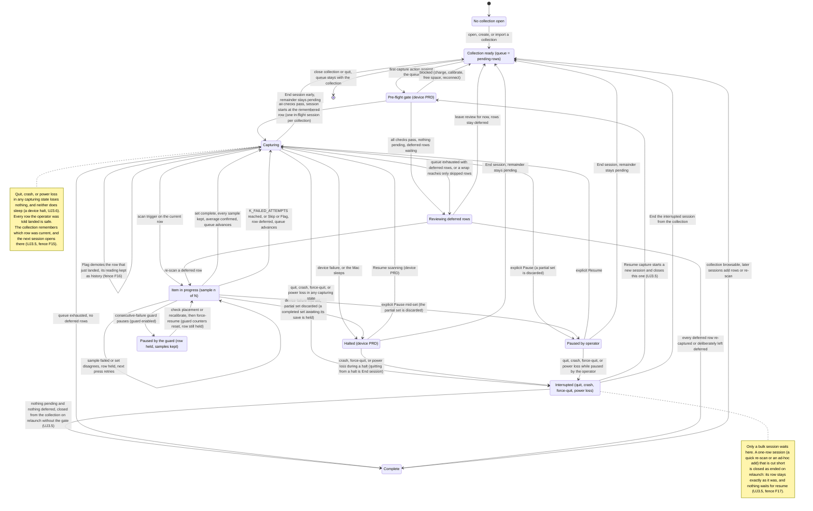
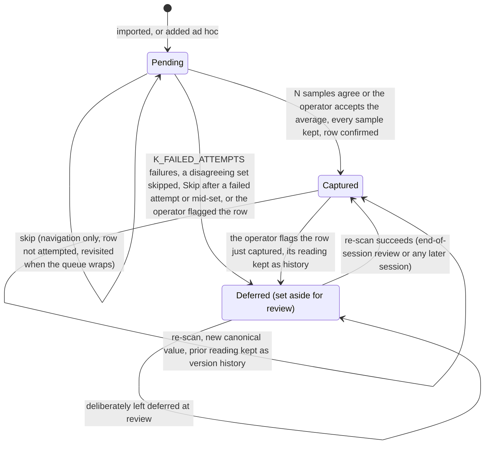
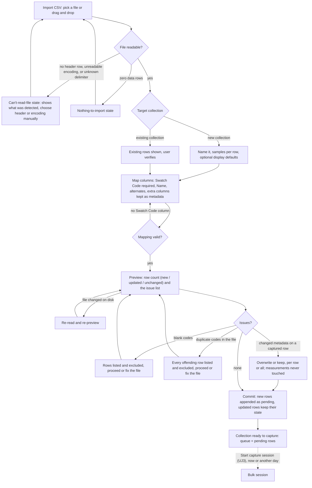
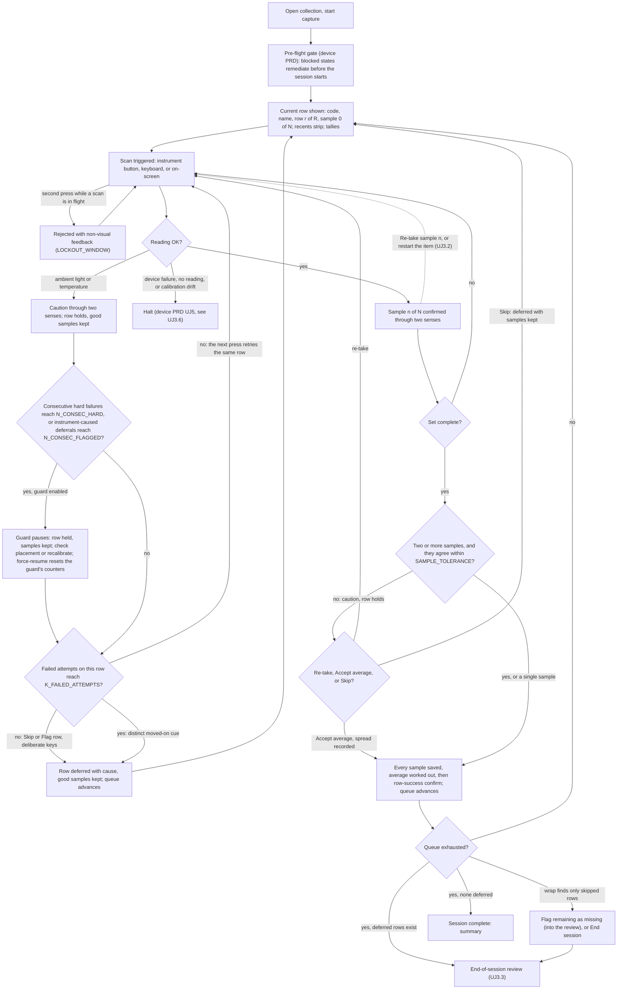
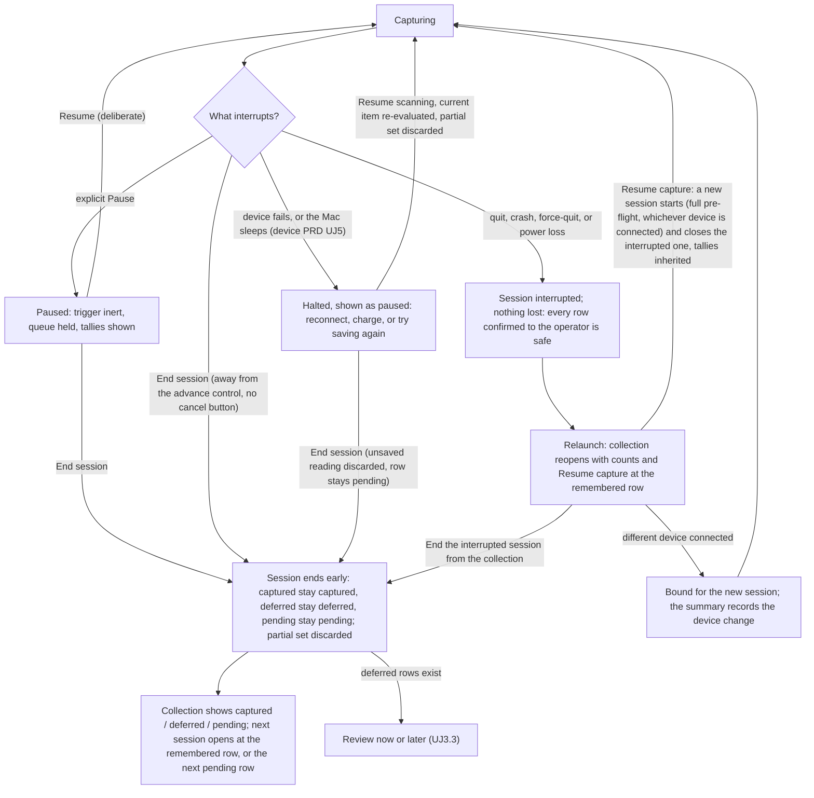
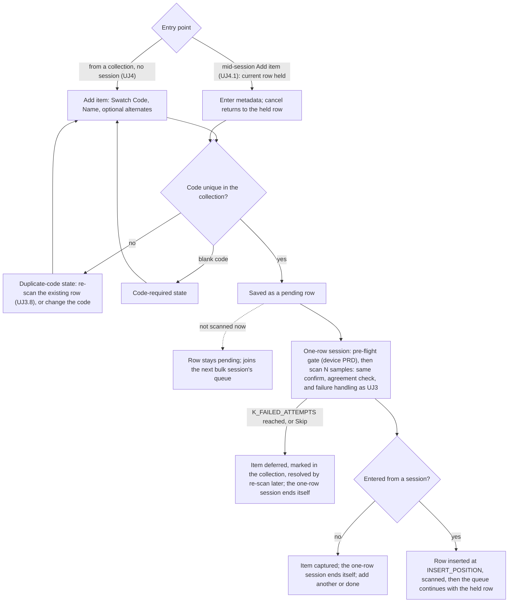

# PRD: Capture Mode

Author: Vinny Pasceri

Status: draft

# Background

SpectroCapture's primary value proposition is quick bulk capture of information using your spectrophotometer. The scope of this PRD covers all the requirements for the use cases, features, and user journeys related to the capture experience.

### Use cases

Defined in the [Vision doc](vision.md#use-cases):

|     | Use case                                 | Persona   | What serves it                                                         |
| --- | ---------------------------------------- | --------- | ---------------------------------------------------------------------- |
| U1  | **Bulk-digitize a predefined inventory** | Cataloger | CSV import with column mapping → queued scan, 1–5 samples/row averaged |
| U2  | **Capture a single new item ad hoc**     | Cataloger | metadata-first single capture into a chosen collection                 |

### Feature list

Defined in the [Vision doc](vision.md#feature-list):

| Pri | Feature                                  | Serves | Notes                                                          |
| --- | ---------------------------------------- | ------ | -------------------------------------------------------------- |
| P0  | CSV inventory import with column mapping | U1     | The inventory-first wedge                                      |
| P0  | Queued bulk scan, 1–5 samples averaged   | U1     | Heads-down; haptic confirm where available; row auto-advance   |
| P0  | Inline scan-failure handling             | U1     | Retry / skip / flag-row for light, battery, temperature errors |
| P1  | Ad-hoc single capture                    | U2     | Metadata-first, into a chosen collection                       |

### Capture workflow

The capture lifecycle end-to-end, as the Cataloger experiences it: a collection becomes a queue of pending rows (by import, [UJ2](#uj-2-full-collection-bootstrap-via-csv-import), or by adding items, [UJ4](#uj-4-capture-a-single-new-item-into-a-collection)); the first capture action runs the device PRD's pre-flight gate ([device PRD UJ2](prd-device-management.md#uj-2-start-acquisition)); the session then runs heads-down, one row at a time, each row a set of 1–5 samples ([UJ3](#uj-3-run-a-bulk-capture-session)); a stop mid-run is either a device-level halt (system sleep included), owned by the device PRD ([device PRD UJ5](prd-device-management.md#uj-5-device-failure-during-a-session)), or a pause or early end owned here ([UJ3.4](#uj-34-pause-and-end-a-session-early)); and a session is complete only when every row is captured or has been deliberately left deferred after the end-of-session review ([UJ3.3](#uj-33-resolve-the-deferred-error-queue-at-session-end)). Two diagrams: the first is the session, the second is a single queue row. The seam between capture and the collection — what the user sees at session end — is deliberately not drawn here; it is the open question [UJ5](#uj-5-session-ends-and-the-collection-is-reviewed-the-seam) exposes for ADR-0004.

## User Journeys

States are named here in plain language; the shipping copy for each is in [§12](#12-error--state-copy). Persona is the Cataloger unless the title says otherwise. Citation shorthand: [acq v1](../briefs/acquisition-experience-research-results.md) and [acq v2](../briefs/acquisition-experience-research-results-v2.md) are the two acquisition-experience research passes (v2 supersedes v1 where they conflict); [browsing](../briefs/browsing-a-collection-at-scale-research-results.md) is the collection-browsing research; [SDK audit](../briefs/nix-universal-sdk-audit-findings.md) is the vendor SDK audit; [device PRD](prd-device-management.md) is the locked device-management PRD. These journeys are what the Cataloger does and sees; the rules behind them — what holds, what is discarded, what is counted, and every named constant — live in [Requirements](#requirements).

Vocabulary ([AGENTS.md §8](../../AGENTS.md#8-vocabulary), [acq v2 §1](../briefs/acquisition-experience-research-results-v2.md#1-queue-model-and-task-framing)):

- **Pending** — a queue row with no confirmed reading yet.
- **Captured** — a row with a canonical value.
- **Deferred** — a row set aside for review because a reading failed, the samples disagreed, or the operator flagged it; the dead-letter state ([§8](#8-deferred-row-review-and-corrections)).
- **Skip** — navigation past a pending row without attempting it. Not a state: the row stays pending ([§6](#6-queue-navigation-and-reordering)).
- **Session** — one collection's run of capture, with a status and an elapsed time; a **one-row session** is its single-item form ([§3](#3-the-capture-session)).
- **The remembered row** — the row the collection last had the operator on; every session opens there ([§3](#3-the-capture-session), fence F15).

### Cluster 1 — Set up a place to capture into

### UJ 1. Create a collection

1. I choose to create a collection.
2. I name it.
  - If that name is already in use → the duplicate-collection-name state ([copy, §12](#12-error--state-copy))
3. I accept or change the samples-per-row setting, which arrives pre-filled at 3.
4. I optionally set the collection's display defaults — illuminant and observer.
5. I save. The collection is ready, with an empty queue.
6. From here I import an inventory ([UJ2](#uj-2-full-collection-bootstrap-via-csv-import)) or add items one at a time ([UJ4](#uj-4-capture-a-single-new-item-into-a-collection)).
  - If I start a capture session with nothing pending and nothing deferred → the nothing-to-capture state ([copy, §12](#12-error--state-copy))

UJ1.1 was folded into UJ1 when Library was dropped (fence F1).

### UJ 1.2 Manage collections — rename, delete

> Scope boundary — handed to Collection Mode. Per the [product README](README.md#4-collection-mode), Collection Mode owns editing surfaces, selection, and bulk operations; rename and delete are collection management, not capture. The steps below are kept verbatim so nothing the owner wrote is lost, and so the Collection Mode PRD inherits them with the two failure branches this pass adds. Ownership is decided by fence F3 ([fences](prd-capture-mode-fences.md)); they generate no requirement rows here beyond the inherited-obligation row [R1.8](#1-collections).

**Rename a collection**

1. I select a collection and choose to rename it.
2. I give it a new name and save.
  - If another collection already uses that name → the duplicate-collection-name state ([copy, §12](#12-error--state-copy)); the rename does not apply

**Delete a collection**

1. I select a collection and choose to delete it.
2. I am warned that the collection and everything in it will be deleted.
  - If the collection has captured readings → the delete-with-captured-readings warning, which names the count and offers an export first (inherited obligation for the Collection Mode PRD)
  - If the collection has an active or interrupted session → the session-in-flight state; the session must end first (inherited obligation for the Collection Mode PRD)
3. I confirm, and the collection and its data are deleted.

### Cluster 2 — Import an inventory

### UJ 2. Full collection bootstrap via CSV import

1. I choose to import a collection from a CSV.
2. I pick the file, or drag it in.
3. The app shows me what it found: the header row and the row count.
  - If there is no header row → the no-header-row state ([copy, §12](#12-error--state-copy)); I name the columns or pick the header row myself
  - If the file cannot be read → the unreadable-file state ([copy, §12](#12-error--state-copy)); nothing is imported
  - If the file has no data rows → the nothing-to-import state ([copy, §12](#12-error--state-copy))
  - If some rows have the wrong number of columns → the excluded-rows notice ([copy, §12](#12-error--state-copy))
4. I choose the target: a new collection, or an existing one (→ [UJ2.1](#uj-21-import-additional-rows-into-an-existing-collection)).
5. I name the new collection and set samples-per-row and, optionally, the display defaults, as in [UJ1](#uj-1-create-a-collection).
6. I map the columns ([UJ2.2](#uj-22-mapping-metadata-fields)) and save the mapping.
  - If nothing is mapped to Swatch Code → the mapping-incomplete state ([copy, §12](#12-error--state-copy))
7. I review the preview: how many rows will land, and every issue found.
  - If some rows have a blank Swatch Code → the blank-codes-excluded state ([copy, §12](#12-error--state-copy))
  - If a Swatch Code repeats inside the file → the duplicate-codes-in-file state ([copy, §12](#12-error--state-copy))
  - If the file changed on disk before I commit → the file-changed state ([copy, §12](#12-error--state-copy))
  - If the file is gone when I commit → the unreadable-file state ([copy, §12](#12-error--state-copy))
8. I commit. Every row lands pending, in file order.
9. The collection is ready to capture. I start now ([UJ3](#uj-3-run-a-bulk-capture-session)), or I close the app and start tomorrow.

### UJ 2.1 Import additional rows into an existing collection

1. I choose to import, pick the file, and choose an existing collection as the target.
2. The app tells me the collection already has rows and asks me to confirm.
3. I map the columns; a mapping remembered from a file with the same headers arrives pre-filled ([UJ2.2](#uj-22-mapping-metadata-fields)).
4. I review the preview: how many rows are new, how many change, how many are unchanged, and how many rows in the collection this file does not mention.
  - If a row that already has a reading has different metadata in the file → the changed-metadata-on-captured-row choice ([copy, §12](#12-error--state-copy)); my measurements are never touched either way
  - If a code in the file matches more than one row → the ambiguous-code state ([copy, §12](#12-error--state-copy)); that row is neither created nor updated
  - Blank codes, duplicate codes inside the file, no data rows, an unreadable file: as in [UJ2](#uj-2-full-collection-bootstrap-via-csv-import)
5. I commit. New rows are appended as pending; rows already in the collection keep their state and their measurements; rows the file does not mention are left alone.
6. The collection is ready to capture, and my next session opens where I left off (fence F15).

### UJ 2.2 Mapping metadata fields

1. I map Swatch Code — required. It is the match key for a re-import and the way I find a row later ([§2](#2-inventory-import), fence F11).
  - If that column is not unique within the file → the duplicate-codes-in-file state ([copy, §12](#12-error--state-copy))
2. I optionally map Swatch Name, Swatch Alternate Code, and Swatch Alternate Name.
3. Any column I do not map comes in as extra metadata I can see in the collection.
  - If a column has no header → the unnamed-column notice ([copy, §12](#12-error--state-copy)); it arrives under a generated name I can change later
4. I save the mapping, and the app offers it again for the next file with the same headers.

The chart below covers [UJ2](#uj-2-full-collection-bootstrap-via-csv-import), [UJ2.1](#uj-21-import-additional-rows-into-an-existing-collection), and [UJ2.2](#uj-22-mapping-metadata-fields) together — the three-way count and the changed-metadata choice are UJ2.1's branches; the mapping box is UJ2.2.

### Cluster 3 — The bulk session (the thesis)

### UJ 3. Run a bulk capture session

The product thesis: import first, then scan heads-down with no per-item metadata entry between scans ([AGENTS.md §4](../../AGENTS.md#4-non-negotiables); vision [J2](vision.md#j2-the-bulk-session-cataloger)). The target pace is the instrument's scan cycle, not the app.

1. I start a capture session on my collection. It opens at the row I was last on ([§3](#3-the-capture-session), fence F15).
  - If nothing is pending and nothing is deferred → the nothing-to-capture state ([copy, §12](#12-error--state-copy))
  - If only deferred rows are left → the session opens straight into the review ([UJ3.3](#uj-33-resolve-the-deferred-error-queue-at-session-end))
  - If a session for this collection is already running → the app takes me back to it
  - If another collection's session is active or paused → the instrument-held state ([copy, §12](#12-error--state-copy))
2. The pre-flight gate runs — battery, calibration, authorization, storage, and the muted-audio advisory ([device PRD UJ2](prd-device-management.md#uj-2-start-acquisition)).
  - If a check blocks → the device PRD's blocked state; my session has not started and my queue is untouched
  - If the Demo Device is connected → the simulated indicator is on the capture surface for the whole session ([UJ3.9](#uj-39-capture-with-the-demo-device-contributor))
3. The session starts. I see the current row's code and name, where I am in the queue, the sample counter, my tallies, and the last few rows I captured.
4. I put the instrument on the swatch and trigger a scan.
  - If I press again while a scan is running → the press is rejected with a distinct non-visual cue and nothing is lost ([§4](#4-the-scan-loop))
5. The instrument measures.
  - If it refuses the reading — light leaked in, or it is out of temperature range → [UJ3.1](#uj-31-a-scan-fails-mid-queue)
  - If the device disconnects, goes quiet, reports drift, runs low on battery, or the save fails → the device PRD's halt ([UJ3.6](#uj-36-device-fails-mid-session))
6. I hear and feel "sample 1 of N" without looking up.
7. I lift, reposition slightly, and press again until the set is done. I touch nothing on the Mac in between.
  - If a sample looked wrong to me → [UJ3.2](#uj-32-undo-or-redo-the-current-item)
8. The set is complete and the app checks that my samples agree.
  - If they disagree → the set-disagreement choice ([copy, §12](#12-error--state-copy)): re-take, accept the average, or set the row aside
9. Every reading is saved and the average worked out from them, and only then do I get the row-success confirmation. The queue advances on its own and the row joins my recents.
  - If the save fails → the device PRD's halt; my completed set is held for "Try saving again" ([UJ3.6](#uj-36-device-fails-mid-session))
10. Steps 4–9 repeat, row after row. I never type, never confirm a dialog, and never look at the screen to know the last row landed.
  - If the swatch in my hand is not the current row → [UJ3.7](#uj-37-jump-to-a-different-row) or [UJ3.10](#uj-310-reorder-the-queue)
  - If the book has an item the file missed → [UJ4.1](#uj-41-insert-an-unplanned-item-mid-session)
  - If I need to stop → [UJ3.4](#uj-34-pause-and-end-a-session-early)
  - If the app quits, crashes, is force-quit, or the Mac loses power → [UJ3.5](#uj-35-resume-an-interrupted-session)
  - If the Mac sleeps → the device PRD's halt, not an interruption ([UJ3.6](#uj-36-device-fails-mid-session), fence F14)
11. The queue is exhausted.
  - If any rows were set aside → the end-of-session review ([UJ3.3](#uj-33-resolve-the-deferred-error-queue-at-session-end)); the session is not complete yet
  - If the queue wrapped onto rows I only skipped → the wrap-exhausted choice ([copy, §12](#12-error--state-copy))
12. Session complete. The summary shows my counts, my elapsed time, and the way to the collection ([UJ5](#uj-5-session-ends-and-the-collection-is-reviewed-the-seam)).

### UJ 3.1 A scan fails mid-queue

1. Mid-set, a sample fails — light leaked under the aperture, or the instrument is out of temperature range.
2. A caution reaches me through two senses and names the cause ([copy, §12](#12-error--state-copy)).
3. The row holds. My good samples are kept and my next trigger press retries the same row, so a reflexive re-press can never land a reading on the next swatch (fence F6).
  - If the retries keep failing → the row is set aside for me after K_FAILED_ATTEMPTS, I get a distinct moved-on cue ([copy, §12](#12-error--state-copy)), and the queue advances once
  - If I would rather move on now → Skip sets the row aside with the samples I did take and advances once
  - If the row that just landed was wrong — wrong swatch, a smudge → Flag demotes it and keeps its reading as history (fences F9, F16)
  - If I press Flag right after a moved-on cue → the flag-has-nothing-to-demote notice ([copy, §12](#12-error--state-copy)); that row is already waiting in the review
  - If the swatch is missing or damaged → Flag sets the current row aside with that cause and the queue advances
4. If the instrument keeps failing, the guard pauses the session and offers me a placement check or a recalibration ([copy, §12](#12-error--state-copy)); my row stays under the instrument with its samples ([§5](#5-per-scan-failure-and-the-consecutive-failure-guard), fence F18).
5. Capture continues. Everything set aside is waiting in the end-of-session review ([UJ3.3](#uj-33-resolve-the-deferred-error-queue-at-session-end)); nothing is deleted and nothing needs a decision now.

### UJ 3.2 Undo or redo the current item

1. Mid-set, I realise the instrument slipped or the wrong swatch was under it.
2. "Re-take sample" throws away the last sample only; my next press replaces it.
3. "Restart item" throws away all of this item's samples; the row stays current.
4. I carry on from [UJ3](#uj-3-run-a-bulk-capture-session).
  - If I press either while a scan is running → the press is rejected and nothing is discarded ([§4](#4-the-scan-loop))
  - If the row is already captured and confirmed → the re-take-unavailable notice ([copy, §12](#12-error--state-copy)); the correction is a re-scan ([UJ3.8](#uj-38-re-scan-an-already-captured-row))
  - If a device halt cuts my set short → the item restarts from its first sample when I resume; there is nothing to undo
The chart below covers [UJ3](#uj-3-run-a-bulk-capture-session), [UJ3.1](#uj-31-a-scan-fails-mid-queue), and [UJ3.2](#uj-32-undo-or-redo-the-current-item) together — the caution branches are UJ3.1; the dashed edge is UJ3.2.

### UJ 3.3 Resolve the deferred-error queue at session end

1. The queue is exhausted with rows set aside, or I choose "Review deferred rows", or I started a session with only deferred rows waiting. I see every one with its code, name, why it was set aside, how many attempts were made, and how many samples it kept.
2. I select a row, put the instrument on it, and take a full set exactly as in [UJ3](#uj-3-run-a-bulk-capture-session). I am never shown the earlier reading first.
  - If a sample fails → the row holds and my next press retries, as in [UJ3.1](#uj-31-a-scan-fails-mid-queue)
  - If the samples disagree again → the set-disagreement choice ([copy, §12](#12-error--state-copy))
  - If the same cause repeats across rows → the guard pauses here too ([copy, §12](#12-error--state-copy))
3. Or I mark a row "Leave deferred" with a note — it is missing, damaged, or not worth the time today ([copy, §12](#12-error--state-copy)).
4. When every row is captured or deliberately left, the session is complete.
  - If I leave the review before finishing → the session ends early ([UJ3.4](#uj-34-pause-and-end-a-session-early)); the rest stay deferred and are marked in my collection

### UJ 3.4 Pause and end a session early

1. Mid-queue I pause. The trigger goes inert; a press only shows me the paused state ([copy, §12](#12-error--state-copy)).
2. Resume is a deliberate action and puts me back on my row at its first sample.
  - If the app quits, crashes, is force-quit, or loses power while paused → the session is interrupted exactly as it would be while capturing ([UJ3.5](#uj-35-resume-an-interrupted-session))
3. To stop for the day I choose "End session" — deliberately away from anything that advances the queue, and there is no cancel or abandon button.
4. The end-early summary tells me plainly what happens to everything ([copy, §12](#12-error--state-copy)) and I confirm.
  - If rows are deferred → the summary offers the review now or later ([UJ3.3](#uj-33-resolve-the-deferred-error-queue-at-session-end))
  - If I end from a device halt → the device PRD's End-session warning applies first ([UJ3.6](#uj-36-device-fails-mid-session))
5. The session ends and my collection shows the counts, so I can see the state of the work without opening capture. What I see next is the seam ([UJ5](#uj-5-session-ends-and-the-collection-is-reviewed-the-seam)).

### UJ 3.5 Resume an interrupted session

1. Mid-queue the app quits, crashes, is force-quit, or the Mac loses power.
2. Nothing I was told landed is lost. The item I was in the middle of restarts from its first sample.
3. On relaunch my collection reopens with its counts and "Resume capture" at the row I was on ([copy, §12](#12-error--state-copy)).
  - If the app cannot remember which collection I had open → I open it; it carries its own counts and the same offer
  - If the file holding the collection has moved → the collection-unavailable state ([copy, §12](#12-error--state-copy))
  - If a device halt was open when the app died → it is closed as unresolved, so I see the interrupted session and not a stale halt ([device PRD §5](prd-device-management.md#5-mid-session-device-failure))
  - If nothing is pending and nothing deferred → there is nothing to resume; the session is closed as complete and I see its summary
  - If what was cut short was a one-row re-scan or ad-hoc add → it is simply closed; its row is exactly as it was and nothing waits for me (fence F17)
4. "Resume capture" starts a fresh session at that row: the full pre-flight gate runs and whichever instrument is connected is used. My tallies and elapsed time carry over, so the summary reads as one run (fence F14).
  - If a different instrument is connected → it is used, and the summary records the change
  - If nothing is pending but rows are deferred → the new session opens straight into the review ([UJ3.3](#uj-33-resolve-the-deferred-error-queue-at-session-end))
  - If I do not want to continue → I can end the interrupted session from my collection without opening capture
  - If I only want one re-scan or one added item → that runs on its own and leaves the interrupted session waiting (fence F17)
5. Everything I set aside before the interruption is still in the review; nothing was re-inserted or duplicated.

### UJ 3.6 Device fails mid-session

> Scope boundary: device-level failure — disconnect, not responding, low battery, save failure — is detect → alert → reconnect → resume in the [device PRD UJ5](prd-device-management.md#uj-5-device-failure-during-a-session) and [§5](prd-device-management.md#5-mid-session-device-failure). This journey states only what capture does around that halt.

1. Mid-queue the device fails, or the Mac sleeps. Capture halts immediately and the alert reaches me through two senses ([device PRD UJ5](prd-device-management.md#uj-5-device-failure-during-a-session)).
  - If I press the trigger during the halt → nothing is asked of the instrument; the halt state surfaces instead
2. The capture surface shows the halt as paused, with the device PRD's recovery path. My current row, tallies, and recents stay visible.
3. When the cause clears, "Resume scanning" puts me back on my row. A part-finished set restarts from its first sample.
4. Capture continues.
  - If I end the session from the halt, or quit from it → the device PRD's End-session warning, then the remainder is handled as in [UJ3.4](#uj-34-pause-and-end-a-session-early)
  - If the halt was a failed save and "Try saving again" works → my held set is saved and the row is captured, with no duplicate
The chart below covers [UJ3.4](#uj-34-pause-and-end-a-session-early), [UJ3.5](#uj-35-resume-an-interrupted-session), and [UJ3.6](#uj-36-device-fails-mid-session) together — the halt branch is the device PRD's and is drawn only to its edges; the interruption branch is UJ3.5.

### UJ 3.7 Jump to a different row

1. Mid-queue, the swatch in my hand is not the current row.
2. I open the find field from the keyboard and type part of the code or the name.
3. I select a row; it becomes my current row at its first sample, and the row I left stays pending. Queue order is unchanged.
4. Capture continues. When the queue reaches the end it wraps to rows still pending, so anything I passed comes back to me.
  - If the code matches a row I already captured → the re-scan-offered state ([copy, §12](#12-error--state-copy))
  - If it matches a row I set aside → that row becomes current and re-scanning it resolves it
  - If nothing matches → the no-matching-row state ([copy, §12](#12-error--state-copy)), offering "Add item"
  - If a wrap finds only rows I skipped without trying → the wrap-exhausted choice ([copy, §12](#12-error--state-copy))
  - If I just want to pass over this row for now → Skip advances once and leaves it pending for the wrap

### UJ 3.8 Re-scan an already-captured row

1. From the capture surface mid-session, or from an item in my collection with no session open, I find the row by its code.
  - If another collection's session is active or paused → the instrument-held state ([copy, §12](#12-error--state-copy))
  - If this collection's bulk session is paused → the re-scan borrows it for this one row and hands the queue back, still paused
  - If this collection's bulk session is interrupted → the re-scan runs on its own and leaves that session waiting (fence F17)
2. The app tells me the row is captured and offers "Re-scan". I am not shown its current value ([copy, §12](#12-error--state-copy)).
3. I take a full set exactly as in [UJ3](#uj-3-run-a-bulk-capture-session), with the same failure handling ([UJ3.1](#uj-31-a-scan-fails-mid-queue)).
4. The new set becomes the row's value and the reading I had is kept as history — never overwritten, never deleted ([AGENTS.md §4](../../AGENTS.md#4-non-negotiables)). The confirmation says so.
  - If samples keep failing, or I skip → the re-scan is abandoned; the row keeps the value it had and the attempt is kept in its history
  - If the new samples disagree → the set-disagreement choice ([copy, §12](#12-error--state-copy)); abandoning never changes the value I already had
  - If I meant "does this still match?" rather than "this one is wrong" → the QC-or-correction choice ([copy, §12](#12-error--state-copy)); QC is the QC & Comparison PRD's journey (vision [J3](vision.md#j3-the-qc-pass-re-checker))
5. If I did this mid-session, the queue puts me back on the row I left, at its first sample, and carries on from there.

### UJ 3.9 Capture with the Demo Device (Contributor)

1. With no instrument and no license, I choose "Demo Device (simulated — no instrument)" ([device PRD UJ1.2](prd-device-management.md#uj-12-first-run-with-no-hardware-contributor)).
2. I import a sample inventory and start a session. Everything looks and behaves as it does with a real instrument, with a simulated indicator always on screen and every reading permanently marked simulated ([device PRD §6](prd-device-management.md#6-mock-device-layer)).
3. I trigger scans on screen or from the keyboard, at the real instrument's pace.
4. I make it fail — light leakage, then out-of-range temperature — and walk [UJ3.1](#uj-31-a-scan-fails-mid-queue) end to end: the caution, hold and retry, Skip and Flag, the automatic set-aside with its moved-on cue, the guard's pause, and the review ([§11](#11-demo-device-and-verifiability) sequences the guard's two modes).
  - If a live per-scan error has no simulated twin → that is a build failure under the device PRD's parity gate, not a gap this journey can reach
5. I walk the halt and the interruption: fail a save, drop the connection, resume, and take a row; quit mid-queue and relaunch to "Resume capture"; then force-quit during a halt and relaunch to find the session waiting. Each time my counts are exactly what they were, I land on my row, and no row appears twice.
6. I open the collection: the simulated-readings banner is showing (inherited obligation for the Collection Mode PRD).

### UJ 3.10 Reorder the queue

1. Before a session, from my collection, I sort the pending rows by any column or drag them into the order I want. That is the queue order, and browsing under a different sort never changes it.
2. During a session, a keyboard action opens the queue list. My current item is held, not advanced, and keeps its samples.
3. I drag a pending row somewhere else, or apply a sort.
4. The new order is saved with the collection, and a resumed session keeps it.
5. Capture continues on the held row, and the queue wraps in the new order.
  - If I drag a row I already captured or set aside → the reorder-refused state ([copy, §12](#12-error--state-copy)), offering re-scan or the review
  - If a re-import brings new rows → they are appended after my manual order
  - If I apply a sort over a manual order → the sort-over-manual-order confirm ([copy, §12](#12-error--state-copy))

### Cluster 4 — Ad-hoc capture

### UJ 4. Capture a single new item into a collection

1. I choose a collection and choose to add a new swatch.
2. I enter Swatch Code and Swatch Name, and optionally the alternates.
  - If that code is already in the collection → the duplicate-code state ([copy, §12](#12-error--state-copy)), offering a re-scan of the existing row or a different code
  - If the code is blank → the code-required state ([copy, §12](#12-error--state-copy))
3. I save. The item is a pending row in my collection.
4. I choose to acquire from the device, which runs the pre-flight gate as any capture does ([device PRD UJ2](prd-device-management.md#uj-2-start-acquisition)).
  - If another collection's session is active or paused → the instrument-held state ([copy, §12](#12-error--state-copy))
5. I take the collection's number of samples, with the same confirmation, agreement check, and failure handling as [UJ3](#uj-3-run-a-bulk-capture-session).
  - If samples keep failing, or I skip → the item is set aside, marked in my collection, and resolved by a re-scan later
  - If the device halts and I end from the halt → the device PRD's End-session warning; the item stays pending
6. Everything is saved and confirmed, the item is captured, and the one-row session closes itself.
7. I add another, or I am done — there is no queue to continue.
  - If I saved the metadata but never scanned → the row stays pending and joins my next bulk session
  - If the item looked wrong right after it landed → there is no flag-after-landing window here; the correction is a re-scan or a Flag from my collection ([UJ3.8](#uj-38-re-scan-an-already-captured-row), fence F9)

### UJ 4.1 Insert an unplanned item mid-session

1. Mid-queue I choose "Add item". My current row is held.
2. I enter the code and name, and optionally the alternates — the one moment in a bulk session where I type.
  - If the code already exists → the duplicate-code state ([copy, §12](#12-error--state-copy))
  - If I cancel → the add-item-cancelled state ([copy, §12](#12-error--state-copy)); the queue puts me back on the held row and nothing was created
3. I save. The new row goes into the queue at INSERT_POSITION ([§9](#9-ad-hoc-capture-and-one-row-sessions), OQ 11) and becomes my current item.
4. I scan it exactly as I would any other row.
5. When it is captured the queue puts me back on the row I held, and then carries on in queue order, so nothing ahead or behind is skipped.
The chart below covers [UJ4](#uj-4-capture-a-single-new-item-into-a-collection) and [UJ4.1](#uj-41-insert-an-unplanned-item-mid-session) together — the two entry points converge on the same metadata form and scan; the dashed edge is the metadata-saved-but-not-scanned branch.

### Cluster 5 — The seam (made visible, not decided)

### UJ 5. Session ends and the collection is reviewed (the seam)

> This is the open question this PRD must settle for ADR-0004 ([product README](README.md#prd--adr-gates); [AGENTS.md §3](../../AGENTS.md#3-decided--recommended--open)). The two research passes disagree on the navigation model and the v2 pass says explicitly to re-open it before the ADR is written. The journey is written twice so the fork is visible; it does not pick, and [§10](#10-the-seam-capture-to-collection) holds the rows that must be true under either reading.

Common to both readings: each reading lands in the real collection the moment it is saved, an always-visible recents strip makes the just-captured item findable, and only the adjudication of deferred rows waits for session end ([§10](#10-the-seam-capture-to-collection)). The fork is about navigation and what I see, not about when my data lands.

**Reading A — capture is a modal takeover; hand-off at session end** ([acq v1 §11](../briefs/acquisition-experience-research-results.md); cited no shipped product)

1. "Start capture session" replaces my collection with a full-window capture surface; I cannot see the collection during the session.
2. The session runs ([UJ3](#uj-3-run-a-bulk-capture-session)); the recents strip is my only view of what has landed.
3. On complete or "End session" the capture surface is dismissed and my collection comes back, refreshed, with everything in place.
4. I browse, sort, open the rows that were set aside, and export.
  - If the app crashes mid-session → I land in my collection on relaunch, see the counts, and choose "Resume capture" to re-enter the takeover ([UJ3.5](#uj-35-resume-an-interrupted-session))

**Reading B — capture is a state of the live collection** ([acq v2 §11 Q11.6](../briefs/acquisition-experience-research-results-v2.md#11-the-seam--capture-to-collection); Lightroom Classic, Capture One, Dynamics 365)

1. "Start capture session" puts my collection into capture: the same window, the same rows, with the capture surface attached and at least two unmistakable mode indicators showing.
2. The session runs ([UJ3](#uj-3-run-a-bulk-capture-session)); each row appears in the collection as it lands, and the view follows the newest until I pin it.
3. On complete or "End session" the capture surface detaches; I am already looking at my collection, which has not changed shape.
4. I browse, sort, open the rows that were set aside, and export — on the same surface I was already on.
  - If the app crashes mid-session → my collection opens with the counts and "Resume capture"; re-entering capture re-attaches the surface ([UJ3.5](#uj-35-resume-an-interrupted-session))
  - If I click into the collection mid-session → capture shortcuts are inert off the capture surface, the mode indicators stay visible, and my session is not ended by navigation
**User-visible differences**

| Question | Reading A — modal takeover | Reading B — state of the collection |
| :--- | :--- | :--- |
| Where does the just-captured item appear during the session? | In the recents strip only; the collection is hidden | In the collection itself, live, plus the recents strip; auto-follow newest with a pin |
| How do you get back to browsing? | End the session (or complete it); the takeover is dismissed | You never left; the capture surface detaches |
| What does "End session" mean? | Leave the capture surface and return to the collection | Detach capture from the collection you are looking at |
| Mode indicators | The takeover itself is the indicator | At least two redundant indicators, required because the same view serves both modes |
| What does a crash mid-session look like? | Relaunch lands in the collection with counts and "Resume capture" | Same — the data behaviour is identical; only the surface differs |
| Mode-slip risk | Low — the whole keyboard belongs to capture | Higher — mitigated by focus-scoped shortcuts and no cancel button |
| "Two apps bolted together" risk | Higher — two places, one data model | Lower — one place, one vocabulary, one set of row states |
| Mid-session reorder and the queue list ([UJ3.10](#uj-310-reorder-the-queue)) | A second list inside the takeover | The collection's own list |

Under either reading the row states, the identifier vocabulary, and the counts are the same on both surfaces — the data-model finding ([acq v2 §11 Q11.6](../briefs/acquisition-experience-research-results-v2.md#11-the-seam--capture-to-collection)) — and it holds whichever navigation model the ADR picks. What decides it is a Demo Device prototype of each reading measured against the observables in [R10.7](#10-the-seam-capture-to-collection), then the owner's product call, written as ADR-0004 (OQ 8). The research default, for the owner to confirm or overrule, is Reading B — the only reading with shipped precedent. Recorded as input: the cross-model product lens preferred Reading A; mid-session reordering is cheap under Reading B and costs a second list inside the takeover under Reading A; and [UJ4.1](#uj-41-insert-an-unplanned-item-mid-session)'s typed metadata sits on the capture surface (fence F13).

## Requirements

### Legend

**Priority**

Priority is build order within v1, not a cut line — everything in this document ships in v1: P0 is the first build phase, P1 the second, P2 last.

Provisional constants: every TBD-on-spike constant is a named provisional constant carrying its candidate value and its [Open Questions](#open-questions) id; mechanisms build against these constants, and no provisional constant ships in a release without its OQ resolved.

**Status**

- ⌛️ Ready for Alignment - Waiting for cross-functional team to align on requirements
- ✋ Needs Discussion - Cross-functional team needs to discuss with PM
- 🤝 Aligned - Cross-functional team aligned on the requirement
- 🦺 In Progress - Implementation in flight (Optional status)
- ✅ Completed - Implementation completed & merged. PR # & link added in the "Commit PR" column.
- ✂️ Deferred - Deferred from current release

### Traceability

Three row-ID families, one per dispositionable table, all under one rule: an ID is assigned once and never renumbered — a row that is cut or deferred keeps its ID rather than freeing it for reuse.

- Every requirement row in [§1](#1-collections) through [§11](#11-demo-device-and-verifiability) carries an ID of the form `R<section>.<n>` — for example `R4.7`.
- Every state row in [§12](#12-error--state-copy) carries an ID of the form `E<n>`.
- Every metric row in [Success Metrics](#success-metrics) carries an ID of the form `M<n>`.

The Commit PR column is where a row maps onto the work that lands it. Owner decisions F1–F18 are recorded in the [fence file](prd-capture-mode-fences.md); a row that implements a fence cites it, and no row re-argues one.

### Surfaces

Where the capture surface lives relative to the collection surface is the seam, and it is not decided here ([§10](#10-the-seam-capture-to-collection)).

| Surface | Shows | [§12](#12-error--state-copy) states that render here |
| :--- | :--- | :--- |
| Collection surface | The collection's rows and its counts — captured / deferred / pending — and the entry points to start a session, import, add an item, review deferred rows, and re-scan a row | Duplicate collection name; nothing to capture; instrument held by another collection; resume capture; collection unavailable; session complete; re-scan offered; QC or correction |
| Import flow | The file that was picked, what was detected in it, the column mapping, and the pre-commit preview with its issue list | No header row; can't read the file; nothing to import; rows with the wrong number of columns; mapping incomplete; blank codes excluded; duplicate codes in the file; ambiguous code; unnamed column; file changed on disk; changed metadata on a captured row |
| Capture surface | The current row, the position in the queue, the sample counter, the session tallies, the recents strip, and the always-visible simulated indicator | Light leaked in; out of temperature range; moved on; samples disagree; guard paused; flag has nothing to demote; re-take unavailable; paused; wrap exhausted; end early; every halt state (device PRD §5); simulated readings |
| Queue list and find field | The queue in queue order, and the find field, both opened from the capture surface by a keyboard action | No matching row; reorder refused; sort over a manual order |
| Deferred-row review | Every deferred row with its cause, how many attempts were made, and how many samples it kept | Leave deferred; samples disagree; guard paused |
| Add-item form | The metadata fields for a new item, reached from the collection or from the capture surface mid-session | Duplicate code; code required; add item cancelled |

### 1. Collections

Traces [UJ1](#uj-1-create-a-collection), [UJ1.2](#uj-12-manage-collections--rename-delete); serves [U1](vision.md#use-cases).

#### As a Cataloger, I can create a collection to capture into so that my swatch book has one place to land.

| ID | Release | Pri | Requirement | Status | Commit PR |
| :--- | :--- | :--- | :--- | :--- | :--- |
| R1.1 | v1 | P0 | Creating a collection is an explicit user action and ends with the collection ready and its queue empty. Collections are flat: there is no library above them (fence F1). From there the user imports an inventory ([§2](#2-inventory-import)) or adds items one at a time ([§9](#9-ad-hoc-capture-and-one-row-sessions)). "Start capture session" is offered once the collection has at least one pending or deferred row. | ⌛️ Ready for Alignment |  |
| R1.2 | v1 | P0 | A collection's name is required and must be unique among the user's collections, compared by the one matching rule ([R2.7](#2-inventory-import), fence F11); a duplicate shows [E1](#12-error--state-copy) and the collection is not created. A test can create two collections whose names differ only in letter case or in spacing and observe the second refused. | ⌛️ Ready for Alignment |  |
| R1.3 | v1 | P0 | Samples-per-row is required at creation, arrives pre-filled at 3, and accepts 1 to 5 (vision [U1](vision.md#use-cases), fence F2). It is the collection's default for every session and is changeable between sessions; whether it can change mid-session is OQ 9. | ⌛️ Ready for Alignment |  |
| R1.4 | v1 | P0 | With samples-per-row set to 1 there is nothing to compare, so the agreement check ([R4.9](#4-the-scan-loop)) does not run (fence F10). A test can set a collection to one sample per row and observe no agreement check and no disagreement state. | ⌛️ Ready for Alignment |  |
| R1.5 | v1 | P1 | Illuminant and observer are optional collection-level display defaults, never required at creation, and editable at any time. Changing them never requires a re-scan and never alters a stored reading, because the raw measurement is what the app keeps and colour values are worked out from it ([AGENTS.md §8](../../AGENTS.md#8-vocabulary); fence F2). | ⌛️ Ready for Alignment |  |
| R1.6 | v1 | P0 | The ISO 13655 measurement condition (M0/M1/M2) is a scan mode of the instrument, not an observer, and which scan modes a capture records is OQ 1 (Spectro 2 supports M0/M1 plus M2 on F2.x firmware — [SDK audit](../briefs/nix-universal-sdk-audit-findings.md), per SDK docs; confirm on hardware). | ⌛️ Ready for Alignment |  |
| R1.7 | v1 | P0 | A collection with no pending and no deferred rows shows the nothing-to-capture state ([E2](#12-error--state-copy)) offering import and add-item, plus re-scan only once the collection has captured rows; where deferred rows exist the state also offers "Review N deferred rows" ([§8](#8-deferred-row-review-and-corrections)). Nothing else happens. | ⌛️ Ready for Alignment |  |
| R1.8 | v1 | P1 | Renaming and deleting a collection belong to Collection Mode (fence F3), carrying the name-uniqueness rule of R1.2, a delete guard that requires an active or interrupted session to end first, and a delete warning that names the count of captured rows and their history and offers an export before deleting — permitted, because "corrections never destroy data" is about measurements rather than containers ([AGENTS.md §4](../../AGENTS.md#4-non-negotiables)), but never the default action. (Inherited obligation for the Collection Mode PRD.) | ⌛️ Ready for Alignment |  |
| R1.9 | v1 | P0 | A collection's rows, their queue order, its remembered row, and its sessions all live with the collection and nowhere else, so the collection file carries the whole state of the work and moving it moves everything. (Inherited obligation for the Data Foundation PRD.) | ⌛️ Ready for Alignment |  |

### 2. Inventory import

Traces [UJ2](#uj-2-full-collection-bootstrap-via-csv-import), [UJ2.1](#uj-21-import-additional-rows-into-an-existing-collection), [UJ2.2](#uj-22-mapping-metadata-fields); serves [U1](vision.md#use-cases), the inventory-first wedge.

#### As a Cataloger, I can import my inventory from a spreadsheet export so that I never type my swatch list into the app.

| ID | Release | Pri | Requirement | Status | Commit PR |
| :--- | :--- | :--- | :--- | :--- | :--- |
| R2.1 | v1 | P0 | Import starts from an explicit user action and accepts a file by picker or by drag and drop. | ⌛️ Ready for Alignment |  |
| R2.2 | v1 | P0 | The app shows what it detected — the header row and the row count. The encoding and the delimiter are shown only when detection failed or when the user asks, because a cataloger should not have to know those words. The detection rules themselves, and whether a remembered mapping becomes a named template the user manages, are OQ 12; the research documents only that file reading can be configured for encoding, delimiter, and malformed rows ([acq v1 §7](../briefs/acquisition-experience-research-results.md)). | ⌛️ Ready for Alignment |  |
| R2.3 | v1 | P0 | Three read failures are each a distinct named state that ends the import with nothing imported: no header row detected ([E4](#12-error--state-copy)), where the user names the columns or picks the header row manually; an encoding that cannot be read ([E5](#12-error--state-copy)), where the user chooses an encoding or re-saves the file; and a file with zero data rows ([E6](#12-error--state-copy)). A file that has gone missing at commit resolves to [E5](#12-error--state-copy). | ⌛️ Ready for Alignment |  |
| R2.4 | v1 | P0 | Rows with the wrong number of columns are listed by row number and excluded, never silently imported ([E7](#12-error--state-copy)); the user proceeds without them or fixes the file and re-picks it. | ⌛️ Ready for Alignment |  |
| R2.5 | v1 | P0 | The target collection — new or existing — is chosen in the app before columns are mapped, and the collection name is never a mapped column in v1 (fence F4). A new collection collects the same name, samples-per-row, and optional display defaults as [§1](#1-collections). | ⌛️ Ready for Alignment |  |
| R2.6 | v1 | P0 | Swatch Code must be mapped; without it the mapping cannot be saved ([E8](#12-error--state-copy)). Swatch Name, Swatch Alternate Code, and Swatch Alternate Name are optional; every other column is imported as extra metadata the collection can surface, and a column with a blank header arrives under a generated name listed in the preview ([E12](#12-error--state-copy)) for the user to rename later in Collection Mode. | ⌛️ Ready for Alignment |  |
| R2.7 | v1 | P0 | The one matching rule (fence F11): two Swatch Codes — or two collection names — count as the same when they match after trimming spaces at either end, collapsing any run of spaces inside to one, and ignoring letter case; the value is always shown exactly as it was entered. It governs uniqueness, re-import matching, find, the ad-hoc duplicate check, and collection names, so a re-export from Numbers or an Excel autocorrect never doubles the queue. A test can import "cg-3" and "CG 3" and observe one row. | ⌛️ Ready for Alignment |  |
| R2.8 | v1 | P0 | Rows with a blank Swatch Code ([E9](#12-error--state-copy)) and rows whose code repeats within the file ([E10](#12-error--state-copy)) are both listed by row number and excluded — every offending row, never first-row-wins ([acq v2 §7 Q7.3](../briefs/acquisition-experience-research-results-v2.md#7-inventory-import-and-column-mapping)); the user proceeds without them or fixes the file and re-picks it. | ⌛️ Ready for Alignment |  |
| R2.9 | v1 | P0 | A preview precedes every commit: the row count — for an existing collection the three-way count new / updated / unchanged plus a line reading "N rows in the collection are not in this file — left untouched" — and the issue list. The count is the reconciliation interface ([acq v2 §7 Q7.5](../briefs/acquisition-experience-research-results-v2.md#7-inventory-import-and-column-mapping)). A file that changed on disk between being read and being committed is re-read and re-previewed ([E13](#12-error--state-copy)). | ⌛️ Ready for Alignment |  |
| R2.10 | v1 | P0 | A commit is all-or-none, so a failure partway leaves the collection exactly as it was. Every imported row lands pending, in file order, appended after any existing rows. The mapping is remembered by the file's header signature — the set of column names, in any order — and pre-filled next time, so the user confirms rather than re-maps. Import ends at ready-to-capture and never starts a session. | ⌛️ Ready for Alignment |  |

#### As a Cataloger, I can re-import a corrected file so that fixing my spreadsheet never costs me my measurements.

| ID | Release | Pri | Requirement | Status | Commit PR |
| :--- | :--- | :--- | :--- | :--- | :--- |
| R2.11 | v1 | P0 | Swatch Code is how a file row is matched to a collection row; the code is the way in, not the row itself, so a matched row keeps its place, its state, and its measurements whatever the file says ([acq v2 §7 Q7.3](../briefs/acquisition-experience-research-results-v2.md#7-inventory-import-and-column-mapping)). Unchanged rows are untouched, so importing the same file twice changes nothing, a re-import never deletes a row, and rows the file does not mention are left exactly as they are. | ⌛️ Ready for Alignment |  |
| R2.12 | v1 | P0 | A code in the file that matches more than one row in the collection is a hard failure listed in the preview ([E11](#12-error--state-copy)), neither created nor updated — an ambiguous key is never a guess. Codes unique within a collection make this unreachable; the row exists so the guarantee is stated. | ⌛️ Ready for Alignment |  |
| R2.13 | v1 | P0 | Where an updated row is already captured, the preview offers a keep-or-overwrite toggle on each such row with one default applied to all of them, never a series of dialogs ([E14](#12-error--state-copy)), and states that measurements are never touched by a metadata change — the canonical value and its version history are unaffected either way ([acq v2 §7 Q7.5](../briefs/acquisition-experience-research-results-v2.md#7-inventory-import-and-column-mapping)). | ⌛️ Ready for Alignment |  |
| R2.14 | v1 | P1 | A mapped column present in the file but blank for a row is treated as a change, because it would clear the field, and appears under "updated" so the user sees it; a column omitted from the file entirely leaves existing values untouched. | ⌛️ Ready for Alignment |  |

### 3. The capture session

Traces [UJ3](#uj-3-run-a-bulk-capture-session), [UJ3.5](#uj-35-resume-an-interrupted-session); inherits from the [device PRD §5](prd-device-management.md#5-mid-session-device-failure) the obligation that a session and its queue survive an app relaunch.

#### As a Cataloger, I can pick a run up where I left it so that a swatch book is one job and not two.

| ID | Release | Pri | Requirement | Status | Commit PR |
| :--- | :--- | :--- | :--- | :--- | :--- |
| R3.1 | v1 | P0 | A capture session belongs to exactly one collection and records the instrument it is using, when it started and ended, its status, and how much capture time has elapsed (fence F12). (Inherited obligation for the Data Foundation PRD.) | ⌛️ Ready for Alignment |  |
| R3.2 | v1 | P0 | A session's status is exactly one of active, interrupted, ended, or complete (fence F12). At most one session is active in the app at a time; a collection holds at most one unresumed interrupted bulk session; two collections may each hold one (fences F12, F14). A test can construct each status and assert the two limits. | ⌛️ Ready for Alignment |  |
| R3.3 | v1 | P0 | The instrument binding is released when the app quits or crashes, so no session outlives the app holding an instrument against another collection (fence F12; [device PRD §1](prd-device-management.md#1-device-pairing)). | ⌛️ Ready for Alignment |  |
| R3.4 | v1 | P0 | A session becomes interrupted only by a quit while capturing or while paused, a crash, a force-quit, or power loss. System sleep is a device halt and the session stays active through it; quitting from a device halt is the device PRD's End session and ends the session instead, while a crash, force-quit, or power loss during a halt does interrupt it (fence F14; [device PRD §5](prd-device-management.md#5-mid-session-device-failure)). | ⌛️ Ready for Alignment |  |
| R3.5 | v1 | P0 | Starting capture while another collection's session is active or paused is refused, naming the collection whose session holds the instrument ([E3](#12-error--state-copy)); an interrupted session on another collection holds no instrument and never blocks. Starting capture on a collection whose session is already in flight returns to that session rather than starting a second — one in-flight session per collection, always ([acq v2 §8 Q8.4](../briefs/acquisition-experience-research-results-v2.md#8-progress-orientation-and-session-completion)). | ⌛️ Ready for Alignment |  |
| R3.6 | v1 | P0 | The remembered row belongs to the collection rather than to a session, and updates every time the queue advances, the operator jumps, an item is inserted, or a deferred row is selected in the review (fence F15). (Inherited obligation for the Data Foundation PRD.) | ⌛️ Ready for Alignment |  |
| R3.7 | v1 | P0 | Every session on a collection opens at the remembered row — whether the last session ended early, was interrupted, or completed — falling back to the next pending row in queue order if that row is no longer pending, and to the nothing-to-capture state if there is none (fence F15). A jump or a reorder made yesterday is honoured today and nobody is ever sent back to the top of the queue. A collection that has never had a session opens at its first pending row. | ⌛️ Ready for Alignment |  |
| R3.8 | v1 | P0 | One exception is deliberate: a remembered row that was selected in the deferred-row review opens the review at that row rather than falling back, so the operator lands on the swatch they had in hand. The exception holds only while that row is still deferred, and clears as soon as it is captured, deliberately left deferred, or the operator leaves the review (fence F15). (Inherited obligation for the Data Foundation PRD.) | ⌛️ Ready for Alignment |  |
| R3.9 | v1 | P0 | A session started on a collection with nothing pending and one or more deferred rows runs the pre-flight gate and opens straight into the review, so a second day with only deferred rows is never stranded ([§8](#8-deferred-row-review-and-corrections)). | ⌛️ Ready for Alignment |  |
| R3.10 | v1 | P0 | The first capture action against the queue runs the device PRD's pre-flight gate — battery, calibration currency, authorization window, storage headroom, and the muted-audio advisory ([device PRD §4](prd-device-management.md#4-pre-flight-device-health)); a blocking check leaves the session unstarted and the queue untouched. A gate whose checks all pass is silent on repeat — only a check that blocks or advises surfaces — so adding several ad-hoc items in a row does not re-show it. | ⌛️ Ready for Alignment |  |
| R3.11 | v1 | P0 | A session binds whichever instrument is connected when it starts ([device PRD §1](prd-device-management.md#1-device-pairing)). A one-row session ends itself when its row is captured or deferred, when the attempt is abandoned, or when the operator ends it, and is never left open to block the next bulk session (fence F12); one that is itself cut short is closed as ended on relaunch and never counts against the one-unresumed-bulk-session rule (fence F17). | ⌛️ Ready for Alignment |  |
| R3.12 | v1 | P1 | The design scale, as named provisional constants: ROWS_TARGET (candidate 200–1,200 rows per collection and per import — the marker set and the swatch book — OQ 13), ROWS_CEILING (candidate 10,000 rows, the bound the ADR-0001 spike tested — OQ 13), and a single session that may run for up to a working day. | ⌛️ Ready for Alignment |  |

### 4. The scan loop

Traces [UJ3](#uj-3-run-a-bulk-capture-session), [UJ3.2](#uj-32-undo-or-redo-the-current-item); serves [U1](vision.md#use-cases), queued bulk scan with 1–5 samples averaged.

#### As a Cataloger, I can scan row after row without touching the Mac so that my pace is the instrument's and not the app's.

| ID | Release | Pri | Requirement | Status | Commit PR |
| :--- | :--- | :--- | :--- | :--- | :--- |
| R4.1 | v1 | P0 | The trigger is the instrument's own button where the app can receive it, and otherwise a one-hand keyboard or on-screen trigger. The keyboard and on-screen trigger are designed as the primary path until the hardware spike says otherwise: whether the Spectro 2 button reaches the app at all is unverified — the [SDK audit](../briefs/nix-universal-sdk-audit-findings.md) does not describe a button event and the research calls that arm empirically untested ([acq v2 §2 Q2.1](../briefs/acquisition-experience-research-results-v2.md#2-heads-down-input-and-interaction-modality)) — OQ 2. | ⌛️ Ready for Alignment |  |
| R4.2 | v1 | P0 | One accepted trigger means exactly one measurement, and a press during the lockout, the operator's pause, the guard's pause, or a device halt asks the instrument for nothing. A test can count the measurements the app asked the device for against the accepted triggers ([R11.5](#11-demo-device-and-verifiability)). | ⌛️ Ready for Alignment |  |
| R4.3 | v1 | P0 | A trigger press while a scan is in flight is rejected — never queued, never silently dropped — with immediate non-visual feedback, a rejection tone or haptic distinct from success and from caution. LOCKOUT_WINDOW is a named provisional constant (candidate 0.5 s, from the barcode-scanner precedent, [acq v2 §3 Q3.1](../briefs/acquisition-experience-research-results-v2.md#3-pacing-latency-and-feedback)); its semantics — dead time after the press, or until the reading returns — are part of OQ 4. | ⌛️ Ready for Alignment |  |
| R4.4 | v1 | P0 | No capture shortcut is a bare Space or a bare single letter, and capture shortcuts are live only while the capture surface has focus ([acq v2 §2 Q2.2](../briefs/acquisition-experience-research-results-v2.md#2-heads-down-input-and-interaction-modality)). The rest of the keyboard is queue management — Skip, Flag, find, Add item, re-take sample, restart item, Pause, End session — each a dedicated action distinct from the trigger ([acq v1 §2](../briefs/acquisition-experience-research-results.md)). | ⌛️ Ready for Alignment |  |
| R4.5 | v1 | P0 | A reading arrives as one measurement per scan mode ([SDK audit](../briefs/nix-universal-sdk-audit-findings.md), per SDK docs; confirm on hardware); which modes the app keeps is OQ 1. | ⌛️ Ready for Alignment |  |
| R4.6 | v1 | P0 | The measurement condition or conditions a reading was taken under are recorded with the reading, and the illuminant and observer used to work out any colour value are recorded with that value rather than with the reading, so every colour value can be reproduced later (fence F2; [acq v2 §6 Q6.4](../briefs/acquisition-experience-research-results-v2.md#6-durability-crash-safety-and-resumability)). (Inherited obligation for the Data Foundation PRD.) | ⌛️ Ready for Alignment |  |
| R4.7 | v1 | P0 | Each sample's confirmation reaches the operator through at least two senses — a success tone, a haptic where the hardware provides one, and the on-screen counter — because audio alone is an accessibility regression ([acq v2 §2 Q2.2](../briefs/acquisition-experience-research-results-v2.md#2-heads-down-input-and-interaction-modality), [§4 Q4.1](../briefs/acquisition-experience-research-results-v2.md#4-mid-run-error-handling)). Spectro 2/L carry device-side haptics ([SDK audit](../briefs/nix-universal-sdk-audit-findings.md), per SDK docs); whether the app can trigger them is the device PRD's OQ 20. | ⌛️ Ready for Alignment |  |
| R4.8 | v1 | P0 | Two timing promises, both named provisional constants and both measurable against the Demo Device at real pacing ([R11.7](#11-demo-device-and-verifiability)): TRIGGER_ACK_WINDOW, within which any trigger press the app can see is acknowledged so the instrument and the app feel like one device (candidate 100 ms, [acq v1 §3](../briefs/acquisition-experience-research-results.md) — OQ 5); and RESULT_CUE_LATENCY, within which the result cue follows the reading's arrival (candidate TBD — OQ 5). | ⌛️ Ready for Alignment |  |
| R4.9 | v1 | P0 | With two or more samples the app checks that they agree within SAMPLE_TOLERANCE — the largest ΔE2000 distance of any one sample from the set's mean, worked out under the collection's display illuminant and observer (candidate ΔE2000 2.0, a placeholder with no evidence behind the value; the statistic and its basis are candidates too — OQ 3). With one sample the check is skipped (fence F10). No shipped precedent exists for this check; it is designed here, not inherited. | ⌛️ Ready for Alignment |  |
| R4.10 | v1 | P0 | A disagreeing set is never silently averaged. A caution reaches the operator through two senses, the row holds (fence F6), and three choices are offered, none of them silent: re-take the item on the spot, "Accept average", or Skip, which sets the row aside with all its samples and advances exactly once ([§5](#5-per-scan-failure-and-the-consecutive-failure-guard)). A re-taken set that disagrees again counts as a failed attempt toward K_FAILED_ATTEMPTS. | ⌛️ Ready for Alignment |  |
| R4.11 | v1 | P0 | "Accept average" keeps the set exactly as measured and records the spread between its samples on the reading, so a textured, fabric, or metallic swatch can still reach captured (fence F10). (Inherited obligation for the Data Foundation PRD; showing the spread is an inherited obligation for the Collection Mode PRD.) | ⌛️ Ready for Alignment |  |
| R4.12 | v1 | P0 | A row's measurement is the full set of its N readings, each exactly as the instrument produced it, and that set is saved before anything else happens ([device PRD §5](prd-device-management.md#5-mid-session-device-failure): the save completes before the queue advances). The average the operator sees is worked out from those readings and labelled with how it was worked out so it can be recomputed, and no individual reading is ever discarded in favour of the average ([AGENTS.md §8](../../AGENTS.md#8-vocabulary)). Whether the average is taken across the spectral curves or across the colour values is not decided here. (Inherited obligation for the Data Foundation PRD.) | ⌛️ Ready for Alignment |  |
| R4.13 | v1 | P0 | The row-success confirmation, distinct from the per-sample confirm, reaches the operator through two senses only once the set is safely saved, within ROW_CONFIRM_BUDGET of the last sample's arrival (candidate TBD — OQ 5). The promise behind it: a row the operator was told landed survives a power cut or a drive pulled a moment later, because the confirmation waits for the save to be truly complete rather than merely under way. (Inherited obligation for the Data Foundation PRD, ADR-0003.) | ⌛️ Ready for Alignment |  |
| R4.14 | v1 | P0 | On that confirmation the queue advances on its own to the next pending row and the row appears on the recents strip. A caution or error tone always pre-empts a success tone in flight ([acq v2 §4 Q4.1](../briefs/acquisition-experience-research-results-v2.md#4-mid-run-error-handling)). | ⌛️ Ready for Alignment |  |
| R4.15 | v1 | P0 | The capture surface shows the current row's Swatch Code and Swatch Name; the position "row r of R", where r is the row's place among the pending rows in the current queue order and R is the pending count; the sample counter "sample n of N"; the tallies captured / deferred / pending; and the recents strip of the last few captured rows ([acq v2 §11 Q11.2](../briefs/acquisition-experience-research-results-v2.md#11-the-seam--capture-to-collection)). R grows when an item is inserted and both r and R change with a reorder. Where the recents strip sits relative to the deferred-row review is OQ 10. | ⌛️ Ready for Alignment |  |
| R4.16 | v1 | P0 | The capture surface carries no cancel and no abandon control, and "End session" sits deliberately away from anything that advances the queue — the Dynamics 365 precedent of removing the abandon affordance from the counting surface ([acq v2 §8 Q8.4](../briefs/acquisition-experience-research-results-v2.md#8-progress-orientation-and-session-completion)). | ⌛️ Ready for Alignment |  |
| R4.17 | v1 | P0 | Nothing on the host is touched between the samples of one set and the operator never types metadata between scans ([acq v1 §1](../briefs/acquisition-experience-research-results.md)); the only typing in a bulk session is the operator's own Add item ([§9](#9-ad-hoc-capture-and-one-row-sessions), fence F13). An announcement policy for assistive technology in a roughly three-second loop is OQ 14, and the capture state is announced without requiring focus. | ⌛️ Ready for Alignment |  |

### 5. Per-scan failure and the consecutive-failure guard

Traces [UJ3.1](#uj-31-a-scan-fails-mid-queue); serves [U1](vision.md#use-cases), inline scan-failure handling. Inherits the per-scan error UX and the dead-letter queue from the [device PRD §5](prd-device-management.md#5-mid-session-device-failure).

#### As a Cataloger, when a scan fails I can retry without looking up so that a reading never lands on the wrong swatch.

| ID | Release | Pri | Requirement | Status | Commit PR |
| :--- | :--- | :--- | :--- | :--- | :--- |
| R5.1 | v1 | P0 | The per-scan failure set this PRD owns is exactly ambient light leakage, out-of-range temperature, a set of samples that disagree, and the operator's own Flag. There is no per-scan timer (fence F7). | ⌛️ Ready for Alignment |  |
| R5.2 | v1 | P0 | Calibration drift, a device that returns no reading at all, a battery below the operational threshold, a disconnect, and a failed save are device-level halts rather than per-scan failures (fence F7; [device PRD §5](prd-device-management.md#5-mid-session-device-failure)); a completed set whose save fails is held through the halt for "Try saving again". (Handoff to the device PRD.) | ⌛️ Ready for Alignment |  |
| R5.3 | v1 | P0 | On a per-scan failure a caution reaches the operator through at least two senses — a warning tone that is never the success tone, a haptic where available, and the on-screen state naming the cause in plain language — and it pre-empts any success tone in flight. The row then holds: the failed sample is set aside, good samples already taken are kept, the counter stays where it was, and the next trigger press is the retry on the same row, so a reflexive re-press after the warning tone can never land a reading on the next row (fence F6; [acq v2 §4 Q4.1](../briefs/acquisition-experience-research-results-v2.md#4-mid-run-error-handling)). Moving on is always a deliberate queue action, never the trigger. | ⌛️ Ready for Alignment |  |
| R5.4 | v1 | P0 | K_FAILED_ATTEMPTS is a named provisional constant (candidate 3 — OQ 3): after that many consecutive failed attempts on one row, the row is deferred with its cause and its good samples kept, a distinct moved-on cue — neither the success tone nor the warning tone — reaches the operator through two senses, the deferred tally increments, and the queue advances exactly once, so the operator keeps physical momentum ([acq v1 §4](../briefs/acquisition-experience-research-results.md)). | ⌛️ Ready for Alignment |  |
| R5.5 | v1 | P0 | Skip after a failure, and Skip mid-set with good samples and no failure, both defer the row with its cause and its samples kept and advance exactly once. Skip before any attempt on a row is plain navigation and leaves the row pending ([§6](#6-queue-navigation-and-reordering)). | ⌛️ Ready for Alignment |  |
| R5.6 | v1 | P0 | Until the operator presses the trigger on the new current row, Flag targets the row that just landed — the one on the recents strip — and moves it from captured to deferred: its reading is kept in the row's version history rather than as its current value, the row has no value until re-scanned, and it waits in the review like any other deferred row. The boundary is the operator's own next action, not a timer, and only the operator's Flag ever demotes a captured reading (fences F9, F16). | ⌛️ Ready for Alignment |  |
| R5.7 | v1 | P0 | After a moved-on cue and before any trigger press on the new current row, Flag changes nothing: it says only that the previous row is already deferred and waiting in the review ([E20](#12-error--state-copy)), so a reflexive "that one was wrong" never marks the next row missing (fence F16). | ⌛️ Ready for Alignment |  |
| R5.8 | v1 | P0 | Otherwise Flag targets the current row: with no samples yet it is deferred with the cause "flagged: missing or damaged"; mid-set it is deferred with its good samples kept; either way the queue advances and the next press scans the next pending row (fences F9, F16). | ⌛️ Ready for Alignment |  |
| R5.9 | v1 | P0 | The guard names two things: a hard failure is a per-scan failure the instrument itself reports, and a deferred row is any row set aside for review. N_CONSEC_HARD consecutive hard failures (candidate 2 — OQ 3), or N_CONSEC_FLAGGED consecutive rows deferred by the instrument (candidate 4 — OQ 3, counting a row deferred after K_FAILED_ATTEMPTS, by Skip after a failed attempt, or by a set that disagreed), pause the session with a caution through two senses naming the likely cause — placement, light leak, temperature — and offering "Check placement and resume" or "Recalibrate" ([device PRD §3](prd-device-management.md#3-calibration)). The guard is modelled on Westgard multirules with clinical numbers that must be re-tuned for a hand-placed instrument ([acq v2 §4 Q4.2](../briefs/acquisition-experience-research-results-v2.md#4-mid-run-error-handling)). | ⌛️ Ready for Alignment |  |
| R5.10 | v1 | P0 | Rows the operator set aside by choice — Flag as missing or damaged, Skip mid-set with no failure, Flag on a row that just landed — never count toward either counter and never break a run, because the guard watches the instrument rather than the operator's decisions (fence F18). Lamp or calibration drift is not counted here either (fence F8). A test can flag five rows as missing in a row and observe no pause. | ⌛️ Ready for Alignment |  |
| R5.11 | v1 | P0 | The guard's pause keeps the held row under the instrument with its samples intact — nothing is discarded — and a trigger press during it is not accepted and asks the instrument for nothing. Force-resume is a deliberate action, never the trigger; it resets the guard's two counters but not the held row's own count toward K_FAILED_ATTEMPTS, so a row that keeps failing still defers on its own, and the held row is still current afterwards with its samples ([acq v2 §4 Q4.2](../briefs/acquisition-experience-research-results-v2.md#4-mid-run-error-handling)). The guard applies in the deferred-row review exactly as it does in the queue ([§8](#8-deferred-row-review-and-corrections)). | ⌛️ Ready for Alignment |  |
| R5.12 | v1 | P1 | The guard has an explicit setting — enabled, or record-only, in which it counts and records but never pauses the session; the v1 default is OQ 6. Tolerance and failure status are recorded across roughly the first ten dogfood sessions with the guard in record-only and the constants tuned from that data ([acq v2 §4 Q4.2](../briefs/acquisition-experience-research-results-v2.md#4-mid-run-error-handling)); whether a dogfood build counts as a release for the no-unresolved-constant rule is part of OQ 6. | ⌛️ Ready for Alignment |  |

### 6. Queue navigation and reordering

Traces [UJ3.7](#uj-37-jump-to-a-different-row), [UJ3.10](#uj-310-reorder-the-queue); both are v1 by fence F5. Reordering is original design: the research supports the identifier as the entry point and gives no precedent for reordering ([acq v2 §11 Q11.4](../briefs/acquisition-experience-research-results-v2.md#11-the-seam--capture-to-collection)).

#### As a Cataloger, I can reach the swatch in my hand and put the queue in the order my swatches are actually in so that I scan the book rather than the spreadsheet.

| ID | Release | Pri | Requirement | Status | Commit PR |
| :--- | :--- | :--- | :--- | :--- | :--- |
| R6.1 | v1 | P0 | A keyboard queue-management action opens a find field on the capture surface; typing narrows across all rows, pending first, then deferred, then captured, matching the start of a Swatch Code or any part of a Swatch Name, compared by the one matching rule ([R2.7](#2-inventory-import), fence F11). Whether the alternate code and name are searchable is OQ 15. | ⌛️ Ready for Alignment |  |
| R6.2 | v1 | P0 | Selecting a row makes it the current item at sample 0 and the collection's remembered row; the row the operator left stays pending, and the queue order is unchanged. | ⌛️ Ready for Alignment |  |
| R6.3 | v1 | P0 | A hit on a captured row offers a re-scan rather than silently making it current ([E28](#12-error--state-copy), [§8](#8-deferred-row-review-and-corrections)); a hit on a deferred row becomes current and its re-scan resolves it; no match offers "Add item" ([E37](#12-error--state-copy), [§9](#9-ad-hoc-capture-and-one-row-sessions)). | ⌛️ Ready for Alignment |  |
| R6.4 | v1 | P0 | Skip is navigation, not a state: it advances exactly once to the next pending row and leaves this one pending. No shipped system models "skipped" as a state ([acq v2 §1 Q1.1](../briefs/acquisition-experience-research-results-v2.md#1-queue-model-and-task-framing)). | ⌛️ Ready for Alignment |  |
| R6.5 | v1 | P0 | The queue wraps to still-pending rows, so a row that was passed over is revisited without the operator tracking it. A pass begins at the row that was current when the previous wrap-check ended — or when the session started — and ends when the queue comes back around to that position; a jump does not start a new pass, and a row the operator jumped away from without an attempt counts as skipped. | ⌛️ Ready for Alignment |  |
| R6.6 | v1 | P0 | A wrap that finds only rows skipped without an attempt in this pass offers "Flag remaining as missing" — they become deferred with the cause "flagged: missing or damaged" and the review opens with them — or "End session", which leaves them pending for another day ([E21](#12-error--state-copy)). A skipped row can never make "complete" unreachable and the queue never circles forever. | ⌛️ Ready for Alignment |  |
| R6.7 | v1 | P0 | Queue order is something each row carries in the collection, separate from how any list happens to be sorted for viewing; only the reorder actions in this section change it, and browsing the collection under a different sort never does (fence F5). (Inherited obligation for the Data Foundation PRD.) | ⌛️ Ready for Alignment |  |
| R6.8 | v1 | P1 | The operator reorders before a session from the collection, or during a session from a queue list opened by a keyboard queue-management action (fence F5), either by dragging a pending row to a new position or by sorting on any metadata column — Swatch Code, Swatch Name, the alternates, or any other imported column. | ⌛️ Ready for Alignment |  |
| R6.9 | v1 | P1 | Sorts are stable so rows that tie keep their order, respect the user's language, treat the numbers inside codes as numbers so "A2" comes before "A10", and toggle direction on a second application. A sort applied while a manual order exists asks before replacing it ([E34](#12-error--state-copy)). | ⌛️ Ready for Alignment |  |
| R6.10 | v1 | P1 | A reorder never changes any row's state: captured rows are never re-queued and deferred rows stay deferred. Dragging a captured or deferred row is refused, and the app offers a re-scan or the review instead ([E33](#12-error--state-copy)). | ⌛️ Ready for Alignment |  |
| R6.11 | v1 | P1 | Opening the queue list holds the current item rather than advancing it and keeps its samples, and a reorder mid-session does not discard them ([R7.1](#7-pause-end-interruption-and-resume)). The new order is saved with the collection, so a resumed session keeps it and the queue wraps in it; a re-import appends new rows after a manual order ([R2.11](#2-inventory-import)). | ⌛️ Ready for Alignment |  |
| R6.12 | v1 | P1 | Three reordering specifics are open: REORDER_SCOPE — whether a reorder covers the whole queue or only the un-captured remainder — whether a sort is remembered as the collection's default order, and one-handed drag ergonomics with the instrument in the other hand (OQ 7). Under Reading A of the seam a mid-session queue list is a second list inside the takeover; under Reading B it is the collection's own list (OQ 8, [§10](#10-the-seam-capture-to-collection)). | ⌛️ Ready for Alignment |  |

### 7. Pause, end, interruption, and resume

Traces [UJ3.4](#uj-34-pause-and-end-a-session-early), [UJ3.5](#uj-35-resume-an-interrupted-session), [UJ3.6](#uj-36-device-fails-mid-session). Defines the un-scanned remainder the [device PRD §5](prd-device-management.md#5-mid-session-device-failure) hands here.

#### As a Cataloger, I can stop for the day, or lose the app entirely, without losing anything so that a swatch book can take two sittings.

| ID | Release | Pri | Requirement | Status | Commit PR |
| :--- | :--- | :--- | :--- | :--- | :--- |
| R7.1 | v1 | P0 | One partial-set rule, everywhere: the samples taken so far on the current row survive only a reorder and looking at the queue list. Any action that would put a different item under the instrument first — the operator's Pause, a jump, entering the deferred-row review, Add item, a mid-session re-scan entered by find — and any device halt discards them; the row returns to sample 0 and stays pending. Whether choosing the review mid-session should discard the partial set is OQ 18. | ⌛️ Ready for Alignment |  |
| R7.2 | v1 | P0 | Three things are not partial sets and are never discarded this way: a completed set waiting for its save, held through a save-failure halt for "Try saving again" ([device PRD §5](prd-device-management.md#5-mid-session-device-failure)); the samples on a row that becomes deferred by Skip, Flag, or K_FAILED_ATTEMPTS, kept as that row's record; and the samples on a row held under the guard's pause, which keeps the row under the instrument ([R5.11](#5-per-scan-failure-and-the-consecutive-failure-guard)). | ⌛️ Ready for Alignment |  |
| R7.3 | v1 | P0 | Pause is an explicit keyboard queue-management action, never the trigger. While paused the trigger is inert: a press surfaces the paused state ([E22](#12-error--state-copy)) and is not accepted. The paused state shows the tallies and the current row, and Resume is a deliberate action that returns to that row at sample 0. | ⌛️ Ready for Alignment |  |
| R7.4 | v1 | P0 | "End session" is not on the capture surface's advance path, and there is no cancel or abandon control anywhere on that surface ([R4.16](#4-the-scan-loop)). | ⌛️ Ready for Alignment |  |
| R7.5 | v1 | P0 | The end-early summary states plainly that captured rows stay captured, deferred rows stay deferred, pending rows stay pending, that an incomplete set is discarded and its row stays pending, and that the next session opens at the remembered row or the next pending row (fence F15); the operator confirms ([E23](#12-error--state-copy)). Where deferred rows exist the summary offers the review now or later, and leaving them is allowed. Once the session ends the collection shows the counts on its own surface, so the state of the work is visible without opening capture; whether that summary is a state or a dialog is OQ 17. | ⌛️ Ready for Alignment |  |
| R7.6 | v1 | P0 | Ending a session from a device halt routes through the device PRD's End-session warning first — a held unsaved reading is discarded and its row stays pending — and the remainder is then handled per R7.5 ([device PRD §5](prd-device-management.md#5-mid-session-device-failure)). (Handoff to the device PRD.) | ⌛️ Ready for Alignment |  |
| R7.7 | v1 | P0 | An interruption loses nothing the operator was told landed: every row the queue advanced past was saved before the advance. The in-flight item's partial samples are gone and it restarts from its first sample. | ⌛️ Ready for Alignment |  |
| R7.8 | v1 | P0 | On relaunch the app reopens the collection that was open and shows the session state — captured / deferred / pending — and "Resume capture" at the collection's remembered row ([E25](#12-error--state-copy)). Remembering which collection was open is a convenience: if the app cannot, the user opens it and it carries the same counts and the same offer, because the collection is the only record of the session ([acq v2 §8](../briefs/acquisition-experience-research-results-v2.md#8-progress-orientation-and-session-completion)). | ⌛️ Ready for Alignment |  |
| R7.9 | v1 | P0 | If the file holding the collection has moved or is unavailable, the collection-unavailable state names it and the user locates the file ([E26](#12-error--state-copy)); nothing about the session is stored anywhere else. | ⌛️ Ready for Alignment |  |
| R7.10 | v1 | P0 | A device halt left open at termination is closed as "unresolved — app terminated", so the user sees the interrupted session rather than a stale halt ([device PRD §5](prd-device-management.md#5-mid-session-device-failure)). (Handoff to the device PRD.) | ⌛️ Ready for Alignment |  |
| R7.11 | v1 | P0 | An interruption that came after the last row landed leaves nothing to resume: the interrupted session is closed as complete from the collection on relaunch, with no pre-flight gate and no "Resume capture", and the collection shows the session summary (OQ 17). | ⌛️ Ready for Alignment |  |
| R7.12 | v1 | P0 | "Resume capture" starts a new session on the collection at the remembered row: the full pre-flight gate runs, including authorization, and whichever instrument is connected is bound, because quitting or crashing released the earlier one (fences F12, F14). A different instrument is used and the change is recorded in the session summary. The interrupted session is closed as "interrupted — resumed by the next session" and never becomes active again, and the new session inherits its tallies and elapsed capture time so the summary reads as one run — a day with two crashes leaves three linked sessions. (Inherited obligation for the Data Foundation PRD.) | ⌛️ Ready for Alignment |  |
| R7.13 | v1 | P0 | A resume with nothing pending and deferred rows waiting opens straight into the review ([R3.9](#3-the-capture-session)). An interrupted session can instead be ended from the collection without opening capture, its rows handled per R7.5. A one-row re-scan or ad-hoc add runs beside an unresumed interrupted bulk session, leaves it untouched, and never puts the operator back into the bulk queue (fence F17). | ⌛️ Ready for Alignment |  |
| R7.14 | v1 | P1 | Two notes the device PRD must adopt: its "current item" — the first row with no saved reading ([device PRD §5](prd-device-management.md#5-mid-session-device-failure)) — is this PRD's remembered row whenever nothing was jumped or reordered, and system sleep is a §5 halt for an active session rather than an interruption (fences F12, F14, F15). (Inherited note for the device PRD; OQ 16.) | ⌛️ Ready for Alignment |  |

### 8. Deferred-row review and corrections

Traces [UJ3.3](#uj-33-resolve-the-deferred-error-queue-at-session-end), [UJ3.8](#uj-38-re-scan-an-already-captured-row); serves [U1](vision.md#use-cases) and vision [U5](vision.md#use-cases). The dead-letter queue is inherited from the [device PRD §5](prd-device-management.md#5-mid-session-device-failure).

#### As a Cataloger, I can clear everything that went wrong in one pass at the end so that a bad reading never stops my run.

| ID | Release | Pri | Requirement | Status | Commit PR |
| :--- | :--- | :--- | :--- | :--- | :--- |
| R8.1 | v1 | P0 | The review is entered four ways: the queue is exhausted with deferred rows, the operator chooses "Review deferred rows" at any point, a session starts on a collection with nothing pending and deferred rows waiting, or a resume lands on a remembered row that was selected in the review ([R3.8](#3-the-capture-session)). Entering it discards any partial set on the current row ([R7.1](#7-pause-end-interruption-and-resume), OQ 18). Whether the review is the same surface as the recents strip, adjacent to it, or separate is OQ 10 and is settled with the seam ([§10](#10-the-seam-capture-to-collection)). | ⌛️ Ready for Alignment |  |
| R8.2 | v1 | P0 | The review lists every deferred row with its Swatch Code, Swatch Name, cause — light leak, temperature, samples disagreed, skipped mid-set, flagged as missing or damaged, flagged after capture — how many attempts were made, and how many samples it kept. | ⌛️ Ready for Alignment |  |
| R8.3 | v1 | P0 | Selecting a deferred row makes it the current item and the collection's remembered row, marked as review-selected (fence F15), and a full set of N samples is then taken exactly as [§4](#4-the-scan-loop) describes. The prior failed samples are kept as history and never shown as the expected answer — blind re-capture, so an earlier reading cannot bias the operator ([acq v2 §11 Q11.4](../briefs/acquisition-experience-research-results-v2.md#11-the-seam--capture-to-collection)). | ⌛️ Ready for Alignment |  |
| R8.4 | v1 | P0 | A failed sample in the review holds the row and the next press retries (fence F6); the review moves on only after K_FAILED_ATTEMPTS, Skip, or "Leave deferred", and the row stays deferred with the new cause added to its record and nothing deleted. A set that disagrees again offers the same three choices as [R4.10](#4-the-scan-loop) (fence F10), and the guard applies here exactly as it does in the queue ([R5.11](#5-per-scan-failure-and-the-consecutive-failure-guard)). | ⌛️ Ready for Alignment |  |
| R8.5 | v1 | P0 | "Leave deferred" takes an optional note — the swatch is missing, damaged, or not worth the time today — and the row stays deferred with the decision and its note kept ([E27](#12-error--state-copy)). (Inherited obligation for the Data Foundation PRD.) | ⌛️ Ready for Alignment |  |
| R8.6 | v1 | P0 | A session is complete only when every row is captured or has been deliberately left deferred after review. Leaving the review before that ends the session early ([R7.5](#7-pause-end-interruption-and-resume)): the unresolved rows stay deferred, appear in the next session's review, and are marked in the collection. | ⌛️ Ready for Alignment |  |

#### As a Cataloger, I can re-scan a row I already captured so that a correction never costs me the reading I had.

| ID | Release | Pri | Requirement | Status | Commit PR |
| :--- | :--- | :--- | :--- | :--- | :--- |
| R8.7 | v1 | P1 | A re-scan is entered by identifier — from the capture surface mid-session, or from an item in the collection with no session open — and never by a separate "re-scan this row" navigation ([acq v2 §11 Q11.4](../briefs/acquisition-experience-research-results-v2.md#11-the-seam--capture-to-collection)). The app says the row is captured and offers "Re-scan" ([E28](#12-error--state-copy)), and does not show the row's current value while re-scanning. | ⌛️ Ready for Alignment |  |
| R8.8 | v1 | P1 | A re-scan takes a full set of N samples with the same confirmation and failure handling as [§4](#4-the-scan-loop) and [§5](#5-per-scan-failure-and-the-consecutive-failure-guard). After K_FAILED_ATTEMPTS, or if the operator skips, the re-scan is abandoned: the row stays captured with the value it had and the attempt is kept in its history rather than as a deferral — a good reading is never demoted by a bad retry, and only the operator's Flag demotes one ([R5.6](#5-per-scan-failure-and-the-consecutive-failure-guard)). | ⌛️ Ready for Alignment |  |
| R8.9 | v1 | P1 | Once the new set is safely saved it becomes the row's canonical value and the prior reading is kept as version history — never overwritten, never deleted ([AGENTS.md §4](../../AGENTS.md#4-non-negotiables), [§8](../../AGENTS.md#8-vocabulary)) — and the confirmation says that a prior reading was kept. (Inherited obligation for the Data Foundation PRD.) | ⌛️ Ready for Alignment |  |
| R8.10 | v1 | P1 | A re-scan whose samples disagree offers re-take, "Accept average" — the new set becomes canonical with its spread recorded and the prior reading kept as history (fence F10) — or abandon, which leaves the existing canonical value untouched and keeps the attempt in the row's history. | ⌛️ Ready for Alignment |  |
| R8.11 | v1 | P1 | QC and correction are offered explicitly rather than guessed, because a QC scan never touches the canonical value and a re-scan does ([E29](#12-error--state-copy); vision [J3](vision.md#j3-the-qc-pass-re-checker)). (Handoff to the QC & Comparison PRD.) | ⌛️ Ready for Alignment |  |
| R8.12 | v1 | P1 | A re-scan made mid-session returns the queue to the row it left, at sample 0 and still paused if the session was paused, and then continues in queue order; the re-scanned row's position in the queue is unchanged. | ⌛️ Ready for Alignment |  |
| R8.13 | v1 | P0 | Version history keeps, for good: every individual reading, including the good samples on a row that ended up deferred; every attempt with its cause and its outcome, including failed re-scan attempts on a captured row; the operator's review decisions with their notes and the recorded sample spread of an accepted average; a flagged reading moved out of the canonical position; the chain of sessions and which one resumed which; each row's queue order; and the remembered row with its review-selected mark and the three conditions that clear it. (Inherited obligation for the Data Foundation PRD.) | ⌛️ Ready for Alignment |  |
| R8.14 | v1 | P1 | The simulated-readings banner and the recorded sample spread are surfaced where the collection is browsed. (Inherited obligation for the Collection Mode PRD.) | ⌛️ Ready for Alignment |  |

### 9. Ad-hoc capture and one-row sessions

Traces [UJ4](#uj-4-capture-a-single-new-item-into-a-collection), [UJ4.1](#uj-41-insert-an-unplanned-item-mid-session); serves [U2](vision.md#use-cases). The thinnest-evidenced cluster: no research pass elaborates it, and the one adjacent precedent is an "Add item" control for something physically present but missing from the worklist ([acq v2 §11 Q11.4](../briefs/acquisition-experience-research-results-v2.md#11-the-seam--capture-to-collection)).

#### As a Cataloger, I can capture one new swatch into a collection so that a single find does not need a spreadsheet.

| ID | Release | Pri | Requirement | Status | Commit PR |
| :--- | :--- | :--- | :--- | :--- | :--- |
| R9.1 | v1 | P1 | Adding an item takes Swatch Code — required — Swatch Name, and optionally Swatch Alternate Code and Swatch Alternate Name. A blank code is refused with the code-required state ([E31](#12-error--state-copy)) and the item cannot be saved. | ⌛️ Ready for Alignment |  |
| R9.2 | v1 | P1 | A code already present in the collection, compared by the one matching rule ([R2.7](#2-inventory-import), fence F11), shows the duplicate-code state ([E30](#12-error--state-copy)) and offers a re-scan of the existing row or a different code; a second row with the same code is never created, whether the entry point is an ad-hoc add or a mid-session insert. | ⌛️ Ready for Alignment |  |
| R9.3 | v1 | P1 | Saving creates a pending row like any other. Metadata saved without a scan leaves the row pending and it joins the next bulk session's queue; nothing is lost. | ⌛️ Ready for Alignment |  |
| R9.4 | v1 | P1 | The scan runs as a one-row session: the pre-flight gate runs as it does for any capture ([device PRD UJ2](prd-device-management.md#uj-2-start-acquisition)), the connected instrument is bound, and the session ends itself when the row is captured or deferred, when the attempt is abandoned, or when the operator ends it from a halt or otherwise — so every device halt has a session to belong to and no one-row session is left open to block the next bulk session (fence F12). | ⌛️ Ready for Alignment |  |
| R9.5 | v1 | P1 | A one-row session is not allowed while a session on a different collection is active or paused, and the app names the collection whose session holds the instrument ([E3](#12-error--state-copy)). | ⌛️ Ready for Alignment |  |
| R9.6 | v1 | P1 | A one-row session attaches to a paused bulk session on this collection: the pause is lifted for that one row, and afterwards the queue is back on the row it left, still paused until the operator resumes it ([R7.3](#7-pause-end-interruption-and-resume)). | ⌛️ Ready for Alignment |  |
| R9.7 | v1 | P1 | A one-row session runs on its own beside an unresumed interrupted bulk session and never wakes it; that session still waits for a deliberate "Resume capture", so a quick correction never puts the operator back into the bulk queue (fence F17). | ⌛️ Ready for Alignment |  |
| R9.8 | v1 | P1 | An ad-hoc item whose samples exhaust K_FAILED_ATTEMPTS, or which the operator skips, is deferred exactly as a queue row would be, appears in the collection marked deferred, and is resolved by a re-scan later ([§8](#8-deferred-row-review-and-corrections)). | ⌛️ Ready for Alignment |  |
| R9.9 | v1 | P1 | There is no flag-after-landing window on an ad-hoc item, because its one-row session has already ended: "that one was wrong" is a re-scan or a Flag from the collection, and either way the reading is kept as history (fence F9). | ⌛️ Ready for Alignment |  |
| R9.10 | v1 | P1 | Mid-session "Add item" is a keyboard queue-management action that holds the current row rather than advancing it and discards any partial set on it ([R7.1](#7-pause-end-interruption-and-resume)); cancelling the add returns the queue to the held row and creates nothing ([E32](#12-error--state-copy)). Typing here is the operator's choice, never demanded by the queue (fence F13). | ⌛️ Ready for Alignment |  |
| R9.11 | v1 | P1 | A row inserted mid-session goes into the queue at INSERT_POSITION — a named provisional constant, candidate: immediately after the current row so the item in hand is scanned next; the simpler alternative is to append it to the end and jump to it (OQ 11) — and becomes the current item at sample 0. Once it is captured the queue returns to the row that was held, at sample 0, and then continues in queue order, so nothing ahead or behind is skipped; the session's row count R has grown by one and the tallies reflect it. | ⌛️ Ready for Alignment |  |

### 10. The seam (capture to collection)

Traces [UJ5](#uj-5-session-ends-and-the-collection-is-reviewed-the-seam). This section is the product-level input to ADR-0004 ([product README](README.md#prd--adr-gates)). Every row here is gated on OQ 8 and none of them decides it.

#### As a Cataloger, I can get from scanning to browsing without losing my place so that capture and the collection feel like one app.

| ID | Release | Pri | Requirement | Status | Commit PR |
| :--- | :--- | :--- | :--- | :--- | :--- |
| R10.1 | v1 | P0 | Every reading lands in the real collection the moment it is saved; only the adjudication of deferred rows waits for session end, never the insertion of data. Deferred insertion at session end is never the design — its published failure is duplicate records on reconciliation ([acq v2 §11 Q11.2](../briefs/acquisition-experience-research-results-v2.md#11-the-seam--capture-to-collection)), and write-before-advance is already settled in the [device PRD §5](prd-device-management.md#5-mid-session-device-failure). True under either reading. | ⌛️ Ready for Alignment |  |
| R10.2 | v1 | P0 | An always-visible recents strip on the capture surface makes the just-captured row findable during the session ([R4.15](#4-the-scan-loop)). True under either reading. | ⌛️ Ready for Alignment |  |
| R10.3 | v1 | P0 | The row states, the identifier vocabulary, and the counts are identical on the capture surface and on the collection surface — the data-model finding, which holds whichever navigation model the ADR picks ([acq v2 §11 Q11.6](../briefs/acquisition-experience-research-results-v2.md#11-the-seam--capture-to-collection)). | ⌛️ Ready for Alignment |  |
| R10.4 | v1 | P0 | Capture shortcuts are inert whenever the capture surface does not have focus ([R4.4](#4-the-scan-loop)), and navigating within the app never ends a session. True under either reading; load-bearing under Reading B, where the same window serves both. | ⌛️ Ready for Alignment |  |
| R10.5 | v1 | P0 | Mode indication depends on the reading: under Reading A the takeover is itself the indicator, and under Reading B at least two redundant, unmistakable indicators say the app is in capture ([acq v2 §11 Q11.6](../briefs/acquisition-experience-research-results-v2.md#11-the-seam--capture-to-collection)). Gated on OQ 8. | ⌛️ Ready for Alignment |  |
| R10.6 | v1 | P0 | The navigation fork — Reading A, capture as a modal takeover that hands off at session end, or Reading B, capture as a state of the live collection — is ADR-0004's and is settled by the owner's product call from a Demo Device prototype of each reading. The research default is Reading B, the only reading with shipped precedent (Lightroom Classic, Capture One, Dynamics 365), recorded and not decided. Gated on OQ 8. | ⌛️ Ready for Alignment |  |
| R10.7 | v1 | P0 | The prototype's discriminating observables, all measurable on the Demo Device: the time and the number of steps to reach the just-captured row, both at a pause and at session end; the count of mode slips — capture shortcuts pressed while the capture surface does not have focus; and where the deferred-row review and the recents strip end up living (OQ 10). Gated on OQ 8. | ⌛️ Ready for Alignment |  |

### 11. Demo Device and verifiability

Traces [UJ3.9](#uj-39-capture-with-the-demo-device-contributor); serves [U9](vision.md#use-cases) and vision [J5](vision.md#j5-first-contribution-contributor). Builds on the [device PRD §6](prd-device-management.md#6-mock-device-layer) mock-device layer; the rows marked inherited are obligations this PRD adds to that layer.

#### As a Contributor, I can walk every capture journey against the Demo Device so that I can contribute without an instrument or a license.

| ID | Release | Pri | Requirement | Status | Commit PR |
| :--- | :--- | :--- | :--- | :--- | :--- |
| R11.1 | v1 | P0 | Capture flows, states, and error surfaces are identical against the Demo Device and a live instrument, within the device PRD's closed list of exceptions, and CI exercises the simulated capture path on every PR ([device PRD §6](prd-device-management.md#6-mock-device-layer)). (Handoff to the device PRD.) | ⌛️ Ready for Alignment |  |
| R11.2 | v1 | P0 | The capture surface carries an always-visible simulated indicator for the whole session, and every reading taken from the Demo Device is permanently marked simulated ([device PRD §6](prd-device-management.md#6-mock-device-layer)). (Handoff to the device PRD.) | ⌛️ Ready for Alignment |  |
| R11.3 | v1 | P0 | The Demo Device's trigger is on-screen or keyboard, since there is no physical button (OQ 2), and it paces at the real instrument's measured timing by default, never instantly ([device PRD §6](prd-device-management.md#6-mock-device-layer)). | ⌛️ Ready for Alignment |  |
| R11.4 | v1 | P0 | Every failure this PRD relies on being able to produce on demand — ambient light leakage, out-of-range temperature, a save that fails, a disconnect, and an instrument that goes quiet — has a simulated equivalent under the device PRD's error-parity gate, where a live error with no simulated twin fails the build rather than review vigilance ([device PRD §6](prd-device-management.md#6-mock-device-layer)). (Handoff to the device PRD.) | ⌛️ Ready for Alignment |  |
| R11.5 | v1 | P0 | A test can see every measurement the app asked the instrument for — when it started, how it ended, and what asked for it — so "exactly one measurement per accepted trigger" and "a press during a lockout, a pause, or a halt asks the instrument for nothing" ([R4.2](#4-the-scan-loop)) are assertable rather than assumed. (Inherited obligation for the device PRD's simulated layer.) | ⌛️ Ready for Alignment |  |
| R11.6 | v1 | P0 | A test can start from a declared collection-and-session state — rows in each state, an unresumed interrupted bulk session with the collection's remembered row, an open halt record, a review-selected mark — rather than having to walk there ([§3](#3-the-capture-session), [§7](#7-pause-end-interruption-and-resume)). (Inherited obligation for the device PRD's simulated layer.) | ⌛️ Ready for Alignment |  |
| R11.7 | v1 | P0 | The Demo Device's pacing and the moment of every cue run on a clock a test can control, so TRIGGER_ACK_WINDOW, RESULT_CUE_LATENCY, and ROW_CONFIRM_BUDGET ([R4.8](#4-the-scan-loop), [R4.13](#4-the-scan-loop)) are measurable without waiting on the wall clock. (Inherited obligation for the device PRD's simulated layer.) | ⌛️ Ready for Alignment |  |
| R11.8 | v1 | P0 | A simulated reading carries the same set of per-mode measurements as a live one (OQ 1), so the agreement check and every value worked out from a reading behave identically. (Inherited obligation for the device PRD's simulated layer.) | ⌛️ Ready for Alignment |  |
| R11.9 | v1 | P0 | The contributor walk of [UJ3.9](#uj-39-capture-with-the-demo-device-contributor) is a verification sequence with a fixed order, because N_CONSEC_HARD is reached before a row's K_FAILED_ATTEMPTS: the K_FAILED_ATTEMPTS path is walked with the guard in record-only, then the guard's pause with it enabled (OQ 6); then a failed save and a disconnect, resume, and one captured row; then a quit and relaunch to "Resume capture"; then a force-quit during a halt, since quitting from a halt ends the session instead. After each, the captured / deferred / pending counts are exactly what they were, the current row is the collection's remembered row, and no row appears twice. | ⌛️ Ready for Alignment |  |
| R11.10 | v1 | P0 | System sleep has no simulated equivalent; the stand-in for the sleep halt is a disconnect plus a change to one readiness input, then Resume ([device PRD §5](prd-device-management.md#5-mid-session-device-failure)). A PR that touches device-facing capture code carries the `needs-hardware-verify` label and states in its body what needs verifying on real hardware ([AGENTS.md §5](../../AGENTS.md#5-hardware--the-public-repo-boundary)). | ⌛️ Ready for Alignment |  |

### 12. Error & State Copy

The shipping copy for every error, waiting, choice, and confirmation state in this PRD, written in the Cataloger's vocabulary: plain language, names the recovery, never SDK-speak. Every state is a distinct named state whose identity is stable even when its wording changes, so behaviour can be asserted independently of copy. Every promise made below is backed by a requirement row above. Halt copy is the [device PRD §7](prd-device-management.md#7-error--state-copy)'s and is not restated here.

| ID | State | Headline | Body | Primary action | Status |
| :--- | :--- | :--- | :--- | :--- | :--- |
| E1 | Duplicate collection name | You already have a collection called that | Collection names have to be different from each other. Spacing and capitals don't count as a difference, so "Copic Sketch" and "copic  sketch" are the same name. | Change the name | ⌛️ Ready for Alignment |
| E2 | Nothing to capture | There's nothing to scan in this collection yet | Import your swatch list from a spreadsheet, or add one item at a time. | Import a file; Add an item | ⌛️ Ready for Alignment |
| E3 | Instrument held by another collection | ⟨collection⟩ is using your spectrophotometer | One session at a time. Finish or end the session in ⟨collection⟩, then come back here. | Go to ⟨collection⟩ | ⌛️ Ready for Alignment |
| E4 | No header row | Which row has your column names? | This file doesn't seem to start with a row of column names. Pick the row that does, or name the columns yourself. | Pick the header row | ⌛️ Ready for Alignment |
| E5 | Can't read the file | Can't read this file | The text in this file isn't in a format the app recognises. Try saving it again from your spreadsheet as CSV, or choose the text encoding yourself. Nothing has been imported. | Choose an encoding; Pick a different file | ⌛️ Ready for Alignment |
| E6 | Nothing to import | This file has column names but no rows | There's nothing to bring in. Check you picked the right file. | Pick a different file | ⌛️ Ready for Alignment |
| E7 | Rows with the wrong number of columns | ⟨n⟩ rows don't line up with the columns | These rows have more or fewer values than the header row, so they're listed below and left out. You can bring in the rest, or fix the file and try again. | Import without them; Pick the file again | ⌛️ Ready for Alignment |
| E8 | Mapping incomplete | Tell the app which column is the swatch code | Every swatch needs a code — it's how the app matches a row when you re-import, and how you find a swatch later. | Choose the code column | ⌛️ Ready for Alignment |
| E9 | Blank codes excluded | ⟨n⟩ rows have no swatch code | Rows without a code are listed below and left out, because there'd be no way to find them again. Bring in the rest, or fill the codes in and try again. | Import without them; Pick the file again | ⌛️ Ready for Alignment |
| E10 | Duplicate codes in the file | ⟨n⟩ rows share a swatch code | Every row listed below is left out — the app won't guess which one you meant. Spacing and capitals don't count as a difference, so "cg-3" and "CG 3" are the same code. Bring in the rest, or fix the file and try again. | Import without them; Pick the file again | ⌛️ Ready for Alignment |
| E11 | Ambiguous code | ⟨code⟩ matches more than one row in this collection | This row is left out rather than guessed at. Nothing in your collection changes. | Continue without it | ⌛️ Ready for Alignment |
| E12 | Unnamed column | ⟨n⟩ columns have no name | They're coming in as "Column 7" and so on. You can rename them later when you're browsing the collection. | Continue | ⌛️ Ready for Alignment |
| E13 | File changed on disk | This file changed while you were looking at it | The app has read it again — here's what it will bring in now. | Review again | ⌛️ Ready for Alignment |
| E14 | Changed metadata on a captured row | ⟨n⟩ rows you've already scanned have different details in this file | Choose whether to take the new details or keep what you have — one choice for all of them, or row by row. Your measurements aren't touched either way. | Take the new details; Keep what I have | ⌛️ Ready for Alignment |
| E15 | Light leaked in | Light got in — try again | Press the instrument flat against the swatch and scan again. Your samples so far are safe. | Scan again | ⌛️ Ready for Alignment |
| E16 | Out of temperature range | The instrument is too hot or too cold | Give it a moment to settle, then scan again. Your samples so far are safe. | Scan again | ⌛️ Ready for Alignment |
| E17 | Moved on | Moved on — ⟨code⟩ is waiting for you | That one didn't work after ⟨K_FAILED_ATTEMPTS⟩ tries, so it's set aside with the samples it did take. You'll come back to it at the end. Your next scan is the next swatch. | None (the queue has moved on) | ⌛️ Ready for Alignment |
| E18 | Samples disagree | These readings don't agree | The samples of this swatch came out further apart than expected. Take it again, keep them as they are, or set it aside for the end. Nothing is averaged away without you. | Take it again; Keep the average; Set it aside | ⌛️ Ready for Alignment |
| E19 | Guard paused | Something looks wrong with the instrument | ⟨n⟩ scans in a row have gone wrong. Check how the instrument is sitting on the swatch, or run a calibration. Your swatch and its samples are still here. | Check placement and resume; Recalibrate | ⌛️ Ready for Alignment |
| E20 | Flag has nothing to demote | ⟨code⟩ is already set aside | The last swatch moved on by itself, so there's nothing to flag. It's waiting for you at the end. Scan the current swatch first if you meant to flag that one. | None | ⌛️ Ready for Alignment |
| E21 | Wrap exhausted | Only the swatches you passed over are left | Flag them as missing to deal with them at the end, or stop here and leave them for another day. | Flag remaining as missing; End session | ⌛️ Ready for Alignment |
| E22 | Paused | Paused — ⟨captured⟩ scanned, ⟨deferred⟩ set aside, ⟨pending⟩ to go | The trigger is off while you're paused. Resuming starts ⟨code⟩ again from its first sample. | Resume | ⌛️ Ready for Alignment |
| E23 | End early | Stop here for now? | What you've scanned stays scanned. Anything set aside stays set aside, and anything you haven't reached stays waiting. A part-finished swatch starts over next time. Your next session picks up at ⟨code⟩. | End session; Keep scanning | ⌛️ Ready for Alignment |
| E24 | Session complete | Done — ⟨captured⟩ swatches in ⟨elapsed⟩ | ⟨deferred⟩ were left set aside for good reason. Everything else is in your collection. | Open the collection | ⌛️ Ready for Alignment |
| E25 | Resume capture | Pick up where you left off | ⟨captured⟩ scanned, ⟨deferred⟩ set aside, ⟨pending⟩ to go. Everything the app confirmed is safe. You'll start again at ⟨code⟩. | Resume capture; End that session | ⌛️ Ready for Alignment |
| E26 | Collection unavailable | Can't find this collection's file | It's been moved, renamed, or it's on a drive that isn't connected. Find it and the app will pick up exactly where you were. | Locate the file | ⌛️ Ready for Alignment |
| E27 | Leave deferred | Leave ⟨code⟩ set aside? | Add a note if you like — missing, damaged, or just not today. It stays in your collection, marked, with everything the instrument did read. | Leave it set aside; Try again | ⌛️ Ready for Alignment |
| E28 | Re-scan offered | ⟨code⟩ already has a reading | Scanning it again makes the new reading its value and keeps the old one in its history. You won't see the old reading while you scan. | Re-scan; Cancel | ⌛️ Ready for Alignment |
| E29 | QC or correction | Checking it, or correcting it? | Checking compares this scan against the reading you already have and changes nothing. Correcting replaces the value and keeps the old reading in its history. | Check it; Correct it | ⌛️ Ready for Alignment |
| E30 | Duplicate code (adding an item) | ⟨code⟩ is already in this collection | Codes are unique here — spacing and capitals don't count as a difference. Scan the swatch you already have, or use a different code. | Re-scan that swatch; Use a different code | ⌛️ Ready for Alignment |
| E31 | Code required | This swatch needs a code | The code is how you find the swatch later, so it can't be blank. | Enter a code | ⌛️ Ready for Alignment |
| E32 | Add item cancelled | Nothing was added | You're back on ⟨code⟩, right where you left off. | None | ⌛️ Ready for Alignment |
| E33 | Reorder refused | ⟨code⟩ isn't waiting to be scanned | Only swatches you haven't scanned yet can be moved in the queue. You can scan this one again, or open it in the set-aside list. | Re-scan it; Open the set-aside list; Cancel | ⌛️ Ready for Alignment |
| E34 | Sort over a manual order | Replace the order you set by hand? | You've arranged these swatches yourself. Sorting will replace that arrangement. | Sort anyway; Keep my order | ⌛️ Ready for Alignment |
| E35 | Simulated readings | Demo Device — readings are generated, not measured | Everything works exactly as it does with a real instrument, and every reading is permanently marked as simulated. | None (always visible) | ⌛️ Ready for Alignment |
| E36 | Re-take unavailable | ⟨code⟩ is already saved | There's nothing to undo — the reading is safely in your collection. If it was wrong, scan the swatch again; the reading you have is kept in its history. | Re-scan it; Cancel | ⌛️ Ready for Alignment |
| E37 | No matching row | Nothing here matches "⟨text⟩" | Check the code or the name, or add this swatch to the collection now. | Add item; Keep looking | ⌛️ Ready for Alignment |

Inherited obligations this PRD hands forward: the Data Foundation PRD owns what the app keeps and how nothing is ever destroyed ([R1.9](#1-collections), [R4.6](#4-the-scan-loop), [R4.11](#4-the-scan-loop), [R4.12](#4-the-scan-loop), [R4.13](#4-the-scan-loop), [R3.1](#3-the-capture-session), [R3.6](#3-the-capture-session), [R3.8](#3-the-capture-session), [R6.7](#6-queue-navigation-and-reordering), [R7.12](#7-pause-end-interruption-and-resume), [R8.5](#8-deferred-row-review-and-corrections), [R8.9](#8-deferred-row-review-and-corrections), [R8.13](#8-deferred-row-review-and-corrections)); the Collection Mode PRD owns rename, delete, the simulated-readings banner, and showing a recorded spread ([R1.8](#1-collections), [R4.11](#4-the-scan-loop), [R8.14](#8-deferred-row-review-and-corrections)); the QC & Comparison PRD owns the check-it path ([R8.11](#8-deferred-row-review-and-corrections)); the device PRD's simulated layer gains four obligations ([R11.5](#11-demo-device-and-verifiability)–[R11.8](#11-demo-device-and-verifiability)) and its §5 gains one note ([R7.14](#7-pause-end-interruption-and-resume)). These are requirements on those documents, not suggestions. Device-path PRs still need a human with real hardware to verify before merge ([R11.10](#11-demo-device-and-verifiability)); these rows describe product behaviour only, and module layout is an open ADR ([AGENTS.md §3](../../AGENTS.md#3-decided--recommended--open)) that is not decided here.

## Success Metrics

Numeric targets below are proposals, not commitments. The instrument's own scan cycle is unknown until the hardware spike (device PRD OQ 10) and it sets the floor for everything time-based; until then the honest reading of every time metric is the app's overhead above that cycle, not the total.

| ID | Metric | Definition (start event, end event, statistic, population) | Candidate target | Method | Status |
| :--- | :--- | :--- | :--- | :--- | :--- |
| M1 | App overhead per row | Start: the reading's arrival at the app. End: the row-success confirmation reaching the operator. Statistic: median and p95. Population: every captured row across dogfood sessions on the Demo Device at real pacing, and on hardware once available. | ≤ RESULT_CUE_LATENCY + ROW_CONFIRM_BUDGET (OQ 5) | The Demo Device's controllable clock and its record of every cue ([R11.7](#11-demo-device-and-verifiability)) | ⌛️ Ready for Alignment |
| M2 | Items per hour | Start: the session's first accepted trigger. End: the session ending. Statistic: captured rows divided by elapsed capture time. Population: every bulk session. | TBD until the scan cycle is measured (device PRD OQ 10) | Shown in the session summary ([R7.5](#7-pause-end-interruption-and-resume), OQ 17) | ⌛️ Ready for Alignment |
| M3 | Session completion rate | Start: a session starting on a queue of N pending rows. End: that session ending. Statistic: the share of sessions that ended with every row captured or deliberately left deferred ([R8.6](#8-deferred-row-review-and-corrections)). Population: dogfood bulk sessions of ≥ 50 rows. | ≥ 80% of sessions complete in one sitting (proposal) | The session records ([R3.1](#3-the-capture-session)), counted locally | ⌛️ Ready for Alignment |
| M4 | Deferred rate | Start: a row's first attempt. End: the session ending. Statistic: deferred rows divided by rows attempted, per session. Population: dogfood bulk sessions; instrument-caused deferrals reported separately from operator-chosen ones ([R5.10](#5-per-scan-failure-and-the-consecutive-failure-guard)). | ≤ 5% instrument-caused (proposal); this is also the input that tunes OQ 3 and OQ 6 | The session tallies and each row's kept attempt record ([R8.13](#8-deferred-row-review-and-corrections)) | ⌛️ Ready for Alignment |
| M5 | Rework rate | Start: a row reaching captured. End: any later re-scan of that row. Statistic: re-scans divided by captured rows, per session. Population: dogfood sessions. | ≤ 3% (proposal) — a high rate means the app let a bad reading land, not that the operator is fussy | Version history ([R8.13](#8-deferred-row-review-and-corrections)) | ⌛️ Ready for Alignment |
| M6 | Mis-attributed readings | Start: an accepted trigger press. End: the reading being saved. Statistic: the count of readings whose row is not the row that was current at the press. Population: a Demo Device stress run at real pacing exercising hold-and-retry, moved-on, Flag, jump, insert, and the guard. | 0 — this is the whole point of fence F6 and fence F16 | The record of every measurement the app asked for ([R11.5](#11-demo-device-and-verifiability)), against a declared starting state ([R11.6](#11-demo-device-and-verifiability)) | ⌛️ Ready for Alignment |
| M7 | Import success on real exports | Start: picking a file. End: a committed import. Statistic: the share of files that imported without the user editing the file first. Population: a corpus of real exports from the spreadsheets catalogers actually use — Numbers, Excel, Sheets. | ≥ 90% (proposal); the failures are what write the detection rules for OQ 12 | Timed walkthroughs against the corpus, n stated with the result | ⌛️ Ready for Alignment |
| M8 | Import to first captured row | Start: the import commit. End: the first row-success confirmation in that collection. Statistic: median. Population: dogfood collections, first session only. | ≤ 5 min with a healthy instrument to hand (proposal) | Timed dogfood sessions, measured locally | ⌛️ Ready for Alignment |

## Open Questions

| # | Question | Details | Evidence that closes it | Feeds (row IDs) | Evidence source | Status | Gated on | Depends on |
| :--- | :--- | :--- | :--- | :--- | :--- | :--- | :--- | :--- |
| 1 | Which scan modes does a capture record? | The ISO 13655 measurement condition (M0/M1/M2) is a scan mode of the instrument, not an observer. Does one measurement return every supported mode, or must the app choose? Spectro 2 supports M0/M1 plus M2 on F2.x firmware ([SDK audit](../briefs/nix-universal-sdk-audit-findings.md), per SDK docs). | Take a measurement on hardware and inspect what comes back | R1.6, R4.5, R4.6, R11.8 | SDK docs | open | hardware | — |
| 2 | Is the instrument's button a usable trigger? | The research divides labour — the button measures, the keyboard manages the queue — but calls the button arm empirically untested, and the SDK audit describes no button event. The keyboard and on-screen trigger are designed as the primary path until this is answered. | Probe the SDK's event surface on hardware | R4.1, R11.3 | SDK docs | open | hardware | — |
| 3 | The failure and tolerance constants | K_FAILED_ATTEMPTS (candidate 3), N_CONSEC_HARD (candidate 2, deliberately below K so an enabled guard pauses before a row defers on its own), N_CONSEC_FLAGGED (candidate 4), and SAMPLE_TOLERANCE (candidate ΔE2000 2.0, a placeholder with no evidence behind the value) together with its statistic and its basis. SCAN_TIMEOUT and N_CONSEC_DRIFT were removed by fences F7 and F8. | Record tolerance and failure status across roughly the first ten dogfood sessions with the guard in record-only, then tune | R4.9, R4.10, R5.4, R5.9, R8.4, R8.8, M4 | dogfood | open | none | OQ 6 |
| 4 | LOCKOUT_WINDOW and its semantics | Candidate 0.5 s, from the barcode-scanner precedent. Open with it: whether the window is dead time after the press or lasts until the reading returns. | Measure real scan cycles on hardware and try both against a swatch book | R4.3 | hardware | open | hardware | — |
| 5 | The timing constants | TRIGGER_ACK_WINDOW (candidate 100 ms from any trigger press the app can see), RESULT_CUE_LATENCY (candidate TBD, from the reading's arrival), ROW_CONFIRM_BUDGET (candidate TBD, from the last sample's arrival to the row-success confirmation). | Measure against the Demo Device on its controllable clock, then confirm on hardware | R4.8, R4.13, R11.7, M1 | hardware | open | hardware | — |
| 6 | The guard's v1 default mode | Enabled or record-only. Open with it: whether a dogfood build counts as a release for the rule that no provisional constant ships with its OQ unresolved. | Owner decision, informed by the dogfood record-only data | R5.12, R11.9, M4 | owner | open | owner | — |
| 7 | Reordering: scope, memory, and ergonomics | REORDER_SCOPE — the whole queue or only the un-captured remainder; whether a sort is remembered as the collection's default order; and one-handed drag ergonomics with the instrument in the other hand. | A usability pass with a physical swatch book and the Demo Device | R6.12 | owner | open | none | — |
| 8 | The seam | Reading A, capture as a modal takeover that hands off at session end, or Reading B, capture as a state of the live collection. The data behaviour is common to both ([R10.1](#10-the-seam-capture-to-collection)), so this is a navigation question only. The research default is Reading B. | The owner's product call, informed by a Demo Device prototype of each reading measured against [R10.7](#10-the-seam-capture-to-collection) | R10.1–R10.7, R6.12, R8.1 | owner | open | owner | OQ 10 |
| 9 | Can samples-per-row change mid-session? | The collection default is changeable between sessions (fence F2); a mid-session change would mix set sizes within one session. If allowed, the set size is recorded per reading. | Owner decision | R1.3 | owner | open | owner | — |
| 10 | Where do the recents strip and the deferred-row review live relative to each other? | Same surface, adjacent, or separate — unreconciled between the two research passes ([acq v2 §11 Q11.2](../briefs/acquisition-experience-research-results-v2.md#11-the-seam--capture-to-collection) vs [acq v1 §1](../briefs/acquisition-experience-research-results.md)). | Settled with the seam; it is the same surface question | R4.15, R8.1, R10.7 | owner | open | owner | — |
| 11 | INSERT_POSITION | Immediately after the current row so the item in hand is scanned next (candidate), or appended to the end and jumped to (the simpler alternative). | A usability pass with a physical swatch book — cheap | R9.11 | owner | open | none | — |
| 12 | CSV detection, and named mapping templates | The evidence is a framework capability, not a UX pattern ([acq v1 §7](../briefs/acquisition-experience-research-results.md)). Open with it: whether a remembered mapping becomes a named, reusable template the user manages. | Try real exports from the spreadsheets catalogers actually use — Numbers, Excel, Sheets — and write the detection rules from what breaks | R2.2, R2.10, M7 | dogfood | open | none | — |
| 13 | The design scale | ROWS_TARGET (candidate 200–1,200 rows per collection and per import) and ROWS_CEILING (candidate 10,000, the bound the ADR-0001 spike tested). | The ADR-0001 spike's measurements plus owner confirmation of the target range | R3.12 | owner | open | none | — |
| 14 | Assistive-technology announcements in a roughly three-second loop | Naive per-capture announcements never complete, and no shipped app documents a policy ([acq v2 §2 Q2.2](../briefs/acquisition-experience-research-results-v2.md#2-heads-down-input-and-interaction-modality)). | Design, then a test with VoiceOver on against the Demo Device at real pacing | R4.17 | owner | open | none | — |
| 15 | Are the alternate code and name searchable in find? | Find matches the start of a Swatch Code and any part of a Swatch Name today. The alternates exist precisely because a swatch is known by more than one name, which argues for including them; including them also makes a find hit ambiguous to explain. | Owner decision, cheap to try in a usability pass | R6.1 | owner | open | owner | — |
| 16 | The remembered row versus the device PRD's "current item", and sleep | The device PRD §5 defines the current item as the first row with no saved reading; this PRD refines it to the collection's remembered row, which is the same row whenever nothing was jumped or reordered (fences F12, F15). The same note records that system sleep is a §5 halt for an active session, never an interruption (fence F14). | An owner-approved note on the device PRD §5 | R3.7, R7.14 | owner | open | owner | — |
| 17 | Is the session summary a state or a dialog? | The end-early and session-complete summaries, and the counts the collection shows afterwards, are specified as content ([R7.5](#7-pause-end-interruption-and-resume), [R7.11](#7-pause-end-interruption-and-resume)) but not as a surface. Under Reading B a state on the collection is natural; under Reading A a dismissable summary on the way out is. | Settled with the seam | R7.5, R7.11, M2 | owner | open | owner | OQ 8 |
| 18 | Does entering the review mid-session discard the partial set? | The one partial-set rule says yes, because the review puts a different swatch under the instrument. The argument against is that an operator opening the review to look, not to scan, loses work they did not mean to lose. | Owner decision; a look-only review entry is the alternative | R7.1, R8.1 | owner | open | owner | — |

Results file: `docs/product/prd-capture-mode-oq-results.md`, one `## OQ <id>` section per answer; an OQ's status may change only when its section exists. Every inline provisional constant in this document carries its OQ id, and every "per SDK docs; confirm on hardware" marker carries one too — a marker without a matching OQ entry is invalid, and no provisional constant ships in a release with its OQ unresolved.
