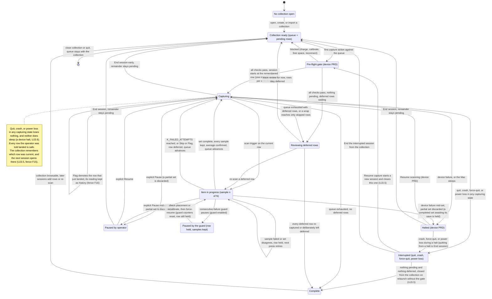
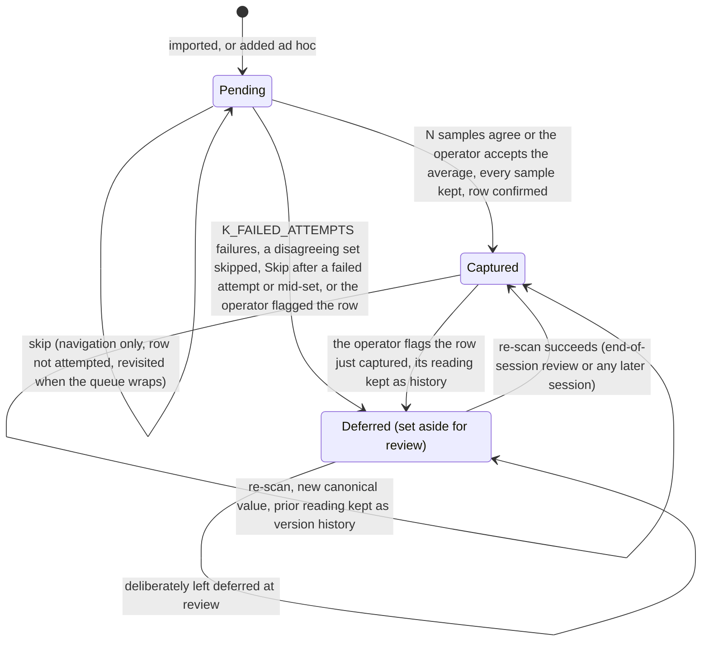
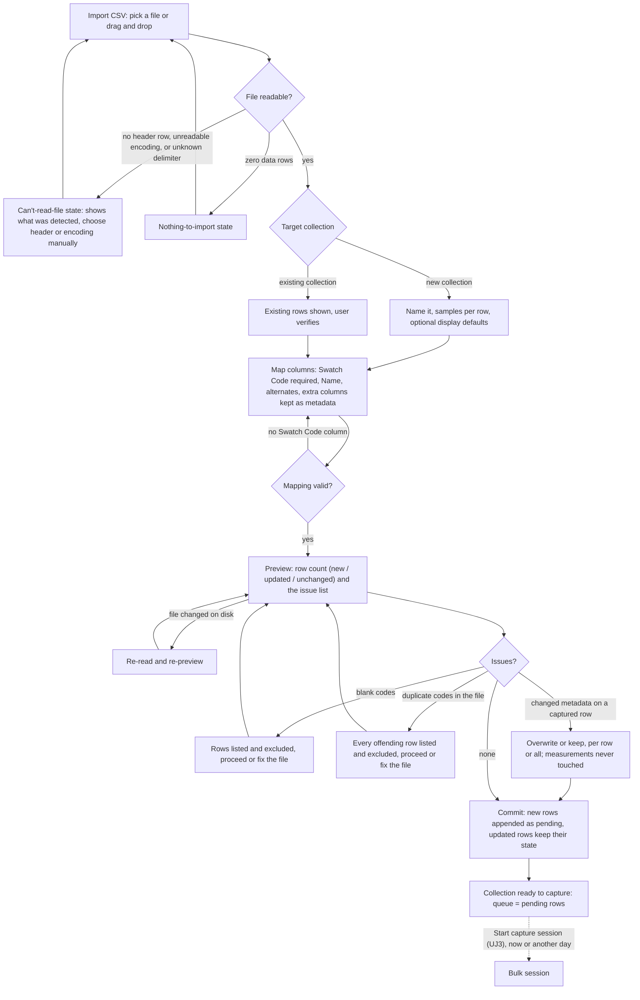
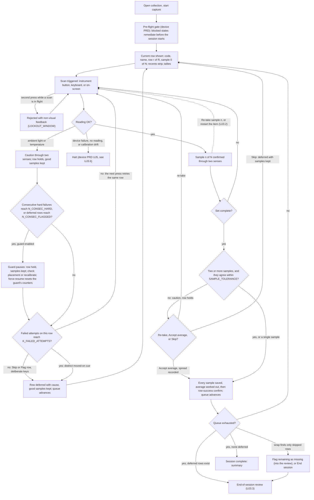
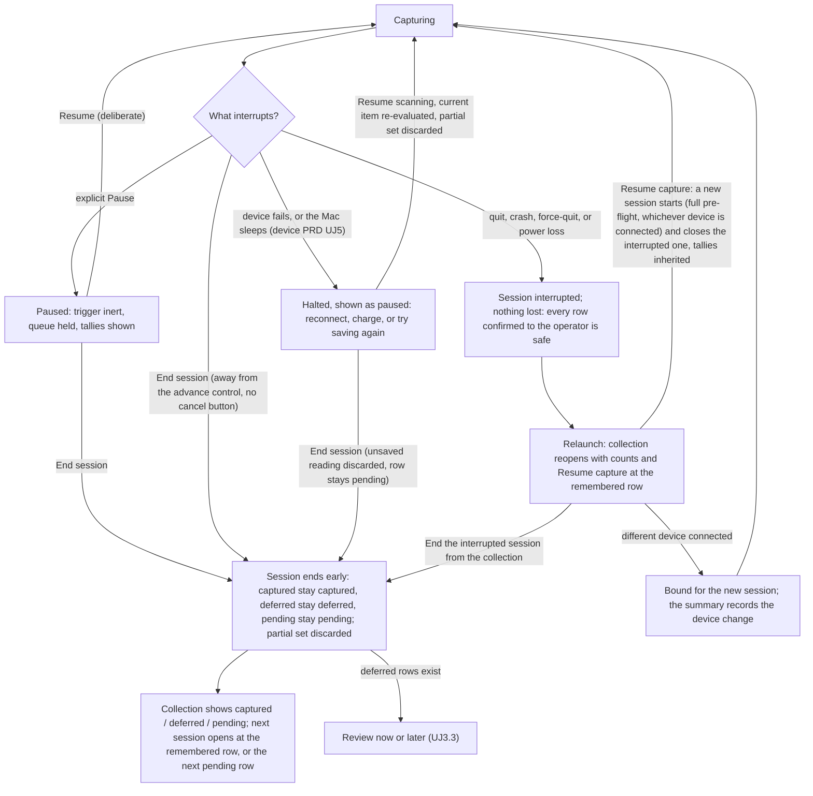
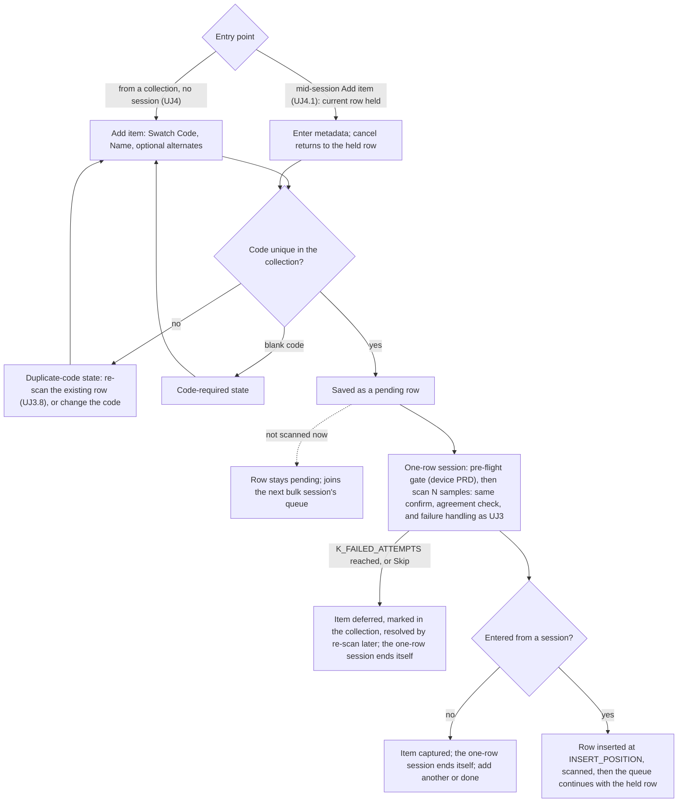

# PRD: Capture Mode

Author: Vinny Pasceri

# Background

SpectroCapture's primary value proposition is quick bulk capture of information using your spectrophotometer. The scope of this PRD covers all the requirements for the use cases, features, and user journeys related to the capture experience.

### Use cases

Defined in the [Vision doc](vision.md#use-cases):

|     | Use case                                 | Persona   | What serves it                                                         |
| --- | ---------------------------------------- | --------- | ---------------------------------------------------------------------- |
| U1  | **Bulk-digitize a predefined inventory** | Cataloger | CSV import with column mapping → queued scan, 1–5 samples/row averaged |
| U2  | **Capture a single new item ad hoc**     | Cataloger | metadata-first single capture into a chosen collection                 |

### Feature list

Defined in the [Vision doc](vision.md#feature-list):

| Pri | Feature                                  | Serves | Notes                                                          |
| --- | ---------------------------------------- | ------ | -------------------------------------------------------------- |
| P0  | CSV inventory import with column mapping | U1     | The inventory-first wedge                                      |
| P0  | Queued bulk scan, 1–5 samples averaged   | U1     | Heads-down; haptic confirm where available; row auto-advance   |
| P0  | Inline scan-failure handling             | U1     | Retry / skip / flag-row for light, battery, temperature errors |
| P1  | Ad-hoc single capture                    | U2     | Metadata-first, into a chosen collection                       |

### Capture workflow

The capture lifecycle end-to-end, as the Cataloger experiences it: a collection becomes a queue of pending rows (by import, [UJ2](#uj-2-full-collection-bootstrap-via-csv-import), or by adding items, [UJ4](#uj-4-capture-a-single-new-item-into-a-collection)); the first capture action runs the device PRD's pre-flight gate ([device PRD UJ2](prd-device-management.md#uj-2-start-acquisition)); the session then runs heads-down, one row at a time, each row a set of 1–5 samples ([UJ3](#uj-3-run-a-bulk-capture-session)); a stop mid-run is either a device-level halt (system sleep included), owned by the device PRD ([device PRD UJ5](prd-device-management.md#uj-5-device-failure-during-a-session)), or a pause or early end owned here ([UJ3.4](#uj-34-pause-and-end-a-session-early)); and a session is complete only when every row is captured or has been deliberately left deferred after the end-of-session review ([UJ3.3](#uj-33-resolve-the-deferred-error-queue-at-session-end)). Two diagrams: the first is the session, the second is a single queue row. The seam between capture and the collection — what the user sees at session end — is deliberately not drawn here; it is the open question [UJ5](#uj-5-session-ends-and-the-collection-is-reviewed-the-seam) exposes for ADR-0004.

## User Journeys

States are named here in plain language; the copy for each state comes in the requirements pass. Persona is the Cataloger unless the title says otherwise. Citation shorthand: [acq v1](../briefs/acquisition-experience-research-results.md) and [acq v2](../briefs/acquisition-experience-research-results-v2.md) are the two acquisition-experience research passes (v2 supersedes v1 where they conflict); [browsing](../briefs/browsing-a-collection-at-scale-research-results.md) is the collection-browsing research; [SDK audit](../briefs/nix-universal-sdk-audit-findings.md) is the vendor SDK audit; [device PRD](prd-device-management.md) is the locked device-management PRD. Every number below is a named provisional constant with a candidate value and an open question (OQ); none is decided.

Vocabulary used throughout ([AGENTS.md §8](../../AGENTS.md#8-vocabulary), [acq v2 §1](../briefs/acquisition-experience-research-results-v2.md#1-queue-model-and-task-framing)): a queue row is **pending** (no confirmed reading yet), **captured** (a canonical value exists), or **deferred** (a reading was attempted and failed, the samples disagreed, or the operator flagged it — the dead-letter state, set aside for end-of-session review). **Skip** is not a state: it is navigation past a pending row without attempting it; the row stays pending. No shipped system models "skipped" as a state — they record a decision or leave the row pending [acq v2 §1 Q1.1].

A **capture session** belongs to one collection (fence F12). The app keeps, for each session: which instrument it is using (the binding is released when the app quits or crashes); when it started and ended; its status — **active** (running now), **interrupted** (the app quit, crashed, was force-quit, or lost power while capturing, before the session ended — system sleep is not an interruption: the session stays active through it and the device PRD's halt handles it, [UJ3.6](#uj-36-device-fails-mid-session) step 1; fence F14. "Quit" here means quitting while capturing: quitting from a device halt goes through the device PRD's End-session warning and ends the session instead ([device PRD §5](prd-device-management.md#5-mid-session-device-failure); [UJ3.6](#uj-36-device-fails-mid-session) step 4), while a crash, force-quit, or power loss during a halt does interrupt it), **ended** (the operator stopped early; rows stay pending or deferred), or **complete** (every row captured or deliberately left deferred after review); and how much capture time has elapsed. An interrupted session never becomes active again: "Resume capture" starts a new session that closes it as "interrupted — resumed by the next session" and inherits its tallies and elapsed capture time ([UJ3.5](#uj-35-resume-an-interrupted-session) step 4; fence F14). At most one session is active in the app at a time, and a collection holds at most one *unresumed* interrupted session; two different collections may each hold one. An ad-hoc capture ([UJ4](#uj-4-capture-a-single-new-item-into-a-collection)) or an out-of-session re-scan ([UJ3.8](#uj-38-re-scan-an-already-captured-row)) is a one-row session, and none can start while another collection's session is active or paused ([UJ3.8](#uj-38-re-scan-an-already-captured-row) step 1). An interrupted session is not in flight, so a one-row session may run beside it on the same collection: a quick re-scan or ad-hoc add never wakes the interrupted session, which still waits for a deliberate "Resume capture" (fence F17). A one-row session that is itself interrupted — the app quits or crashes mid-scan — is simply closed on relaunch: its row stays exactly as it was, and there is nothing to resume ([UJ3.5](#uj-35-resume-an-interrupted-session) step 3).

**The remembered row** belongs to the collection, not only to a session (fence F15). The collection remembers exactly which row the operator was on — updated every time the queue advances, the operator jumps ([UJ3.7](#uj-37-jump-to-a-different-row)), an item is inserted ([UJ4.1](#uj-41-insert-an-unplanned-item-mid-session)), or a deferred row is selected in the review ([UJ3.3](#uj-33-resolve-the-deferred-error-queue-at-session-end) step 2) — and every session on that collection, whether the last one ended early, was interrupted, or completed, opens at that row, or at the next pending row in queue order if that row is no longer pending. One exception is deliberate: when the remembered row was selected in the review, it is a deferred row, and the next session — or a resume — opens the review at that row rather than falling back to the next pending row, so the operator lands on the swatch they had in hand. A jump or reorder made yesterday is honoured today, and nobody is ever sent back to the top of the queue ([UJ3](#uj-3-run-a-bulk-capture-session) step 2, [UJ3.5](#uj-35-resume-an-interrupted-session) step 3).

**Partial sets — one rule everywhere.** The samples taken so far on the current item survive only a reorder ([UJ3.10](#uj-310-reorder-the-queue)) and looking at the queue list. Any action that would put a different item under the instrument first — the operator's own Pause ([UJ3.4](#uj-34-pause-and-end-a-session-early) step 2), a jump ([UJ3.7](#uj-37-jump-to-a-different-row) step 3), a mid-session re-scan entered by find ([UJ3.7](#uj-37-jump-to-a-different-row) step 4 → [UJ3.8](#uj-38-re-scan-an-already-captured-row)), entering the review ([UJ3.3](#uj-33-resolve-the-deferred-error-queue-at-session-end) step 1), Add item ([UJ4.1](#uj-41-insert-an-unplanned-item-mid-session) steps 1 and 5) — and any device halt ([UJ3.6](#uj-36-device-fails-mid-session)) discards the held samples, and the row returns to "sample 0 of N". Three things are not partial sets and are never discarded this way: a completed set waiting for its save — if the save fails, that set is held through the halt for "Try saving again" ([UJ3.6](#uj-36-device-fails-mid-session) step 4); the samples on a row that becomes deferred by Skip, Flag, or K_FAILED_ATTEMPTS — they are kept as that row's record ([UJ3.1](#uj-31-a-scan-fails-mid-queue) step 3); and the samples on a row held under the consecutive-failure guard's pause ([UJ3.1](#uj-31-a-scan-fails-mid-queue) step 4) — that pause keeps the row under the instrument, so its samples survive it. The discard rule applies only to a row that stays pending.

### Cluster 1 — Set up a place to capture into

### UJ 1. Create a collection

1. Initiate an action to create a collection
2. Name the collection
  - If a collection with that name already exists → the duplicate-collection-name state; the name must be unique among the user's collections, compared by the one matching rule in [UJ2.2](#uj-22-mapping-metadata-fields) step 2 (fence F11)
3. Select the number of samples to acquire per row (default 3; range 1–5 — vision [U1](vision.md#use-cases)). The setting is required but arrives pre-filled with 3, so the user can accept it without a decision. It is the acquisition setting: the collection default for every session, changeable between sessions ([acq v2 §6 Q6.4](../briefs/acquisition-experience-research-results-v2.md#6-durability-crash-safety-and-resumability)); whether it can change mid-session is an OQ. With one sample per row there is nothing to compare, so the agreement check ([UJ3](#uj-3-run-a-bulk-capture-session) step 9) does not run (fence F10)
4. Optionally set the collection's display defaults: illuminant (e.g. D50) and observer (e.g. 2°). These are display settings applied when a colour value is worked out, not acquisition settings — the raw measurement is what the app keeps as the true value, and colour values are worked out from it ([AGENTS.md §8](../../AGENTS.md#8-vocabulary); [SDK audit](../briefs/nix-universal-sdk-audit-findings.md): colour data is XYZ-backed and freely convertible, per SDK docs; confirm on hardware) — so they are never required at creation and can be changed at any time without re-scanning. The ISO 13655 measurement condition (M0/M1/M2) is a scan mode of the instrument, not an observer; which scan modes a capture records is an OQ against the SDK ([SDK audit](../briefs/nix-universal-sdk-audit-findings.md): Spectro 2 supports M0/M1, plus M2 on F2.x firmware, per SDK docs; confirm on hardware)
5. Save the collection
6. The collection is ready with an empty queue. From here the user imports an inventory ([UJ2](#uj-2-full-collection-bootstrap-via-csv-import)) or adds items one at a time ([UJ4](#uj-4-capture-a-single-new-item-into-a-collection)); "Start capture session" is available once the collection has at least one pending or deferred row (with only deferred rows it opens straight into the review, [UJ3](#uj-3-run-a-bulk-capture-session) step 2)
  - If the user starts a capture session on a collection with no pending and no deferred rows → the nothing-to-capture state ([UJ3](#uj-3-run-a-bulk-capture-session) step 2), offering import ([UJ2](#uj-2-full-collection-bootstrap-via-csv-import)) or add item ([UJ4](#uj-4-capture-a-single-new-item-into-a-collection)) — and re-scan ([UJ3.8](#uj-38-re-scan-an-already-captured-row)) only once the collection has captured rows; nothing else happens

UJ1.1 was folded into UJ1 when Library was dropped (fence F1).

### UJ 1.2 Manage collections — rename, delete

> Scope boundary — handed to Collection Mode. Per the [product README](README.md#4-collection-mode), Collection Mode owns editing surfaces, selection, and bulk operations; rename and delete are collection management, not capture. The steps below are kept here verbatim so nothing the owner wrote is lost, and so the Collection Mode PRD inherits them with the two failure branches this pass adds (duplicate name; delete when captured readings exist). Ownership is decided by fence F3 (see [surfaced questions](#open-questions-surfaced-by-the-journeys)).

**Rename a collection**

1. Select a collection; initiate an action to rename the collection
2. Rename the collection to a new unique name
  - If the new name is already used by another collection → the duplicate-collection-name state; the rename does not apply; the name must be unique among the user's collections
3. Save the new collection name

**Delete a collection**

1. Select a collection; initiate an action to delete the collection
2. Display a warning that the collection and all information contained within it will be deleted
  - If the collection has captured readings → the delete-with-captured-readings warning names the count of captured rows and their version history, and offers export first; deletion is permitted (the "corrections never destroy data" rule, [AGENTS.md §4](../../AGENTS.md#4-non-negotiables), is about measurements, not containers) but is never the default action
  - If the collection has an active or interrupted session → the session-in-flight state; the session must end ([UJ3.4](#uj-34-pause-and-end-a-session-early), or ending the interrupted session from the collection, [UJ3.5](#uj-35-resume-an-interrupted-session) step 4) before the collection can be deleted
3. If the user confirms, delete the collection and the collection data.

### Cluster 2 — Import an inventory

Assumed for this pass (owner to confirm): the target collection is chosen or created in the app before columns are mapped; the collection name is not a CSV column in v1 (a CSV is normally one swatch book — one collection). Import ends with the collection ready to capture; starting the session is its own step, because import-today-scan-tomorrow is the normal case and the queue must survive between them ([UJ3.5](#uj-35-resume-an-interrupted-session)).

### UJ 2. Full collection bootstrap via CSV import

1. Initiate an action to import a collection via CSV
2. Select the CSV to import (or drag & drop the CSV)
3. The app reads the file and shows what it detected: the header row and the row count. The detected encoding and delimiter are shown only when detection failed or when the user asks — a cataloger should not have to know those words. Detection behaviour is an OQ — the research documents only that file reading *can* be configured for encoding, delimiter, and malformed rows ([acq v1 §7](../briefs/acquisition-experience-research-results.md)), not what a good user-facing flow is
  - If no header row is detected → the no-header-row state; the user names the columns or picks the header row manually
  - If the encoding cannot be read → the unreadable-file state; the user chooses an encoding or re-saves the file; nothing is imported
  - If the file has zero data rows → the nothing-to-import state; the import ends
  - If some rows have the wrong number of columns → those rows are listed by row number and excluded, never silently imported; the user proceeds without them or fixes the file and re-picks it
4. Choose the target: a new collection, or an existing collection (→ [UJ2.1](#uj-21-import-additional-rows-into-an-existing-collection)) — the app indicates which will be created and asks the user to validate
  - If the user chooses an existing collection → this becomes [UJ2.1](#uj-21-import-additional-rows-into-an-existing-collection)
5. Name the collection (a name already in use is the duplicate-collection-name state, as in [UJ1](#uj-1-create-a-collection) step 2); select the number of samples to acquire per row (default 3); optionally set illuminant and observer display defaults (as in [UJ1](#uj-1-create-a-collection) steps 3–4)
6. Map the columns ([UJ2.2](#uj-22-mapping-metadata-fields)): Swatch Code is required; Swatch Name is optional, as are the alternates and any other columns
7. App validates the column mapping and allows the user to save the mapping
  - If no column is mapped to Swatch Code → the mapping-incomplete state; the mapping cannot be saved
8. Preview before commit: the row count, and the issue list. For a new collection every row is new, so the count is one number; for an existing collection it is the three-way count new / updated / unchanged — the count is the reconciliation interface ([acq v2 §7 Q7.5](../briefs/acquisition-experience-research-results-v2.md#7-inventory-import-and-column-mapping))
  - If some rows have a blank Swatch Code → those rows are listed by row number and excluded from the import, never silently imported ([acq v2 §7 Q7.3](../briefs/acquisition-experience-research-results-v2.md#7-inventory-import-and-column-mapping)); the user can proceed without them or fix the file and re-pick it
  - If the same Swatch Code appears more than once in the file (compared by the [UJ2.2](#uj-22-mapping-metadata-fields) step 2 rule, so "cg-3" and "CG 3" count as the same code) → the duplicate-codes-in-file state lists every offending row number, and every one of those rows is excluded — never first-row-wins ([acq v2 §7 Q7.3](../briefs/acquisition-experience-research-results-v2.md#7-inventory-import-and-column-mapping)); the user proceeds without them or fixes the file and re-picks it, the same treatment as blank codes
  - If the file changed on disk between being read and being committed → the file-changed state; the app re-reads it and re-shows the preview
  - If the file is gone when the user commits → the unreadable-file state (step 3); nothing is imported
9. Save the mapping; the app remembers it for files with the same header signature ([UJ2.2](#uj-22-mapping-metadata-fields) step 7)
10. Create the new collection (or use the existing collection)
11. Import the data into the new collection — all of the rows or none of them, so a failure partway leaves the collection exactly as it was; every imported row is pending
12. The collection is ready to capture: the queue is every pending row, in file order. "Start capture session" leads to [UJ3](#uj-3-run-a-bulk-capture-session); the user can equally close the app and start tomorrow

### UJ 2.1 Import additional rows into an existing collection

The idempotent re-import: a corrected or extended CSV for a collection that already has rows, some of them captured. Swatch Code is how a file row is matched to a collection row — required and unique within a collection, compared by the [UJ2.2](#uj-22-mapping-metadata-fields) step 2 rule (fence F11). The code is the way in, not the row itself: whatever the file says, a matched row keeps its place, its state, and its measurements ([acq v2 §7 Q7.3](../briefs/acquisition-experience-research-results-v2.md#7-inventory-import-and-column-mapping)).

1. Initiate an action to import a collection via CSV
2. Select the CSV to import (or drag & drop the CSV)
3. Choose the target: an existing collection — the app indicates there are existing rows in the collection and asks the user to verify that new rows will be imported into it
4. Map the columns ([UJ2.2](#uj-22-mapping-metadata-fields)); if the header signature matches a remembered mapping, it is pre-filled
5. App validates the column mapping and allows the user to save the mapping
6. Preview before commit: the three-way count — new rows (code not in the collection) / updated rows (code present, mapped metadata differs) / unchanged rows (code present, metadata identical) — plus a fourth line, "N rows in the collection are not in this file — left untouched", plus the issue list, exactly as in [UJ2](#uj-2-full-collection-bootstrap-via-csv-import) step 8. Unchanged rows are untouched, so importing the same file twice changes nothing (idempotent), and a re-import never deletes a row
  - If a code in the file matches more than one row in the collection → that row is a hard failure listed in the preview, neither created nor updated — an ambiguous key is never a guess ([acq v2 §7 Q7.3](../briefs/acquisition-experience-research-results-v2.md#7-inventory-import-and-column-mapping), the Salesforce "300" outcome). This cannot arise if codes are unique within a collection; the branch exists so the guarantee is stated
  - If an updated row is already captured → the changed-metadata-on-captured-row choice: overwrite the metadata or keep the existing values — a keep/overwrite toggle on each such row in the preview, with one default applied to all of them, never a series of dialogs; the app states that measurements are never touched by a metadata change — the canonical value and its version history are unaffected either way ([acq v2 §7 Q7.5](../briefs/acquisition-experience-research-results-v2.md#7-inventory-import-and-column-mapping), the "Cool Grey 3 → Cool Grey III" hazard)
  - If a mapped column is present in the file but blank for a row → the blank value is treated as a change (it would clear the field) and appears under "updated" so the user sees it; a column omitted from the file entirely leaves existing values untouched ([acq v2 §7 Q7.5](../briefs/acquisition-experience-research-results-v2.md#7-inventory-import-and-column-mapping))
  - Blank codes, duplicate codes within the file, zero rows, unreadable file: as in [UJ2](#uj-2-full-collection-bootstrap-via-csv-import)
7. Save the mapping and commit
8. Import the data into the collection — all of the rows or none of them: new rows are appended to the queue as pending, in file order, after the existing rows; updated rows keep their state (a captured row stays captured, a pending row stays pending); unchanged rows are untouched; rows in the collection that are not in the file are left exactly as they are, never deleted
9. The collection is ready to capture; the queue is every pending row. The next session opens at the collection's remembered row — or at the next pending row in queue order if that row is no longer pending — whether the last session ended early, was interrupted, or completed (fence F15; [UJ3](#uj-3-run-a-bulk-capture-session) step 2)

### UJ 2.2 Mapping metadata fields

1. Assume the user is at the point they need to map metadata fields
2. Map the Swatch Code field — required. It is the match key for re-import ([UJ2.1](#uj-21-import-additional-rows-into-an-existing-collection)) and the entry point for re-scan ([UJ3.8](#uj-38-re-scan-an-already-captured-row)), so it must be present and unique within the collection. **The one matching rule** (fence F11): two codes — or two collection names — count as the same when they match after trimming spaces at either end, collapsing any run of spaces inside to one, and ignoring letter case; the value itself is always shown exactly as it was entered. This rule applies everywhere a code or a collection name is compared: uniqueness here, re-import matching ([UJ2.1](#uj-21-import-additional-rows-into-an-existing-collection)), find ([UJ3.7](#uj-37-jump-to-a-different-row)), the ad-hoc duplicate check ([UJ4](#uj-4-capture-a-single-new-item-into-a-collection), [UJ4.1](#uj-41-insert-an-unplanned-item-mid-session)), and collection names ([UJ1](#uj-1-create-a-collection)) — so a re-export from Numbers or an Excel autocorrect never doubles the queue
  - If the chosen column is not unique within the file → the duplicate-codes-in-file state ([UJ2](#uj-2-full-collection-bootstrap-via-csv-import) step 8): the offending rows are listed and excluded
3. Map the Swatch Name field — optional; only Swatch Code is required
4. Optional: Map the Swatch Alternate Code
5. Optional: Map the Swatch Alternate Name
6. Optional: For any additional columns that aren't mapped, they will be imported "as is" into the collection as additional metadata fields the collection experience can surface
  - If an unmapped column's header is blank → it is imported under a generated name ("Column 7") and listed in the preview so the user can rename it later in Collection Mode
7. The app remembers the mapping keyed by the file's header signature (the set of column names, in any order); the next import of a file with the same headers is pre-filled and the user confirms rather than re-maps. Whether a remembered mapping is a named, reusable template the user manages is an OQ

The chart below covers [UJ2](#uj-2-full-collection-bootstrap-via-csv-import), [UJ2.1](#uj-21-import-additional-rows-into-an-existing-collection), and [UJ2.2](#uj-22-mapping-metadata-fields) together — the three-way count and the changed-metadata choice are UJ2.1's branches; the mapping box is UJ2.2.

### Cluster 3 — The bulk session (the thesis)

Decided (fence F5): jump by code ([UJ3.7](#uj-37-jump-to-a-different-row)) and manual reordering ([UJ3.10](#uj-310-reorder-the-queue)) are both v1 journeys.

The scale these journeys are designed for, as provisional constants: ROWS_TARGET (candidate 200–1,200 rows per collection and per import — the marker set and the swatch book — OQ), ROWS_CEILING (candidate 10,000 rows, the bound the ADR-0001 spike tested — OQ), and a single session that can run for up to one working day.

### UJ 3. Run a bulk capture session

The product thesis: import first, then scan heads-down with no per-item metadata entry between scans ([AGENTS.md §4](../../AGENTS.md#4-non-negotiables); vision [J2](vision.md#j2-the-bulk-session-cataloger)). The target pace is the instrument's scan cycle, not the UI.

1. Initiate a capture
2. If no collection is selected, select a collection. The queue is the collection's pending rows in queue order (import order until the operator reorders, [UJ3.10](#uj-310-reorder-the-queue)); the session opens at the collection's remembered row, or at the next pending row in queue order if that row is no longer pending (fence F15; a row that was selected in the review opens the review at that row instead, vocabulary above) — a collection that has never had a session opens at its first pending row
  - If the collection has no pending rows and no deferred rows → the nothing-to-capture state, offering import ([UJ2.1](#uj-21-import-additional-rows-into-an-existing-collection)), add item ([UJ4](#uj-4-capture-a-single-new-item-into-a-collection)), or re-scan ([UJ3.8](#uj-38-re-scan-an-already-captured-row))
  - If the collection has no pending rows but one or more deferred rows → "Start capture session" runs the pre-flight gate (step 3) and opens straight into the review ([UJ3.3](#uj-33-resolve-the-deferred-error-queue-at-session-end)), so day two with only deferred rows is never stranded; the nothing-to-capture state also lists "Review N deferred rows"
  - If a session for this collection is already in flight in this app → the app returns to it rather than starting a second; there is at most one in-flight session per collection, enforced structurally ([acq v2 §8 Q8.4](../briefs/acquisition-experience-research-results-v2.md#8-progress-orientation-and-session-completion)). An interrupted session is not in flight: starting capture on a collection that holds one is the resume in [UJ3.5](#uj-35-resume-an-interrupted-session) step 4
  - If another collection's session is active or paused → starting capture here is not allowed until that session is ended or complete; the app says which collection's session is holding the instrument — the same rule a one-row session carries ([UJ3.8](#uj-38-re-scan-an-already-captured-row) step 1)
3. The first capture action runs the pre-flight gate — battery, calibration currency, authorization window, storage headroom, and the muted-audio advisory ([device PRD UJ2](prd-device-management.md#uj-2-start-acquisition), [device PRD §4](prd-device-management.md#4-pre-flight-device-health))
  - If a check blocks → the device PRD's blocked state and its remediation; the session has not started and the queue is untouched
  - If system audio is muted → the device PRD's muted-audio advisory, so the operator knows the tone channel is off before going heads-down
  - If the connected device is the Demo Device → the persistent simulated indicator is on the capture surface for the whole session ([UJ3.9](#uj-39-capture-with-the-demo-device-contributor))
4. The session starts. The capture surface shows the current row — Swatch Code, Swatch Name, position "row r of R", where r is the row's place among the pending rows in the current queue order and R is the pending count (R grows when an item is inserted, [UJ4.1](#uj-41-insert-an-unplanned-item-mid-session), and both change with a reorder, [UJ3.10](#uj-310-reorder-the-queue)) — the sample counter "sample 0 of N", the session tallies (captured / deferred / pending), and the recents strip of the last few captured rows ([acq v2 §11 Q11.2](../briefs/acquisition-experience-research-results-v2.md#11-the-seam--capture-to-collection)). Under Reading B at least two redundant indicators say the app is in capture ([acq v2 §11 Q11.6](../briefs/acquisition-experience-research-results-v2.md#11-the-seam--capture-to-collection)); under Reading A the takeover itself is the indicator (see [UJ5](#uj-5-session-ends-and-the-collection-is-reviewed-the-seam)); either way the surface has no cancel or abandon control, and "End session" sits deliberately away from anything that advances the queue ([acq v2 §8 Q8.4](../briefs/acquisition-experience-research-results-v2.md#8-progress-orientation-and-session-completion))
5. The operator places the instrument on the physical item and triggers a scan — the instrument's own button where the app can receive it, otherwise a one-hand keyboard or on-screen trigger. The keyboard or on-screen trigger is designed as the primary path until the hardware spike says otherwise: whether the Spectro 2 button reaches the app at all is unverified — the [SDK audit](../briefs/nix-universal-sdk-audit-findings.md) does not describe one and the research calls the instrument-button arm empirically untested ([acq v2 §2 Q2.1](../briefs/acquisition-experience-research-results-v2.md#2-heads-down-input-and-interaction-modality)) (OQ). The rest of the host keyboard is reserved for queue management ([acq v1 §2](../briefs/acquisition-experience-research-results.md)). One accepted trigger means exactly one measurement
  - If the trigger is pressed again while a scan is in flight → the second press is rejected, not queued and not silently dropped, with immediate non-visual feedback (a distinct rejection tone or haptic); the lockout lasts LOCKOUT_WINDOW (candidate 0.5 s from the barcode-scanner precedent — OQ) ([acq v2 §3 Q3.1](../briefs/acquisition-experience-research-results-v2.md#3-pacing-latency-and-feedback)). "Re-take sample" ([UJ3.2](#uj-32-undo-or-redo-the-current-item)) pressed while a scan is in flight is rejected the same way; nothing is discarded
  - If the trigger or a queue-management key is bound to a bare Space or single letter → not allowed: capture shortcuts are active only while the capture surface has focus and never use bare single keys ([acq v2 §2 Q2.2](../briefs/acquisition-experience-research-results-v2.md#2-heads-down-input-and-interaction-modality))
6. The instrument measures. The reading arrives as one measurement per scan mode ([SDK audit](../briefs/nix-universal-sdk-audit-findings.md), per SDK docs; confirm on hardware); which modes the app keeps is an OQ. The measurement condition(s) the reading was taken under (M0/M1/M2) are recorded with the reading; the illuminant and observer used to work out any colour value are recorded with that value, not with the raw reading (fence F2) — so every colour value can be reproduced later. [acq v2 §6 Q6.4](../briefs/acquisition-experience-research-results-v2.md#6-durability-crash-safety-and-resumability) asks for both on the raw reading; recording the inputs alongside every value worked out from a reading is a Data Foundation constraint ([inherited obligations](#inherited-obligations-for-data-foundation))
  - If the instrument refuses the reading (ambient light leakage, out-of-range temperature) → [UJ3.1](#uj-31-a-scan-fails-mid-queue)
  - If the device disconnects, stops responding, returns no reading at all, reports calibration drift, drops below the battery threshold, or the save fails → the device PRD's halt ([UJ3.6](#uj-36-device-fails-mid-session)); there is no per-scan timer in this PRD (fence F7)
7. Sample confirmed: "sample 1 of N" reaches the operator through at least two senses — a success tone, a haptic where the hardware provides one (Spectro 2/L carry device-side haptics, [SDK audit](../briefs/nix-universal-sdk-audit-findings.md), per SDK docs; whether the app can trigger them is the device PRD's OQ 20), and the on-screen counter ([acq v2 §4 Q4.1](../briefs/acquisition-experience-research-results-v2.md#4-mid-run-error-handling); audio-only is an accessibility regression, [acq v2 §2 Q2.2](../briefs/acquisition-experience-research-results-v2.md#2-heads-down-input-and-interaction-modality)). Two timing promises: the press itself is acknowledged within TRIGGER_ACK_WINDOW (candidate 100 ms from any trigger press the app can see — OQ), so the instrument and the app feel like one device ([acq v1 §3](../briefs/acquisition-experience-research-results.md)); and the result cue — success or caution — follows the reading's arrival within RESULT_CUE_LATENCY (candidate TBD — OQ). Both are measurable against the Demo Device at real pacing ([simulated-layer obligations](#simulated-layer-obligations-this-prd-adds))
8. The operator lifts, repositions slightly, and presses again; steps 5–7 repeat until "sample N of N". Nothing on the host is touched between samples ([acq v1 §1](../briefs/acquisition-experience-research-results.md))
  - If a sample looks wrong to the operator → [UJ3.2](#uj-32-undo-or-redo-the-current-item)
9. The set is complete: with two or more samples, the app checks that they agree within SAMPLE_TOLERANCE — the largest ΔE2000 distance of any one sample from the set's mean, worked out under the collection's display illuminant and observer defaults (candidate ΔE2000 2.0, a placeholder with no evidence behind the value; the statistic and its basis are candidates too — OQ). With one sample per row there is nothing to compare and the check is skipped (fence F10). No shipped precedent exists for this check; it is designed here, not inherited
  - If the samples disagree → a caution through two senses, and the row holds (fence F6). Three choices, none of them silent: re-take the item on the spot — the next trigger press restarts its samples ([UJ3.2](#uj-32-undo-or-redo-the-current-item)); "Accept average" — the set is kept exactly as measured, and the spread between its samples is recorded on the reading so the collection can show it later (fence F10); or "Skip" — the item is deferred with all its samples kept, and the queue advances exactly once ([UJ3.1](#uj-31-a-scan-fails-mid-queue) step 3). A re-taken set that disagrees again counts as a failed attempt toward K_FAILED_ATTEMPTS, after which the row defers on its own. Never a silent average of a disagreeing set
10. The row's measurement is the full set of its N readings, each exactly as the instrument produced it, and that set is saved **before** anything else happens ([device PRD §5](prd-device-management.md#5-mid-session-device-failure): the save completes before the queue advances). The average the operator sees — and that the collection displays and a QC comparison measures against — is worked out from those readings and labelled with how it was worked out, so it can be recomputed if the method ever changes; no individual reading is ever discarded in favour of the average ([AGENTS.md §8](../../AGENTS.md#8-vocabulary): the raw measurement is the canonical value, never a value worked out from it). Whether the average is taken across the spectral curves or across the colour values is a Data Foundation constraint ([inherited obligations](#inherited-obligations-for-data-foundation)). The row is now captured
  - If the save fails → this is a device-PRD halt (disk full, the file holding the collection unreachable, unexpected error), not a per-scan error; the completed set is held for "Try saving again" ([UJ3.6](#uj-36-device-fails-mid-session))
11. Row confirmed: the row-success confirmation (distinct from the per-sample confirm) reaches the operator only once the set is safely saved — again through two senses, within ROW_CONFIRM_BUDGET of the last sample's arrival (candidate TBD — OQ) — and the queue auto-advances to the next pending row; the recents strip shows the row just captured. The promise behind that confirmation: a row the operator was told landed survives a power cut or a drive pulled a moment later, because the confirmation waits for the save to be truly complete, not merely under way (how that is achieved is Data Foundation's, ADR-0003 — [inherited obligations](#inherited-obligations-for-data-foundation)). An error tone always pre-empts an in-flight success tone ([acq v2 §4 Q4.1](../briefs/acquisition-experience-research-results-v2.md#4-mid-run-error-handling))
12. Steps 5–11 repeat, heads-down, row after row. The operator never types metadata, never confirms a dialog, and never looks at the screen to know whether the last row landed
  - If the physical order does not match the queue → [UJ3.7](#uj-37-jump-to-a-different-row) or [UJ3.10](#uj-310-reorder-the-queue)
  - If the swatch book has an item the CSV missed → [UJ4.1](#uj-41-insert-an-unplanned-item-mid-session)
  - If the operator needs to stop → [UJ3.4](#uj-34-pause-and-end-a-session-early)
  - If the app is quit, crashes, is force-quit, or the Mac loses power → [UJ3.5](#uj-35-resume-an-interrupted-session)
  - If the Mac sleeps → the instrument disconnects and the device PRD's halt applies ([UJ3.6](#uj-36-device-fails-mid-session) step 1); the session is not interrupted, and nothing is lost (fence F14)
13. The last pending row is captured — or the queue wraps and finds only rows that were skipped without an attempt in this pass. A pass is one trip through the queue: it begins at the row that was current when the queue last wrapped — or when the session started — and ends when the queue comes back around to that position; a jump does not start a new pass, and a row the operator jumped away from without an attempt counts as skipped for this check. The queue is exhausted
  - If any rows are deferred → the session enters the end-of-session review ([UJ3.3](#uj-33-resolve-the-deferred-error-queue-at-session-end)); the session is not complete yet
  - If the wrap found only skipped rows → the session offers "Flag remaining as missing" (those rows become deferred, cause "flagged: missing or damaged", and the review opens with them) or "End session" (they stay pending for another day, [UJ3.4](#uj-34-pause-and-end-a-session-early)); a skipped row can never make "complete" unreachable
14. Session complete — defined as: every row is captured, or has been deliberately left deferred after review. The session summary shows captured / deferred / pending counts (pending is zero here), elapsed time, and the way to the collection ([UJ5](#uj-5-session-ends-and-the-collection-is-reviewed-the-seam))
15. The collection is browsable, exportable, and plotted, with every row's canonical value in place (vision [J2](vision.md#j2-the-bulk-session-cataloger))

### UJ 3.1 A scan fails mid-queue

The inline scan-failure feature (P0). The instrument can refuse a measurement for physical reasons — ambient light leakage, out-of-range temperature — and can also report calibration drift or low battery ([SDK audit](../briefs/nix-universal-sdk-audit-findings.md), per SDK docs; confirm on hardware). Calibration drift, low battery, a device that returns no reading, and disconnects are device-level and halt under the device PRD ([UJ3.6](#uj-36-device-fails-mid-session)). The per-scan set handled here, without stopping the run, is exactly: ambient light leakage, out-of-range temperature, a set of samples that disagree ([UJ3](#uj-3-run-a-bulk-capture-session) step 9), and the operator's own Flag (fence F7).

1. Mid-set on row r, a sample fails — ambient light leaked under the aperture, or the instrument reports out-of-range temperature. (A device that returns nothing at all is a halt, not a per-scan failure — [UJ3.6](#uj-36-device-fails-mid-session); SCAN_TIMEOUT was removed by fence F7)
2. A caution reaches the operator through at least two senses — a distinct warning tone (never the success tone) and a haptic where available, plus the on-screen state naming the cause in plain language ([acq v2 §4 Q4.1](../briefs/acquisition-experience-research-results-v2.md#4-mid-run-error-handling)). The tone pre-empts any success tone in flight
3. The row holds (fence F6). The failed sample is set aside, any good samples already taken on this row are kept, the counter stays where it was, and row r is still the current row. **The next trigger press is the retry**: it re-takes the failed sample on the same row, so a reflexive re-press after the warning tone can never land a reading on the next row ([device PRD §5](prd-device-management.md#5-mid-session-device-failure); [acq v2 §4 Q4.1](../briefs/acquisition-experience-research-results-v2.md#4-mid-run-error-handling)). Moving on is always a deliberate queue action — never the trigger:
  - If the retry fails too → the row still holds and the next press retries again; every failed attempt counts, both toward this row's K_FAILED_ATTEMPTS and toward the consecutive-failure guard (step 4)
  - If K_FAILED_ATTEMPTS consecutive attempts on this row have failed (candidate 3 — OQ) → the row is deferred with its cause and its good samples kept, a distinct "moved on" cue — neither the success tone nor the warning tone — reaches the operator through two senses, the deferred tally increments on screen, and the queue advances to the next pending row; the next press scans that row. The operator keeps physical momentum and resolves deferred rows at the end ([acq v1 §4](../briefs/acquisition-experience-research-results.md); [acq v1 §1](../briefs/acquisition-experience-research-results.md) dead-letter queue)
  - If the operator would rather move on now → "Skip" — a dedicated queue-management key, its binding not specified here — defers this row with the cause and good samples kept and advances exactly once; the next press scans the next pending row. Skip mid-set with good samples and no failure does the same: the row is deferred with those samples kept, cause "skipped mid-set". Skip before any attempt on a row is plain navigation and leaves the row pending ([UJ3.7](#uj-37-jump-to-a-different-row))
  - If the row that just landed looks wrong (wrong swatch scanned, smudge) → "Flag row", also a dedicated key. Until the operator presses the trigger on the new current row, Flag acts on the row that just landed — the one showing on the recents strip — and moves it from captured back to deferred: its reading is kept in the row's version history, not as its current value, the row has no current value until re-scanned, and it waits in the review like any other deferred row (fence F9). The boundary is the operator's own next action, not a timer (fence F16), so a reflexive "that one was wrong" right after the tone demotes the right row and never marks the next row missing. Only the operator's Flag ever demotes a captured reading
  - If Flag is pressed right after a "moved on" cue — the previous row deferred on its own after K_FAILED_ATTEMPTS, or by Skip — and before any trigger press on the new current row → Flag changes nothing: it only says that the previous row is already deferred and waiting in the review. It targets the new current row only once the trigger has been pressed on it, so a reflexive "that one was wrong" after a moved-on cue never marks the next row missing (the same boundary as fence F16)
  - If the item is missing or damaged → "Flag row" once the trigger has been pressed on the current row (or when nothing has just landed or just moved on — the first row of a session, for instance) targets the current row: with no samples yet, it is deferred with the cause "flagged: missing or damaged"; mid-set, it is deferred with its good samples kept; the queue advances, and the next press scans the next pending row (fences F9, F16)
4. Consecutive-failure guard, modelled on Westgard multirules but with clinical-analyser numbers that must be re-tuned for a hand-placed instrument ([acq v2 §4 Q4.2](../briefs/acquisition-experience-research-results-v2.md#4-mid-run-error-handling)). Two counters, two words: a **hard failure** is a per-scan failure the instrument itself reports (light leak, temperature); a **deferred** row is any row set aside for review, whatever the cause. The guard has an explicit setting — enabled, or record-only (it counts and records but never pauses the session); the v1 default is an OQ
  - If N_CONSEC_HARD consecutive hard failures occur (candidate 2 — OQ) → the guard pauses the session with a caution through two senses, naming the likely cause (placement, light leak, temperature) and offering "Check placement and resume" or "Recalibrate" ([device PRD §3](prd-device-management.md#3-calibration)). This is the guard's pause, not the operator's Pause ([UJ3.4](#uj-34-pause-and-end-a-session-early)): the held row stays under the instrument and its good samples survive; nothing is discarded. A trigger press during the guard's pause is not accepted and asks nothing of the instrument; it surfaces the pause
  - If N_CONSEC_FLAGGED consecutive rows are deferred (candidate 4 — OQ) → the guard pauses the session the same way and offers recalibration. Only rows the instrument's readings put there count — deferred after K_FAILED_ATTEMPTS, by Skip after a failed attempt, or because the set disagreed; a row the operator set aside by choice (Flag, or Skip mid-set with no failure) neither counts nor breaks the run, because the guard watches the instrument, not the operator's decisions (an assumption — see the [assumptions list](#assumptions-this-pass-wrote-against))
  - Lamp or calibration drift is not counted here: drift detection relies on the device PRD's calibration-due signal and its drift halt ([device PRD §3](prd-device-management.md#3-calibration); [UJ3.6](#uj-36-device-fails-mid-session)) plus the within-item spread ([UJ3](#uj-3-run-a-bulk-capture-session) step 9); N_CONSEC_DRIFT was removed by fence F8
  - In every guard pause the operator can force-resume — a deliberate action, never the trigger; resuming resets the guard's two counters (manual override, [acq v2 §4 Q4.2](../briefs/acquisition-experience-research-results-v2.md#4-mid-run-error-handling)) but not the held row's own count of failed attempts toward K_FAILED_ATTEMPTS, so a row that keeps failing still defers on its own; the held row is still the current row afterwards, its samples intact, and the next press retries it
5. Capture continues — on the held row if it is still current, otherwise on the next pending row. Every deferred row is waiting in the end-of-session review ([UJ3.3](#uj-33-resolve-the-deferred-error-queue-at-session-end)); nothing has been deleted and nothing needs a decision now

### UJ 3.2 Undo or redo the current item

Undo here applies to the in-progress item only. Once a row is captured, history is the undo — re-scanning never destroys the prior value ([browsing §5](../briefs/browsing-a-collection-at-scale-research-results.md#5-selection-and-bulk-operations); [UJ3.8](#uj-38-re-scan-an-already-captured-row)).

1. Mid-set on row r, after "sample n of N", the operator realises the instrument slipped or the wrong swatch was under it
2. "Re-take sample" discards sample n only; the counter returns to "sample n−1 of N" and the next press replaces it. The action is a keyboard queue-management action, distinct from the trigger ([acq v1 §2](../briefs/acquisition-experience-research-results.md))
  - If "Re-take sample" is pressed while a scan is in flight → it is rejected exactly like a second trigger press ([UJ3](#uj-3-run-a-bulk-capture-session) step 5); nothing is discarded
3. "Restart item" discards all samples of the current item; the counter returns to "sample 0 of N" and the row stays current
4. The operator continues from step 5 of [UJ3](#uj-3-run-a-bulk-capture-session)
  - If the set is already complete and saved (the row-success confirmation reached the operator) → there is nothing to undo here; the row is captured, and the correction is a re-scan ([UJ3.8](#uj-38-re-scan-an-already-captured-row)) that keeps the prior reading as version history. The app says so rather than offering a destructive undo
  - If a device halt cuts an incomplete set short → the partial set is discarded and the item restarts from sample 1 on resume (the one partial-set rule; [device PRD §5](prd-device-management.md#5-mid-session-device-failure)); the operator does not need to undo anything

The chart below covers [UJ3](#uj-3-run-a-bulk-capture-session), [UJ3.1](#uj-31-a-scan-fails-mid-queue), and [UJ3.2](#uj-32-undo-or-redo-the-current-item) together — the caution branches are UJ3.1; the dashed edge is UJ3.2.

### UJ 3.3 Resolve the deferred-error queue at session end

The dead-letter queue (P0): deferred rows are resolved en masse at the end, not mid-run ([acq v1 §1](../briefs/acquisition-experience-research-results.md); the Dynamics 365 pattern of deferring only adjudication, [acq v2 §11 Q11.2](../briefs/acquisition-experience-research-results-v2.md#11-the-seam--capture-to-collection)). Whether this review is the same surface as the recents strip or a separate one is an OQ.

1. The queue is exhausted with one or more deferred rows, the operator chooses "Review deferred rows" at any point, or a session was started on a collection with nothing pending and deferred rows waiting ([UJ3](#uj-3-run-a-bulk-capture-session) step 2). Entering the review discards any partial set on the current row (the one partial-set rule). The review lists every deferred row with its code, name, cause (light leak, temperature, samples disagreed, skipped mid-set, flagged: missing or damaged, flagged after capture), how many attempts were made, and how many samples it kept
2. The operator selects a deferred row and places the instrument on it; the row becomes the current item — and the collection's remembered row (fence F15) — and a full set of N samples is taken exactly as in [UJ3](#uj-3-run-a-bulk-capture-session) steps 5–11. The prior failed samples are kept as history, never shown as the expected answer (blind re-capture, [acq v2 §11 Q11.4](../briefs/acquisition-experience-research-results-v2.md#11-the-seam--capture-to-collection))
  - If a sample fails → the row holds and the next press retries, exactly as in [UJ3.1](#uj-31-a-scan-fails-mid-queue) step 3 (fence F6); the review moves to the next row only after K_FAILED_ATTEMPTS, Skip, or "Leave deferred" (step 3) — the row stays deferred, the new cause is added to its record, and nothing is deleted
  - If the samples disagree again → the same three choices as [UJ3](#uj-3-run-a-bulk-capture-session) step 9: re-take, "Accept average" with the spread recorded on the reading (fence F10), or leave the row deferred
  - If the same physical cause repeats across rows (every re-scan reports light leak) → the consecutive-failure guard of [UJ3.1](#uj-31-a-scan-fails-mid-queue) step 4 applies here too
3. The operator can instead mark a row "Leave deferred" with an optional note (the swatch is missing, damaged, or not worth the time today). The row stays deferred; the decision and its note are kept with the row
4. When every deferred row is either captured or deliberately left deferred, the session is complete ([UJ3](#uj-3-run-a-bulk-capture-session) step 14)
  - If the operator leaves the review before every row is resolved → the session ends early ([UJ3.4](#uj-34-pause-and-end-a-session-early)); the unresolved rows stay deferred and appear in the next session's review and in the collection, marked

### UJ 3.4 Pause and end a session early

This journey defines the un-scanned remainder the device PRD hands to this one ([device PRD §5](prd-device-management.md#5-mid-session-device-failure)): ending a session early leaves every un-captured row pending and every deferred row deferred; nothing is discarded, ever.

1. Mid-queue, the operator pauses — an explicit "Pause" action on the capture surface (a keyboard queue-management action, never the trigger). The instrument trigger is inert while paused: a press surfaces the paused state and is not accepted
2. The paused state shows the tallies and the current row; "Resume" is a deliberate action and returns to the current row at "sample 0 of N" — the operator's Pause discards a partial set (the one partial-set rule in the vocabulary above); the guard's pause does not ([UJ3.1](#uj-31-a-scan-fails-mid-queue) step 4)
3. To stop for the day, the operator chooses "End session". It is not on the capture surface's advance path and there is no cancel or abandon button — the Dynamics 365 precedent of removing the abandon affordance from the counting surface ([acq v2 §8 Q8.4](../briefs/acquisition-experience-research-results-v2.md#8-progress-orientation-and-session-completion))
4. The end-early summary states plainly: captured rows stay captured, deferred rows stay deferred, pending rows stay pending, and the next session opens at the row the operator was on — or at the next pending row if that row is no longer pending (fence F15). The user confirms
  - If the current item has an incomplete set → the summary says those samples are discarded and the row stays pending
  - If deferred rows exist → the summary offers the review now ([UJ3.3](#uj-33-resolve-the-deferred-error-queue-at-session-end)) or later; leaving them is allowed
  - If the session ends from a device halt → the device PRD's End-session warning applies (a held unsaved reading is discarded and its row stays pending); the remainder is handled exactly as above ([UJ3.6](#uj-36-device-fails-mid-session))
5. The session ends. The collection shows the counts — captured / deferred / pending — on its own surface, so the state of the work is visible without opening capture. What the user sees next is the seam ([UJ5](#uj-5-session-ends-and-the-collection-is-reviewed-the-seam))

### UJ 3.5 Resume an interrupted session

The obligation inherited from the device PRD that a session survives any interruption ([device PRD §5](prd-device-management.md#5-mid-session-device-failure)): the queue, its state, and the session's place in it live with the collection itself, so an interruption — quit, crash, force-quit, power loss — is recovered from the collection, not from anything the app was holding in memory. System sleep is not an interruption: the session stays active, the instrument's disconnect is the device PRD's halt, and "Resume scanning" is the way back ([UJ3.6](#uj-36-device-fails-mid-session) step 1; fence F14). The promise this journey rests on: any row whose row-success confirmation reached the operator is safe, including through a power cut or a drive pulled a moment after the tone ([UJ3](#uj-3-run-a-bulk-capture-session) step 11; how that is achieved is Data Foundation's, ADR-0003). The session itself is the named thing described in the vocabulary above (fences F12, F14).

1. Mid-queue, the app is quit, crashes, is force-quit, or the Mac loses power. The session's status becomes interrupted. Quitting from a device halt is not this path: it goes through the device PRD's End-session warning and the session ends ([UJ3.6](#uj-36-device-fails-mid-session) step 4; [device PRD §5](prd-device-management.md#5-mid-session-device-failure)); a crash, force-quit, or power loss during a halt does interrupt the session
2. Nothing is lost: every row the queue advanced past was safely saved before the advance ([device PRD §5](prd-device-management.md#5-mid-session-device-failure)); the in-flight item's partial samples are gone and it restarts from sample 1
3. On relaunch, the app reopens the collection that was open and shows the session state — captured / deferred / pending — and "Resume capture" at the collection's remembered row. The collection remembered that row itself, updated on every advance, jump, insert, and review selection, so a jump or a reorder made before the interruption is honoured, never undone (fences F12, F15); if that row is no longer pending (it was captured, deferred, or flagged before the interruption), the next pending row in queue order is offered instead — unless the operator had selected that row in the review, in which case "Resume capture" opens the review at that row ([UJ3.3](#uj-33-resolve-the-deferred-error-queue-at-session-end) step 2; vocabulary above). The device PRD's own definition of the current item ([device PRD §5](prd-device-management.md#5-mid-session-device-failure): the first row with no saved reading) is what this comes to when nothing was jumped or reordered. Remembering *which* collection was open is a convenience; the collection is the only record of the session ([acq v2 §8](../briefs/acquisition-experience-research-results-v2.md#8-progress-orientation-and-session-completion))
  - If the app cannot remember which collection was open → the user opens it; the collection carries its own counts and the same "Resume capture"
  - If the file holding the collection has moved or is unavailable → the collection-unavailable state; the user locates the file. Nothing about the session is stored anywhere else
  - If a device halt was open at termination → it is closed as "unresolved — app terminated" ([device PRD §5](prd-device-management.md#5-mid-session-device-failure)); the user sees the interrupted session, not a stale halt
  - If nothing is pending and nothing is deferred (the interruption came after the last row landed) → there is nothing to resume: the interrupted session is closed as complete from the collection on relaunch, with no pre-flight gate and no "Resume capture"; the collection shows the session summary ([UJ3](#uj-3-run-a-bulk-capture-session) step 14)
  - If the interrupted session was a one-row session — a re-scan or an ad-hoc capture ([UJ3.8](#uj-38-re-scan-an-already-captured-row), [UJ4](#uj-4-capture-a-single-new-item-into-a-collection)) → it is simply closed on relaunch: its row stays exactly as it was (captured with its existing value, or pending), and no "Resume capture" is offered for it (fence F17)
4. "Resume capture" starts a new session on the collection, opening at the remembered row (fences F14, F15): the full pre-flight gate runs, including authorization, and the new session uses whichever instrument is connected — quitting or crashing released the earlier one (fence F12; [device PRD §1](prd-device-management.md#1-device-pairing)). The interrupted session is closed as "interrupted — resumed by the next session" and never becomes active again; the new session inherits its tallies and elapsed capture time, so the summary reads as one run — a day with two crashes leaves three sessions, linked. Capture continues from [UJ3](#uj-3-run-a-bulk-capture-session) step 4
  - If a different device is connected → the new session uses it; the session summary records the device change
  - If no row is pending but deferred rows remain (every row was captured, deferred, or flagged before the interruption) → the new session opens straight into the review ([UJ3.3](#uj-33-resolve-the-deferred-error-queue-at-session-end)), exactly as in [UJ3](#uj-3-run-a-bulk-capture-session) step 2 (with nothing deferred either, there is no session to resume — step 3)
  - If the user does not want to continue at all → an interrupted session can be ended from the collection without opening capture; its rows are handled exactly as in [UJ3.4](#uj-34-pause-and-end-a-session-early) step 4
  - If the user only wants to re-scan one row or add one item without resuming → that runs as a one-row session of its own ([UJ3.8](#uj-38-re-scan-an-already-captured-row) step 1, [UJ4](#uj-4-capture-a-single-new-item-into-a-collection)); the interrupted session is untouched and still waits here (fence F17)
5. Deferred rows from before the interruption are still in the review ([UJ3.3](#uj-33-resolve-the-deferred-error-queue-at-session-end)); nothing was re-inserted or duplicated

### UJ 3.6 Device fails mid-session

> Scope boundary: device-level failure — disconnect, not responding, battery below threshold, save failure — is detect → alert → reconnect → resume in the [device PRD UJ5](prd-device-management.md#uj-5-device-failure-during-a-session) and [§5](prd-device-management.md#5-mid-session-device-failure). This journey states only what capture does around that halt.

1. Mid-queue the device fails — it disconnects, stops responding, returns no reading at all, reports calibration drift, drops below the battery threshold, or a save fails (the halts of [device PRD §5](prd-device-management.md#5-mid-session-device-failure); drift arrives under that taxonomy per [device PRD §3](prd-device-management.md#3-calibration); fence F7). Capture halts immediately and the alert reaches the operator through two senses ([device PRD UJ5](prd-device-management.md#uj-5-device-failure-during-a-session)). A trigger press during the halt is not accepted and asks nothing of the device; it surfaces the halt state
  - If the Mac sleeps mid-session → the instrument disconnects and this halt applies; the session is not interrupted and stays active through sleep (fence F14). On wake the device-health checks re-evaluate as advisories that may raise a new halt cause — the authorization check is excluded for the in-flight session ([device PRD §5](prd-device-management.md#5-mid-session-device-failure)) — and "Resume scanning" is the way back. Nothing is lost: every row the operator was told landed is safe, and a partial set restarts from sample 1 (step 3). Sleep has no simulated equivalent; on the Demo Device the same walk is a disconnect, a change to one readiness input (battery or calibration), then Resume ([UJ3.9](#uj-39-capture-with-the-demo-device-contributor) step 5)
2. The capture surface shows the halt as "paused" with the device PRD's recovery path. The current row, tallies, and recents strip stay visible so the operator knows where they are
3. When the cause clears, "Resume scanning" returns to the current item — the collection's remembered row ([UJ3.5](#uj-35-resume-an-interrupted-session) step 3; the device PRD's "first row with no saved reading" is the same row whenever nothing was jumped or reordered). A partial multi-sample set is discarded and the item restarts from sample 1 ([device PRD §5](prd-device-management.md#5-mid-session-device-failure))
4. Capture continues ([UJ3](#uj-3-run-a-bulk-capture-session) step 5)
  - If the operator chooses "End session" from the halt — or quits the app from the halt → the device PRD's End-session warning (a held unsaved reading is discarded; its row stays pending), then the remainder is handled per [UJ3.4](#uj-34-pause-and-end-a-session-early) step 4: captured stay captured, deferred stay deferred, pending stay pending
  - If the halt was a save failure and "Try saving again" succeeds → the held set is saved and the row is captured; no duplicate is created because the current item is re-evaluated at resume ([device PRD §5](prd-device-management.md#5-mid-session-device-failure))

The chart below covers [UJ3.4](#uj-34-pause-and-end-a-session-early), [UJ3.5](#uj-35-resume-an-interrupted-session), and [UJ3.6](#uj-36-device-fails-mid-session) together — the halt branch is the device PRD's and is drawn only to its edges; the interruption branch is UJ3.5.

### UJ 3.7 Jump to a different row

Physical order rarely matches CSV order for the whole run — a marker set sorted by hue, a swatch book with an insert. No shipped precedent supports reordering the queue; the identifier-as-entry-point pattern does ([acq v2 §11 Q11.4](../briefs/acquisition-experience-research-results-v2.md#11-the-seam--capture-to-collection)) — the owner nonetheless wants manual reordering (fence F5); see [UJ3.10](#uj-310-reorder-the-queue).

1. Mid-queue, the item in the operator's hand is not the current row
2. The operator finds the row by code or name — a keyboard queue-management action that opens a find field on the capture surface; typing narrows across all rows, pending first, then deferred, then captured, matching the start of a code or any part of a name, compared by the [UJ2.2](#uj-22-mapping-metadata-fields) step 2 rule
3. Selecting a row makes it the current item at "sample 0 of N"; any partial set on the row the operator left is discarded (the one partial-set rule) and that row stays pending. The queue order is unchanged
4. Capture continues ([UJ3](#uj-3-run-a-bulk-capture-session) step 5). When the queue reaches its end, it wraps to the first still-pending row, so skipped-past rows are revisited without the operator tracking them
  - If a wrap reaches only rows that were skipped without an attempt in this pass (a pass begins at the row that was current when the queue last wrapped — or when the session started — and ends when the queue comes back around to that position; a jump does not start a new pass, and a row jumped away from without an attempt counts as skipped) → the session offers "Flag remaining as missing" (they become deferred, cause "flagged: missing or damaged", and the review opens) or "End session" ([UJ3](#uj-3-run-a-bulk-capture-session) step 13); the queue never circles forever
  - If the code matches a captured row → the app says so and offers re-scan ([UJ3.8](#uj-38-re-scan-an-already-captured-row)) rather than silently making it current
  - If the code matches a deferred row → the row becomes current and its re-scan resolves it, as in the review ([UJ3.3](#uj-33-resolve-the-deferred-error-queue-at-session-end))
  - If nothing matches → the no-matching-row state offers "Add item" ([UJ4.1](#uj-41-insert-an-unplanned-item-mid-session))
  - If the operator simply wants to pass over the current row for now → "Skip" — a dedicated queue-management key, its binding not specified here — advances exactly once to the next pending row and leaves this one pending; it is navigation, not a state, and the row is revisited on wrap

### UJ 3.8 Re-scan an already-captured row

The correction path (vision [U5](vision.md#use-cases)). The identifier is the entry point: type or find a code and the app attaches to the existing row — no separate "re-scan this row" navigation ([acq v2 §11 Q11.4](../briefs/acquisition-experience-research-results-v2.md#11-the-seam--capture-to-collection)). How the current value and its history are kept is the Data Foundation PRD's concern; this journey states only what the operator experiences.

1. From the capture surface mid-session, or from an item in the collection with no session open, the operator enters or finds the row's code. With no session open — or with only an interrupted session on this collection — the re-scan is a one-row session of its own: the pre-flight gate runs ([device PRD UJ2](prd-device-management.md#uj-2-start-acquisition)), the connected device is bound, and the session ends itself when the row is captured, when the re-scan is abandoned (step 4), or when the operator ends it — from a halt or otherwise; a one-row session is never left open to block the next bulk session (fence F12). Which session the re-scan belongs to follows three rules, shared with ad-hoc capture ([UJ4](#uj-4-capture-a-single-new-item-into-a-collection)):
  - If a session on a *different* collection is active or paused → the re-scan is not allowed until that session is ended or complete; the app says which collection's session is holding the instrument
  - If a bulk session on *this* collection is paused → the re-scan attaches to it: the pause is lifted for this one row, and afterwards the queue is back on the row it left, still paused until the operator resumes it ([UJ3.4](#uj-34-pause-and-end-a-session-early) step 2)
  - If a bulk session on this collection is interrupted → the re-scan runs as a one-row session of its own, exactly as with no session open: the pre-flight gate runs, the connected instrument is used, and the session ends itself when the row is captured or the re-scan is abandoned. The interrupted session is untouched — it still waits for a deliberate "Resume capture" ([UJ3.5](#uj-35-resume-an-interrupted-session) step 4) — so a quick correction never puts the operator back into the bulk queue (fence F17)
2. The app shows that the row is captured and offers "Re-scan". The prior value is not shown while re-scanning — blind re-capture, so the prior reading cannot bias the operator ([acq v2 §11 Q11.4](../briefs/acquisition-experience-research-results-v2.md#11-the-seam--capture-to-collection))
3. A full set of N samples is taken exactly as in [UJ3](#uj-3-run-a-bulk-capture-session) steps 5–11, with the same failure handling ([UJ3.1](#uj-31-a-scan-fails-mid-queue))
4. Once the new set of samples is safely saved, it becomes the row's canonical value — the full set of readings, with its average worked out from them exactly as in [UJ3](#uj-3-run-a-bulk-capture-session) step 10 — and the prior reading is kept as version history — never overwritten, never deleted ([AGENTS.md §4](../../AGENTS.md#4-non-negotiables), [§8](../../AGENTS.md#8-vocabulary)). The row stays captured; the confirmation says a prior reading was kept
  - If a sample fails on the re-scan → the row holds and the next press retries, exactly as in [UJ3.1](#uj-31-a-scan-fails-mid-queue) step 3 (fence F6). After K_FAILED_ATTEMPTS, or if the operator skips, the re-scan is abandoned: the row stays captured with its existing canonical value, and the attempt is kept in the row's history, not as a deferral — a good reading is never demoted by a bad retry; only the operator's Flag ([UJ3.1](#uj-31-a-scan-fails-mid-queue) step 3) demotes a captured reading
  - If the re-scan's samples disagree → the same three choices as [UJ3](#uj-3-run-a-bulk-capture-session) step 9: re-take; "Accept average" — the new set becomes the row's canonical value with the spread recorded on it, and the prior reading is kept as version history (fence F10); or abandon the re-scan — the row keeps its existing value and the attempt is kept in its history. Abandoning never changes the canonical value
  - If the operator meant QC, not correction (does this still match?) → that is the QC & Comparison PRD's journey (vision [J3](vision.md#j3-the-qc-pass-re-checker)); the app offers both so the intent is explicit, because a QC scan never touches the canonical value and a re-scan does
5. If the re-scan was made mid-session, the queue returns to the row it left, at "sample 0 of N" — still paused if the session was paused (step 1) — and then continues in queue order from there; the re-scanned row's position in the queue is unchanged

### UJ 3.9 Capture with the Demo Device (Contributor)

1. A contributor with no instrument and no license selects "Demo Device (simulated — no instrument)" ([device PRD UJ1.2](prd-device-management.md#uj-12-first-run-with-no-hardware-contributor))
2. Imports a sample inventory ([UJ2](#uj-2-full-collection-bootstrap-via-csv-import)) and starts a capture session ([UJ3](#uj-3-run-a-bulk-capture-session)). Flows, states, and error surfaces are identical to the live device; the capture surface carries a persistent simulated indicator for the whole session, and every reading is permanently marked simulated ([device PRD §6](prd-device-management.md#6-mock-device-layer))
3. The Demo Device's trigger is on-screen or keyboard (there is no physical button); it paces at the real device's measured timing by default, never instantly ([device PRD §6](prd-device-management.md#6-mock-device-layer))
4. The contributor has the Demo Device produce an ambient-light error and an out-of-range-temperature error — both are in its simulated error set, and the device PRD's parity rule guarantees every live error has a simulated twin ([device PRD §6](prd-device-management.md#6-mock-device-layer)) — and walks [UJ3.1](#uj-31-a-scan-fails-mid-queue) end to end: caution, hold and retry, Skip and Flag, the automatic deferral after K_FAILED_ATTEMPTS with its "moved on" cue, the consecutive-failure pause (with the guard set to enabled), and the end-of-session review ([UJ3.3](#uj-33-resolve-the-deferred-error-queue-at-session-end)). Because the guard's N_CONSEC_HARD (candidate 2) is reached before a row's K_FAILED_ATTEMPTS (candidate 3), the guard pauses first when it is enabled — so the contributor walks the K_FAILED_ATTEMPTS path with the guard in record-only mode, then sets it to enabled to walk the guard's pause and confirm the held row's samples survive it
  - If a live-device per-scan error has no simulated twin → that is a build failure under the device PRD's parity gate, not a gap this journey can reach
5. Has the Demo Device fail a save and drop its connection to walk [UJ3.6](#uj-36-device-fails-mid-session); then quits the app mid-queue and relaunches to walk [UJ3.5](#uj-35-resume-an-interrupted-session) as a new session start. After each, the same check: the captured / deferred / pending counts are exactly what they were, the current row is the collection's remembered row, and no row was re-inserted or duplicated. Sleep has no simulated equivalent; the stand-in for the sleep halt ([UJ3.6](#uj-36-device-fails-mid-session) step 1) is a disconnect plus a change to one readiness input, then Resume
6. Opens the collection: the simulated-readings banner is showing (a Collection Mode inherited obligation, [device PRD §6](prd-device-management.md#6-mock-device-layer))

### UJ 3.10 Reorder the queue

Reordering is original design with no shipped precedent: the research supports identifier-as-entry-point only ([acq v2 §11 Q11.4](../briefs/acquisition-experience-research-results-v2.md#11-the-seam--capture-to-collection)). The owner wants it anyway (fence F5) — physical order rarely matches CSV order for a whole run, and a marker set sorted by hue bears no relation to the file it was imported from.

1. Before a session, from the collection: the operator sorts the pending rows by any metadata column (Swatch Code, Swatch Name, alternates, or any other imported column), or drags rows into a manual order. This sets the **queue order** — something each row carries in the collection, separate from how any list happens to be sorted for viewing; only the actions in this journey change it, and browsing the collection under a different sort never does
2. During a session, from the capture surface: a keyboard queue-management action opens the queue list; the current item is held, not advanced (looking at the queue list keeps the partial set — the one partial-set rule)
3. From the queue list, the operator drags a pending row to a new position, or applies a sort. Sorts are stable (rows that tie keep their order), respect the user's language, treat the numbers inside codes as numbers (so "A2" comes before "A10"), and toggle direction on a second application
4. The new queue order is saved with the collection. A reorder never changes any row's state: captured rows are never re-queued, and deferred rows stay deferred
5. Reordering mid-session does not discard the current item's samples; the held item resumes exactly where it was
6. The order stays with the collection, so a resumed session ([UJ3.5](#uj-35-resume-an-interrupted-session)) keeps it
7. The queue wraps to still-pending rows in the new order, exactly as it would in file order ([UJ3](#uj-3-run-a-bulk-capture-session) step 12)
  - If the operator drags a captured or deferred row → it is not part of the pending queue; the app says so and offers re-scan ([UJ3.8](#uj-38-re-scan-an-already-captured-row)) or the review ([UJ3.3](#uj-33-resolve-the-deferred-error-queue-at-session-end))
  - If a re-import ([UJ2.1](#uj-21-import-additional-rows-into-an-existing-collection)) appends rows after a manual order → the new rows append at the end; the manual order is kept
  - If a sort is applied while a manual order exists → the app asks before replacing the manual order

Named as OQs: REORDER_SCOPE (whether a reorder covers the whole queue or only the un-captured remainder), whether a sort is remembered as the collection's default order, and drag-during-session ergonomics (one-handed, with the instrument in the other hand).

### Cluster 4 — Ad-hoc capture

The thinnest-evidenced cluster: the vision names U2 as "metadata-first single capture into a chosen collection" and no research pass elaborates it. The one adjacent precedent is an explicit "Add item" control for something physically present but not in the worklist ([acq v2 §11 Q11.4](../briefs/acquisition-experience-research-results-v2.md#11-the-seam--capture-to-collection)). Two entry points, two journeys.

### UJ 4. Capture a single new item into a collection

No queue — one item, metadata first, then the scan (vision [U2](vision.md#use-cases)). The scan is a one-row session of its own (fence F12): the pre-flight gate runs, the connected device is bound, and the session ends itself when the row is captured or deferred (step 7), or when the operator ends it — from a halt or otherwise — so every device halt has a session to belong to and a one-row session is never left open to block the next bulk session. Which session the scan belongs to follows the three rules in [UJ3.8](#uj-38-re-scan-an-already-captured-row) step 1: it is not allowed while another collection's session is active or paused (the app says which); it attaches to a paused bulk session on this collection, lifting the pause for this one row and returning the queue to the row it left; and when this collection's bulk session is interrupted, the scan runs as a one-row session of its own and ends itself — the interrupted session is untouched and still waits for a deliberate "Resume capture" (fence F17).

1. Initiate a capture
2. If no collection is selected, select a collection
3. Initiate an action to add a new swatch
4. User enters Swatch Code, Swatch Name, and optionally adds Swatch Alternate Code, Swatch Alternate Name
  - If the Swatch Code already exists in the collection (compared by the [UJ2.2](#uj-22-mapping-metadata-fields) step 2 rule) → the duplicate-code state: the code is unique within a collection, so the app offers re-scan of the existing row ([UJ3.8](#uj-38-re-scan-an-already-captured-row)) or a different code; it never creates a second row with the same code
  - If the Swatch Code is blank → the code-required state; the item cannot be saved
5. Save — the item is a pending row in the collection
6. Initiate an action to acquire from device — this starts the one-row session: the pre-flight gate runs as for any capture ([device PRD UJ2](prd-device-management.md#uj-2-start-acquisition)) and the connected device is bound
7. Device acquires color information; loop until number of captures are met (e.g. 3 captures) — the collection's samples-per-row setting, with the same two-sense confirmation, agreement check, and failure handling as [UJ3](#uj-3-run-a-bulk-capture-session) steps 5–9 and [UJ3.1](#uj-31-a-scan-fails-mid-queue)
  - If a sample fails → the row holds and the next press retries, exactly as in [UJ3.1](#uj-31-a-scan-fails-mid-queue); after K_FAILED_ATTEMPTS, or on Skip, the item is deferred exactly as a queue row would be, appears in the collection marked deferred, and is resolved by re-scan later; the one-row session ends itself
  - If the device halts and the operator ends from the halt → the device PRD's End-session warning applies; the item stays pending
8. Save the color information — the full set of samples is kept and the average worked out from them, exactly as in [UJ3](#uj-3-run-a-bulk-capture-session) step 10, then confirmed; the item is captured
9. The item is in the collection with its canonical value; the one-row session ends itself — as it also does when the item is deferred (step 7) or when the operator ends it, so it never lingers to block the next bulk session. The user adds another (back to step 3) or is done — there is no queue to continue
  - If the user saved metadata (step 5) but never scanned → the item stays pending in the collection and joins the queue of the next bulk session; nothing is lost
  - If the item looks wrong right after it landed → the one-row session has already ended, so there is no Flag-after-landing window here ([UJ3.1](#uj-31-a-scan-fails-mid-queue) step 3): "that one was wrong" for an ad-hoc item is a re-scan ([UJ3.8](#uj-38-re-scan-an-already-captured-row)) or Flag from the collection, and either way the reading is kept as history (fence F9)

### UJ 4.1 Insert an unplanned item mid-session

During a bulk session ([UJ3](#uj-3-run-a-bulk-capture-session)) the swatch book has a colour the CSV missed. Kept in v1 by the owner (fence F13): typing here is the operator's choice, never demanded by the queue, and the "Add item" control for a physically present item missing from the worklist is a shipped precedent. The cross-model product lens's concern — that a typing surface inside capture creeps toward more UI there — is recorded as input to the seam decision ([UJ5](#uj-5-session-ends-and-the-collection-is-reviewed-the-seam)).

1. Mid-queue, the operator chooses "Add item" — a keyboard queue-management action on the capture surface. The current row is held, not advanced; any partial set on it is discarded (the one partial-set rule)
  - If the bulk session is paused → "Add item" lifts the pause for this one row; after the item is scanned the queue is back on the held row, still paused until the operator resumes it ([UJ3.4](#uj-34-pause-and-end-a-session-early) step 2; the paused-session rule in [UJ3.8](#uj-38-re-scan-an-already-captured-row) step 1)
2. User enters Swatch Code, Swatch Name, and optionally adds Swatch Alternate Code, Swatch Alternate Name — the one moment in a bulk session where metadata is typed, and it is the operator's choice, never demanded by the queue
  - If the code already exists in the collection → the duplicate-code state, as in [UJ4](#uj-4-capture-a-single-new-item-into-a-collection) step 4
  - If the operator cancels the add → the queue returns to the held row; nothing was created
3. Save. The new row is inserted into the queue at INSERT_POSITION (candidate: immediately after the current row, so the item in hand is scanned next — OQ; the simpler alternative is to append it to the end of the queue and jump to it, [UJ3.7](#uj-37-jump-to-a-different-row)) and becomes the current item at "sample 0 of N"
4. The operator scans N samples exactly as in [UJ3](#uj-3-run-a-bulk-capture-session) steps 5–11; the same failure handling applies
5. Once the inserted item is captured, the queue returns to the row that was held, at "sample 0 of N"; when that row is captured, the queue continues in queue order from there, so nothing behind or ahead is skipped. The session's row count R has grown by one; the tallies reflect it
  - If the same item is added twice in one session → the second is caught by the duplicate-code state at step 2

The chart below covers [UJ4](#uj-4-capture-a-single-new-item-into-a-collection) and [UJ4.1](#uj-41-insert-an-unplanned-item-mid-session) together — the two entry points converge on the same metadata form and scan; the dashed edge is the metadata-saved-but-not-scanned branch.

### Cluster 5 — The seam (made visible, not decided)

### UJ 5. Session ends and the collection is reviewed (the seam)

> This is the open question this PRD must settle for ADR-0004 ([product README](README.md#prd--adr-gates); [AGENTS.md §3](../../AGENTS.md#3-decided--recommended--open)). The two research passes disagree on the navigation model and the v2 pass says explicitly to re-open it before the ADR is written. This journey is written twice so the fork is visible. It does not pick.

**Evidence common to both readings — the data behaviour.** Each reading lands in the real collection the moment it is saved; a persistent recents strip on the capture surface makes the just-captured item findable; only the adjudication of deferred rows waits for session end, never the insertion of data. Deferred insertion at session end is the design whose published failure is duplicate records on reconciliation (Capture One ReTether) ([acq v2 §11 Q11.2](../briefs/acquisition-experience-research-results-v2.md#11-the-seam--capture-to-collection)). Write-before-advance is already decided in the [device PRD §5](prd-device-management.md#5-mid-session-device-failure). So the fork below is about *navigation and what the user sees*, not about when data lands.

**Reading A — capture is a modal takeover; hand-off at session end** ([acq v1 §11](../briefs/acquisition-experience-research-results.md); cited no shipped product)

1. "Start capture session" replaces the collection view with a full-window capture surface; the collection is not visible during the session
2. The session runs ([UJ3](#uj-3-run-a-bulk-capture-session)); the recents strip is the only view of what has landed
3. Session complete, or "End session": the capture surface is dismissed and the collection view returns, refreshed, with every captured row in place and deferred rows marked
4. The user browses, sorts, opens the deferred rows, exports
  - If the app crashes mid-session → on relaunch the user lands in the collection, sees the counts, and chooses "Resume capture" to re-enter the takeover ([UJ3.5](#uj-35-resume-an-interrupted-session))

**Reading B — capture is a state of the live collection** ([acq v2 §11 Q11.6](../briefs/acquisition-experience-research-results-v2.md#11-the-seam--capture-to-collection); Lightroom Classic, Capture One, Dynamics 365)

1. "Start capture session" puts the collection into capture: the same window, the same rows, with the capture surface (current row, sample counter, tallies, recents) attached and at least two unmistakable mode indicators showing
2. The session runs ([UJ3](#uj-3-run-a-bulk-capture-session)); each captured row appears in the collection as it lands; the view auto-follows the newest by default with an explicit pin to stop following ([acq v2 §11 Q11.2](../briefs/acquisition-experience-research-results-v2.md#11-the-seam--capture-to-collection))
3. Session complete, or "End session": the capture surface detaches; the user is already looking at the collection, which has not changed shape
4. The user browses, sorts, opens the deferred rows, exports — the same surface they were on
  - If the app crashes mid-session → on relaunch the collection opens with the counts and "Resume capture"; re-entering capture re-attaches the surface ([UJ3.5](#uj-35-resume-an-interrupted-session))
  - If the user clicks into the collection mid-session → capture shortcuts are inert off the capture surface ([acq v2 §2 Q2.2](../briefs/acquisition-experience-research-results-v2.md#2-heads-down-input-and-interaction-modality)); the mode indicators stay visible; the session is not ended by navigation

**User-visible differences**

| Question | Reading A — modal takeover | Reading B — state of the collection |
| :--- | :--- | :--- |
| Where does the just-captured item appear during the session? | In the recents strip only; the collection is hidden | In the collection itself, live, plus the recents strip; auto-follow newest with a pin |
| How do you get back to browsing? | End the session (or complete it); the takeover is dismissed | You never left; the capture surface detaches |
| What does "End session" mean? | Leave the capture surface and return to the collection | Detach capture from the collection you are looking at |
| Mode indicators | The takeover itself is the indicator | At least two redundant indicators, required because the same view serves both modes |
| What does a crash mid-session look like? | Relaunch lands in the collection with counts and "Resume capture" | Same — the data behaviour is identical; only the surface differs |
| Mode-slip risk | Low — the whole keyboard belongs to capture | Higher — mitigated by focus-scoped shortcuts and no cancel button |
| "Two apps bolted together" risk | Higher — two places, one data model | Lower — one place, one vocabulary, one set of row states |
| Mid-session reorder and the queue list ([UJ3.10](#uj-310-reorder-the-queue)) | A second list inside the takeover | The collection's own list |

Under either reading the row states (pending / captured / deferred), the identifier vocabulary, and the counts are the same on both surfaces — that is the data-model finding ([acq v2 §11 Q11.6](../briefs/acquisition-experience-research-results-v2.md#11-the-seam--capture-to-collection)), and it holds regardless of which navigation model the ADR picks.

**What decides it.** The discriminating observable, measured on a Demo Device prototype of each reading: the time and the number of steps to reach the just-captured row, both at a pause and at session end; the count of mode slips — capture shortcuts pressed while the capture surface does not have focus; and where the deferred review and the recents strip end up living. The research default, for the owner to confirm or overrule, is Reading B — the only reading with shipped precedent (Lightroom Classic, Capture One, Dynamics 365). Recorded as input: the cross-model product lens preferred Reading A (distraction-free, lower mode-slip risk); mid-session reordering is cheap under Reading B and costs a second list inside the takeover under Reading A (the table row above; input to the ADR-0004 prototype); and [UJ4.1](#uj-41-insert-an-unplanned-item-mid-session)'s typed metadata on the capture surface (fence F13). What closes it: a Demo Device prototype of each reading, then the owner's product call, written as ADR-0004.

### Open questions surfaced by the journeys

The requirements pass converts these into the OQ table. Each bullet: the question, the journeys it feeds, and what closes it.

- **What is a Library?** Decided — fence F1: no Library in v1; flat collections. Whether a user can have more than one file of collections is a Data Foundation question.
- **Where do illuminant, observer, and measurement condition live, and which scan modes does a capture record?** Illuminant/observer as collection display defaults (assumed), never required; the measurement condition (M0/M1/M2) is a scan mode and firmware-dependent. Feeds [UJ1](#uj-1-create-a-collection) step 4, [UJ3](#uj-3-run-a-bulk-capture-session) step 6. Closed by the hardware spike: does one measurement return every supported mode, or must the app choose ([SDK audit](../briefs/nix-universal-sdk-audit-findings.md), per SDK docs; confirm on hardware).
- **Is the instrument's button a usable trigger?** The research divides labour (button measures, keyboard manages the queue) but calls the button arm untested, and the SDK audit does not describe a button event. Feeds [UJ3](#uj-3-run-a-bulk-capture-session) step 5, [UJ3.9](#uj-39-capture-with-the-demo-device-contributor). Closed by the hardware spike; the keyboard/on-screen trigger is designed as the primary path until the spike says otherwise, and if no button event exists the ergonomics finding is re-examined.
- **Provisional constants:** K_FAILED_ATTEMPTS (candidate 3 — the failed attempts on one row before it defers on its own, fence F6), N_CONSEC_HARD (candidate 2 — below K_FAILED_ATTEMPTS, so with the guard enabled it pauses before a row can defer on its own, [UJ3.9](#uj-39-capture-with-the-demo-device-contributor) step 4), N_CONSEC_FLAGGED (candidate 4), the consecutive-failure guard's default mode (enabled vs record-only), SAMPLE_TOLERANCE (candidate ΔE2000 2.0, placeholder) together with its statistic (candidate: the largest ΔE2000 of any sample from the set's mean) and its basis (candidate: the collection's display illuminant and observer), LOCKOUT_WINDOW (candidate 0.5 s) and its semantics (dead time after the trigger vs until the reading returns), TRIGGER_ACK_WINDOW (candidate 100 ms from any trigger press the app can see), RESULT_CUE_LATENCY (candidate TBD, from the reading's arrival), ROW_CONFIRM_BUDGET (candidate TBD, from the last sample's arrival to the row-success confirmation), ROWS_TARGET (candidate 200–1,200) and ROWS_CEILING (candidate 10,000). SCAN_TIMEOUT and N_CONSEC_DRIFT were removed by fences F7 and F8. Feed [UJ3](#uj-3-run-a-bulk-capture-session), [UJ3.1](#uj-31-a-scan-fails-mid-queue), the Cluster 3 intro. Closed by recording tolerance and failure status across the first ~10 dogfood sessions with the guard in record-only mode, then tuning ([acq v2 §4 Q4.2](../briefs/acquisition-experience-research-results-v2.md#4-mid-run-error-handling)) — whether a dogfood build counts as a release for the no-unresolved-constant rule is the owner's call; the timing constants by the hardware spike; the scale constants by the ADR-0001 spike's measurements.
- **Where does an ad-hoc inserted item land in the queue?** INSERT_POSITION: immediately after the current row (candidate) or at the end; the simpler alternative is to append to the end and jump to it ([UJ3.7](#uj-37-jump-to-a-different-row)). Feeds [UJ4.1](#uj-41-insert-an-unplanned-item-mid-session). Closed by a usability pass with a physical swatch book — cheap.
- **The collection's remembered row and the device PRD's "current item".** The device PRD §5 defines the current item as the first row with no saved reading; this PRD refines it to the row the collection remembers, which is the same row whenever nothing was jumped or reordered (fences F12, F15). Feeds [UJ3](#uj-3-run-a-bulk-capture-session) step 2, [UJ3.5](#uj-35-resume-an-interrupted-session), [UJ3.6](#uj-36-device-fails-mid-session). Closed by an owner-approved note on the device PRD §5 — an inherited note for the device PRD; the same note records that system sleep is a §5 halt for an active session, never an interruption (fence F14).
- **Can samples-per-row change mid-session?** Collection default, changeable between sessions (assumed); a mid-session change would mix set sizes within one session. Feeds [UJ1](#uj-1-create-a-collection) step 3, [UJ3](#uj-3-run-a-bulk-capture-session). Closed by an owner call; if allowed, the set size is recorded per reading.
- **The seam.** Reading A or Reading B ([UJ5](#uj-5-session-ends-and-the-collection-is-reviewed-the-seam)). Feeds every Cluster 3 journey's "what the user sees next", [UJ3.4](#uj-34-pause-and-end-a-session-early) step 5, and ADR-0004. Closed by the owner's product call, informed by a prototype of each on the Demo Device — the data behaviour is common to both, so the prototype is a navigation question only.
- **VoiceOver throttling in a ~3 s loop.** Naive per-capture announcements never complete; no shipped app documents a policy ([acq v2 §2 Q2.2](../briefs/acquisition-experience-research-results-v2.md#2-heads-down-input-and-interaction-modality)). Feeds [UJ3](#uj-3-run-a-bulk-capture-session) step 7, [UJ3.1](#uj-31-a-scan-fails-mid-queue). Closed by design plus a test with VoiceOver on against the Demo Device at real pacing.
- **CSV encoding, header, and delimiter detection.** The evidence is a framework capability, not a UX pattern ([acq v1 §7](../briefs/acquisition-experience-research-results.md)). Feeds [UJ2](#uj-2-full-collection-bootstrap-via-csv-import) step 3, [UJ2.2](#uj-22-mapping-metadata-fields) step 7 (remembered mappings vs named templates). Closed by trying real exports from the spreadsheets catalogers actually use (Numbers, Excel, Sheets) and writing the detection rules from what breaks.
- **Where do the recents strip and the deferred review live relative to each other?** Same surface, adjacent, or separate — unreconciled in the research ([acq v2 §11 Q11.2](../briefs/acquisition-experience-research-results-v2.md#11-the-seam--capture-to-collection) vs [acq v1 §1](../briefs/acquisition-experience-research-results.md)). Feeds [UJ3](#uj-3-run-a-bulk-capture-session) step 4, [UJ3.3](#uj-33-resolve-the-deferred-error-queue-at-session-end). Closed with the seam decision; it is the same surface question.
- **Ownership of rename and delete.** Decided — fence F3: rename and delete are Collection Mode's ([UJ1.2](#uj-12-manage-collections--rename-delete)); create stays here.
- **Reordering the queue: scope, memory, and ergonomics.** REORDER_SCOPE (whole queue vs the un-captured remainder only), whether a sort is remembered as the collection's default order, and drag-during-session ergonomics (one-handed, with the instrument in the other hand). Feeds [UJ3.10](#uj-310-reorder-the-queue). Closed by a usability pass with a physical swatch book and the Demo Device.

### Assumptions this pass wrote against

Each was the orchestrator's default from the audit, not a decision. The owner has adjudicated each (2026-09-06); the fence file records them — see [fences](prd-capture-mode-fences.md).

- **Reversed — fence F1:** no Library in v1; flat collections is the organizational model, matching the vision and AGENTS.md vocabulary. Whether a user can have more than one file of collections is a Data Foundation question, not a capture one.
- Assumed: **illuminant and observer are collection-level display defaults** (D50/2°), editable at any time and never required at creation; **samples-per-row (1–5) is the acquisition setting**, collected at creation and editable between sessions; which scan modes a capture records is an OQ against the SDK (Confirmed — fence F2).
- Assumed: **create collection stays in this PRD**; rename and delete are handed to Collection Mode with the owner's steps preserved in [UJ1.2](#uj-12-manage-collections--rename-delete) (Confirmed — fence F3).
- Assumed: **the target collection is chosen or created in the app before columns are mapped**; the collection name is not a v1 mapping target, so the owner's UJ2 / UJ2.1 / UJ2.2 collapse into a target choice plus one idempotent re-import journey (Confirmed — fence F4).
- **Reversed — fence F5:** jump by code and manual reordering are both in v1 ([UJ3.10](#uj-310-reorder-the-queue)).
- **Round 1 fences F6–F13** (2026-09-06, from the peer-review gate): a per-scan failure holds the row (F6); the per-scan failure set is exact and there is no per-scan timer (F7); no drift counter in v1 (F8); Flag moves a captured row to deferred with its reading kept as history (F9); "Accept average" with the spread recorded (F10); one matching rule for codes and collection names (F11); the session is a named thing with a remembered current row, and the device binding is released at quit (F12); UJ4.1 stays in v1 (F13). All recorded in the [fence file](prd-capture-mode-fences.md) and applied above.
- **Round-1 delta fences F14–F16** (2026-09-06, from the delta verification): "Resume capture" after a relaunch is a new session that closes the interrupted one and inherits its tallies, and system sleep is a device halt, never an interruption (F14); the remembered row belongs to the collection and every new session opens there (F15); Flag targets the row that just landed until the next trigger press (F16). All recorded in the [fence file](prd-capture-mode-fences.md) and applied above.
- **Round-2 delta fence F17** (2026-09-06, from the round-2 delta verification): a quick re-scan or ad-hoc add never wakes an interrupted bulk session — it runs as a one-row session of its own and ends itself, and the interrupted session still waits for a deliberate "Resume capture"; a one-row session that is itself interrupted is simply closed on relaunch (F17). Recorded in the [fence file](prd-capture-mode-fences.md#f17--a-quick-re-scan-or-ad-hoc-add-never-wakes-an-interrupted-bulk-session-2026-09-06-round-2-delta-r2-d1) and applied above.
- Assumed (round 3, owner to confirm): **the consecutive-failure guard watches the instrument, not the operator** — a row the operator set aside by choice (Flag, or Skip mid-set with no failure) does not count toward N_CONSEC_FLAGGED and does not break its run; only rows deferred because the instrument's readings failed or disagreed count ([UJ3.1](#uj-31-a-scan-fails-mid-queue) step 4).

### Inherited obligations for Data Foundation

Each line is a promise the journeys above make to the Cataloger that the Data Foundation PRD must keep. Everything below is kept for good: nothing is ever overwritten or deleted.

- A captured row's canonical value is the full set of its individual readings, each exactly as the instrument produced it, one per scan mode; the average is worked out from them and labelled with how it was worked out, so it can be recomputed ([UJ3](#uj-3-run-a-bulk-capture-session) step 10)
- Every individual reading is kept, never only the average — including the good samples on a row that ended up deferred ([UJ3.1](#uj-31-a-scan-fails-mid-queue) step 3)
- Every attempt is kept with its cause and its outcome: failed samples, the attempts that exhausted K_FAILED_ATTEMPTS, and failed re-scan attempts on a captured row ([UJ3.1](#uj-31-a-scan-fails-mid-queue), [UJ3.3](#uj-33-resolve-the-deferred-error-queue-at-session-end), [UJ3.8](#uj-38-re-scan-an-already-captured-row))
- The operator's review decisions are kept with their notes — "leave deferred", and "accept average" with the spread between samples recorded on the reading so Collection Mode can show it ([UJ3](#uj-3-run-a-bulk-capture-session) step 9, [UJ3.3](#uj-33-resolve-the-deferred-error-queue-at-session-end) step 3; fence F10)
- A flagged captured reading moves into the row's version history, and the row has no canonical value until it is re-scanned ([UJ3.1](#uj-31-a-scan-fails-mid-queue) step 3; fence F9)
- A row the operator was told landed survives power loss and a detached drive: the row-success confirmation waits for the save to be truly complete, not merely under way; ADR-0003 chooses how ([UJ3](#uj-3-run-a-bulk-capture-session) step 11, [UJ3.5](#uj-35-resume-an-interrupted-session))
- Every reading records the measurement condition(s) it was taken under; every value worked out from a reading records the illuminant and observer it was worked out with ([UJ3](#uj-3-run-a-bulk-capture-session) step 6; fence F2)
- Whether the average is taken across spectral curves or across colour values is decided there, not here ([UJ3](#uj-3-run-a-bulk-capture-session) step 10)
- The session itself — its collection, bound device, start and end, status, elapsed capture time, and which session resumed it when it was interrupted — the collection's remembered current row, and each row's queue order live with the collection ([vocabulary](#user-journeys); fences F5, F12, F14, F15)

### Simulated-layer obligations this PRD adds

Promises the Demo Device must keep so the journeys above can be checked without hardware. Each is an obligation on the device PRD's §6 layer ([device PRD §6](prd-device-management.md#6-mock-device-layer)), inherited from here.

- A test can see every measurement the app asked the device for — when it started, how it ended, and what asked for it — so "exactly one measurement per accepted trigger" and "a press during a lockout, a pause, or a halt asks the device for nothing" are checkable ([UJ3](#uj-3-run-a-bulk-capture-session) step 5, [UJ3.4](#uj-34-pause-and-end-a-session-early) step 1, [UJ3.6](#uj-36-device-fails-mid-session) step 1) (obligation on the device PRD's §6 layer; inherited)
- A test can start from a declared collection and session state — rows in each state, an unresumed interrupted session, the collection's remembered current row, an open halt — rather than having to walk there ([UJ3.5](#uj-35-resume-an-interrupted-session), [UJ3.9](#uj-39-capture-with-the-demo-device-contributor) step 5) (obligation on the device PRD's §6 layer; inherited)
- The Demo Device's pacing and the moment of every cue run on the device PRD's injectable clock, so TRIGGER_ACK_WINDOW, RESULT_CUE_LATENCY, and ROW_CONFIRM_BUDGET are measurable without waiting on the wall clock ([UJ3](#uj-3-run-a-bulk-capture-session) steps 7 and 11) (obligation on the device PRD's §6 layer; inherited)
- A simulated reading carries the same set of per-mode measurements as a live one, so the agreement check and the values worked out from it behave identically ([UJ3](#uj-3-run-a-bulk-capture-session) step 6, [UJ3.9](#uj-39-capture-with-the-demo-device-contributor) step 2) (obligation on the device PRD's §6 layer; inherited)

### Notes for the requirements pass

Not journey changes — what the requirements pass must add so the thesis is measurable:

- Success metrics that instrument the thesis: the app's overhead per row above the instrument's own scan cycle; the deferred rate and the rework (re-scan) rate per session; zero mis-attributed readings on a Demo Device stress run at real pacing; and items per hour, shown in the session summary ([UJ3](#uj-3-run-a-bulk-capture-session) step 14)
- A passing pre-flight gate is silent on repeat: adding several ad-hoc items in a row ([UJ4](#uj-4-capture-a-single-new-item-into-a-collection) step 9, back to step 3) starts a one-row session each time, but a gate whose checks all pass does not re-show itself — only a check that blocks or advises surfaces

## Requirements

### Legend

**Priority**

Priority is build order within v1, not a cut line — everything in this document ships in v1: P0 is the first build phase, P1 the second, P2 last.

Provisional constants: every TBD-on-spike constant is a named provisional constant carrying its candidate value and its [Open Questions](#open-questions) id; mechanisms build against these constants, and no provisional constant ships in a release without its OQ resolved.

**Status**

- ⌛️ Ready for Alignment - Waiting for cross-functional team to align on requirements
- ✋ Needs Discussion - Cross-functional team needs to discuss with PM
- 🤝 Aligned - Cross-functional team aligned on the requirement
- 🦺 In Progress - Implementation in flight (Optional status)
- ✅ Completed - Implementation completed & merged. PR # & link added in the "Commit PR" column.
- ✂️ Deferred - Deferred from current release
