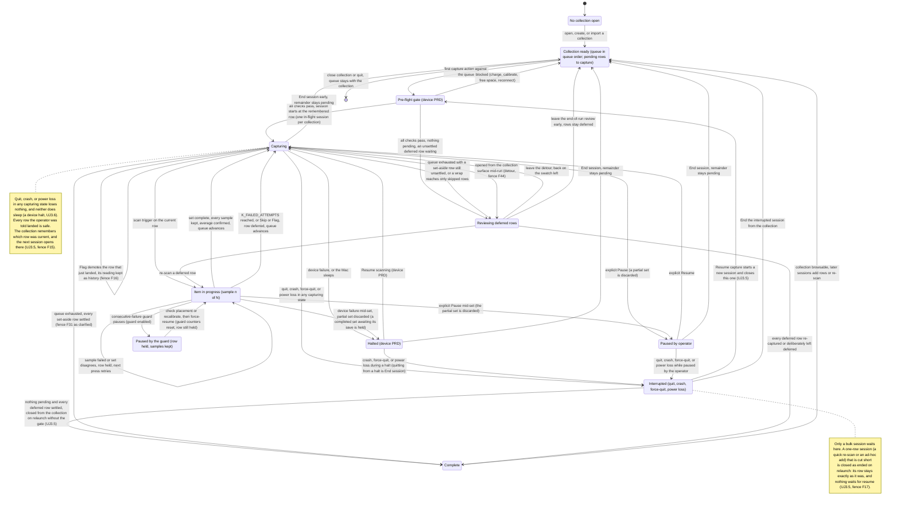
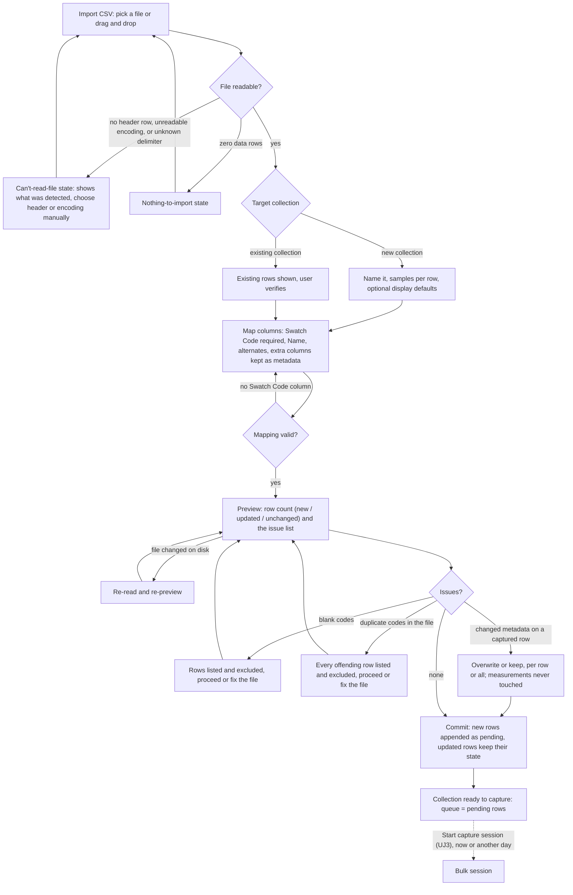
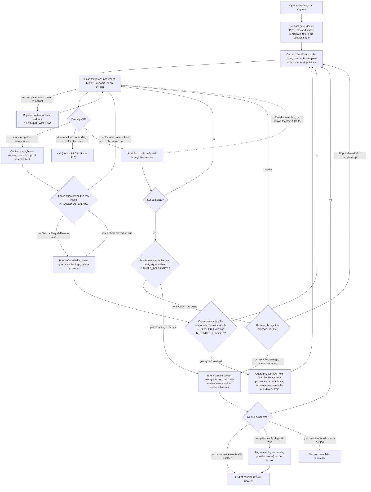
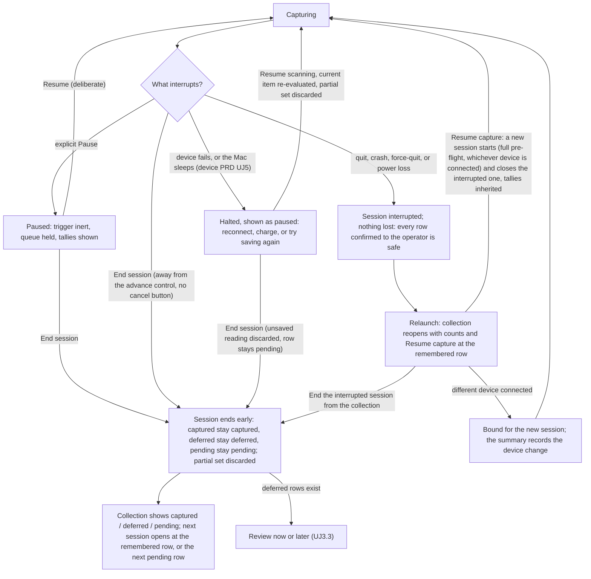
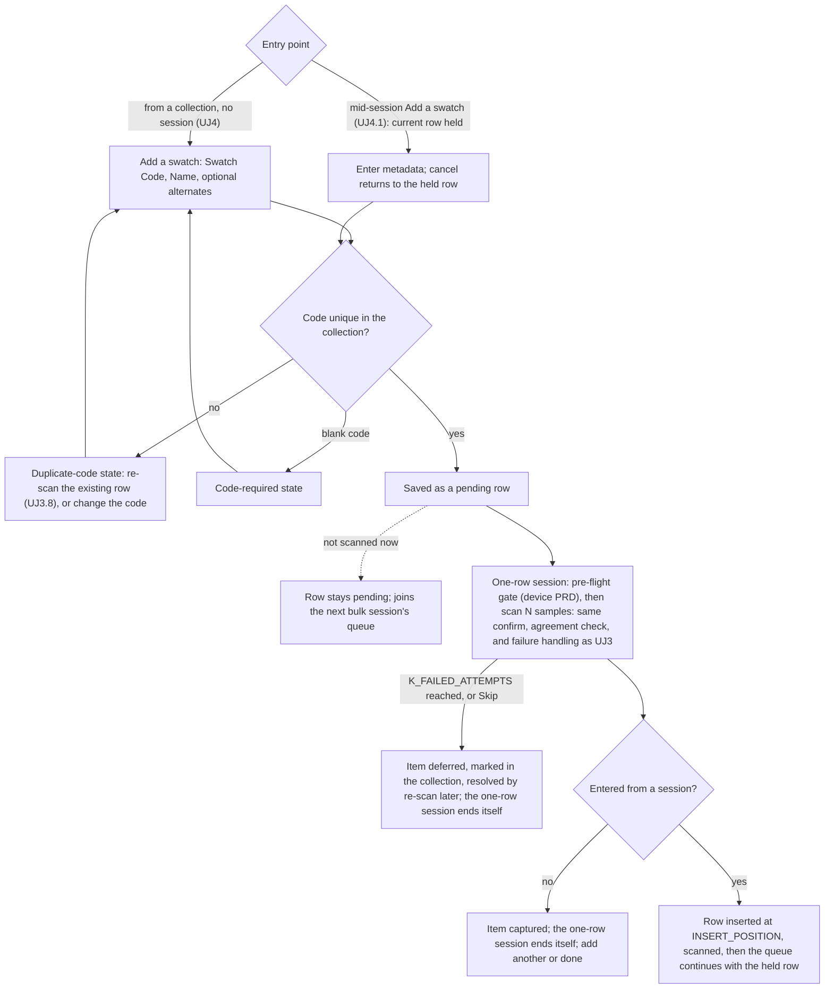

# PRD: Capture Mode

Author: Vinny Pasceri

Status: draft

# Background

SpectroCapture's primary value proposition is quick bulk capture of information using your spectrophotometer. The scope of this PRD covers all the requirements for the use cases, features, and user journeys related to the capture experience.

### Use cases

Defined in the [Vision doc](vision.md#use-cases):

|     | Use case                                 | Persona   | What serves it                                                         |
| --- | ---------------------------------------- | --------- | ---------------------------------------------------------------------- |
| U1  | **Bulk-digitize a predefined inventory** | Cataloger | CSV import with column mapping → queued scan, 1–5 samples/row averaged |
| U2  | **Capture a single new item ad hoc**     | Cataloger | metadata-first single capture into a chosen collection                 |

### Feature list

Defined in the [Vision doc](vision.md#feature-list):

| Pri | Feature                                  | Serves | Notes                                                          |
| --- | ---------------------------------------- | ------ | -------------------------------------------------------------- |
| P0  | CSV inventory import with column mapping | U1     | The inventory-first wedge                                      |
| P0  | Queued bulk scan, 1–5 samples averaged   | U1     | Heads-down; haptic confirm where available; row auto-advance   |
| P0  | Inline scan-failure handling             | U1     | Retry / skip / flag-row for light, battery, temperature errors |
| P1  | Ad-hoc single capture                    | U2     | Metadata-first, into a chosen collection                       |

A note on the third row: battery is not one of the per-scan failures this PRD handles inline. A battery below the operational threshold is a device-level halt ([R5.1](#5-per-scan-failure-and-the-consecutive-failure-guard), [R5.2](#5-per-scan-failure-and-the-consecutive-failure-guard); [device PRD §5](prd-device-management.md#5-mid-session-device-failure)), and the retry / skip / flag path covers light, temperature, sample disagreement, and the operator's own flag.

### Capture workflow

The capture lifecycle end-to-end, as the Cataloger experiences it: a collection becomes a queue of pending rows (by import, [UJ2](#uj-2-full-collection-bootstrap-via-csv-import), or by adding items, [UJ4](#uj-4-capture-a-single-new-item-into-a-collection)); the first capture action runs the device PRD's pre-flight gate ([device PRD UJ2](prd-device-management.md#uj-2-start-acquisition)); the session then runs heads-down, one row at a time, each row a set of 1–5 samples ([UJ3](#uj-3-run-a-bulk-capture-session)); a stop mid-run is either a device-level halt (system sleep included), owned by the device PRD ([device PRD UJ5](prd-device-management.md#uj-5-device-failure-during-a-session)), or a pause or early end owned here ([UJ3.4](#uj-34-pause-and-end-a-session-early)); and a session is complete only when every row is captured or has been deliberately left deferred after the end-of-session review ([UJ3.3](#uj-33-resolve-the-deferred-error-queue-at-session-end)). Two diagrams: the first is the session, the second is a single queue row. The seam between capture and the collection — what the user sees at session end — is deliberately not drawn here; it is the open question [UJ5](#uj-5-session-ends-and-the-collection-is-reviewed-the-seam) exposes for ADR-0004.

```mermaid
stateDiagram-v2
    state "Pending" as Pending
    state "Captured" as Captured
    state "Deferred (set aside for review)" as Deferred

    [*] --> Pending: imported, or added ad hoc
    Pending --> Pending: skip (navigation only, row not attempted, revisited when the queue wraps)
    Pending --> Captured: N samples agree or the operator accepts the average, every sample kept, row confirmed
    Pending --> Deferred: K_FAILED_ATTEMPTS failures, a disagreeing set skipped, Skip after a failed attempt or mid-set, or the operator flagged the row
    Captured --> Deferred: the operator flags the row just captured, its reading kept as history
    Deferred --> Captured: re-scan succeeds (end-of-session review or any later session)
    Deferred --> Deferred: settled (deliberately left; counts as adjudicated)
    Captured --> Captured: re-scan, new canonical value, prior reading kept as version history
```

## User Journeys

States are named here in plain language; the shipping copy for each is in [§12](#12-error--state-copy). Persona is the Cataloger unless the title says otherwise. Citation shorthand: [acq v1](../briefs/acquisition-experience-research-results.md) and [acq v2](../briefs/acquisition-experience-research-results-v2.md) are the two acquisition-experience research passes (v2 supersedes v1 where they conflict); [browsing](../briefs/browsing-a-collection-at-scale-research-results.md) is the collection-browsing research; [SDK audit](../briefs/nix-universal-sdk-audit-findings.md) is the vendor SDK audit; [device PRD](prd-device-management.md) is the locked device-management PRD. These journeys are what the Cataloger does and sees; the rules behind them — what holds, what is discarded, what is counted, and every named constant — live in [Requirements](#requirements).

Vocabulary ([AGENTS.md §8](../../AGENTS.md#8-vocabulary), [acq v2 §1](../briefs/acquisition-experience-research-results-v2.md#1-queue-model-and-task-framing)):

- **Pending** — a queue row with no confirmed reading yet.
- **Captured** — a row with a canonical value.
- **Deferred** — a row set aside for review because a reading failed, the samples disagreed, or the operator flagged it; the dead-letter state ([§8](#8-deferred-row-review-and-corrections)).
- **Settled** — a set-aside row the operator deliberately left, one at a time or all at once, at the review. A settled row counts as dealt with: it does not open the review again and it does not stop a collection being finished, and it can still be scanned again by choice (fence F31 as clarified, [§8](#8-deferred-row-review-and-corrections)). A set-aside row that has not had that decision is **unsettled**.
- **Skip** — navigation past a pending row without attempting it. Not a state: the row stays pending ([§6](#6-queue-navigation-and-reordering)).
- **Session** — one collection's run of capture, with a status and an elapsed time; a **one-row session** is its single-item form ([§3](#3-the-capture-session)).
- **A live bulk session** — a bulk session on the collection that is under way and neither paused nor interrupted, the time its set-aside review is open counted as part of that run. Held is not under way: a session the guard has paused, and one waiting on the instrument, are no more live than one the operator paused, and a pause lifted for a single swatch is still a pause here. A one-row session is never one, however far along it is. Whether a live bulk session is on the collection is the one thing that decides how the set-aside list opens, and it is decided once — when the list opens — and holds until it closes, so nothing done while the operator is in there changes which of the two they are in ([§8](#8-deferred-row-review-and-corrections), fence F42 as clarified five times). It is a different idea from the elapsed capture time of [§3](#3-the-capture-session), which leaves time spent in the set-aside list out for a reason of its own: that number is there to say how much work was done, not which session is running.
- **The remembered row** — the row the collection last had the operator on; every session opens there ([§3](#3-the-capture-session), fence F15).

### Cluster 1 — Set up a place to capture into

### UJ 1. Create a collection

1. I choose to create a collection.
2. I name it.
  - If that name is already in use → the duplicate-collection-name state ([copy, §12](#12-error--state-copy))
3. I accept or change the samples-per-row setting, which arrives pre-filled at 3, and the scan mode, which arrives pre-filled at M1.
4. I optionally set the collection's display defaults — illuminant and observer.
5. I save. The collection is ready, with an empty queue.
6. From here I import an inventory ([UJ2](#uj-2-full-collection-bootstrap-via-csv-import)) or add items one at a time ([UJ4](#uj-4-capture-a-single-new-item-into-a-collection)).
  - If I start a capture session with nothing pending and nothing deferred → the nothing-to-capture state ([copy, §12](#12-error--state-copy))

UJ1.1 was folded into UJ1 when Library was dropped (fence F1).

### UJ 1.2 Manage collections — rename, delete

> Scope boundary — handed to Collection Mode. Per the [product README](README.md#4-collection-mode), Collection Mode owns editing surfaces, selection, and bulk operations; rename and delete are collection management, not capture. The steps below are kept verbatim so nothing the owner wrote is lost, and so the Collection Mode PRD inherits them with the two failure branches this pass adds. Ownership is decided by fence F3 ([fences](prd-capture-mode-fences.md)); they generate no requirement rows here beyond the inherited-obligation row [R1.8](#1-collections).

**Rename a collection**

1. I select a collection and choose to rename it.
2. I give it a new name and save.
  - If another collection already uses that name → the duplicate-collection-name state ([copy, §12](#12-error--state-copy)); the rename does not apply

**Delete a collection**

1. I select a collection and choose to delete it.
2. I am warned that the collection and everything in it will be deleted.
  - If the collection has captured readings → the delete-with-captured-readings warning, which names the count and offers an export first (inherited obligation for the Collection Mode PRD)
  - If the collection has an active or interrupted session → the session-in-flight state; the session must end first (inherited obligation for the Collection Mode PRD)
3. I confirm, and the collection and its data are deleted.

### Cluster 2 — Import an inventory

### UJ 2. Full collection bootstrap via CSV import

1. I choose to import a collection from a CSV.
2. I pick the file, or drag it in.
3. The app shows me what it found: the header row and the row count.
  - If there is no header row → the no-header-row state ([copy, §12](#12-error--state-copy)); I name the columns or pick the header row myself
  - If the file cannot be read → the unreadable-file state ([copy, §12](#12-error--state-copy)); nothing is imported
  - If the file has no data rows → the nothing-to-import state ([copy, §12](#12-error--state-copy))
  - If some rows have the wrong number of columns → the excluded-rows notice ([copy, §12](#12-error--state-copy))
4. I choose the target: a new collection, or an existing one (→ [UJ2.1](#uj-21-import-additional-rows-into-an-existing-collection)).
5. I name the new collection and set samples-per-row and, optionally, the display defaults, as in [UJ1](#uj-1-create-a-collection).
6. I map the columns ([UJ2.2](#uj-22-mapping-metadata-fields)) and save the mapping.
  - If nothing is mapped to Swatch Code → the mapping-incomplete state ([copy, §12](#12-error--state-copy))
7. I review the preview: how many rows will land, and every issue found.
  - If some rows have a blank Swatch Code → the blank-codes-excluded state ([copy, §12](#12-error--state-copy))
  - If a Swatch Code repeats inside the file → the duplicate-codes-in-file state ([copy, §12](#12-error--state-copy))
  - If the file changed on disk before I commit → the file-changed state ([copy, §12](#12-error--state-copy))
  - If the file is gone when I commit → the unreadable-file state ([copy, §12](#12-error--state-copy))
8. I commit. Every row lands pending, in file order.
9. The collection is ready to capture. I start now ([UJ3](#uj-3-run-a-bulk-capture-session)), or I close the app and start tomorrow.

### UJ 2.1 Import additional rows into an existing collection

1. I choose to import, pick the file, and choose an existing collection as the target.
2. The app tells me the collection already has rows and asks me to confirm.
3. I map the columns; a mapping remembered from a file with the same headers arrives pre-filled ([UJ2.2](#uj-22-mapping-metadata-fields)).
4. I review the preview: how many rows are new, how many change, how many are unchanged, and how many rows in the collection this file does not mention.
  - If a row that already has a reading has different metadata in the file → the changed-metadata-on-captured-row choice ([copy, §12](#12-error--state-copy)); my measurements are never touched either way
  - If a code in the file matches more than one row → the ambiguous-code state ([copy, §12](#12-error--state-copy)); that row is neither created nor updated
  - Blank codes, duplicate codes inside the file, no data rows, an unreadable file: as in [UJ2](#uj-2-full-collection-bootstrap-via-csv-import)
5. I commit. New rows are appended as pending; rows already in the collection keep their state and their measurements; rows the file does not mention are left alone.
6. The collection is ready to capture, and my next session opens where I left off (fence F15).

### UJ 2.2 Mapping metadata fields

1. I map Swatch Code — required. It is the match key for a re-import and the way I find a row later ([§2](#2-inventory-import), fence F11).
  - If that column is not unique within the file → the duplicate-codes-in-file state ([copy, §12](#12-error--state-copy))
2. I optionally map Swatch Name, Swatch Alternate Code, and Swatch Alternate Name.
3. Any column I do not map comes in as extra metadata I can see in the collection.
  - If a column has no header → the unnamed-column notice ([copy, §12](#12-error--state-copy)); it arrives under a generated name I can change later
4. I save the mapping, and the app offers it again for the next file with the same headers.

The chart below covers [UJ2](#uj-2-full-collection-bootstrap-via-csv-import), [UJ2.1](#uj-21-import-additional-rows-into-an-existing-collection), and [UJ2.2](#uj-22-mapping-metadata-fields) together — the three-way count and the changed-metadata choice are UJ2.1's branches; the mapping box is UJ2.2.

### Cluster 3 — The bulk session (the thesis)

### UJ 3. Run a bulk capture session

The product thesis: import first, then scan heads-down with no per-item metadata entry between scans ([AGENTS.md §4](../../AGENTS.md#4-non-negotiables); vision [J2](vision.md#j2-the-bulk-session-cataloger)). The target pace is the instrument's scan cycle, not the app.

1. I start a capture session on my collection. It opens at the row I was last on ([§3](#3-the-capture-session), fence F15).
  - If nothing is pending, and every swatch I set aside I already left set aside for good → the nothing-to-capture state ([copy, §12](#12-error--state-copy)); the review does not open again (fence F31 as clarified)
  - If only set-aside swatches are left and any of them is still unsettled → the session opens straight into the review ([UJ3.3](#uj-33-resolve-the-deferred-error-queue-at-session-end))
  - If a session for this collection is already running → the app takes me back to it
  - If another collection's session is active or paused → the instrument-held state ([copy, §12](#12-error--state-copy))
2. The pre-flight gate runs — battery, calibration, authorization, storage, and the muted-audio advisory ([device PRD UJ2](prd-device-management.md#uj-2-start-acquisition)).
  - If a check blocks → the device PRD's blocked state; my session has not started and my queue is untouched
  - If the Demo Device is connected → the simulated indicator is on the capture surface for the whole session ([UJ3.9](#uj-39-capture-with-the-demo-device-contributor))
3. The session starts. I see the current row's code and name, where I am in the queue, the sample counter, my tallies, and the last few rows I captured.
4. I put the instrument on the swatch and trigger a scan.
  - If I press again while a scan is running → the press is rejected with a distinct non-visual cue and nothing is lost ([§4](#4-the-scan-loop))
5. The instrument measures.
  - If it refuses the reading — light leaked in, or it is out of temperature range → [UJ3.1](#uj-31-a-scan-fails-mid-queue)
  - If the device disconnects, goes quiet, reports drift, runs low on battery, or the save fails → the device PRD's halt ([UJ3.6](#uj-36-device-fails-mid-session))
6. I hear and feel "sample 1 of N" without looking up.
7. I lift, reposition slightly, and press again until the set is done. I touch nothing on the Mac in between.
  - If a sample looked wrong to me → [UJ3.2](#uj-32-undo-or-redo-the-current-item)
8. The set is complete and the app checks that my samples agree.
  - If they disagree → the set-disagreement choice ([copy, §12](#12-error--state-copy)): re-take, accept the average, or set the row aside
9. Every reading is saved and the average worked out from them, and only then do I get the row-success confirmation. The queue advances on its own and the row joins my recents.
  - If the save fails → the device PRD's halt; my completed set is held for "Try saving again" ([UJ3.6](#uj-36-device-fails-mid-session))
10. Steps 4–9 repeat, row after row. I never type, never confirm a dialog, and never look at the screen to know the last row landed.
  - If the swatch in my hand is not the current row → [UJ3.7](#uj-37-jump-to-a-different-row) or [UJ3.10](#uj-310-reorder-the-queue)
  - If the book has an item the file missed → [UJ4.1](#uj-41-insert-an-unplanned-item-mid-session)
  - If I need to stop → [UJ3.4](#uj-34-pause-and-end-a-session-early)
  - If the app quits, crashes, is force-quit, or the Mac loses power → [UJ3.5](#uj-35-resume-an-interrupted-session)
  - If the Mac sleeps → the device PRD's halt, not an interruption ([UJ3.6](#uj-36-device-fails-mid-session), fence F14)
11. The queue is exhausted.
  - If any swatch I set aside is still unsettled → the end-of-session review ([UJ3.3](#uj-33-resolve-the-deferred-error-queue-at-session-end)); the session is not complete yet
  - If every swatch I set aside I already left set aside for good → there is nothing left to settle and the session is complete (fence F31 as clarified)
  - If the queue wrapped onto rows I only skipped → the wrap-exhausted choice ([copy, §12](#12-error--state-copy))
12. Session complete. The summary shows my counts, my elapsed time, and the way to the collection ([UJ5](#uj-5-session-ends-and-the-collection-is-reviewed-the-seam)).

### UJ 3.1 A scan fails mid-queue

1. Mid-set, a sample fails — light leaked under the aperture, or the instrument is out of temperature range.
2. A caution reaches me through two senses and names the cause ([copy, §12](#12-error--state-copy)).
3. The row holds. My good samples are kept and my next trigger press retries the same row, so a reflexive re-press can never land a reading on the next swatch (fence F6).
  - If the retries keep failing → the row is set aside for me after K_FAILED_ATTEMPTS, I get a distinct moved-on cue ([copy, §12](#12-error--state-copy)), and the queue advances once
  - If I would rather move on now → Skip sets the row aside with the samples I did take and advances once
  - If the row that just landed was wrong — wrong swatch, a smudge → Flag demotes it and keeps its reading as history (fences F9, F16)
  - If I press Flag right after a moved-on cue → the flag-has-nothing-to-demote notice ([copy, §12](#12-error--state-copy)); that row is already waiting in the review
  - If the swatch is missing or damaged → Flag sets the current row aside with that cause and the queue advances
4. If the instrument keeps failing, the guard pauses the session and offers me a placement check or a recalibration ([copy, §12](#12-error--state-copy)); my row stays under the instrument with its samples ([§5](#5-per-scan-failure-and-the-consecutive-failure-guard), fence F18).
5. Capture continues. Everything set aside is waiting in the end-of-session review ([UJ3.3](#uj-33-resolve-the-deferred-error-queue-at-session-end)); nothing is deleted and nothing needs a decision now.

### UJ 3.2 Undo or redo the current item

1. Mid-set, I realise the instrument slipped or the wrong swatch was under it.
2. "Re-take sample" throws away the last sample only; my next press replaces it.
3. "Restart item" throws away all of this item's samples; the row stays current.
4. I carry on from [UJ3](#uj-3-run-a-bulk-capture-session).
  - If I press either while a scan is running → the press is rejected and nothing is discarded ([§4](#4-the-scan-loop))
  - If the row is already captured and confirmed → the re-take-unavailable notice ([copy, §12](#12-error--state-copy)); the correction is a re-scan ([UJ3.8](#uj-38-re-scan-an-already-captured-row))
  - If the queue has just moved on from a swatch that never landed — it was set aside for me, or I passed over it — and I have not scanned the new one yet → the nothing-to-undo notice ([copy, §12](#12-error--state-copy)); neither swatch changes, and the one I left is either waiting for me at the end or still waiting in the queue
  - If a device halt cuts my set short → the item restarts from its first sample when I resume; there is nothing to undo
The chart below covers [UJ3](#uj-3-run-a-bulk-capture-session), [UJ3.1](#uj-31-a-scan-fails-mid-queue), and [UJ3.2](#uj-32-undo-or-redo-the-current-item) together — the caution branches are UJ3.1; the dashed edge is UJ3.2.

### UJ 3.3 Resolve the deferred-error queue at session end

1. The queue is exhausted with a swatch I set aside still unsettled, or I choose "Review the set-aside swatches", or I started a session with only unsettled set-aside swatches waiting. I see every one with its code, name, why it was set aside, how many attempts were made, and how many samples it kept.
2. I select a row, put the instrument on it, and take a full set exactly as in [UJ3](#uj-3-run-a-bulk-capture-session). I am never shown the earlier reading first.
  - If a sample fails → the row holds and my next press retries, as in [UJ3.1](#uj-31-a-scan-fails-mid-queue)
  - If the samples disagree again → the set-disagreement choice ([copy, §12](#12-error--state-copy))
  - If the same cause repeats across rows → the guard pauses here too ([copy, §12](#12-error--state-copy))
3. Or I choose "Leave it set aside" with a note — it is missing, damaged, or not worth the time today ([copy, §12](#12-error--state-copy)) — or "Leave them all set aside" with one note for everything that is left (fence F31). A swatch I leave set aside is settled: it counts as dealt with, so it does not open the review again, and I can still scan it later if I change my mind (fence F31 as clarified).
4. When every row is captured or deliberately left, the session is complete.
  - If I came here with nothing left waiting in the queue, or from the stop-for-now summary after I'd already chosen to stop, and I leave before finishing → the session ends early ([UJ3.4](#uj-34-pause-and-end-a-session-early)); the rest stay deferred and are marked in my collection
  - If I came here as a detour, with swatches still waiting and no stop asked for → leaving puts me back on the swatch I was on, at its first sample, and my session carries on (fence F44 as clarified)
  - If I opened the list from my collection with nothing running → what I decide here just settles those swatches; a run I'd paused stays paused, one I'd already ended stays ended, and one that was cut short is closed as complete once nothing is left waiting and nothing is set aside undecided

### UJ 3.4 Pause and end a session early

1. Mid-queue I pause. The trigger goes inert; a press only shows me the paused state ([copy, §12](#12-error--state-copy)).
2. Resume is a deliberate action and puts me back on my row at its first sample.
  - If the app quits, crashes, is force-quit, or loses power while paused → the session is interrupted exactly as it would be while capturing ([UJ3.5](#uj-35-resume-an-interrupted-session))
3. To stop for the day I choose "End session" — deliberately away from anything that advances the queue, and there is no cancel or abandon button.
4. The end-early summary tells me plainly what happens to everything ([copy, §12](#12-error--state-copy)) and I confirm.
  - If rows are deferred → the summary offers the review now or later ([UJ3.3](#uj-33-resolve-the-deferred-error-queue-at-session-end))
  - If I end from a device halt → the device PRD's End-session warning applies first ([UJ3.6](#uj-36-device-fails-mid-session))
5. The session ends and my collection shows the counts, so I can see the state of the work without opening capture. What I see next is the seam ([UJ5](#uj-5-session-ends-and-the-collection-is-reviewed-the-seam)).

### UJ 3.5 Resume an interrupted session

1. Mid-queue the app quits, crashes, is force-quit, or the Mac loses power.
2. Nothing I was told landed is lost. The item I was in the middle of restarts from its first sample.
3. On relaunch my collection reopens with its counts and "Resume capture" at the row I was on ([copy, §12](#12-error--state-copy)).
  - If the app cannot remember which collection I had open → I open it; it carries its own counts and the same offer
  - If the file holding the collection has moved → the collection-unavailable state ([copy, §12](#12-error--state-copy))
  - If a device halt was open when the app died → it is closed as unresolved, so I see the interrupted session and not a stale halt ([device PRD §5](prd-device-management.md#5-mid-session-device-failure))
  - If nothing is pending and every set-aside swatch is settled → there is nothing to resume; the session is closed as complete and I see its summary
  - If what was cut short was a one-row re-scan or ad-hoc add → it is simply closed; its row is exactly as it was and nothing waits for me (fence F17)
4. "Resume capture" starts a fresh session at that row: the full pre-flight gate runs and whichever instrument is connected is used. My tallies and elapsed time carry over, so the summary reads as one run (fence F14).
  - If a different instrument is connected → it is used, and the summary records the change
  - If nothing is pending but a set-aside swatch is still unsettled → the new session opens straight into the review ([UJ3.3](#uj-33-resolve-the-deferred-error-queue-at-session-end))
  - If I do not want to continue → I can end the interrupted session from my collection without opening capture
  - If I only want one re-scan or one added item → that runs on its own and leaves the interrupted session waiting (fence F17)
5. Everything I set aside before the interruption is still in the review; nothing was re-inserted or duplicated.

### UJ 3.6 Device fails mid-session

> Scope boundary: device-level failure — disconnect, not responding, low battery, save failure — is detect → alert → reconnect → resume in the [device PRD UJ5](prd-device-management.md#uj-5-device-failure-during-a-session) and [§5](prd-device-management.md#5-mid-session-device-failure). This journey states only what capture does around that halt.

1. Mid-queue the device fails, or the Mac sleeps. Capture halts immediately and the alert reaches me through two senses ([device PRD UJ5](prd-device-management.md#uj-5-device-failure-during-a-session)).
  - If I press the trigger during the halt → nothing is asked of the instrument; the halt state surfaces instead
2. The capture surface shows the halt as paused, with the device PRD's recovery path. My current row, tallies, and recents stay visible.
3. When the cause clears, "Resume scanning" puts me back on my row. A part-finished set restarts from its first sample.
4. Capture continues.
  - If I end the session from the halt, or quit from it → the device PRD's End-session warning, then the remainder is handled as in [UJ3.4](#uj-34-pause-and-end-a-session-early)
  - If the halt was a failed save and "Try saving again" works → my held set is saved and the row is captured, with no duplicate
The chart below covers [UJ3.4](#uj-34-pause-and-end-a-session-early), [UJ3.5](#uj-35-resume-an-interrupted-session), and [UJ3.6](#uj-36-device-fails-mid-session) together — the halt branch is the device PRD's and is drawn only to its edges; the interruption branch is UJ3.5.

### UJ 3.7 Jump to a different row

1. Mid-queue, the swatch in my hand is not the current row.
2. I open the find field from the keyboard and type the start of the code, or part of the name — either of the swatch's own, or either of its alternates (fence F21).
3. I select a row; it becomes my current row at its first sample, and the row I left stays pending. Queue order is unchanged.
4. Capture continues. When the queue reaches the end it wraps to rows still pending, so anything I passed comes back to me.
  - If the code matches a row I already captured → the re-scan-offered state ([copy, §12](#12-error--state-copy))
  - If it matches a row I set aside → that row becomes current and re-scanning it resolves it
  - If nothing matches → the no-matching-row state ([copy, §12](#12-error--state-copy)), offering "Add a swatch"
  - If a wrap finds only rows I skipped without trying → the wrap-exhausted choice ([copy, §12](#12-error--state-copy))
  - If I just want to pass over this row for now → Skip advances once and leaves it pending for the wrap

### UJ 3.8 Re-scan an already-captured row

1. From the capture surface mid-session, or from an item in my collection with no session open, I find the row by its code.
  - If another collection's session is active or paused → the instrument-held state ([copy, §12](#12-error--state-copy))
  - If this collection's bulk session is paused → the re-scan borrows it for this one row and hands the queue back, still paused
  - If this collection's bulk session is interrupted → the re-scan runs on its own and leaves that session waiting (fence F17)
2. The app tells me the row is captured and offers "Re-scan". I am not shown its current value ([copy, §12](#12-error--state-copy)).
3. I take a full set exactly as in [UJ3](#uj-3-run-a-bulk-capture-session), with the same failure handling ([UJ3.1](#uj-31-a-scan-fails-mid-queue)).
4. The new set becomes the row's value and the reading I had is kept as history — never overwritten, never deleted ([AGENTS.md §4](../../AGENTS.md#4-non-negotiables)). The confirmation says so.
  - If samples keep failing, or I skip → the re-scan is abandoned; the row keeps the value it had and the attempt is kept in its history
  - If the new samples disagree → the set-disagreement choice ([copy, §12](#12-error--state-copy)); abandoning never changes the value I already had
  - If I meant "does this still match?" rather than "this one is wrong" → the QC-or-correction choice ([copy, §12](#12-error--state-copy)); QC is the QC & Comparison PRD's journey (vision [J3](vision.md#j3-the-qc-pass-re-checker))
5. If I did this mid-session, the queue puts me back on the row I left, at its first sample, and carries on from there.

### UJ 3.9 Capture with the Demo Device (Contributor)

1. With no instrument and no license, I choose "Demo Device (simulated — no instrument)" ([device PRD UJ1.2](prd-device-management.md#uj-12-first-run-with-no-hardware-contributor)).
2. I import a sample inventory and start a session. Everything looks and behaves as it does with a real instrument, apart from a short list of hardware-only differences, with a simulated indicator always on screen and every reading permanently marked simulated ([device PRD §6](prd-device-management.md#6-mock-device-layer)).
3. I trigger scans on screen or from the keyboard, at the real instrument's pace.
4. I make it fail — light leakage, then out-of-range temperature — and walk [UJ3.1](#uj-31-a-scan-fails-mid-queue) end to end: the caution, hold and retry, Skip and Flag, the automatic set-aside with its moved-on cue, the guard's pause, and the review ([§11](#11-demo-device-and-verifiability) sequences the guard's two modes).
  - If a live per-scan error has no simulated twin → that is a build failure under the device PRD's parity gate, not a gap this journey can reach
5. I walk the halt and the interruption: fail a save, drop the connection, resume, and take a row; quit mid-queue and relaunch to "Resume capture"; then force-quit during a halt and relaunch to find the session waiting. Each time my counts are exactly what they were, I land on my row, and no row appears twice.
6. I open the collection: the simulated-readings banner is showing (inherited obligation for the Collection Mode PRD).

### UJ 3.10 Reorder the queue

1. Before a session, from my collection, I sort the pending rows by any column or drag them into the order I want. That is the queue order, and browsing under a different sort never changes it.
2. During a session, a keyboard action opens the queue list. My current item is held, not advanced, and keeps its samples.
3. I drag a pending row somewhere else, or apply a sort.
4. The new order is saved with the collection, and a resumed session keeps it.
5. Capture continues on the held row, and the queue wraps in the new order.
  - If I drag a row I already captured or set aside → the reorder-refused state ([copy, §12](#12-error--state-copy)), offering re-scan or the review
  - If a re-import brings new rows → they are appended after my manual order
  - If I apply a sort over a manual order → the sort-over-manual-order confirm ([copy, §12](#12-error--state-copy))

### Cluster 4 — Ad-hoc capture

### UJ 4. Capture a single new item into a collection

1. I choose a collection and choose to add a new swatch.
2. I enter Swatch Code and Swatch Name, and optionally the alternates.
  - If that code is already in the collection → the duplicate-code state ([copy, §12](#12-error--state-copy)), offering a re-scan of the existing row or a different code
  - If the code is blank → the code-required state ([copy, §12](#12-error--state-copy))
3. I save. The item is a pending row in my collection.
4. I choose to acquire from the device, which runs the pre-flight gate as any capture does ([device PRD UJ2](prd-device-management.md#uj-2-start-acquisition)).
  - If another collection's session is active or paused → the instrument-held state ([copy, §12](#12-error--state-copy))
5. I take the collection's number of samples, with the same confirmation, agreement check, and failure handling as [UJ3](#uj-3-run-a-bulk-capture-session).
  - If samples keep failing, or I skip → the item is set aside, marked in my collection, and resolved by a re-scan later
  - If the device halts and I end from the halt → the device PRD's End-session warning; the item stays pending
6. Everything is saved and confirmed, the item is captured, and the one-row session closes itself.
7. I add another, or I am done — there is no queue to continue.
  - If I saved the metadata but never scanned → the row stays pending and joins my next bulk session
  - If the item looked wrong right after it landed → there is no flag-after-landing window here; the correction is a re-scan or a Flag from my collection ([UJ3.8](#uj-38-re-scan-an-already-captured-row), fence F9)

### UJ 4.1 Insert an unplanned item mid-session

1. Mid-queue I choose "Add a swatch". My current row is held.
2. I enter the code and name, and optionally the alternates — the one moment in a bulk session where I type.
  - If the code already exists → the duplicate-code state ([copy, §12](#12-error--state-copy))
  - If I cancel → the add-item-cancelled state ([copy, §12](#12-error--state-copy)); the queue puts me back on the held row and nothing was created
3. I save. The new row goes into the queue at INSERT_POSITION ([§9](#9-ad-hoc-capture-and-one-row-sessions), OQ 11) and becomes my current item.
4. I scan it exactly as I would any other row.
5. When it is captured the queue puts me back on the row I held, and then carries on in queue order, so nothing ahead or behind is skipped.
The chart below covers [UJ4](#uj-4-capture-a-single-new-item-into-a-collection) and [UJ4.1](#uj-41-insert-an-unplanned-item-mid-session) together — the two entry points converge on the same metadata form and scan; the dashed edge is the metadata-saved-but-not-scanned branch.

### Cluster 5 — The seam (made visible, not decided)

### UJ 5. Session ends and the collection is reviewed (the seam)

> This is the open question this PRD must settle for ADR-0004 ([product README](README.md#prd--adr-gates); [AGENTS.md §3](../../AGENTS.md#3-decided--recommended--open)). The two research passes disagree on the navigation model and the v2 pass says explicitly to re-open it before the ADR is written. The journey is written twice so the fork is visible; it does not pick, and [§10](#10-the-seam-capture-to-collection) holds the rows that must be true under either reading.

Common to both readings: each reading lands in the real collection the moment it is saved, an always-visible recents strip makes the just-captured item findable, and only the adjudication of deferred rows waits for session end ([§10](#10-the-seam-capture-to-collection)). The fork is about navigation and what I see, not about when my data lands.

**Reading A — capture is a modal takeover; hand-off at session end** ([acq v1 §11](../briefs/acquisition-experience-research-results.md); cited no shipped product)

1. "Start capture session" replaces my collection with a full-window capture surface; I cannot see the collection during the session.
2. The session runs ([UJ3](#uj-3-run-a-bulk-capture-session)); the recents strip is my only view of what has landed.
3. On complete or "End session" the capture surface is dismissed and my collection comes back, refreshed, with everything in place.
4. I browse, sort, open the rows that were set aside, and export.
  - If the app crashes mid-session → I land in my collection on relaunch, see the counts, and choose "Resume capture" to re-enter the takeover ([UJ3.5](#uj-35-resume-an-interrupted-session))

**Reading B — capture is a state of the live collection** ([acq v2 §11 Q11.6](../briefs/acquisition-experience-research-results-v2.md#11-the-seam--capture-to-collection); Lightroom Classic, Capture One, Dynamics 365)

1. "Start capture session" puts my collection into capture: the same window, the same rows, with the capture surface attached and at least two unmistakable mode indicators showing.
2. The session runs ([UJ3](#uj-3-run-a-bulk-capture-session)); each row appears in the collection as it lands, and the view follows the newest until I pin it.
3. On complete or "End session" the capture surface detaches; I am already looking at my collection, which has not changed shape.
4. I browse, sort, open the rows that were set aside, and export — on the same surface I was already on.
  - If the app crashes mid-session → my collection opens with the counts and "Resume capture"; re-entering capture re-attaches the surface ([UJ3.5](#uj-35-resume-an-interrupted-session))
  - If I click into the collection mid-session → capture shortcuts are inert off the capture surface, the mode indicators stay visible, and my session is not ended by navigation
**User-visible differences**

| Question | Reading A — modal takeover | Reading B — state of the collection |
| :--- | :--- | :--- |
| Where does the just-captured item appear during the session? | In the recents strip only; the collection is hidden | In the collection itself, live, plus the recents strip; auto-follow newest with a pin |
| How do you get back to browsing? | End the session (or complete it); the takeover is dismissed | You never left; the capture surface detaches |
| What does "End session" mean? | Leave the capture surface and return to the collection | Detach capture from the collection you are looking at |
| Mode indicators | The takeover itself is the indicator | At least two redundant indicators, required because the same view serves both modes |
| What does a crash mid-session look like? | Relaunch lands in the collection with counts and "Resume capture" | Same — the data behaviour is identical; only the surface differs |
| Mode-slip risk | Low — the whole keyboard belongs to capture | Higher — mitigated by focus-scoped shortcuts and no cancel button |
| "Two apps bolted together" risk | Higher — two places, one data model | Lower — one place, one vocabulary, one set of row states |
| Mid-session reorder and the queue list ([UJ3.10](#uj-310-reorder-the-queue)) | A second list inside the takeover | The collection's own list |

Under either reading the row states, the identifier vocabulary, and the counts are the same on both surfaces — the data-model finding ([acq v2 §11 Q11.6](../briefs/acquisition-experience-research-results-v2.md#11-the-seam--capture-to-collection)) — and it holds whichever navigation model the ADR picks. What decides it is a Demo Device prototype of each reading measured against the observables in [R10.7](#10-the-seam-capture-to-collection), then the owner's product call, written as ADR-0004 (OQ 8). The research default, for the owner to confirm or overrule, is Reading B — the only reading with shipped precedent. Recorded as input: the cross-model product lens preferred Reading A; mid-session reordering is cheap under Reading B and costs a second list inside the takeover under Reading A; and [UJ4.1](#uj-41-insert-an-unplanned-item-mid-session)'s typed metadata sits on the capture surface (fence F13).

## Requirements

### Legend

**Priority**

Priority is build order within v1, not a cut line — everything in this document ships in v1: P0 is the first build phase, P1 the second, P2 last. Owner-confirmed split: fence F24. P0 is the bulk critical path — collections, import, the session, the scan loop, per-scan failure and the guard, queue navigation by find and skip, pause, end, interruption and resume, the deferred-row review, the Demo Device rows, the seam rows ([§10](#10-the-seam-capture-to-collection), fence F25), and the version-history record shape ([R8.13](#8-deferred-row-review-and-corrections)). P1 is the correction path — the re-scan rows in [§8](#8-deferred-row-review-and-corrections) — ad-hoc capture and one-row sessions ([§9](#9-ad-hoc-capture-and-one-row-sessions)), and the reordering rows in [§6](#6-queue-navigation-and-reordering).

Provisional constants: every TBD-on-spike constant is a named provisional constant carrying its candidate value and its [Open Questions](#open-questions) id; mechanisms build against these constants, and no provisional constant ships in a release without its OQ resolved. A dogfood build is not a release for that rule (fence F23) — that is what lets the first dogfood sessions run on candidate values and produce the data those questions need.

**Status**

- ⌛️ Ready for Alignment - Waiting for cross-functional team to align on requirements
- ✋ Needs Discussion - Cross-functional team needs to discuss with PM
- 🤝 Aligned - Cross-functional team aligned on the requirement
- 🦺 In Progress - Implementation in flight (Optional status)
- ✅ Completed - Implementation completed & merged. PR # & link added in the "Commit PR" column.
- ✂️ Deferred - Deferred from current release

### Traceability

Three row-ID families, one per dispositionable table, all under one rule: an ID is assigned once and never renumbered — a row that is cut or deferred keeps its ID rather than freeing it for reuse.

- Every requirement row in [§1](#1-collections) through [§11](#11-demo-device-and-verifiability) carries an ID of the form `R<section>.<n>` — for example `R4.7`.
- Every state row in [§12](#12-error--state-copy) carries an ID of the form `E<n>`.
- Every metric row in [Success Metrics](#success-metrics) carries an ID of the form `M<n>`.

The Commit PR column is where a row maps onto the work that lands it. Owner decisions F1–F45 are recorded in the [fence file](prd-capture-mode-fences.md), with their amendments and clarifications; the rows do not cite them and no row re-argues one. Which rows carry each fence:

- **F1** no Library — R1.1. **F2** measurement-settings scope — R1.3, R1.5, R1.10, R4.6. **F3** rename and delete are Collection Mode's — R1.8. **F4** the import target is chosen in the app — R2.5. **F5** jump by code plus manual reordering — R6.7, R6.8, R6.11.
- **F6** a per-scan failure holds the row, as amended — R5.3, R5.4, R5.13, R8.4. **F7** drift and no-reading are device halts, no per-scan timeout — R5.1, R5.2. **F8** N_CONSEC_DRIFT dropped — R5.10. **F9** "Flag" moves a captured row to set aside — R5.6, R5.8, R9.9. **F10** accept the average with the spread recorded — R1.4, R4.10, R4.11, R8.10.
- **F11** Swatch Code normalisation — R1.2, R2.7, R2.8, R6.1, R9.2. **F12** the session is a named entity, the binding released at quit — R3.1, R3.2, R3.3, R3.11, R3.13, R7.12. **F13** the mid-session insert stays in v1 — R9.10, R9.11. **F14** a resume is a new session and the old one is closed — R3.2, R3.4, R7.12, R7.18. **F15** the collection remembers the last current row — R3.1, R3.6, R3.7, R3.8, R7.5.
- **F16** "Flag" targets the row that just landed — R4.21, R4.25, R5.6, R5.7, R5.8. **F17** a quick re-scan never wakes an interrupted session — R3.11, R3.13, R7.13, R9.7, and the state-by-exit table ([§8](#8-deferred-row-review-and-corrections)). **F18** the guard counts only instrument-caused deferrals — R5.10. **F19** entering the review discards the part-finished set — R7.1 and the state-by-exit table. **F20** the review's surface and the summary's form follow the seam — R4.15, R7.15, R8.1.
- **F21** find matches code, name, and both alternates — R6.1. **F22** capture owns the queue order — R6.7, R6.8. **F23** the guard is record-only in dogfood — R5.12. **F24** the priority split — the Pri column throughout, and the [Legend](#legend). **F25** the seam rows are P0 and the prototype is first-build work — [§10](#10-the-seam-capture-to-collection)'s preamble, R10.6, R10.7.
- **F26** a cue at the moment samples are discarded, no confirm — R7.17, R8.13. **F27** the agreement check is record-only through dogfood — R4.23. **F28** the check runs at a fixed D50/2° — R1.5, R4.9, R4.24. **F29** the lost-unflushed-writes stand-in — R4.13, R11.10. **F30** completion measured per collection over chains — M2, M3, M5, M9.
- **F31** "Leave them all set aside", as clarified three times — R1.7, R3.9, R7.11, R7.16, R8.5, R8.15, and the state-by-exit table. **F32** the trigger lockout lasts until the reading returns — R4.3, R4.18, R11.5. **F33** the average is taken across the spectral curves — R4.12. **F34** each collection carries a chosen scan mode — R1.6, R1.10, R4.5. **F35** the prototype protocol runs with the owner only — R10.8.
- **F36** capture proceeds without the spectral entitlement, as clarified — R4.22, R4.24, R4.26, R8.14. **F37** the guard counts rows, not presses — R5.9, R5.14, R11.9. **F38** the seam tie-break is symmetric and repeated, as clarified — R10.8. **F39** the review is offered while any set-aside row exists — R1.7, R8.16. **F40** the guard has a floor of 2, as clarified — R5.9, R11.9.
- **F41** cancelling an offer keeps the part-finished set — R6.3, R7.1, R9.10. **F42** look-through versus in-session review, as clarified five times — R3.6, R3.11, R8.1, R8.2, R8.5, R8.15, and the state-by-exit table. **F43** a collection-surface state never hides that surface's entry points — R7.19. **F44** leaving a detour returns to the queue, as clarified twice — R3.8, R8.1, R8.6, and the state-by-exit table. **F45** every requirement row is at most two sentences — the status every row in [§1](#1-collections) through [§11](#11-demo-device-and-verifiability) carries in this pass.

### Surfaces

Where the capture surface lives relative to the collection surface is the seam, and it is not decided here ([§10](#10-the-seam-capture-to-collection)).

| Surface | Shows | [§12](#12-error--state-copy) states that render here |
| :--- | :--- | :--- |
| Collection surface | The collection's rows and its counts — captured / deferred / pending — and the entry points to start a session, import, add an item, review the set-aside swatches, and re-scan a row | Duplicate collection name; nothing to capture; instrument held by another collection; resume capture; collection unavailable; session complete; re-scan offered; QC or correction |
| Import flow | The file that was picked, what was detected in it, the column mapping, and the pre-commit preview with its issue list | No header row; can't read the file; nothing to import; rows with the wrong number of columns; mapping incomplete; blank codes excluded; duplicate codes in the file; ambiguous code; unnamed column; file changed on disk; file gone before the import; changed metadata on a captured row; import blocked by a session |
| Capture surface | The current row, the position in the queue, the sample counter, the session tallies, the recents strip, the always-visible simulated indicator, and the non-spectral indicator while a session runs without spectral data | Light leaked in; out of temperature range; moved on; samples disagree; guard paused; flag has nothing to demote; nothing to undo; re-take unavailable; samples let go; paused; wrap exhausted; end early; every halt state (device PRD §5); simulated readings; scanning without spectral data |
| Queue list and find field | The queue in queue order, and the find field, both opened from the capture surface by a keyboard action | No matching row; matched on an alternate; reorder refused; sort over a manual order |
| Deferred-row review (the set-aside list) | Every set-aside row with its cause, how many attempts were made, how many samples it kept, and — where the operator left it set aside for good — that decision and its note | Leave one swatch set aside; leave every remaining swatch set aside; samples disagree; guard paused; samples let go |
| Add-a-swatch form | The metadata fields for a new swatch, reached from the collection or from the capture surface mid-session | Duplicate code; code required; add a swatch cancelled |

### 1. Collections

Traces [UJ1](#uj-1-create-a-collection), [UJ1.2](#uj-12-manage-collections--rename-delete); serves [U1](vision.md#use-cases).

#### As a Cataloger, I can create a collection to capture into so that my swatch book has one place to land.

| ID | Release | Pri | Requirement | Status | Commit PR |
| :--- | :--- | :--- | :--- | :--- | :--- |
| R1.1 | v1 | P0 | Creating a collection is an explicit user action and ends with the collection ready and its queue empty; collections are flat, with no library above them. "Start capture session" is offered once the collection holds at least one pending or set-aside row. | ⌛️ Ready for Alignment — compacted (F45), verify in round 16 |  |
| R1.2 | v1 | P0 | A collection name is required and must be unique among the user's collections under the one matching rule ([R2.7](#2-inventory-import)); a duplicate shows [E1](#12-error--state-copy) and the collection is not created. A test can create two collections whose names differ only in letter case or in spacing, observe the second refused, and read back one collection ([R11.11](#11-demo-device-and-verifiability)). | ⌛️ Ready for Alignment — compacted (F45), verify in round 16 |  |
| R1.3 | v1 | P0 | Samples-per-row is required at creation, arrives pre-filled at 3, accepts 1 to 5, and is the collection's default for every session. It is changeable between sessions; whether it can change mid-session is OQ 9. | ⌛️ Ready for Alignment — compacted (F45), verify in round 16 |  |
| R1.4 | v1 | P0 | With samples-per-row set to 1 the agreement check ([R4.9](#4-the-scan-loop)) does not run. A test can set a collection to one sample per row and observe no agreement check and no disagreement state. | ⌛️ Ready for Alignment — compacted (F45), verify in round 16 |  |
| R1.5 | v1 | P0 | Illuminant and observer are optional collection-level display defaults, arrive pre-filled at D50/2°, are never required at creation, and are editable at any time. Changing them never requires a re-scan, never alters a stored reading, and never changes an agreement verdict ([R4.9](#4-the-scan-loop)); which pairs a collection may choose from is the instrument toolkit's reference set, and the exact list, with how a license without spectral data narrows it, is OQ 21. | ⌛️ Ready for Alignment — compacted (F45), verify in round 16 |  |
| R1.6 | v1 | P0 | The ISO 13655 measurement condition (M0/M1/M2) is a scan mode of the instrument, not an observer, and which scan modes a capture records is OQ 1. Until OQ 1 closes the app keeps every mode a reading arrives with and uses the collection's chosen scan mode ([R1.10](#1-collections)). | ⌛️ Ready for Alignment — compacted (F45), verify in round 16 |  |
| R1.7 | v1 | P0 | A collection with nothing pending and no set-aside row still unsettled shows the nothing-to-capture state ([E2](#12-error--state-copy)) in one of two variants: empty, or finished — every row captured or deliberately left set aside, so a collection can be finished with rows in it that were never captured. A collection with nothing pending and an unsettled set-aside row is not this state: starting capture there opens the set-aside list ([R3.9](#3-the-capture-session)). | ⌛️ Ready for Alignment — compacted (F45), verify in round 16 |  |
| R1.8 | v1 | P0 | Renaming and deleting a collection belong to Collection Mode, carrying [R1.2](#1-collections)'s name-uniqueness rule, a delete guard that makes an active or interrupted session end first, and a delete warning that names the count of captured rows and their history and offers an export first. Deleting is never the default action. (Inherited obligation for the Collection Mode PRD.) | ⌛️ Ready for Alignment — compacted (F45), verify in round 16 |  |
| R1.9 | v1 | P0 | A collection's rows, their queue order, its remembered row, and its sessions all live with the collection and nowhere else. A test can start the app from a clean state with only the store file present and read back all four unchanged ([R11.11](#11-demo-device-and-verifiability)); how many store files a user's collections are spread across is OQ 19. (Inherited obligation for the Data Foundation PRD.) | ⌛️ Ready for Alignment — compacted (F45), verify in round 16 |  |
| R1.10 | v1 | P0 | A collection carries one chosen scan mode — M0, M1, or M2, whichever the instrument's firmware offers (OQ 1) — set at creation beside samples-per-row, arriving pre-filled at M1 on the Spectro 2, and changeable between sessions. It is the mode the agreement check compares ([R4.9](#4-the-scan-loop)) and the mode a colour value is worked out from unless the user asks for another; changing it never asks for a re-scan and never alters a reading already taken, because every mode a reading arrived with is kept ([R4.5](#4-the-scan-loop)). | ⌛️ Ready for Alignment — compacted (F45), verify in round 16 |  |

### 2. Inventory import

Traces [UJ2](#uj-2-full-collection-bootstrap-via-csv-import), [UJ2.1](#uj-21-import-additional-rows-into-an-existing-collection), [UJ2.2](#uj-22-mapping-metadata-fields); serves [U1](vision.md#use-cases), the inventory-first wedge.

#### As a Cataloger, I can import my inventory from a spreadsheet export so that I never type my swatch list into the app.

| ID | Release | Pri | Requirement | Status | Commit PR |
| :--- | :--- | :--- | :--- | :--- | :--- |
| R2.1 | v1 | P0 | Import starts from an explicit user action and accepts a file by picker or by drag and drop. | ⌛️ Ready for Alignment — compacted (F45), verify in round 16 |  |
| R2.2 | v1 | P0 | The app shows what it detected — the header row and the row count — and shows the encoding and the delimiter only when detection failed or the user asks. A mapping is remembered by the file's header signature — the set of column names in any order, each compared by [R2.7](#2-inventory-import), a generated name for a blank header carrying its column's position — and arrives pre-filled for the next file with the same signature; the detection rules, and whether a remembered mapping becomes a named template, are OQ 12. | ⌛️ Ready for Alignment — compacted (F45), verify in round 16 |  |
| R2.3 | v1 | P0 | Four read failures each end the import with nothing imported, each its own named state: no header row detected ([E4](#12-error--state-copy)), where the user names the columns or picks the header row; text that cannot be read ([E5](#12-error--state-copy)), where the user chooses an encoding or re-saves the file; a file with zero data rows ([E6](#12-error--state-copy)); and a file that has moved, been renamed, or gone away between being picked and being committed ([E38](#12-error--state-copy)), which offers the file picker again. | ⌛️ Ready for Alignment — compacted (F45), verify in round 16 |  |
| R2.4 | v1 | P0 | Rows with the wrong number of columns are listed by row number and excluded, never silently imported ([E7](#12-error--state-copy)); the user proceeds without them or fixes the file and re-picks it. | ⌛️ Ready for Alignment — compacted (F45), verify in round 16 |  |
| R2.5 | v1 | P0 | The target collection — new or existing — is chosen in the app before columns are mapped, and the collection name is never a mapped column in v1. A new collection collects the same name, samples-per-row, scan mode, and optional display defaults as [§1](#1-collections). | ⌛️ Ready for Alignment — compacted (F45), verify in round 16 |  |
| R2.6 | v1 | P0 | Swatch Code must be mapped and the mapping cannot be saved without it ([E8](#12-error--state-copy)); Swatch Name, Swatch Alternate Code, and Swatch Alternate Name are optional. Every other column is imported as extra metadata the collection can surface, and a column with a blank header arrives under a generated name listed in the preview ([E12](#12-error--state-copy)). (Inherited obligation for the Collection Mode PRD: renaming an imported column.) | ⌛️ Ready for Alignment — compacted (F45), verify in round 16 |  |
| R2.7 | v1 | P0 | Two Swatch Codes, or two collection names, are the same when they match after the text is brought to one standard form, spaces at either end trimmed, inner runs of space collapsed to one, and letter case ignored the same way in every language; a tab or a non-breaking space counts as a space. The value is shown exactly as entered, and this one rule governs uniqueness, re-import matching, find, the ad-hoc duplicate check, and collection names. (Inherited obligation for the Data Foundation PRD.) | ⌛️ Ready for Alignment — compacted (F45), verify in round 16 |  |
| R2.8 | v1 | P0 | Rows with a blank Swatch Code ([E9](#12-error--state-copy)), and rows whose codes repeat within the file or merge into one another under [R2.7](#2-inventory-import) ([E10](#12-error--state-copy)), are all listed by row number and excluded — every offending row, never first-row-wins, and the app never picks a winner. The user proceeds without them or fixes the file and re-picks it. | ⌛️ Ready for Alignment — compacted (F45), verify in round 16 |  |
| R2.9 | v1 | P0 | A preview precedes every commit, showing the row count — for an existing collection the three-way count new / updated / unchanged plus a line reading "N rows in the collection are not in this file — left untouched" — and the issue list. A file that changed on disk between being read and being committed is re-read and re-previewed ([E13](#12-error--state-copy)), and a file that would take the collection past ROWS_CEILING ([R3.12](#3-the-capture-session)) is warned about by number in the preview and imported anyway. | ⌛️ Ready for Alignment — compacted (F45), verify in round 16 |  |
| R2.10 | v1 | P0 | A commit is all-or-none, so a failure partway leaves the collection exactly as it was, and every imported row lands pending, in file order, appended after any existing rows. Import ends at ready-to-capture and never starts a session, and importing into a collection whose session is active, paused, or interrupted is refused, naming that session and offering both a way to it and a way to end it from here, so a blocked import is never a dead end ([E40](#12-error--state-copy)). (Inherited obligation for the Data Foundation PRD: an import that either lands whole or not at all.) | ⌛️ Ready for Alignment — compacted (F45), verify in round 16 |  |

#### As a Cataloger, I can re-import a corrected file so that fixing my spreadsheet never costs me my measurements.

| ID | Release | Pri | Requirement | Status | Commit PR |
| :--- | :--- | :--- | :--- | :--- | :--- |
| R2.11 | v1 | P0 | Swatch Code is how a file row is matched to a collection row: a matched row keeps its place, its state, and its measurements whatever the file says. Importing the same file twice changes nothing, a re-import never deletes a row, and rows the file does not mention are left exactly as they are. | ⌛️ Ready for Alignment — compacted (F45), verify in round 16 |  |
| R2.12 | v1 | P0 | A code in the file that matches more than one row in the collection is a hard failure listed in the preview ([E11](#12-error--state-copy)) and is neither created nor updated. | ⌛️ Ready for Alignment — compacted (F45), verify in round 16 |  |
| R2.13 | v1 | P0 | Where an updated row is already captured, the preview offers a keep-or-overwrite toggle on each such row with one default applied to all of them, never a series of dialogs ([E14](#12-error--state-copy)). The default is to take the new details, and the state says that measurements — the canonical value and its version history — are never touched either way. | ⌛️ Ready for Alignment — compacted (F45), verify in round 16 |  |
| R2.14 | v1 | P0 | A mapped column present in the file but blank for a row counts as a change, because taking the new details would clear the field, so it appears under "updated" and the preview says so. A column omitted from the file entirely leaves existing values untouched. | ⌛️ Ready for Alignment — compacted (F45), verify in round 16 |  |

### 3. The capture session

Traces [UJ3](#uj-3-run-a-bulk-capture-session), [UJ3.5](#uj-35-resume-an-interrupted-session); inherits from the [device PRD §5](prd-device-management.md#5-mid-session-device-failure) the obligation that a session and its queue survive an app relaunch.

#### As a Cataloger, I can pick a run up where I left it so that a swatch book is one job and not two.

| ID | Release | Pri | Requirement | Status | Commit PR |
| :--- | :--- | :--- | :--- | :--- | :--- |
| R3.1 | v1 | P0 | A capture session belongs to exactly one collection and records the instrument it is using, when it started and ended, its status, and how much capture time has elapsed. Elapsed capture time counts only the stretches in which the session was actually capturing — the operator's pause, the guard's pause, every device halt, time spent in the set-aside list, and the gap between an interruption and its resume are all outside it. (Inherited obligation for the Data Foundation PRD.) | ⌛️ Ready for Alignment — compacted (F45), verify in round 16 |  |
| R3.2 | v1 | P0 | A session's status is exactly one of active, interrupted, ended, or complete. At most one session is active in the app at a time and a collection holds at most one unresumed interrupted bulk session, though two collections may each hold one. | ⌛️ Ready for Alignment — compacted (F45), verify in round 16 |  |
| R3.3 | v1 | P0 | The instrument binding is released when the app quits or crashes, so no session outlives the app holding an instrument against another collection. | ⌛️ Ready for Alignment — compacted (F45), verify in round 16 |  |
| R3.4 | v1 | P0 | A session becomes interrupted only by a quit while capturing or while paused, a crash, a force-quit, or power loss. System sleep is a device halt and the session stays active through it; quitting from a device halt is the device PRD's End session and ends the session instead, while a crash, force-quit, or power loss during a halt does interrupt it. | ⌛️ Ready for Alignment — compacted (F45), verify in round 16 |  |
| R3.5 | v1 | P0 | Starting capture while another collection's session is active, paused, or halted is refused, naming the collection whose session holds the instrument ([E3](#12-error--state-copy)); an interrupted session on another collection holds no instrument and never blocks. Starting capture on a collection whose session is already in flight returns to that session rather than starting a second. | ⌛️ Ready for Alignment — compacted (F45), verify in round 16 |  |
| R3.6 | v1 | P0 | The remembered row belongs to the collection rather than to a session, and updates every time the queue advances, the operator jumps, an item is inserted, or a row is selected in the end-of-run review ([the state-by-exit table, §8](#8-deferred-row-review-and-corrections)). Nothing else moves it: a detour review and a look through the set-aside list both leave it exactly where it was, as that table sets out. (Inherited obligation for the Data Foundation PRD.) | ⌛️ Ready for Alignment — compacted (F45), verify in round 16 |  |
| R3.7 | v1 | P0 | Every session on a collection opens at the remembered row, falling back to the next pending row in queue order if that row is no longer pending, so a jump or a reorder made yesterday is honoured today and nobody is sent back to the top of the queue. Where there is no pending row at all the session opens into the set-aside list while any set-aside row is still unsettled ([R3.9](#3-the-capture-session)), or the nothing-to-capture state when every one of them is settled ([R1.7](#1-collections)); a collection that has never had a session opens at its first pending row. | ⌛️ Ready for Alignment — compacted (F45), verify in round 16 |  |
| R3.8 | v1 | P0 | A remembered row that was selected in the end-of-run review opens the review at that row rather than falling back, so the operator lands on the swatch they had in hand; which exit that review has is the state-by-exit table's ([§8](#8-deferred-row-review-and-corrections)). The mark holds only while that row is still set aside, and clears as soon as it is captured, deliberately left set aside, or the operator leaves the review. (Inherited obligation for the Data Foundation PRD.) | ⌛️ Ready for Alignment — compacted (F45), verify in round 16 |  |
| R3.9 | v1 | P0 | A session started on a collection with nothing pending and one or more unsettled set-aside rows runs the pre-flight gate and opens straight into the set-aside list ([§8](#8-deferred-row-review-and-corrections)), so a second day with only set-aside rows is never stranded. Where every set-aside row is settled the collection is finished and shows [E2](#12-error--state-copy)'s finished variant instead ([R1.7](#1-collections)); either way a settled row can still be re-scanned by choice, from the collection or from the set-aside list. | ⌛️ Ready for Alignment — compacted (F45), verify in round 16 |  |
| R3.10 | v1 | P0 | The first capture action against the queue runs the device PRD's pre-flight gate — battery, calibration currency, authorization window, storage headroom, and the muted-audio advisory — and a blocking check leaves the session unstarted and the queue untouched. Every check runs again every time, and only the presentation of a gate whose checks all pass is suppressed, so a check that has begun to block or advise always surfaces and adding several ad-hoc items in a row does not re-show a passing gate. | ⌛️ Ready for Alignment — compacted (F45), verify in round 16 |  |
| R3.11 | v1 | P0 | A session binds whichever instrument is connected when it starts, and "one-row session" names exactly two cases: a single capture on a collection with no session open, and one beside an unresumed interrupted bulk session ([R9.7](#9-ad-hoc-capture-and-one-row-sessions)). A capture on a collection whose bulk session is paused is a row inside that session rather than a session of its own ([R9.6](#9-ad-hoc-capture-and-one-row-sessions)), and a one-row session never changes the collection's remembered row ([R3.6](#3-the-capture-session)). | ⌛️ Ready for Alignment — compacted (F45), verify in round 16 |  |
| R3.13 | v1 | P0 | A one-row session ends itself when its row is captured or set aside, when the attempt is abandoned, or when the operator ends it, and is never left open to block the next bulk session. One that is itself cut short is closed as ended on relaunch and never counts against the one-unresumed-bulk-session rule ([R3.2](#3-the-capture-session)). | ⌛️ Ready for Alignment — compacted (F45), verify in round 16 |  |
| R3.12 | v1 | P0 | Three named provisional constants set the design scale, all OQ 13: ROWS_TARGET (candidate 200–1,200 rows, per collection and per import), ROWS_CEILING (candidate 10,000 rows), and SESSION_LENGTH, the longest session the design must hold up under (candidate one working day). Each is checkable: find and the queue list answer within FIND_BUDGET at ROWS_CEILING; an import of ROWS_TARGET rows commits within IMPORT_BUDGET (both candidate TBD); and a session held open for SESSION_LENGTH over a queue that outlasts it keeps its tallies, elapsed time, and queue order, and still meets TRIGGER_ACK_WINDOW on its last row. | ⌛️ Ready for Alignment — compacted (F45), verify in round 16 |  |

### 4. The scan loop

Traces [UJ3](#uj-3-run-a-bulk-capture-session), [UJ3.2](#uj-32-undo-or-redo-the-current-item); serves [U1](vision.md#use-cases), queued bulk scan with 1–5 samples averaged.

#### As a Cataloger, I can scan row after row without touching the Mac so that my pace is the instrument's and not the app's.

| ID | Release | Pri | Requirement | Status | Commit PR |
| :--- | :--- | :--- | :--- | :--- | :--- |
| R4.1 | v1 | P0 | The trigger is the instrument's own button where the app can receive it, and otherwise a one-hand keyboard or on-screen trigger. Whether the Spectro 2's button reaches the app at all is unverified, so the keyboard and on-screen trigger are designed as the primary path until OQ 2 says otherwise. | ⌛️ Ready for Alignment — compacted (F45), verify in round 16 |  |
| R4.2 | v1 | P0 | One accepted trigger means exactly one measurement, and a press during the lockout, the operator's pause, the guard's pause, or a device halt asks the instrument for nothing. A test can count the measurements the app asked the device for against the accepted triggers ([R11.5](#11-demo-device-and-verifiability)). | ⌛️ Ready for Alignment — compacted (F45), verify in round 16 |  |
| R4.3 | v1 | P0 | A trigger press while a scan is in flight is rejected — never queued, never silently dropped — with immediate non-visual feedback, a rejection tone or haptic distinct from success and from caution, and the lockout lasts until the reading in flight returns or fails, however long that is. LOCKOUT_WINDOW is a named provisional constant for any additional dead time that follows the reading (candidate 0.5 s — OQ 4), and a test can hold a reading open, press the trigger repeatedly, and observe every press rejected and no second measurement asked for ([R11.5](#11-demo-device-and-verifiability)). | ⌛️ Ready for Alignment — compacted (F45), verify in round 16 |  |
| R4.4 | v1 | P0 | No capture shortcut is a bare Space or a bare single letter, and capture shortcuts are live only while the capture surface has focus. The rest of the keyboard is queue management — "Skip", "Flag", find, "Add a swatch", "Re-take sample", "Restart item", "Pause", "End session" ([§12](#12-error--state-copy) Labels) — each a dedicated action distinct from the trigger. | ⌛️ Ready for Alignment — compacted (F45), verify in round 16 |  |
| R4.5 | v1 | P0 | A reading arrives as one measurement per scan mode and every mode it arrives with is kept; which modes exist for a given instrument is OQ 1. Which of those modes the agreement check compares, and which one a colour value is worked out from unless the user asks for another, is the collection's chosen scan mode ([R1.10](#1-collections)). | ⌛️ Ready for Alignment — compacted (F45), verify in round 16 |  |
| R4.6 | v1 | P0 | The measurement condition or conditions a reading was taken under are recorded with the reading, and the illuminant and observer used to work out any colour value are recorded with that value rather than with the reading, so every colour value can be reproduced later. (Inherited obligation for the Data Foundation PRD.) | ⌛️ Ready for Alignment — compacted (F45), verify in round 16 |  |
| R4.7 | v1 | P0 | Each sample's confirmation reaches the operator through at least two senses — a success tone, a haptic where the hardware provides one, and the on-screen counter — because audio alone is an accessibility regression. Where the app cannot trigger the instrument's haptics (OQ 20), the second sense is a bounded visual cue the operator can catch without looking up and heads-down capture is documented as needing sound; the promise is never quietly reduced to one sense. | ⌛️ Ready for Alignment — compacted (F45), verify in round 16 |  |
| R4.8 | v1 | P0 | Two timing promises, both named provisional constants and both measurable against the Demo Device at real pacing ([R11.7](#11-demo-device-and-verifiability)): TRIGGER_ACK_WINDOW, within which any trigger press the app can see is acknowledged (candidate 100 ms — OQ 5), and RESULT_CUE_LATENCY, within which the result cue follows the reading's arrival (candidate TBD — OQ 5). | ⌛️ Ready for Alignment — compacted (F45), verify in round 16 |  |
| R4.9 | v1 | P0 | With two or more samples the app checks that they agree within SAMPLE_TOLERANCE — the largest ΔE2000 distance of any sample from the set's mean, always computed under a fixed D50/2° reference whatever the collection displays (candidate ΔE2000 2.0, a placeholder; the statistic is a candidate too — OQ 3). A distance equal to SAMPLE_TOLERANCE agrees and only a larger one disagrees; the reference, the statistic, and the spread are recorded with the reading, and with one sample the check is skipped ([R1.4](#1-collections)). | ⌛️ Ready for Alignment — compacted (F45), verify in round 16 |  |
| R4.10 | v1 | P0 | A disagreeing set is never silently averaged: a caution reaches the operator through two senses, the row holds, and three choices are offered, none of them silent ([E18](#12-error--state-copy)) — re-take the item on the spot, "Accept the average", or "Skip", which sets the row aside with all its samples and advances exactly once. A re-taken set that disagrees again counts as a failed attempt toward K_FAILED_ATTEMPTS ([R5.13](#5-per-scan-failure-and-the-consecutive-failure-guard)). | ⌛️ Ready for Alignment — compacted (F45), verify in round 16 |  |
| R4.23 | v1 | P0 | The agreement check has an explicit setting, like the guard's ([R5.12](#5-per-scan-failure-and-the-consecutive-failure-guard)): record-only through the dogfood phase, in which every set is accepted and its spread recorded with no prompt at all, and enabled at v1, offering [R4.10](#4-the-scan-loop)'s three choices, once OQ 3's data has tuned SAMPLE_TOLERANCE. Which setting a build starts in is an input a test can set, so both paths are walked without hardware, and OQ 6 covers this setting and the guard's together. | ⌛️ Ready for Alignment — compacted (F45), verify in round 16 |  |
| R4.11 | v1 | P0 | "Accept the average" keeps the set exactly as measured and records the spread between its samples on the reading, so a textured, fabric, or metallic swatch can still reach captured. (Inherited obligation for the Data Foundation PRD; showing the spread is an inherited obligation for the Collection Mode PRD.) | ⌛️ Ready for Alignment — compacted (F45), verify in round 16 |  |
| R4.12 | v1 | P0 | A row's measurement is the full set of its N readings, each exactly as the instrument produced it, and that set is saved before anything else happens. The average is the mean of the samples' reflectance curves, every colour value the operator sees — including the ones the agreement check compares — is worked out from that mean under [R4.9](#4-the-scan-loop)'s fixed reference, and no individual reading is ever discarded in favour of the average. (Inherited obligation for the Data Foundation PRD.) | ⌛️ Ready for Alignment — compacted (F45), verify in round 16 |  |
| R4.24 | v1 | P0 | Where the license carries no spectral data there are no curves to average and capture still runs: the mean is taken across the colour values the instrument returns, under the same fixed reference, and the reading is marked non-spectral so a collection holding both kinds says which is which. The basis an average was taken on — curves or colour values — and the version of the working-out are recorded with the reading, so the same average can be arrived at again years later. (Inherited obligation for the Data Foundation PRD, including the non-spectral mark; OQ 16.) | ⌛️ Ready for Alignment — compacted (F45), verify in round 16 |  |
| R4.13 | v1 | P0 | The row-success confirmation, distinct from the per-sample confirm, reaches the operator through two senses only once the set is safely saved, within ROW_CONFIRM_BUDGET of the last sample's arrival (candidate TBD — OQ 5). ROW_CONFIRM_BUDGET can never be smaller than a safe save costs, so it is measured on each class of volume a cataloger uses — internal, USB external, and network — not on the Demo Device alone ([R11.10](#11-demo-device-and-verifiability)). (Inherited obligation for the Data Foundation PRD, ADR-0003.) | ⌛️ Ready for Alignment — compacted (F45), verify in round 16 |  |
| R4.14 | v1 | P0 | On that confirmation the queue advances on its own to the next pending row and the row appears on the recents strip. A caution tone always pre-empts a success tone in flight. | ⌛️ Ready for Alignment — compacted (F45), verify in round 16 |  |
| R4.15 | v1 | P0 | The capture surface shows the current row's Swatch Code and Swatch Name; the position "row r of R" — r the row's place in queue order, R the queue's length; the sample counter "sample n of N"; the tallies captured / deferred / pending; and the recents strip of the last RECENTS_STRIP_LENGTH captured rows (candidate 5 — OQ 23). An insert grows R and moves r, a reorder moves both, and where the strip sits relative to the set-aside list is part of OQ 8. | ⌛️ Ready for Alignment — compacted (F45), verify in round 16 |  |
| R4.16 | v1 | P0 | The capture surface carries no cancel and no abandon control, and "End session" sits deliberately away from anything that advances the queue. A test can list what the capture surface offers and assert that no such control is among them ([R11.15](#11-demo-device-and-verifiability)). | ⌛️ Ready for Alignment — compacted (F45), verify in round 16 |  |
| R4.17 | v1 | P0 | Nothing on the host is touched between the samples of one set and the operator never types metadata between scans; the only typing in a bulk session that creates anything is the operator's own "Add a swatch" ([§9](#9-ad-hoc-capture-and-one-row-sessions)), and typing into the find field creates nothing and is queue navigation ([R6.1](#6-queue-navigation-and-reordering)). The capture state is announced to assistive technology without requiring focus, and the announcement policy for a roughly three-second loop is OQ 14, judged against the record of every announcement the app made ([R11.14](#11-demo-device-and-verifiability)). | ⌛️ Ready for Alignment — compacted (F45), verify in round 16 |  |
| R4.18 | v1 | P0 | A measurement already in flight when any queue action fires — "Flag", "Skip", "Pause", a jump, or "Add a swatch" — belongs to the row that was current at the accepted trigger press; if that row no longer takes samples when the reading arrives, the reading is discarded and recorded as an attempt in that row's history, never applied to another row. A test can hold a reading open, fire each of those actions in turn, and read back where the reading landed ([R11.5](#11-demo-device-and-verifiability)). | ⌛️ Ready for Alignment — compacted (F45), verify in round 16 |  |
| R4.19 | v1 | P0 | "Re-take sample" discards the last sample of the current set and nothing else: the counter goes back by one, every earlier sample is kept, the row stays current and stays pending, and the next accepted trigger takes that sample again. | ⌛️ Ready for Alignment — compacted (F45), verify in round 16 |  |
| R4.20 | v1 | P0 | "Restart item" discards every sample taken so far on the current item and returns it to sample 0. The row stays current and stays pending, the queue does not move, and no other row is touched. | ⌛️ Ready for Alignment — compacted (F45), verify in round 16 |  |
| R4.21 | v1 | P0 | "Re-take sample" and "Restart item" pressed while a scan is in flight are rejected with [R4.3](#4-the-scan-loop)'s rejection cue and discard nothing, and neither action is ever a failed attempt: neither counts toward K_FAILED_ATTEMPTS nor toward either of the guard's counters. Pressed on any already-captured row — the row just landed included, inside the F16 window ([R5.6](#5-per-scan-failure-and-the-consecutive-failure-guard)) — both answer with [E36](#12-error--state-copy) naming that row, because the correction there is a re-scan ([§8](#8-deferred-row-review-and-corrections)). | ⌛️ Ready for Alignment — compacted (F45), verify in round 16 |  |
| R4.25 | v1 | P0 | In an F16 window opened by a queue advance that was not a landing — the moved-on cue, a "Skip", or a "Flag" as missing ([R5.7](#5-per-scan-failure-and-the-consecutive-failure-guard)) — "Re-take sample" and "Restart item" change nothing, record no attempt against any row, and answer with whichever variant of [E44](#12-error--state-copy) fits the row just left, already set aside or still pending. [E44](#12-error--state-copy) is theirs and [E20](#12-error--state-copy) stays the answer to a "Flag" in that window, because one says there is nothing to take back and the other that there is nothing to set aside. | ⌛️ Ready for Alignment — compacted (F45), verify in round 16 |  |
| R4.22 | v1 | P0 | While a session captures without spectral data the capture surface says so in one indicator that stays up for the whole session ([E43](#12-error--state-copy)), on the same footing as the simulated indicator ([R11.2](#11-demo-device-and-verifiability)), so the operator learns it once rather than between rows. It blocks nothing and is not a failure: a license valid in every other way passes the pre-flight gate with the shortfall shown as an indicator under the authorization check, and where the mark shows in a collection is Collection Mode's ([R8.14](#8-deferred-row-review-and-corrections)). (Inherited note for the device PRD §2, §4 and §7; OQ 16.) | ⌛️ Ready for Alignment — compacted (F45), verify in round 16 |  |
| R4.26 | v1 | P0 | The Demo Device's settable state surface gains a spectral-data-available-or-absent switch, on the same footing as the battery level and the calibration-due signal it already carries, because selecting the Demo Device never invokes the simulated licensing layer that outcome otherwise sits in. A session started with it absent shows [E43](#12-error--state-copy)'s Demo Device variant where a live one would show the license variant. (Inherited note for the device PRD §6; OQ 16.) | ⌛️ Ready for Alignment — compacted (F45), verify in round 16 |  |

### 5. Per-scan failure and the consecutive-failure guard

Traces [UJ3.1](#uj-31-a-scan-fails-mid-queue); serves [U1](vision.md#use-cases), inline scan-failure handling. The per-scan error experience and the set-aside list (the dead-letter queue) are handed here by the [device PRD §5](prd-device-management.md#5-mid-session-device-failure).

#### As a Cataloger, when a scan fails I can retry without looking up so that a reading never lands on the wrong swatch.

| ID | Release | Pri | Requirement | Status | Commit PR |
| :--- | :--- | :--- | :--- | :--- | :--- |
| R5.1 | v1 | P0 | The per-scan failure set this PRD owns is exactly ambient light leakage, out-of-range temperature, a set of samples that disagree, and the operator's own "Flag". There is no per-scan timer. | ⌛️ Ready for Alignment — compacted (F45), verify in round 16 |  |
| R5.2 | v1 | P0 | Calibration drift, a device that returns no reading at all, a battery below the operational threshold, a disconnect, and a failed save are device-level halts rather than per-scan failures; a completed set whose save fails is held through the halt for "Try saving again". (Handoff to the device PRD.) | ⌛️ Ready for Alignment — compacted (F45), verify in round 16 |  |
| R5.3 | v1 | P0 | On a per-scan failure a caution reaches the operator through at least two senses — a warning tone that is never the success tone, a haptic where available, and the on-screen state naming the cause in plain language ([E15](#12-error--state-copy), [E16](#12-error--state-copy)) — and it pre-empts any success tone in flight. The row then holds: the failed sample is set aside, good samples already taken are kept, the counter stays where it was, and the next trigger press is the retry on the same row, so moving on is always a deliberate queue action and never the trigger. | ⌛️ Ready for Alignment — compacted (F45), verify in round 16 |  |
| R5.4 | v1 | P0 | A failed attempt is one of exactly two things: one trigger press the instrument refused, or one completed set whose samples disagreed. A sample the instrument accepted is neither a failed attempt nor a reset of the row's count, "Re-take sample" and "Restart item" are not failed attempts ([R4.21](#4-the-scan-loop)), leaving the row and coming back does not clear the count, and a re-scan started from the collection or the set-aside list begins a fresh count while the row's record keeps every earlier attempt ([R8.13](#8-deferred-row-review-and-corrections)). | ⌛️ Ready for Alignment — compacted (F45), verify in round 16 |  |
| R5.13 | v1 | P0 | K_FAILED_ATTEMPTS is a named provisional constant (candidate 3 — OQ 3): after that many failed attempts on one row, counted across any accepted samples that fell in between, the row is set aside with its cause and its good samples kept, the deferred tally increments, and the queue advances exactly once. A distinct moved-on cue — neither the success tone nor the warning tone — reaches the operator through two senses ([E17](#12-error--state-copy)). | ⌛️ Ready for Alignment — compacted (F45), verify in round 16 |  |
| R5.5 | v1 | P0 | "Skip" after a failure, and "Skip" mid-set with good samples and no failure, both set the row aside with its cause and its samples kept and advance exactly once. "Skip" before any attempt on a row is plain navigation and leaves the row pending ([R6.4](#6-queue-navigation-and-reordering)). | ⌛️ Ready for Alignment — compacted (F45), verify in round 16 |  |
| R5.6 | v1 | P0 | Until the operator presses the trigger on the new current row — the stretch named here the F16 window — "Flag" targets the row that just landed, the most recent on the recents strip, and moves it from captured to set aside, its reading going to version history and the row having no value until re-scanned. The boundary is the operator's own next action rather than a timer, and only the operator's "Flag" ever demotes a captured reading. | ⌛️ Ready for Alignment — compacted (F45), verify in round 16 |  |
| R5.7 | v1 | P0 | In an F16 window opened by a queue advance that was not a row-success confirmation — the moved-on cue ([R5.13](#5-per-scan-failure-and-the-consecutive-failure-guard)), a "Skip", or a "Flag" as missing — "Flag" changes nothing and says which of two things is true of the row just left ([E20](#12-error--state-copy)'s two variants): it is already set aside and waiting, or, where the advance was a "Skip" before any attempt, it is still pending and the queue will come back to it. Either way a reflexive "that one was wrong" never marks the next row missing. | ⌛️ Ready for Alignment — compacted (F45), verify in round 16 |  |
| R5.8 | v1 | P0 | Otherwise "Flag" targets the current row: with no samples yet it is set aside with the cause "flagged: missing or damaged", and mid-set it is set aside with its good samples kept. Either way the queue advances and the next press scans the next pending row. | ⌛️ Ready for Alignment — compacted (F45), verify in round 16 |  |
| R5.9 | v1 | P0 | Both of the guard's counters count rows, never trigger presses: N_CONSEC_HARD counts consecutive rows the instrument deferred — auto-deferred after K_FAILED_ATTEMPTS, or "Skip" after a failed attempt (candidate 2 — OQ 3); N_CONSEC_FLAGGED counts consecutive rows set aside by either route or by a set that disagreed (candidate 4 — OQ 3). Neither is ever below 2 whatever OQ 3 tunes, because a row the instrument auto-defers counts toward both; the two may prove to be one counter (OQ 3). | ⌛️ Ready for Alignment — compacted (F45), verify in round 16 |  |
| R5.14 | v1 | P0 | Either counter reaching its number pauses the session with a caution through two senses naming the likely cause — placement, light, temperature, or the material itself — and offering "Check placement and resume" or "Recalibrate" ([E19](#12-error--state-copy)). A row reaching captured resets both counters, and repeated failures on one swatch never pause the session: that row auto-defers on its own count instead ([R5.13](#5-per-scan-failure-and-the-consecutive-failure-guard)). | ⌛️ Ready for Alignment — compacted (F45), verify in round 16 |  |
| R5.10 | v1 | P0 | Rows the operator set aside by choice — "Flag" as missing or damaged, "Skip" mid-set with no failure, "Flag" on a row that just landed — never count toward either counter and never break a run, because the guard watches the instrument rather than the operator's decisions, and calibration drift is not counted here either, being a device halt ([R5.2](#5-per-scan-failure-and-the-consecutive-failure-guard)). A test can flag five rows as missing in a row with the guard enabled, observe no pause, and read back both counters untouched ([R11.11](#11-demo-device-and-verifiability)). | ⌛️ Ready for Alignment — compacted (F45), verify in round 16 |  |
| R5.11 | v1 | P0 | The guard's pause keeps the held row under the instrument with its samples intact, and a trigger press during it is not accepted and asks the instrument for nothing. Force-resume is a deliberate action, never the trigger; it resets the guard's two counters but not the held row's own count toward K_FAILED_ATTEMPTS, and the held row is still current afterwards with its samples. | ⌛️ Ready for Alignment — compacted (F45), verify in round 16 |  |
| R5.12 | v1 | P0 | The guard has an explicit setting — enabled, or record-only, in which it counts and records but never pauses the session — defaulting to record-only through the dogfood phase so untuned numbers never pause a session, and enabled at v1 once OQ 3's data exists (OQ 6). Which setting a build starts in is an input a test can set, and a dogfood build is not a release for the no-unresolved-constant rule ([Legend](#legend)). | ⌛️ Ready for Alignment — compacted (F45), verify in round 16 |  |

### 6. Queue navigation and reordering

Traces [UJ3.7](#uj-37-jump-to-a-different-row), [UJ3.10](#uj-310-reorder-the-queue); both are v1 by fence F5. Reordering is original design: the research supports the identifier as the entry point and gives no precedent for reordering ([acq v2 §11 Q11.4](../briefs/acquisition-experience-research-results-v2.md#11-the-seam--capture-to-collection)).

#### As a Cataloger, I can reach the swatch in my hand and put the queue in the order my swatches are actually in so that I scan the book rather than the spreadsheet.

| ID | Release | Pri | Requirement | Status | Commit PR |
| :--- | :--- | :--- | :--- | :--- | :--- |
| R6.1 | v1 | P0 | A keyboard queue-management action opens a find field on the capture surface; typing narrows across all rows, pending first, then set aside, then captured, matching the start of a Swatch Code, any part of a Swatch Name, and the Swatch Alternate Code and Swatch Alternate Name the same two ways — the alternate code from the start, the alternate name in any part — all compared by the one matching rule ([R2.7](#2-inventory-import)). A hit that matched only an alternate says which field matched ([E41](#12-error--state-copy)), so an unexpected hit explains itself. | ⌛️ Ready for Alignment — compacted (F45), verify in round 16 |  |
| R6.2 | v1 | P0 | Selecting a row makes it the current item at sample 0 and the collection's remembered row; the row the operator left stays pending and the queue order is unchanged. Where the jump dropped a partial set, the capture surface says how many samples were let go and off which swatch ([R7.17](#7-pause-end-interruption-and-resume), [E42](#12-error--state-copy)). | ⌛️ Ready for Alignment — compacted (F45), verify in round 16 |  |
| R6.3 | v1 | P0 | A hit on a captured row offers a re-scan rather than silently making it current ([E28](#12-error--state-copy)); a hit on a set-aside row becomes current and its re-scan resolves it; no match offers "Add a swatch" ([E37](#12-error--state-copy)). The offer costs the operator nothing: the samples taken on the row they were on are still there while [E28](#12-error--state-copy) is up, "Cancel" returns to that row with them, and only going ahead with the re-scan lets them go ([R7.1](#7-pause-end-interruption-and-resume)). | ⌛️ Ready for Alignment — compacted (F45), verify in round 16 |  |
| R6.4 | v1 | P0 | "Skip" is navigation, not a state: it advances exactly once to the next pending row and leaves this one pending. | ⌛️ Ready for Alignment — compacted (F45), verify in round 16 |  |
| R6.5 | v1 | P0 | The queue wraps to still-pending rows. A pass runs from a position in the queue order — where the current row sat when the last wrap-check ended, or at session start — back round to that position; the anchor is the position, not the row, so it moves to the next pending position when that row stops being pending or is moved, a jump starts no new pass, and a row jumped away from unattempted counts as skipped. | ⌛️ Ready for Alignment — compacted (F45), verify in round 16 |  |
| R6.6 | v1 | P0 | A wrap that finds only rows skipped without an attempt in this pass offers "Flag remaining as missing" — they become set aside with the cause "flagged: missing or damaged" and the review opens with them — or "End session", which leaves them pending for another day ([E21](#12-error--state-copy)). A skipped row can never make "complete" unreachable and the queue never circles forever. | ⌛️ Ready for Alignment — compacted (F45), verify in round 16 |  |
| R6.7 | v1 | P0 | Queue order is something each row carries in the collection, separate from how any list happens to be sorted for viewing; only the reorder actions in this section change it, and browsing the collection under a different sort never does. (Inherited obligation for the Data Foundation PRD.) | ⌛️ Ready for Alignment — compacted (F45), verify in round 16 |  |
| R6.8 | v1 | P1 | The operator reorders before a session from the collection, or during a session from a queue list opened by a keyboard queue-management action, either by dragging a pending row to a new position or by sorting on any metadata column — Swatch Code, Swatch Name, the alternates, or any other imported column. (Inherited obligation for the Collection Mode PRD: the sort and drag controls on the collection view.) | ⌛️ Ready for Alignment — compacted (F45), verify in round 16 |  |
| R6.9 | v1 | P1 | Sorts respect the user's language and read the numbers inside a code as numbers, so "A2" comes before "A10" and a code with no number sorts by its letters, and rows that tie keep the order they were already in. A second application of the same sort toggles its direction, and a sort applied while a manual order exists asks before replacing it ([E34](#12-error--state-copy)). (Inherited obligation for the Data Foundation PRD: comparing codes this way wherever they are ordered.) | ⌛️ Ready for Alignment — compacted (F45), verify in round 16 |  |
| R6.10 | v1 | P1 | A reorder never changes any row's state: captured rows are never re-queued and set-aside rows stay set aside. Dragging a captured or set-aside row is refused and the app offers a re-scan or the review instead ([E33](#12-error--state-copy)). | ⌛️ Ready for Alignment — compacted (F45), verify in round 16 |  |
| R6.11 | v1 | P1 | Opening the queue list holds the current item rather than advancing it and keeps its samples, and a reorder mid-session does not discard them ([R7.1](#7-pause-end-interruption-and-resume)). The new order is saved with the collection, so a resumed session keeps it and the queue wraps in it; a re-import appends new rows after a manual order. | ⌛️ Ready for Alignment — compacted (F45), verify in round 16 |  |
| R6.12 | v1 | P1 | Three reordering specifics are open (OQ 7): REORDER_SCOPE — whether applying a sort repositions rows that are already captured, or orders only the pending ones — whether a sort is remembered as the collection's default order, and one-handed drag ergonomics with the instrument in the other hand. Until OQ 7 closes a reorder moves pending rows only and leaves captured and set-aside rows where they are ([R6.10](#6-queue-navigation-and-reordering)), so no build waits on the answer. | ⌛️ Ready for Alignment — compacted (F45), verify in round 16 |  |

### 7. Pause, end, interruption, and resume

Traces [UJ3.4](#uj-34-pause-and-end-a-session-early), [UJ3.5](#uj-35-resume-an-interrupted-session), [UJ3.6](#uj-36-device-fails-mid-session). Defines the un-scanned remainder the [device PRD §5](prd-device-management.md#5-mid-session-device-failure) hands here.

#### As a Cataloger, I can stop for the day, or lose the app entirely, without losing anything so that a swatch book can take two sittings.

| ID | Release | Pri | Requirement | Status | Commit PR |
| :--- | :--- | :--- | :--- | :--- | :--- |
| R7.1 | v1 | P0 | One partial-set rule, everywhere: the samples taken so far on the current row survive a reorder, a look at the queue list, and any offer the operator cancels ([R6.3](#6-queue-navigation-and-reordering), [R9.10](#9-ad-hoc-capture-and-one-row-sessions)), because backing out of an offer never put a different item under the instrument. Anything that does put one there discards them — a jump, an "Add a swatch" the operator sees through, a mid-session re-scan the operator confirms, and entering the set-aside review as the state-by-exit table sets out ([§8](#8-deferred-row-review-and-corrections)) — as does any device halt, and the rule has no exception for looking. | ⌛️ Ready for Alignment — compacted (F45), verify in round 16 |  |
| R7.16 | v1 | P0 | Three of the operator's own actions discard the partial set as well: "Pause", ending the session early, and a decision that settles the very swatch under the instrument, one row at a time or all at once ([R8.5](#8-deferred-row-review-and-corrections), [R8.15](#8-deferred-row-review-and-corrections)). After any discard a pending row returns to sample 0 and stays pending, a settled swatch goes back among the set-aside rows with its decision, and a captured row being re-scanned keeps the reading it had, the cut-short attempt kept in its history ([R8.8](#8-deferred-row-review-and-corrections)). | ⌛️ Ready for Alignment — compacted (F45), verify in round 16 |  |
| R7.17 | v1 | P0 | At the moment samples are dropped a distinct two-sense discard cue fires — not the success, caution, rejection, or moved-on cue — and there is no confirmation to dismiss. The state the operator lands in says how many samples were dropped; where they land on a surface instead, the capture surface carries the "⟨dropped⟩ samples on ⟨code⟩ let go" line ([E42](#12-error--state-copy)), including while a device halt is up, and the set-aside list says the same in its header on review entry ([R11.15](#11-demo-device-and-verifiability)). | ⌛️ Ready for Alignment — compacted (F45), verify in round 16 |  |
| R7.2 | v1 | P0 | Three things are not partial sets and are never discarded this way: a completed set waiting for its save, held through a save-failure halt for "Try saving again"; the samples on a row that becomes set aside by "Skip", "Flag", or K_FAILED_ATTEMPTS, kept as that row's record; and the samples on a row held under the guard's pause ([R5.11](#5-per-scan-failure-and-the-consecutive-failure-guard)). | ⌛️ Ready for Alignment — compacted (F45), verify in round 16 |  |
| R7.3 | v1 | P0 | "Pause" is an explicit keyboard queue-management action, never the trigger, and while paused the trigger is inert: a press surfaces the paused state ([E22](#12-error--state-copy)) and is not accepted. The paused state shows the tallies and the current row, and "Resume" is a deliberate action that returns to that row at sample 0. | ⌛️ Ready for Alignment — compacted (F45), verify in round 16 |  |
| R7.4 | v1 | P0 | "End session" is not on the capture surface's advance path, and there is no cancel or abandon control anywhere on that surface ([R4.16](#4-the-scan-loop)); a test asserts the absence by listing what the surface offers rather than by searching its wording ([R11.15](#11-demo-device-and-verifiability)). | ⌛️ Ready for Alignment — compacted (F45), verify in round 16 |  |
| R7.5 | v1 | P0 | The end-early summary states that captured rows stay captured, set-aside rows stay set aside, pending rows stay pending, and that an incomplete set is discarded and its row stays pending — in the future while "Keep scanning" is still an answer, in the past once the session has ended — and the operator confirms ([E23](#12-error--state-copy)). It says where the next session opens: at the remembered row, or into the set-aside list where nothing is pending and a row is unsettled ([R3.7](#3-the-capture-session)). | ⌛️ Ready for Alignment — compacted (F45), verify in round 16 |  |
| R7.6 | v1 | P0 | Ending a session from a device halt routes through the device PRD's End-session warning first — a held unsaved reading is discarded and its row stays pending — and the remainder is then handled per [R7.5](#7-pause-end-interruption-and-resume). (Handoff to the device PRD.) | ⌛️ Ready for Alignment — compacted (F45), verify in round 16 |  |
| R7.7 | v1 | P0 | An interruption loses nothing the operator was told landed: every row the queue advanced past was saved before the advance. The in-flight item's partial samples are gone and it restarts from its first sample. | ⌛️ Ready for Alignment — compacted (F45), verify in round 16 |  |
| R7.8 | v1 | P0 | On relaunch the app reopens the collection that was open and shows the session state — captured / deferred / pending — and "Resume capture" at the collection's remembered row ([E25](#12-error--state-copy)). Remembering which collection was open is a convenience: if the app cannot, the user opens it and it carries the same counts and the same offer, because the collection is the only record of the session. | ⌛️ Ready for Alignment — compacted (F45), verify in round 16 |  |
| R7.9 | v1 | P0 | If the store file holding the user's collections has moved or is unavailable, the collection-unavailable state names it and the user finds the file ([E26](#12-error--state-copy)); nothing about the session is kept anywhere else. | ⌛️ Ready for Alignment — compacted (F45), verify in round 16 |  |
| R7.10 | v1 | P0 | A device halt left open at termination is closed as "unresolved — app terminated", so the user sees the interrupted session rather than a stale halt. (Handoff to the device PRD.) | ⌛️ Ready for Alignment — compacted (F45), verify in round 16 |  |
| R7.11 | v1 | P0 | An unresumed interrupted bulk session on a collection with nothing pending and no set-aside row still unsettled is closed as complete the moment that becomes true — on relaunch, or at the moment the last outstanding row clears in the set-aside list, however it clears there. It is closed from the collection with no pre-flight gate, "Resume capture" is withdrawn ([E25](#12-error--state-copy)), and the session summary appears as a state on the collection surface ([R7.15](#7-pause-end-interruption-and-resume)), so a finished collection never has a stale offer to carry on beside it. | ⌛️ Ready for Alignment — compacted (F45), verify in round 16 |  |
| R7.12 | v1 | P0 | "Resume capture" starts a new session on the collection at the remembered row: the full pre-flight gate runs, including authorization, and whichever instrument is connected is bound, with a change of instrument recorded in the session summary. Because the resume is a new session start, the device PRD's promises that a session runs to completion and is never interrupted for calibration apply to the new session only, so an authorization window or a calibration that fell due while the app was gone is met at the gate before capture resumes. (Inherited obligation for the Data Foundation PRD.) | ⌛️ Ready for Alignment — compacted (F45), verify in round 16 |  |
| R7.18 | v1 | P0 | The interrupted session is closed as "interrupted — resumed by the next session" and never becomes active again, and the new session inherits its tallies and its elapsed capture time so the summary reads as one run. A day with two crashes leaves three linked sessions. (Inherited obligation for the Data Foundation PRD.) | ⌛️ Ready for Alignment — compacted (F45), verify in round 16 |  |
| R7.13 | v1 | P0 | A resume with nothing pending and an unsettled set-aside row waiting opens straight into the review ([R3.9](#3-the-capture-session)), and the state offering that resume says so and names no row, because there is no row to name ([E25](#12-error--state-copy)). An interrupted session can instead be ended from the collection without opening capture, its rows handled per [R7.5](#7-pause-end-interruption-and-resume), and a one-row re-scan or ad-hoc add runs beside it and never puts the operator back into the bulk queue ([R9.7](#9-ad-hoc-capture-and-one-row-sessions)). | ⌛️ Ready for Alignment — compacted (F45), verify in round 16 |  |
| R7.14 | v1 | P0 | Three notes the device PRD must adopt: its "current item" — the first row with no saved reading — is this PRD's remembered row whenever nothing was jumped or reordered; system sleep is a §5 halt for an active session rather than an interruption; and a resume after an interruption is a new session start, so the runs-to-completion and never-interrupted-for-calibration carve-outs are re-established rather than carried across it ([R7.12](#7-pause-end-interruption-and-resume)). (Inherited note for the device PRD; OQ 16.) | ⌛️ Ready for Alignment — compacted (F45), verify in round 16 |  |
| R7.15 | v1 | P0 | A session that completes ends in a summary that states the captured, deferred, and pending counts; the elapsed capture time ([R3.1](#3-the-capture-session)); the items-per-hour that follows from the two; the rows deliberately left set aside, named only when there are any; and "Done", which dismisses the summary and nothing else ([E24](#12-error--state-copy)). This summary and the end-early one ([R7.5](#7-pause-end-interruption-and-resume)) are both states on the collection surface rather than dialogs to dismiss, so the counts and the items-per-hour stay readable without opening capture (placement follows OQ 8). | ⌛️ Ready for Alignment — compacted (F45), verify in round 16 |  |
| R7.19 | v1 | P0 | A state the app shows on the collection surface never hides that surface's own entry points, so the way into the set-aside swatches is there while a summary is up and a swatch left for good is one action away ([R8.16](#8-deferred-row-review-and-corrections), [E24](#12-error--state-copy)). A test can complete a session with and without set-aside rows and observe the summary's set-aside line present in the first case and absent in the second ([R11.12](#11-demo-device-and-verifiability)), and, either way, the collection surface's entry points listed beside it ([R11.15](#11-demo-device-and-verifiability)). | ⌛️ Ready for Alignment — compacted (F45), verify in round 16 |  |

### 8. Deferred-row review and corrections

Traces [UJ3.3](#uj-33-resolve-the-deferred-error-queue-at-session-end), [UJ3.8](#uj-38-re-scan-an-already-captured-row); serves [U1](vision.md#use-cases) and vision [U5](vision.md#use-cases). The set-aside list — the dead-letter queue — is handed here by the [device PRD §5](prd-device-management.md#5-mid-session-device-failure).

#### As a Cataloger, I can clear everything that went wrong in one pass at the end so that a bad reading never stops my run.

| ID | Release | Pri | Requirement | Status | Commit PR |
| :--- | :--- | :--- | :--- | :--- | :--- |
| R8.1 | v1 | P0 | Whether the set-aside list opens as a look through the set-aside swatches or as the review the operator works inside turns on one thing only — whether a live bulk session is on the collection — never on the surface the offer was taken from, and it is settled when the list opens and holds until it closes. The state-by-exit table below is the rule: for each way in it gives what the list opens as, what is discarded, what happens to the collection's remembered row, what leaving does, and what becomes of the session. | ⌛️ Ready for Alignment — compacted (F45), verify in round 16 |  |

**The set-aside list, state by exit.** One row per way in; every cell is a rule ([R8.1](#8-deferred-row-review-and-corrections)).

| Entered with | Opens as | Discards | Remembered row | Leaving does | Session outcome |
| :--- | :--- | :--- | :--- | :--- | :--- |
| No session open on the collection | A look through: no pre-flight gate runs and no session starts | Nothing — there is no part-finished set | Unchanged | Returns to the collection | A swatch scanned from the list is a one-row session, with the gate ([R3.10](#3-the-capture-session), [R3.11](#3-the-capture-session)) |
| A bulk session interrupted and not yet resumed | A look through | Nothing | Unchanged | Returns to the collection; that session still waits for "Resume capture" | A scan is a one-row session beside it and never wakes it ([R9.7](#9-ad-hoc-capture-and-one-row-sessions)); the interrupted session is closed as complete the moment nothing is pending and no row is unsettled ([R7.11](#7-pause-end-interruption-and-resume)) |
| A bulk session the operator paused | A look through | Nothing — "Pause" already let the part-finished set go ([R7.16](#7-pause-end-interruption-and-resume)) | Unchanged | Closes the list; the queue is back on the row it left, still paused | A scan is a row inside that paused session, the pause lifting for that one row and dropping again ([R9.6](#9-ad-hoc-capture-and-one-row-sessions)); lifting it never makes the session live |
| A bulk session held by the guard's pause or by the instrument | A look through | Nothing — the held row keeps its samples ([R5.11](#5-per-scan-failure-and-the-consecutive-failure-guard), [R7.2](#7-pause-end-interruption-and-resume)) | Unchanged | Closes the list and puts the operator back on the held row with its samples | Nothing is scanned from the list: the hold lifts only on the capture surface, by force-resume or when the halt's cause clears |
| A one-row session under way — an ad-hoc add, a re-scan, or a scan started from this list | A look through: a one-row session is never a live bulk session | That session's own part-finished set, when the operator selects another row or settles the swatch it is on ([R7.1](#7-pause-end-interruption-and-resume), [R7.16](#7-pause-end-interruption-and-resume)) | Unchanged | Returns where the operator came from | That one-row session ends or is abandoned ([R3.13](#3-the-capture-session)) |
| A live bulk session, the queue exhausted with a set-aside row still unsettled | The end-of-run review | The part-finished set on the current row, with the cue and the header line ([R7.1](#7-pause-end-interruption-and-resume), [R7.17](#7-pause-end-interruption-and-resume)) | A row selected here becomes the current item and the remembered row, marked review-selected ([R3.6](#3-the-capture-session), [R8.3](#8-deferred-row-review-and-corrections)) | Completes the session, or ends it early where a row is still unsettled ([R8.6](#8-deferred-row-review-and-corrections), [R7.5](#7-pause-end-interruption-and-resume)) | Complete once every row is captured or settled |
| A live bulk session, taken from the end-early summary's "now" ([E23](#12-error--state-copy)) | The end-of-run review, however many rows are still pending, because the operator has already asked to stop | The part-finished set on the current row, with the cue and the header line | A row selected here becomes the current item and the remembered row, marked review-selected | Completes the session, or ends it early | Complete once every row is captured or settled |
| A session started with nothing pending and an unsettled set-aside row ([R3.9](#3-the-capture-session)) | The end-of-run review; the gate ran on the way in | Nothing — no swatch was under the instrument | A row selected here becomes the current item and the remembered row, marked review-selected | Completes the session, or ends it early | Complete once every row is captured or settled |
| "Resume capture" opening at a review-selected row with the queue exhausted ([R3.8](#3-the-capture-session)) | The end-of-run review | Nothing — no swatch was under the instrument | Already that row | Completes the session, or ends it early | Complete once every row is captured or settled |
| A live bulk session, opened from the collection surface with rows still pending | The detour review | The part-finished set on the current row, with the cue and the header line | Unchanged, and no review-selected mark is set: a detour moves nothing | Returns the operator to the swatch they were on, at its first sample | The session carries on |
| "Resume capture" opening at a review-selected row with rows still pending ([R3.8](#3-the-capture-session)) | The detour review: "Resume capture" asks to carry on rather than to stop | Nothing — no swatch was under the instrument | Unchanged | Puts the operator in the queue at the row the session would otherwise have opened at ([R3.7](#3-the-capture-session)) | The session carries on |

| ID | Release | Pri | Requirement | Status | Commit PR |
| :--- | :--- | :--- | :--- | :--- | :--- |
| R8.2 | v1 | P0 | The review lists every set-aside row, settled or not, with its Swatch Code, Swatch Name, cause — light leak, temperature, samples disagreed, skipped mid-set, flagged as missing or damaged, flagged after capture — how many attempts were made, and how many samples it kept. Where a row was deliberately left set aside it also says so and shows the note that went with the decision ([R8.5](#8-deferred-row-review-and-corrections), [R8.15](#8-deferred-row-review-and-corrections)), so a row already dealt with reads as dealt with ([R11.15](#11-demo-device-and-verifiability)). | ⌛️ Ready for Alignment — compacted (F45), verify in round 16 |  |
| R8.3 | v1 | P0 | Selecting a row in the list puts that swatch under the instrument, and a full set of N samples is then taken exactly as [§4](#4-the-scan-loop) describes; what the selection does to the collection's remembered row and to the review-selected mark is the state-by-exit table's. The prior failed samples are kept as history and are never shown as the expected answer — blind re-capture, so an earlier reading cannot bias the operator — and a test lists what the surface shows and asserts the earlier value is not among it ([R11.15](#11-demo-device-and-verifiability)). | ⌛️ Ready for Alignment — compacted (F45), verify in round 16 |  |
| R8.4 | v1 | P0 | A failed sample in the review holds the row and the next press retries; the review moves on only after K_FAILED_ATTEMPTS, "Skip", or "Leave it set aside", and the row stays set aside with the new cause added to its record and nothing deleted. A set that disagrees again offers the same three choices as [R4.10](#4-the-scan-loop), and the guard applies here exactly as it does in the queue ([R5.11](#5-per-scan-failure-and-the-consecutive-failure-guard)). | ⌛️ Ready for Alignment — compacted (F45), verify in round 16 |  |
| R8.5 | v1 | P0 | "Leave it set aside" takes an optional note and the row stays set aside with the decision and its note kept ([E27](#12-error--state-copy)); it is offered only on a row not yet settled, because a row already left for good has nothing left to decide and the way back to it is a scan. A settled row is adjudicated: it counts toward completion ([R8.6](#8-deferred-row-review-and-corrections)), never routes a later session back into the review ([R3.9](#3-the-capture-session)), and can still be re-scanned by choice from the collection or the set-aside list. (Inherited obligation for the Data Foundation PRD.) | ⌛️ Ready for Alignment — compacted (F45), verify in round 16 |  |
| R8.6 | v1 | P0 | A session is complete only when every row is captured or has been deliberately left set aside after review, whether one row at a time ([R8.5](#8-deferred-row-review-and-corrections)) or all at once ([R8.15](#8-deferred-row-review-and-corrections)). Leaving a review that is the end of the run before that ends the session early ([R7.5](#7-pause-end-interruption-and-resume)) and the unresolved rows stay set aside, appear in the next session's list, and are marked in the collection; which ways in are the end of the run and which are a detour is the state-by-exit table's. | ⌛️ Ready for Alignment — compacted (F45), verify in round 16 |  |
| R8.15 | v1 | P0 | "Leave them all set aside" marks every outstanding row as deliberately left under [R8.5](#8-deferred-row-review-and-corrections)'s terms, taking one optional note for all of them; it is offered only while some row is unsettled and never touches one already settled. It settles the swatch under the instrument too, so a part-finished set on it is let go ([R7.16](#7-pause-end-interruption-and-resume), [E42](#12-error--state-copy)) while a decision on any other row leaves that swatch untouched; what it does to the session is the state-by-exit table's. | ⌛️ Ready for Alignment — compacted (F45), verify in round 16 |  |
| R8.16 | v1 | P0 | "Review the set-aside swatches" is offered on the collection surface and in the end-early summary ([E23](#12-error--state-copy)) whenever the collection holds any set-aside row at all, settled or not, and is not offered when it holds none. A test reads the offer's presence, and its absence, off the collection surface, on a finished collection as much as on any other ([R1.7](#1-collections), [E2](#12-error--state-copy), [R11.15](#11-demo-device-and-verifiability)). | ⌛️ Ready for Alignment — compacted (F45), verify in round 16 |  |

#### As a Cataloger, I can re-scan a row I already captured so that a correction never costs me the reading I had.

| ID | Release | Pri | Requirement | Status | Commit PR |
| :--- | :--- | :--- | :--- | :--- | :--- |
| R8.7 | v1 | P1 | A re-scan is entered by identifier — from the capture surface mid-session, or from an item in the collection with no session open — and never by a separate "re-scan this row" navigation. The app says the row is captured and offers "Re-scan" ([E28](#12-error--state-copy)) and does not show the row's current value while re-scanning; a test lists what the surface shows and asserts the value is not among it ([R11.15](#11-demo-device-and-verifiability)). | ⌛️ Ready for Alignment — compacted (F45), verify in round 16 |  |
| R8.8 | v1 | P1 | A re-scan takes a full set of N samples with the same confirmation and failure handling as [§4](#4-the-scan-loop) and [§5](#5-per-scan-failure-and-the-consecutive-failure-guard). After K_FAILED_ATTEMPTS, or if the operator skips, the re-scan is abandoned: the row stays captured with the value it had and the attempt is kept in its history rather than as a deferral, because only the operator's "Flag" demotes a good reading ([R5.6](#5-per-scan-failure-and-the-consecutive-failure-guard)). | ⌛️ Ready for Alignment — compacted (F45), verify in round 16 |  |
| R8.9 | v1 | P1 | Once the new set is safely saved it becomes the row's canonical value and the prior reading is kept as version history — never overwritten, never deleted — and the confirmation says that a prior reading was kept. A test can re-scan a row and read back the new canonical value with every earlier reading still there ([R11.11](#11-demo-device-and-verifiability)). (Inherited obligation for the Data Foundation PRD.) | ⌛️ Ready for Alignment — compacted (F45), verify in round 16 |  |
| R8.10 | v1 | P1 | A re-scan whose samples disagree shows [E18](#12-error--state-copy)'s re-scan variant and offers "Take it again", "Accept the average" — the new set becomes canonical with its spread recorded and the prior reading kept as history — or "Abandon the re-scan", which leaves the existing canonical value untouched and keeps the attempt in the row's history. Setting the row aside is not offered here, because the row is captured and nothing about it is waiting. | ⌛️ Ready for Alignment — compacted (F45), verify in round 16 |  |
| R8.11 | v1 | P1 | QC and correction are offered explicitly rather than guessed, because a QC scan never touches the canonical value and a re-scan does ([E29](#12-error--state-copy)). (Handoff to the QC & Comparison PRD.) | ⌛️ Ready for Alignment — compacted (F45), verify in round 16 |  |
| R8.12 | v1 | P1 | A re-scan made mid-session returns the queue to the row it left, at sample 0 and still paused if the session was paused, and then continues in queue order; the re-scanned row's position in the queue is unchanged. | ⌛️ Ready for Alignment — compacted (F45), verify in round 16 |  |
| R8.13 | v1 | P0 | Version history keeps, for good, every reading the app kept — every sample of a saved set and of a row that became set aside — while samples dropped before a set was saved are not among them ([R7.1](#7-pause-end-interruption-and-resume)). It also keeps every attempt with its cause and outcome, failed re-scans included; every review decision with its note and whether it settled the row; an accepted average's spread; a flagged reading moved out of the canonical position; the session chain; each row's queue order; and the remembered row with its review-selected mark. (Inherited obligation for the Data Foundation PRD.) | ⌛️ Ready for Alignment — compacted (F45), verify in round 16 |  |
| R8.17 | v1 | P0 | Every sample, attempt, guard pause, discard, and review decision records the session it belongs to and when it happened, so a rate or a share can be worked out per session and per session chain long after the run rather than only while it is on screen ([M4](#success-metrics), [M5](#success-metrics), [M9](#success-metrics)). (Inherited obligation for the Data Foundation PRD.) | ⌛️ Ready for Alignment — compacted (F45), verify in round 16 |  |
| R8.14 | v1 | P1 | The simulated-readings banner, the recorded sample spread, and the non-spectral mark on a reading taken where the license carried no spectral data ([R4.24](#4-the-scan-loop)) are all surfaced where the collection is browsed, so a collection holding both kinds of reading says which is which outside capture too. (Inherited obligation for the Collection Mode PRD.) | ⌛️ Ready for Alignment — compacted (F45), verify in round 16 |  |

### 9. Ad-hoc capture and one-row sessions

Traces [UJ4](#uj-4-capture-a-single-new-item-into-a-collection), [UJ4.1](#uj-41-insert-an-unplanned-item-mid-session); serves [U2](vision.md#use-cases). The thinnest-evidenced cluster: no research pass elaborates it, and the one adjacent precedent is a control for adding something physically present but missing from the worklist ([acq v2 §11 Q11.4](../briefs/acquisition-experience-research-results-v2.md#11-the-seam--capture-to-collection)).

#### As a Cataloger, I can capture one new swatch into a collection so that a single find does not need a spreadsheet.

| ID | Release | Pri | Requirement | Status | Commit PR |
| :--- | :--- | :--- | :--- | :--- | :--- |
| R9.1 | v1 | P1 | Adding an item takes Swatch Code — required — Swatch Name, and optionally Swatch Alternate Code and Swatch Alternate Name. A blank code is refused with the code-required state ([E31](#12-error--state-copy)) and the item cannot be saved. | ⌛️ Ready for Alignment — compacted (F45), verify in round 16 |  |
| R9.2 | v1 | P1 | A code already present in the collection, compared by the one matching rule ([R2.7](#2-inventory-import)), shows the duplicate-code state ([E30](#12-error--state-copy)) and offers a re-scan of the existing row or a different code. A second row with the same code is never created, whether the entry point is an ad-hoc add or a mid-session insert. | ⌛️ Ready for Alignment — compacted (F45), verify in round 16 |  |
| R9.3 | v1 | P1 | Saving creates a pending row like any other, and metadata saved without a scan leaves the row pending so it joins the next bulk session's queue. | ⌛️ Ready for Alignment — compacted (F45), verify in round 16 |  |
| R9.4 | v1 | P1 | With no session open on the collection the scan runs as a one-row session: the pre-flight gate runs as it does for any capture, the connected instrument is bound, and the session ends itself as [R3.13](#3-the-capture-session) says, so every device halt has a session to belong to. A capture made while this collection's bulk session is paused is not this case ([R9.6](#9-ad-hoc-capture-and-one-row-sessions)). | ⌛️ Ready for Alignment — compacted (F45), verify in round 16 |  |
| R9.5 | v1 | P1 | A one-row session is not allowed while a session on a different collection is active or paused, and the app names the collection whose session holds the instrument ([E3](#12-error--state-copy)). | ⌛️ Ready for Alignment — compacted (F45), verify in round 16 |  |
| R9.6 | v1 | P1 | A capture on a collection whose bulk session is paused is a row captured inside that session rather than a session of its own: no second session record comes into being, the session keeps the instrument it already had, the pause is lifted for that one row, and the pre-flight gate stays silent because its checks already passed and still pass ([R3.10](#3-the-capture-session)). Afterwards the queue is back on the row it left, still paused until the operator resumes it ([R7.3](#7-pause-end-interruption-and-resume)), and the row counts in that session's tallies. | ⌛️ Ready for Alignment — compacted (F45), verify in round 16 |  |
| R9.7 | v1 | P1 | A one-row session runs on its own beside an unresumed interrupted bulk session and never wakes it; that session still waits for a deliberate "Resume capture", so a quick correction never puts the operator back into the bulk queue. | ⌛️ Ready for Alignment — compacted (F45), verify in round 16 |  |
| R9.8 | v1 | P1 | An ad-hoc item whose samples exhaust K_FAILED_ATTEMPTS, or which the operator skips, is set aside exactly as a queue row would be, appears in the collection marked set aside, and is resolved by a re-scan later ([§8](#8-deferred-row-review-and-corrections)). | ⌛️ Ready for Alignment — compacted (F45), verify in round 16 |  |
| R9.9 | v1 | P1 | There is no flag-after-landing window on an item captured in a one-row session, because that session has already ended by the time the row lands ([R3.13](#3-the-capture-session)): "that one was wrong" is a re-scan or a "Flag" from the collection, and either way the reading is kept as history. A capture made on a paused bulk session is a row inside that session ([R9.6](#9-ad-hoc-capture-and-one-row-sessions)), so it keeps [R5.6](#5-per-scan-failure-and-the-consecutive-failure-guard)'s window like any other row in it. | ⌛️ Ready for Alignment — compacted (F45), verify in round 16 |  |
| R9.10 | v1 | P1 | Mid-session "Add a swatch" is a keyboard queue-management action that holds the current row rather than advancing it, and discards any partial set on it only when the add goes through, saying on the capture surface how many samples were let go and off which swatch ([R7.17](#7-pause-end-interruption-and-resume), [E42](#12-error--state-copy)). Cancelling the add creates nothing and lets nothing go: the operator is back on the held row with the samples they had taken on it, and the state says so rather than naming a loss that did not happen ([E32](#12-error--state-copy)). | ⌛️ Ready for Alignment — compacted (F45), verify in round 16 |  |
| R9.11 | v1 | P1 | A row inserted mid-session goes into the queue at INSERT_POSITION — a named provisional constant, candidate: immediately after the current row so the item in hand is scanned next, the simpler alternative being to append it to the end and jump to it (OQ 11) — and becomes the current item at sample 0. Once it is captured the queue returns to the row that was held, at sample 0, and then continues in queue order, so nothing ahead or behind is skipped; R has grown by one and the tallies reflect it. | ⌛️ Ready for Alignment — compacted (F45), verify in round 16 |  |

### 10. The seam (capture to collection)

Traces [UJ5](#uj-5-session-ends-and-the-collection-is-reviewed-the-seam). This section is the product-level input to ADR-0004 ([product README](README.md#prd--adr-gates)). Every row here is gated on OQ 8 and none of them decides it. A Demo Device prototype of each reading — A, capture as a modal takeover; B, capture as a state of the live collection — is first-build work rather than a later exercise, and it is what closes OQ 8 and ADR-0004's gate; the research default, Reading B, is recorded for the owner to confirm or overrule, not adopted (fence F25). That is why these rows are P0 alongside the bulk critical path (fence F24).

[R10.1](#10-the-seam-capture-to-collection) and [R10.3](#10-the-seam-capture-to-collection) close the data half of the seam under either reading: every reading lands in the live collection as it is saved, and the row states, the identifier vocabulary, and the counts are the same on both surfaces. What the app keeps around a session — the sessions themselves, the queue order, the remembered row, and the records of rows set aside — therefore does not wait on the navigation call, and belongs with the rest of what the app keeps rather than behind ADR-0004's gate. The [decision queue](../decisions/README.md#decision-queue)'s note that the session-adjacent tables wait for ADR-0004's seam re-open is the line that has to change; until it does, seven P0 obligations this document hands to the Data Foundation PRD sit behind a gate that no longer applies to them.

#### As a Cataloger, I can get from scanning to browsing without losing my place so that capture and the collection feel like one app.

| ID | Release | Pri | Requirement | Status | Commit PR |
| :--- | :--- | :--- | :--- | :--- | :--- |
| R10.1 | v1 | P0 | Every reading lands in the real collection the moment it is saved; only the adjudication of set-aside rows waits for session end, never the insertion of data. True under either reading. | ⌛️ Ready for Alignment — compacted (F45), verify in round 16 |  |
| R10.2 | v1 | P0 | An always-visible recents strip of the last RECENTS_STRIP_LENGTH captured rows (candidate 5 — OQ 23) on the capture surface makes the just-captured row findable during the session ([R4.15](#4-the-scan-loop)). True under either reading. | ⌛️ Ready for Alignment — compacted (F45), verify in round 16 |  |
| R10.3 | v1 | P0 | The row states, the identifier vocabulary, and the counts are identical on the capture surface and on the collection surface, whichever navigation model the ADR picks. | ⌛️ Ready for Alignment — compacted (F45), verify in round 16 |  |
| R10.4 | v1 | P0 | Capture shortcuts are inert whenever the capture surface does not have focus ([R4.4](#4-the-scan-loop)), and navigating within the app never ends a session. True under either reading, and load-bearing under Reading B, where the same window serves both. | ⌛️ Ready for Alignment — compacted (F45), verify in round 16 |  |
| R10.5 | v1 | P0 | Mode indication depends on the reading: under Reading A the takeover is itself the indicator, and under Reading B at least two redundant, unmistakable indicators say the app is in capture. A test can count the indicators the surface is showing rather than reading its wording ([R11.15](#11-demo-device-and-verifiability)). | ⌛️ Ready for Alignment — compacted (F45), verify in round 16 |  |
| R10.6 | v1 | P0 | The navigation fork — Reading A, capture as a modal takeover that hands off at session end, or Reading B, capture as a state of the live collection — is ADR-0004's, and is settled by the owner's product call from a Demo Device prototype of each reading. The research default is Reading B, the only reading with shipped precedent, recorded and not decided. | ⌛️ Ready for Alignment — compacted (F45), verify in round 16 |  |
| R10.7 | v1 | P0 | The prototype's discriminating observables, measurable on the Demo Device and recorded the same way under both readings: time and steps to reach the just-captured row, at a pause and at session end; time and steps to reorder mid-session and get back to the held row; mode slips; and where the set-aside list and the recents strip live. A mode slip — a capture action intended that did not fire — is counted by an observer against a fixed script, cross-checked with the app's interaction record ([R11.16](#11-demo-device-and-verifiability)), which also supplies the time and steps. | ⌛️ Ready for Alignment — compacted (F45), verify in round 16 |  |
| R10.8 | v1 | P0 | PROTOTYPE_PARTICIPANTS = 1 and PROTOTYPE_RUNS = 3 are the owner's fixed numbers rather than provisional constants OQ 8 closes: the owner walks the same script on each reading three times, alternating which reading goes first so practice does not favour one, and both numbers are stated with the result. The tie-break is pre-committed so the prototype cannot be read after the fact: the reading with fewer mode slips totalled across all of its runs wins, and where those totals tie the reading with fewer steps to reach the just-captured row does. | ⌛️ Ready for Alignment — compacted (F45), verify in round 16 |  |

### 11. Demo Device and verifiability

Traces [UJ3.9](#uj-39-capture-with-the-demo-device-contributor); serves [U9](vision.md#use-cases) and vision [J5](vision.md#j5-first-contribution-contributor). Builds on the [device PRD §6](prd-device-management.md#6-mock-device-layer) mock-device layer; the rows marked inherited are obligations this PRD adds to that layer.

#### As a Contributor, I can walk every capture journey against the Demo Device so that I can contribute without an instrument or a license.

| ID | Release | Pri | Requirement | Status | Commit PR |
| :--- | :--- | :--- | :--- | :--- | :--- |
| R11.1 | v1 | P0 | Capture flows, states, and error surfaces are identical against the Demo Device and a live instrument, within the device PRD's closed list of exceptions as amended by the notes this PRD hands it ([R11.3](#11-demo-device-and-verifiability), [R4.26](#4-the-scan-loop)), and CI exercises the simulated capture path on every PR. (Handoff to the device PRD.) | ⌛️ Ready for Alignment — compacted (F45), verify in round 16 |  |
| R11.2 | v1 | P0 | The capture surface carries an always-visible simulated indicator for the whole session, and every reading taken from the Demo Device is permanently marked simulated ([E35](#12-error--state-copy)). (Handoff to the device PRD.) | ⌛️ Ready for Alignment — compacted (F45), verify in round 16 |  |
| R11.3 | v1 | P0 | The Demo Device's trigger is on-screen or keyboard, since there is no physical button, and that trigger source joins the device PRD's closed list of simulated-versus-live exceptions, falling away again if OQ 2 answers that the instrument's button never reaches the app. It paces at DEMO_SCAN_CYCLE — a named provisional constant standing for the real instrument's measured cycle (OQ 22) — and never instantly, and the configurable-latency row that provides that pacing moves from P1 into the first build phase, because [R4.8](#4-the-scan-loop)'s and [R4.13](#4-the-scan-loop)'s promises cannot be measured without it. (Inherited note for the device PRD §6; OQ 16.) | ⌛️ Ready for Alignment — compacted (F45), verify in round 16 |  |
| R11.4 | v1 | P0 | Every failure this PRD relies on being able to produce on demand — ambient light leakage, out-of-range temperature, a save that fails, a disconnect, and an instrument that goes quiet — has a simulated equivalent under the device PRD's error-parity gate, where a live error with no simulated twin fails the build. (Handoff to the device PRD.) | ⌛️ Ready for Alignment — compacted (F45), verify in round 16 |  |
| R11.5 | v1 | P0 | A test can see every measurement the app asked the instrument for — when it started, how it ended, what asked for it, which row was current at the trigger press that was accepted, and which row the reading was finally saved to. A test can also hold any single measurement open — slow, or never answering at all — for as long as it needs. (Inherited obligation for the device PRD's simulated layer.) | ⌛️ Ready for Alignment — compacted (F45), verify in round 16 |  |
| R11.6 | v1 | P0 | A test can start from a declared device state, an open halt record included, rather than having to walk there. It can equally start from a declared collection-and-session state — rows in each state, an unresumed interrupted bulk session with the collection's remembered row, a review-selected mark, and a collection that breaks one of this document's own rules so the guards against it can be exercised. (Inherited obligation for the device PRD's simulated layer and for the Data Foundation PRD.) | ⌛️ Ready for Alignment — compacted (F45), verify in round 16 |  |
| R11.7 | v1 | P0 | The Demo Device's pacing and the windows around it run on a clock a test can control, while TRIGGER_ACK_WINDOW, RESULT_CUE_LATENCY, and ROW_CONFIRM_BUDGET are asserted against a second clock the test cannot move. Every cue is observable with its kind, whether it pre-empted a cue in flight, and both times; the cue set is closed — per-sample success, row-success, caution, rejection, moved-on, discard — and a test asserts pairwise that no two sound or feel alike. (Inherited obligation for the device PRD's simulated layer.) | ⌛️ Ready for Alignment — compacted (F45), verify in round 16 |  |
| R11.8 | v1 | P0 | A simulated reading carries the same set of per-mode measurements as a live one, including the collection's chosen scan mode ([R1.10](#1-collections)), so the agreement check and every value worked out from a reading behave identically. (Inherited obligation for the device PRD's simulated layer.) | ⌛️ Ready for Alignment — compacted (F45), verify in round 16 |  |
| R11.9 | v1 | P0 | The contributor walk of [UJ3.9](#uj-39-capture-with-the-demo-device-contributor) runs in a fixed order: the K_FAILED_ATTEMPTS path with the guard record-only; the guard's pause with it enabled; still enabled, a row with failures interleaved with accepted samples, which must not pause the session and must still auto-defer ([R5.13](#5-per-scan-failure-and-the-consecutive-failure-guard)); a pass whose anchor row is set aside part-way, which must end rather than circle ([R6.5](#6-queue-navigation-and-reordering)); a failed save and a disconnect, resume, one captured row; a quit and relaunch to "Resume capture"; a force-quit during a halt. After each step the counts are unchanged, the current row is the remembered row, and no row appears twice; the interleaved step stands on the guard's floor of 2 ([R5.9](#5-per-scan-failure-and-the-consecutive-failure-guard)). | ⌛️ Ready for Alignment — compacted (F45), verify in round 16 |  |
| R11.10 | v1 | P0 | System sleep has no simulated equivalent; the stand-in for the sleep halt is a disconnect plus a change to one readiness input, then "Resume scanning". A test can also lose everything not yet safely written, at any moment it chooses, and take the drive away under the app, and then read back every row the operator was told landed ([R4.13](#4-the-scan-loop)); a PR that touches device-facing capture code carries the `needs-hardware-verify` label and states in its body what needs verifying on real hardware. (Inherited obligation for the Data Foundation PRD's store.) | ⌛️ Ready for Alignment — compacted (F45), verify in round 16 |  |
| R11.11 | v1 | P0 | After any run, a test can read back every row's state, its canonical value, the samples kept on it, every attempt with its cause and its outcome, its version-history entries, the review decisions and notes on it and whether each settled the row, the queue order, the remembered row with its review-selected mark, and the session chain with each session's status, tallies, instrument, and elapsed capture time. Each of those carries the session it belongs to and its time ([R8.17](#8-deferred-row-review-and-corrections)), so a per-session or per-chain rate is read back rather than reconstructed. (Inherited obligation for the Data Foundation PRD.) | ⌛️ Ready for Alignment — compacted (F45), verify in round 16 |  |
| R11.12 | v1 | P0 | A test observes which named [§12](#12-error--state-copy) state is up and which variant: [E2](#12-error--state-copy) empty / finished, [E18](#12-error--state-copy) in-the-queue / re-scan, [E20](#12-error--state-copy) and [E44](#12-error--state-copy) already-set-aside / still-pending, [E33](#12-error--state-copy) scanned / set aside, [E23](#12-error--state-copy) and [E25](#12-error--state-copy) next-session-at-a-row / next-session-into-the-set-aside-list, [E42](#12-error--state-copy) in-the-queue / set-aside / re-scan, [E43](#12-error--state-copy) license / Demo Device — a variant is never a state of its own. A test also lists which of that state's conditional lines and actions are present: [E24](#12-error--state-copy)'s set-aside line, [E23](#12-error--state-copy)'s set-aside line and its review offer, and [E39](#12-error--state-copy)'s line about the run it finished and its line about the samples let go. | ⌛️ Ready for Alignment — compacted (F45), verify in round 16 |  |
| R11.15 | v1 | P0 | A test lists what each capture-owned surface offers and shows, without matching wording. The capture surface: actions, current row, position and sample counters, tallies, recents strip, mode indicators, non-spectral indicator, and the "⟨dropped⟩ samples on ⟨code⟩ let go" line, listed the same way under a halt; the queue list and find field; the set-aside list: each row's cause, attempts, samples kept, and if settled its decision and note, which of the two leave actions is offered ([R8.5](#8-deferred-row-review-and-corrections), [R8.15](#8-deferred-row-review-and-corrections)), and the header's dropped-sample line on review entry; the re-scan surface, where the row's existing value must not be shown; the add-a-swatch form; the session-summary state; the collection surface and its entry points — start a session, import, add a swatch, re-scan a swatch, "Review the set-aside swatches"; and the import preview — its new / updated / unchanged count, its line for rows the file does not mention, and its issue list. | ⌛️ Ready for Alignment — compacted (F45), verify in round 16 |  |
| R11.13 | v1 | P0 | A test can put focus on any surface in the app, deliver any capture shortcut, and observe whether it was accepted, rejected, or ignored, which is what makes "capture shortcuts are inert off the capture surface" ([R4.4](#4-the-scan-loop), [R10.4](#10-the-seam-capture-to-collection)) assertable. A test can also read the list of capture shortcuts with what each one is bound to, so [R4.4](#4-the-scan-loop)'s rule that none of them is a bare Space or a bare single letter is checked rather than eyeballed. | ⌛️ Ready for Alignment — compacted (F45), verify in round 16 |  |
| R11.16 | v1 | P0 | The app records every capture shortcut and control interaction, whoever delivered it, with the focused surface, the accepted / rejected / ignored outcome, the time, and the row current then, kept per session and read across a chain by following its links ([R7.18](#7-pause-end-interruption-and-resume)). Recording is never on a scan's critical path, and the record is kept only in builds made for measuring — the seam prototype and dogfood — unless [R10.7](#10-the-seam-capture-to-collection) or [M11](#success-metrics) needs it in a shipped v1, which is OQ 24. (Inherited obligation for the Data Foundation PRD.) | ⌛️ Ready for Alignment — compacted (F45), verify in round 16 |  |
| R11.14 | v1 | P0 | A test can see every announcement the app made for assistive technology — its text, when it was made, whether it needed focus to be heard, and whether it cut off one already being read — so the announcement policy of [R4.17](#4-the-scan-loop) can be judged against a real three-second loop. OQ 14 closes against this record. | ⌛️ Ready for Alignment — compacted (F45), verify in round 16 |  |

### 12. Error & State Copy

The shipping copy for every error, waiting, choice, and confirmation state in this PRD, written in the Cataloger's vocabulary: plain language, names the recovery, never SDK-speak. Every state is a distinct named state whose identity is stable even when its wording changes, so behaviour can be asserted independently of copy ([R11.12](#11-demo-device-and-verifiability)). Every promise made below is backed by a requirement row above. Halt copy is the [device PRD §7](prd-device-management.md#7-error--state-copy)'s and is not restated here.

**Labels.** This table is the one place a user-facing label is written. A requirement row that names an action quotes the wording used here, and every action a row names appears in that state's copy below; where the two ever differ, this table is right. A few labels are fixed here as well as, or instead of, in a state below — because the control belongs to no state of its own, or because it appears across several: "Start capture session", which begins a session on a collection; "Add a swatch", which adds one, from the collection or mid-session, and is the same wording the states below use for it; "Re-take sample"; "Restart item"; "Skip"; "Flag"; "Pause"; "Resume"; "End session"; "Review the set-aside swatches"; and "Done", which dismisses a summary shown on the collection surface and nothing else ([R7.15](#7-pause-end-interruption-and-resume), [E24](#12-error--state-copy)).

**Placeholders.** ⟨…⟩ stands for something filled in when the state is shown. A sentence whose count would be zero is left out rather than shown as "0". Where one sentence carries several counts — [E22](#12-error--state-copy)'s and [E25](#12-error--state-copy)'s tallies of what is scanned, what is set aside, and what is still to go — it is the clause whose count is zero that is left out and the sentence itself stands, so the counts that are not zero are still there to read. A sentence carrying one count drops whole when that count is zero, which is why [E23](#12-error--state-copy)'s set-aside sentence keeps the count and what to do about it together ([R11.12](#11-demo-device-and-verifiability)). A sentence carrying a count agrees with it — "1 swatch", "⟨n⟩ swatches". A named provisional constant renders as the number it currently holds, never as its name. ⟨code⟩ names the swatch the sentence is about. In a state that tells the operator where they will resume — [E22](#12-error--state-copy), [E23](#12-error--state-copy), [E25](#12-error--state-copy) — that is the row they will land on, so where the remembered row is no longer pending it is the row the fallback rule picks ([R3.7](#3-the-capture-session)) — and where the fallback has no pending row to pick at all, so the next session will open into the set-aside list instead ([R3.7](#3-the-capture-session), [R3.9](#3-the-capture-session), [R7.13](#7-pause-end-interruption-and-resume)), [E23](#12-error--state-copy) and [E25](#12-error--state-copy) show that variant and carry no ⟨code⟩; everywhere else it is whichever swatch the sentence names, which in [E17](#12-error--state-copy), [E20](#12-error--state-copy), [E36](#12-error--state-copy), [E42](#12-error--state-copy), and [E44](#12-error--state-copy) is the row just left rather than the new current one. ⟨dropped⟩ is the number of samples let go by the action that led here — or, where the state is the confirmation shown before that action rather than the word afterwards, by the action it is asking about, which is [E39](#12-error--state-copy) alone ([R7.1](#7-pause-end-interruption-and-resume), fence F26). ⟨swatch⟩ appears in [E23](#12-error--state-copy) alone, where the sentence about resuming and the sentence about the samples that were let go are about two different rows: ⟨swatch⟩ names the swatch those samples came off, and ⟨code⟩ names the row the next session opens at.

| ID | State | Headline | Body | Primary action | Status |
| :--- | :--- | :--- | :--- | :--- | :--- |
| E1 | Duplicate collection name | You already have a collection called that | Collection names have to be different from each other. Spacing and capitals don't count as a difference, so "Copic Sketch" and "copic sketch" are the same name. | Change the name | 🤝 Aligned |
| E2 | Nothing to capture | Empty: "There's nothing to scan in this collection yet" · Finished: "You're done with ⟨collection⟩" | Empty: "Import your swatch list from a spreadsheet, or add one swatch at a time." · Finished: "Every swatch here is scanned or set aside for good. Bring in more from a spreadsheet, add one at a time, or scan one again if something needs correcting. ⟨deferred⟩ swatches are set aside — you can look back over them whenever you like." | Empty: Import a file; Add a swatch · Finished: Import a file; Add a swatch; Re-scan a swatch; Review the set-aside swatches — only while any swatch is set aside | 🤝 Aligned |
| E3 | Instrument held by another collection | ⟨collection⟩ is using the instrument | One session at a time. Finish or end the session in ⟨collection⟩, then come back here. | Go to ⟨collection⟩ | 🤝 Aligned |
| E4 | No header row | Which row has your column names? | This file doesn't seem to start with a row of column names. Pick the row that does, or name the columns yourself. | Pick the header row | 🤝 Aligned |
| E5 | Can't read the file | Can't read this file | The text in this file isn't in a form the app recognizes. Try saving it again from your spreadsheet as CSV, or choose the text encoding yourself. Nothing has been imported. | Choose an encoding; Pick a different file | 🤝 Aligned |
| E6 | Nothing to import | This file has column names but no rows | There's nothing to bring in. Check you picked the right file. | Pick a different file | 🤝 Aligned |
| E7 | Rows with the wrong number of columns | ⟨n⟩ rows don't line up with the columns | These rows have more or fewer values than the header row, so they're listed below and left out. You can bring in the rest, or fix the file and try again. | Import without them; Pick the file again | 🤝 Aligned |
| E8 | Mapping incomplete | Tell the app which column is the swatch code | Every swatch needs a code — it's how the app matches a row when you re-import, and how you find a swatch later. | Choose the code column | 🤝 Aligned |
| E9 | Blank codes excluded | ⟨n⟩ rows have no swatch code | Rows without a code are listed below and left out, because there'd be no way to find them again. Bring in the rest, or fill the codes in and try again. | Import without them; Pick the file again | 🤝 Aligned |
| E10 | Duplicate codes in the file | ⟨n⟩ rows share a swatch code | Every row listed below is left out — the app won't guess which one you meant. Spacing and capitals don't count as a difference, so "CG 3" and "cg  3" — the same letters with an extra space — are the same code. Bring in the rest, or fix the file and try again. | Import without them; Pick the file again | 🤝 Aligned |
| E11 | Ambiguous code | ⟨code⟩ matches more than one swatch in this collection | This swatch is left out rather than guessed at. Nothing in your collection changes. | Continue without it | 🤝 Aligned |
| E12 | Unnamed column | ⟨n⟩ columns have no name | They're coming in as "Column 7" and so on. You can rename them later when you're browsing the collection. | Continue | 🤝 Aligned |
| E13 | File changed on disk | This file changed while you were looking at it | The app has read it again — here's what it will bring in now. | Review again | 🤝 Aligned |
| E14 | Changed metadata on a captured row | ⟨n⟩ swatches you've already scanned have different details in this file | The app will take the new details, because a corrected spreadsheet is the usual reason to import again — change that here, for all of them or one at a time. Where the file leaves a field empty, taking the new details empties that field too; those are listed below. Your measurements aren't touched either way. | Take the new details; Keep what I have | 🤝 Aligned |
| E15 | Light leaked in | Light got in — try again | Press the instrument flat against the swatch and scan again. Your samples so far are safe. | Scan again | 🤝 Aligned |
| E16 | Out of temperature range | The instrument is too hot or too cold | Give it a moment to settle, then scan again. Your samples so far are safe. | Scan again | 🤝 Aligned |
| E17 | Moved on | Moved on — ⟨code⟩ is waiting for you | That one didn't work after ⟨n⟩ failed tries, so it's set aside with the samples it did take. You'll come back to it at the end. Your next scan is the next swatch. | None (the queue has moved on) | 🤝 Aligned |
| E18 | Samples disagree | These readings don't agree | In the queue: "The samples of this swatch came out further apart than expected. Take it again, accept the average of what you have, or set it aside for the end. Every reading is kept either way — nothing is averaged away without you." · Re-scan: "The samples of this swatch came out further apart than expected. Your existing reading stays as it is unless you accept a new one. Every reading is kept either way — nothing is averaged away without you." | In the queue: Take it again; Accept the average; Set it aside · Re-scan: Take it again; Accept the average; Abandon the re-scan | 🤝 Aligned |
| E19 | Guard paused | Several swatches in a row haven't worked | ⟨n⟩ swatches in a row have gone wrong — the instrument either gave up on them or set them aside. It might be how the instrument is sitting, the light in the room, its temperature, or the swatches themselves if they're textured or metallic. Your swatch and its samples are still here. You can run a calibration without leaving this pause, and you come back and resume when you're ready. | Check placement and resume; Recalibrate | 🤝 Aligned |
| E20 | Flag has nothing to demote | Set aside: "⟨code⟩ is already set aside" · Still pending: "⟨code⟩ is still waiting in the queue" | Set aside: "The swatch you just left is waiting for you at the end. There's nothing here to flag." · Still pending: "You'll come back to it when the queue comes round. There's nothing here to flag." | None | 🤝 Aligned |
| E21 | Wrap exhausted | Only the swatches you passed over are left | Flag them as missing to deal with them at the end, or stop here and leave them for another day. | Flag remaining as missing; End session | 🤝 Aligned |
| E22 | Paused | Paused | ⟨captured⟩ scanned, ⟨deferred⟩ set aside, ⟨pending⟩ to go. The trigger is off while you're paused. Resuming starts ⟨code⟩ again from its first sample; the ⟨dropped⟩ samples you'd taken on it were let go. | Resume | 🤝 Aligned |
| E23 | End early | Stop here for now? | What you've scanned stays scanned. Anything set aside stays set aside, and anything you haven't reached stays waiting. A part-finished swatch starts over next time; the ⟨dropped⟩ samples you'd taken on ⟨swatch⟩ will be let go when you stop, or if you go to the set-aside swatches now. ⟨deferred⟩ swatches are set aside — deal with them now, another day, or just look back over them whenever you like. Then, where the next session opens at a row: "Your next session picks up at ⟨code⟩." · Where it opens into the set-aside list: "Your next session opens straight into the swatches you set aside." | End session; Review the set-aside swatches — only while any swatch is set aside; Keep scanning | 🤝 Aligned |
| E24 | Session complete | That's the lot — ⟨captured⟩ swatches in ⟨elapsed⟩ | That's ⟨rate⟩ an hour. ⟨deferred⟩ swatches are set aside for good — still there, still marked, and you can scan any of them again whenever you like. Everything else is in your collection. *(Not copy: where this state lives follows the seam — fence F20, OQ 8.)* | Done | 🤝 Aligned |
| E25 | Resume capture | Pick up where you left off | ⟨captured⟩ scanned, ⟨deferred⟩ set aside, ⟨pending⟩ to go. Everything the app confirmed is safe. Then, where the session opens at a row: "You'll start again at ⟨code⟩." · Where it opens into the set-aside list: "You'll start again in the swatches you set aside." | Resume capture; End that session | 🤝 Aligned |
| E26 | Collection unavailable | Can't find the file holding your collections | It's been moved, renamed, or it's on a drive that isn't connected. Find it and the app will pick up exactly where you were. | Find the file | 🤝 Aligned |
| E27 | Leave one swatch set aside | Leave ⟨code⟩ set aside? | Add a note if you like — missing, or damaged. It stays in your collection, marked, with everything already kept on it. The app won't send you back to it and it won't hold up finishing — you can scan it again whenever you like, from your collection or from the set-aside swatches. | Leave it set aside; Try again | ⌛️ Ready for Alignment — edited in the compaction pass, re-review |
| E28 | Re-scan offered | ⟨code⟩ already has a reading | Scanning it again makes the new reading its value and keeps the old one in its history. You won't see the old reading while you scan. If you'd started another swatch, the samples you took on it are still there — they're only let go if you go ahead. | Re-scan; Cancel | 🤝 Aligned |
| E29 | QC or correction | Checking it, or correcting it? | Checking compares this scan against the reading you already have and changes nothing. Correcting replaces the value and keeps the old reading in its history. | Check it; Correct it | 🤝 Aligned |
| E30 | Duplicate code (adding an item) | ⟨code⟩ is already in this collection | Codes are unique here — spacing and capitals don't count as a difference. Scan the swatch you already have, or use a different code. | Re-scan that swatch; Use a different code | 🤝 Aligned |
| E31 | Code required | This swatch needs a code | The code is how you find the swatch later, so it can't be blank. | Enter a code | 🤝 Aligned |
| E32 | Add a swatch cancelled | Nothing was added | You're back on ⟨code⟩. The ⟨n⟩ samples you'd taken on it are still there. | None | 🤝 Aligned |
| E33 | Reorder refused | ⟨code⟩ isn't waiting to be scanned | Only swatches still waiting in the queue can be moved. This one is ⟨scanned / set aside⟩. | Scanned: Re-scan it; Cancel · Set aside: Review the set-aside swatches; Cancel | 🤝 Aligned |
| E34 | Sort over a manual order | Replace the order you set by hand? | You've arranged these swatches yourself. Sorting will replace that arrangement. | Sort anyway; Keep my order | 🤝 Aligned |
| E35 | Simulated readings | Demo Device — readings are generated, not measured | Everything works as it does with a real instrument, apart from a short list of hardware-only differences, and every reading is permanently marked as simulated. | None (always visible) | 🤝 Aligned |
| E36 | Re-take unavailable | ⟨code⟩ is already saved | There's nothing to undo — the reading is safely in your collection. If it was wrong, scan the swatch again; the reading you have is kept in its history. | Re-scan it; Cancel | 🤝 Aligned |
| E37 | No matching row | Nothing here matches "⟨text⟩" | The app looks at the swatch code and name and at the alternate code and name. Check what you typed, or add this swatch to the collection now. | Add a swatch; Keep looking | 🤝 Aligned |
| E38 | File gone before the import | That file isn't where it was | It's been moved, renamed, or deleted since you picked it. Nothing has been imported. Pick it again and the app will read it fresh. | Pick the file again; Cancel | 🤝 Aligned |
| E39 | Leave every remaining swatch set aside | Leave the remaining ⟨n⟩ swatches set aside? | They stay in your collection and in this list, marked, with everything already kept on them. The ⟨dropped⟩ samples you'd just taken on ⟨code⟩ are let go; it goes back to its first sample. Add one note for all of them if you like. That settles everything still outstanding — there's nothing here waiting on you any more — and where that was the last thing waiting in the session you're capturing in, it finishes it. If that finishes a run you'd left part-way, you'll see its summary on your collection. | Leave them all set aside; Go back | ⌛️ Ready for Alignment — edited in round 15, re-review |
| E40 | Import blocked by a session | Finish your session in ⟨collection⟩ first | A session is open here, so new swatches can't join its queue mid-run. End or finish the session, then import — nothing about the file has changed. | Go to the session; End that session; Cancel | 🤝 Aligned |
| E41 | Matched on an alternate | Found ⟨name⟩ by its ⟨alternate code / alternate name⟩ | "⟨text⟩" isn't this swatch's own code or name — it's the alternate you gave it. Its code is ⟨code⟩. | Scan it; Keep looking | 🤝 Aligned |
| E42 | Samples let go | ⟨dropped⟩ samples on ⟨code⟩ let go | In the queue: "You'd started ⟨code⟩ before this. It goes back to its first sample and is still waiting in the queue." · Set aside: "You'd started ⟨code⟩ before this. It goes back to its first sample and is back in the set-aside swatches." · Re-scan: "You'd started ⟨code⟩ again before this. It keeps the reading it already had." | None (shown on the surface you land on, and on the capture surface under a halt) | ⌛️ Ready for Alignment — edited in round 15, re-review |
| E43 | Scanning without spectral data | These readings won't include spectral data | License: "Your license doesn't unlock spectral measurements, so scanning carries on without them. The app keeps the colour values the instrument reports rather than the full curve behind them, so these swatches can't be worked out later under a different light. Every swatch you scan now is marked, so you can tell these apart and scan them again once your license includes spectral data." · Demo Device: "This demo run is set up without spectral data, so scanning carries on without it. The app keeps the colour values it generates rather than the full curve behind them, so these swatches can't be worked out later under a different light. Every swatch you scan now is marked, so you can tell these apart and scan them again on a run that has it." | None (always visible while the session runs) | 🤝 Aligned |
| E44 | Nothing to undo | Set aside: "⟨code⟩ is already set aside" · Still pending: "⟨code⟩ is still waiting in the queue" | Set aside: "The swatch you just left is waiting for you at the end, with whatever it did read. There's nothing here to undo." · Still pending: "You'll come back to it when the queue comes round, and it starts fresh. There's nothing here to undo." | None | 🤝 Aligned |

Inherited obligations this PRD hands forward: the Data Foundation PRD owns what the app keeps, how nothing is ever destroyed, and how a test reads it all back ([R1.9](#1-collections), [R2.7](#2-inventory-import), [R2.10](#2-inventory-import), [R4.6](#4-the-scan-loop), [R4.11](#4-the-scan-loop), [R4.12](#4-the-scan-loop), [R4.13](#4-the-scan-loop), [R3.1](#3-the-capture-session), [R3.6](#3-the-capture-session), [R3.8](#3-the-capture-session), [R6.7](#6-queue-navigation-and-reordering), [R6.9](#6-queue-navigation-and-reordering), [R7.12](#7-pause-end-interruption-and-resume), [R8.5](#8-deferred-row-review-and-corrections), [R8.9](#8-deferred-row-review-and-corrections), [R8.13](#8-deferred-row-review-and-corrections), [R8.15](#8-deferred-row-review-and-corrections), [R11.6](#11-demo-device-and-verifiability), [R11.10](#11-demo-device-and-verifiability), [R11.11](#11-demo-device-and-verifiability), [R11.13](#11-demo-device-and-verifiability)); the Collection Mode PRD owns rename, delete, renaming an imported column, the simulated-readings banner, showing a recorded spread, and showing the non-spectral mark ([R1.8](#1-collections), [R2.6](#2-inventory-import), [R4.11](#4-the-scan-loop), [R8.14](#8-deferred-row-review-and-corrections)), and it also owns the sort and drag controls on the collection view that the operator uses to put the queue in order before a session, while this PRD keeps what a reorder does to the queue ([R6.8](#6-queue-navigation-and-reordering), fence F22); the QC & Comparison PRD owns the check-it path ([R8.11](#8-deferred-row-review-and-corrections)); the device PRD's simulated layer gains four obligations ([R11.5](#11-demo-device-and-verifiability), the device half of [R11.6](#11-demo-device-and-verifiability), [R11.7](#11-demo-device-and-verifiability), [R11.8](#11-demo-device-and-verifiability)), its §5 gains one note ([R7.14](#7-pause-end-interruption-and-resume)), and its §6 gains three more: the trigger source joins its closed exception list, gated on OQ 2, and its configurable-latency row moves from P1 into the first build phase ([R11.3](#11-demo-device-and-verifiability)), and its settable state surface gains a spectral-data-available-or-absent switch, so a Demo Device session can be started either way without the licensing layer the Demo Device never invokes ([R4.26](#4-the-scan-loop)). A third note for the device PRD is a matter of wording rather than behaviour: this document says "the instrument" where the device PRD's halt copy, which renders on the same capture surface, says "the device", and one noun should win when that document is next amended. Its [§2](prd-device-management.md#2-licensing--pre-authorization), [§4](prd-device-management.md#4-pre-flight-device-health), and [§7](prd-device-management.md#7-error--state-copy) gain one more note, the largest of them: a license that is valid in every other way but carries no spectral data is a capability the app tells the user about, not a dead end, so at §4 the shortfall shows as an indicator under the authorization check and never blocks the session from starting, at §7 "License missing spectral data" becomes a notice with a way forward — capture goes ahead, the readings taken are marked non-spectral, colour is shown under D50/2°, and the way to full readings is adding spectral data to the license — and §2's wording, which casts spectral data as the one thing the product is for, is softened to match, because a Cataloger on a basic license must still be able to digitize a collection (fence F36 as clarified; [R4.12](#4-the-scan-loop), [R4.22](#4-the-scan-loop); OQ 16). What this document owns of that path is the capture-surface indicator ([R4.22](#4-the-scan-loop), [E43](#12-error--state-copy)); where the mark shows in a collection is Collection Mode's ([R8.14](#8-deferred-row-review-and-corrections)). What the Data Foundation PRD keeps includes the non-spectral mark on a reading averaged where there was no spectral data ([R4.12](#4-the-scan-loop), fence F36 as clarified). One thing this document deliberately does not own: marking a colour that falls outside what a display can show. Gamut honesty is a non-negotiable ([AGENTS.md §4](../../AGENTS.md#4-non-negotiables)), and it belongs to the documents that work out and show colour values — Collection Mode for the showing, Data Foundation for what is kept on the reading — not to capture, which keeps every reading exactly as the instrument produced it. These are requirements on those documents, not suggestions. Device-path PRs still need a human with real hardware to verify before merge ([R11.10](#11-demo-device-and-verifiability)); these rows describe product behaviour only, and module layout is an open ADR ([AGENTS.md §3](../../AGENTS.md#3-decided--recommended--open)) that is not decided here.

## Success Metrics

Numeric targets below are proposals, not commitments. The instrument's own scan cycle is unknown until the hardware spike (device PRD OQ 10) and it sets the floor for everything time-based; until then the honest reading of every time metric is the app's overhead above that cycle, not the total.

| ID | Metric | Definition (start event, end event, statistic, population) | Candidate target | Method | Status |
| :--- | :--- | :--- | :--- | :--- | :--- |
| M1 | App overhead per row | Start: the last sample's arrival at the app. End: the row-success confirmation reaching the operator. Statistic: median and p95. Population: every captured row across dogfood sessions on the Demo Device at real pacing, and on hardware once available. | ≤ ROW_CONFIRM_BUDGET (OQ 5) | The Demo Device's record of every cue, timed on the clock a test cannot move ([R11.7](#11-demo-device-and-verifiability)) | 🤝 Aligned |
| M2 | Items per hour | Start: the first accepted trigger of a session chain. End: the chain's last session ending. Statistic: captured rows divided by the chain's summed elapsed capture time ([R3.1](#3-the-capture-session)). Population: every bulk session chain; a resumed chain counts once (fence F30). | TBD until the scan cycle is measured (device PRD OQ 10) | Shown in the session summary, a state on the collection surface ([R7.15](#7-pause-end-interruption-and-resume), fence F20) | 🤝 Aligned |
| M3 | Collections fully adjudicated | Start: a collection's first capture session. End: the moment every row in it is captured or deliberately left set aside ([R8.6](#8-deferred-row-review-and-corrections)). Statistic: the share of collections that reach that point, and the number of days from first session to it. Population: dogfood collections of ≥ 50 rows; a chain of resumed sessions counts once, so a two-sitting run and a crash chain both count as one journey rather than as failures (fence F30). | ≥ 80% of collections adjudicated, the median within one day (proposal) | The session chain and the read-back of every row's state ([R3.1](#3-the-capture-session), [R11.11](#11-demo-device-and-verifiability)) | 🤝 Aligned |
| M4 | Deferred rate | Start: a row's first attempt. End: the session ending. Statistic: deferred rows divided by rows attempted, per session. Population: dogfood bulk sessions; instrument-caused deferrals reported separately from operator-chosen ones ([R5.10](#5-per-scan-failure-and-the-consecutive-failure-guard)). | ≤ 5% instrument-caused (proposal); this is also the input that tunes OQ 3 and OQ 6 | The session tallies and each row's kept attempt record, every attempt carrying the session it belongs to and when it happened ([R8.13](#8-deferred-row-review-and-corrections)), read back after the run ([R11.11](#11-demo-device-and-verifiability)) | 🤝 Aligned |
| M5 | Rework rate | Start: a row reaching captured. End: any later re-scan of that row. Statistic: re-scans divided by captured rows, each re-scan counted in the session it happened in and measured against the collection's cumulative captured-row count at that moment, so a correction made on day two is not divided by day two's small numerator. Population: dogfood session chains (fence F30). | ≤ 3% (proposal) — a high rate means the app let a bad reading land, not that the operator is fussy | Version history, each reading and attempt carrying the session it belongs to and when it happened ([R8.13](#8-deferred-row-review-and-corrections)), read back ([R11.11](#11-demo-device-and-verifiability)) | 🤝 Aligned |
| M6 | Mis-attributed readings | Start: an accepted trigger press. End: the reading being saved. Statistic: the count of measurement records whose saved row is not the row that was current at the accepted trigger — both are on the record ([R11.5](#11-demo-device-and-verifiability)), so the metric is a count of inequalities and not a judgement. Population: a Demo Device stress run at real pacing exercising hold-and-retry, moved-on, Flag, jump, insert, the guard, and a measurement held open across each of them ([R4.18](#4-the-scan-loop)). | 0 — this is the whole point of fences F6, F16, and F32 | The record of every measurement the app asked for ([R11.5](#11-demo-device-and-verifiability)), against a declared starting state ([R11.6](#11-demo-device-and-verifiability)) | 🤝 Aligned |
| M7 | Import success on real exports | Start: picking a file. End: a committed import. Statistic: the share of files that imported without the user editing the file first. Population: a corpus of real exports from the spreadsheets catalogers actually use — Numbers, Excel, Sheets. | ≥ 90% (proposal); the failures are what write the detection rules for OQ 12 | Timed walkthroughs against the corpus, n stated with the result | 🤝 Aligned |
| M8 | Import to first captured row | Start: the import commit. End: the first row-success confirmation in that collection. Statistic: median. Population: dogfood collections, first session only, where the instrument was healthy at the start — paired, calibration not due, and charged enough to clear the pre-flight gate ([device PRD §4](prd-device-management.md#4-pre-flight-device-health)); a run that began with a blocking check is excluded and counted separately. | ≤ 5 min with a healthy instrument to hand (proposal) | Timed dogfood sessions, measured locally | 🤝 Aligned |
| M9 | Sessions abandoned after a failure | Start: a session ending. End: — the ending is the event. Statistic: the share of session endings that came mid-queue within one row of a failed attempt or a guard pause, as against endings the operator chose with rows still waiting and endings at a completed queue. Population: dogfood bulk sessions across chains (fence F30). | ≤ 5% of endings (proposal) — this, not an incomplete queue, is the failure M3 used to conflate with stopping for the day | The session records and each row's attempt record, every attempt and guard pause carrying its session and its time ([R3.1](#3-the-capture-session), [R8.13](#8-deferred-row-review-and-corrections)), read back ([R11.11](#11-demo-device-and-verifiability)) | 🤝 Aligned |
| M10 | Per-sample cue interval | Start: a sample's arrival at the app. End: that sample's confirmation cue reaching the operator. Statistic: median and p95. Population: the same runs as M1. | ≤ RESULT_CUE_LATENCY (OQ 5) | The Demo Device's record of every cue, timed on the clock a test cannot move ([R11.7](#11-demo-device-and-verifiability)) | 🤝 Aligned |
| M11 | Interactions per captured row | Start: a row becoming current. End: that row reaching captured. Statistic: the median count of accepted interactions on that row that were not the trigger — every shortcut and control the operator used to get it captured. Population: every captured row on a dogfood run where that row itself had no failed attempt and was never set aside — cleanliness is judged per row, so one troublesome swatch does not take the whole run's rows out of the measurement. | ≤ INTERACTIONS_PER_ROW_TARGET, a number set before v1 rather than left as "near zero" — candidate 0, because the thesis is that a clean row costs N trigger presses and nothing else (OQ 25) | The measurement record ([R11.5](#11-demo-device-and-verifiability)) and the record of shortcuts delivered and their outcome ([R11.13](#11-demo-device-and-verifiability)) | 🤝 Aligned |

## Open Questions

| # | Question | Details | Evidence that closes it | Feeds (row IDs) | Evidence source | Status | Gated on | Depends on |
| :--- | :--- | :--- | :--- | :--- | :--- | :--- | :--- | :--- |
| 1 | Which scan modes does a capture record? | The ISO 13655 measurement condition (M0/M1/M2) is a scan mode of the instrument, not an observer. Does one measurement return every supported mode, or must the app choose? Spectro 2 supports M0/M1 plus M2 on F2.x firmware ([SDK audit](../briefs/nix-universal-sdk-audit-findings.md), per SDK docs). | Take a measurement on hardware and inspect what comes back | R1.6, R1.10, R4.5, R4.6, R11.8 | SDK docs | open | hardware | — |
| 2 | Is the instrument's button a usable trigger? | The research divides labour — the button measures, the keyboard manages the queue — but calls the button arm empirically untested, and the SDK audit describes no button event. The keyboard and on-screen trigger are designed as the primary path until this is answered. | Probe the SDK's event surface on hardware | R4.1, R11.3 | SDK docs | open | hardware | — |
| 3 | The failure and tolerance constants | K_FAILED_ATTEMPTS (candidate 3), N_CONSEC_HARD (candidate 2), N_CONSEC_FLAGGED (candidate 4), and SAMPLE_TOLERANCE (candidate ΔE2000 2.0, a placeholder with no evidence behind the value) together with its statistic. The basis is no longer open: fence F33 settles that the mean is taken across the reflectance curves, and fence F28 fixes the reference the comparison runs under. The constraint that N_CONSEC_HARD stay below K_FAILED_ATTEMPTS is withdrawn (fence F37): both guard counters count consecutive rows the instrument set aside rather than trigger presses, a row auto-defers on its own count without pausing the session, and the two counters may prove redundant and merge once there is data to tune them. One bound on the tuning stands, and it is a bound on the guard rather than on one of its counters: neither N_CONSEC_HARD nor N_CONSEC_FLAGGED goes below 2 (fence F40 as clarified, [R5.9](#5-per-scan-failure-and-the-consecutive-failure-guard)), because one auto-deferred row counts toward both, so either of them at 1 would pause the session on that single row — which is not a run of failures and would put the no-pause promise of that row out of reach. SCAN_TIMEOUT and N_CONSEC_DRIFT were removed by fences F7 and F8. Fence F23 unblocks this by settling the guard's dogfood default at record-only, so the data can be gathered without a pause. | Record tolerance and failure status across roughly the first ten dogfood sessions with the guard in record-only, then tune | R4.9, R4.10, R5.4, R5.9, R8.4, R8.8, R11.9, M4 | dogfood | open | none | — |
| 4 | Whether any dead time follows a reading | Fence F32 settles the lockout itself: it lasts until the reading in flight returns or fails. What stays open is LOCKOUT_WINDOW — whether any additional dead time should follow the reading before the next press is accepted, and how long (candidate 0.5 s, from the barcode-scanner precedent). | Measure real scan cycles on hardware and try both against a swatch book | R4.3 | hardware | open | hardware | — |
| 5 | The timing constants | TRIGGER_ACK_WINDOW (candidate 100 ms from any trigger press the app can see), RESULT_CUE_LATENCY (candidate TBD, from a sample's arrival), ROW_CONFIRM_BUDGET (candidate TBD, from the last sample's arrival to the row-success confirmation). ROW_CONFIRM_BUDGET cannot be smaller than a safe save costs, so it is measured on an internal drive, a USB external drive, and a network volume, not on the Demo Device alone (fence F29). | Measure against the Demo Device on its controllable clock and against a clock the test cannot move, then confirm on hardware and on each class of volume | R4.8, R4.13, R11.7, M1, M10 | hardware | open | hardware | — |
| 6 | The record-only settings' numbers, and when each is switched on | The default half is answered by fences F23 and F27: the consecutive-failure guard and the sample-agreement check both ship record-only through dogfood and enabled at v1, and a dogfood build is not a release for the no-unresolved-constant rule. What stays open is the tuning — what N_CONSEC_HARD, N_CONSEC_FLAGGED, and SAMPLE_TOLERANCE become once real sessions have been recorded, and therefore when each can honestly be switched on. | The dogfood record-only data that OQ 3 gathers, then the owner's call on the tuned numbers | R4.10, R5.12, R11.9, M4 | dogfood | open | owner | OQ 3 |
| 7 | Reordering: scope, memory, and ergonomics | REORDER_SCOPE — whether applying a sort repositions rows that are already captured, or orders only the pending ones and leaves the rest where they are; whether a sort is remembered as the collection's default order; and one-handed drag ergonomics with the instrument in the other hand. Until it closes, a reorder moves pending rows only. | A usability pass with a physical swatch book and the Demo Device | R6.12 | owner | open | none | — |
| 8 | The seam | Reading A, capture as a modal takeover that hands off at session end, or Reading B, capture as a state of the live collection. The data behaviour is common to both ([R10.1](#10-the-seam-capture-to-collection)), so this is a navigation question only. The research default is Reading B. Two surface questions are folded in and settled with it (fence F20): where the deferred-row review lives relative to the recents strip — same surface, adjacent, or separate (was OQ 10) — and whether the session summary is a state or a dialog (was OQ 17), specified meanwhile as a state on the collection surface so the counts and the items-per-hour stay readable. | The owner's product call on a Demo Device prototype of each reading, measured against [R10.7](#10-the-seam-capture-to-collection). The prototype is first-build work rather than a later exercise (fence F25), and the same call settles the review's surface and the summary's form (fence F20). PROTOTYPE_PARTICIPANTS = 1: the owner walks the script on both readings (fence F35), PROTOTYPE_RUNS = 3 times on each — the owner's fixed number rather than a constant this question closes (fence F38 as clarified) — alternating which reading goes first. The tie-break is pre-committed in [R10.7](#10-the-seam-capture-to-collection): fewer mode slips across all of a reading's runs wins, and a tie goes to fewer steps to reach the just-captured row. | R10.1–R10.7, R6.12, R8.1, R4.15, R7.5, R7.11, R7.15, M2 | owner | open | owner | — |
| 9 | Can samples-per-row change mid-session? | The collection default is changeable between sessions (fence F2); a mid-session change would mix set sizes within one session. If allowed, the set size is recorded per reading. | Owner decision | R1.3 | owner | open | owner | — |
| 10 | Where do the recents strip and the deferred-row review live relative to each other? | Folded into OQ 8 (fence F20); the number is kept rather than reused. Same surface, adjacent, or separate — unreconciled between the two research passes ([acq v2 §11 Q11.2](../briefs/acquisition-experience-research-results-v2.md#11-the-seam--capture-to-collection) vs [acq v1 §1](../briefs/acquisition-experience-research-results.md)). | Settled with the seam; it is the same surface question | R4.15, R8.1, R10.7 | owner | folded into OQ 8 (fence F20) | owner | OQ 8 |
| 11 | INSERT_POSITION | Immediately after the current row so the item in hand is scanned next (candidate), or appended to the end and jumped to (the simpler alternative). | A usability pass with a physical swatch book — cheap | R9.11 | owner | open | none | — |
| 12 | CSV detection, and named mapping templates | The evidence is a framework capability, not a UX pattern ([acq v1 §7](../briefs/acquisition-experience-research-results.md)). Open with it: whether a remembered mapping becomes a named, reusable template the user manages. | Try real exports from the spreadsheets catalogers actually use — Numbers, Excel, Sheets — and write the detection rules from what breaks | R2.2, R2.10, M7 | dogfood | open | none | — |
| 13 | The design scale and what it must hold up under | ROWS_TARGET (candidate 200–1,200 rows per collection and per import), ROWS_CEILING (candidate 10,000, the bound the ADR-0001 spike tested), SESSION_LENGTH (candidate one working day), and the two budgets that make them mean something: FIND_BUDGET, within which find and the queue list answer at ROWS_CEILING (candidate TBD), and IMPORT_BUDGET, within which an import of ROWS_TARGET rows commits (candidate TBD). | The ADR-0001 spike's measurements, timed against a collection at each scale, plus owner confirmation of the target range | R2.9, R3.12 | owner | open | none | — |
| 14 | Assistive-technology announcements in a roughly three-second loop | Naive per-capture announcements never complete, and no shipped app documents a policy ([acq v2 §2 Q2.2](../briefs/acquisition-experience-research-results-v2.md#2-heads-down-input-and-interaction-modality)). | Design, then a test with VoiceOver on against the Demo Device at real pacing, judged against the record of every announcement made ([R11.14](#11-demo-device-and-verifiability)) | R4.17, R11.14 | owner | open | none | — |
| 15 | Are the alternate code and name searchable in find? | Answered, closed by fence F21: yes — the alternate code matches from the start and the alternate name in any part, exactly as the swatch's own code and name do, all under the one matching rule (fence F11). The ambiguity that argued against them is handled by naming the field that matched on a hit. | Closed by fence F21 (owner decision, requirements fill) | R6.1 | owner | answered | — | — |
| 16 | Inherited notes for the device PRD (§2, §4, §5, §6, §7) | Notes this document hands forward, all closed the same way. §5: the device PRD defines the current item as the first row with no saved reading; this PRD refines it to the collection's remembered row, which is the same row whenever nothing was jumped or reordered (fences F12, F15); the same note records that system sleep is a §5 halt for an active session, never an interruption (fence F14), and that a resume after an interruption is a new session start, so the runs-to-completion and never-interrupted-for-calibration carve-outs are re-established at the gate rather than carried across the break ([R7.12](#7-pause-end-interruption-and-resume)). §6: the Demo Device's trigger source joins that document's closed list of simulated-versus-live exceptions, gated on OQ 2, and its configurable-latency row moves from P1 into the first build phase ([R11.3](#11-demo-device-and-verifiability)); and its settable state surface gains a spectral-data-available-or-absent switch, so a Demo Device session can start either way even though selecting the Demo Device never invokes the licensing layer that outcome otherwise sits in ([R4.22](#4-the-scan-loop)). §2, §4, and §7: "License missing spectral data" becomes a notice with a way forward rather than a dead end, the pre-flight gate shows the shortfall as an indicator under the authorization check rather than blocking the session, and §2's wording casting spectral data as the one thing the product is for is softened, because capture proceeds on the colour-value mean and marks the reading ([R4.12](#4-the-scan-loop), [R4.22](#4-the-scan-loop), fence F36 as clarified). | An owner-approved amendment to the device PRD carrying every note | R3.7, R7.12, R7.14, R11.3, R4.12, R4.22 | owner | open | owner | — |
| 17 | Is the session summary a state or a dialog? | Folded into OQ 8 (fence F20); the number is kept rather than reused. The end-early and session-complete summaries, and the counts the collection shows afterwards, are specified as content ([R7.5](#7-pause-end-interruption-and-resume), [R7.11](#7-pause-end-interruption-and-resume)) but not as a surface; until the seam is settled the summary is a state on the collection surface. Under Reading B a state on the collection is natural; under Reading A a dismissable summary on the way out is. | Settled with the seam | R7.5, R7.11, M2 | owner | folded into OQ 8 (fence F20) | owner | OQ 8 |
| 18 | Does entering the review mid-session discard the partial set? | Answered, closed by fence F19: yes, with no look-only exception. The one partial-set rule holds because the review puts a different swatch under the instrument, and the rule's value is that it has no exceptions; a look-only entry is a later refinement if dogfood asks for one. | Closed by fence F19 (owner decision, requirements fill) | R7.1, R8.1 | owner | answered | — | — |
| 19 | How many store files does a user's work live across? | One file for all of a user's collections, or one file per collection. Fence F1 says one file holds the collections and leaves the count to the document that owns what the app keeps; this PRD only requires that a collection's rows, queue order, remembered row, and sessions travel together ([R1.9](#1-collections)). Not a capture question, and not answerable here. | The Data Foundation PRD's call, gated on ADR-0003 | R1.9 | owner | open | owner | — |
| 20 | The second sense if the app cannot trigger the instrument's haptics | The two-sense promise leans on device-side haptics that may not be reachable (device PRD OQ 20). If they are not, the fallback is a bounded visual cue the operator can catch peripherally, and heads-down capture is documented as needing sound. What is open is whether that fallback is enough for a heads-down run, or whether the promise has to be re-scoped. | The device PRD's OQ 20 answer on hardware, then a heads-down dogfood run with the fallback | R4.7 | SDK docs | open | hardware | device PRD OQ 20 |
| 21 | Which illuminant and observer pairs may a collection choose? | The reference set is the instrument toolkit's — the full eighteen reference whites on Spectro-class hardware ([SDK audit](../briefs/nix-universal-sdk-audit-findings.md), per SDK docs), and D50/2° alone without the spectral entitlement. What is open is the exact list and how the entitlement narrows it. The agreement check is unaffected either way: fence F28 fixes it at D50/2°. Without the entitlement the set's mean is taken across colour values rather than curves and the reading is marked non-spectral (fence F36). | Read the toolkit's reference set on hardware, with and without the spectral entitlement | R1.5, R4.12 (the non-spectral mark) | SDK docs | open | hardware | — |
| 22 | DEMO_SCAN_CYCLE | The pace the Demo Device runs at, standing in for the real instrument's measured scan cycle so that timing promises are measured against something honest rather than against an instant simulation. | The device PRD's OQ 10 — the measured scan cycle on hardware — sets it | R11.3 | hardware | open | hardware | device PRD OQ 10 |
| 23 | RECENTS_STRIP_LENGTH | How many just-captured swatches the recents strip holds (candidate 5). Too few and the row to flag has already scrolled away; too many and the strip crowds the surface the operator is not looking at anyway. | A dogfood run: how far back a Cataloger actually reaches to flag or check a row | R4.15, R5.6, R10.2 | dogfood | open | none | — |
| 24 | What is kept of the interaction record, and in which builds | [R11.13](#11-demo-device-and-verifiability) has the app record every capture shortcut and control interaction with the surface that had focus, the outcome, when it happened, and the row current at the time. It belongs to the session it was recorded in — a run that spans a chain of linked sessions is read by following the chain ([R7.12](#7-pause-end-interruption-and-resume)) — and is kept only in the builds made for measuring — the seam prototype's runs and dogfood — unless the prototype's observables ([R10.7](#10-the-seam-capture-to-collection)) or [M11](#success-metrics) are still wanted in a shipped v1, in which case what is kept and for how long has to be settled with the document that owns what the app keeps. Either way it is never on the critical path of a scan ([R4.8](#4-the-scan-loop), [R4.13](#4-the-scan-loop)). | The seam prototype and the dogfood runs: whether the mode-slip and interactions-per-row numbers are still wanted once ADR-0004 is written | R11.13, R10.7, M11 | owner | open | owner | OQ 8 |
| 25 | INTERACTIONS_PER_ROW_TARGET | The number [M11](#success-metrics) is measured against: how many interactions beyond the trigger a cleanly captured row may cost. Candidate 0 — the thesis is that a clean row is N trigger presses and nothing else. A number is set before v1 rather than shipping a metric that reads "near zero", so the measurement can pass or fail rather than be argued about. | The dogfood runs' interactions per row, read back from [R11.13](#11-demo-device-and-verifiability)'s record, then the owner's call | M11 | dogfood | open | owner | — |

Results file: [`prd-capture-mode-oq-results.md`](prd-capture-mode-oq-results.md), one `## OQ <id>` section per answer; an OQ's status may change only when its section exists there. An owner decision that closes a question is recorded as a fence ([fence file](prd-capture-mode-fences.md)) and its results section points at the fence — OQ 15 (fence F21) and OQ 18 (fence F19) are closed that way, and OQ 10 and OQ 17 are folded into OQ 8 by fence F20 with a placeholder section. A question number is never reused, so a folded or answered question keeps its row. Every inline provisional constant in this document carries its OQ id, and every "per SDK docs; confirm on hardware" marker carries one too — a marker without a matching OQ entry is invalid, and no provisional constant ships in a release with its OQ unresolved.

One thing outside this table needs changing rather than answering: the [ADR decision queue](../decisions/README.md#decision-queue) records that the session-adjacent tables wait for ADR-0004's seam re-open. [R10.1](#10-the-seam-capture-to-collection) and [R10.3](#10-the-seam-capture-to-collection) close the data half of the seam under either reading ([§10](#10-the-seam-capture-to-collection)), so that note is now wrong and the sessions, queue order, remembered row, and set-aside records belong to ADR-0003. Editing it is not this document's to do, and it is the last thing standing between seven P0 hand-offs and the document that has to build them.
