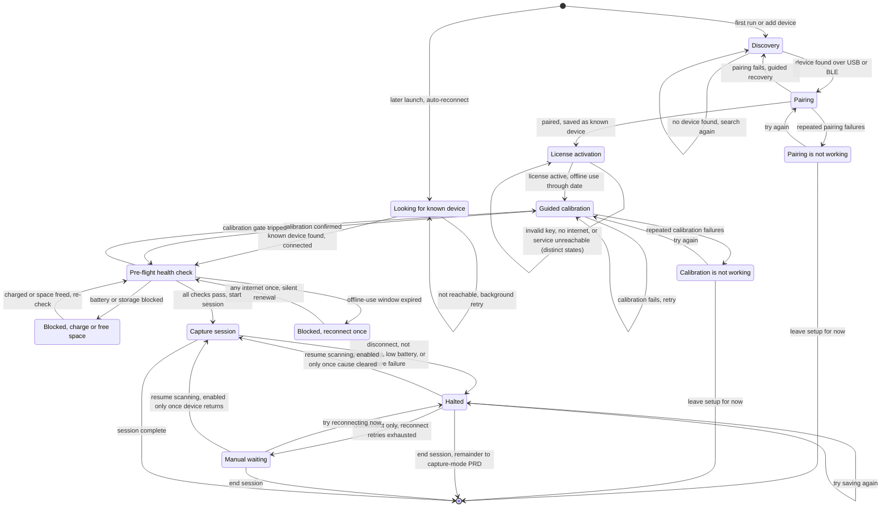
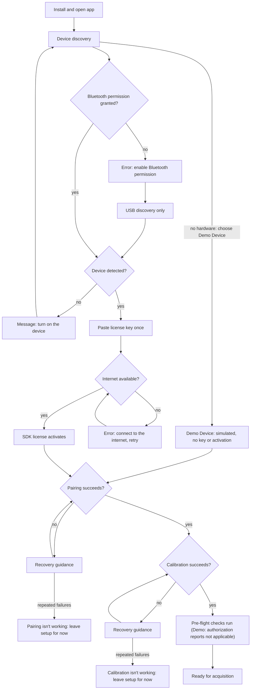
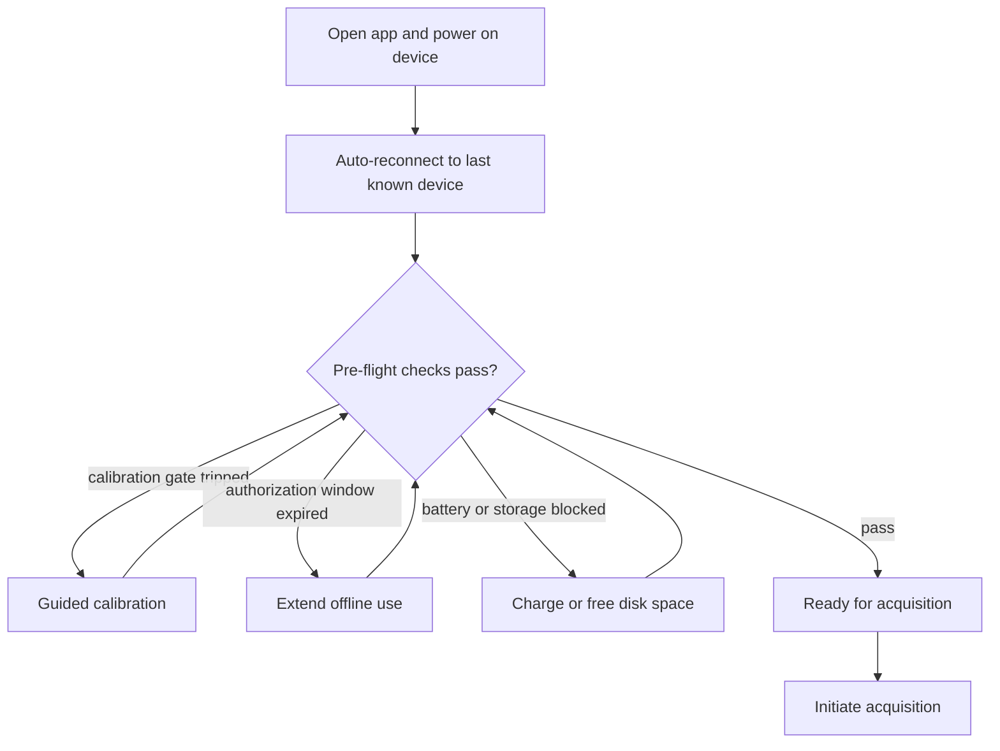
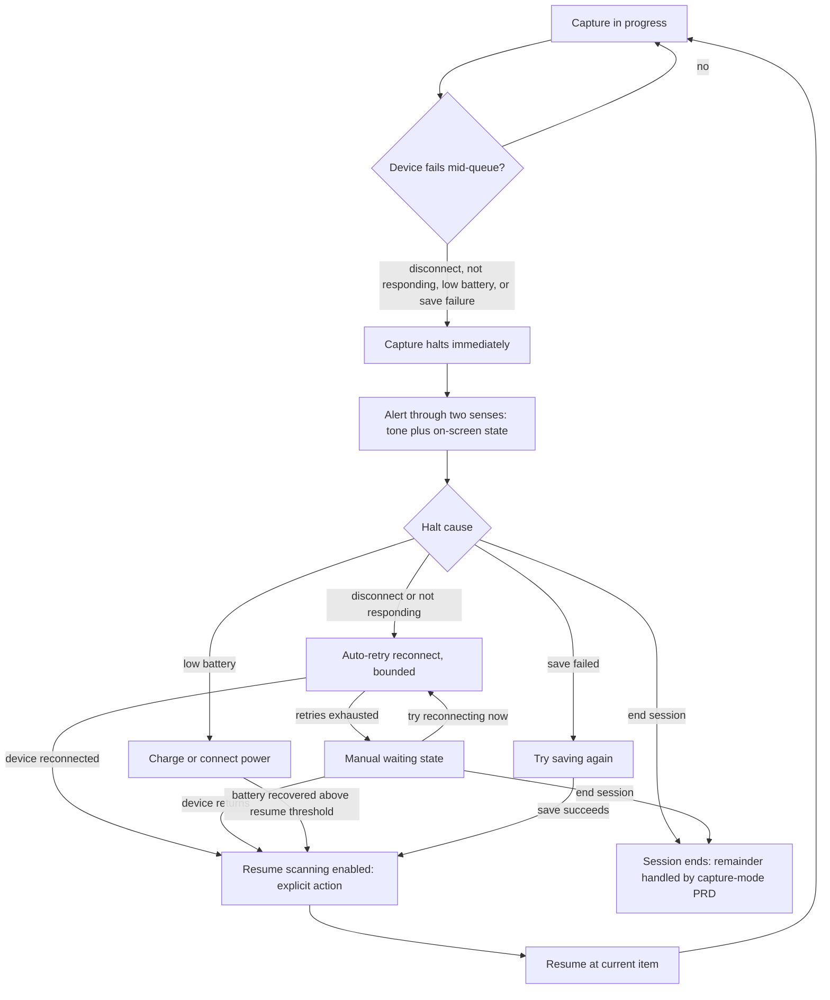
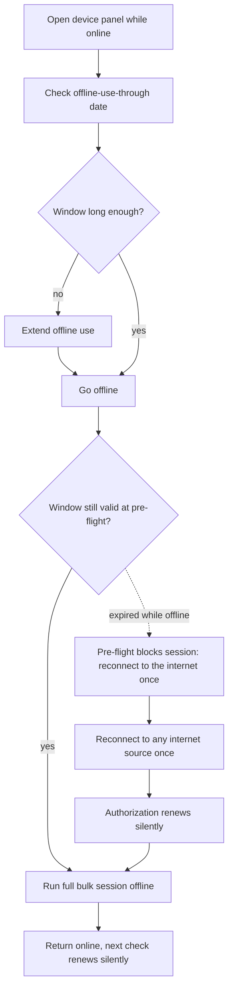

# PRD: Device Management

Author: Vinny Pasceri

# Background

SpectroCapture requires a connection to a spectrophotometer to acquire color information. The scope of this PRD covers all the requirements for the use cases, features, and user journeys related to managing that connection.

### Use cases

Defined in the [Vision doc](vision.md#use-cases):

| #   | Use case                                  | Persona     | What serves it                                                                     |
| --- | ----------------------------------------- | ----------- | ---------------------------------------------------------------------------------- |
| U3  | **Start a session with a healthy device** | Cataloger   | known-device management (BLE + USB), calibration-due prompt, QR-tile calibration   |
| U8  | **Scan where there is no internet**       | Cataloger   | offline-first design + per-device pre-authorization ("Offline use through ⟨date⟩") |
| U9  | **Contribute code without hardware**      | Contributor | mock-device layer behind the device-service interface; what CI exercises           |

### Feature list

Defined in the [Vision doc](vision.md#feature-list):

| Release | Feature                                          | Serves | Notes                                                                               |
| ------- | ------------------------------------------------ | ------ | ----------------------------------------------------------------------------------- |
| v1      | Spectro 2/L connect (BLE + USB)                  | U3     |                                                                                     |
| v1      | Known-device management                          | U3     |                                                                                     |
| v1      | Tile calibration with due-prompts                | U3     |                                                                                     |
| v1      | Offline operation + per-device pre-authorization | U8     | "Offline use through 〈date〉" surfaced in the device panel                           |
| v1      | Mock-device layer                                | U9     | App runs, tests, and takes contributions with no hardware or key; what CI exercises |

### Device workflow

The device lifecycle end-to-end, as the Cataloger experiences it: discovery and pairing ([§1](#1-device-pairing)), license activation and pre-authorization ([§2](#2-licensing--pre-authorization)), calibration ([§3](#3-calibration)), the pre-flight gate ([§4](#4-pre-flight-device-health)), and in-session failure and recovery ([§5](#5-mid-session-device-failure)).

> Note: the order of pairing and license activation is unsettled pending SDK/hardware verification — this diagram shows pair-then-activate while [UJ1](#uj-1-first-run) shows activate-then-pair, and the two intentionally preserve both candidate orders. The tradeoff: pair-first leaves an offline user with a saved device; activate-first avoids saving a device the SDK may refuse to serve. See [Open Questions](#open-questions).

## User Journeys

### UJ 1. First run

1. Install &amp; Open app
2. Initiate device discovery
3. Grant App bluetooth permissions
4. App detects a device is available to connect via USB or BLE
  - If no device detected → show the no-device-found state ([copy, §7](#7-error--state-copy))
5. If a Nix device is discovered, attempt to activate the Nix SDK license (first run: paste the license key once; it is stored locally and auto-activated silently on every later launch)
  - If there's no internet connection → show the no-internet-at-activation state ([copy, §7](#7-error--state-copy)) (a device's first-ever connect requires internet for serial authorization)
6. Initiate device pairing
  - If pairing fails → show the pairing-failed state ([copy, §7](#7-error--state-copy))
7. Initiate calibration
  - If calibration fails → show the calibration-failed state ([copy, §7](#7-error--state-copy))
8. App ready for acquisition

> Note: steps 5–6 show activate-then-pair; the [Device workflow](#device-workflow) diagram shows pair-then-activate. The ordering is unsettled pending SDK/hardware verification and the two intentionally preserve both candidate orders — pair-first leaves an offline user with a saved device, activate-first avoids saving a device the SDK may refuse to serve. See [Open Questions](#open-questions).

### UJ 1.1 Cannot complete a first run

1. Install &amp; Open app with no internet connection
2. Initiate device discovery
3. User denies App bluetooth permissions
  - Failure point: Permission is now denied, App can't detect the device via bluetooth
  - Show the Bluetooth-denied state ([copy, §7](#7-error--state-copy))
4. App can only detect device via USB
5. If a Nix device is discovered, attempt activation of the Nix SDK license
  - Failure point: No internet connection prevents the SDK from activating
  - Show the no-internet-at-activation state ([copy, §7](#7-error--state-copy)) and allow the user to retry

### UJ 1.2 First run with no hardware (Contributor)

1. Install &amp; open app with no instrument and no license key
2. In the device picker, choose "Demo Device (simulated — no instrument)"
3. No license activation runs and no key prompt ever appears
4. A working capture session runs against generated readings ([§6](#6-mock-device-layer))

The chart below covers [UJ1](#uj-1-first-run), [UJ1.1](#uj-11-cannot-complete-a-first-run), and [UJ1.2](#uj-12-first-run-with-no-hardware-contributor) together — the denied-Bluetooth and no-internet branches are UJ1.1's failure points; the Demo Device branch is UJ1.2.

### UJ 2. Start acquisition

1. Open app &amp; turn on device
2. Auto-reconnect to the last known connected device
3. Pre-flight health check evaluates on connect, advisory (battery, calibration currency, authorization window, storage headroom)
  - Guided calibration if the gate tripped
  - Extend offline use if the window has lapsed
4. App ready for acquisition
5. Initiate acquisition — the first capture action against the loaded queue re-runs the checks as the blocking gate

### UJ 3. Remove a saved device

1. Open "Saved devices"
2. Select device → Remove

### UJ 4. Calibrate a connected device

1. Turn on device
2. App establishes connection to device
  - If connection isn't established → show the device-not-reachable state ([copy, §7](#7-error--state-copy))
3. Initiate calibration
  - If calibration fails → show the calibration-failed state ([copy, §7](#7-error--state-copy))
4. App ready for acquisition

### UJ 5. Device failure during a session

> Scope boundary: this PRD owns device-level failure — detect → alert → reconnect → resume. Per-scan errors (retry / skip / flag-row) and the dead-letter queue belong to the capture-mode PRD.

1. Mid-queue, the device fails: BLE/USB disconnect, the device stops responding, battery below the operational threshold, or a disk-write failure
2. Capture halts immediately on disconnect (never continues silently); the alert reaches the user through at least two senses (tone + on-screen state; haptic where available) — the user's eyes are on the physical samples, not the screen
3. App presents the matching recovery path: reconnect (auto-retried to the same device, bounded, then manual waiting), charge, or retry the failed save; ending the session is always available
4. When the halt cause clears, a single "Resume scanning" action is enabled — the deliberate acknowledgment and the only way back to capture. Resume returns to the current item; every scan the queue advanced past was durably written, so nothing is lost, re-inserted, or duplicated
5. Capture continues

### UJ 6. Pre-authorize before going offline

1. Before leaving connectivity, open the device panel
2. Check "Offline use through ⟨date⟩" and extend offline use if the window is short
3. Go offline; run a full bulk session with no internet at all — activation and scanning are both local within the window
4. Return online later; the next authorization check happens silently

### UJ 6.1 Authorization window expired while offline

1. Open app offline with an expired pre-authorization window
2. Pre-flight health check blocks the session before it starts with a clear "reconnect to the internet once" state
  - Never surfaces as a mystery disconnect mid-queue
3. User reconnects to any internet source once; authorization renews silently
4. App ready for acquisition

The chart below covers [UJ6](#uj-6-pre-authorize-before-going-offline) and [UJ6.1](#uj-61-authorization-window-expired-while-offline) together — the dashed edge is UJ6.1's expired-window branch.

## Requirements

### Legend

**Priority**

- **P0:** Must have in this release
- **P1:** Should have in this release
- **P2:** Could have in this release

**Status**

- ⌛️ Ready for Alignment - Waiting for cross-functional team to align on requirements
- ✋ Needs Discussion - Cross-functional team needs to discuss with PM
- 🤝 Aligned - Cross-functional team aligned on the requirement
- 🦺 In Progress - Implementation in flight (Optional status)
- ✅ Completed - Implementation completed &amp; merged. PR # &amp; link added in the "Commit PR" column.
- ✂️ Deferred - Deferred from current release

### Surfaces

The device experience lives on four surfaces. The device panel and the pre-flight readiness panel are one surface — the device panel, with a readiness zone; wording elsewhere in this PRD refers to that zone, never to a separate panel.

| Surface         | Shows                                                                                                                        | [§7](#7-error--state-copy) states that render here                                                                                                                                                                                                                     |
| :--------------- | :---------------------------------------------------------------------------------------------------------------------------- | :---------------------------------------------------------------------------------------------------------------------------------------------------------------------------------------------------------------------------------------------------------------------- |
| Device picker   | Discoverable devices (including the Demo Device), display names, add/switch entry points                                     | No device found; Bluetooth permission denied; switch-device confirmation                                                                                                                                                                                               |
| Saved devices   | The known-device list and removal                                                                                            | Remove-device confirmation                                                                                                                                                                                                                                             |
| Device panel    | Device identity, "Offline use through ⟨date⟩", the four readiness checks (readiness zone), ambient indicators and advisories | Device not reachable at launch; no internet at activation; invalid key; vendor service unreachable; extend-offline-use no internet; offline-use expired (online and offline); pre-flight blocked states; calibration due; pairing/calibration failed and isn't-working |
| Capture surface | The live capture loop, the persistent simulated indicator, halt and paused states                                            | All "Halt:" states; the simulated-readings indicator                                                                                                                                                                                                                   |

### 1. Device Pairing

#### As a Cataloger, I can connect a new spectrophotometer so that I can acquire color information into my collection.

| Release | Pri | Requirements                                                                                                                                                                                                                                                                                                                                                                                                                                                                                                                                                                                                                                                            | Status     | Commit PR |
| :------- | :--- | :----------------------------------------------------------------------------------------------------------------------------------------------------------------------------------------------------------------------------------------------------------------------------------------------------------------------------------------------------------------------------------------------------------------------------------------------------------------------------------------------------------------------------------------------------------------------------------------------------------------------------------------------------------------------- | :---------- | :--------- |
| v1      | P0  | User must explicitly invoke an action to add a new device                                                                                                                                                                                                                                                                                                                                                                                                                                                                                                                                                                                                               | 🤝 Aligned |           |
| v1      | P0  | User can connect to a Nix Spectro 2 or Spectro L                                                                                                                                                                                                                                                                                                                                                                                                                                                                                                                                                                                                                        | 🤝 Aligned |           |
| v1      | P0  | App must be able to discover a device over both USB and BLE (either transport alone is sufficient to connect; both must be supported). Discovered devices list strongest signal first (vision [J1](vision.md#j1-first-run-cataloger))                                                                                                                                                                                                                                                                                                                                                                                                                                   | 🤝 Aligned |           |
| v1      | P0  | For Nix devices, the user activates the SDK by pasting their own license key into the app. The shipped app never embeds a key — every user supplies their own, because a shared key would breach the vendor license and the public-repo boundary ([§2](#2-licensing--pre-authorization), [AGENTS.md §5](../../AGENTS.md#5-hardware--the-public-repo-boundary)). The offline-use window is shown as "Offline use through ⟨date⟩" ([§2](#2-licensing--pre-authorization)). Whether activation happens before or after pairing is unresolved pending SDK verification (see [Open Questions](#open-questions)).                                                             | 🤝 Aligned |           |
| v1      | P0  | If the app doesn't automatically discover the device, show the no-device-found state ([copy, §7](#7-error--state-copy)) with the option to retry.                                                                                                                                                                                                                                                                                                                                                                                                                                                                                                                       | 🤝 Aligned |           |
| v1      | P0  | The list of discovered devices must be de-duped by device identity — (kind, model, serial) — so a device that has been detected via USB and also BLE will only be listed once in the device list. If the serial is not readable before connecting on a transport, dedup completes post-connect, with the provisional display form shown until the serial is known (see [Open Questions](#open-questions)).                                                                                                                                                                                                                                                              | 🤝 Aligned |           |
| v1      | P0  | App must show a display name of the form "⟨model⟩ (⟨serial⟩)", e.g. "Spectro 2 (19H1)", on every surface where the device appears: the device picker, Saved devices, switch and remove confirmations, and the [§7](#7-error--state-copy) states. This rule applies to live devices; simulated devices display as "Demo Device (⟨serial⟩)". The serial number is the identity key for dedup, known-device records, and reconnect. While the serial is not yet readable, the provisional display form is "⟨model⟩ (USB)" / "⟨model⟩ (Bluetooth)", and [§7](#7-error--state-copy) states render it whenever the serial is unknown (see [Open Questions](#open-questions)). | 🤝 Aligned |           |
| v1      | P1  | After repeated consecutive pairing failures (retry count is a TBD-on-spike constant), the app shows a distinct pairing-isn't-working state with cause guidance and an explicit "Leave setup for now" exit to the collection ([copy, §7](#7-error--state-copy)). Pairing is never an inescapable loop. The consecutive-failure counter resets on a successful attempt and on leaving setup; on first run, "Leave setup for now" lands on the device panel (no collection exists yet).                                                                                                                                                                                    | 🤝 Aligned |           |

#### As a Cataloger, I can connect to a spectrophotometer I've used before so that I can quickly resume acquiring colors to my collection

| Release | Pri | Requirements                                                                                                                                                                                                                                                                                                                                                                                                                                                                                                                                                                                                                                                   | Status     | Commit PR |
| :------- | :--- | :-------------------------------------------------------------------------------------------------------------------------------------------------------------------------------------------------------------------------------------------------------------------------------------------------------------------------------------------------------------------------------------------------------------------------------------------------------------------------------------------------------------------------------------------------------------------------------------------------------------------------------------------------------------- | :---------- | :--------- |
| v1      | P0  | A device becomes a known device after its first successful pairing. The known-device record is keyed by serial number (the durable device identity) and persists across app launches. Whether this happens before or after license activation is unresolved pending SDK verification (see [Open Questions](#open-questions)).                                                                                                                                                                                                                                                                                                                                  | 🤝 Aligned |           |
| v1      | P0  | On launch, the app auto-reconnects to the last-used known device with zero user action. When the device is powered on and in range, no connection step stands between opening the app and scanning — open app → scanning in seconds. Simulated devices are excluded from launch auto-reconnect; a simulated device connects only by explicit selection.                                                                                                                                                                                                                                                                                                        | 🤝 Aligned |           |
| v1      | P1  | When the last-used known device is reachable over both USB and BLE, the app connects over USB (proposed preference: wired link, immune to radio interference). The transport is chosen once, at connect time; the app never migrates a live session between transports. A mid-session transport change (e.g. cable unplugged) is treated as a disconnect under the mid-session failure policy ([§5](#5-mid-session-device-failure)). On reconnect after a transport-loss halt, any transport that reaches the bound serial is acceptable — instrument identity, not link identity, determines measurement validity — and the in-use transport remains visible. | 🤝 Aligned |           |
| v1      | P0  | The app connects to exactly one device at a time. The vendor SDK is single-device, single-session. Connecting a different device requires an explicit switch action with a confirmation naming both devices; auto-reconnect never switches devices on its own.                                                                                                                                                                                                                                                                                                                                                                                                 | 🤝 Aligned |           |
| v1      | P0  | A capture session binds to the device (by serial number) it started with; a different device cannot take over an in-progress session. This keeps reference whites consistent within a session.                                                                                                                                                                                                                                                                                                                                                                                                                                                                 | 🤝 Aligned |           |
| v1      | P0  | If the last-used known device is unreachable at launch, the app shows a non-modal device-not-reachable state naming the device ("⟨model⟩ (⟨serial⟩)") with guidance to power it on ([copy, §7](#7-error--state-copy)), and keeps retrying discovery in the background. When the device appears, connection completes automatically with nothing for the user to dismiss. At any launch, if Bluetooth authorization is denied or undetermined and the known device is not reachable over USB, the app shows the Bluetooth-permission-denied state ([copy, §7](#7-error--state-copy)) instead of device-not-reachable.                                           | 🤝 Aligned |           |
| v1      | P0  | Single connection authority: at most one connect, disconnect, or retry attempt is in flight at any time — across background reconnect, launch auto-reconnect, and user-initiated connect/switch actions. A user-initiated action supersedes and cancels any in-flight background attempt. Ending a session releases the session's device binding. Whether the vendor SDK performs its own automatic reconnection, and whether it can be disabled or subordinated, is a spike question (see [Open Questions](#open-questions)).                                                                                                                                 | 🤝 Aligned |           |
| v1      | P1  | Auto-reconnect may open a probe connection to a candidate solely to read its serial; a device whose serial does not match is released immediately — never presented as connected, never bound. The known-device record persists whatever per-transport reconnect handle reconnection requires, alongside the serial.                                                                                                                                                                                                                                                                                                                                           | 🤝 Aligned |           |
| v1      | P1  | When a post-connect serial read matches an existing known device, the connection is recognized as that device: the known-device record updates (e.g. the per-transport reconnect handle) and the flow proceeds as a normal reconnect — no duplicate record, no error, no interruption.                                                                                                                                                                                                                                                                                                                                                                         | 🤝 Aligned |           |

#### As a Cataloger, I can manage my saved devices so that my device list only contains the instruments I actually use

Traces [UJ3](#uj-3-remove-a-saved-device). Vocabulary: "known device" is the internal/data-model term; the UI always says "Saved devices".

| Release | Pri | Requirements                                                                                                                                                                                                                                                                                                                                                                                                        | Status     | Commit PR |
| :------- | :--- | :------------------------------------------------------------------------------------------------------------------------------------------------------------------------------------------------------------------------------------------------------------------------------------------------------------------------------------------------------------------------------------------------------------------- | :---------- | :--------- |
| v1      | P1  | User can remove a known device via an explicit action, with a confirmation step that names the device ("⟨model⟩ (⟨serial⟩)").                                                                                                                                                                                                                                                                                       | 🤝 Aligned |           |
| v1      | P1  | Removing a known device never deletes or alters measurements acquired with it — canonical values and version history are untouched (corrections never destroy data). Removal deletes only the saved connection record.                                                                                                                                                                                              | 🤝 Aligned |           |
| v1      | P1  | Re-adding a removed device follows the normal new-device pairing flow (first story in [§1](#1-device-pairing)); there is no special re-add path.                                                                                                                                                                                                                                                                    | 🤝 Aligned |           |
| v1      | P0  | Every measurement permanently records the acquiring device's identity — model, serial, and kind (live or simulated) — as an immutable snapshot independent of saved-device records; removing a saved device can never alter, orphan, or cascade into measurements. Device identity is (kind, model, serial): a simulated device can never collide with or occupy a live device's record, even with the same serial. | 🤝 Aligned |           |

### 2. Licensing &amp; Pre-Authorization

Traces [UJ1](#uj-1-first-run), [UJ6](#uj-6-pre-authorize-before-going-offline), [UJ6.1](#uj-61-authorization-window-expired-while-offline); serves [U8](vision.md#use-cases).

Vocabulary: "pre-authorization" is internal vocabulary and never appears in the UI — the button is "Extend offline use" and the panel string is "Offline use through ⟨date⟩".

#### As a Cataloger, I can enter my Nix license key once so that the app doesn't ask me for it again

| Release | Pri | Requirements                                                                                                                                                                                                                                                                          | Status     | Commit PR |
| :------- | :--- | :------------------------------------------------------------------------------------------------------------------------------------------------------------------------------------------------------------------------------------------------------------------------------------- | :---------- | :--------- |
| v1      | P1  | User pastes the license key once; it is stored locally on the user's machine and silently auto-activated on every later launch. The user is never re-prompted for the key unless activation fails with an invalid-key state.                                                          | 🤝 Aligned |           |
| v1      | P0  | The license key never appears in the repository, in CI configuration, or in any commit ([AGENTS.md §5](../../AGENTS.md#5-hardware--the-public-repo-boundary)). The shipped app embeds no key; every user supplies their own.                                                          | 🤝 Aligned |           |
| v1      | P1  | A device's first-ever connect requires an internet connection (serial authorization). The app surfaces this requirement clearly before a session starts at pairing or pre-flight, never as a mid-queue failure.                                                                       | 🤝 Aligned |           |
| v1      | P0  | Activation failures are three distinct states, each naming its recovery: invalid key → re-enter the key; no internet → connect to the internet and retry; vendor service unreachable (internet up, service down) → retry later. The three are never collapsed into one generic error. | 🤝 Aligned |           |

#### As a Cataloger, I can pre-authorize my device before going offline so that a full bulk session runs with no internet at all

| Release | Pri | Requirements                                                                                                                                                                                                                                                                                                                                                                                                                                                                                                                                                                                                                                                                                                      | Status     | Commit PR |
| :------- | :--- | :----------------------------------------------------------------------------------------------------------------------------------------------------------------------------------------------------------------------------------------------------------------------------------------------------------------------------------------------------------------------------------------------------------------------------------------------------------------------------------------------------------------------------------------------------------------------------------------------------------------------------------------------------------------------------------------------------------------- | :---------- | :--------- |
| v1      | P1  | The device panel shows "Offline use through ⟨date⟩" for the connected device.                                                                                                                                                                                                                                                                                                                                                                                                                                                                                                                                                                                                                                     | 🤝 Aligned |           |
| v1      | P1  | While online, the user can invoke an explicit "Extend offline use" action that renews the pre-authorization window immediately and updates the displayed date.                                                                                                                                                                                                                                                                                                                                                                                                                                                                                                                                                    | 🤝 Aligned |           |
| v1      | P1  | When online, the app renews the pre-authorization window silently in the background, attempting renewal before the window runs low — the trigger point is a TBD-on-spike constant (candidate: one-third of the window remaining, per [v2 research §5.1](../briefs/acquisition-experience-research-results-v2.md#5-pre-flight-and-session-readiness)). On renewal failure it retries with exponential backoff (1 min → 10 min → 100 min → daily, per the same source) and never interrupts the user while the current window is still valid.                                                                                                                                                                       | 🤝 Aligned |           |
| v1      | P0  | If the pre-authorization window has expired while offline, the pre-flight check blocks an acquisition session start with a clear "reconnect to the internet once" state; while the blocking state is shown, the app listens for connectivity and renews silently the moment any returns. Expiry never surfaces as a mystery mid-queue failure.                                                                                                                                                                                                                                                                                                                                                                    | 🤝 Aligned |           |
| v1      | P1  | License activation/renewal, opt-in telemetry (off by default), and the software-update check are the only network calls the app itself initiates in v1 — update checking is user-controllable, sends no system profile, and can never block, delay, or halt launch or capture; no other outbound calls of any kind (the vendor SDK's own network behavior is a separate open question, see [Open Questions](#open-questions)). Telemetry is specified in a dedicated future PRD, gated on a provider spike (see [Open Questions](#open-questions)); this supersedes the no-telemetry posture in [v2 research §10.5](../briefs/acquisition-experience-research-results-v2.md#10-measuring-acquisition-throughput). | 🤝 Aligned |           |
| v1      | P0  | The app persists the vendor-granted offline-use end date per device and treats it as the source of truth for the displayed date and the pre-flight gate; the vendor SDK's own refusal is a defensive backstop, never the primary check. If the SDK refuses while the persisted date is still valid, the app surfaces the offline-use-expired state ([copy, §7](#7-error--state-copy)), never a generic error, and re-syncs the date on the next connection.                                                                                                                                                                                                                                                       | 🤝 Aligned |           |
| v1      | P0  | A session started inside the offline-use window runs to completion even if the window expires mid-session; the expiry block applies only at the next session start. Whether the vendor SDK itself enforces mid-session expiry is a spike question (see [Open Questions](#open-questions)).                                                                                                                                                                                                                                                                                                                                                                                                                        | 🤝 Aligned |           |
| v1      | P1  | Invoking "Extend offline use" while offline resolves to the extend-offline-use-no-internet state ([copy, §7](#7-error--state-copy)) — never a spinner and never a silent failure.                                                                                                                                                                                                                                                                                                                                                                                                                                                                                                                                 | 🤝 Aligned |           |
| v1      | P1  | The license key at rest is stored as a protected credential in the system credential store — never in plaintext files, the collection database, logs, or any export. Re-entry uses an empty masked field; the stored key is never redisplayed.                                                                                                                                                                                                                                                                                                                                                                                                                                                                    | 🤝 Aligned |           |

### 3. Calibration

Traces [UJ4](#uj-4-calibrate-a-connected-device); serves [U3](vision.md#use-cases).

#### As a Cataloger, I can calibrate my device with a guided flow so that every session starts measurement-accurate

| Release | Pri | Requirements                                                                                                                                                                                                                                                                                                                                                                                                                                                                                                                | Status     | Commit PR |
| :------- | :--- | :--------------------------------------------------------------------------------------------------------------------------------------------------------------------------------------------------------------------------------------------------------------------------------------------------------------------------------------------------------------------------------------------------------------------------------------------------------------------------------------------------------------------------- | :---------- | :--------- |
| v1      | P0  | A guided QR-tile calibration flow runs (a) on first run, (b) on demand from the device panel, and (c) when the session-boundary gate trips. The flow walks tile placement, runs the calibration, and ends in either a confirmed success or a named failure state with a retry action ([copy, §7](#7-error--state-copy)). The gate rule itself is TBD pending the hardware spike (see [Open Questions](#open-questions)).                                                                                                    | 🤝 Aligned |           |
| v1      | P0  | The app stores calibration window information per device. The calibration window is a per-instrument constant; the actual Spectro 2/L window must be verified on real hardware/SDK. The session-boundary gate rule is TBD pending the same spike — candidate: the one-third rule ([v2 research §5.1](../briefs/acquisition-experience-research-results-v2.md#5-pre-flight-and-session-readiness)); whether the gate must also weigh the remaining window against expected session length is part of the same open decision. | 🤝 Aligned |           |
| v1      | P0  | Capture mode is never interrupted for calibration, and no calibration countdown appears in the capture loop. Calibration currency is shown only as an ambient indicator in the device panel's readiness zone.                                                                                                                                                                                                                                                                                                               | 🤝 Aligned |           |
| v1      | P1  | After repeated consecutive calibration failures (retry count is a TBD-on-spike constant), the app shows a distinct calibration-isn't-working state with cause guidance (tile condition, lighting) and an explicit "Leave setup for now" exit to the collection ([copy, §7](#7-error--state-copy)). Calibration is never an inescapable loop. The consecutive-failure counter resets on a successful attempt and on leaving setup; on first run, "Leave setup for now" lands on the device panel (no collection exists yet). | 🤝 Aligned |           |

### 4. Pre-Flight Device Health

Traces [UJ2](#uj-2-start-acquisition).

#### As a Cataloger, I can see that my device is session-ready before I start so that a bulk run never dies mid-queue for a preventable reason

| Release | Pri | Requirements                                                                                                                                                                                                                                                                                                                                                                                                                                                                                                                                                                                                                                                                                                                                                                                                                                                                 | Status     | Commit PR |
| :------- | :--- | :---------------------------------------------------------------------------------------------------------------------------------------------------------------------------------------------------------------------------------------------------------------------------------------------------------------------------------------------------------------------------------------------------------------------------------------------------------------------------------------------------------------------------------------------------------------------------------------------------------------------------------------------------------------------------------------------------------------------------------------------------------------------------------------------------------------------------------------------------------------------------- | :---------- | :--------- |
| v1      | P0  | The device panel's readiness zone covers four device-readiness checks — power/battery state, calibration currency, authorization window, and storage headroom — plus an alert-channel advisory (the muted-audio warning, [§5](#5-mid-session-device-failure)); the advisory is not a fifth readiness check. Pre-flight evaluates when a device connects (advisory, ambient) and re-evaluates as the blocking gate when a session starts; a session starts at the user's first capture action against a loaded queue — that is the session-start event this PRD gates. When all four checks pass, the readiness zone requires no interaction and does not block session start. The pass/warn/block boundaries for every check are TBD pending the hardware spike (see [Open Questions](#open-questions)).                                                                     | 🤝 Aligned |           |
| v1      | P0  | Each check reports pass / warn / block / not applicable — "not applicable" is for a check that cannot apply to the connected device kind; it neither blocks nor needs remediation. Every warn or block state carries a one-tap remediation: charge or connect power, recalibrate (guided flow, [§3](#3-calibration)), extend offline use or reconnect to the internet ([§2](#2-licensing--pre-authorization)), free disk space. No check ends in a dead end. A warn state reuses the corresponding blocked state's copy ([§7](#7-error--state-copy)) in a non-blocking presentation. The storage check measures free space on the volume containing the active collection file; when none is open, the volume where a new collection would default. The boundaries between pass, warn, and block are TBD pending the hardware spike (see [Open Questions](#open-questions)). | 🤝 Aligned |           |

### 5. Mid-Session Device Failure

Traces [UJ5](#uj-5-device-failure-during-a-session).

> Scope boundary (restated from [UJ5](#uj-5-device-failure-during-a-session)): this PRD owns device-level failure — detect → alert → reconnect → resume. Per-scan retry/skip/flag and the dead-letter queue belong to the future capture-mode PRD.

Definition: the "current item" is the first queue row with no durably written reading, evaluated when capture resumes — so a successful save retry can never produce a duplicate. "Halt" is the internal term; the UI shows the session as paused.

#### As a Cataloger, when my device fails mid-queue, the app stops me immediately and gets me back to the current item so that I never lose a scan or scan into a dead connection

| Release | Pri | Requirements                                                                                                                                                                                                                                                                                                                                                                                                                                                                                                                                                                                                                                                                                                                                                                                                                                                    | Status     | Commit PR |
| :------- | :--- | :--------------------------------------------------------------------------------------------------------------------------------------------------------------------------------------------------------------------------------------------------------------------------------------------------------------------------------------------------------------------------------------------------------------------------------------------------------------------------------------------------------------------------------------------------------------------------------------------------------------------------------------------------------------------------------------------------------------------------------------------------------------------------------------------------------------------------------------------------------------- | :---------- | :--------- |
| v1      | P0  | On the first BLE/USB disconnect, a device that stops responding, a store-write failure, or battery falling below the operational threshold (threshold TBD pending the hardware spike, see [Open Questions](#open-questions)), capture halts immediately (accelerated breaking, [v2 research §4.2](../briefs/acquisition-experience-research-results-v2.md#4-mid-run-error-handling)). Disconnect detection carries a stated tolerance (TBD-on-spike — BLE supervision timeouts bound it). The app never continues silently, and it never holds an unwritten scan across a halt except the single failed-save reading (hold-and-retry row below); the durable write completes before the queue advances — a constraint ADR-0004 inherits.                                                                                                                        | 🤝 Aligned |           |
| v1      | P0  | The error alert cannot be dismissed by the same action that advances the queue. Acknowledging a failure requires a distinct, deliberate action ([v2 research §4.1](../briefs/acquisition-experience-research-results-v2.md#4-mid-run-error-handling)).                                                                                                                                                                                                                                                                                                                                                                                                                                                                                                                                                                                                          | 🤝 Aligned |           |
| v1      | P0  | A halt alerts through at least two senses simultaneously: an interrupting tone plus a blocking on-screen state, with haptics where the hardware provides them. An error tone pre-empts any in-flight success tone. The blocking on-screen state is peripherally perceivable — a full-capture-surface state change, not a dialog. Pre-flight warns when system audio output is muted, so the alert channel is verified before the session.                                                                                                                                                                                                                                                                                                                                                                                                                       | 🤝 Aligned |           |
| v1      | P0  | Recovery: the app auto-retries reconnection to the same device (by serial number), bounded — after n attempts / t minutes (constants TBD pending the hardware spike, see [Open Questions](#open-questions)) it falls back to a manual waiting state that keeps listening for the device without active retries, offering "Try reconnecting now" and "End session" ([copy, §7](#7-error--state-copy)).                                                                                                                                                                                                                                                                                                                                                                                                                                                           | 🤝 Aligned |           |
| v1      | P0  | Recovery never auto-resumes capture. When the halt cause clears (the device reconnects or responds again, the battery level recovers, the save succeeds), the app enables a single "Resume scanning" action — the deliberate acknowledgment, the only path from a halt back to capture, and never bound to the queue-advance action. Resume is not available while the cause holds; resuming resets the failure counters (manual override, [v2 research §4.2](../briefs/acquisition-experience-research-results-v2.md#4-mid-run-error-handling)). Resume returns to the current item; every scan the queue advanced past was durably written, so recovery re-inserts nothing and creates no duplicates. When multiple halt causes hold at once, the displayed state is the first-raised unresolved cause, and Resume enables only when all causes have cleared. | 🤝 Aligned |           |
| v1      | P0  | A completed scan whose save fails is retained across the halt; "Try saving again" re-attempts the same reading, and on success "Resume scanning" is enabled. The three save-failure halts — disk full, collection file unreachable, and unexpected error — are distinct states ([copy, §7](#7-error--state-copy)); the unexpected-error fallback never shows a raw error code.                                                                                                                                                                                                                                                                                                                                                                                                                                                                                  | 🤝 Aligned |           |
| v1      | P0  | Every halt offers an explicit "End session" action that closes the capture session from the halted state. Ending the session from a save-failure halt explicitly warns that the one unsaved reading will be discarded and that its item remains unscanned in the queue. What happens to the un-scanned remainder of the queue is the capture-mode PRD's to define, not this one's.                                                                                                                                                                                                                                                                                                                                                                                                                                                                              | 🤝 Aligned |           |
| v1      | P0  | Every halt writes a local record when the halt occurs — cause, timestamp, battery level, item index — and amends it on resolution with the recovery action taken and time-to-recovery; a halt that never resolves remains an open record. Writing the record is best-effort and never itself halts, blocks, or cascades; a save-failure halt's record is persisted once the store is writable again. The record stays in the user's local store, never transmitted. This log is the data source for the device-caused-stalls metric ([Success Metrics](#success-metrics)) and the input for the spike's threshold tuning.                                                                                                                                                                                                                                       | 🤝 Aligned |           |
| v1      | P0  | A device that accepts no command and returns no reading within a liveness timeout (TBD-on-spike, see [Open Questions](#open-questions)) halts as "device not responding" ([copy, §7](#7-error--state-copy)), with the same alert and recovery contract as a disconnect.                                                                                                                                                                                                                                                                                                                                                                                                                                                                                                                                                                                         | 🤝 Aligned |           |
| v1      | P0  | The battery-low halt clears when the reported battery level rises above a distinct resume threshold (TBD-on-spike, strictly above the halt threshold, see [Open Questions](#open-questions)); connecting power alone never clears it.                                                                                                                                                                                                                                                                                                                                                                                                                                                                                                                                                                                                                           | 🤝 Aligned |           |
| v1      | P0  | A halt that occurs after one or more readings of an incomplete multi-sample set discards the partial set; the item re-scans from the first sample on resume.                                                                                                                                                                                                                                                                                                                                                                                                                                                                                                                                                                                                                                                                                                    | 🤝 Aligned |           |
| v1      | P0  | While capture is halted, the scan-accept path is suppressed: a scan attempt during a halt surfaces the halt state itself rather than being accepted — the user can never scan into a dead connection, even having missed the alert.                                                                                                                                                                                                                                                                                                                                                                                                                                                                                                                                                                                                                             | 🤝 Aligned |           |
| v1      | P1  | Quitting the app from a halted state routes through the same End-session warning — a held unsaved reading is never silently discarded. A halt record left open by process termination is closed as "unresolved — app terminated" on next launch, keeping the stalls metric honest. System sleep mid-session: the resulting disconnect halts under this section, and pre-flight re-gates on wake. Session/queue persistence across launches is an inherited obligation of the capture-mode PRD, not defined here.                                                                                                                                                                                                                                                                                                                                                | 🤝 Aligned |           |
| v1      | P1  | Every halt state posts an accessibility announcement; the capture surface is navigable by assistive technology, and the halt state is announced without requiring focus.                                                                                                                                                                                                                                                                                                                                                                                                                                                                                                                                                                                                                                                                                        | 🤝 Aligned |           |

Halt thresholds are provisional: per the v2 research ([§4.2](../briefs/acquisition-experience-research-results-v2.md#4-mid-run-error-handling)), tolerance status is logged across the first ~10 real sessions with halting tuned offline against that data before any threshold ships as final.

### 6. Mock Device Layer

Traces [U9](vision.md#use-cases); serves vision journey [J5](vision.md#j5-first-contribution-contributor) (first contribution).

#### As a Contributor, I can run and test the whole app against a simulated spectrophotometer so that I can contribute without hardware or a license key

| Release | Pri | Requirements                                                                                                                                                                                                                                                                                                                                                                                                                                                                                                                                                                                                                                                                                                   | Status     | Commit PR |
| :------- | :--- | :-------------------------------------------------------------------------------------------------------------------------------------------------------------------------------------------------------------------------------------------------------------------------------------------------------------------------------------------------------------------------------------------------------------------------------------------------------------------------------------------------------------------------------------------------------------------------------------------------------------------------------------------------------------------------------------------------------------- | :---------- | :--------- |
| v1      | P0  | The app ships a "Demo Device (simulated — no instrument)" entry selectable in the same device picker as real hardware, with helper text "For trying the app and for contributors. Readings are generated, not measured." A first-class device, not a debug flag or a hidden build configuration.                                                                                                                                                                                                                                                                                                                                                                                                               | 🤝 Aligned |           |
| v1      | P0  | The simulated device requires no hardware and no vendor license key. A contributor can run the full app: pairing, calibration, capture, collection, all from a plain clone against it.                                                                                                                                                                                                                                                                                                                                                                                                                                                                                                                         | 🤝 Aligned |           |
| v1      | P0  | Selecting the Demo Device never invokes license activation and never shows the key prompt; a plain clone with no hardware and no key reaches a working capture session (traces [UJ1.2](#uj-12-first-run-with-no-hardware-contributor)).                                                                                                                                                                                                                                                                                                                                                                                                                                                                        | 🤝 Aligned |           |
| v1      | P0  | Every measurement from the simulated device permanently records simulated provenance (per the device-identity rule in [§1](#1-device-pairing)). CSV export emits a `simulated` column (true/false). In collection mode, the item badge reflects the canonical value's provenance, and the collection banner ([copy, §7](#7-error--state-copy)) shows while any item's canonical value is simulated; version history keeps the flag regardless. The capture surface carries a persistent simulated indicator while a simulated device is connected. The collection-view and CSV-export behaviors are inherited obligations for the collection-mode and data/export PRDs.                                        | 🤝 Aligned |           |
| v1      | P0  | The app behaves identically against the simulated and the live device, with a closed list of exceptions: data provenance (simulated readings are always marked, never presented as measured), licensing/activation (never invoked for the Demo Device), the physical transport mechanism (the simulated device does not use real USB/BLE — transport-selection behavior itself is simulated and asserted), OS-permission surfaces, timing, and launch auto-reconnect (never attempted for simulated devices). Everything else — flows, states, error surfaces — is identical.                                                                                                                                  | 🤝 Aligned |           |
| v1      | P0  | Against the Demo Device, all four pre-flight checks ([§4](#4-pre-flight-device-health)) run and report; the authorization check reports a distinct "not applicable — simulated" result that a test can assert.                                                                                                                                                                                                                                                                                                                                                                                                                                                                                                 | 🤝 Aligned |           |
| v1      | P0  | CI exercises the simulated-device path on every PR.                                                                                                                                                                                                                                                                                                                                                                                                                                                                                                                                                                                                                                                            | 🤝 Aligned |           |
| v1      | P0  | The simulated device exposes an explicit configurable state surface: settable serial and model, presence on either or both transports, battery level, calibration state and window, injectable disconnects, injectable silence (the device stops responding without disconnecting), injectable malformed frames, and settable measurement results (deterministic and seedable).                                                                                                                                                                                                                                                                                                                                | 🤝 Aligned |           |
| v1      | P0  | A simulated authorization service with settable outcomes: valid, invalid key, no internet, vendor service unreachable, expired window, window granted until ⟨date⟩, refuses despite a valid persisted window, and key valid but this serial refused — so every [§2](#2-licensing--pre-authorization) state is reproducible without the vendor service.                                                                                                                                                                                                                                                                                                                                                         | 🤝 Aligned |           |
| v1      | P0  | An injectable clock, so offline-use window expiry and the renewal backoff ladder ([§2](#2-licensing--pre-authorization)) are testable in virtual time rather than wall-clock time.                                                                                                                                                                                                                                                                                                                                                                                                                                                                                                                             | 🤝 Aligned |           |
| v1      | P0  | An injectable network-reachability state, so online/offline transitions and every offline journey ([UJ6](#uj-6-pre-authorize-before-going-offline), [UJ6.1](#uj-61-authorization-window-expired-while-offline)) are testable without changing the machine's network.                                                                                                                                                                                                                                                                                                                                                                                                                                           | 🤝 Aligned |           |
| v1      | P0  | Store fault injection — fail the Nth write, disk-full, fail on commit, store unreachable (volume detached / file moved), unclassified store error — so the halt-on-write-failure and hold-and-retry behaviors in [§5](#5-mid-session-device-failure) are testable.                                                                                                                                                                                                                                                                                                                                                                                                                                             | 🤝 Aligned |           |
| v1      | P0  | A test can set the outcome of the Bluetooth-authorization prompt (authorized / denied / undetermined), of any pairing attempt (success / failure), and of any calibration run (success / failure).                                                                                                                                                                                                                                                                                                                                                                                                                                                                                                             | 🤝 Aligned |           |
| v1      | P0  | The simulated layer can present multiple simulated devices at once, each with independent identity and state — so the one-device-at-a-time rule, the switch confirmation, and session binding ([§1](#1-device-pairing)) are testable.                                                                                                                                                                                                                                                                                                                                                                                                                                                                          | 🤝 Aligned |           |
| v1      | P0  | Every outbound network attempt the app makes is observable in tests (destination and time), including activation/renewal attempts against the simulated authorization service on the injectable clock. This makes the only-network-paths claim and the backoff ladder ([§2](#2-licensing--pre-authorization)) assertable — including the negative cases: with the Demo Device selected, or with telemetry off, a test can assert zero corresponding attempts. Audio and haptic cue events are likewise observable (kind, time, and whether a cue pre-empted one in flight), as are connection attempts (start, outcome, cancellation, initiator) and the request payload shape of each permitted network path. | 🤝 Aligned |           |
| v1      | P0  | A test can set the reported free disk space, so the pre-flight storage check ([§4](#4-pre-flight-device-health)) can be induced into warn and block.                                                                                                                                                                                                                                                                                                                                                                                                                                                                                                                                                           | 🤝 Aligned |           |
| v1      | P0  | A test can set device presence per transport (e.g. remove USB while BLE remains) and observe which transport a connection is using — so the transport preference and the mid-session transport-change rule ([§1](#1-device-pairing)) are assertable.                                                                                                                                                                                                                                                                                                                                                                                                                                                           | 🤝 Aligned |           |
| v1      | P0  | A test can start the app from a declared persisted state — known devices, last-used device, stored key present or absent, calibration timestamps — so first-run and later-launch scenarios are constructible without manual setup.                                                                                                                                                                                                                                                                                                                                                                                                                                                                             | 🤝 Aligned |           |
| v1      | P0  | A SpectroDevice conformance suite runs the same behavioral checks against three subjects: the simulated device, in CI on every PR; the live device, run by a hardware owner for `needs-hardware-verify` PRs, who attaches a named results artifact (suite identity plus per-check pass/fail) to the PR; and a hardware-free subject exercising the real cross-language boundary — the contract-test obligation [ADR-0001](../decisions/0001-rust-core-swiftui-shell.md#enforcement-gates-part-of-this-decision) already mandates.                                                                                                                                                                              | 🤝 Aligned |           |
| v1      | P0  | Error-case parity, assertable: for every error the live device can produce, the simulated layer provides an injection that yields it, verified by a test that enumerates the full error set — a new live error case without a matching injection fails the build or the test suite, not review vigilance. The app's device-error set is closed and exhaustively matched at the app's boundary; any SDK error the mapping does not recognize resolves to a named "unrecognized device error" — itself a halt cause with its own [§7](#7-error--state-copy) state and its own injection (whether the vendor SDK's error surface is closed is a spike question, see [Open Questions](#open-questions)).           | 🤝 Aligned |           |
| v1      | P0  | Telemetry is fire-and-forget — it can never block, delay, or halt capture (inherited obligation for the telemetry PRD). With telemetry off, the app makes zero telemetry network attempts — assertable via the outbound-attempt observability above.                                                                                                                                                                                                                                                                                                                                                                                                                                                           | 🤝 Aligned |           |
| v1      | P0  | Any simulated device or service seam a test did not explicitly configure fails the test when exercised, rather than answering with a plausible default.                                                                                                                                                                                                                                                                                                                                                                                                                                                                                                                                                        | 🤝 Aligned |           |
| v1      | P0  | The app always declares the Bluetooth usage description macOS requires — its absence breaks Bluetooth access and may crash the app (vision [J1](vision.md#j1-first-run-cataloger) risk point) — verified automatically in CI on every PR.                                                                                                                                                                                                                                                                                                                                                                                                                                                                      | 🤝 Aligned |           |
| v1      | P1  | The simulated device has a configurable latency defaulting to the real device's measured timing. It is never instant by default. An instant mock hides every race in the capture surface.                                                                                                                                                                                                                                                                                                                                                                                                                                                                                                                      | 🤝 Aligned |           |
| v1      | P2  | The simulated device can replay fixtures recorded from real hardware, including calibration sequences and malformed frames.                                                                                                                                                                                                                                                                                                                                                                                                                                                                                                                                                                                    | 🤝 Aligned |           |

Device-path PRs still need a human with real hardware to verify before merge and carry the `needs-hardware-verify` label ([AGENTS.md §5](../../AGENTS.md#5-hardware--the-public-repo-boundary)). These requirements describe product behavior only; module layout is an open ADR ([AGENTS.md §3](../../AGENTS.md#3-decided--recommended--open)) and is not decided here. The seams for OS surfaces — Bluetooth authorization, free disk space, the credential store, the device picker — are shell-side test doubles, distinct from the pure-Rust SpectroDevice mock [ADR-0001](../decisions/0001-rust-core-swiftui-shell.md) defines; the obligation is that a test can control them, wherever they live (which ADR owns the shell-side seam family, and the macOS CI lane these every-PR obligations require, is an open question — see [Open Questions](#open-questions)).

### 7. Error &amp; State Copy

The shipping copy for every error, waiting, and blocked state in this PRD; confirmation dialogs and warn-level presentations reuse the copy of the rows that require them. Written in the Cataloger's vocabulary: plain language, names the recovery, never SDK-speak. Every state below is a distinct, named state whose identity is stable even when its copy changes, so behavior can be asserted independently of wording. This table is a P0 requirement (status: 🤝 Aligned); the journeys and requirement rows above link here instead of restating copy.

| State                                      | Headline                                        | Body                                                                                                                                                                                                                                             | Primary action                                                                       |
| :------------------------------------------ | :----------------------------------------------- | :------------------------------------------------------------------------------------------------------------------------------------------------------------------------------------------------------------------------------------------------ | :------------------------------------------------------------------------------------ |
| No device found                            | No device found                                 | The search finished without finding a device. Turn on your spectrophotometer, keep it close, and search again.                                                                                                                                   | Search again                                                                         |
| Bluetooth permission denied                | SpectroCapture isn't allowed to use Bluetooth   | Allow Bluetooth for SpectroCapture in System Settings › Privacy &amp; Security to find your device wirelessly — or plug in the USB cable instead, which works without Bluetooth.                                                                 | Open System Settings                                                                 |
| No internet at activation                  | Internet needed to authorize this device        | A device's first connection needs the internet to authorize it. After that you can scan offline until the date shown in the device panel — reconnect any time to extend it.                                                                      | Try again                                                                            |
| Invalid key                                | That license key didn't work                    | Check the key against the one you were issued and paste it again.                                                                                                                                                                                | Re-enter key                                                                         |
| Vendor service unreachable                 | Nix's license service isn't responding          | The license service didn't answer just now. Nothing to fix on your end — try again in a little while.                                                                                                                                            | Try again later                                                                      |
| Extend offline use, no internet            | Can't extend offline use right now              | Extending needs an internet connection — any connection works, even a phone hotspot. Your current window still runs through ⟨date⟩.                                                                                                              | Try again                                                                            |
| Pairing failed                             | Couldn't pair with ⟨model⟩ (⟨serial⟩)           | Turn the device off and on, keep it close, and try again.                                                                                                                                                                                        | Try again                                                                            |
| Pairing isn't working                      | Pairing still isn't working                     | Several attempts haven't succeeded. Check the device's battery, move it closer, or try the USB cable. You can come back to this any time from the device panel.                                                                                  | Try again; Leave setup for now                                                       |
| Calibration failed                         | Calibration didn't finish                       | Seat the device flat on its calibration tile and run it again.                                                                                                                                                                                   | Recalibrate                                                                          |
| Calibration isn't working                  | Calibration still isn't working                 | Several attempts haven't succeeded. Check the tile for dirt or damage, and move away from bright direct light. You can come back to this any time from the device panel.                                                                         | Try again; Leave setup for now                                                       |
| Device not reachable at launch             | Looking for ⟨model⟩ (⟨serial⟩)                  | Turn it on and it will connect by itself — nothing to click.                                                                                                                                                                                     | None (connects automatically)                                                        |
| Offline use expired (offline)              | Offline use has ended — new sessions are paused | Starting a new session needs one internet connection: any connection works, even a phone hotspot. Browsing and exporting your collection still work.                                                                                             | Check again (renewal is silent once any connection returns)                          |
| Offline use expired (online)               | Offline use has ended                           | Extend offline use to keep scanning; you're online, so it takes a moment.                                                                                                                                                                        | Extend offline use                                                                   |
| Pre-flight: battery blocked                | Battery too low to start                        | Charge the device or connect power, then re-check.                                                                                                                                                                                               | Re-check                                                                             |
| Pre-flight: storage blocked                | Not enough disk space to record scans           | There isn't enough free space to save scans safely. Free some space on this Mac, then re-check.                                                                                                                                                  | Re-check                                                                             |
| Pre-flight: calibration due                | Calibration needed before you start             | Your device is due for calibration to keep measurements accurate. Run the guided calibration with the tile, then start your session.                                                                                                             | Calibrate now                                                                        |
| Simulated-readings collection banner       | This collection contains simulated readings     | Readings from the Demo Device are generated, not measured by an instrument.                                                                                                                                                                      | Show simulated readings                                                              |
| Halt: device disconnected (retrying)       | ⟨model⟩ disconnected — capture paused           | Everything you've scanned so far is saved. The app is trying to reconnect; Resume scanning turns on when the device is back. If a multi-reading scan was in progress, that item starts over.                                                     | Resume scanning (enabled once reconnected); End session                              |
| Halt: device disconnected (manual waiting) | Still can't reach ⟨model⟩ (⟨serial⟩)            | Automatic retries have stopped, but the app is still listening for the device. Everything you've scanned so far is saved. If a multi-reading scan was in progress, that item starts over. If it comes back on its own, Resume scanning turns on. | Try reconnecting now; Resume scanning (enabled once the device returns); End session |
| Halt: device not responding                | ⟨model⟩ isn't responding — capture paused       | The device is on but not answering. Turn it off and on, or unplug and reconnect the cable. Everything you've scanned so far is saved. If a multi-reading scan was in progress, that item starts over.                                            | Resume scanning (enabled once it responds); End session                              |
| Halt: battery too low                      | Battery too low to keep scanning                | Charge the device or connect power. Everything you've scanned so far is saved; Resume scanning turns on once the battery has recovered. If a multi-reading scan was in progress, that item starts over.                                          | Resume scanning (enabled once the battery recovers); End session                     |
| Halt: disk full                            | Couldn't save the last scan — disk is full      | The reading is kept safe. Free some disk space, then try saving again; every scan the queue advanced past is already saved. Ending the session instead discards this one unsaved reading and leaves its item unscanned.                          | Try saving again (then Resume scanning); End session                                 |
| Halt: collection file unreachable          | Can't reach your collection                     | The reading is kept safe. If your collection lives on an external drive, reconnect it (or restore the moved file), then try saving again. Ending the session instead discards this one unsaved reading and leaves its item unscanned.            | Try saving again (then Resume scanning); End session                                 |
| Halt: couldn't save (unexpected)           | Couldn't save — unexpected error                | The reading is kept safe, but the save failed for a reason the app doesn't recognize. Try saving again. Ending the session instead discards this one unsaved reading and leaves its item unscanned.                                              | Try saving again (then Resume scanning); End session                                 |
| Halt: unrecognized device error            | Something went wrong with the device            | The device reported a problem the app doesn't recognize. Turn it off and on. Everything you've scanned so far is saved.                                                                                                                          | Resume scanning (enabled once the device responds); End session                      |
| Switch-device confirmation                 | Switch to ⟨model⟩ (⟨serial⟩)?                   | You're currently connected to ⟨model⟩ (⟨serial⟩). A session never changes devices mid-run; switching takes effect for your next session.                                                                                                         | Switch device; Cancel                                                                |
| Remove-device confirmation                 | Remove ⟨model⟩ (⟨serial⟩)?                      | Your measurements keep their record of this device; this removes only the saved connection.                                                                                                                                                      | Remove device; Cancel                                                                |

## Success Metrics

Numeric targets below are proposals, not commitments — the device's scan cycle time is unknown until the hardware spike, and it sets the floor for anything time-based.

| Metric                                                           | Definition                                                                                                                                                                                                                                                            | Candidate target                                                                     | Method                                                                                                                                     | Status     |
| :---------------------------------------------------------------- | :--------------------------------------------------------------------------------------------------------------------------------------------------------------------------------------------------------------------------------------------------------------------- | :------------------------------------------------------------------------------------ | :------------------------------------------------------------------------------------------------------------------------------------------ | :---------- |
| Launch-to-first-scan (known device)                              | Start event: process launch. End event: first measurement durably written. Statistic: median, on a known device with calibration gates intact ([STRATEGY.md key metric](../../STRATEGY.md#key-metrics)). Population: ≥ 20 dogfooded launches with pre-flight passing. | ≤ 30 s when the device is on and pre-flight passes                                   | Dogfooding: timed real sessions, measured locally                                                                                          | 🤝 Aligned |
| Install-to-first-scan (first run)                                | Start event: install/first launch on a clean state. End event: first measurement durably written — paste key → pair → calibrate → scan ([UJ1](#uj-1-first-run) end-to-end).                                                                                           | ≤ 15 min with device and key in hand                                                 | Timed walkthroughs on a clean state (n stated with the result)                                                                             | 🤝 Aligned |
| Device-caused session stalls                                     | The count of open halt records in the [§5](#5-mid-session-device-failure) halt log — halts that never resolved to a guided recovery (directly assertable)                                                                                                             | 0 — every halt resolves to reconnect, charge, retry the save, resume, or end session | The [§5](#5-mid-session-device-failure) halt log: local records of cause, recovery action, and time-to-recovery                            | 🤝 Aligned |
| Add Device Task Completion % (v1.x — requires the telemetry PRD) | % of device add attempts that were successfully completed (attempt = user invokes Add Device; completion = a known-device record is written)                                                                                                                          | ≥ 95% task completion                                                                | Telemetry events (opt-in) — pending the telemetry spike; opt-in sample only — directional signal, never quotable as a population statistic | 🤝 Aligned |
| Add Device Task Duration (v1.x — requires the telemetry PRD)     | Median time from invoking Add Device to a known-device record being written                                                                                                                                                                                           | ≤ 2 mins                                                                             | Telemetry events (opt-in) — pending the telemetry spike; opt-in sample only — directional signal, never quotable as a population statistic | 🤝 Aligned |

## Open Questions

| #   | Question                                    | Details                                                                                                                                                                                                                                                                                                                  | Decided by    |
| :--- | :------------------------------------------- | :------------------------------------------------------------------------------------------------------------------------------------------------------------------------------------------------------------------------------------------------------------------------------------------------------------------------ | :------------- |
| 1   | Pairing-vs-activation order                 | The [Device workflow](#device-workflow) diagram shows pair-then-activate; [UJ1](#uj-1-first-run) shows activate-then-pair. Pair-first leaves an offline user with a saved device; activate-first avoids saving a device the SDK may refuse to serve. Which orders the SDK actually permits must be verified on hardware. | SDK verify    |
| 2   | Calibration window constant                 | The per-instrument window is unknown; sources conflict (4h vs 8h). Must be read off the real Spectro 2/L SDK.                                                                                                                                                                                                            | Spike         |
| 3   | Session-boundary calibration gate rule      | Candidate: the one-third rule ([v2 research §5.1](../briefs/acquisition-experience-research-results-v2.md#5-pre-flight-and-session-readiness)). Whether the gate must also be session-duration-aware — remaining window vs expected session length — is part of the same decision.                                       | Spike + owner |
| 4   | Battery thresholds                          | Pre-flight pass/warn/block boundaries ([§4](#4-pre-flight-device-health)), the mid-session halt threshold, and the distinct resume threshold (strictly above the halt threshold) that re-enables Resume ([§5](#5-mid-session-device-failure)). No numbers until the spike.                                               | Spike         |
| 5   | Storage headroom thresholds                 | Pre-flight warn/block boundaries for disk space ([§4](#4-pre-flight-device-health)).                                                                                                                                                                                                                                     | Spike + owner |
| 6   | Discovery timeout                           | How long discovery searches before showing the no-device-found state ([§1](#1-device-pairing)).                                                                                                                                                                                                                          | Spike         |
| 7   | Reconnect retry bounds                      | The n attempts / t minutes bound on auto-retry before falling back to the manual waiting state ([§5](#5-mid-session-device-failure)).                                                                                                                                                                                    | Spike         |
| 8   | Pre-authorization window length             | Never stated anywhere; [UJ6](#uj-6-pre-authorize-before-going-offline)'s offline-session promise depends on how long the vendor grants.                                                                                                                                                                                  | SDK verify    |
| 9   | USB-vs-BLE transport preference             | The [§1](#1-device-pairing) row prefers USB as "proposed" — needs confirmation against real transport behavior.                                                                                                                                                                                                          | Owner + spike |
| 10  | Scan cycle time                             | Unknown until the hardware spike; sets the floor for every time-based target in [Success Metrics](#success-metrics).                                                                                                                                                                                                     | Spike         |
| 11  | Mid-session expiry: SDK enforcement         | [§2](#2-licensing--pre-authorization) now guarantees a session started inside the offline-use window runs to completion. Does the vendor SDK itself enforce mid-session expiry? If it hard-stops, mid-session expiry becomes a [§5](#5-mid-session-device-failure) halt.                                                 | Spike         |
| 12  | Telemetry provider                          | TelemetryDeck-like provider; requires a spike before the dedicated telemetry PRD.                                                                                                                                                                                                                                        | Spike         |
| 13  | Per-fork telemetry provider ID              | Forks supply their own provider ID so no fork data reaches the project and vice versa — the mechanism needs design.                                                                                                                                                                                                      | Owner         |
| 14  | Telemetry opt-in UX                         | How and when users are offered opt-in (off by default).                                                                                                                                                                                                                                                                  | Owner         |
| 15  | Serial readable at discovery?               | Is the serial number readable pre-connect on both transports? Fallback if not: dedup completes post-connect, with a provisional display name until the serial is known ([§1](#1-device-pairing)).                                                                                                                        | SDK verify    |
| 16  | Vendor SDK network behavior offline         | What network activity does the vendor SDK itself perform beyond activation/renewal, and does it stay fully local within the offline-use window? Bears on the only-network-paths claim ([§2](#2-licensing--pre-authorization)).                                                                                           | Spike         |
| 17  | Vendor SDK auto-reconnect                   | Does the vendor SDK perform its own automatic reconnection, and can it be disabled or subordinated to the app's single connection authority ([§1](#1-device-pairing))?                                                                                                                                                   | SDK verify    |
| 18  | Per-serial refusal                          | Can the vendor refuse an individual serial while the key is valid (seat/device limits), and what does the SDK report? Bears on the [§2](#2-licensing--pre-authorization) source-of-truth backstop and the simulated-authorization outcomes ([§6](#6-mock-device-layer)).                                                 | Spike         |
| 19  | USB-only fallback vs sandboxing             | The USB-only fallback ([UJ1.1](#uj-11-cannot-complete-a-first-run)) constrains the still-open sandboxing decision: the required USB/serial entitlement has no Xcode capability UI and is undocumented in Apple's current reference (architecture research). Recorded here, not resolved.                                 | Owner         |
| 20  | Liveness timeout &amp; disconnect tolerance | How long a device can accept no command and return no reading before the "device not responding" halt, and the detection tolerance for disconnects — BLE supervision timeouts bound it ([§5](#5-mid-session-device-failure)).                                                                                            | Spike         |
| 21  | Shell-side seams &amp; macOS CI lane        | Which ADR owns the shell-side test-double family ([§6](#6-mock-device-layer) — Bluetooth authorization, disk space, credential store, device picker), and the macOS CI lane §6's every-PR obligations require: current CI has no macOS job (candidate home ADR-0005).                                                    | Owner         |
| 22  | Is the vendor SDK's error surface closed?   | Can the SDK emit errors outside its documented set? The "unrecognized device error" fallback ([§5](#5-mid-session-device-failure), [§6](#6-mock-device-layer)) exists because this is unknown.                                                                                                                           | Spike         |
| 23  | macOS SDK USB support (high priority)       | Does the macOS vendor SDK support USB at all, expose transport as selectable, and report the transport in use? If not, the USB-preference rule and the transport assertions ([§1](#1-device-pairing)) are withdrawn, and [UJ1.1](#uj-11-cannot-complete-a-first-run)'s USB-only fallback needs a different recovery.     | SDK verify    |
| 24  | Bluetooth grant: recover in place?          | After the user grants Bluetooth permission in System Settings, must the app recover in place, or is a relaunch acceptable?                                                                                                                                                                                               | Spike         |

