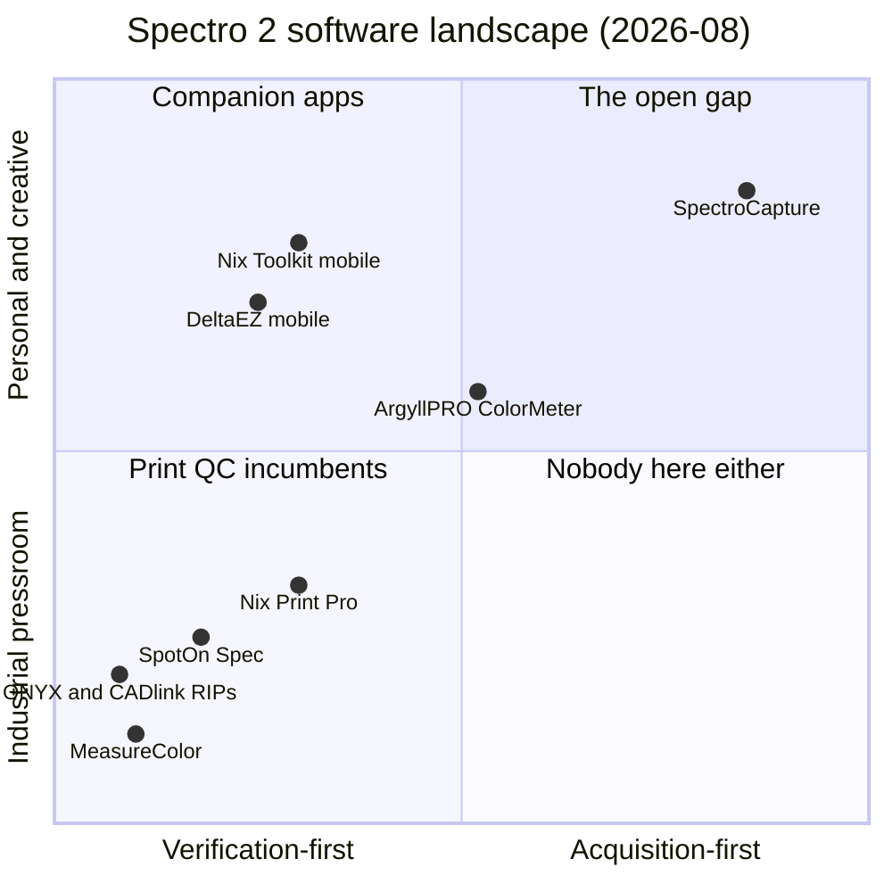

# SpectroCapture: Product Vision

**SpectroCapture** is an open-source desktop app for **bulk color acquisition**: digitize an entire physical color collection (an inventory of swatches, samples, or products) as fast as you can physically scan, with measurement-grade fidelity.

For collectors, creatives, and makers who own a spectrophotometer and want their colors as *data*, SpectroCapture is the acquisition-first tool in an ecosystem built entirely for verification. Every desktop app that talks to this hardware today is print-QC software, built to answer "does this print match the standard?", and one-scan-at-a-time. 

SpectroCapture answers the question none of them ask: *Can I get my whole collection scanned in efficiently?* Import the inventory first, then scan heads-down through it, with no per-item metadata entry between scans. Everything lands in a local, portable, queryable database that you own, and the code is open: the only open-source option on hardware the open color-management ecosystem otherwise can't reach.

## Problems

- **Digitizing a color collection with existing  software means per-scan metadata entry.** The workflow is inverted for bulk work, so a 200-item collection will focus on scanning those items, not data entry + scanning.
- **Buying software doesn't fix it, at any price.** Every desktop tool that speaks to  hardware (Print Pro, SpotOn at $299–499/yr, etc) is *verification* software, built to answer "does this sample match the standard?" No product on the market answers "*can I get my whole collection scanned in efficiently*?"
- **The instrument's data is stranded.** A $1k+ spectrophotometer's measurements live inside vendor and account-bound apps with partial, lossy export, and the open color tools people already trust (Argyll CMS, SpectraShop) can't even connect to the device.. Owners can't get full-fidelity spectral data into their own hands as a queryable, portable dataset.
- **Out-of-gamut reality is hidden.** Monitors silently render "closest color," so users can't tell which collection colors are faithfully renderable and which aren't.

## Competitive position

The question "what do I buy if I don't want to use a mobile app?" turned out to have a cheap answer and a wrong-shaped one. Nix's **Print Pro** has a free desktop tier (macOS/Windows) and **SpotOn Spec** costs $299–499/yr. But both, like other tools (MeasureColor, RIPs, tinting, textile), are **verification software**: measure a sample, compare to a standard, report. Meanwhile the **open, instrument-agnostic ecosystem** (Argyll CMS, SpectraShop, PatchTool) can't touch certain hardware at all. Two consequences define our position:

1. **Acquisition-first is an unclaimed category.** Nobody (first-party, partner, or open source) does inventory-first bulk capture or absolute-space collection visualization, at any price.
2. **Openness is a structural moat, granted at the vendor's pleasure.** We'd be the only open-source tool. No account-model vendor product will match that position.
3. **The white space holds on the open-source side too**. Nothing acquisition-first exists anywhere. The nearest neighbors are ArgyllPRO ColorMeter (~$99, Android: broad instrument support, but a measurement *log*, not collections) and texchroma, an active research pilot cataloguing textile collections with a Nix sensor. That pilot is also evidence the cataloger persona generalizes beyond personal collections. Nobody pairs instrument breadth with an acquisition workflow; that pairing is the long-term product.

*Reading the map: every incumbent clusters in the verify × industrial quadrant; the mobile companions serve personal users but only one scan at a time. The acquire × personal quadrant is empty; that's where SpectroCapture stands, alone.*

## Personas

| Persona                       | Type      | Cares about                                                             | Primary subjects                                                    |
| ----------------------------- | --------- | ----------------------------------------------------------------------- | ------------------------------------------------------------------- |
| **Cataloger** (primary)       | Primary   | Digitize my whole collection accurately, in one sitting, without delay. | Markers, swatch books, paints, inks. Any physical color collection. |
| **QC re-checker**             | Secondary | Does this subject still match the color I recorded?                     | Aging items, re-purchases, refills                                  |
| **Data consumer**             | Secondary | Get the data out with full fidelity to feed my own tools.               | CSV exports, direct SQLite queries, the visualizations              |
| **Contributor** (open source) | Secondary | Build features and fix issues.                                          | Mock-device layer, test suite, CI                                   |

*Signal for later: heritage/textile collection cataloguing (the texchroma pilot) suggests "cataloger" generalizes well beyond personal collections; institutional curators are a plausible future persona, not a v1 target.*

## Use cases

| #   | Use case                                  | Persona                   | What serves it                                                                       |
| --- | ----------------------------------------- | ------------------------- | ------------------------------------------------------------------------------------ |
| U1  | **Bulk-digitize a predefined inventory**  | Cataloger                 | CSV import with column mapping → queued scan, 1–5 samples/row averaged               |
| U2  | **Capture a single new item ad hoc**      | Cataloger                 | metadata-first single capture into a chosen collection                               |
| U3  | **Start a session with a healthy device** | Cataloger                 | known-device management (BLE + USB), calibration-due prompt, QR-tile calibration     |
| U4  | **Verify a color still matches**          | QC re-checker             | QC scan + delta E (ΔE2000 default) vs the canonical value, stored alongside          |
| U5  | **Fix a bad scan without losing history** | Cataloger                 | re-scan updates the canonical value; prior values kept as version history            |
| U6  | **Use the data outside the app**          | Data consumer             | CSV export (metadata + wavelengths + Lab/XYZ/LCh/Luv/sRGB/HSL) · direct SQLite query |
| U7  | **See the collection honestly**           | Data consumer / Cataloger | 3D absolute-space plot + gamut-aware swatch grid (renderable vs not, marked)         |
| U8  | **Scan where there is no internet**       | Cataloger                 | offline-first design + per-device pre-authorization ("Offline use through ⟨date⟩")           |
| U9  | **Contribute code without hardware**      | Contributor               | mock-device layer behind the device-service interface; what CI exercises             |

**v2 candidates** (mapped from the feature list): printer/output-profile gamut analysis (U7 extension) · Sheets/Excel direct import (U1) · density data for print workflows (new persona: print operator) · multi-collection compare (U7).

## Primary User journeys

This section outlines the primary user journeys for SpectroCapture. Additional journeys will be covered in the SpectoCapture PRDs.

### J1. First run (cataloger)

1. Install & open the app
2. Enter the license credential once (stored locally, silently re-activated offline every launch)
3. Discover the device (~20s scan, strongest signal first) → connect
  - **Risk points:** Bluetooth permission denial; the device's *first-ever* connect needs internet (serial authorization); a missing usage string may crash the app, caught in CI rather than by users.
4. Walk the QR-tile calibration → ready.

### J2. The bulk session (cataloger)

1. Import the inventory CSV
2. Map identifier + metadata columns
3. The queue opens on row 1
4. Scan 1–5 samples, haptic buzz confirms where available, row auto-advances
5. Repeat heads-down to the end
6. Collection is browsable, exportable, plotted. Target pace: limited by the device's scan cycle, not by the UI.

- **Risk points:** ambient-light/battery/temperature failures mid-run (inline retry / skip / flag-row); calibration-due tripping mid-session (prompted *before* the session instead); scan cycle time unknown until the spike.

### J3. The QC pass (re-checker)

1. Open an item from the collection
2. "QC scan"
  - Same multi-sample averaging → ΔE verdict against the canonical value, with the delta stored as its own record.
  - Canonical never overwritten.
  - **Note:** Same-device workflow keeps reference whites consistent, so deltas are always well-defined.
3. ΔE verdict against the canonical value displayed
4. Cataloger amends the item with metadata about the item being scanned (e.g. "new marker")

### J4. Data out (data consumer)

1. Select an entire collection or a single item in the collection
2. Export to CSV (or open the SQLite file in any client)
  - Full wavelength data plus CIE XYZ, CIE LAB, RGB, etc.; sRGB columns carry the gamut-clipped flag so downstream users inherit the honesty, not just the numbers.
3. Data consumer uses the result in their color application.

### J5. First contribution (contributor)

1. Clone
2. Make changes
3. Build
4. Run the app against the mock device
5. Tests pass in CI
6. PR

- **Risk point:** device-path changes still need a hardware owner to verify; those PRs get a `needs-hardware-verify` label rather than blocking the loop.

### J6. The offline session (cataloger)

1. Before leaving connectivity (storage unit, studio, archive, anywhere without wifi), open the device panel
2. Check "Offline use through 〈date〉" and extend offline use if the window is short
3. Go offline; run a full bulk session (J2) with no internet at all, since activation and scanning are both local within the window
4. Return online later; the next authorization check happens silently

- **Risk point:** an expired window away from connectivity surfaces as a clear "reconnect to internet once" state before the session starts, never as a mystery disconnect mid-queue.
- **Risk point:** whether the offline window can be extended proactively (rather than only renewed by an online reconnect) is unverified against the vendor SDK — the device-management PRD's open questions track it; if it cannot, this journey degrades to "connect once every authorization cycle."

### J7. Migrating in from the vendor apps (cataloger; v2 candidate)

1. Export existing scans from the vendor's app into an interchange file where possible
2. Import into SpectroCapture as a collection (CxF is the industry interchange format)
3. Existing colors become canonical values; future scans layer QC and history on top

- **Risk point:** whether the mobile Toolkit app can export at all is an open research gap; migration may only be possible from the desktop vendor app or by re-scanning. This journey ships with CxF support (v2), not v1.

## Feature list

### v1

*Priority is build order within v1, not a cut line: everything in this table ships in v1, P0 first, P2 last.*

| Pri | Feature                                          | Serves | Notes                                                                               |
| --- | ------------------------------------------------ | ------ | ----------------------------------------------------------------------------------- |
| P0  | Spectro 2/L connect (BLE + USB)                  | U3     | The only real instrument family in v1                                               |
| P0  | Known-device management                          | U3     | Serial number is the durable device identity                                        |
| P0  | Tile calibration with due-prompts                | U3     | Prompted before a session, not mid-queue                                            |
| P0  | CSV inventory import with column mapping         | U1     | The inventory-first wedge                                                           |
| P0  | Queued bulk scan, 1–5 samples averaged           | U1     | Heads-down; haptic confirm where available; row auto-advance                        |
| P0  | Inline scan-failure handling                     | U1     | Retry / skip / flag-row for light, battery, temperature errors                      |
| P0  | Collections + version history                    | U5     | Corrections never destroy data                                                      |
| P0  | CSV export, spectral + derived spaces            | U6     | Lab/XYZ/LCh/Luv/sRGB/HSL; sRGB/HSL flagged as gamut-clipped                         |
| P0  | Local SQLite store, raw payload canonical        | U5, U6 | The file is the whole system: portable, queryable                                   |
| P0  | Offline operation + per-device pre-authorization | U8     | "Offline use through 〈date〉" surfaced in the device panel                           |
| P0  | Mock-device layer                                | U9     | App runs, tests, and takes contributions with no hardware or key; what CI exercises |
| P1  | Ad-hoc single capture                            | U2     | Metadata-first, into a chosen collection                                            |
| P1  | QC delta E vs canonical                          | U4     | ΔE2000 default; parity-minimum by design (competitive position)                     |
| P2  | 3D absolute-space plot                           | U7     | Unserved anywhere in the market                                                     |
| P2  | Gamut-aware swatch grid                          | U7     | Renderable vs not, marked honestly                                                  |

### v2 candidates

| Feature                               | Builds on                   | Notes                                                                                                                                           |
| ------------------------------------- | --------------------------- | ----------------------------------------------------------------------------------------------------------------------------------------------- |
| Printer/output-profile gamut analysis | U7                          | Needs ICC profile handling                                                                                                                      |
| Sheets/Excel direct import            | U1                          | CSV covers v1                                                                                                                                   |
| Density data for print workflows      | New persona: print operator | A license feature; also nearer the QC turf we avoid                                                                                             |
| Multi-collection compare              | U7                          |                                                                                                                                                 |
| CxF import/export                     | U6, J7                      | Industry interchange; migration path in from vendor apps                                                                                        |
| Multi-instrument support (core team)  | J2 on more hardware         | One expansion step brings ~30 instruments across X-Rite, Klein, JETI, Datacolor into scope; also unties the product's fate from a single vendor. v2 sequences the *core team's* investment only — per STRATEGY.md, the device seam is open to community instrument contributions at any time, merged when a hardware owner verifies them; the core team builds and validates Nix Spectro 2/L only through v1 |

### Non-goals

| Non-goal                                   | Why                                                                                                                                                                               |
| ------------------------------------------ | --------------------------------------------------------------------------------------------------------------------------------------------------------------------------------- |
| Color libraries (PANTONE/RAL/NCS matching) | Deliberate SDK boundary, and a licensing project of its own                                                                                                                       |
| iOS                                        | Desktop is the product                                                                                                                                                            |
| Windows/Linux                              | v1 builds for macOS only; "desktop app" keeps positioning open, but a port means the vendor's separate Windows SDK and a second codebase, so that door reopens via ADR, not drift |
| Multiple simultaneous devices              | No workflow needs it; SDK connects one at a time anyway                                                                                                                           |
| Cloud sync                                 | The SQLite file is the sync strategy                                                                                                                                              |

